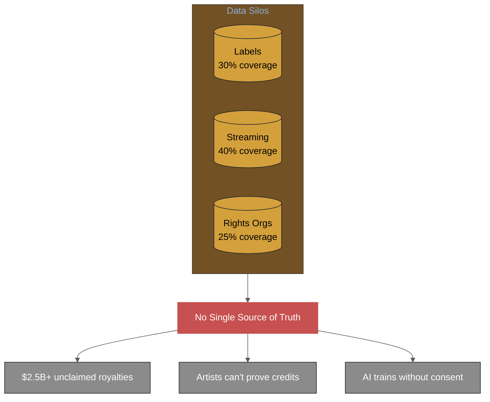
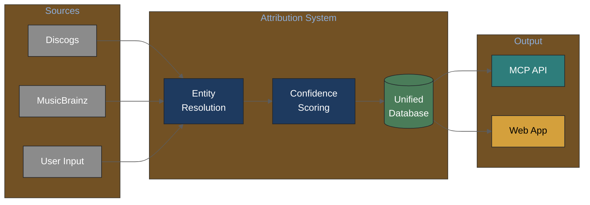
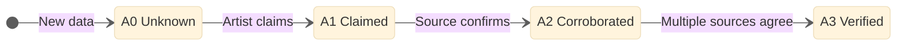
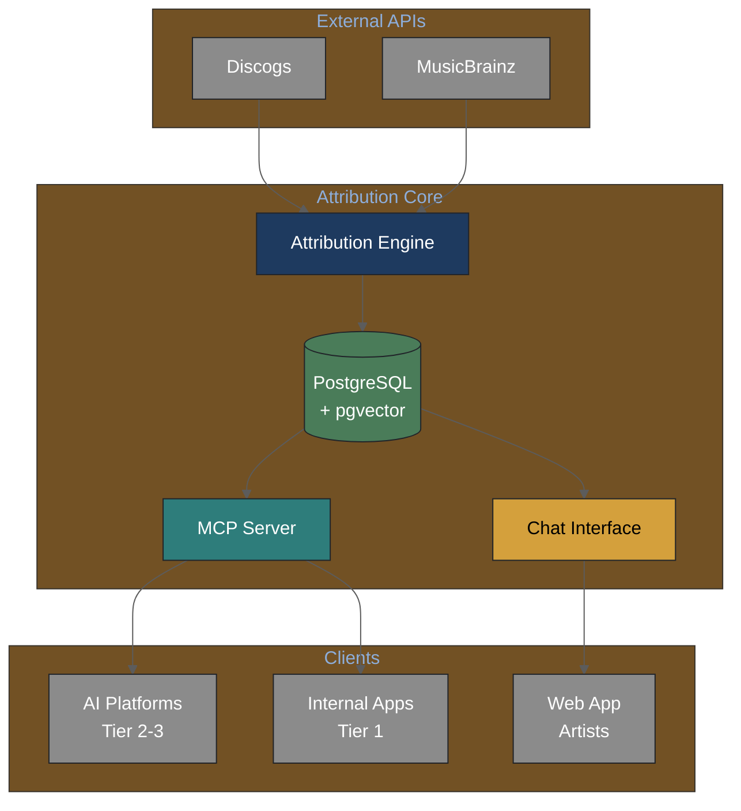

# Music Attribution Scaffold

[](https://www.python.org/downloads/)
[](https://opensource.org/licenses/MIT)
[](https://github.com/astral-sh/ruff)
[](https://mypy-lang.org/)
[](https://docs.astral.sh/uv/)

**Open-source research scaffold for music attribution with transparent confidence scoring.**

Companion code to: **Teikari, P. (2026). *Music Attribution with Transparent Confidence*. SSRN No. 6109087.**
[Read the preprint](https://papers.ssrn.com/sol3/papers.cfm?abstract_id=6109087)

This scaffold demonstrates how to build a multi-source music attribution system with per-field confidence scores, entity resolution, and AI-ready permissions via the MCP protocol.

---

## Who We Build For


*Artists, producers, session musicians, and the creative teams who deserve proper credit.*

---

## What You Get


*From invisible to verified. From chaos to control.*

---

## The Problem



**40%+ of music metadata is wrong.** Labels, streaming platforms, and rights organizations each hold partial data. No single source has the complete picture — and artists pay the price.

---

## The Solution


*Multiple sources in. One verified truth out.*



The system **aggregates multiple sources** through entity resolution, producing unified records with **per-field confidence scores** and full provenance tracking.

---

## Attribution Levels


*Your word matters. When YOU claim a credit, that's the start of verification — not the end.*



Every attribution progresses through **four trust levels**:
- **A0 Unknown**: Data exists but unverified
- **A1 Claimed**: Artist asserts the credit
- **A2 Corroborated**: One external source confirms
- **A3 Verified**: Multiple sources agree with high confidence

---

## How Sure Are We?


*Every credit comes with a number. Higher = more trustworthy.*

---

## A Day with the System


*Check. Fix. Decide. That's it.*

---

## Two-Way Conversation


*You control what goes in. You control who asks.*

---

## AI Asks Permission


*AI can't just take your music. They have to ask — and YOU decide.*

---

## Your Music, Your Rules


*Turn access on or off. It's your call.*

---

## System Architecture



| Component | Purpose |
|-----------|---------|
| **Attribution Engine** | Multi-source aggregation with entity resolution |
| **MCP Server** | AI-friendly API with three-tier access control |
| **Chat Interface** | Conversational gap-filling for artists |
| **PostgreSQL + pgvector** | Vector-enabled database for similarity search |

## Key Features

- **Multi-source truth**: Aggregate Discogs, MusicBrainz, and user contributions
- **Transparent confidence**: Every field has a confidence score with provenance
- **Calibrated uncertainty**: Conformal prediction for statistically valid bounds
- **AI-ready**: MCP protocol for ethical AI training with consent

## Documentation

| Document | Description |
|----------|-------------|
| [Vision PRD](docs/prd/vision-v1.md) | Product vision and strategy |
| [Architecture](docs/architecture/README.md) | System design, ADRs, and technical diagrams |
| [Knowledge Base](docs/knowledge-base/README.md) | Domain and technical knowledge |
| [Figures](docs/figures/README.md) | Visual documentation gallery |

## Quick Start

```bash
# Install dependencies (requires uv)
uv sync

# Run tests
make test

# Run linting
make lint
```

> **Note**: This project uses [uv](https://docs.astral.sh/uv/) for package management. pip/conda are not supported.

## Development

```bash
# Install dev dependencies
make install-dev

# Run tests with coverage
make test-cov

# Run CI locally (Docker)
make ci-docker
```

## Tech Stack

| Category | Choice |
|----------|--------|
| Language | Python 3.13 |
| Package Manager | uv (only) |
| Database | PostgreSQL + pgvector |
| Uncertainty | MAPIE (conformal prediction) |
| AI Integration | MCP protocol |
| Linting | Ruff |
| Type Checking | mypy |

## Citation

If you use this scaffold in your research, please cite:

```bibtex
@article{teikari2026music,
  title={Music Attribution with Transparent Confidence},
  author={Teikari, Petteri},
  journal={SSRN},
  number={6109087},
  year={2026}
}
```

## License

MIT
