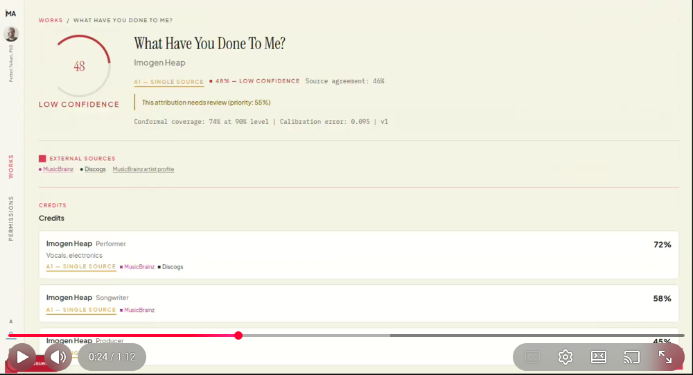
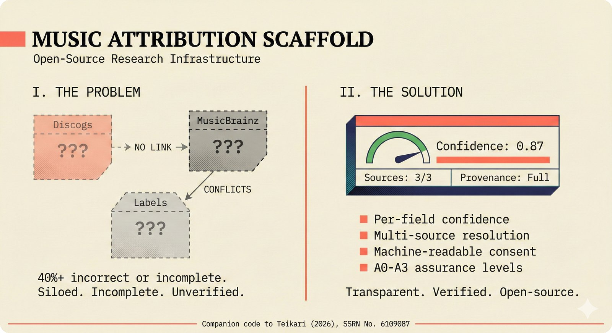
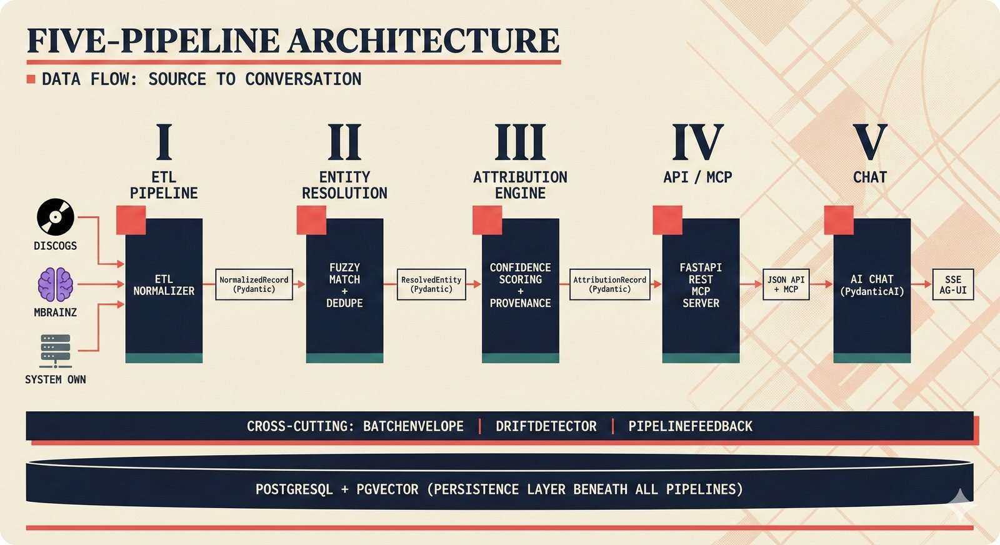
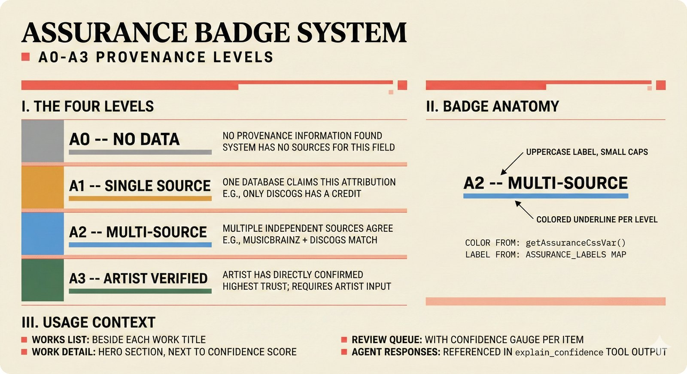
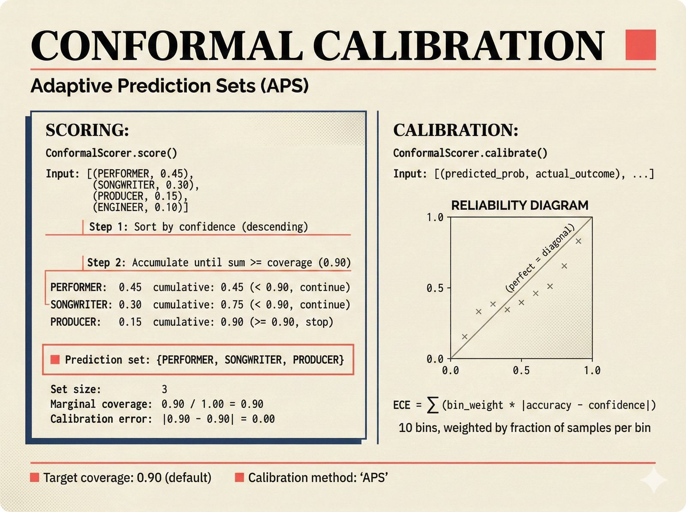
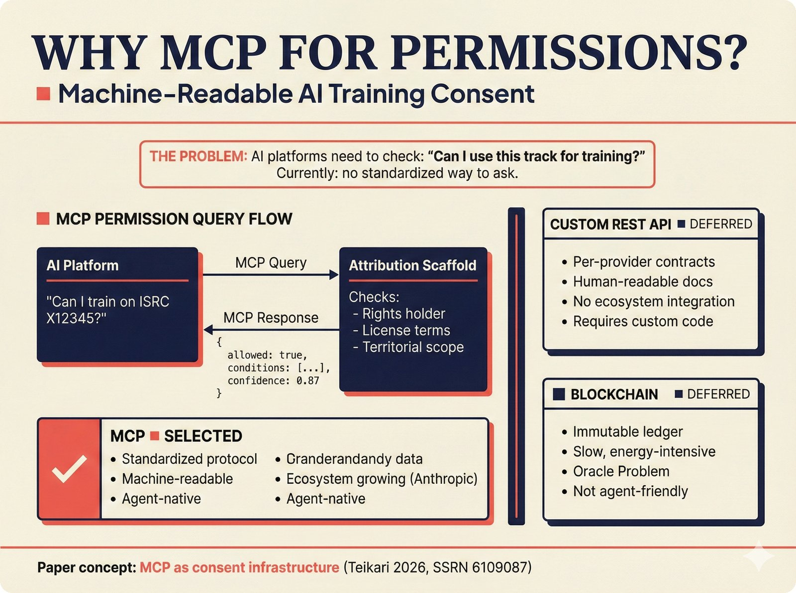
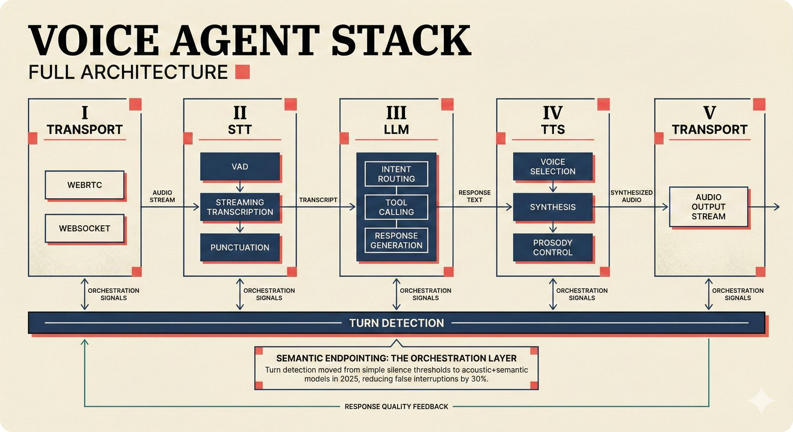
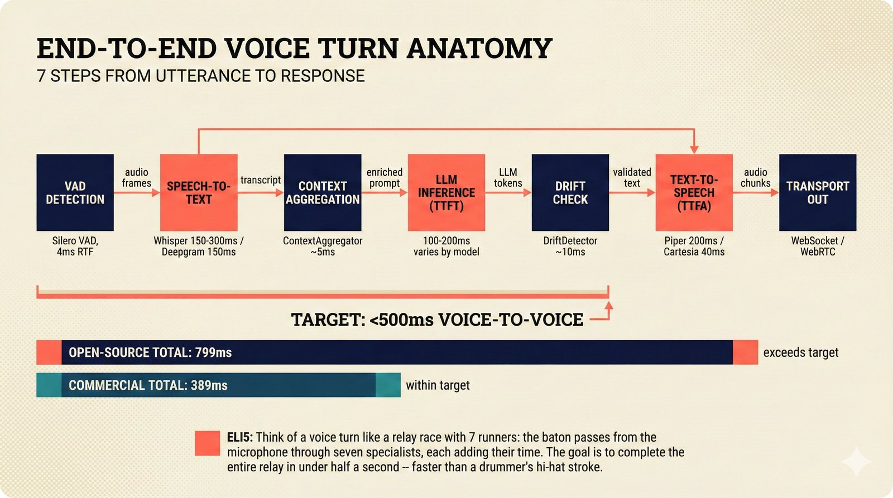

# Music Attribution Scaffold

<p align="center">
  <a href="https://youtu.be/7wuUiH8YmSQ?si=6TwuK7evAKFHoi_i">
    
  </a>
</p>

<p align="center"><strong>▶ <a href="https://youtu.be/7wuUiH8YmSQ?si=6TwuK7evAKFHoi_i">Watch the 1-minute demo</a></strong> · <strong>📄 <a href="https://dx.doi.org/10.2139/ssrn.6109087">Read the paper</a></strong> (supplementary material includes an annotated screenshot walkthrough)</p>

[](https://github.com/petteriTeikari/music-attribution-scaffold/actions/workflows/ci.yml)
[](tests/)
[](https://www.python.org/downloads/)
[](https://opensource.org/licenses/MIT)
[](https://doi.org/10.5281/zenodo.PLACEHOLDER)
[](https://github.com/astral-sh/ruff)
[](https://mypy-lang.org/)
[](https://docs.astral.sh/uv/)
[](https://petteriTeikari.github.io/music-attribution-scaffold/)

**Research-grade music attribution infrastructure with calibrated confidence scoring, multi-source entity resolution, and machine-readable consent.**

> Music metadata is broken — over 40% of records are incorrect or incomplete across databases that don't talk to each other. When generative AI adds millions of new tracks per month, knowing who made what becomes both a legal and economic emergency. This scaffold provides the open-source infrastructure to address it.

<p align="center">
  
</p>

<p align="center"><em>The scaffold unifies fragmented music metadata into confidence-scored attribution records with transparent provenance.</em></p>

---

## What It Does

| Capability | What It Means | Deep Dive |
|---|---|---|
| **Multi-source ETL** | Fetches and normalizes metadata from MusicBrainz, Discogs, AcoustID, audio file tags, and artist self-reports | [`src/music_attribution/etl/`](src/music_attribution/etl/) · [Docs](https://petteriTeikari.github.io/music-attribution-scaffold/api-reference/etl/) |
| **Entity resolution** | 5-strategy cascade: identifiers → fuzzy strings → embeddings → graph → LLM disambiguation | [`src/music_attribution/resolution/`](src/music_attribution/resolution/) · [Docs](https://petteriTeikari.github.io/music-attribution-scaffold/api-reference/resolution/) |
| **Calibrated confidence** | Per-field scores via conformal prediction — "90% confident" actually means ≥90% coverage | [`src/music_attribution/attribution/`](src/music_attribution/attribution/) · [Docs](https://petteriTeikari.github.io/music-attribution-scaffold/api-reference/attribution/) |
| **Permission patchbay** | MCP server for machine-readable AI training consent (ALLOW / DENY / ASK) | [`src/music_attribution/mcp/`](src/music_attribution/mcp/) · [Docs](https://petteriTeikari.github.io/music-attribution-scaffold/api-reference/mcp/) |
| **Agentic UI** | PydanticAI agent + CopilotKit sidebar for natural-language attribution queries | [`src/music_attribution/chat/`](src/music_attribution/chat/) · [Docs](https://petteriTeikari.github.io/music-attribution-scaffold/user-guide/agent/) |
| **Voice agent** | Pipecat voice pipeline with 5-dimension persona, drift detection, and domain tools | [`src/music_attribution/voice/`](src/music_attribution/voice/) · [Guide](docs/tutorials/voice-agent-implementation.md) |
| **Editorial frontend** | Next.js 15 with confidence gauges, assurance badges, review queue | [`frontend/`](frontend/) · [Docs](https://petteriTeikari.github.io/music-attribution-scaffold/user-guide/frontend/) |

<details>
<summary><strong>How does the 5-strategy entity resolution cascade work?</strong></summary>

Entity resolution answers: "Is the 'Imogen Heap' in MusicBrainz the same person as 'I. Heap' in a Discogs release?" The cascade progresses from cheap/certain to expensive/uncertain:

1. **Identifier matching** — Exact ISRC, ISWC, ISNI, or MBID match. Cheapest and most reliable.
2. **String similarity** — Jaro-Winkler and token-sort ratio on canonical names and aliases. Handles typos and transliterations.
3. **Embedding similarity** — Sentence-transformer embeddings compared via cosine similarity. Catches semantic equivalences that string metrics miss (e.g., "紫雨林" ↔ "Jaurim").
4. **Graph evidence** — Shared collaborators, labels, or recordings boost match probability via Jaccard coefficient.
5. **LLM disambiguation** — For remaining ambiguous cases, an LLM evaluates contextual evidence. Cost-gated and cached.

Each stage produces a confidence score. The cascade short-circuits: if Stage 1 finds a high-confidence match, Stages 2–5 are skipped.

**References**: Fellegi & Sunter (1969) — foundational probabilistic record linkage model; Papadakis et al. (2021) — modern entity resolution survey.

</details>

---

## Architecture

Five sequential pipelines connected by typed Pydantic boundary objects:

<p align="center">
  
</p>

```
  I. ETL          II. ENTITY         III. ATTRIBUTION    IV. API/MCP      V. CHAT
  PIPELINE         RESOLUTION         ENGINE
  ┌─────────┐     ┌─────────────┐    ┌────────────┐     ┌──────────┐    ┌──────┐
  │ Discogs │     │ Fuzzy match │    │ Confidence │     │ FastAPI  │    │ AI   │
  │ MBrainz │────▶│ + dedupe    │───▶│ scoring +  │────▶│ REST +   │───▶│ Chat │
  │ AcoustID│     │ + graph     │    │ provenance │     │ MCP      │    │      │
  └─────────┘     └─────────────┘    └────────────┘     └──────────┘    └──────┘
       │                │                  │                  │              │
  NormalizedRecord  ResolvedEntity   AttributionRecord    JSON + MCP     AG-UI SSE

  Cross-cutting: BatchEnvelope · DriftDetector · PipelineFeedback
  Storage:       PostgreSQL + pgvector
```

Each boundary crossing carries validation, confidence scores, and provenance metadata. Reverse feedback flows (dispute signals, recalibration requests) travel upstream via `PipelineFeedback` objects.

**Full architecture docs**: [Architecture Overview](https://petteriTeikari.github.io/music-attribution-scaffold/user-guide/architecture/) · [Backend Guide](https://petteriTeikari.github.io/music-attribution-scaffold/user-guide/backend/) · [`docs/architecture/`](docs/architecture/)

---

## Quick Start

### Prerequisites

- **Python 3.13+** and [uv](https://docs.astral.sh/uv/)
- **Docker** and Docker Compose (for PostgreSQL + pgvector)
- **Node.js 18+** and npm (for the frontend)

### Setup

```bash
git clone https://github.com/petteriTeikari/music-attribution-scaffold.git
cd music-attribution-scaffold

# Install deps, start Docker, run migrations, seed Imogen Heap data
make setup

# Start the backend API + PostgreSQL
make dev
# → http://localhost:8000 (Swagger at /docs)

# In a second terminal: start the frontend
make dev-frontend
# → http://localhost:3000

# Or: full agentic UI (backend + CopilotKit sidebar)
make agent
```

<details>
<summary><strong>Environment variables</strong></summary>

| Variable | Required | Default | Purpose |
|---|---|---|---|
| `DATABASE_URL` | Yes | — | PostgreSQL connection string |
| `ANTHROPIC_API_KEY` | For agent | — | Anthropic API key for the PydanticAI agent |
| `ATTRIBUTION_AGENT_MODEL` | No | `anthropic:claude-haiku-4-5` | PydanticAI model string |
| `CORS_ORIGINS` | No | `http://localhost:3000` | Comma-separated CORS origins |
| `NEXT_PUBLIC_API_URL` | No | `http://localhost:8000` | Backend URL for the frontend |
| `LOG_LEVEL` | No | `INFO` | Python logging level |
| `ENVIRONMENT` | No | `development` | Runtime environment |

Create a `.env` file in the project root, or export directly. See [`src/music_attribution/config.py`](src/music_attribution/config.py) for all options.

</details>

<details>
<summary><strong>Make commands reference</strong></summary>

| Command | What It Does |
|---|---|
| `make setup` | Full setup: deps + Docker + migrations + seed data |
| `make dev` | Start backend API + PostgreSQL |
| `make dev-frontend` | Start frontend dev server |
| `make agent` | Start full agentic UI (backend + CopilotKit) |
| `make test-local` | Run 687 unit + 43 integration tests locally |
| `make test` | Run 744 tests in Docker (CI-parity) |
| `make test-frontend` | Run 560 Vitest tests + WCAG checks |
| `make test-all` | Full CI: lint + typecheck + backend + frontend |
| `make lint-local` | ruff check + ruff format --check |
| `make typecheck` | mypy (strict) |
| `make test-cov` | pytest with coverage report |
| `make format` | Auto-format with ruff |

</details>

---

## Assurance Levels (A0–A3)

Every attribution carries an assurance level indicating verification depth. These are mapped to international music industry identifiers:

<p align="center">
  
</p>

| Level | Verification | Evidence | Typical Identifier | Example |
|---|---|---|---|---|
| **A0** | None | Self-declared | — | "I wrote this song" (no external confirmation) |
| **A1** | Single source | One database confirms | [ISRC](https://www.ifpi.org/isrc/) | MusicBrainz lists the recording |
| **A2** | Multi-source | Independent sources agree | [ISWC](https://www.iswc.org/) | MusicBrainz + Discogs + file metadata agree |
| **A3** | Identity-verified | Full provenance chain | [ISNI](https://isni.org/) / [IPI](https://www.cisac.org/) | Artist self-report + ISNI + multiple databases |

<details>
<summary><strong>How are assurance levels computed?</strong></summary>

Assurance levels are determined by the entity resolution cascade and the number of independent sources that agree:

- **A0**: No external data available. The system has only what the user claimed.
- **A1**: Exactly one external source confirms (e.g., MusicBrainz has a matching ISRC). Confidence is moderate but un-corroborated.
- **A2**: Two or more independent sources produce consistent information. Cross-source agreement significantly increases confidence.
- **A3**: Identity-verified through a chain that includes artist self-report AND an identity standard (ISNI or IPI) AND at least one database match. This is the highest tier — reserved for attributions where the creator's identity is cryptographically or administratively confirmed.

The mapping between assurance levels and identifiers is project-defined and reflects industry best practices, not a formal standard.

**Concept page**: [Assurance Levels](https://petteriTeikari.github.io/music-attribution-scaffold/concepts/assurance-levels/)

</details>

---

## Confidence Scoring

Every attribution field carries a calibrated confidence score. Unlike typical ML "confidence" (often miscalibrated), the scaffold uses **conformal prediction** with Adaptive Prediction Sets (APS) to provide **distribution-free** coverage guarantees.

<p align="center">
  
</p>

<details>
<summary><strong>What is conformal prediction and why does it matter?</strong></summary>

Traditional ML "confidence scores" are often miscalibrated — a model might say "95% confident" when it's actually correct only 70% of the time. In attribution, this is dangerous: overstating confidence in who created a song can have legal and financial consequences.

Conformal prediction provides **distribution-free** coverage guarantees:

1. Learns a nonconformity score from calibration data (how "unusual" each prediction is).
2. At inference, constructs a prediction set that contains the true value with probability ≥ (1 - α).
3. If α = 0.10, the resulting 90% prediction set genuinely covers the truth ≥ 90% of the time — no distributional assumptions required.

The scaffold calibrates every attribution field: confidence in creator identity, confidence in role assignment, confidence in recording-to-work linkage.

**References**: Angelopoulos & Bates (2025) — conformal prediction tutorial; Quach et al. (2024) — conformal prediction applied to language model uncertainty.

**Concept page**: [Conformal Prediction](https://petteriTeikari.github.io/music-attribution-scaffold/concepts/conformal-prediction/)

</details>

---

## MCP Consent Infrastructure

The scaffold includes a [Model Context Protocol](https://modelcontextprotocol.io/) (MCP) server that provides **machine-readable permission queries** for AI training rights. AI platforms can ask "may I use this recording for training?" and receive structured responses.

<p align="center">
  
</p>

```
AI Platform                    MCP Server                    Rights DB
    │                              │                            │
    │── check_permission ─────────▶│                            │
    │   (recording_id, use_type)   │── query rights ──────────▶│
    │                              │◀── permission + conditions─│
    │◀── ALLOW / DENY / ASK ──────│                            │
    │    + conditions, expiry      │                            │
```

Responses include: permission status, conditions (attribution required, non-commercial only, etc.), expiry dates, and rights holder contact for ASK responses.

**Concept page**: [MCP Consent](https://petteriTeikari.github.io/music-attribution-scaffold/concepts/mcp-consent/) · **Implementation**: [`src/music_attribution/mcp/`](src/music_attribution/mcp/)

---

## Voice Agent (Experimental)

The scaffold includes an open-source voice agent built on [Pipecat](https://github.com/pipecat-ai/pipecat) (BSD-2-Clause, 10.4k stars). The same 4 domain tools available in the text agent are exposed as voice-callable functions -- ask about confidence scores, search attributions, suggest corrections, and submit feedback by speaking.



*Five-panel architecture: Transport → STT → LLM → TTS → Transport, with semantic endpointing as the orchestration layer.*

```bash
# Quick start — zero API keys, fully local
uv run python scripts/voice_demo.py

# With custom providers
uv run python scripts/voice_demo.py --stt deepgram --tts elevenlabs

# With drift monitoring
uv run python scripts/voice_demo.py --drift-monitoring --verbose
```

The pipeline in three lines:

```
Mic → [Silero VAD → STT → ContextAggregator → LLM (4 tools) → DriftMonitor → TTS] → Speaker
       └─ Pipecat Pipeline ──────────────────────────────────────────────────┘
```

**This is a scaffold, not a production voice product.** Every component is swappable with a one-line config change:

| Layer | Default (Zero-Cost) | Commercial Alternative | Config |
|---|---|---|---|
| **STT** | Whisper (MIT) | Deepgram Nova-3, AssemblyAI | `VOICE_STT_PROVIDER` |
| **TTS** | Piper (GPL) / Kokoro (Apache 2.0) | ElevenLabs, Cartesia | `VOICE_TTS_PROVIDER` |
| **Transport** | WebSocket | SmallWebRTC, Daily WebRTC | `VOICE_TRANSPORT` |
| **LLM** | Any OpenAI-compatible (Ollama, vLLM) | Anthropic, OpenAI | `VOICE_LLM_MODEL` |
| **Persona** | 5-dimension prompt-layered | Letta (MemGPT), Mem0 | `VOICE_PERSONA_ENABLED` |
| **Drift** | EWMA cosine similarity | -- | `VOICE_DRIFT_MONITORING` |
| **Guardrails** | Regex fallback | NeMo Guardrails (Colang 2.0) | `VOICE_GUARDRAILS_ENABLED` |

### What Makes This Different

- **Scaffold, not product**: Branching paths for every component -- teams with different constraints (budget, latency, licensing) can instantiate different stacks from the same blueprint
- **Zero-API-key local dev**: Default stack (Whisper + Piper + WebSocket) runs entirely on your machine at $0.00/min
- **Protocol-based swapping**: `STTServiceProtocol`, `TTSServiceProtocol`, and `DriftDetectorProtocol` use Python structural typing -- implement the methods and it just works, no inheritance required
- **Persona drift prevention**: 5-dimension persona architecture with EWMA-smoothed drift detection prevents the 8-turn persona drift cliff documented in the literature (Li et al., 2024)
- **Conditional imports**: Config, persona, drift, and tool schemas work without Pipecat installed -- only `build_pipecat_pipeline()` requires the actual library. All 161 voice tests pass in both modes

### Benchmarks (RTX 2070 Super)

STT inference is the latency bottleneck. GPU acceleration provides 4–16x speedup over CPU, with larger models benefiting disproportionately:

| Component | Model | CPU | GPU (CUDA) | Speedup |
|---|---|---|---|---|
| **STT** (faster-whisper) | tiny | 801 ms | 188 ms | **4.3x** |
| **STT** (faster-whisper) | small | 4,316 ms | 267 ms | **16.2x** |
| **Drift detection** | all-MiniLM-L6-v2 | 4.4 ms | — | — |

*Measured on NVIDIA GeForce RTX 2070 Super (7.6 GB VRAM), PyTorch 2.10.0+cu128, 10-second synthetic 440 Hz sine wave (16 kHz, 16-bit PCM). CPU uses int8 quantization; GPU uses float16. Model load times: tiny CPU 5.9s vs CUDA 0.4s; small CPU 41.1s vs CUDA 0.4s.*

<details>
<summary><strong>Run the benchmark yourself</strong></summary>

```bash
# CPU + GPU benchmark (tiny and small models)
uv run python scripts/benchmark_voice.py --models tiny,small --output results.json

# CPU-only (no CUDA required)
uv run python scripts/benchmark_voice.py --cpu-only --models tiny

# With synthetic command accuracy (WER + domain keyword survival)
uv run python scripts/benchmark_voice.py --models tiny

# End-to-end pipeline with mock LLM (STT → LLM → TTS latency breakdown)
uv run python scripts/benchmark_voice.py --models tiny --mock-llm --llm-delay-ms 200
```

The benchmark script auto-detects hardware (CPU, GPU, VRAM), applies VRAM guards (skips models too large for available memory), and outputs structured JSON + a summary table. See [`scripts/benchmark_voice.py`](scripts/benchmark_voice.py).

</details>



*A single voice turn: 7 steps from utterance to response, targeting <500ms total.*

**Full guide**: [Voice Agent Implementation](docs/tutorials/voice-agent-implementation.md) · **Alternatives table**: [Component Alternatives](docs/knowledge-base/voice-agent-component-alternatives.md) · **Research base**: [Voice Agent Research](docs/planning/voice-agent-research/README.md) · **Figure gallery**: [48 voice figures](docs/figures/repo-figures/figure-plans/) · **Implementation**: [`src/music_attribution/voice/`](src/music_attribution/voice/)

---

## Sample Data

The scaffold ships with **9 Imogen Heap works** as seed data, spanning the full confidence spectrum from 0.00 to 0.95:

| Work | Confidence | Assurance | Sources | Status |
|---|---|---|---|---|
| Hide and Seek | 0.95 | A3 | MB, Discogs, AcoustID, Artist | Verified |
| Tiny Human | 0.91 | A3 | MB, Discogs, Artist | Verified |
| The Moment I Said It | 0.82 | A2 | MB, Discogs, File | Stable |
| Goodnight and Go | 0.72 | A2 | MB, Discogs | Stable |
| Headlock | 0.58 | A1 | MB, Discogs | Needs review |
| What Have You Done To Me? | 0.48 | A1 | MB, Discogs | Needs review |
| Just for Now | 0.35 | A1 | MB only | Needs review |
| 2-1 | 0.28 | A1 | File metadata only | Needs review |
| Blanket (unreleased) | 0.00 | A0 | None | Needs review |

Each record carries a full provenance chain showing how confidence evolved through fetch → resolve → score → review events.

<details>
<summary><strong>Why Imogen Heap?</strong></summary>

Imogen Heap is both a critically acclaimed artist and a pioneer in music attribution technology. Her [Mycelia](https://www.forbes.com/sites/shawnsetaro/2015/10/22/imogen-heap-blockchain/) project (2015) explored blockchain-based music attribution. Her discography spans well-attributed major-label releases (high confidence) through unreleased demos (zero confidence), providing natural coverage across all assurance levels.

</details>

---

## Project Structure

```
music-attribution-scaffold/
├── src/music_attribution/          # Python package
│   ├── schemas/                    # Pydantic boundary objects
│   ├── etl/                        # Data source connectors + quality gate
│   ├── resolution/                 # 5-strategy entity resolution cascade
│   ├── attribution/                # Aggregation, conformal scoring, priority queue
│   ├── api/                        # FastAPI routes: attribution, health, permissions
│   ├── chat/                       # PydanticAI agent + AG-UI endpoint
│   ├── mcp/                        # MCP permission patchbay server
│   ├── voice/                      # Pipecat voice agent pipeline + persona
│   ├── db/                         # SQLAlchemy models, 8-table schema
│   ├── search/                     # Hybrid search (text + vector + graph)
│   ├── pipeline/                   # DAG runner for orchestration
│   ├── observability/              # Prometheus metrics
│   └── seed/                       # Imogen Heap mock data
├── tests/                          # 744 tests: 687 unit + 43 integration + 14 eval
├── frontend/                       # Next.js 15, TypeScript strict, Tailwind v4
├── docker/                         # Dockerfiles: dev, test, prod
├── alembic/                        # Database migrations
├── docs/                           # MkDocs site + PRD + knowledge base
└── pyproject.toml                  # Single source of truth for all deps
```

Each module has its own README with architecture details:

| Module | README | What's Inside |
|---|---|---|
| **Python package** | [`src/music_attribution/`](src/music_attribution/README.md) | Package overview, module map |
| **ETL pipeline** | [`src/music_attribution/etl/`](src/music_attribution/etl/README.md) | Connectors, quality gate, normalization |
| **Entity resolution** | [`src/music_attribution/resolution/`](src/music_attribution/resolution/README.md) | 5-strategy cascade, Splink, embeddings |
| **Attribution engine** | [`src/music_attribution/attribution/`](src/music_attribution/attribution/README.md) | Aggregation, conformal scoring, review queue |
| **API** | [`src/music_attribution/api/`](src/music_attribution/api/README.md) | FastAPI routes, middleware, OpenAPI |
| **Chat agent** | [`src/music_attribution/chat/`](src/music_attribution/chat/README.md) | PydanticAI tools, AG-UI streaming |
| **MCP server** | [`src/music_attribution/mcp/`](src/music_attribution/mcp/README.md) | Permission queries, consent model |
| **Schemas** | [`src/music_attribution/schemas/`](src/music_attribution/schemas/README.md) | All Pydantic boundary objects |
| **Frontend** | [`frontend/`](frontend/README.md) | Next.js 15, design system, components |
| **Tests** | [`tests/`](tests/README.md) | Testing strategy, fixtures, CI |
| **Docs** | [`docs/`](docs/README.md) | MkDocs site, figures, knowledge base |
| **Architecture** | [`docs/architecture/`](docs/architecture/README.md) | System diagrams, ADRs, security |
| **PRD** | [`docs/prd/`](docs/prd/README.md) | Probabilistic decision network |

---

## Testing

**1,304 tests** across backend and frontend:

```bash
make test-local          # 744 backend tests locally (~30s)
make test                # 744 backend tests in Docker (CI-parity, ~90s)
make test-frontend       # 560 Vitest tests + WCAG accessibility checks (~15s)
make test-all            # Full CI: lint + typecheck + all tests
```

<details>
<summary><strong>Test architecture</strong></summary>

| Tier | Count | Speed | Infrastructure | What It Tests |
|---|---|---|---|---|
| **Unit** | 687 | ~30s | None (all mocked) | Business logic, schema validation, algorithm correctness |
| **Integration** | 43 | ~60s | Docker (PostgreSQL + pgvector) | Database round-trips, API endpoints, search |
| **Eval** | 14 | ~5s | None | Benchmark validation, output schema checks |
| **Frontend** | 560 | ~15s | jsdom (Vitest) | Components, hooks, stores, WCAG accessibility |
| **Smoke** | — | ~5s | Docker | Container health, migration success |

All tests run in CI via GitHub Actions with path-based filtering — backend changes don't trigger frontend CI and vice versa. See [`tests/README.md`](tests/README.md).

</details>

---

## Documentation

| Resource | Description |
|---|---|
| [**GitHub Pages site**](https://petteriTeikari.github.io/music-attribution-scaffold/) | Getting started, concepts, API reference, tutorials |
| [**Concepts**](https://petteriTeikari.github.io/music-attribution-scaffold/concepts/) | Oracle Problem, A0–A3 assurance, conformal prediction, MCP consent, entity resolution |
| [**API Reference**](https://petteriTeikari.github.io/music-attribution-scaffold/api-reference/) | Auto-generated from numpy-style docstrings (mkdocstrings) |
| [**Tutorials**](https://petteriTeikari.github.io/music-attribution-scaffold/tutorials/) | Reproducing the paper, adding data sources, API examples |
| [**Troubleshooting**](https://petteriTeikari.github.io/music-attribution-scaffold/troubleshooting/) | 15 common issues: Docker, database, testing, frontend, CI |
| [**PRD Decision Network**](docs/prd/decisions/REPORT.md) | 85 probabilistic decision nodes, 5 levels, 4 team archetypes |
| [**FinOps Landscape**](docs/planning/deployement-finops-landscape.md) | Deployment cost analysis: 5 paths, DevOps tax, cloud credits, egress optimization |
| [**Geopolitical Risk Assessment**](docs/planning/deployement-finops-landscape-geopolitical-risk-assessment.md) | Cloud sovereignty: CLOUD Act, EU providers, Schrems III, Section 301 |
| [**Knowledge Base**](docs/knowledge-base/README.md) | RAG-optimized markdown: attribution papers, agentic systems research |
| [**Pitch Deck**](https://petteriTeikari.github.io/music-attribution-scaffold/pitch-deck/) | 12 investor slides: market, architecture, moat, revenue, roadmap |
| [**Advanced Due Diligence**](https://petteriTeikari.github.io/music-attribution-scaffold/pitch-deck-advanced/) | 18 deep-dive slides: technical, competitive, financial, team |

Preview docs locally:

```bash
uv sync --group docs && uv run --group docs mkdocs serve
# → http://localhost:8000
```

---

## Music AI Attribution Landscape

The music AI attribution space is undergoing rapid consolidation. This section provides a compact overview — see the [full landscape report](docs/planning/music-tech-landscape/README.md) for detailed company profiles, academic papers, and buy-vs-build analysis.

### Attribution Infrastructure

| Company | Approach | Funding | Key Differentiator |
|---|---|---|---|
| [**Sureel AI**](https://sureel.ai) | Training-time gradient tracking | Undisclosed | 86–90% accuracy claimed; STIM partnership; 5 patents |
| [**Musical AI**](https://musical.ai) | Training-time influence tracking | $6M | Fairly Trained certified; Beatoven.ai integration |
| [**Vermillio**](https://vermillio.com) | Content monitoring (TraceID) | $16M | Sony Music's first AI investment; TIME100 |
| [**ProRata.ai**](https://prorata.ai) | Cross-media attribution | $40M | UMG partnership; beyond music |
| [**Pex**](https://pex.com) | Content identification | Established | Positioning for AI attribution |
| [**Auracles**](https://auracles.io) | Artist-controlled digital identity & permissions | Undisclosed | Founded by Imogen Heap; artist-verified metadata layer |
| [**Klay Vision**](https://klay.vision) | Large Music Model with per-use attribution | Licensed by all 3 majors | First to secure UMG + Sony + WMG licensing (Nov 2025) |
| [**SoundPatrol**](https://soundpatrol.com) | Neural fingerprinting (semantic similarity) | Undisclosed | UMG & Sony collaboration; catches AI derivatives beyond exact matching |
| [**Orfium (AIXPERT)**](https://orfium.com) | Explainable AI for copyright attribution | EUR 7.5M EU grant | 3-year research consortium; 3 of 135 proposals selected |
| [**Audible Magic**](https://audiblemagic.com) | Automated content recognition | Established | 25+ years; Udio partnership; "Broad Spectrum" altered-audio detection |
| [**BMAT**](https://bmat.com) | Audio fingerprinting at scale | Established | 80M IDs/day; 100+ CMOs; 2,000+ labels in 85 countries |
| [**Muso.AI**](https://muso.ai) | Verified music credits platform | Established | 50M+ verified tracks; identity verification via ID scan |
| **This scaffold** | A0–A3 assurance + conformal prediction | Open-source | Transparent, auditable, MCP-native |

### AI Music Generation (with attribution status)

| Platform | Funding | Attribution Status |
|---|---|---|
| [**Suno**](https://suno.com) | $375M+ ($2.45B val.) | Settling lawsuits; licensed-only models in 2026 |
| [**Udio**](https://udio.com) | Settled | Pivoting to walled-garden fan remixing |
| [**Soundverse**](https://soundverse.ai) | Undisclosed | Published ethical framework; DNA Models for artist-owned AI |
| [**Boomy**](https://boomy.com) | Established | Fairly Trained certified; copyright-safe models |
| [**Stability AI**](https://stability.ai) | Established | Licensed data from AudioSparx |
| [**Jen**](https://jenmusic.ai) | Backed by Futureverse | Fairly Trained certified; outputs vetted against 150M tracks |
| [**LifeScore**](https://lifescoremusic.com) | Warner Music investment | Provenance-tracked adaptive music; co-founded with Siri co-inventor |
| [**Rightsify**](https://rightsify.com) | Established | Owns 12M+ songs for training; Fairly Trained certified; Hydra II model |

### Licensing & Certification

| Entity | Role |
|---|---|
| [**Fairly Trained**](https://fairlytrained.org) | Certification body — 19 certified entities |
| [**LANDR Fair Trade AI**](https://landr.com) | Pro-rata revenue sharing for opted-in artists |
| [**Lemonaide**](https://lemonaide.ai) | Cohort-based attribution; Fairly Trained certified |
| [**SoundExchange AI Registry**](https://soundexchange.com) | ISRC-based opt-in/opt-out for AI training |
| [**STIM**](https://stim.se) | World-first collective AI music licence (2025) |
| [**Kits AI**](https://kits.ai) | Ethical voice cloning with dynamic revenue-sharing |
| [**VEVA Collect**](https://vevacollect.com) | Attribution-by-design — DAW plugin captures credits at recording time; Library of Congress partner |
| [**Digimarc**](https://digimarc.com) | Audio watermarking (NASDAQ: DMRC); survives compression/remixing; C2PA-aligned |

### AI Music Detection

| Company | Approach | Key Differentiator |
|---|---|---|
| [**Ircam Amplify**](https://ircamamplify.io) | AI-generated music detector (98.5% accuracy) | Model-specific: identifies which AI (Suno, Udio, etc.) produced a track |
| [**MatchTune / CoverNet**](https://covernet.ai) | Cover + AI clone detection across platforms | Catches slowed, pitch-shifted, filtered versions; real-time alerts |
| [**Deezer**](https://newsroom-deezer.com) | Platform-integrated AI detection; two patents filed | First streamer to label AI music; detected 60K AI tracks/day (Jan 2026); licensing tech to industry |
| [**Resemble AI**](https://resemble.ai) | Detect-2B model for AI audio (94–98% accuracy) | Combines generation + detection + watermarking; watermark survives model training |
| [**Sensity AI**](https://sensity.ai) | Multi-modal deepfake detection (audio + video + image) | Forensic approach; serves defense & law enforcement on four continents |
| [**Kliga**](https://kliga.com) | Consumer-facing AI music detector (99.9% claimed) | Client-side processing; accepts Spotify URLs; Show HN project |

### Music Metadata & Credits

| Company | Approach | Key Differentiator |
|---|---|---|
| [**Musixmatch**](https://musixmatch.com) | Lyrics + metadata database (12M+ songs, 250+ languages) | Apple Music, Spotify, Google partnerships; AI licensing deals with all 3 major publishers |
| [**Cyanite**](https://cyanite.ai) | AI-powered music tagging & similarity search | 100+ music companies; taxonomy translation across different data standards |
| [**Bridge.audio**](https://bridge.audio) | Collaboration + metadata + sync licensing | $3.28M seed (2024); captures rights splits at creation; Paris-based |
| [**OpenPlay**](https://openplay.co) | Enterprise catalog management & rights delivery | Spun out of Concord (2013); trusted by major labels; deep API platform |
| [**rightsHUB**](https://rightshub.net) | Cloud-based rights & metadata management | Rights-neutral (takes no ownership); DataDoktor compliance checker |

### Audio Recognition & Fingerprinting APIs

| Company | Approach | Key Differentiator |
|---|---|---|
| [**ACRCloud**](https://acrcloud.com) | Cloud fingerprinting & recognition API | Broadcast monitoring; content protection; API-first integration |
| [**AudD**](https://audd.io) | Music recognition API (neural fingerprinting) | Enterprise endpoint processes hours-long mixes; Warner, UMG, Sony as customers |

### Voice Identity & Ethical Voice AI

| Company | Approach | Key Differentiator |
|---|---|---|
| [**Vocalist.ai**](https://vocalist.ai) | AI vocal transformation with royalty-sharing | Artists share subscription revenue when their voice is used; founded by songwriter Andrew Frampton |
| [**Respeecher**](https://respeecher.com) | Consent-based voice cloning | Hollywood-proven (Lucasfilm/Mandalorian); explicit consent per project; music-specific tools |

### Audio Processing & Stem Separation

| Company | Approach | Key Differentiator |
|---|---|---|
| [**AudioShake**](https://audioshake.ai) | AI stem separation for any recording | $24.1M raised; all 3 majors; preparing audio for AI training; 100M+ minutes processed |
| [**Music.AI**](https://music.ai) | Orchestrator platform (50+ AI audio modules) | 18-stem separation; trained exclusively on owned/licensed music; batch API |

### Royalty Infrastructure

| Company | Approach | Key Differentiator |
|---|---|---|
| [**Beatdapp**](https://beatdapp.com) | Streaming fraud detection | $17M raised; UMG partnership; <0.001% false positive; claims fraud costs $2B/yr |
| [**Revelator**](https://revelator.com) | Blockchain-based royalty distribution (Base, Polygon) | Smart contract splits; daily USDC settlement cycle; Artist Wallet |
| [**Utopia Music**](https://utopiamusic.com) | Data-tracking music ecosystem | Acquired Musimap (emotional AI) + Lyric Financial; global consumption data |
| [**Songtradr**](https://songtradr.com) | B2B music tech platform | $30M+ Series C; acquired Bandcamp + Musicube (50M+ titles); end-to-end supply chain |

### Provenance & Opt-Out Infrastructure

| Company | Approach | Key Differentiator |
|---|---|---|
| [**Spawning AI**](https://haveibeentrained.com) | Creator opt-out from AI training datasets | 78M artworks opted out; ArtStation & Shutterstock partnerships; API for compliance |
| [**Numbers Protocol**](https://numbersprotocol.io) | Blockchain provenance for digital media | Capture → Certify → Check framework; Numbers ID (Nid) for any media file |
| [**Yakoa**](https://yakoa.io) | Digital rights protection & originality detection | $4.8M raised; AI maps creative evolution across media; NFT forgery detection |

### Standards Bodies & Research

| Entity | Role |
|---|---|
| [**DDEX**](https://ddex.net) | Industry standard for music metadata exchange (ERN 4.3.x); AI Ad Hoc Group developing AI-specific standards |
| [**Fraunhofer IDMT**](https://idmt.fraunhofer.de) | 20+ years audio research; pioneering "creative weight" attribution — quantifying how much a work shapes AI outputs |
| [**Dataset Providers Alliance**](https://thedpa.ai) | Alliance promoting ethical AI data sourcing; 5 compensation structures; cross-media (music, image, text, video) |

### Open-Source Tools

| Library | Stars | Purpose | License |
|---|---|---|---|
| [librosa](https://github.com/librosa/librosa) | 8.2k | Audio features, spectrograms | ISC |
| [essentia](https://github.com/MTG/essentia) | 3.4k | Comprehensive MIR analysis | AGPL-3.0 |
| [dejavu](https://github.com/worldveil/dejavu) | 6.7k | Audio fingerprinting (Shazam-like) | MIT |
| [chromaprint](https://github.com/acoustid/chromaprint) | 1.2k | AcoustID fingerprinting | LGPL |
| [musicbrainzngs](https://github.com/alastair/python-musicbrainzngs) | ~500 | MusicBrainz API bindings | ISC |
| [Splink](https://github.com/moj-analytical-services/splink) | 4k+ | Probabilistic record linkage | MIT |
| [MiRA](https://github.com/miguelcalleja/MiRA) | New | Music replication assessment | Open |
| [CLAP](https://github.com/LAION-AI/CLAP) | ~1k | Language-audio embeddings | Apache-2.0 |

<details>
<summary><strong>Academic research highlights</strong></summary>

| Paper | Year | Key Contribution |
|---|---|---|
| Choi et al. — Large-Scale TDA via Unlearning (Sony) | NeurIPS 2025 | First large-scale training data attribution for music generation |
| Morreale et al. — Attribution-by-Design | 2025 | Inference-time provenance; argues TDA is impractical at scale |
| Barnett et al. — Musical Roots via Audio Embeddings | 2024 | CLMR and CLAP embeddings across 5M clips |
| Epple et al. — Watermarking Training Data | 2024 | Audio watermarks persist through training |
| Batlle-Roca et al. — MiRA | ISMIR 2024 | Model-independent replication detection at >10% rates |
| Afchar et al. — AI Music Detection | ICASSP 2025 | 99.8% detection accuracy; poor robustness to manipulation |

The two fundamental paradigms: **post-hoc TDA** (Sony — compute influence after training) vs. **attribution-by-design** (Morreale — embed provenance in architecture). This scaffold's A0–A3 levels bridge both: we don't require training-time access but incentivize it through higher assurance ratings.

Full survey: [`docs/planning/music-tech-landscape/04-academic-research.md`](docs/planning/music-tech-landscape/04-academic-research.md)

</details>

<details>
<summary><strong>Market context</strong></summary>

- **Market size**: Generative AI in music projected $558M (2024) → $7.4B (2035) at 26.5% CAGR
- **Funding concentration**: Suno ($375M+), Vermillio ($16M), Musical AI ($6M), >$250M equity across the sector in 2025
- **The uncomfortable truth** (Water & Music): *"Perfect attribution for music AI doesn't currently exist. All attribution approaches studied provide approximations at best."*
- **This scaffold's position**: To our knowledge, the only open-source, auditable, research-backed attribution infrastructure with formal uncertainty quantification

Full analysis: [`docs/planning/music-tech-landscape/`](docs/planning/music-tech-landscape/README.md)

</details>

---

<details>
<summary><strong>Technology Stack</strong></summary>

| Layer | Choice | Rationale |
|---|---|---|
| **Language** | Python 3.13 | Type hints, async, scientific ecosystem |
| **Package manager** | [uv](https://docs.astral.sh/uv/) | 10–100x faster than pip, lockfile reproducibility |
| **Web framework** | FastAPI + async SQLAlchemy | Native async, auto OpenAPI docs, Pydantic integration |
| **Database** | PostgreSQL + [pgvector](https://github.com/pgvector/pgvector) | JSONB for metadata, vector similarity for embeddings |
| **Agent** | [PydanticAI](https://ai.pydantic.dev/) | Type-safe agent framework, FallbackModel for resilience |
| **Agentic UI** | [CopilotKit](https://copilotkit.ai/) (AG-UI protocol) | SSE streaming, tool-use visualization, state sync |
| **Entity resolution** | Splink + jellyfish + thefuzz | Fellegi-Sunter model, EM parameter estimation |
| **MCP server** | [MCP Python SDK](https://github.com/modelcontextprotocol/python-sdk) (FastMCP) | Machine-readable permission queries |
| **Frontend** | Next.js 15, React 19, TypeScript strict | App Router, server components |
| **CSS** | Tailwind v4 + CSS custom properties | Zero hardcoded hex, full design token system |
| **State** | Jotai | Atomic state for theme, role mode, works |
| **Observability** | Prometheus + PostHog | Metrics + product analytics |
| **Quality** | ruff + mypy + pre-commit | Fast linting, strict typing, 13 hooks |

Each choice is documented as a decision node in the [Probabilistic PRD](docs/prd/decisions/REPORT.md). The PRD models 85 decision nodes across 5 levels, with conditional probabilities weighted by four team archetypes (Engineer-Heavy, Musician-First, Solo Hacker, Well-Funded).

</details>

<details>
<summary><strong>Standards and Identifiers</strong></summary>

| Standard | Body | Purpose in Scaffold |
|---|---|---|
| [ISRC](https://www.ifpi.org/isrc/) | IFPI | Recording-level identifier (A1 assurance) |
| [ISWC](https://www.iswc.org/) | CISAC | Musical work composition identifier (A2 assurance) |
| [ISNI](https://isni.org/) | ISNI-IA | Creator identity verification (A3 assurance) |
| [IPI](https://www.cisac.org/) | CISAC | Interested Party Information — rights society ID |
| [DDEX ERN](https://ddex.net/) | DDEX | Label/distributor metadata exchange (future) |
| [C2PA](https://c2pa.org/) | C2PA | Content provenance manifests (future) |
| [ISO/IEC 42001](https://www.iso.org/standard/81230.html) | ISO | AI management system compliance |

</details>

---

## Contributing

1. **Use `uv`** for all dependency management — pip and conda are banned.
2. **Run `pre-commit run --all-files`** before pushing. All 13 hooks must pass.
3. **Write tests** for all new functionality. Follow [`tests/README.md`](tests/README.md).
4. **Type-annotate** all public functions. Use `from __future__ import annotations`.
5. **Use `pathlib.Path`** for file paths. Always specify `encoding='utf-8'`.
6. **Never modify** sections marked with `# AIDEV-IMMUTABLE`.

See [`.claude/CLAUDE.md`](.claude/CLAUDE.md) for the full development behavior contract.

---

## Roadmap

Current focus areas tracked as [GitHub Issues](https://github.com/petteriTeikari/music-attribution-scaffold/issues):

| Area | Status | Issues |
|---|---|---|
| ETL orchestration (Prefect 3.x) | Planned | [#26](https://github.com/petteriTeikari/music-attribution-scaffold/issues/26), [#57](https://github.com/petteriTeikari/music-attribution-scaffold/issues/57) |
| C2PA provenance manifests | Planned | [#24](https://github.com/petteriTeikari/music-attribution-scaffold/issues/24) |
| AG-UI production adapter | In progress | [#30](https://github.com/petteriTeikari/music-attribution-scaffold/issues/30) |
| OpenTelemetry instrumentation | Planned | [#55](https://github.com/petteriTeikari/music-attribution-scaffold/issues/55) |
| Bayesian network signal integration | Planned | [#27](https://github.com/petteriTeikari/music-attribution-scaffold/issues/27) |
| Voice/likeness protection (ELVIS Act) | Planned | [#21](https://github.com/petteriTeikari/music-attribution-scaffold/issues/21) |
| Feedback → confidence calibration loop | In progress | [#20](https://github.com/petteriTeikari/music-attribution-scaffold/issues/20) |

---

## References

<details>
<summary><strong>Academic references used throughout the scaffold (30 citations)</strong></summary>

**Confidence and Calibration**

- Angelopoulos, A. N. & Bates, S. (2025). "Conformal Prediction: A Gentle Introduction." *arXiv:2504.14154*.
- Quach, V. et al. (2024). "Conformal Language Modeling." *arXiv:2512.12844*.
- Tian, K. et al. (2025). "SConU: Selective Conformal Uncertainty in LLMs." *arXiv:2503.15850*.
- Beigi, H. et al. (2024). "Conformal Prediction for LLMs." *arXiv:2410.20199*.
- Wang, Z. et al. (2025). "Uncertainty Quantification in LLMs." *arXiv:2506.17419*.
- Stengel-Eskin, E. et al. (2025). "Calibrated Self-Rewarding Vision Language Models." *arXiv:2601.15778*.

**Entity Resolution and Data Engineering**

- Fellegi, I. P. & Sunter, A. B. (1969). "A Theory for Record Linkage." *JASA, 64*(328), 1183–1210.
- Papadakis, G. et al. (2021). "An Overview of Blocking Methods for Entity Resolution." *ACM Computing Surveys*.
- Narayan, A. et al. (2024). "Can LLMs Replace Data Engineers?" *arXiv:2512.23737*.
- Monarch, R. (2023). "An Overview of Human-in-the-Loop ML." *arXiv:2307.15475*.
- Settles, B. (2009). "Active Learning Literature Survey." *University of Wisconsin-Madison*.

**Attribution and Provenance**

- Teikari, P. (2026). "Governing Generative Music." *SSRN No. 6109087*.
- Teikari, P. & Fuenmayor, E. (2026). "Digital Product Passports as Agentic Supply Chain Infrastructure." *SSRN No. 6068907*.
- Morreale, F. et al. (2025). "Music and GenAI." *arXiv:2510.08062*.
- Anthropic. (2025). "Model Context Protocol Specification."

**Audio Security**

- Azzuni, M. & Saddik, A. (2025). "Audio Watermarking Survey." *arXiv:2505.00579*.
- Li, Y. et al. (2025). "Music Watermarking." *arXiv:2511.21577*.
- Nemecek, J. et al. (2025). "Adversarial Audio Watermark Removal." *arXiv:2505.23814*.

**Concept Drift**

- Lu, J. et al. (2019). "Learning under Concept Drift: A Review." *IEEE TKDE, 31*(12).
- Evidently AI. (2024). "ML Monitoring Documentation."

**Standards and Governance**

- AICPA. (2017). "SOC 2 Trust Services Criteria."
- ISO/IEC. (2023). "42001: AI Management System Standard."
- IFPI. (2024). "ISRC Handbook."
- CISAC. (2024). "ISWC Standard."
- ISNI International Agency. (2024). "ISNI Technical Documentation."

**Economics and Theory**

- Coase, R. H. (1937). "The Nature of the Firm." *Economica, 4*(16), 386–405.
- Becker, G. S. (1968). "Crime and Punishment: An Economic Approach." *Journal of Political Economy, 76*(2), 169–217.
- Posner, E. A. & Weyl, E. G. (2019). *Radical Markets*. Princeton University Press.
- Bourdieu, P. (1984). *Distinction: A Social Critique of the Judgement of Taste*. Harvard University Press.

</details>

---

## Development

This scaffold was developed with extensive use of Anthropic's Claude Opus 4.5 and Opus 4.6 via [Claude Code](https://docs.anthropic.com/en/docs/claude-code), functioning as a pair-programming agent for multi-file refactors, test generation, and architectural reasoning. All figures were generated using [Nano Banana Pro](https://nanobananapro.com/).

---

## Citation

```bibtex
@article{teikariGoverningGenerativeMusic2026,
  title     = {Governing {Generative} {Music}: {Attribution} {Limits},
               {Platform} {Incentives}, and the {Future} of {Creator} {Income}},
  author    = {Teikari, Petteri},
  year      = {2026},
  journal   = {SSRN Electronic Journal},
  doi       = {10.2139/ssrn.6109087},
  url       = {https://papers.ssrn.com/sol3/papers.cfm?abstract_id=6109087},
  keywords  = {Generative AI, Attribution Infrastructure, Music Industry,
               Platform Economics, Provenance Verification, Transaction Costs}
}
```

## License

[MIT](LICENSE) | [Detailed dependency licenses](docs/license-advanced.md)
