# Architecture Documentation

This directory contains architectural documentation and decision records for the Music Attribution Scaffold.

## System Architecture

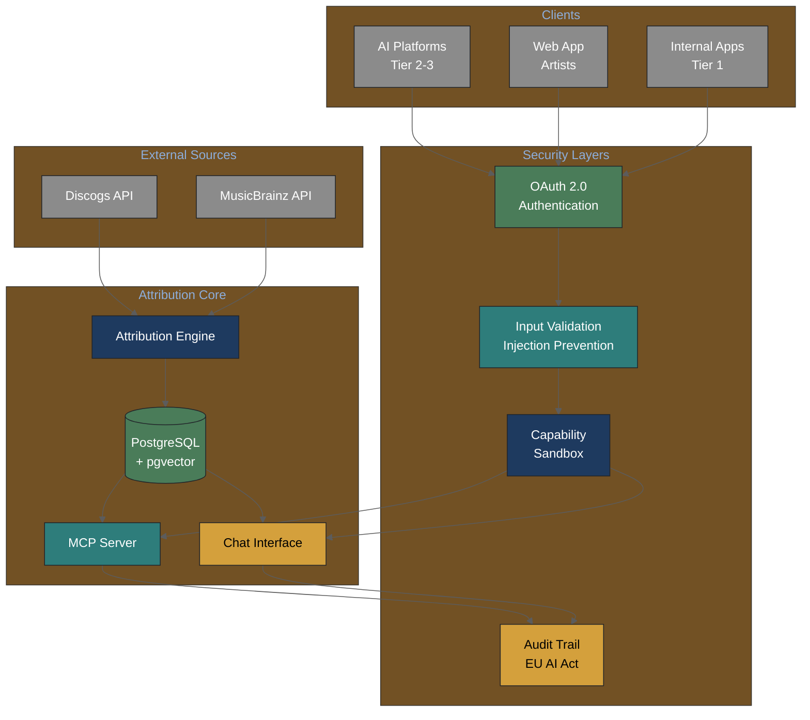

### Security Architecture

Per [MCP security research](../knowledge-base/technical/agentic-systems-research-2026-02-03.md), the system implements defense-in-depth:

| Layer | Function | Threat Mitigated |
|-------|----------|------------------|
| **Authentication** | OAuth 2.0 + RFC 8707 Resource Indicators | Unauthorized access |
| **Input Validation** | Static + Neural + LLM three-stage detection | Prompt injection, SQL injection |
| **Capability Sandbox** | Permission grants with expiration | Privilege escalation |
| **Audit Trail** | Immutable logging (EU AI Act Art. 12) | Non-compliance, liability |

**Research basis**: 40.71% average attack success rate across MCP implementations (MCPSecBench 2025).

## Technical Diagrams (Generated)

### Attribution Pipeline

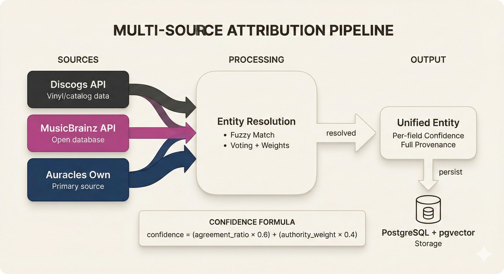

*Multi-source data flows through entity resolution to produce unified entities with per-field confidence scores.*

### MCP Server Architecture

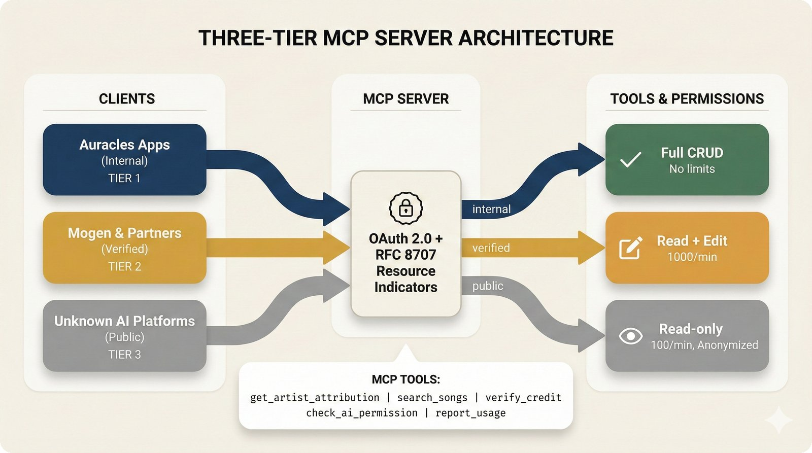

*MCP server exposes attribution data via tools, resources, and prompts with three-tier access control.*

### Confidence Scoring

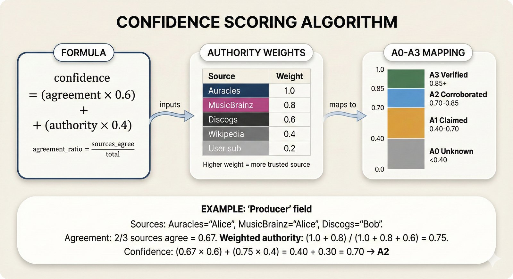

*Conformal prediction provides calibrated uncertainty bounds on attribution confidence.*

### Database Schema

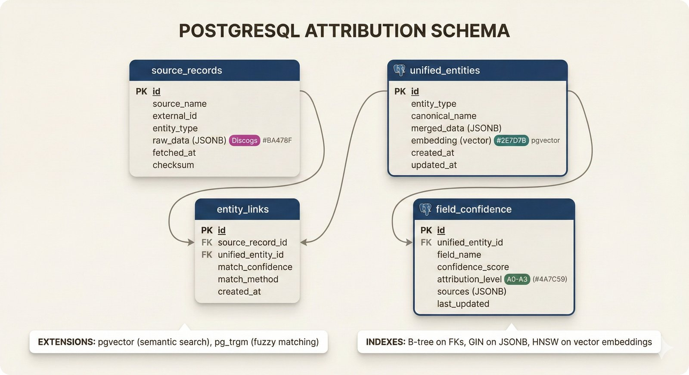

*PostgreSQL + pgvector schema for artists, tracks, contributions with full provenance tracking.*

### MCP Access Control (Visual)

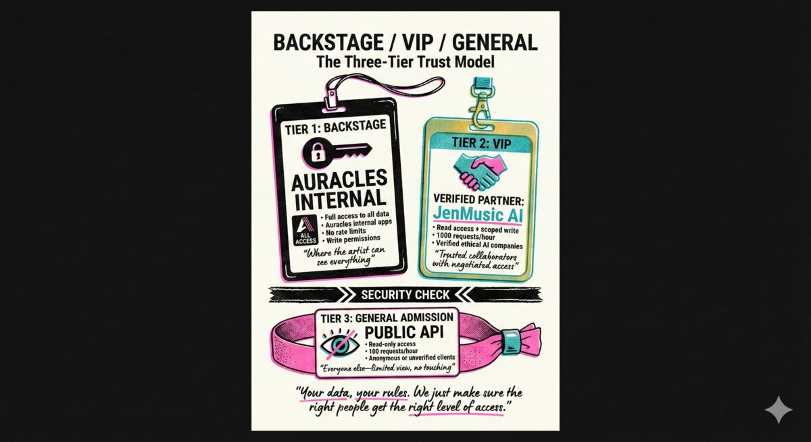
*Your data, your rules. We just make sure the right people get the right level of access.*

### Chat Interface Processing

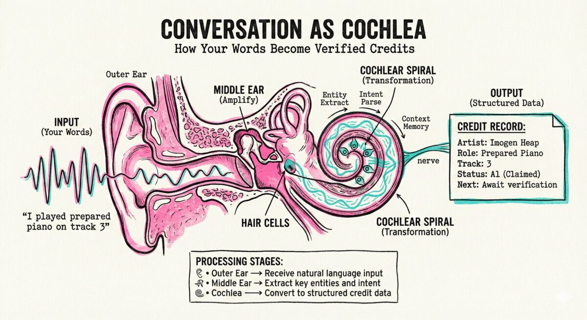
*Natural language input is transformed into structured, verified credit data.*

---

## L3: Sequence Diagrams

### Entity Resolution Flow

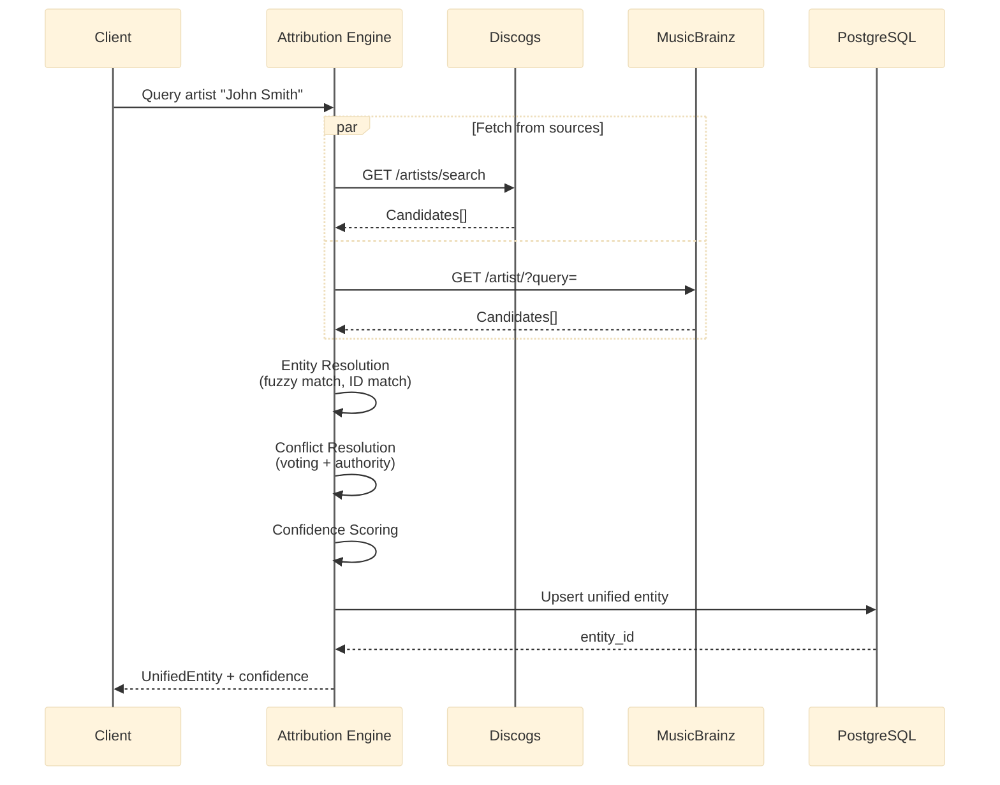

### MCP Request Flow

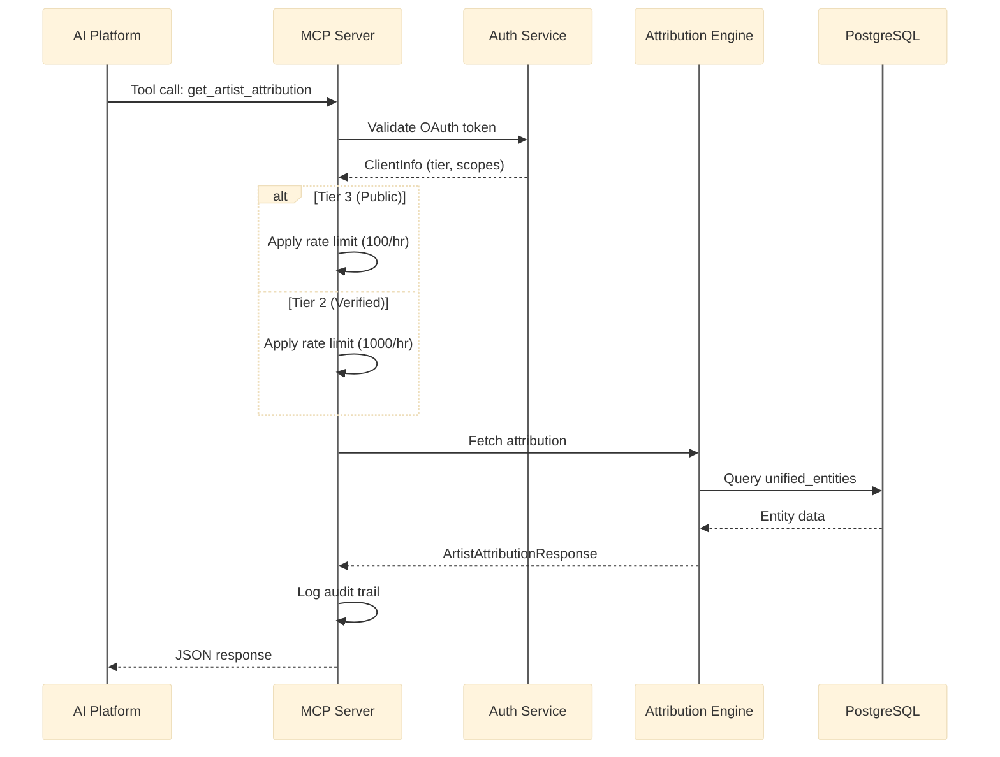

---

## L4: Data Models

### Database ER Diagram

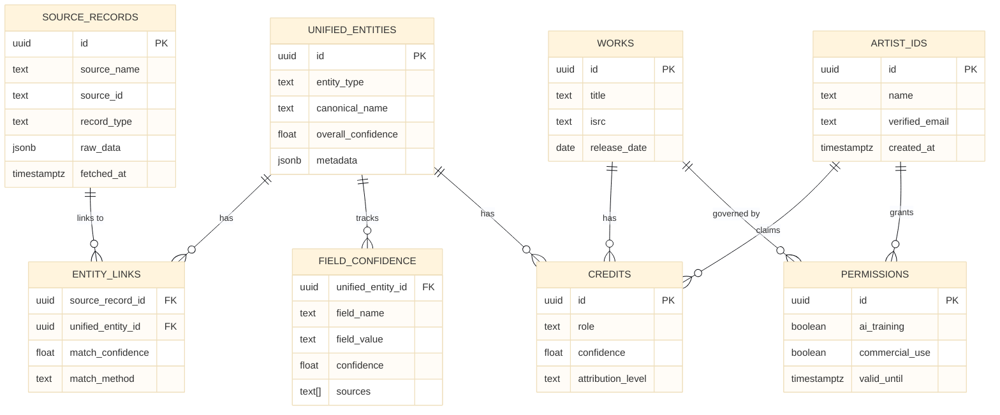

### Attribution Level State Machine

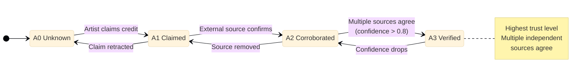

### Confidence Scoring Algorithm

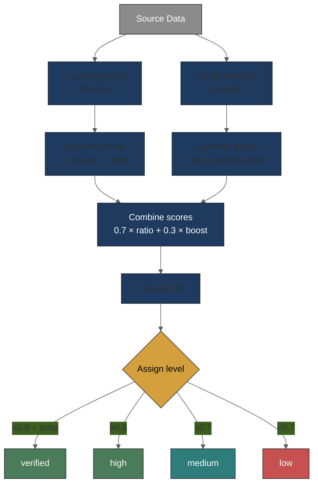

## Architecture Decision Records

| ADR | Title | Status | Date |
|-----|-------|--------|------|
| [0001](adr/0001-use-postgresql-pgvector.md) | Use PostgreSQL + pgvector | Accepted | 2026-02-03 |
| [0002](adr/0002-pure-markdown-no-latex.md) | Pure Markdown Documentation | Accepted | 2026-02-03 |
| [0003](adr/0003-pure-python-no-langchain.md) | Pure Python + Pydantic | Accepted | 2026-02-03 |
| [0004](adr/0004-conformal-prediction-mapie.md) | Conformal Prediction via MAPIE | Accepted | 2026-02-03 |
| [0005](adr/0005-single-agent-architecture.md) | Single-Agent Attribution Pipeline | Accepted | 2026-02-03 |

## Related Documentation

- [PRDs](../prd/README.md) - Product requirements
- [Knowledge Base](../knowledge-base/README.md) - Domain and technical knowledge
