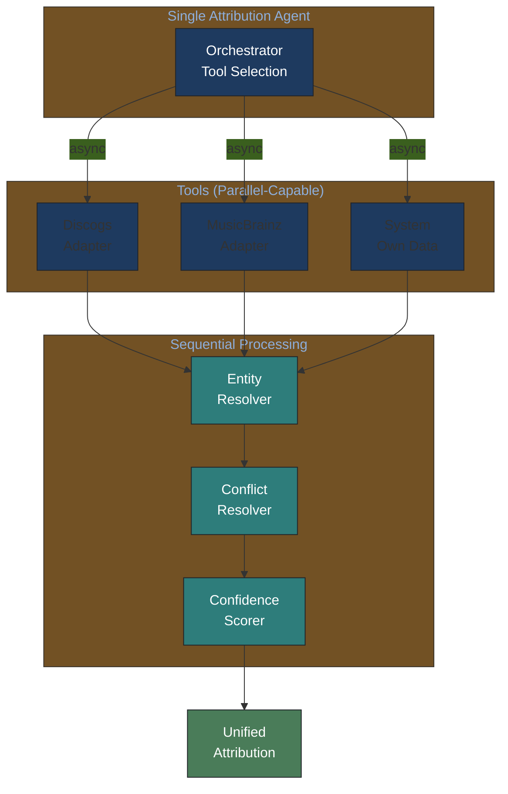
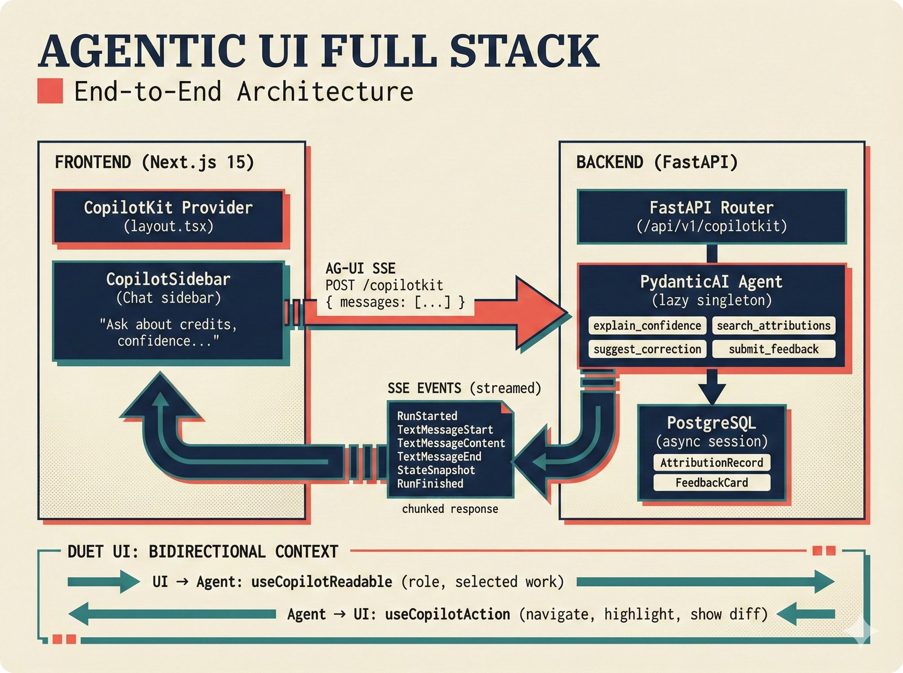

# ADR-0005: Single-Agent Architecture for Attribution Pipeline

## Status

Accepted

## Context

The attribution engine processes data through a sequential pipeline:
1. Fetch from multiple sources (Discogs, MusicBrainz, system own data)
2. Entity resolution (matching artists across sources)
3. Conflict resolution (handling disagreements)
4. Confidence scoring (computing reliability metrics)

Architecture options considered:
1. **Multi-agent system**: Separate agents for each source/function
2. **Single-agent with tool orchestration**: One agent calling tools as needed
3. **Hybrid**: Multi-agent for fetching, single-agent for processing

## Decision

Use **single-agent architecture with tool orchestration** for the attribution pipeline.

## Research Basis

Per [Kim et al. (2025)](https://arxiv.org/abs/2512.08296) "Towards a Science of Scaling Agent Systems" ([Google Blog](https://research.google/blog/towards-a-science-of-scaling-agent-systems-when-and-why-agent-systems-work/)):

| Finding | Value | Implication |
|---------|-------|-------------|
| Error amplification in parallel MAS | **17.2x** | Sequential tasks cascade errors |
| Single-agent accuracy threshold | **45%** | Beyond this, more agents don't help |
| Communication overhead | **Exponential** | Teams >7 agents degrade performance |

From the research:
> "For sequential reasoning tasks, all multi-agent variants degraded performance by 39-70%."

## Consequences

### Positive

- **Error isolation**: Entity resolution errors don't cascade from parallel fetch failures
- **Simpler debugging**: Single execution trace to analyze
- **Lower latency**: No agent-to-agent communication overhead
- **Easier auditing**: One agent's decisions to explain for compliance

### Negative

- **No parallelism for independent sources**: Could fetch Discogs and MusicBrainz in parallel with multi-agent
- **Single point of failure**: If agent fails, entire pipeline fails
- **Limited scalability**: Adding sources requires tool additions, not agent additions

### Mitigation

- Use **async tool calls** for parallel source fetching within single agent
- Implement **retry logic** at tool level, not agent level
- Design **modular tools** that can be tested independently

## Architecture Diagram

### Visual: Single vs Multi-Agent Decision

*Decision framework for agent architecture: sequential tasks require single-agent due to 17.2x error amplification in multi-agent systems on sequential workloads ([Kim et al., 2025](https://arxiv.org/abs/2512.08296)).*

## When to Reconsider

Revisit this decision if:
- Adding >5 independent data sources with no shared entity space
- Real-time collaborative verification needed across sources
- Parallel user-facing features (chat + admin + analytics) require isolation

## References

- Kim, Y. et al. (2025). "[Towards a Science of Scaling Agent Systems](https://arxiv.org/abs/2512.08296)". arXiv:2512.08296. ([Google Blog](https://research.google/blog/towards-a-science-of-scaling-agent-systems-when-and-why-agent-systems-work/))
- [agentic-systems-research-2026-02-03.md](../../knowledge-base/technical/agentic-systems-research-2026-02-03.md) - Full research synthesis
