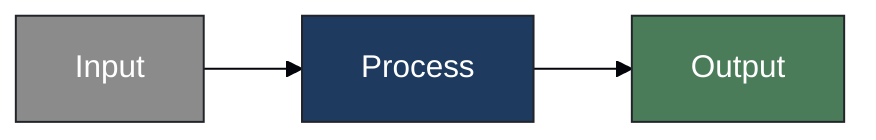
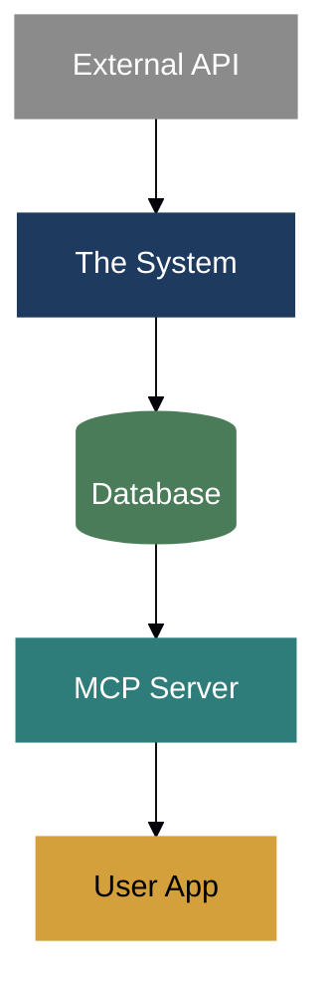
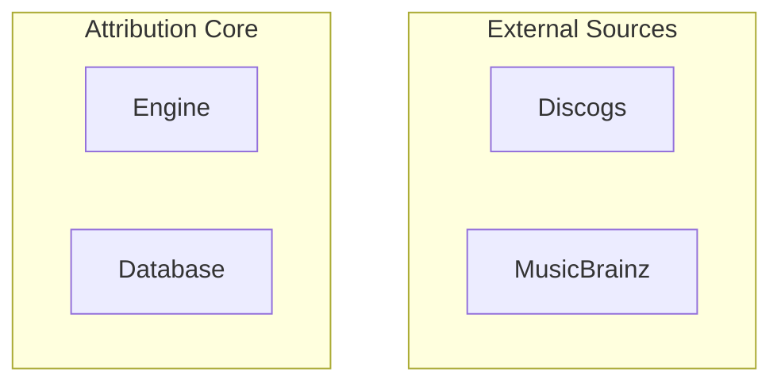

# Mermaid Style Guide

Consistent styling for Mermaid diagrams across the system documentation.

## Theme Configuration

Use this init block at the start of every Mermaid diagram:

```
%%{init: {
  'theme': 'base',
  'themeVariables': {
    'background': '#fcfaf5',
    'primaryColor': '#1E3A5F',
    'primaryTextColor': '#ffffff',
    'primaryBorderColor': '#1E3A5F',
    'secondaryColor': '#2E7D7B',
    'tertiaryColor': '#D4A03C',
    'lineColor': '#333333',
    'textColor': '#2C2C2C',
    'fontFamily': 'Poppins, Manrope, system-ui, sans-serif'
  }
}}%%
```

> **Note**: GitHub renders Mermaid with system fonts. Custom fonts work in other renderers (Obsidian, VS Code, etc.)

## Color Palette

| Role | Color | Hex | Usage |
|------|-------|-----|-------|
| Primary (System) | Deep Blue | `#1E3A5F` | Core system components |
| Secondary (MCP) | Teal | `#2E7D7B` | API/Integration layer |
| Tertiary (User) | Gold | `#D4A03C` | User-facing components |
| Success | Forest Green | `#4A7C59` | Database, verified data |
| Neutral | Gray | `#8B8B8B` | External systems |
| Background | Off-white | `#fcfaf5` | Diagram background |
| Text | Dark Gray | `#2C2C2C` | Labels and text |

## Figure Hierarchy

Diagrams organized from high-level (domain) to low-level (implementation):

### Level 1: Domain (Executive/Business)
**Audience**: Stakeholders, music industry professionals
**Purpose**: Explain the problem and value proposition

| Figure | Title | Location |
|--------|-------|----------|
| `mermaid-L1-01` | The Attribution Problem | README.md |
| `mermaid-L1-02` | System Value Proposition | README.md |

### Level 2: Solution Overview
**Audience**: Product managers, technical leads
**Purpose**: Show system components and data flow

| Figure | Title | Location |
|--------|-------|----------|
| `mermaid-L2-01` | System Components | README.md, docs/prd/ |
| `mermaid-L2-02` | Data Flow Overview | docs/prd/ |
| `mermaid-L2-03` | Trust Tier Model | docs/prd/mcp-server-prd.md |

### Level 3: Technical Architecture
**Audience**: Engineers, architects
**Purpose**: Component interactions and contracts

| Figure | Title | Location |
|--------|-------|----------|
| `mermaid-L3-01` | Attribution Engine Internals | docs/architecture/ |
| `mermaid-L3-02` | MCP Server Architecture | docs/architecture/ |
| `mermaid-L3-03` | Database Schema (ER) | docs/architecture/ |

### Level 4: Implementation Details
**Audience**: Developers implementing features
**Purpose**: Algorithms, sequences, state machines

| Figure | Title | Location |
|--------|-------|----------|
| `mermaid-L4-01` | Entity Resolution Sequence | docs/architecture/ |
| `mermaid-L4-02` | Confidence Scoring Flow | docs/architecture/ |
| `mermaid-L4-03` | MCP Request/Response | docs/architecture/ |

## Diagram Type Guidelines

### Flowcharts (graph TD/LR)
Use for: Data flows, process overviews, component relationships



### Sequence Diagrams
Use for: API interactions, request/response flows

### Entity Relationship (erDiagram)
Use for: Database schema, data models

### State Diagrams (stateDiagram-v2)
Use for: Attribution levels (A0→A3), entity states

## Style Classes

Define reusable styles for consistency:



## Node Shapes

| Shape | Syntax | Usage |
|-------|--------|-------|
| Rectangle | `[text]` | Processes, components |
| Rounded | `(text)` | User actions, inputs |
| Stadium | `([text])` | Start/end points |
| Database | `[(text)]` | Data stores |
| Circle | `((text))` | Events, triggers |
| Diamond | `{text}` | Decisions |

## Subgraph Naming

Use clear, hierarchical names:


