# Documentation Figures

Repository infographics for music attribution with transparent confidence.

## Overview

This directory contains figure plans and generated infographics at two documentation levels:

| Level | Audience | Focus |
|-------|----------|-------|
| **Technical** | Developers/Engineers | Implementation details, schemas, APIs |
| **Domain** | Music industry experts | Problem context, solution benefits |

## Directory Structure

```
docs/figures/
├── README.md                 # This file
├── STYLE-GUIDE.md           # Visual branding (semantic tags)
├── CONTENT-TEMPLATE.md      # Template for figure plans
├── figure-plans/            # Content specifications (semantic, no colors)
│   ├── fig-tech-01-*.md     # Technical figures
│   └── fig-domain-01-*.md   # Domain figures
├── scripts/                 # Image processing tools
│   └── resize_and_convert.py  # PNG→JPEG with rounded corners
├── generated/               # Raw Nano Banana Pro output (gitignored, ~7MB each)
├── assets/                  # Web-optimized JPEGs (tracked, ~150KB each)
└── visual-references/       # Inspiration images (gitignored)
```

## Design Philosophy

### Content/Style Decoupling

Figure plans contain **semantic tags only** (no colors, fonts):

```yaml
# GOOD (in figure-plan)
role: "source_system"
is_highlighted: true

# BAD (in figure-plan)
color: "#1E3A5F"
font: "Helvetica Bold"
```

Visual properties are defined in `STYLE-GUIDE.md`. This allows style changes without editing content files.

### Two-Level Documentation

Every major component gets two figure types:

1. **Technical (fig-tech-*)**: For developers implementing the system
   - Code paths, database schemas, API contracts
   - MCP tool specifications, confidence algorithms

2. **Domain (fig-domain-*)**: For music industry professionals
   - The attribution crisis and its costs
   - How the system solves it with transparent confidence
   - MCP for ethical AI training permissions

## Generation Workflow (Nano Banana Pro)

1. **Prepare**: Upload `STYLE-GUIDE.md` to Gemini
2. **Content**: Upload specific figure-plan (e.g., `fig-tech-01-attribution-pipeline.md`)
3. **Prompt**: Use the prompts from the figure-plan
4. **Generate**: Create with Nano Banana Pro
5. **Save**: Export PNG to `generated/` directory
6. **Convert**: Run `uv run python scripts/resize_and_convert.py`
7. **Embed**: Link JPEGs from `assets/` in README.md files

### Conversion Script

```bash
# Convert all figures (PNG→JPEG, 1600px width, rounded corners)
uv run python docs/figures/scripts/resize_and_convert.py

# Typical results: 7MB PNG → 150KB JPEG (97% space saved)
```

## Figure Gallery

### Technical Figures

For developers implementing the system.

#### fig-tech-01: Attribution Pipeline


*Multi-source data flows through entity resolution to produce unified entities with per-field confidence scores.*

#### fig-tech-02: MCP Server Architecture


*MCP server exposes attribution data via tools, resources, and prompts with three-tier access control.*

#### fig-tech-03: Confidence Scoring


*Conformal prediction provides calibrated uncertainty bounds on attribution confidence.*

#### fig-tech-04: Database Schema


*PostgreSQL + pgvector schema for artists, tracks, contributions with full provenance tracking.*

#### fig-tech-05: MCP Security Threat Model

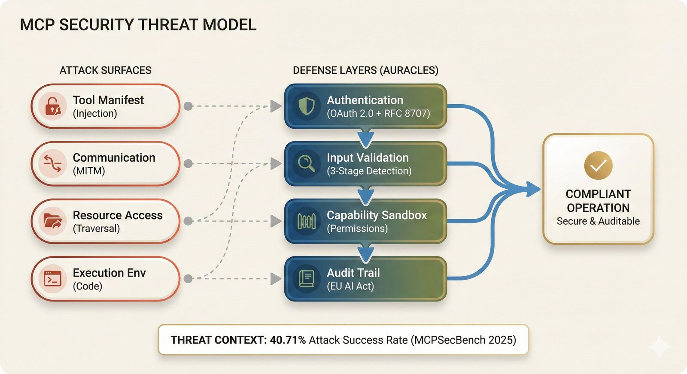

*Four attack surfaces mitigated by four-layer defense (authentication, validation, sandbox, audit). Based on [MCP Security Bench](https://arxiv.org/abs/2510.15994) finding 40.71% average attack success rate across nine models.*

#### fig-tech-06: Single vs Multi-Agent Architecture

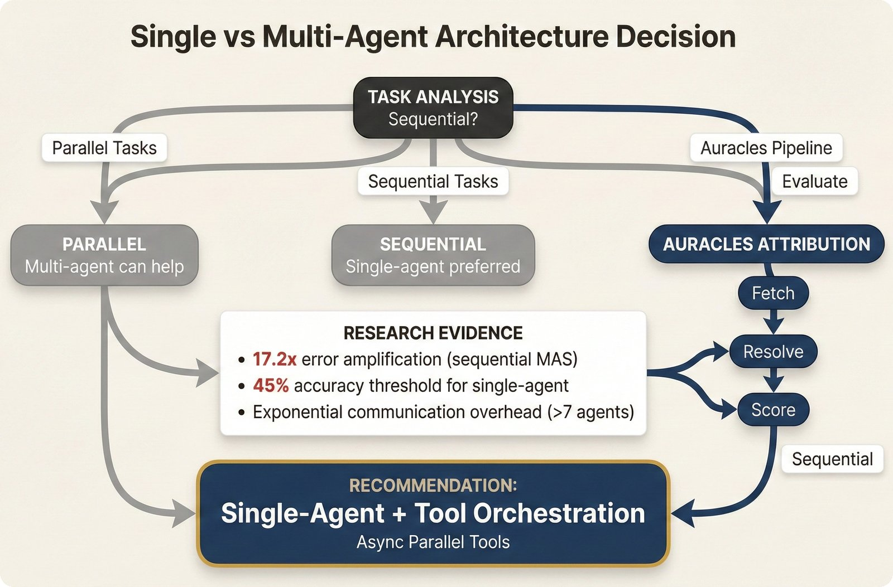

*Decision framework for agent architecture: sequential tasks (like the attribution) require single-agent due to 17.2x error amplification in multi-agent systems ([Google DeepMind & MIT, 2025](https://research.google/blog/towards-a-science-of-scaling-agent-systems-when-and-why-agent-systems-work/)).*

---

### Domain Figures

For music industry professionals.

#### fig-domain-01: The Attribution Crisis

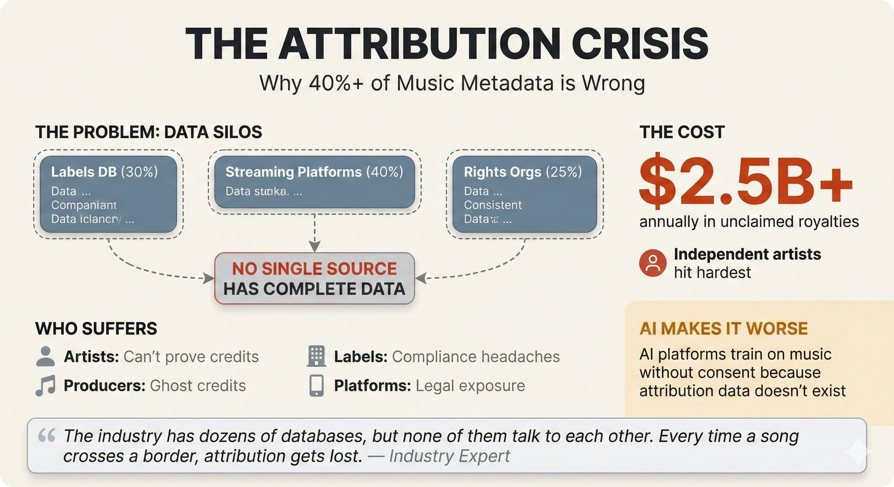

*40%+ of music metadata is wrong, causing $2.5B+ in unclaimed royalties annually.*

#### fig-domain-02: Attribution Solution

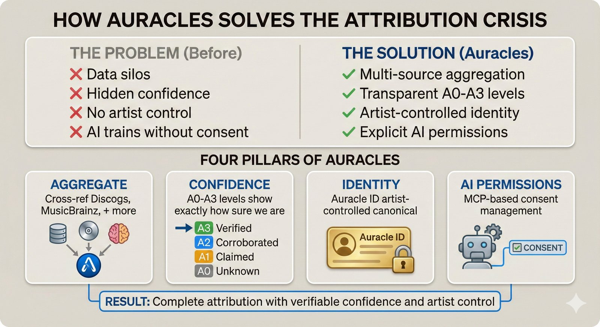

*The system aggregates multiple sources to create verified, confidence-scored attribution records.*

#### fig-domain-03: MCP for AI Attribution

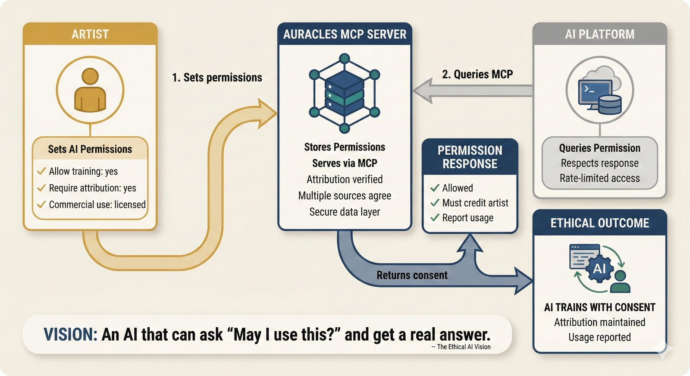

*MCP enables AI platforms to check artist permissions before training, ensuring consent and attribution.*

#### fig-domain-04: Trust Tiers

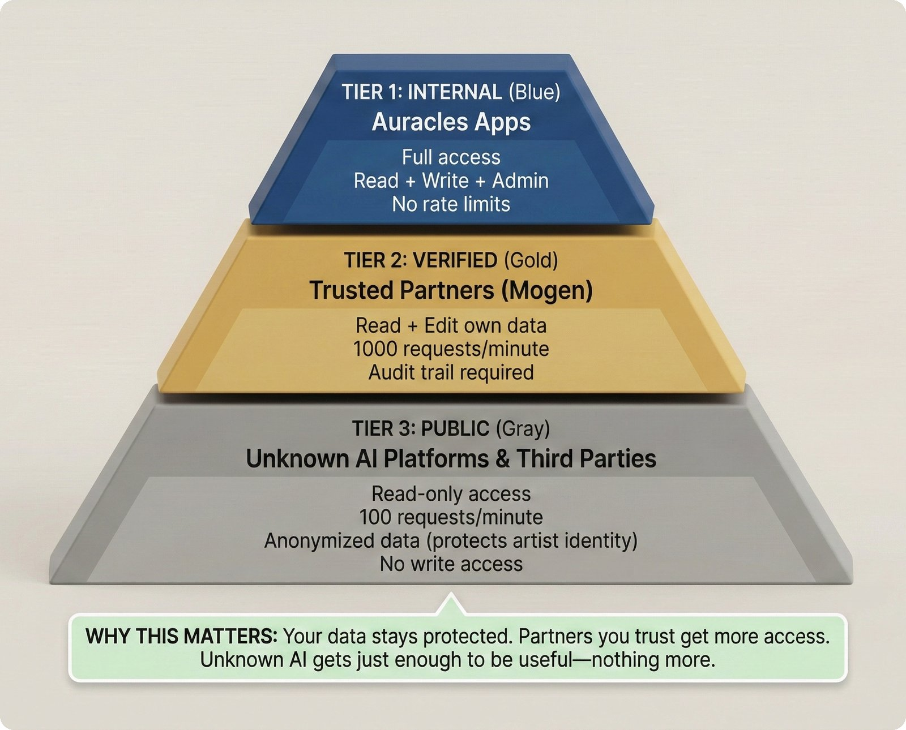

*Three-tier access model protects artist data while enabling collaboration with verified partners.*

#### fig-domain-05: EU AI Act Compliance

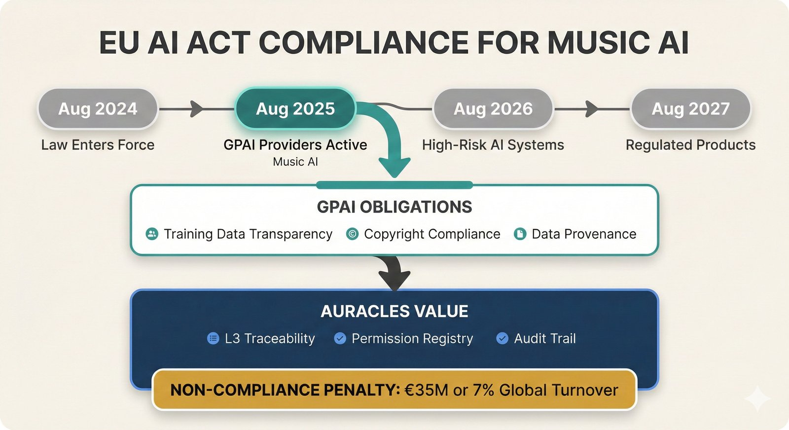

*EU AI Act timeline for music AI: GPAI obligations (training data transparency) active from August 2025. The system provides L3 traceability for compliance. Non-compliance penalties up to [€35M or 7% turnover](https://www.dlapiper.com/en-us/insights/publications/2025/08/latest-wave-of-obligations-under-the-eu-ai-act-take-effect).*

#### fig-domain-06: Agentic Commerce Ecosystem

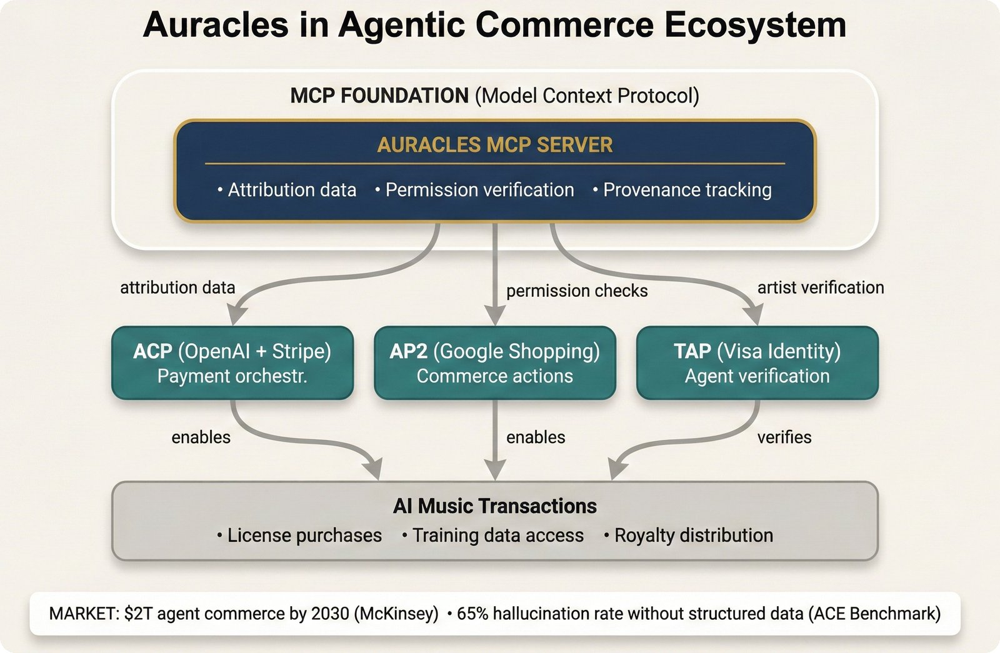

*Attribution in agentic commerce: MCP-based attribution data flows to commerce protocols (ACP, AP2, TAP) enabling verified AI music transactions. [Market opportunity $1T US / $3-5T global by 2030](https://www.mckinsey.com/capabilities/quantumblack/our-insights/the-agentic-commerce-opportunity-how-ai-agents-are-ushering-in-a-new-era-for-consumers-and-merchants).*

---

## Figure Plan Index

| ID | Plan | Asset | Status |
|----|------|-------|--------|
| **Technical Figures** ||||
| fig-tech-01 | [Plan](figure-plans/fig-tech-01-attribution-pipeline.md) | [JPEG](assets/fig-tech-01-attribution-pipeline.jpg) | Generated |
| fig-tech-02 | [Plan](figure-plans/fig-tech-02-mcp-architecture.md) | [JPEG](assets/fig-tech-02-mcp-architecture.jpg) | Generated |
| fig-tech-03 | [Plan](figure-plans/fig-tech-03-confidence-scoring.md) | [JPEG](assets/fig-tech-03-confidence-scoring.jpg) | Generated |
| fig-tech-04 | [Plan](figure-plans/fig-tech-04-database-schema.md) | [JPEG](assets/fig-tech-04-database-schema.jpg) | Generated |
| fig-tech-05 | [Plan](figure-plans/fig-tech-05-mcp-security-threat-model.md) | [JPEG](assets/fig-tech-05-mcp-security-threat-model.jpg) | Generated |
| fig-tech-06 | [Plan](figure-plans/fig-tech-06-single-vs-multiagent.md) | [JPEG](assets/fig-tech-06-single-vs-multiagent.jpg) | Generated |
| **Domain Figures** ||||
| fig-domain-01 | [Plan](figure-plans/fig-domain-01-attribution-crisis.md) | [JPEG](assets/fig-domain-01-attribution-crisis.jpg) | Generated |
| fig-domain-02 | [Plan](figure-plans/fig-domain-02-auracles-solution.md) | [JPEG](assets/fig-domain-02-auracles-solution.jpg) | Generated |
| fig-domain-03 | [Plan](figure-plans/fig-domain-03-mcp-ai-attribution.md) | [JPEG](assets/fig-domain-03-mcp-ai-attribution.jpg) | Generated |
| fig-domain-04 | [Plan](figure-plans/fig-domain-04-trust-tiers.md) | [JPEG](assets/fig-domain-04-trust-tiers.jpg) | Generated |
| fig-domain-05 | [Plan](figure-plans/fig-domain-05-eu-ai-act-compliance.md) | [JPEG](assets/fig-domain-05-eu-ai-act-compliance.jpg) | Generated |
| fig-domain-06 | [Plan](figure-plans/fig-domain-06-agentic-commerce-ecosystem.md) | [JPEG](assets/fig-domain-06-agentic-commerce-ecosystem.jpg) | Generated |
| **Hero Banner** ||||
| fig-hero-banner | [Plan](figure-plans/fig-hero-auracles-banner.md) | [JPEG](assets/fig-hero-auracles-banner.jpg) | Generated |
| **Risograph/Zine Figures (README)** ||||
| fig-rm-02 | [Plan](figure-plans/fig-rm-02-sound-sources-unite.md) | [JPEG](assets/fig-rm-02-sound-sources-unite.jpg) | Generated |
| fig-rm-03 | [Plan](figure-plans/fig-rm-03-from-unknown-to-verified.md) | [JPEG](assets/fig-rm-03-from-unknown-to-verified.jpg) | Generated |
| fig-rm-04 | [Plan](figure-plans/fig-rm-04-mogen-and-andys-day.md) | [JPEG](assets/fig-rm-04-mogen-and-andys-day.jpg) | Generated |
| fig-rm-05 | [Plan](figure-plans/fig-rm-05-two-way-conversation.md) | [JPEG](assets/fig-rm-05-two-way-conversation.jpg) | Generated |
| fig-rm-06 | [Plan](figure-plans/fig-rm-06-ai-asks-permission.md) | [JPEG](assets/fig-rm-06-ai-asks-permission.jpg) | Generated |
| fig-rm-07 | [Plan](figure-plans/fig-rm-07-how-sure-are-we.md) | [JPEG](assets/fig-rm-07-how-sure-are-we.jpg) | Generated |
| fig-rm-08 | [Plan](figure-plans/fig-rm-08-your-music-your-rules.md) | [JPEG](assets/fig-rm-08-your-music-your-rules.jpg) | Generated |
| fig-rm-09 | [Plan](figure-plans/fig-rm-09-what-you-get.md) | [JPEG](assets/fig-rm-09-what-you-get.jpg) | Generated |
| **Persona & Ecosystem Figures** ||||
| fig-vis-01 | [Plan](figure-plans/fig-vis-01-mogen-andy-and-friends.md) | [JPEG](assets/fig-vis-01-mogen-andy-and-friends.jpg) | Generated |
| fig-mcp-01 | [Plan](figure-plans/fig-mcp-01-backstage-vip-general.md) | [JPEG](assets/fig-mcp-01-backstage-vip-general.jpg) | Generated |
| fig-chat-01 | [Plan](figure-plans/fig-chat-01-conversation-as-cochlea.md) | [JPEG](assets/fig-chat-01-conversation-as-cochlea.jpg) | Generated |

---

## Hero Banner (Artistic)

A special artistic hero banner for the README, using a surrealist vintage illustration style rather than the Herman Miller infographic aesthetic.

#### fig-hero-attribution-banner

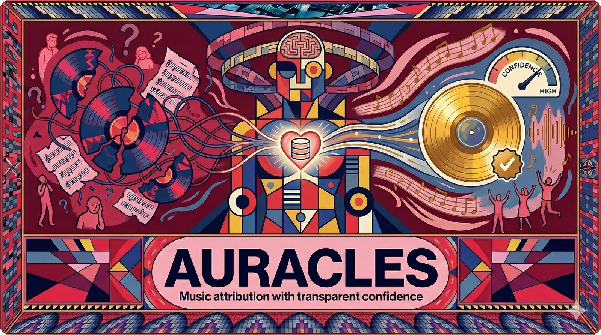

*Vintage folk art illustration depicting music attribution transformation: chaotic data silos (left) flow through the attribution engine (center humanoid figure) into unified, confidence-scored records (right golden record). Vibrant coral/blue/gold palette appeals to creative professionals.*

---

## Risograph/Zine Style Figures

Artist-friendly visual storytelling using unified risograph/zine aesthetic (STYLE-GUIDE-v2.md). Featuring Mogen and Andy as named personas.

### README.md Figures

#### fig-rm-02: Sound Sources Unite

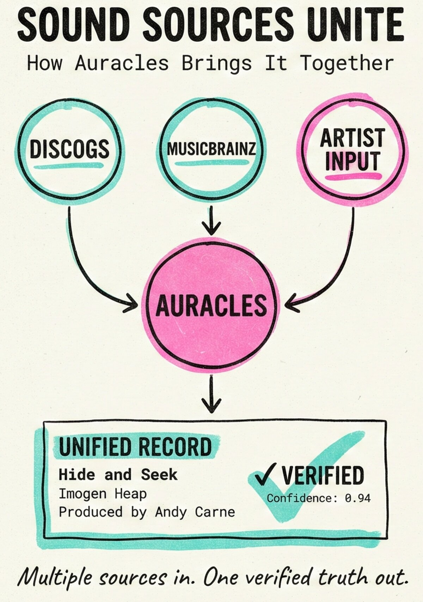
*Multiple sources in. One verified truth out.*

#### fig-rm-03: From Unknown to Verified

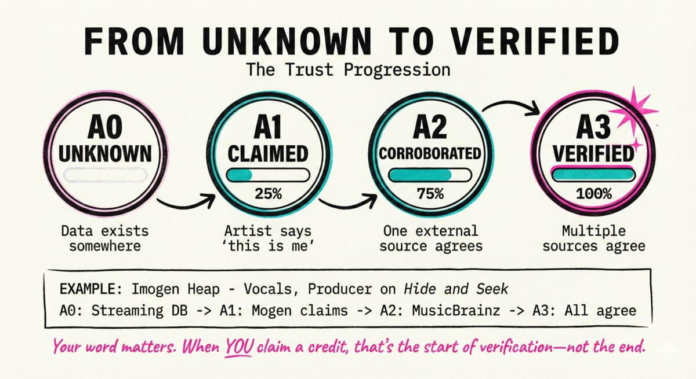
*Your word matters. When YOU claim a credit, that's the start of verification—not the end.*

#### fig-rm-04: Mogen & Andy's Day

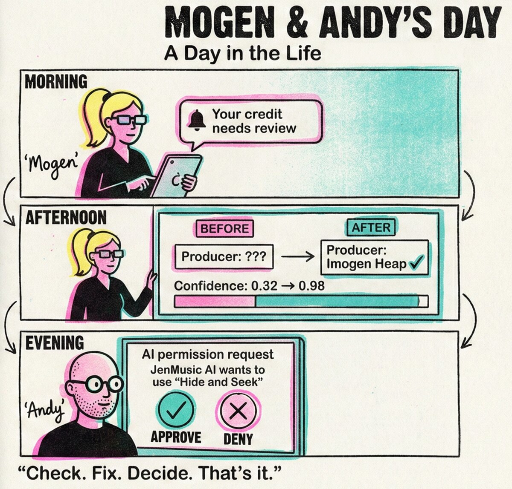
*Check. Fix. Decide. That's it.*

#### fig-rm-05: Two-Way Conversation

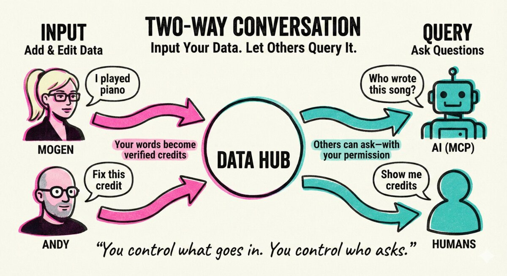
*You control what goes in. You control who asks.*

#### fig-rm-06: AI Asks Permission

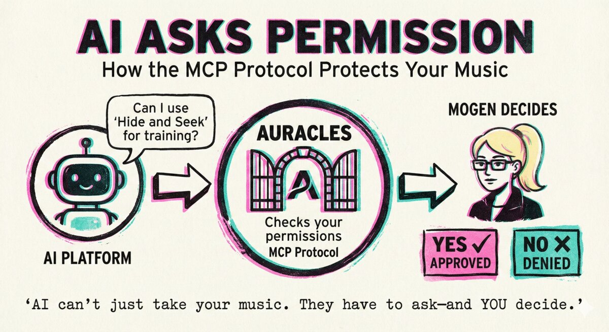
*AI can't just take your music. They have to ask—and YOU decide.*

#### fig-rm-07: How Sure Are We?

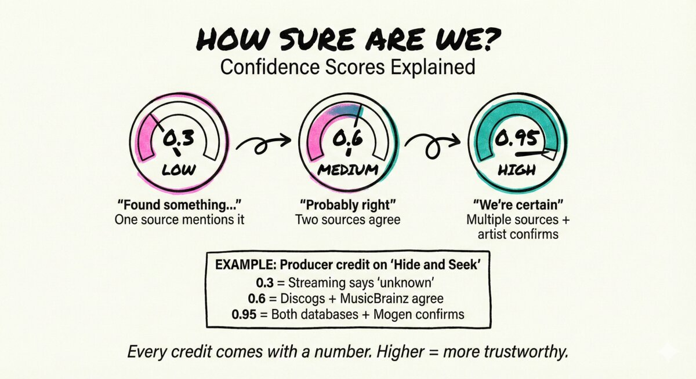
*Every credit comes with a number. Higher = more trustworthy.*

#### fig-rm-08: Your Music, Your Rules

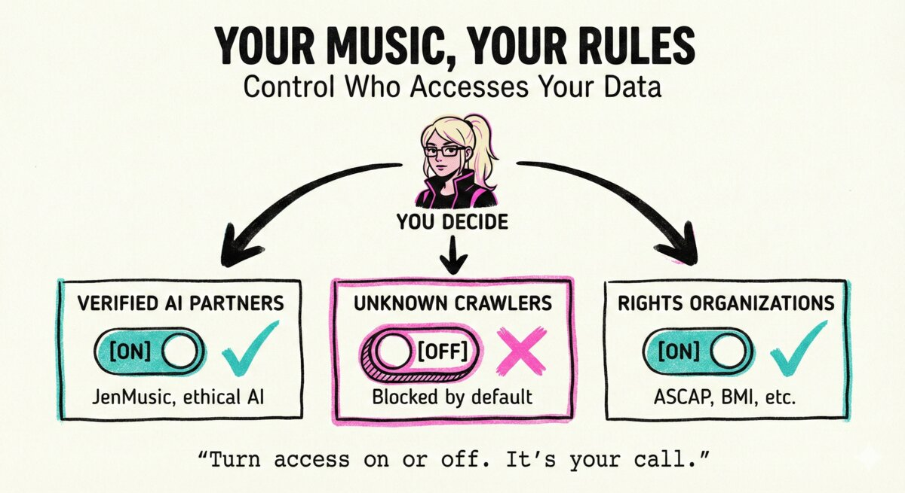
*Turn access on or off. It's your call.*

#### fig-rm-09: What You Get

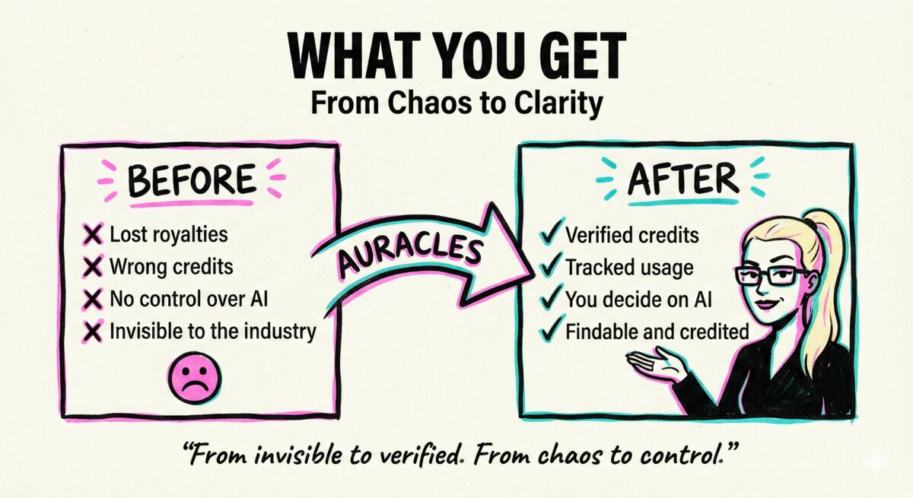
*From invisible to verified. From chaos to control.*

### Persona & Ecosystem Figures

#### fig-vis-01: Mogen, Andy & Friends

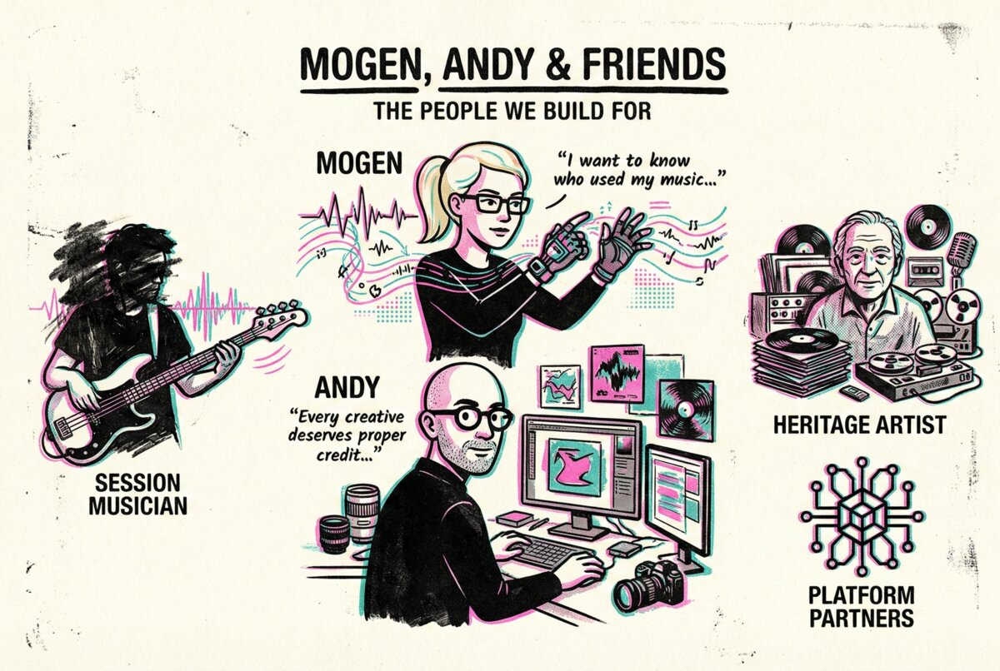
*The people we build for: artists, producers, session musicians, and creative teams who deserve proper credit.*

#### fig-mcp-01: Backstage / VIP / General


*Your data, your rules. We just make sure the right people get the right level of access.*

#### fig-chat-01: Conversation as Cochlea


*Natural language input is transformed into structured, verified credit data.*

---

## Aesthetic Guidelines

- **Style**: Herman Miller mid-century modernism meets Economist data viz
- **Background**: Off-white (#F8F6F0) - warm, professional
- **No**: Glowing effects, sci-fi aesthetics, neon colors
- **Yes**: Matte finishes, elegant typography, clear hierarchy

See `STYLE-GUIDE.md` for complete specifications.

## Related Documentation

- [PRDs](../prd/README.md) - Product requirements
- [Knowledge Base](../knowledge-base/README.md) - Domain knowledge
- [Architecture](../architecture/README.md) - Technical decisions
