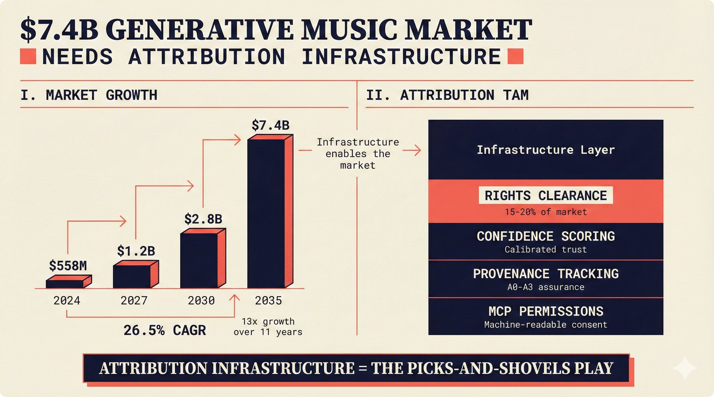

# fig-pitch-01: $7.4B Generative Music Market Needs Attribution Infrastructure

## Metadata

| Field | Value |
|-------|-------|
| **ID** | fig-pitch-01 |
| **Title** | $7.4B Generative Music Market Needs Attribution Infrastructure |
| **Audience** | L1 (Music Industry / Investors) |
| **Location** | docs/planning/managerial-roadmap-planning.md, pitch deck |
| **Priority** | P1 (High) |
| **Aspect Ratio** | 16:9 |
| **Layout Template** | D (Split-Panel) |

## Purpose

This figure establishes the market size opportunity for generative music attribution infrastructure. It answers: "How big is the market we are building for, and why does attribution infrastructure capture a meaningful share?"

## Key Message

Generative music grows from $558M (2024) to $7.4B (2035) at 26.5% CAGR -- attribution infrastructure is the picks-and-shovels play in a gold rush.

## Visual Concept

A split-panel layout with the left panel showing a waterfall/growth curve from $558M to $7.4B over the 2024-2035 period, with key inflection points marked. The right panel shows the attribution infrastructure TAM as a subset, with a callout explaining the picks-and-shovels analogy. The growth curve uses ascending bars or a stepped waterfall, not a smooth line chart.

```
+---------------------------------------------------------------+
|  $7.4B GENERATIVE MUSIC MARKET                                 |
|  ■ Needs Attribution Infrastructure                             |
+-------------------------------+-------------------------------+
|                               |                               |
|  I. MARKET GROWTH             |  II. ATTRIBUTION TAM          |
|  ─────────────────            |  ─────────────────            |
|                               |                               |
|  $558M                        |  Infrastructure Layer          |
|  |                            |                               |
|  |   $1.2B                    |  ┌─────────────────┐          |
|  |   |                        |  │ Rights Clearance │          |
|  |   |     $2.8B              |  │ 15-20% of market │          |
|  |   |     |                  |  └─────────────────┘          |
|  |   |     |       $7.4B      |                               |
|  |   |     |       |          |  ┌─────────────────┐          |
|  ├───┤─────┤───────┤          |  │ Confidence Scoring│         |
|  2024 2027  2030   2035       |  │ Provenance Tracking│        |
|                               |  │ MCP Permissions   │         |
|  26.5% CAGR                   |  └─────────────────┘          |
|                               |                               |
+-------------------------------+-------------------------------+
|                                                               |
|  ■ "Attribution infrastructure = the picks-and-shovels play"  |
|                                                               |
+---------------------------------------------------------------+
```

## Spatial Anchors

```yaml
canvas:
  width: 1920
  height: 1080
  background: warm_cream

title_block:
  position: [60, 40]
  width: 1800
  height: 80
  elements:
    - type: heading_display
      text: "$7.4B GENERATIVE MUSIC MARKET"
    - type: label_editorial
      text: "Needs Attribution Infrastructure"

left_panel:
  position: [60, 160]
  width: 860
  height: 700
  label: "MARKET GROWTH"
  elements:
    - type: waterfall_bars
      data_points:
        - { year: 2024, value: "$558M" }
        - { year: 2027, value: "$1.2B" }
        - { year: 2030, value: "$2.8B" }
        - { year: 2035, value: "$7.4B" }
    - type: data_mono
      text: "26.5% CAGR"

right_panel:
  position: [980, 160]
  width: 860
  height: 700
  label: "ATTRIBUTION TAM"
  elements:
    - type: stacked_blocks
      items:
        - { label: "Rights Clearance", note: "15-20% of market" }
        - { label: "Confidence Scoring", note: "Calibrated trust" }
        - { label: "Provenance Tracking", note: "A0-A3 assurance" }
        - { label: "MCP Permissions", note: "Machine-readable consent" }

callout_bar:
  position: [60, 900]
  width: 1800
  height: 120
  elements:
    - type: callout_bar
      text: "Attribution infrastructure = the picks-and-shovels play"
```

## Content Elements

### Primary Structures

| Name | Semantic Tag | Description |
|------|--------------|-------------|
| Title block | `heading_display` | "$7.4B GENERATIVE MUSIC MARKET" with coral accent square |
| Subtitle | `label_editorial` | "Needs Attribution Infrastructure" |
| Market growth panel | `processing_stage` | Left panel with waterfall bars showing market size over time |
| Attribution TAM panel | `solution_component` | Right panel showing infrastructure layer breakdown |
| Year labels | `data_mono` | 2024, 2027, 2030, 2035 |
| Dollar amounts | `data_mono` | $558M, $1.2B, $2.8B, $7.4B |
| CAGR indicator | `data_mono` | "26.5% CAGR" |
| Infrastructure blocks | `solution_component` | Rights Clearance, Confidence Scoring, Provenance Tracking, MCP Permissions |
| Callout bar | `callout_bar` | Picks-and-shovels analogy |

### Relationships / Flows

| From | To | Type | Label |
|------|-----|------|-------|
| Market growth bars | Attribution TAM | arrow | "Infrastructure enables the market" |
| 2024 bar | 2035 bar | progression | "13x growth over 11 years" |

### Callout Boxes

| Title | Content | Position |
|-------|---------|----------|
| Picks and Shovels | "Attribution infrastructure = the picks-and-shovels play" | bottom-center |

## Text Content

### Labels (Max 30 chars each)

- $7.4B GENERATIVE MUSIC MARKET
- Needs Attribution Infrastructure
- MARKET GROWTH
- ATTRIBUTION TAM
- 26.5% CAGR
- Rights Clearance
- Confidence Scoring
- Provenance Tracking
- MCP Permissions

### Caption (for embedding in documentation)

The generative music market grows from $558M (2024) to $7.4B (2035) at 26.5% CAGR. Attribution infrastructure -- rights clearance, confidence scoring, provenance tracking, and MCP permissions -- represents the picks-and-shovels opportunity in this expansion.

## Anti-Hallucination Rules

### Default Rules (always include)

1. **Font names are INTERNAL** -- do NOT render them as labels.
2. **Semantic tags are INTERNAL** -- do NOT render them as visible text.
3. **Hex codes are INTERNAL** -- do NOT render them.
4. **Background MUST be warm cream (#f6f3e6)**.
5. **No generic flowchart aesthetics** -- no thick block arrows, no PowerPoint look.
6. **No figure captions** -- do NOT render "Figure 1.", "Fig.", or numbered caption.
7. **No prompt leakage** -- do NOT render style keywords as visible text.

### Figure-Specific Rules

1. Market size figures are from industry projections (Goldman Sachs, Grand View Research) -- do NOT invent sources.
2. The CAGR is 26.5% -- do NOT round to 27% or change to a different figure.
3. $558M is the 2024 estimate, $7.4B is the 2035 projection -- do NOT swap years.
4. "Picks-and-shovels" is a metaphor -- do NOT render literal mining imagery.
5. Do NOT show specific company logos or trademarks.
6. The TAM breakdown is illustrative -- do NOT show exact dollar figures for individual segments.

## Alt Text

Generative music market waterfall from $558M to $7.4B with attribution infrastructure TAM breakdown.

## JSON Export Block

```json
{
  "meta": {
    "figure_id": "pitch-01",
    "title": "$7.4B Generative Music Market Needs Attribution Infrastructure",
    "audience": "L1",
    "layout_template": "D"
  },
  "content_architecture": {
    "primary_message": "Generative music grows from $558M to $7.4B at 26.5% CAGR -- attribution infrastructure is the picks-and-shovels play.",
    "layout_flow": "left-to-right",
    "key_structures": [
      {
        "name": "Market Growth Waterfall",
        "role": "processing_stage",
        "is_highlighted": true,
        "labels": ["$558M (2024)", "$1.2B (2027)", "$2.8B (2030)", "$7.4B (2035)"]
      },
      {
        "name": "Attribution TAM",
        "role": "solution_component",
        "is_highlighted": true,
        "labels": ["Rights Clearance", "Confidence Scoring", "Provenance Tracking", "MCP Permissions"]
      }
    ],
    "relationships": [
      {
        "from": "Market Growth",
        "to": "Attribution TAM",
        "type": "arrow",
        "label": "infrastructure enables the market"
      }
    ],
    "callout_boxes": [
      {
        "heading": "PICKS AND SHOVELS",
        "body_text": "Attribution infrastructure = the picks-and-shovels play",
        "position": "bottom-center"
      }
    ]
  }
}
```

## Quality Checklist

- [x] Primary message clear in one sentence
- [x] Semantic tags used (no colors, hex codes, or font names in content spec)
- [x] ASCII layout sketched
- [x] Spatial anchors defined in YAML
- [x] Labels under 30 characters
- [x] Anti-hallucination rules listed
- [x] Alt text provided (125 chars max)
- [x] JSON export block included
- [x] Audience level correct (L1/L2/L3/L4)
- [x] Layout template identified (A/B/C/D/E)

## Status

- [x] Draft created
- [ ] Content reviewed
- [ ] Generated via Nano Banana Pro
- [ ] Quality score >= 21/25
- [ ] Embedded in documentation

## Image Embed

### For GitHub README / MkDocs (repo-root-relative)


*The generative music market grows from $558M (2024) to $7.4B (2035) at 26.5% CAGR. Attribution infrastructure represents the picks-and-shovels opportunity in this expansion.*

### From this figure plan (relative)


