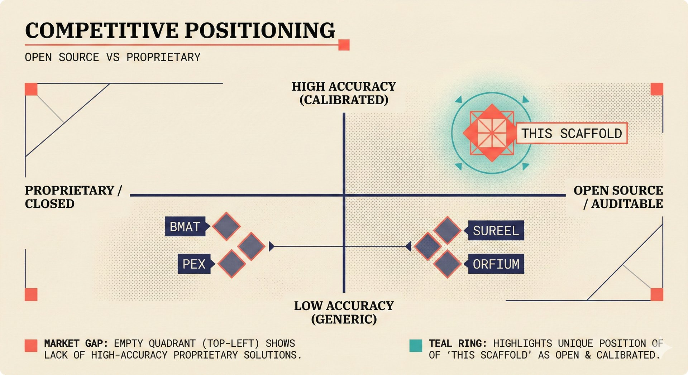

# fig-pitch-02: The Only Open-Source, Calibrated Attribution System

## Metadata

| Field | Value |
|-------|-------|
| **ID** | fig-pitch-02 |
| **Title** | The Only Open-Source, Calibrated Attribution System |
| **Audience** | L1 (Music Industry / Investors) |
| **Location** | docs/planning/managerial-roadmap-planning.md, pitch deck |
| **Priority** | P1 (High) |
| **Aspect Ratio** | 16:9 |
| **Layout Template** | D (Split-Panel) |

## Purpose

This figure positions the scaffold against competitors on two critical axes: openness (open-source vs proprietary) and confidence transparency (black box vs calibrated). It answers: "Why does no existing player occupy the top-right quadrant, and why does that matter?"

## Key Message

No competitor offers both open-source transparency and calibrated confidence scoring -- this scaffold occupies a unique market position.

## Visual Concept

A 2x2 quadrant chart with the x-axis running from "Closed / Proprietary" to "Open-Source" and the y-axis from "Black Box Scoring" to "Calibrated Confidence." Company markers are positioned in their respective quadrants. The scaffold marker is in the top-right (open + calibrated) with a highlight ring. Most competitors cluster in the bottom-left or bottom-right. A callout emphasizes the empty top-right quadrant that only this scaffold occupies.

```
+---------------------------------------------------------------+
|  COMPETITIVE POSITIONING                                       |
|  ■ The Only Open-Source, Calibrated Attribution System          |
+---------------------------------------------------------------+
|                                                                |
|  CALIBRATED                                                    |
|  CONFIDENCE                                                    |
|  ^                                                             |
|  |                                                             |
|  |  (empty)              ★ THIS SCAFFOLD                       |
|  |                         Open + Calibrated                   |
|  |                                                             |
|  |─ ─ ─ ─ ─ ─ ─ ─ ─ ─ ─ ─ ─ ─ ─ ─ ─ ─ ─ ─ ─ ─ ─           |
|  |                                                             |
|  |  ◆ BMAT   ◆ Pex      ◆ Auracles                            |
|  |  ◆ Orfium             ◆ Vermillio                           |
|  |  ◆ Musical AI                                               |
|  |  ◆ Sureel                                                   |
|  |                                                             |
|  BLACK BOX                                                     |
|  +─────────────────────────────────────────────> OPEN-SOURCE   |
|   CLOSED / PROPRIETARY                                         |
|                                                                |
+---------------------------------------------------------------+
|  ■ "No competitor offers transparent, auditable confidence"    |
+---------------------------------------------------------------+
```

## Spatial Anchors

```yaml
canvas:
  width: 1920
  height: 1080
  background: warm_cream

title_block:
  position: [60, 40]
  width: 1800
  height: 80
  elements:
    - type: heading_display
      text: "COMPETITIVE POSITIONING"
    - type: label_editorial
      text: "The Only Open-Source, Calibrated Attribution System"

quadrant_chart:
  position: [120, 160]
  width: 1680
  height: 700
  axes:
    x: { label: "CLOSED / PROPRIETARY", label_end: "OPEN-SOURCE" }
    y: { label: "BLACK BOX SCORING", label_end: "CALIBRATED CONFIDENCE" }
  quadrants:
    - { id: "top_left", label: "(empty)" }
    - { id: "top_right", label: "Open + Calibrated" }
    - { id: "bottom_left", label: "Closed + Black Box" }
    - { id: "bottom_right", label: "Open + Black Box" }
  markers:
    - { label: "This Scaffold", position: [0.85, 0.90], highlight: true }
    - { label: "Sureel", position: [0.20, 0.25] }
    - { label: "Musical AI", position: [0.25, 0.30] }
    - { label: "Vermillio", position: [0.60, 0.35] }
    - { label: "Pex", position: [0.30, 0.40] }
    - { label: "BMAT", position: [0.15, 0.45] }
    - { label: "Auracles", position: [0.55, 0.38] }
    - { label: "Orfium", position: [0.20, 0.35] }

callout_bar:
  position: [60, 900]
  width: 1800
  height: 120
  elements:
    - type: callout_bar
      text: "No competitor offers transparent, auditable confidence"
```

## Content Elements

### Primary Structures

| Name | Semantic Tag | Description |
|------|--------------|-------------|
| Title block | `heading_display` | "COMPETITIVE POSITIONING" with coral accent square |
| Subtitle | `label_editorial` | "The Only Open-Source, Calibrated Attribution System" |
| Quadrant chart | `processing_stage` | 2x2 matrix with axes for openness and confidence transparency |
| Scaffold marker | `selected_option` | Highlighted star in top-right quadrant |
| Competitor markers | `deferred_option` | Diamond markers for each competitor |
| Axis labels | `label_editorial` | X-axis and Y-axis endpoint labels |
| Quadrant dividers | `accent_line` | Dashed lines dividing the four quadrants |
| Callout bar | `callout_bar` | Bottom insight statement |

### Relationships / Flows

| From | To | Type | Label |
|------|-----|------|-------|
| Closed/Black Box cluster | Top-right quadrant | contrast | "No competitor in this space" |
| Scaffold marker | Callout bar | emphasis | "Unique positioning" |

### Callout Boxes

| Title | Content | Position |
|-------|---------|----------|
| Unique Position | "No competitor offers transparent, auditable confidence" | bottom-center |

## Text Content

### Labels (Max 30 chars each)

- COMPETITIVE POSITIONING
- CALIBRATED CONFIDENCE
- BLACK BOX SCORING
- OPEN-SOURCE
- CLOSED / PROPRIETARY
- This Scaffold
- Sureel
- Musical AI
- Vermillio
- Pex
- BMAT
- Auracles
- Orfium

### Caption (for embedding in documentation)

Competitive positioning quadrant showing openness (x-axis) against confidence transparency (y-axis). Most competitors cluster in the closed/black-box quadrant, while this scaffold uniquely occupies the open-source, calibrated confidence position.

## Anti-Hallucination Rules

### Default Rules (always include)

1. **Font names are INTERNAL** -- do NOT render them as labels.
2. **Semantic tags are INTERNAL** -- do NOT render them as visible text.
3. **Hex codes are INTERNAL** -- do NOT render them.
4. **Background MUST be warm cream (#f6f3e6)**.
5. **No generic flowchart aesthetics** -- no thick block arrows, no PowerPoint look.
6. **No figure captions** -- do NOT render "Figure 1.", "Fig.", or numbered caption.
7. **No prompt leakage** -- do NOT render style keywords as visible text.

### Figure-Specific Rules

1. Company names are real companies -- positions are APPROXIMATE and directional, not based on precise scoring.
2. Do NOT add company logos -- use text labels only.
3. The scaffold marker MUST be visually distinct (highlighted) from competitor markers.
4. "Calibrated confidence" means statistically calibrated with conformal prediction -- do NOT simplify to "accurate."
5. Do NOT imply competitors are bad -- the framing is about market positioning, not quality judgment.
6. Auracles is a real company -- do NOT misspell as "Oracles" or "Auricles."
7. Vermillio is spelled with double-L -- do NOT write "Vermilio."
8. The quadrant dividers should be dashed, not solid, to avoid implying hard boundaries.

## Alt Text

Quadrant chart: open vs closed, black box vs calibrated -- scaffold alone in open+calibrated position.

## JSON Export Block

```json
{
  "meta": {
    "figure_id": "pitch-02",
    "title": "The Only Open-Source, Calibrated Attribution System",
    "audience": "L1",
    "layout_template": "D"
  },
  "content_architecture": {
    "primary_message": "No competitor offers both open-source transparency and calibrated confidence scoring.",
    "layout_flow": "centered",
    "key_structures": [
      {
        "name": "Quadrant Chart",
        "role": "processing_stage",
        "is_highlighted": false,
        "labels": ["Closed/Proprietary", "Open-Source", "Black Box", "Calibrated Confidence"]
      },
      {
        "name": "Scaffold Marker",
        "role": "selected_option",
        "is_highlighted": true,
        "labels": ["This Scaffold", "Open + Calibrated"]
      },
      {
        "name": "Competitor Markers",
        "role": "deferred_option",
        "is_highlighted": false,
        "labels": ["Sureel", "Musical AI", "Vermillio", "Pex", "BMAT", "Auracles", "Orfium"]
      }
    ],
    "relationships": [
      {
        "from": "Competitor cluster",
        "to": "Top-right quadrant",
        "type": "dashed",
        "label": "no competitor occupies this space"
      }
    ],
    "callout_boxes": [
      {
        "heading": "UNIQUE POSITION",
        "body_text": "No competitor offers transparent, auditable confidence",
        "position": "bottom-center"
      }
    ]
  }
}
```

## Quality Checklist

- [x] Primary message clear in one sentence
- [x] Semantic tags used (no colors, hex codes, or font names in content spec)
- [x] ASCII layout sketched
- [x] Spatial anchors defined in YAML
- [x] Labels under 30 characters
- [x] Anti-hallucination rules listed
- [x] Alt text provided (125 chars max)
- [x] JSON export block included
- [x] Audience level correct (L1/L2/L3/L4)
- [x] Layout template identified (A/B/C/D/E)

## Status

- [x] Draft created
- [ ] Content reviewed
- [ ] Generated via Nano Banana Pro
- [ ] Quality score >= 21/25
- [ ] Embedded in documentation

## Image Embed

### For GitHub README / MkDocs (repo-root-relative)


*Competitive positioning quadrant showing openness against confidence transparency. Most competitors cluster in the closed/black-box area, while this scaffold uniquely occupies the open-source, calibrated confidence position.*

### From this figure plan (relative)


