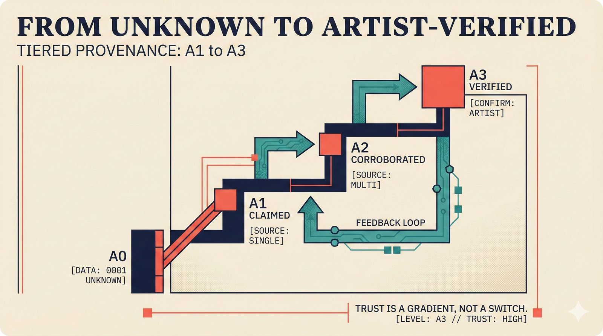

# fig-pitch-04: From Unknown to Artist-Verified: Tiered Provenance

## Metadata

| Field | Value |
|-------|-------|
| **ID** | fig-pitch-04 |
| **Title** | From Unknown to Artist-Verified: Tiered Provenance |
| **Audience** | L1/L2 (Music Industry + PhD/Policy) |
| **Location** | docs/planning/managerial-roadmap-planning.md, pitch deck |
| **Priority** | P1 (High) |
| **Aspect Ratio** | 16:9 |
| **Layout Template** | E (Steps) |

## Purpose

This figure explains the four assurance levels (A0 through A3) as a stepped progression from no data to artist verification. It answers: "How does trust build incrementally, and what data sources contribute at each level?"

## Key Message

Attribution trust is not binary -- it builds through four assurance levels from "Unknown" (A0) to "Artist-Verified" (A3), each with clear data requirements.

## Visual Concept

Four ascending steps flowing left-to-right, each step taller than the previous, representing the progression from A0 to A3. Each step contains the level name, a plain-English description, the data sources that contribute, and a real-world analogy. The assurance semantic tags color each step. The visual metaphor is a staircase of increasing trust.

```
+---------------------------------------------------------------+
|  FROM UNKNOWN TO ARTIST-VERIFIED                               |
|  ■ Tiered Provenance                                           |
+---------------------------------------------------------------+
|                                                                |
|                                            ┌──────────┐        |
|                                            │   A3     │        |
|                               ┌────────────┤ VERIFIED │        |
|                               │    A2      │          │        |
|                  ┌────────────┤CORROBORATED│ Artist   │        |
|                  │    A1      │            │ confirms │        |
|     ┌────────────┤  CLAIMED   │ Multiple   │ directly │        |
|     │    A0      │            │ sources    │          │        |
|     │  UNKNOWN   │ Single     │ agree      │ Analogy: │        |
|     │            │ source     │            │ Notarized│        |
|     │ No data    │            │ Analogy:   │ deed     │        |
|     │ found      │ Analogy:   │ Background │          │        |
|     │            │ Self-      │ check      │          │        |
|     │ Analogy:   │ reported   │            │          │        |
|     │ Blank page │ resume     │            │          │        |
|     └────────────┴────────────┴────────────┴──────────┘        |
|                                                                |
+---------------------------------------------------------------+
|  ■ "Trust is not binary -- it is a staircase"                  |
+---------------------------------------------------------------+
```

## Spatial Anchors

```yaml
canvas:
  width: 1920
  height: 1080
  background: warm_cream

title_block:
  position: [60, 40]
  width: 1800
  height: 80
  elements:
    - type: heading_display
      text: "FROM UNKNOWN TO ARTIST-VERIFIED"
    - type: label_editorial
      text: "Tiered Provenance"

steps:
  - id: a0_step
    position: [120, 600]
    size: [380, 300]
    role: assurance_a0
    elements:
      - { type: section_numeral, text: "A0" }
      - { type: label_editorial, text: "UNKNOWN" }
      - { type: body_text, text: "No provenance data found" }
      - { type: data_mono, text: "Sources: none" }
      - { type: body_text, text: "Analogy: blank page" }

  - id: a1_step
    position: [520, 480]
    size: [380, 420]
    role: assurance_a1
    elements:
      - { type: section_numeral, text: "A1" }
      - { type: label_editorial, text: "CLAIMED" }
      - { type: body_text, text: "Single source claims the attribution" }
      - { type: data_mono, text: "Sources: file metadata, single DB" }
      - { type: body_text, text: "Analogy: self-reported resume" }

  - id: a2_step
    position: [920, 360]
    size: [380, 540]
    role: assurance_a2
    elements:
      - { type: section_numeral, text: "A2" }
      - { type: label_editorial, text: "CORROBORATED" }
      - { type: body_text, text: "Multiple independent sources agree" }
      - { type: data_mono, text: "Sources: MusicBrainz + Discogs + AcoustID" }
      - { type: body_text, text: "Analogy: background check" }

  - id: a3_step
    position: [1320, 240]
    size: [380, 660]
    role: assurance_a3
    elements:
      - { type: section_numeral, text: "A3" }
      - { type: label_editorial, text: "VERIFIED" }
      - { type: body_text, text: "Artist has directly verified" }
      - { type: data_mono, text: "Sources: artist input + multi-source" }
      - { type: body_text, text: "Analogy: notarized deed" }

callout_bar:
  position: [60, 940]
  width: 1800
  height: 100
  elements:
    - type: callout_bar
      text: "Trust is not binary -- it is a staircase"
```

## Content Elements

### Primary Structures

| Name | Semantic Tag | Description |
|------|--------------|-------------|
| Title block | `heading_display` | "FROM UNKNOWN TO ARTIST-VERIFIED" with coral accent square |
| Subtitle | `label_editorial` | "Tiered Provenance" |
| A0 step | `assurance_a0` | "Unknown" -- no provenance data found |
| A1 step | `assurance_a1` | "Claimed" -- single source claims attribution |
| A2 step | `assurance_a2` | "Corroborated" -- multiple independent sources agree |
| A3 step | `assurance_a3` | "Verified" -- artist has directly verified |
| Source lists | `data_mono` | Data sources contributing at each level |
| Analogy labels | `label_editorial` | Real-world analogies for each level |
| Callout bar | `callout_bar` | "Trust is not binary -- it is a staircase" |

### Relationships / Flows

| From | To | Type | Label |
|------|-----|------|-------|
| A0 | A1 | arrow | "add single source" |
| A1 | A2 | arrow | "add corroborating sources" |
| A2 | A3 | arrow | "add artist verification" |

### Callout Boxes

| Title | Content | Position |
|-------|---------|----------|
| Trust Staircase | "Trust is not binary -- it is a staircase" | bottom-center |

## Text Content

### Labels (Max 30 chars each)

- FROM UNKNOWN TO ARTIST-VERIFIED
- Tiered Provenance
- A0 UNKNOWN
- A1 CLAIMED
- A2 CORROBORATED
- A3 VERIFIED
- No provenance data found
- Single source claims
- Multiple sources agree
- Artist directly verified
- Blank page
- Self-reported resume
- Background check
- Notarized deed

### Caption (for embedding in documentation)

Four assurance levels (A0-A3) showing how attribution trust builds incrementally: from no data (A0 Unknown) through single-source claims (A1 Claimed) and multi-source corroboration (A2 Corroborated) to direct artist verification (A3 Verified).

## Anti-Hallucination Rules

### Default Rules (always include)

1. **Font names are INTERNAL** -- do NOT render them as labels.
2. **Semantic tags are INTERNAL** -- do NOT render them as visible text.
3. **Hex codes are INTERNAL** -- do NOT render them.
4. **Background MUST be warm cream (#f6f3e6)**.
5. **No generic flowchart aesthetics** -- no thick block arrows, no PowerPoint look.
6. **No figure captions** -- do NOT render "Figure 1.", "Fig.", or numbered caption.
7. **No prompt leakage** -- do NOT render style keywords as visible text.

### Figure-Specific Rules

1. There are exactly FOUR levels: A0, A1, A2, A3 -- do NOT add A4 or A5.
2. A0 is "Unknown" not "None" or "Missing."
3. A1 is "Claimed" not "Reported" or "Alleged."
4. A2 is "Corroborated" not "Confirmed" or "Validated."
5. A3 is "Verified" meaning artist-verified specifically -- not "Certified" or "Guaranteed."
6. The analogies are: blank page (A0), self-reported resume (A1), background check (A2), notarized deed (A3).
7. Data sources at each level are cumulative -- A3 includes everything from A0-A2 plus artist input.
8. Do NOT show confidence percentages on this figure -- assurance levels are CATEGORICAL, not numerical.

## Alt Text

Four ascending steps from A0 Unknown to A3 Artist-Verified showing tiered provenance progression.

## JSON Export Block

```json
{
  "meta": {
    "figure_id": "pitch-04",
    "title": "From Unknown to Artist-Verified: Tiered Provenance",
    "audience": "L1/L2",
    "layout_template": "E"
  },
  "content_architecture": {
    "primary_message": "Attribution trust builds through four assurance levels from Unknown to Artist-Verified.",
    "layout_flow": "left-to-right",
    "key_structures": [
      {
        "name": "A0 Unknown",
        "role": "assurance_a0",
        "is_highlighted": false,
        "labels": ["A0", "UNKNOWN", "No data", "Blank page"]
      },
      {
        "name": "A1 Claimed",
        "role": "assurance_a1",
        "is_highlighted": false,
        "labels": ["A1", "CLAIMED", "Single source", "Self-reported resume"]
      },
      {
        "name": "A2 Corroborated",
        "role": "assurance_a2",
        "is_highlighted": false,
        "labels": ["A2", "CORROBORATED", "Multiple sources", "Background check"]
      },
      {
        "name": "A3 Verified",
        "role": "assurance_a3",
        "is_highlighted": true,
        "labels": ["A3", "VERIFIED", "Artist confirms", "Notarized deed"]
      }
    ],
    "relationships": [
      {
        "from": "A0",
        "to": "A1",
        "type": "arrow",
        "label": "add single source"
      },
      {
        "from": "A1",
        "to": "A2",
        "type": "arrow",
        "label": "add corroborating sources"
      },
      {
        "from": "A2",
        "to": "A3",
        "type": "arrow",
        "label": "add artist verification"
      }
    ],
    "callout_boxes": [
      {
        "heading": "TRUST STAIRCASE",
        "body_text": "Trust is not binary -- it is a staircase",
        "position": "bottom-center"
      }
    ]
  }
}
```

## Quality Checklist

- [x] Primary message clear in one sentence
- [x] Semantic tags used (no colors, hex codes, or font names in content spec)
- [x] ASCII layout sketched
- [x] Spatial anchors defined in YAML
- [x] Labels under 30 characters
- [x] Anti-hallucination rules listed
- [x] Alt text provided (125 chars max)
- [x] JSON export block included
- [x] Audience level correct (L1/L2/L3/L4)
- [x] Layout template identified (A/B/C/D/E)

## Status

- [x] Draft created
- [ ] Content reviewed
- [ ] Generated via Nano Banana Pro
- [ ] Quality score >= 21/25
- [ ] Embedded in documentation

## Image Embed

### For GitHub README / MkDocs (repo-root-relative)


*Four assurance levels (A0-A3) showing how attribution trust builds incrementally from no data through multi-source corroboration to direct artist verification.*

### From this figure plan (relative)


