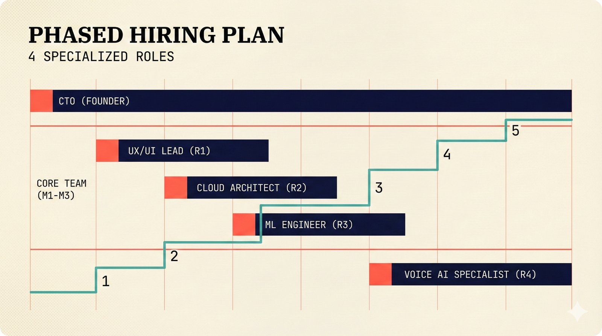

# fig-pitch-05: 4 Specialized Roles, Phased Hiring

## Metadata

| Field | Value |
|-------|-------|
| **ID** | fig-pitch-05 |
| **Title** | 4 Specialized Roles, Phased Hiring |
| **Audience** | L1 (Music Industry / Investors) |
| **Location** | docs/planning/managerial-roadmap-planning.md, pitch deck |
| **Priority** | P1 (High) |
| **Aspect Ratio** | 16:9 |
| **Layout Template** | B (Multi-Panel) |

## Purpose

This figure shows the phased hiring plan with four specialized roles added over 8 months. It answers: "How does the team grow, when does each role start, and what does each person do?"

## Key Message

The team grows from 1 (CTO/founder) to 5 over 8 months, with each hire timed to the roadmap phase that needs them.

## Visual Concept

A Gantt-style horizontal timeline from Month 0 to Month 18, with horizontal bars showing when each role starts and their ongoing contribution. The team size counter (1, 2, 3, 4, 5) is shown as a stepped line above the bars. Each role bar has a brief 2-word description. The CTO bar spans the full timeline; subsequent hires begin at their start month and extend to the right.

```
+---------------------------------------------------------------+
|  PHASED HIRING PLAN                                            |
|  ■ 4 Specialized Roles                                         |
+---------------------------------------------------------------+
|                                                                |
|  TEAM SIZE:  1    2    3    4              5                   |
|              ├────┤────┤────┤──────────────┤                   |
|                                                                |
|  M0   M1   M2   M3   M4   M6   M8   M12  M18                 |
|  ─────────────────────────────────────────────                 |
|                                                                |
|  CTO / FOUNDER                                                 |
|  ████████████████████████████████████████████  Full-Stack Lead |
|                                                                |
|  R1: UX/UI DESIGNER                                            |
|       ██████████████████████████████████████   Interface Craft |
|                                                                |
|  R2: CLOUD ENGINEER                                            |
|            █████████████████████████████████   Infra Scaling   |
|                                                                |
|  R3: LLM/ML ENGINEER                                           |
|                 ████████████████████████████   Model Tuning    |
|                                                                |
|  R4: VOICE AGENT ENGINEER                                      |
|                                    █████████   Audio Pipeline  |
|                                                                |
+---------------------------------------------------------------+
|  ■ "Each hire maps to a roadmap phase, not a headcount target" |
+---------------------------------------------------------------+
```

## Spatial Anchors

```yaml
canvas:
  width: 1920
  height: 1080
  background: warm_cream

title_block:
  position: [60, 40]
  width: 1800
  height: 80
  elements:
    - type: heading_display
      text: "PHASED HIRING PLAN"
    - type: label_editorial
      text: "4 Specialized Roles"

team_size_counter:
  position: [300, 140]
  width: 1520
  height: 80
  data_points:
    - { month: 0, size: 1 }
    - { month: 1, size: 2 }
    - { month: 2, size: 3 }
    - { month: 3, size: 4 }
    - { month: 8, size: 5 }

timeline_axis:
  position: [300, 240]
  width: 1520
  height: 40
  ticks: ["M0", "M1", "M2", "M3", "M4", "M6", "M8", "M12", "M18"]

gantt_bars:
  position: [60, 300]
  width: 1800
  height: 500
  bars:
    - id: cto
      label: "CTO / FOUNDER"
      description: "Full-Stack Lead"
      start: 0
      end: 18
      row: 1

    - id: r1_ux
      label: "R1: UX/UI DESIGNER"
      description: "Interface Craft"
      start: 1
      end: 18
      row: 2

    - id: r2_cloud
      label: "R2: CLOUD ENGINEER"
      description: "Infra Scaling"
      start: 2
      end: 18
      row: 3

    - id: r3_llm
      label: "R3: LLM/ML ENGINEER"
      description: "Model Tuning"
      start: 3
      end: 18
      row: 4

    - id: r4_voice
      label: "R4: VOICE AGENT ENGINEER"
      description: "Audio Pipeline"
      start: 8
      end: 18
      row: 5

callout_bar:
  position: [60, 920]
  width: 1800
  height: 100
  elements:
    - type: callout_bar
      text: "Each hire maps to a roadmap phase, not a headcount target"
```

## Content Elements

### Primary Structures

| Name | Semantic Tag | Description |
|------|--------------|-------------|
| Title block | `heading_display` | "PHASED HIRING PLAN" with coral accent square |
| Subtitle | `label_editorial` | "4 Specialized Roles" |
| Team size counter | `data_mono` | Stepped line showing team growth: 1 to 5 |
| Timeline axis | `label_editorial` | Month markers from M0 to M18 |
| CTO bar | `processing_stage` | Full-timeline bar -- Full-Stack Lead |
| R1 UX/UI bar | `processing_stage` | Starting M1 -- Interface Craft |
| R2 Cloud bar | `processing_stage` | Starting M2 -- Infra Scaling |
| R3 LLM/ML bar | `processing_stage` | Starting M3 -- Model Tuning |
| R4 Voice bar | `processing_stage` | Starting M8 -- Audio Pipeline |
| Role descriptions | `data_mono` | 2-word description for each role |
| Callout bar | `callout_bar` | Bottom insight statement |

### Relationships / Flows

| From | To | Type | Label |
|------|-----|------|-------|
| CTO start (M0) | R1 start (M1) | progression | "first hire" |
| R1 start (M1) | R2 start (M2) | progression | "second hire" |
| R2 start (M2) | R3 start (M3) | progression | "third hire" |
| R3 start (M3) | R4 start (M8) | progression | "fourth hire (Phase 3)" |

### Callout Boxes

| Title | Content | Position |
|-------|---------|----------|
| Hire Timing | "Each hire maps to a roadmap phase, not a headcount target" | bottom-center |

## Text Content

### Labels (Max 30 chars each)

- PHASED HIRING PLAN
- 4 Specialized Roles
- CTO / FOUNDER
- R1: UX/UI DESIGNER
- R2: CLOUD ENGINEER
- R3: LLM/ML ENGINEER
- R4: VOICE AGENT ENGINEER
- Full-Stack Lead
- Interface Craft
- Infra Scaling
- Model Tuning
- Audio Pipeline

### Caption (for embedding in documentation)

Phased hiring plan growing the team from 1 (CTO/founder at M0) to 5 over 8 months: UX/UI designer (M1), cloud engineer (M2), LLM/ML engineer (M3), and voice agent engineer (M8), each timed to the roadmap phase that requires their expertise.

## Anti-Hallucination Rules

### Default Rules (always include)

1. **Font names are INTERNAL** -- do NOT render them as labels.
2. **Semantic tags are INTERNAL** -- do NOT render them as visible text.
3. **Hex codes are INTERNAL** -- do NOT render them.
4. **Background MUST be warm cream (#f6f3e6)**.
5. **No generic flowchart aesthetics** -- no thick block arrows, no PowerPoint look.
6. **No figure captions** -- do NOT render "Figure 1.", "Fig.", or numbered caption.
7. **No prompt leakage** -- do NOT render style keywords as visible text.

### Figure-Specific Rules

1. There are exactly 4 hires (R1-R4) plus the CTO/founder -- do NOT add a 5th hire.
2. R4 (Voice) starts at M8, not M4 -- there is a gap between R3 and R4.
3. Role descriptions are exactly 2 words each -- keep them concise.
4. The team size grows to 5, not 6 -- CTO + 4 hires.
5. Do NOT show salary figures on this diagram -- that is in the financial scenarios figure.
6. Do NOT show specific candidate names or nationalities.
7. Month labels use "M" prefix (M0, M1, etc.) -- do NOT write "Month 0" or "mo. 0."

## Alt Text

Gantt chart: CTO at M0, plus four phased hires (UX M1, Cloud M2, LLM M3, Voice M8) growing to 5.

## JSON Export Block

```json
{
  "meta": {
    "figure_id": "pitch-05",
    "title": "4 Specialized Roles, Phased Hiring",
    "audience": "L1",
    "layout_template": "B"
  },
  "content_architecture": {
    "primary_message": "The team grows from 1 to 5 over 8 months, each hire timed to the roadmap phase.",
    "layout_flow": "left-to-right",
    "key_structures": [
      {
        "name": "CTO / Founder",
        "role": "processing_stage",
        "is_highlighted": true,
        "labels": ["CTO / FOUNDER", "Full-Stack Lead", "M0-M18"]
      },
      {
        "name": "R1 UX/UI Designer",
        "role": "processing_stage",
        "is_highlighted": false,
        "labels": ["R1: UX/UI DESIGNER", "Interface Craft", "M1-M18"]
      },
      {
        "name": "R2 Cloud Engineer",
        "role": "processing_stage",
        "is_highlighted": false,
        "labels": ["R2: CLOUD ENGINEER", "Infra Scaling", "M2-M18"]
      },
      {
        "name": "R3 LLM/ML Engineer",
        "role": "processing_stage",
        "is_highlighted": false,
        "labels": ["R3: LLM/ML ENGINEER", "Model Tuning", "M3-M18"]
      },
      {
        "name": "R4 Voice Agent Engineer",
        "role": "processing_stage",
        "is_highlighted": false,
        "labels": ["R4: VOICE AGENT ENGINEER", "Audio Pipeline", "M8-M18"]
      }
    ],
    "relationships": [
      {
        "from": "CTO start",
        "to": "R4 start",
        "type": "arrow",
        "label": "phased growth over 8 months"
      }
    ],
    "callout_boxes": [
      {
        "heading": "HIRE TIMING",
        "body_text": "Each hire maps to a roadmap phase, not a headcount target",
        "position": "bottom-center"
      }
    ]
  }
}
```

## Quality Checklist

- [x] Primary message clear in one sentence
- [x] Semantic tags used (no colors, hex codes, or font names in content spec)
- [x] ASCII layout sketched
- [x] Spatial anchors defined in YAML
- [x] Labels under 30 characters
- [x] Anti-hallucination rules listed
- [x] Alt text provided (125 chars max)
- [x] JSON export block included
- [x] Audience level correct (L1/L2/L3/L4)
- [x] Layout template identified (A/B/C/D/E)

## Status

- [x] Draft created
- [ ] Content reviewed
- [ ] Generated via Nano Banana Pro
- [ ] Quality score >= 21/25
- [ ] Embedded in documentation

## Image Embed

### For GitHub README / MkDocs (repo-root-relative)


*Phased hiring plan growing the team from 1 to 5 over 8 months, each hire timed to the roadmap phase that requires their expertise.*

### From this figure plan (relative)


