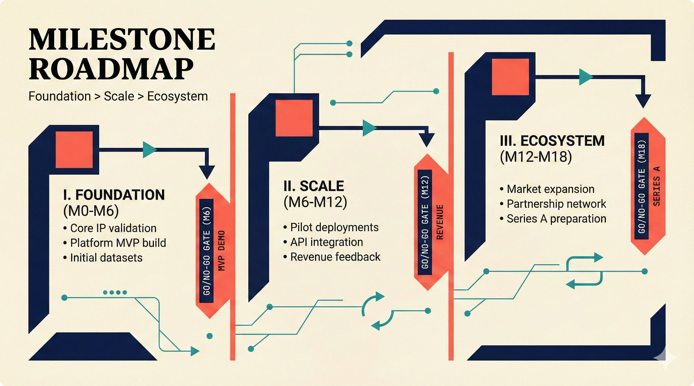

# fig-pitch-06: Foundation, Scale, Ecosystem

## Metadata

| Field | Value |
|-------|-------|
| **ID** | fig-pitch-06 |
| **Title** | Foundation, Scale, Ecosystem |
| **Audience** | L1 (Music Industry / Investors) |
| **Location** | docs/planning/managerial-roadmap-planning.md, pitch deck |
| **Priority** | P1 (High) |
| **Aspect Ratio** | 16:9 |
| **Layout Template** | E (Steps) |

## Purpose

This figure presents the three-phase milestone roadmap with clear gates between phases. It answers: "What are the key milestones, when do they happen, and what gates must be passed to proceed?"

## Key Message

Three phases -- Foundation (MVP Demo by M6), Scale (First Revenue by M12), Ecosystem (Series A by M18) -- with clear gates between each.

## Visual Concept

Three large panels flowing left-to-right, each representing one phase. Between panels, gate markers show the milestone that must be achieved to proceed. Each phase panel contains 3-4 key deliverables. The visual progression goes from narrow/simple (Phase 1) to wide/complex (Phase 3), suggesting growth. Roman numerals mark each phase.

```
+---------------------------------------------------------------+
|  MILESTONE ROADMAP                                             |
|  ■ Foundation > Scale > Ecosystem                              |
+---------------------------------------------------------------+
|                                                                |
|  ┌──────────────┐    ┌──────────────┐    ┌──────────────┐     |
|  │     I.       │    │    II.       │    │   III.       │     |
|  │  FOUNDATION  │ ▶  │    SCALE     │ ▶  │  ECOSYSTEM   │     |
|  │  M0 -- M6    │GATE│  M6 -- M12   │GATE│  M12 -- M18  │     |
|  │              │    │              │    │              │     |
|  │ ■ ETL pipeline│    │ ■ First paying│    │ ■ CMO pilot  │     |
|  │ ■ Confidence │    │   customers  │    │   (STIM)    │     |
|  │   scoring    │    │ ■ Pro tier   │    │ ■ Series A   │     |
|  │ ■ Agent UI   │    │   launch    │    │   readiness  │     |
|  │ ■ MCP server │    │ ■ 3 data    │    │ ■ Voice agent│     |
|  │              │    │   sources   │    │ ■ 10+ sources│     |
|  │              │    │ ■ EU AI Act  │    │ ■ Partnership│     |
|  │              │    │   compliance│    │   network    │     |
|  └──────────────┘    └──────────────┘    └──────────────┘     |
|       |                    |                    |              |
|   MVP DEMO            FIRST REVENUE        SERIES A           |
|    (M6)                 (M12)               (M18)             |
|                                                                |
+---------------------------------------------------------------+
|  ■ "Each gate is a go/no-go decision, not a calendar date"    |
+---------------------------------------------------------------+
```

## Spatial Anchors

```yaml
canvas:
  width: 1920
  height: 1080
  background: warm_cream

title_block:
  position: [60, 40]
  width: 1800
  height: 80
  elements:
    - type: heading_display
      text: "MILESTONE ROADMAP"
    - type: label_editorial
      text: "Foundation > Scale > Ecosystem"

phase_panels:
  - id: phase_1
    position: [60, 160]
    size: [540, 560]
    elements:
      - { type: section_numeral, text: "I" }
      - { type: label_editorial, text: "FOUNDATION" }
      - { type: data_mono, text: "M0 -- M6" }
      - type: bullet_list
        items:
          - "ETL pipeline"
          - "Confidence scoring"
          - "Agent UI"
          - "MCP server"

  - id: gate_1
    position: [620, 380]
    size: [60, 100]
    elements:
      - { type: gate_marker, text: "MVP DEMO (M6)" }

  - id: phase_2
    position: [700, 160]
    size: [540, 560]
    elements:
      - { type: section_numeral, text: "II" }
      - { type: label_editorial, text: "SCALE" }
      - { type: data_mono, text: "M6 -- M12" }
      - type: bullet_list
        items:
          - "First paying customers"
          - "Pro tier launch"
          - "3 data sources"
          - "EU AI Act compliance"

  - id: gate_2
    position: [1260, 380]
    size: [60, 100]
    elements:
      - { type: gate_marker, text: "FIRST REVENUE (M12)" }

  - id: phase_3
    position: [1340, 160]
    size: [540, 560]
    elements:
      - { type: section_numeral, text: "III" }
      - { type: label_editorial, text: "ECOSYSTEM" }
      - { type: data_mono, text: "M12 -- M18" }
      - type: bullet_list
        items:
          - "CMO pilot (STIM)"
          - "Series A readiness"
          - "Voice agent"
          - "10+ data sources"
          - "Partnership network"

milestone_labels:
  - { text: "MVP DEMO (M6)", position: [300, 780] }
  - { text: "FIRST REVENUE (M12)", position: [940, 780] }
  - { text: "SERIES A (M18)", position: [1580, 780] }

callout_bar:
  position: [60, 920]
  width: 1800
  height: 100
  elements:
    - type: callout_bar
      text: "Each gate is a go/no-go decision, not a calendar date"
```

## Content Elements

### Primary Structures

| Name | Semantic Tag | Description |
|------|--------------|-------------|
| Title block | `heading_display` | "MILESTONE ROADMAP" with coral accent square |
| Subtitle | `label_editorial` | "Foundation > Scale > Ecosystem" |
| Phase 1 panel | `processing_stage` | Foundation phase M0-M6 with deliverables |
| Phase 2 panel | `processing_stage` | Scale phase M6-M12 with deliverables |
| Phase 3 panel | `processing_stage` | Ecosystem phase M12-M18 with deliverables |
| Gate markers | `decision_point` | Go/no-go gates between phases |
| Milestone labels | `data_mono` | "MVP DEMO (M6)", "FIRST REVENUE (M12)", "SERIES A (M18)" |
| Roman numerals | `section_numeral` | I, II, III for phases |
| Deliverable bullets | `label_editorial` | Key deliverables within each phase |
| Callout bar | `callout_bar` | Bottom insight about gates |

### Relationships / Flows

| From | To | Type | Label |
|------|-----|------|-------|
| Phase 1 | Gate 1 | arrow | "MVP Demo gate" |
| Gate 1 | Phase 2 | arrow | "proceed if demo works" |
| Phase 2 | Gate 2 | arrow | "First Revenue gate" |
| Gate 2 | Phase 3 | arrow | "proceed if revenue validates" |

### Callout Boxes

| Title | Content | Position |
|-------|---------|----------|
| Gates | "Each gate is a go/no-go decision, not a calendar date" | bottom-center |

## Text Content

### Labels (Max 30 chars each)

- MILESTONE ROADMAP
- Foundation > Scale > Ecosystem
- I. FOUNDATION
- II. SCALE
- III. ECOSYSTEM
- M0 -- M6
- M6 -- M12
- M12 -- M18
- ETL pipeline
- Confidence scoring
- Agent UI
- MCP server
- First paying customers
- Pro tier launch
- 3 data sources
- EU AI Act compliance
- CMO pilot (STIM)
- Series A readiness
- Voice agent
- 10+ data sources
- Partnership network
- MVP DEMO (M6)
- FIRST REVENUE (M12)
- SERIES A (M18)

### Caption (for embedding in documentation)

Three-phase milestone roadmap: Foundation (M0-M6, MVP Demo), Scale (M6-M12, First Revenue), Ecosystem (M12-M18, Series A readiness), with go/no-go gates between each phase.

## Anti-Hallucination Rules

### Default Rules (always include)

1. **Font names are INTERNAL** -- do NOT render them as labels.
2. **Semantic tags are INTERNAL** -- do NOT render them as visible text.
3. **Hex codes are INTERNAL** -- do NOT render them.
4. **Background MUST be warm cream (#f6f3e6)**.
5. **No generic flowchart aesthetics** -- no thick block arrows, no PowerPoint look.
6. **No figure captions** -- do NOT render "Figure 1.", "Fig.", or numbered caption.
7. **No prompt leakage** -- do NOT render style keywords as visible text.

### Figure-Specific Rules

1. There are exactly THREE phases -- do NOT add Phase 4 or Phase 0.
2. Phase names are "Foundation", "Scale", "Ecosystem" -- use these exact names.
3. Milestone months are M6, M12, M18 -- do NOT change these.
4. Gates are between phases, not within phases -- do NOT add sub-gates.
5. STIM is a Swedish CMO (Collective Management Organization) -- do NOT expand differently.
6. "Series A readiness" means readiness, not a guaranteed raise -- do NOT imply certainty.
7. Do NOT show dollar amounts on this figure -- that is in the financial scenarios figure.
8. Do NOT show numbered step circles -- use accent squares and editorial caps per design system.

## Alt Text

Three-phase roadmap: Foundation M0-M6, Scale M6-M12, Ecosystem M12-M18, with go/no-go gates.

## JSON Export Block

```json
{
  "meta": {
    "figure_id": "pitch-06",
    "title": "Foundation, Scale, Ecosystem",
    "audience": "L1",
    "layout_template": "E"
  },
  "content_architecture": {
    "primary_message": "Three phases with clear gates: Foundation (MVP M6), Scale (Revenue M12), Ecosystem (Series A M18).",
    "layout_flow": "left-to-right",
    "key_structures": [
      {
        "name": "Phase 1 Foundation",
        "role": "processing_stage",
        "is_highlighted": false,
        "labels": ["I. FOUNDATION", "M0-M6", "ETL pipeline", "Confidence scoring", "Agent UI", "MCP server"]
      },
      {
        "name": "Phase 2 Scale",
        "role": "processing_stage",
        "is_highlighted": false,
        "labels": ["II. SCALE", "M6-M12", "First paying customers", "Pro tier", "3 data sources"]
      },
      {
        "name": "Phase 3 Ecosystem",
        "role": "processing_stage",
        "is_highlighted": true,
        "labels": ["III. ECOSYSTEM", "M12-M18", "CMO pilot", "Series A", "Voice agent", "10+ sources"]
      }
    ],
    "relationships": [
      {
        "from": "Phase 1",
        "to": "Phase 2",
        "type": "arrow",
        "label": "MVP Demo gate (M6)"
      },
      {
        "from": "Phase 2",
        "to": "Phase 3",
        "type": "arrow",
        "label": "First Revenue gate (M12)"
      }
    ],
    "callout_boxes": [
      {
        "heading": "GATES",
        "body_text": "Each gate is a go/no-go decision, not a calendar date",
        "position": "bottom-center"
      }
    ]
  }
}
```

## Quality Checklist

- [x] Primary message clear in one sentence
- [x] Semantic tags used (no colors, hex codes, or font names in content spec)
- [x] ASCII layout sketched
- [x] Spatial anchors defined in YAML
- [x] Labels under 30 characters
- [x] Anti-hallucination rules listed
- [x] Alt text provided (125 chars max)
- [x] JSON export block included
- [x] Audience level correct (L1/L2/L3/L4)
- [x] Layout template identified (A/B/C/D/E)

## Status

- [x] Draft created
- [ ] Content reviewed
- [ ] Generated via Nano Banana Pro
- [ ] Quality score >= 21/25
- [ ] Embedded in documentation

## Image Embed

### For GitHub README / MkDocs (repo-root-relative)


*Three-phase milestone roadmap with go/no-go gates: Foundation (MVP Demo by M6), Scale (First Revenue by M12), Ecosystem (Series A by M18).*

### From this figure plan (relative)


