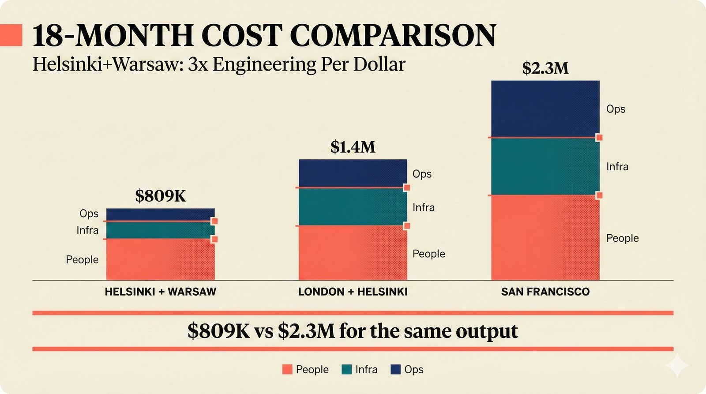

# fig-pitch-07: Helsinki+Warsaw: 3x Engineering Per Dollar vs SF

## Metadata

| Field | Value |
|-------|-------|
| **ID** | fig-pitch-07 |
| **Title** | Helsinki+Warsaw: 3x Engineering Per Dollar vs SF |
| **Audience** | L1 (Music Industry / Investors) |
| **Location** | docs/planning/managerial-roadmap-planning.md, pitch deck |
| **Priority** | P1 (High) |
| **Aspect Ratio** | 16:9 |
| **Layout Template** | B (Multi-Panel) |

## Purpose

This figure compares three geographic hiring scenarios on total 18-month cost, showing that a Helsinki+Warsaw team achieves the same output as a San Francisco team at roughly one-third the cost. It answers: "Why not hire in SF, and how much do we save?"

## Key Message

Helsinki+Warsaw delivers the same engineering output for $809K that would cost $2.3M in San Francisco -- a 3x cost advantage.

## Visual Concept

Three vertical stacked bars side by side, one for each location scenario (Helsinki+Warsaw, London+Helsinki, San Francisco). Each bar is segmented into people cost, infrastructure cost, and operations cost. The bars are proportional, making the SF bar dramatically taller. A callout highlights the "$809K vs $2.3M" contrast. The layout uses the multi-panel template with each scenario as a column.

```
+---------------------------------------------------------------+
|  18-MONTH COST COMPARISON                                      |
|  ■ Helsinki+Warsaw: 3x Engineering Per Dollar                   |
+---------------------------------------------------------------+
|                                                                |
|                                                   ┌────┐       |
|                                                   │    │       |
|                                                   │    │       |
|                                                   │    │       |
|                                          ┌────┐   │ SF │       |
|                                          │    │   │    │       |
|                              ┌────┐      │ LDN│   │$2.3M│      |
|                              │    │      │ +  │   │    │       |
|                              │HEL │      │ HEL│   │    │       |
|                              │ +  │      │    │   │    │       |
|                              │WAR │      │$1.4M│  │    │       |
|                              │    │      │    │   │    │       |
|                              │$809K│     │    │   │    │       |
|                              │    │      │    │   │    │       |
|                              └────┘      └────┘   └────┘       |
|                                                                |
|  ┌─────────┐  People   ┌─────────┐  Infra   ┌─────────┐  Ops |
|  └─────────┘           └─────────┘          └─────────┘       |
|                                                                |
+---------------------------------------------------------------+
|  ■ "$809K vs $2.3M for the same output"                        |
+---------------------------------------------------------------+
```

## Spatial Anchors

```yaml
canvas:
  width: 1920
  height: 1080
  background: warm_cream

title_block:
  position: [60, 40]
  width: 1800
  height: 80
  elements:
    - type: heading_display
      text: "18-MONTH COST COMPARISON"
    - type: label_editorial
      text: "Helsinki+Warsaw: 3x Engineering Per Dollar"

bar_chart:
  position: [200, 160]
  width: 1520
  height: 640

  bars:
    - id: hel_war
      position: [320, 160]
      width: 300
      label: "HELSINKI + WARSAW"
      total: "$809K"
      segments:
        - { label: "People", proportion: 0.65 }
        - { label: "Infra", proportion: 0.20 }
        - { label: "Ops", proportion: 0.15 }

    - id: ldn_hel
      position: [800, 160]
      width: 300
      label: "LONDON + HELSINKI"
      total: "$1.4M"
      segments:
        - { label: "People", proportion: 0.70 }
        - { label: "Infra", proportion: 0.18 }
        - { label: "Ops", proportion: 0.12 }

    - id: sf
      position: [1280, 160]
      width: 300
      label: "SAN FRANCISCO"
      total: "$2.3M"
      segments:
        - { label: "People", proportion: 0.75 }
        - { label: "Infra", proportion: 0.15 }
        - { label: "Ops", proportion: 0.10 }

legend:
  position: [200, 840]
  width: 1520
  height: 40
  items:
    - { label: "People", role: "processing_stage" }
    - { label: "Infra", role: "storage_layer" }
    - { label: "Ops", role: "api_endpoint" }

callout_bar:
  position: [60, 920]
  width: 1800
  height: 100
  elements:
    - type: callout_bar
      text: "$809K vs $2.3M for the same output"
```

## Content Elements

### Primary Structures

| Name | Semantic Tag | Description |
|------|--------------|-------------|
| Title block | `heading_display` | "18-MONTH COST COMPARISON" with coral accent square |
| Subtitle | `label_editorial` | "Helsinki+Warsaw: 3x Engineering Per Dollar" |
| Helsinki+Warsaw bar | `selected_option` | Shortest bar, highlighted as preferred scenario |
| London+Helsinki bar | `branching_path` | Middle bar, alternative scenario |
| San Francisco bar | `branching_path` | Tallest bar, most expensive scenario |
| People segments | `processing_stage` | Largest segment in each bar -- salary costs |
| Infra segments | `storage_layer` | Cloud infrastructure costs |
| Ops segments | `api_endpoint` | Operations and overhead costs |
| Total labels | `data_mono` | "$809K", "$1.4M", "$2.3M" |
| Legend | `label_editorial` | Color legend for People, Infra, Ops |
| Callout bar | `callout_bar` | "$809K vs $2.3M for the same output" |

### Relationships / Flows

| From | To | Type | Label |
|------|-----|------|-------|
| Helsinki+Warsaw total | SF total | contrast | "2.8x cost difference" |
| Helsinki+Warsaw bar | Callout | emphasis | "preferred scenario" |

### Callout Boxes

| Title | Content | Position |
|-------|---------|----------|
| Cost Advantage | "$809K vs $2.3M for the same output" | bottom-center |

## Text Content

### Labels (Max 30 chars each)

- 18-MONTH COST COMPARISON
- Helsinki+Warsaw: 3x Per Dollar
- HELSINKI + WARSAW
- LONDON + HELSINKI
- SAN FRANCISCO
- $809K
- $1.4M
- $2.3M
- People
- Infra
- Ops

### Caption (for embedding in documentation)

Three geographic hiring scenarios compared: Helsinki+Warsaw ($809K), London+Helsinki ($1.4M), and San Francisco ($2.3M) for 18 months, showing a 3x cost advantage for the Nordic+CEE combination with equivalent engineering output.

## Anti-Hallucination Rules

### Default Rules (always include)

1. **Font names are INTERNAL** -- do NOT render them as labels.
2. **Semantic tags are INTERNAL** -- do NOT render them as visible text.
3. **Hex codes are INTERNAL** -- do NOT render them.
4. **Background MUST be warm cream (#f6f3e6)**.
5. **No generic flowchart aesthetics** -- no thick block arrows, no PowerPoint look.
6. **No figure captions** -- do NOT render "Figure 1.", "Fig.", or numbered caption.
7. **No prompt leakage** -- do NOT render style keywords as visible text.

### Figure-Specific Rules

1. Dollar amounts are $809K, $1.4M, $2.3M -- do NOT round or change these figures.
2. The cost advantage is approximately 3x (2.8x exact) -- do NOT claim exactly 3x.
3. "Same output" means equivalent engineering capability -- do NOT imply identical work quality.
4. Do NOT show specific salary breakdowns per role -- keep at aggregate level.
5. Do NOT show country flags or national symbols.
6. The three cost segments are People, Infra, Ops -- do NOT add a fourth category.
7. Helsinki+Warsaw should be visually highlighted as the recommended/preferred scenario.
8. These are 18-month projections, not annual -- do NOT label as "annual cost."

## Alt Text

Stacked bar comparison: Helsinki+Warsaw $809K, London+Helsinki $1.4M, San Francisco $2.3M for 18 months.

## JSON Export Block

```json
{
  "meta": {
    "figure_id": "pitch-07",
    "title": "Helsinki+Warsaw: 3x Engineering Per Dollar vs SF",
    "audience": "L1",
    "layout_template": "B"
  },
  "content_architecture": {
    "primary_message": "Helsinki+Warsaw delivers the same output for $809K that costs $2.3M in San Francisco.",
    "layout_flow": "left-to-right",
    "key_structures": [
      {
        "name": "Helsinki+Warsaw",
        "role": "selected_option",
        "is_highlighted": true,
        "labels": ["HELSINKI + WARSAW", "$809K", "People", "Infra", "Ops"]
      },
      {
        "name": "London+Helsinki",
        "role": "branching_path",
        "is_highlighted": false,
        "labels": ["LONDON + HELSINKI", "$1.4M"]
      },
      {
        "name": "San Francisco",
        "role": "branching_path",
        "is_highlighted": false,
        "labels": ["SAN FRANCISCO", "$2.3M"]
      }
    ],
    "relationships": [
      {
        "from": "Helsinki+Warsaw",
        "to": "San Francisco",
        "type": "dashed",
        "label": "2.8x cost difference"
      }
    ],
    "callout_boxes": [
      {
        "heading": "COST ADVANTAGE",
        "body_text": "$809K vs $2.3M for the same output",
        "position": "bottom-center"
      }
    ]
  }
}
```

## Quality Checklist

- [x] Primary message clear in one sentence
- [x] Semantic tags used (no colors, hex codes, or font names in content spec)
- [x] ASCII layout sketched
- [x] Spatial anchors defined in YAML
- [x] Labels under 30 characters
- [x] Anti-hallucination rules listed
- [x] Alt text provided (125 chars max)
- [x] JSON export block included
- [x] Audience level correct (L1/L2/L3/L4)
- [x] Layout template identified (A/B/C/D/E)

## Status

- [x] Draft created
- [ ] Content reviewed
- [ ] Generated via Nano Banana Pro
- [ ] Quality score >= 21/25
- [ ] Embedded in documentation

## Image Embed

### For GitHub README / MkDocs (repo-root-relative)


*Three geographic hiring scenarios compared for 18 months: Helsinki+Warsaw ($809K) achieves 3x cost advantage over San Francisco ($2.3M) with equivalent engineering output.*

### From this figure plan (relative)


