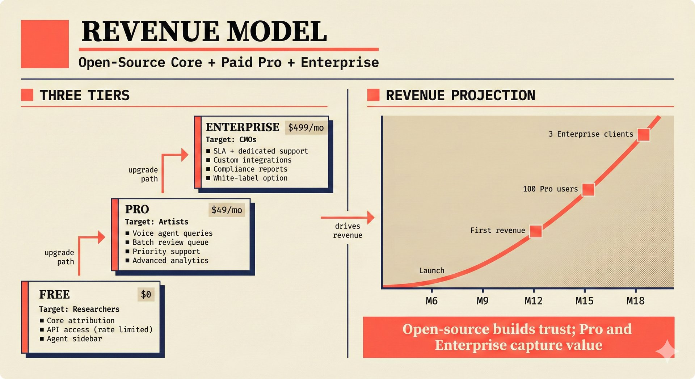

# fig-pitch-08: Open-Source Core + Paid Pro + Enterprise

## Metadata

| Field | Value |
|-------|-------|
| **ID** | fig-pitch-08 |
| **Title** | Open-Source Core + Paid Pro + Enterprise |
| **Audience** | L1 (Music Industry / Investors) |
| **Location** | docs/planning/managerial-roadmap-planning.md, pitch deck |
| **Priority** | P1 (High) |
| **Aspect Ratio** | 16:9 |
| **Layout Template** | D (Split-Panel) |

## Purpose

This figure shows the three-tier revenue model with clear feature differentiation and target user segments. It answers: "How does the project make money, who pays, and what do they get?"

## Key Message

An open-core model with three tiers -- Free for researchers, Pro ($49/mo) for artists, Enterprise ($499/mo) for CMOs -- captures value at every market segment.

## Visual Concept

A split-panel layout with the left side showing three vertically stacked tier cards (Free, Pro, Enterprise) with features listed in each, and the right side showing a revenue projection curve. The tiers visually grow in size/prominence from Free (smallest) to Enterprise (largest). Target user counts are shown alongside each tier.

```
+---------------------------------------------------------------+
|  REVENUE MODEL                                                 |
|  ■ Open-Source Core + Paid Pro + Enterprise                     |
+-------------------------------+-------------------------------+
|                               |                               |
|  I. THREE TIERS               |  II. REVENUE PROJECTION       |
|  ─────────────────            |  ─────────────────            |
|                               |                               |
|  ┌─────────────────────┐      |         /                     |
|  │ ENTERPRISE  $499/mo │      |        /                      |
|  │ Target: CMOs        │      |       / Enterprise            |
|  │ ■ SLA + dedicated   │      |      /                        |
|  │ ■ Custom integrations│     |     /                         |
|  │ ■ Compliance reports │      |    ─── Pro                    |
|  │ ■ White-label option │      |   /                           |
|  └─────────────────────┘      |  ─── Free (community)         |
|                               |  ├────┼────┼────┼────┤        |
|  ┌─────────────────────┐      |  M6   M9   M12  M15  M18     |
|  │ PRO         $49/mo  │      |                               |
|  │ Target: Artists      │      |  Milestone:                   |
|  │ ■ Voice agent queries│      |  M12: First revenue           |
|  │ ■ Batch review queue │      |  M15: 100 Pro users           |
|  │ ■ Priority support  │      |  M18: 3 Enterprise clients    |
|  │ ■ Advanced analytics│      |                               |
|  └─────────────────────┘      |                               |
|                               |                               |
|  ┌─────────────────────┐      |                               |
|  │ FREE                │      |                               |
|  │ Target: Researchers  │      |                               |
|  │ ■ Core attribution  │      |                               |
|  │ ■ API access (rate  │      |                               |
|  │   limited)          │      |                               |
|  │ ■ Agent sidebar     │      |                               |
|  └─────────────────────┘      |                               |
|                               |                               |
+-------------------------------+-------------------------------+
|  ■ "Open-source builds trust; Pro and Enterprise capture value"|
+---------------------------------------------------------------+
```

## Spatial Anchors

```yaml
canvas:
  width: 1920
  height: 1080
  background: warm_cream

title_block:
  position: [60, 40]
  width: 1800
  height: 80
  elements:
    - type: heading_display
      text: "REVENUE MODEL"
    - type: label_editorial
      text: "Open-Source Core + Paid Pro + Enterprise"

left_panel:
  position: [60, 160]
  width: 860
  height: 720
  label: "THREE TIERS"
  tiers:
    - id: enterprise
      position: [80, 180]
      size: [800, 180]
      elements:
        - { type: label_editorial, text: "ENTERPRISE" }
        - { type: data_mono, text: "$499/mo" }
        - { type: body_text, text: "Target: CMOs" }
        - type: features
          items: ["SLA + dedicated support", "Custom integrations", "Compliance reports", "White-label option"]

    - id: pro
      position: [80, 400]
      size: [800, 180]
      elements:
        - { type: label_editorial, text: "PRO" }
        - { type: data_mono, text: "$49/mo" }
        - { type: body_text, text: "Target: Artists" }
        - type: features
          items: ["Voice agent queries", "Batch review queue", "Priority support", "Advanced analytics"]

    - id: free
      position: [80, 620]
      size: [800, 160]
      elements:
        - { type: label_editorial, text: "FREE" }
        - { type: data_mono, text: "$0" }
        - { type: body_text, text: "Target: Researchers" }
        - type: features
          items: ["Core attribution", "API access (rate limited)", "Agent sidebar"]

right_panel:
  position: [980, 160]
  width: 860
  height: 720
  label: "REVENUE PROJECTION"
  elements:
    - type: growth_curve
      data_points:
        - { month: "M6", note: "Launch" }
        - { month: "M12", note: "First revenue" }
        - { month: "M15", note: "100 Pro users" }
        - { month: "M18", note: "3 Enterprise clients" }

callout_bar:
  position: [60, 920]
  width: 1800
  height: 100
  elements:
    - type: callout_bar
      text: "Open-source builds trust; Pro and Enterprise capture value"
```

## Content Elements

### Primary Structures

| Name | Semantic Tag | Description |
|------|--------------|-------------|
| Title block | `heading_display` | "REVENUE MODEL" with coral accent square |
| Subtitle | `label_editorial` | "Open-Source Core + Paid Pro + Enterprise" |
| Enterprise tier | `solution_component` | $499/mo tier for CMOs with premium features |
| Pro tier | `solution_component` | $49/mo tier for artists with advanced features |
| Free tier | `solution_component` | $0 tier for researchers with core features |
| Price labels | `data_mono` | "$499/mo", "$49/mo", "$0" |
| Target segments | `label_editorial` | "CMOs", "Artists", "Researchers" |
| Revenue curve | `processing_stage` | Growth projection from M6 to M18 |
| Milestone labels | `data_mono` | Revenue milestones at M12, M15, M18 |
| Callout bar | `callout_bar` | Open-source trust + paid value capture |

### Relationships / Flows

| From | To | Type | Label |
|------|-----|------|-------|
| Free tier | Pro tier | arrow | "upgrade path" |
| Pro tier | Enterprise tier | arrow | "upgrade path" |
| Tiers | Revenue curve | arrow | "drives revenue" |

### Callout Boxes

| Title | Content | Position |
|-------|---------|----------|
| Value Capture | "Open-source builds trust; Pro and Enterprise capture value" | bottom-center |

## Text Content

### Labels (Max 30 chars each)

- REVENUE MODEL
- Open-Source Core + Pro + Enterprise
- ENTERPRISE $499/mo
- PRO $49/mo
- FREE
- Target: CMOs
- Target: Artists
- Target: Researchers
- SLA + dedicated support
- Custom integrations
- Compliance reports
- White-label option
- Voice agent queries
- Batch review queue
- Priority support
- Advanced analytics
- Core attribution
- API access (rate limited)
- Agent sidebar
- REVENUE PROJECTION

### Caption (for embedding in documentation)

Three-tier open-core revenue model: Free (researchers, core attribution), Pro ($49/mo, artists, voice agent and batch review), Enterprise ($499/mo, CMOs, SLA and compliance reports), with revenue projection from first revenue at M12 to 3 Enterprise clients by M18.

## Anti-Hallucination Rules

### Default Rules (always include)

1. **Font names are INTERNAL** -- do NOT render them as labels.
2. **Semantic tags are INTERNAL** -- do NOT render them as visible text.
3. **Hex codes are INTERNAL** -- do NOT render them.
4. **Background MUST be warm cream (#f6f3e6)**.
5. **No generic flowchart aesthetics** -- no thick block arrows, no PowerPoint look.
6. **No figure captions** -- do NOT render "Figure 1.", "Fig.", or numbered caption.
7. **No prompt leakage** -- do NOT render style keywords as visible text.

### Figure-Specific Rules

1. Prices are EXACTLY $49/mo (Pro) and $499/mo (Enterprise) -- do NOT change.
2. There are exactly THREE tiers -- do NOT add a fourth "Team" or "Business" tier.
3. Free tier includes core attribution and rate-limited API -- do NOT promise unlimited.
4. Voice agent is a Pro feature, not free -- this is a premium upsell.
5. Do NOT show exact ARR projections or MRR numbers -- keep revenue projection directional.
6. "CMOs" means Collective Management Organizations (like STIM, PRS) -- do NOT expand as "Chief Marketing Officers."
7. "White-label" is an Enterprise feature -- do NOT include in Pro tier.
8. The revenue projection is illustrative, not a financial guarantee -- do NOT use "projected revenue" as axis label.

## Alt Text

Three-tier pricing: Free for researchers, Pro $49/mo for artists, Enterprise $499/mo for CMOs, with revenue curve.

## JSON Export Block

```json
{
  "meta": {
    "figure_id": "pitch-08",
    "title": "Open-Source Core + Paid Pro + Enterprise",
    "audience": "L1",
    "layout_template": "D"
  },
  "content_architecture": {
    "primary_message": "An open-core model captures value at every segment: Free (researchers), Pro $49/mo (artists), Enterprise $499/mo (CMOs).",
    "layout_flow": "left-to-right",
    "key_structures": [
      {
        "name": "Enterprise Tier",
        "role": "solution_component",
        "is_highlighted": true,
        "labels": ["ENTERPRISE", "$499/mo", "CMOs", "SLA", "Compliance"]
      },
      {
        "name": "Pro Tier",
        "role": "solution_component",
        "is_highlighted": false,
        "labels": ["PRO", "$49/mo", "Artists", "Voice agent", "Batch review"]
      },
      {
        "name": "Free Tier",
        "role": "solution_component",
        "is_highlighted": false,
        "labels": ["FREE", "$0", "Researchers", "Core attribution", "API access"]
      },
      {
        "name": "Revenue Projection",
        "role": "processing_stage",
        "is_highlighted": false,
        "labels": ["M12: First revenue", "M15: 100 Pro users", "M18: 3 Enterprise clients"]
      }
    ],
    "relationships": [
      {
        "from": "Free",
        "to": "Pro",
        "type": "arrow",
        "label": "upgrade path"
      },
      {
        "from": "Pro",
        "to": "Enterprise",
        "type": "arrow",
        "label": "upgrade path"
      }
    ],
    "callout_boxes": [
      {
        "heading": "VALUE CAPTURE",
        "body_text": "Open-source builds trust; Pro and Enterprise capture value",
        "position": "bottom-center"
      }
    ]
  }
}
```

## Quality Checklist

- [x] Primary message clear in one sentence
- [x] Semantic tags used (no colors, hex codes, or font names in content spec)
- [x] ASCII layout sketched
- [x] Spatial anchors defined in YAML
- [x] Labels under 30 characters
- [x] Anti-hallucination rules listed
- [x] Alt text provided (125 chars max)
- [x] JSON export block included
- [x] Audience level correct (L1/L2/L3/L4)
- [x] Layout template identified (A/B/C/D/E)

## Status

- [x] Draft created
- [ ] Content reviewed
- [ ] Generated via Nano Banana Pro
- [ ] Quality score >= 21/25
- [ ] Embedded in documentation

## Image Embed

### For GitHub README / MkDocs (repo-root-relative)


*Three-tier open-core revenue model capturing value at every segment, from free researchers to $499/mo Enterprise CMO clients.*

### From this figure plan (relative)


