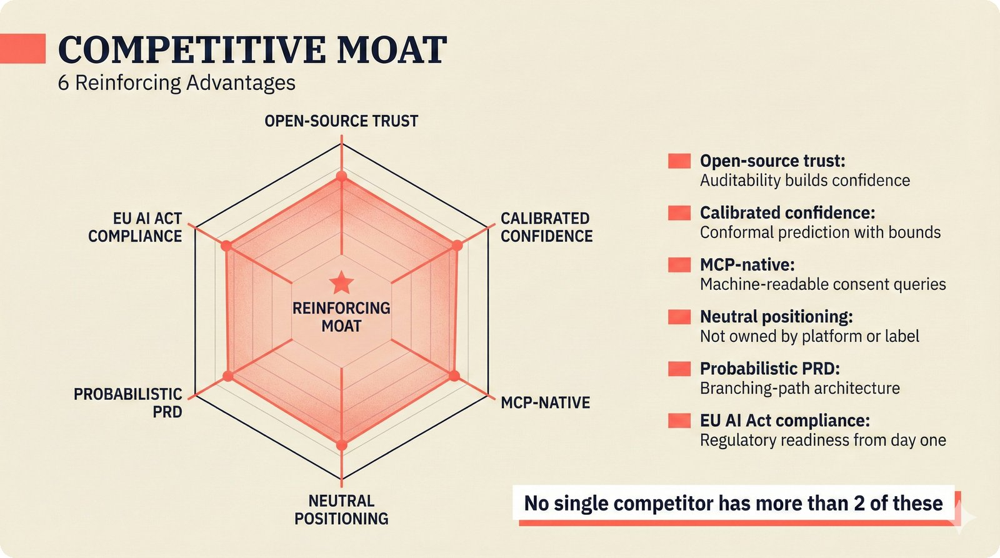

# fig-pitch-09: 6 Competitive Advantages

## Metadata

| Field | Value |
|-------|-------|
| **ID** | fig-pitch-09 |
| **Title** | 6 Competitive Advantages |
| **Audience** | L1 (Music Industry / Investors) |
| **Location** | docs/planning/managerial-roadmap-planning.md, pitch deck |
| **Priority** | P1 (High) |
| **Aspect Ratio** | 16:9 |
| **Layout Template** | B (Multi-Panel) |

## Purpose

This figure presents the six competitive advantages that form the project's defensibility moat. It answers: "What makes this project hard to replicate, and why can no single competitor match all six?"

## Key Message

Six reinforcing advantages -- open-source trust, calibrated confidence, MCP-native, neutral positioning, probabilistic PRD, and EU AI Act compliance -- create a moat no competitor can match with fewer than two.

## Visual Concept

A hexagonal radar/spider diagram with six axes, one for each competitive advantage. The scaffold fills most of the hexagon, while a note indicates competitors cover at most 2 of 6. Alternatively, six panels arranged in a 2x3 or 3x2 grid, each containing one advantage with a 1-line explanation. A coral accent square marks each panel. The callout emphasizes "No single competitor has more than 2."

```
+---------------------------------------------------------------+
|  COMPETITIVE MOAT                                              |
|  ■ 6 Reinforcing Advantages                                    |
+---------------------------------------------------------------+
|                                                                |
|           OPEN-SOURCE TRUST                                    |
|                ■                                               |
|               / \                                              |
|              /   \                                             |
|  EU AI ACT  /     \ CALIBRATED                                |
|  COMPLIANCE■       ■ CONFIDENCE                                |
|            |       |                                           |
|            |   ★   |   ★ = This Scaffold                      |
|            |       |                                           |
|  PROBABIL- ■       ■ MCP-NATIVE                               |
|  ISTIC PRD  \     /                                            |
|              \   /                                             |
|               \ /                                              |
|                ■                                               |
|          NEUTRAL                                               |
|         POSITIONING                                            |
|                                                                |
|  ┌──────────────────────────────────────────────┐              |
|  │ ■ Open-source trust     Auditability builds   │             |
|  │                         confidence            │              |
|  │ ■ Calibrated confidence Conformal prediction  │              |
|  │                         with bounds           │              |
|  │ ■ MCP-native            Machine-readable      │              |
|  │                         consent queries       │              |
|  │ ■ Neutral positioning   Not owned by platform │              |
|  │                         or label              │              |
|  │ ■ Probabilistic PRD     Branching-path        │              |
|  │                         architecture          │              |
|  │ ■ EU AI Act compliance  Regulatory readiness  │              |
|  │                         from day one          │              |
|  └──────────────────────────────────────────────┘              |
|                                                                |
+---------------------------------------------------------------+
|  ■ "No single competitor has more than 2 of these"             |
+---------------------------------------------------------------+
```

## Spatial Anchors

```yaml
canvas:
  width: 1920
  height: 1080
  background: warm_cream

title_block:
  position: [60, 40]
  width: 1800
  height: 80
  elements:
    - type: heading_display
      text: "COMPETITIVE MOAT"
    - type: label_editorial
      text: "6 Reinforcing Advantages"

hexagon_radar:
  position: [120, 140]
  width: 800
  height: 600
  center: [520, 440]
  axes:
    - { id: "open_source", label: "Open-Source Trust", angle: 90 }
    - { id: "calibrated", label: "Calibrated Confidence", angle: 30 }
    - { id: "mcp_native", label: "MCP-Native", angle: 330 }
    - { id: "neutral", label: "Neutral Positioning", angle: 270 }
    - { id: "prob_prd", label: "Probabilistic PRD", angle: 210 }
    - { id: "eu_ai_act", label: "EU AI Act Compliance", angle: 150 }
  fill_level: 0.85

advantage_list:
  position: [980, 140]
  width: 860
  height: 600
  items:
    - { label: "Open-source trust", explanation: "Auditability builds confidence" }
    - { label: "Calibrated confidence", explanation: "Conformal prediction with bounds" }
    - { label: "MCP-native", explanation: "Machine-readable consent queries" }
    - { label: "Neutral positioning", explanation: "Not owned by platform or label" }
    - { label: "Probabilistic PRD", explanation: "Branching-path architecture" }
    - { label: "EU AI Act compliance", explanation: "Regulatory readiness from day one" }

callout_bar:
  position: [60, 920]
  width: 1800
  height: 100
  elements:
    - type: callout_bar
      text: "No single competitor has more than 2 of these"
```

## Content Elements

### Primary Structures

| Name | Semantic Tag | Description |
|------|--------------|-------------|
| Title block | `heading_display` | "COMPETITIVE MOAT" with coral accent square |
| Subtitle | `label_editorial` | "6 Reinforcing Advantages" |
| Hexagonal radar | `processing_stage` | Six-axis radar chart filled to ~85% |
| Open-source trust axis | `solution_component` | Auditability builds confidence |
| Calibrated confidence axis | `solution_component` | Conformal prediction with bounds |
| MCP-native axis | `solution_component` | Machine-readable consent queries |
| Neutral positioning axis | `solution_component` | Not owned by platform or label |
| Probabilistic PRD axis | `solution_component` | Branching-path architecture |
| EU AI Act compliance axis | `solution_component` | Regulatory readiness from day one |
| Advantage list | `label_editorial` | Right-side list with explanations |
| Callout bar | `callout_bar` | "No single competitor has more than 2 of these" |

### Relationships / Flows

| From | To | Type | Label |
|------|-----|------|-------|
| All six axes | Center (scaffold) | radial | "reinforcing moat" |

### Callout Boxes

| Title | Content | Position |
|-------|---------|----------|
| Competitor Gap | "No single competitor has more than 2 of these" | bottom-center |

## Text Content

### Labels (Max 30 chars each)

- COMPETITIVE MOAT
- 6 Reinforcing Advantages
- Open-Source Trust
- Calibrated Confidence
- MCP-Native
- Neutral Positioning
- Probabilistic PRD
- EU AI Act Compliance
- Auditability builds confidence
- Conformal prediction with bounds
- Machine-readable consent queries
- Not owned by platform or label
- Branching-path architecture
- Regulatory readiness day one

### Caption (for embedding in documentation)

Six competitive advantages forming a defensive moat: open-source trust, calibrated confidence (conformal prediction), MCP-native consent, neutral positioning, probabilistic PRD architecture, and EU AI Act compliance readiness -- no single competitor has more than two.

## Anti-Hallucination Rules

### Default Rules (always include)

1. **Font names are INTERNAL** -- do NOT render them as labels.
2. **Semantic tags are INTERNAL** -- do NOT render them as visible text.
3. **Hex codes are INTERNAL** -- do NOT render them.
4. **Background MUST be warm cream (#f6f3e6)**.
5. **No generic flowchart aesthetics** -- no thick block arrows, no PowerPoint look.
6. **No figure captions** -- do NOT render "Figure 1.", "Fig.", or numbered caption.
7. **No prompt leakage** -- do NOT render style keywords as visible text.

### Figure-Specific Rules

1. There are exactly SIX advantages -- do NOT add a seventh or reduce to five.
2. "Calibrated confidence" refers specifically to conformal prediction -- not just "accurate scoring."
3. "MCP-native" means Model Context Protocol -- do NOT expand as "Master Control Program."
4. "Neutral positioning" means not owned by any platform, label, or CMO -- Switzerland metaphor.
5. "Probabilistic PRD" is a real design artifact of this project -- do NOT generalize to "good planning."
6. Do NOT name specific competitors on the radar chart -- the claim is aggregate ("no single competitor").
7. The fill level of ~85% is illustrative -- do NOT imply a precise scoring methodology.
8. Each advantage gets exactly one line of explanation -- do NOT expand into paragraphs.

## Alt Text

Hexagonal radar with 6 moat advantages: open-source, calibrated confidence, MCP, neutral, PRD, EU AI Act.

## JSON Export Block

```json
{
  "meta": {
    "figure_id": "pitch-09",
    "title": "6 Competitive Advantages",
    "audience": "L1",
    "layout_template": "B"
  },
  "content_architecture": {
    "primary_message": "Six reinforcing advantages create a moat no single competitor can match.",
    "layout_flow": "radial",
    "key_structures": [
      {
        "name": "Open-Source Trust",
        "role": "solution_component",
        "is_highlighted": false,
        "labels": ["Open-Source Trust", "Auditability builds confidence"]
      },
      {
        "name": "Calibrated Confidence",
        "role": "solution_component",
        "is_highlighted": false,
        "labels": ["Calibrated Confidence", "Conformal prediction with bounds"]
      },
      {
        "name": "MCP-Native",
        "role": "solution_component",
        "is_highlighted": false,
        "labels": ["MCP-Native", "Machine-readable consent queries"]
      },
      {
        "name": "Neutral Positioning",
        "role": "solution_component",
        "is_highlighted": false,
        "labels": ["Neutral Positioning", "Not owned by platform or label"]
      },
      {
        "name": "Probabilistic PRD",
        "role": "solution_component",
        "is_highlighted": false,
        "labels": ["Probabilistic PRD", "Branching-path architecture"]
      },
      {
        "name": "EU AI Act Compliance",
        "role": "solution_component",
        "is_highlighted": false,
        "labels": ["EU AI Act Compliance", "Regulatory readiness from day one"]
      }
    ],
    "relationships": [],
    "callout_boxes": [
      {
        "heading": "COMPETITOR GAP",
        "body_text": "No single competitor has more than 2 of these",
        "position": "bottom-center"
      }
    ]
  }
}
```

## Quality Checklist

- [x] Primary message clear in one sentence
- [x] Semantic tags used (no colors, hex codes, or font names in content spec)
- [x] ASCII layout sketched
- [x] Spatial anchors defined in YAML
- [x] Labels under 30 characters
- [x] Anti-hallucination rules listed
- [x] Alt text provided (125 chars max)
- [x] JSON export block included
- [x] Audience level correct (L1/L2/L3/L4)
- [x] Layout template identified (A/B/C/D/E)

## Status

- [x] Draft created
- [ ] Content reviewed
- [ ] Generated via Nano Banana Pro
- [ ] Quality score >= 21/25
- [ ] Embedded in documentation

## Image Embed

### For GitHub README / MkDocs (repo-root-relative)


*Six reinforcing competitive advantages forming a defensive moat that no single competitor can replicate.*

### From this figure plan (relative)


