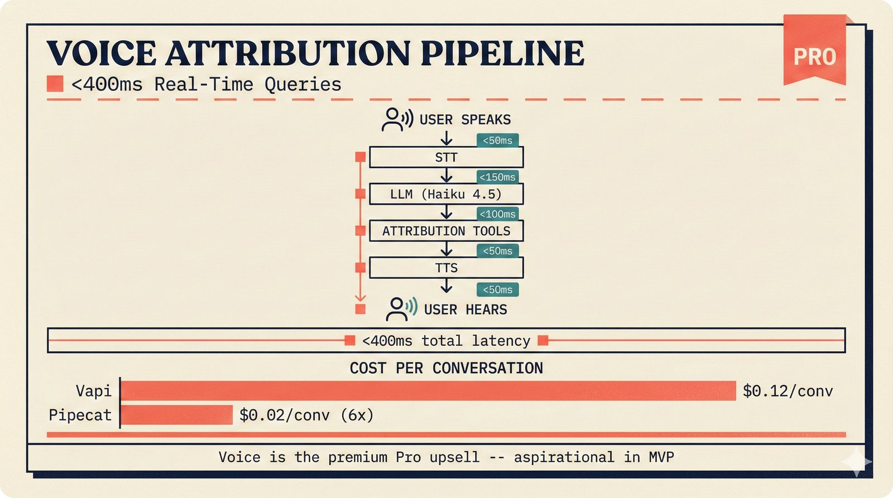

# fig-pitch-10: Voice Attribution Queries: <400ms Real-Time

## Metadata

| Field | Value |
|-------|-------|
| **ID** | fig-pitch-10 |
| **Title** | Voice Attribution Queries: <400ms Real-Time |
| **Audience** | L2 (PhD/Policy + Light Technical) |
| **Location** | docs/planning/managerial-roadmap-planning.md, pitch deck |
| **Priority** | P1 (High) |
| **Aspect Ratio** | 16:9 |
| **Layout Template** | C (Flowchart) |

## Purpose

This figure shows the voice agent pipeline from user speech input to spoken attribution response, with latency targets and cost comparison between Vapi and Pipecat. It answers: "How does voice attribution work, how fast is it, and what does it cost?"

## Key Message

Real-time voice attribution queries in under 400ms end-to-end, with Pipecat delivering 6x cost savings over Vapi as a premium Pro tier feature.

## Visual Concept

A left-to-right pipeline flow showing the six stages of a voice query: User speaks, STT (speech-to-text), LLM processing, Attribution Tool calls, TTS (text-to-speech), User hears response. Below the pipeline, a cost comparison bar shows Vapi ($0.12/conversation) vs Pipecat ($0.02/conversation). A "PRO" badge marks this as a premium feature. Latency annotations appear above the pipeline stages.

```
+---------------------------------------------------------------+
|  VOICE ATTRIBUTION PIPELINE                                    |
|  ■ <400ms Real-Time Queries                            [PRO]   |
+---------------------------------------------------------------+
|                                                                |
|  <50ms     <150ms      <100ms        <50ms       <50ms        |
|    |          |           |            |           |           |
|    v          v           v            v           v           |
|  ┌────┐    ┌────┐    ┌─────────┐    ┌────┐    ┌────┐         |
|  │    │    │    │    │         │    │    │    │    │         |
|  │ ◎  │───>│ STT│───>│   LLM   │───>│TOOL│───>│ TTS│───> ◎   |
|  │User│    │    │    │         │    │    │    │    │    User  |
|  │Spks│    │    │    │ Haiku   │    │ATTR│    │    │    Hears |
|  │    │    │    │    │ 4.5     │    │    │    │    │         |
|  └────┘    └────┘    └─────────┘    └────┘    └────┘         |
|                                                                |
|  ───────────── <400ms total latency ──────────────            |
|                                                                |
+---------------------------------------------------------------+
|  COST PER CONVERSATION                                         |
|  ─────────────────────                                         |
|                                                                |
|  Vapi     ████████████████████████████████  $0.12/conv         |
|  Pipecat  ██████                            $0.02/conv (6x)   |
|                                                                |
+---------------------------------------------------------------+
|  ■ "Voice is the premium Pro upsell -- aspirational in MVP"    |
+---------------------------------------------------------------+
```

## Spatial Anchors

```yaml
canvas:
  width: 1920
  height: 1080
  background: warm_cream

title_block:
  position: [60, 40]
  width: 1800
  height: 80
  elements:
    - type: heading_display
      text: "VOICE ATTRIBUTION PIPELINE"
    - type: label_editorial
      text: "<400ms Real-Time Queries"
    - type: badge_label
      text: "PRO"
      position: [1780, 50]

pipeline_flow:
  position: [60, 160]
  width: 1800
  height: 360
  stages:
    - id: user_speaks
      position: [120, 260]
      size: [200, 160]
      label: "User Speaks"
      latency: "<50ms"

    - id: stt
      position: [400, 260]
      size: [200, 160]
      label: "STT"
      latency: "<150ms"

    - id: llm
      position: [680, 260]
      size: [280, 160]
      label: "LLM (Haiku 4.5)"
      latency: "<100ms"

    - id: tool
      position: [1040, 260]
      size: [200, 160]
      label: "Attribution Tools"
      latency: "<50ms"

    - id: tts
      position: [1320, 260]
      size: [200, 160]
      label: "TTS"
      latency: "<50ms"

    - id: user_hears
      position: [1600, 260]
      size: [200, 160]
      label: "User Hears"

  latency_bar:
    position: [120, 460]
    width: 1680
    text: "<400ms total latency"

cost_comparison:
  position: [60, 560]
  width: 1800
  height: 260
  bars:
    - { label: "Vapi", cost: "$0.12/conv", width_ratio: 1.0 }
    - { label: "Pipecat", cost: "$0.02/conv", width_ratio: 0.17, note: "6x savings" }

callout_bar:
  position: [60, 920]
  width: 1800
  height: 100
  elements:
    - type: callout_bar
      text: "Voice is the premium Pro upsell -- aspirational in MVP"

arrows:
  - { from: "user_speaks", to: "stt", type: "arrow" }
  - { from: "stt", to: "llm", type: "arrow" }
  - { from: "llm", to: "tool", type: "arrow" }
  - { from: "tool", to: "tts", type: "arrow" }
  - { from: "tts", to: "user_hears", type: "arrow" }
```

## Content Elements

### Primary Structures

| Name | Semantic Tag | Description |
|------|--------------|-------------|
| Title block | `heading_display` | "VOICE ATTRIBUTION PIPELINE" with coral accent square |
| Subtitle | `label_editorial` | "<400ms Real-Time Queries" |
| PRO badge | `badge_label` | Premium tier indicator |
| User speaks | `stakeholder_artist` | Audio input from user |
| STT stage | `processing_stage` | Speech-to-text conversion |
| LLM stage | `processing_stage` | Language model processing (Haiku 4.5) |
| Attribution Tools stage | `processing_stage` | Tool calls to attribution engine |
| TTS stage | `processing_stage` | Text-to-speech output |
| User hears | `stakeholder_artist` | Audio response to user |
| Latency annotations | `data_mono` | Individual stage latencies |
| Total latency bar | `data_mono` | "<400ms total latency" |
| Cost comparison | `processing_stage` | Vapi vs Pipecat cost bars |
| Cost labels | `data_mono` | "$0.12/conv", "$0.02/conv" |
| Callout bar | `callout_bar` | Voice as premium Pro upsell |

### Relationships / Flows

| From | To | Type | Label |
|------|-----|------|-------|
| User speaks | STT | arrow | "audio input" |
| STT | LLM | arrow | "transcribed text" |
| LLM | Attribution Tools | arrow | "tool invocation" |
| Attribution Tools | TTS | arrow | "attribution response" |
| TTS | User hears | arrow | "audio output" |

### Callout Boxes

| Title | Content | Position |
|-------|---------|----------|
| Pro Upsell | "Voice is the premium Pro upsell -- aspirational in MVP" | bottom-center |

## Text Content

### Labels (Max 30 chars each)

- VOICE ATTRIBUTION PIPELINE
- <400ms Real-Time Queries
- PRO
- User Speaks
- STT
- LLM (Haiku 4.5)
- Attribution Tools
- TTS
- User Hears
- <50ms
- <150ms
- <100ms
- <400ms total latency
- COST PER CONVERSATION
- Vapi $0.12/conv
- Pipecat $0.02/conv (6x)

### Caption (for embedding in documentation)

Voice attribution pipeline flowing from user speech through STT, LLM (Haiku 4.5), attribution tool calls, and TTS in under 400ms end-to-end. Pipecat delivers 6x cost savings ($0.02/conv) over Vapi ($0.12/conv) as a premium Pro tier feature.

## Anti-Hallucination Rules

### Default Rules (always include)

1. **Font names are INTERNAL** -- do NOT render them as labels.
2. **Semantic tags are INTERNAL** -- do NOT render them as visible text.
3. **Hex codes are INTERNAL** -- do NOT render them.
4. **Background MUST be warm cream (#f6f3e6)**.
5. **No generic flowchart aesthetics** -- no thick block arrows, no PowerPoint look.
6. **No figure captions** -- do NOT render "Figure 1.", "Fig.", or numbered caption.
7. **No prompt leakage** -- do NOT render style keywords as visible text.

### Figure-Specific Rules

1. The LLM is Haiku 4.5 -- do NOT use GPT-4 or other non-Anthropic models.
2. Total latency target is <400ms -- do NOT change to 500ms or 1s.
3. Vapi costs $0.12/conversation, Pipecat costs $0.02/conversation -- EXACT figures.
4. Voice is a PRO tier feature, NOT available in the free tier.
5. In MVP, voice is ASPIRATIONAL only (upsell UI) -- do NOT imply it works at launch.
6. The 6x savings figure comes from $0.12/$0.02 = 6 -- this is exact.
7. STT and TTS are generic stages -- do NOT name specific providers (Whisper, ElevenLabs, etc.).
8. "Attribution Tools" refers to the existing PydanticAI tool calls -- do NOT invent new tools.

## Alt Text

Voice pipeline: User, STT, LLM, Attribution Tools, TTS, User -- under 400ms, Pipecat 6x cheaper than Vapi.

## JSON Export Block

```json
{
  "meta": {
    "figure_id": "pitch-10",
    "title": "Voice Attribution Queries: <400ms Real-Time",
    "audience": "L2",
    "layout_template": "C"
  },
  "content_architecture": {
    "primary_message": "Real-time voice attribution in under 400ms, with Pipecat at 6x cost savings over Vapi.",
    "layout_flow": "left-to-right",
    "key_structures": [
      {
        "name": "Voice Pipeline",
        "role": "processing_stage",
        "is_highlighted": true,
        "labels": ["User Speaks", "STT", "LLM", "Attribution Tools", "TTS", "User Hears"]
      },
      {
        "name": "Cost Comparison",
        "role": "processing_stage",
        "is_highlighted": false,
        "labels": ["Vapi $0.12/conv", "Pipecat $0.02/conv"]
      }
    ],
    "relationships": [
      {
        "from": "User Speaks",
        "to": "User Hears",
        "type": "arrow",
        "label": "<400ms end-to-end"
      }
    ],
    "callout_boxes": [
      {
        "heading": "PRO UPSELL",
        "body_text": "Voice is the premium Pro upsell -- aspirational in MVP",
        "position": "bottom-center"
      }
    ]
  }
}
```

## Quality Checklist

- [x] Primary message clear in one sentence
- [x] Semantic tags used (no colors, hex codes, or font names in content spec)
- [x] ASCII layout sketched
- [x] Spatial anchors defined in YAML
- [x] Labels under 30 characters
- [x] Anti-hallucination rules listed
- [x] Alt text provided (125 chars max)
- [x] JSON export block included
- [x] Audience level correct (L1/L2/L3/L4)
- [x] Layout template identified (A/B/C/D/E)

## Status

- [x] Draft created
- [ ] Content reviewed
- [ ] Generated via Nano Banana Pro
- [ ] Quality score >= 21/25
- [ ] Embedded in documentation

## Image Embed

### For GitHub README / MkDocs (repo-root-relative)


*Voice attribution pipeline delivering real-time queries in under 400ms, with Pipecat at 6x cost savings over Vapi, as a premium Pro tier feature.*

### From this figure plan (relative)


