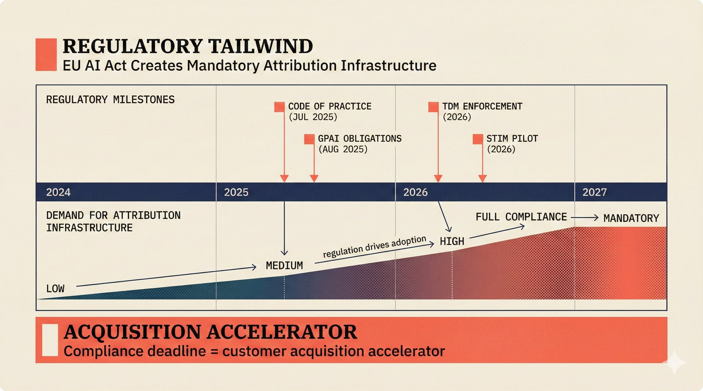

# fig-pitch-11: EU AI Act Creates Mandatory Attribution Infrastructure

## Metadata

| Field | Value |
|-------|-------|
| **ID** | fig-pitch-11 |
| **Title** | EU AI Act Creates Mandatory Attribution Infrastructure |
| **Audience** | L1/L2 (Music Industry + PhD/Policy) |
| **Location** | docs/planning/managerial-roadmap-planning.md, pitch deck |
| **Priority** | P1 (High) |
| **Aspect Ratio** | 16:9 |
| **Layout Template** | B (Multi-Panel) |

## Purpose

This figure shows how EU AI Act regulatory deadlines and the GPAI Code of Practice create mandatory demand for attribution infrastructure. It answers: "Why does regulation accelerate our customer acquisition, and when do the deadlines hit?"

## Key Message

EU AI Act compliance deadlines (Aug 2025 GPAI obligations, Jul 2025 Code of Practice) transform attribution infrastructure from nice-to-have to mandatory -- every deadline is a customer acquisition accelerator.

## Visual Concept

A horizontal timeline running from 2024 to 2027, with regulatory milestones marked above and market demand indicators below. Key events include GPAI obligations (Aug 2025), Code of Practice (Jul 2025), TDM enforcement, and the STIM pilot. Below the timeline, arrows point to "attribution infrastructure demand" growing with each milestone. The visual shows regulation as a rising tide that lifts the scaffold.

```
+---------------------------------------------------------------+
|  REGULATORY TAILWIND                                           |
|  ■ EU AI Act Creates Mandatory Attribution Infrastructure       |
+---------------------------------------------------------------+
|                                                                |
|  REGULATORY MILESTONES                                         |
|  ─────────────────────                                         |
|                                                                |
|  2024        2025              2026              2027          |
|  ├───────────┼─────────────────┼─────────────────┤            |
|              |                 |                               |
|         ┌────┴────┐       ┌───┴───┐                           |
|         │Code of  │       │ TDM   │                           |
|         │Practice │       │Enforce│                           |
|         │Jul 2025 │       │ment   │                           |
|         └─────────┘       └───────┘                           |
|              |                                                 |
|         ┌────┴────┐       ┌───────┐                           |
|         │ GPAI    │       │ STIM  │                           |
|         │Obligatns│       │ Pilot │                           |
|         │Aug 2025 │       │       │                           |
|         └─────────┘       └───────┘                           |
|                                                                |
|  DEMAND FOR ATTRIBUTION INFRASTRUCTURE                         |
|  ─────────────────────────────────────                         |
|                                                                |
|       Low ─────── Medium ─────── High ─────── Mandatory       |
|         ▓▓▓▓▓▓▓▓▓▓▓░░░░░░░░░░░░░░░░░░░░░░░░░░░░░░           |
|                   ^               ^              ^             |
|               Code of          TDM           Full             |
|               Practice      Enforcement    Compliance         |
|                                                                |
+---------------------------------------------------------------+
|  ■ "Compliance deadline = customer acquisition accelerator"    |
+---------------------------------------------------------------+
```

## Spatial Anchors

```yaml
canvas:
  width: 1920
  height: 1080
  background: warm_cream

title_block:
  position: [60, 40]
  width: 1800
  height: 80
  elements:
    - type: heading_display
      text: "REGULATORY TAILWIND"
    - type: label_editorial
      text: "EU AI Act Creates Mandatory Attribution Infrastructure"

timeline:
  position: [120, 160]
  width: 1680
  height: 500
  axis:
    start: 2024
    end: 2027
  milestones:
    - id: code_of_practice
      date: "Jul 2025"
      label: "Code of Practice"
      position: [500, 200]
      description: "GPAI Code of Practice finalized"

    - id: gpai_obligations
      date: "Aug 2025"
      label: "GPAI Obligations"
      position: [560, 340]
      description: "General Purpose AI transparency requirements"

    - id: tdm_enforcement
      date: "2026"
      label: "TDM Enforcement"
      position: [1000, 200]
      description: "Text and Data Mining opt-out enforcement"

    - id: stim_pilot
      date: "2026"
      label: "STIM Pilot"
      position: [1060, 340]
      description: "Swedish CMO pilot program"

demand_bar:
  position: [120, 680]
  width: 1680
  height: 160
  label: "DEMAND FOR ATTRIBUTION INFRASTRUCTURE"
  gradient: "Low -> Medium -> High -> Mandatory"
  inflection_points:
    - { label: "Code of Practice", position: 0.30 }
    - { label: "TDM Enforcement", position: 0.60 }
    - { label: "Full Compliance", position: 0.90 }

callout_bar:
  position: [60, 920]
  width: 1800
  height: 100
  elements:
    - type: callout_bar
      text: "Compliance deadline = customer acquisition accelerator"
```

## Content Elements

### Primary Structures

| Name | Semantic Tag | Description |
|------|--------------|-------------|
| Title block | `heading_display` | "REGULATORY TAILWIND" with coral accent square |
| Subtitle | `label_editorial` | "EU AI Act Creates Mandatory Attribution Infrastructure" |
| Timeline axis | `processing_stage` | Horizontal timeline from 2024 to 2027 |
| Code of Practice milestone | `decision_point` | Jul 2025 -- GPAI Code of Practice finalized |
| GPAI Obligations milestone | `decision_point` | Aug 2025 -- transparency requirements activate |
| TDM Enforcement milestone | `decision_point` | 2026 -- text and data mining enforcement |
| STIM Pilot milestone | `decision_point` | 2026 -- Swedish CMO pilot program |
| Demand gradient bar | `processing_stage` | Rising demand from Low to Mandatory |
| Inflection markers | `data_mono` | Points where demand steps up |
| Callout bar | `callout_bar` | "Compliance deadline = customer acquisition accelerator" |

### Relationships / Flows

| From | To | Type | Label |
|------|-----|------|-------|
| Code of Practice | Demand increase | arrow | "triggers medium demand" |
| TDM Enforcement | Demand increase | arrow | "triggers high demand" |
| Full Compliance | Demand peak | arrow | "mandatory infrastructure" |
| Regulatory milestones | Attribution demand | arrow | "regulation drives adoption" |

### Callout Boxes

| Title | Content | Position |
|-------|---------|----------|
| Acquisition Accelerator | "Compliance deadline = customer acquisition accelerator" | bottom-center |

## Text Content

### Labels (Max 30 chars each)

- REGULATORY TAILWIND
- EU AI Act Mandatory Attribution
- Code of Practice (Jul 2025)
- GPAI Obligations (Aug 2025)
- TDM Enforcement (2026)
- STIM Pilot (2026)
- DEMAND FOR ATTRIBUTION INFRA
- Low
- Medium
- High
- Mandatory

### Caption (for embedding in documentation)

EU AI Act regulatory timeline showing how GPAI obligations (Aug 2025), Code of Practice (Jul 2025), TDM enforcement, and the STIM pilot create escalating mandatory demand for attribution infrastructure -- each deadline accelerates customer acquisition.

## Anti-Hallucination Rules

### Default Rules (always include)

1. **Font names are INTERNAL** -- do NOT render them as labels.
2. **Semantic tags are INTERNAL** -- do NOT render them as visible text.
3. **Hex codes are INTERNAL** -- do NOT render them.
4. **Background MUST be warm cream (#f6f3e6)**.
5. **No generic flowchart aesthetics** -- no thick block arrows, no PowerPoint look.
6. **No figure captions** -- do NOT render "Figure 1.", "Fig.", or numbered caption.
7. **No prompt leakage** -- do NOT render style keywords as visible text.

### Figure-Specific Rules

1. EU AI Act dates are: Code of Practice Jul 2025, GPAI obligations Aug 2025 -- do NOT change these.
2. "GPAI" stands for General Purpose AI -- do NOT expand differently.
3. "TDM" stands for Text and Data Mining -- this is the EU DSM Directive concept.
4. STIM is the Swedish Collective Management Organization -- do NOT misspell or expand differently.
5. Do NOT show specific Article numbers from the EU AI Act -- keep at concept level for L1/L2 audience.
6. The demand progression is directional (Low to Mandatory) -- do NOT show specific numbers.
7. "Mandatory" does not mean every company must buy THIS product -- it means the infrastructure category becomes essential.
8. Do NOT include non-EU regulations (US Copyright Office, etc.) -- this figure is EU-focused.

## Alt Text

EU AI Act timeline: GPAI obligations and TDM enforcement creating rising mandatory attribution demand.

## JSON Export Block

```json
{
  "meta": {
    "figure_id": "pitch-11",
    "title": "EU AI Act Creates Mandatory Attribution Infrastructure",
    "audience": "L1/L2",
    "layout_template": "B"
  },
  "content_architecture": {
    "primary_message": "EU AI Act deadlines transform attribution infrastructure from nice-to-have to mandatory.",
    "layout_flow": "left-to-right",
    "key_structures": [
      {
        "name": "Regulatory Timeline",
        "role": "processing_stage",
        "is_highlighted": false,
        "labels": ["2024", "2025", "2026", "2027"]
      },
      {
        "name": "Code of Practice",
        "role": "decision_point",
        "is_highlighted": false,
        "labels": ["Code of Practice", "Jul 2025"]
      },
      {
        "name": "GPAI Obligations",
        "role": "decision_point",
        "is_highlighted": true,
        "labels": ["GPAI Obligations", "Aug 2025"]
      },
      {
        "name": "TDM Enforcement",
        "role": "decision_point",
        "is_highlighted": true,
        "labels": ["TDM Enforcement", "2026"]
      },
      {
        "name": "STIM Pilot",
        "role": "decision_point",
        "is_highlighted": false,
        "labels": ["STIM Pilot", "2026"]
      },
      {
        "name": "Demand Gradient",
        "role": "processing_stage",
        "is_highlighted": true,
        "labels": ["Low", "Medium", "High", "Mandatory"]
      }
    ],
    "relationships": [
      {
        "from": "Regulatory milestones",
        "to": "Demand gradient",
        "type": "arrow",
        "label": "regulation drives adoption"
      }
    ],
    "callout_boxes": [
      {
        "heading": "ACQUISITION ACCELERATOR",
        "body_text": "Compliance deadline = customer acquisition accelerator",
        "position": "bottom-center"
      }
    ]
  }
}
```

## Quality Checklist

- [x] Primary message clear in one sentence
- [x] Semantic tags used (no colors, hex codes, or font names in content spec)
- [x] ASCII layout sketched
- [x] Spatial anchors defined in YAML
- [x] Labels under 30 characters
- [x] Anti-hallucination rules listed
- [x] Alt text provided (125 chars max)
- [x] JSON export block included
- [x] Audience level correct (L1/L2/L3/L4)
- [x] Layout template identified (A/B/C/D/E)

## Status

- [x] Draft created
- [ ] Content reviewed
- [ ] Generated via Nano Banana Pro
- [ ] Quality score >= 21/25
- [ ] Embedded in documentation

## Image Embed

### For GitHub README / MkDocs (repo-root-relative)


*EU AI Act regulatory timeline showing escalating mandatory demand for attribution infrastructure, with each compliance deadline accelerating customer acquisition.*

### From this figure plan (relative)


