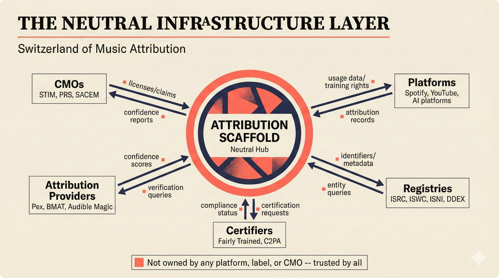

# fig-pitch-12: The Neutral Infrastructure Layer

## Metadata

| Field | Value |
|-------|-------|
| **ID** | fig-pitch-12 |
| **Title** | The Neutral Infrastructure Layer |
| **Audience** | L1 (Music Industry / Investors) |
| **Location** | docs/planning/managerial-roadmap-planning.md, pitch deck |
| **Priority** | P1 (High) |
| **Aspect Ratio** | 16:9 |
| **Layout Template** | A (Hero) |

## Purpose

This figure shows the scaffold as a neutral hub connecting five categories of music industry stakeholders with bidirectional data flows. It answers: "How does this project position itself as infrastructure that everyone can trust because it is not owned by any single party?"

## Key Message

The scaffold serves as the neutral "Switzerland of music attribution" -- a hub connecting CMOs, platforms, attribution providers, registries, and certifiers with bidirectional data flows.

## Visual Concept

A hub-and-spoke diagram with the scaffold at the center, surrounded by five spoke categories arranged radially. Bidirectional arrows connect the hub to each spoke, with brief labels describing the data flow in each direction. The center hub is visually prominent (larger, coral accent ring), while spokes use distinct semantic tags for each stakeholder category. The layout is intentionally asymmetric.

```
+---------------------------------------------------------------+
|  THE NEUTRAL INFRASTRUCTURE LAYER                              |
|  ■ "Switzerland of Music Attribution"                           |
+---------------------------------------------------------------+
|                                                                |
|                     CMOs                                       |
|                  (STIM, PRS,                                   |
|                   SACEM)                                       |
|                     ↕                                          |
|                  licenses                                      |
|                  /claims                                       |
|                     |                                          |
|   Attribution    ←──┼──→   Platforms                           |
|   Providers         |      (Spotify,                           |
|   (Pex, BMAT,       |       YouTube,                           |
|    Audible Magic)   |       AI platforms)                       |
|     confidence      |       usage data                         |
|     scores    ┌─────┴─────┐  /training                        |
|               │           │  rights                            |
|               │ ATTRIBUTION│                                   |
|               │  SCAFFOLD  │                                   |
|               │  (Neutral  │                                   |
|               │   Hub)     │                                   |
|               └─────┬─────┘                                   |
|                     |                                          |
|   Certifiers  ←─────┼─────→  Registries                       |
|   (Fairly     |     |        (ISRC, ISWC,                     |
|    Trained,   |     |         ISNI, DDEX)                      |
|    C2PA)      |     |        identifiers                       |
|   compliance  |     |        /metadata                         |
|   status      |                                                |
|                                                                |
+---------------------------------------------------------------+
|  ■ "Not owned by any platform, label, or CMO --                |
|     trusted by all"                                            |
+---------------------------------------------------------------+
```

## Spatial Anchors

```yaml
canvas:
  width: 1920
  height: 1080
  background: warm_cream

title_block:
  position: [60, 40]
  width: 1800
  height: 80
  elements:
    - type: heading_display
      text: "THE NEUTRAL INFRASTRUCTURE LAYER"
    - type: label_editorial
      text: "Switzerland of Music Attribution"

hub:
  position: [760, 380]
  size: [400, 200]
  label: "ATTRIBUTION SCAFFOLD"
  sublabel: "Neutral Hub"
  role: selected_option

spokes:
  - id: cmos
    position: [860, 140]
    size: [200, 120]
    label: "CMOs"
    examples: "STIM, PRS, SACEM"
    role: stakeholder_label
    flow_in: "licenses, claims"
    flow_out: "confidence reports"

  - id: platforms
    position: [1320, 340]
    size: [200, 120]
    label: "Platforms"
    examples: "Spotify, YouTube, AI platforms"
    role: stakeholder_platform
    flow_in: "usage data, training rights"
    flow_out: "attribution records"

  - id: registries
    position: [1200, 640]
    size: [200, 120]
    label: "Registries"
    examples: "ISRC, ISWC, ISNI, DDEX"
    role: processing_stage
    flow_in: "identifiers, metadata"
    flow_out: "entity queries"

  - id: certifiers
    position: [520, 640]
    size: [200, 120]
    label: "Certifiers"
    examples: "Fairly Trained, C2PA"
    role: security_layer
    flow_in: "compliance status"
    flow_out: "certification requests"

  - id: attribution_providers
    position: [400, 340]
    size: [200, 120]
    label: "Attribution Providers"
    examples: "Pex, BMAT, Audible Magic"
    role: source_corroborate
    flow_in: "confidence scores"
    flow_out: "verification queries"

arrows:
  - { from: "hub", to: "cmos", type: "bidirectional" }
  - { from: "hub", to: "platforms", type: "bidirectional" }
  - { from: "hub", to: "registries", type: "bidirectional" }
  - { from: "hub", to: "certifiers", type: "bidirectional" }
  - { from: "hub", to: "attribution_providers", type: "bidirectional" }

callout_bar:
  position: [60, 920]
  width: 1800
  height: 100
  elements:
    - type: callout_bar
      text: "Not owned by any platform, label, or CMO -- trusted by all"
```

## Content Elements

### Primary Structures

| Name | Semantic Tag | Description |
|------|--------------|-------------|
| Title block | `heading_display` | "THE NEUTRAL INFRASTRUCTURE LAYER" with coral accent square |
| Subtitle | `label_editorial` | "Switzerland of Music Attribution" |
| Central hub | `selected_option` | Attribution Scaffold as neutral center |
| CMOs spoke | `stakeholder_label` | STIM, PRS, SACEM -- licenses and claims |
| Platforms spoke | `stakeholder_platform` | Spotify, YouTube, AI platforms -- usage data and training rights |
| Registries spoke | `processing_stage` | ISRC, ISWC, ISNI, DDEX -- identifiers and metadata |
| Certifiers spoke | `security_layer` | Fairly Trained, C2PA -- compliance status |
| Attribution Providers spoke | `source_corroborate` | Pex, BMAT, Audible Magic -- confidence scores |
| Bidirectional arrows | `data_flow` | Two-way data flows between hub and spokes |
| Flow labels | `label_editorial` | Brief descriptions of data flowing in each direction |
| Callout bar | `callout_bar` | "Not owned by any platform, label, or CMO -- trusted by all" |

### Relationships / Flows

| From | To | Type | Label |
|------|-----|------|-------|
| Hub | CMOs | bidirectional | "licenses/claims <-> confidence reports" |
| Hub | Platforms | bidirectional | "usage data/training rights <-> attribution records" |
| Hub | Registries | bidirectional | "identifiers/metadata <-> entity queries" |
| Hub | Certifiers | bidirectional | "compliance status <-> certification requests" |
| Hub | Attribution Providers | bidirectional | "confidence scores <-> verification queries" |

### Callout Boxes

| Title | Content | Position |
|-------|---------|----------|
| Neutral Position | "Not owned by any platform, label, or CMO -- trusted by all" | bottom-center |

## Text Content

### Labels (Max 30 chars each)

- THE NEUTRAL INFRASTRUCTURE LAYER
- Switzerland of Music Attribution
- ATTRIBUTION SCAFFOLD
- Neutral Hub
- CMOs
- STIM, PRS, SACEM
- Platforms
- Spotify, YouTube, AI platforms
- Registries
- ISRC, ISWC, ISNI, DDEX
- Certifiers
- Fairly Trained, C2PA
- Attribution Providers
- Pex, BMAT, Audible Magic

### Caption (for embedding in documentation)

Hub-and-spoke partnership architecture with the attribution scaffold as a neutral center connecting five stakeholder categories -- CMOs, platforms, attribution providers, registries, and certifiers -- with bidirectional data flows, trusted by all parties because it is not owned by any single one.

## Anti-Hallucination Rules

### Default Rules (always include)

1. **Font names are INTERNAL** -- do NOT render them as labels.
2. **Semantic tags are INTERNAL** -- do NOT render them as visible text.
3. **Hex codes are INTERNAL** -- do NOT render them.
4. **Background MUST be warm cream (#f6f3e6)**.
5. **No generic flowchart aesthetics** -- no thick block arrows, no PowerPoint look.
6. **No figure captions** -- do NOT render "Figure 1.", "Fig.", or numbered caption.
7. **No prompt leakage** -- do NOT render style keywords as visible text.

### Figure-Specific Rules

1. There are exactly FIVE spoke categories -- do NOT add artists as a sixth (artists interact via the platform spoke).
2. All arrows are BIDIRECTIONAL -- the scaffold receives and sends data in both directions.
3. STIM is Swedish, PRS is British, SACEM is French -- these are real CMOs.
4. "Fairly Trained" is a real certification body -- do NOT misspell or confuse with "Fair Trade."
5. C2PA is the Coalition for Content Provenance and Authenticity -- do NOT expand differently.
6. DDEX is a real metadata standard body -- do NOT confuse with a company name.
7. The hub is visually larger and more prominent than spokes -- it is the center of the network.
8. Do NOT show logos for any company or organization -- use text labels only.
9. The "Switzerland" metaphor means neutrality -- do NOT show Swiss flags or geographic imagery.

## Alt Text

Hub-and-spoke: scaffold at center connecting CMOs, platforms, providers, registries, certifiers bidirectionally.

## JSON Export Block

```json
{
  "meta": {
    "figure_id": "pitch-12",
    "title": "The Neutral Infrastructure Layer",
    "audience": "L1",
    "layout_template": "A"
  },
  "content_architecture": {
    "primary_message": "The scaffold is the neutral Switzerland of music attribution, connecting all stakeholders bidirectionally.",
    "layout_flow": "radial",
    "key_structures": [
      {
        "name": "Attribution Scaffold Hub",
        "role": "selected_option",
        "is_highlighted": true,
        "labels": ["ATTRIBUTION SCAFFOLD", "Neutral Hub"]
      },
      {
        "name": "CMOs",
        "role": "stakeholder_label",
        "is_highlighted": false,
        "labels": ["CMOs", "STIM, PRS, SACEM"]
      },
      {
        "name": "Platforms",
        "role": "stakeholder_platform",
        "is_highlighted": false,
        "labels": ["Platforms", "Spotify, YouTube, AI platforms"]
      },
      {
        "name": "Registries",
        "role": "processing_stage",
        "is_highlighted": false,
        "labels": ["Registries", "ISRC, ISWC, ISNI, DDEX"]
      },
      {
        "name": "Certifiers",
        "role": "security_layer",
        "is_highlighted": false,
        "labels": ["Certifiers", "Fairly Trained, C2PA"]
      },
      {
        "name": "Attribution Providers",
        "role": "source_corroborate",
        "is_highlighted": false,
        "labels": ["Attribution Providers", "Pex, BMAT, Audible Magic"]
      }
    ],
    "relationships": [
      {
        "from": "Hub",
        "to": "CMOs",
        "type": "bidirectional",
        "label": "licenses/claims <-> confidence reports"
      },
      {
        "from": "Hub",
        "to": "Platforms",
        "type": "bidirectional",
        "label": "usage data <-> attribution records"
      },
      {
        "from": "Hub",
        "to": "Registries",
        "type": "bidirectional",
        "label": "identifiers <-> entity queries"
      },
      {
        "from": "Hub",
        "to": "Certifiers",
        "type": "bidirectional",
        "label": "compliance status <-> certification requests"
      },
      {
        "from": "Hub",
        "to": "Attribution Providers",
        "type": "bidirectional",
        "label": "confidence scores <-> verification queries"
      }
    ],
    "callout_boxes": [
      {
        "heading": "NEUTRAL POSITION",
        "body_text": "Not owned by any platform, label, or CMO -- trusted by all",
        "position": "bottom-center"
      }
    ]
  }
}
```

## Quality Checklist

- [x] Primary message clear in one sentence
- [x] Semantic tags used (no colors, hex codes, or font names in content spec)
- [x] ASCII layout sketched
- [x] Spatial anchors defined in YAML
- [x] Labels under 30 characters
- [x] Anti-hallucination rules listed
- [x] Alt text provided (125 chars max)
- [x] JSON export block included
- [x] Audience level correct (L1/L2/L3/L4)
- [x] Layout template identified (A/B/C/D/E)

## Status

- [x] Draft created
- [ ] Content reviewed
- [ ] Generated via Nano Banana Pro
- [ ] Quality score >= 21/25
- [ ] Embedded in documentation

## Image Embed

### For GitHub README / MkDocs (repo-root-relative)


*Hub-and-spoke partnership architecture with the attribution scaffold as the neutral center connecting CMOs, platforms, attribution providers, registries, and certifiers.*

### From this figure plan (relative)


