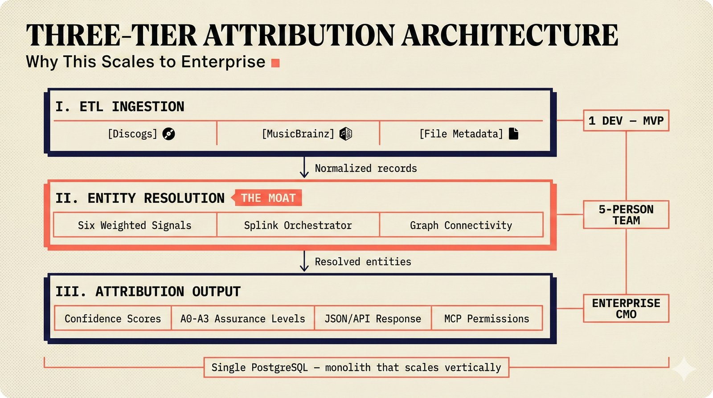

# fig-pitch-adv-01: Three-Tier Attribution Architecture: Why This Scales to Enterprise

## Metadata

| Field | Value |
|-------|-------|
| **ID** | pitch-adv-01 |
| **Title** | Three-Tier Attribution Architecture: Why This Scales to Enterprise |
| **Audience** | L2 (PhD/Policy + Light Technical) |
| **Location** | docs/planning/managerial-roadmap-planning.md, pitch deck |
| **Priority** | P1 (High) |
| **Aspect Ratio** | 16:9 |
| **Layout Template** | A (Hero) |

## Purpose

This figure shows the three-tier architecture (ETL, Entity Resolution, Attribution) as a scalable enterprise system. It answers: "Why does this architecture scale without rewrites?"

## Key Message

Three-tier architecture -- ETL ingestion, multi-signal entity resolution, and confidence-calibrated attribution -- scales from single-developer MVP to enterprise CMO integration.

## Visual Concept

Vertical stack diagram with three tiers. Top: ETL layer (Discogs, MusicBrainz, file metadata inputs). Middle: Entity Resolution orchestrator (the "moat" -- highlighted with coral accent). Bottom: Attribution output with confidence scores. Arrows flow downward. Right side shows scaling annotations (1 dev, 5-person team, enterprise).

```
+---------------------------------------------------------------+
|  THREE-TIER ATTRIBUTION ARCHITECTURE                           |
|  ■ Why This Scales to Enterprise                               |
+---------------------------------------------------------------+
|                                                               |
|  ┌─────────────────────────────────────────────┐   1 DEV     |
|  │  I. ETL INGESTION                           │   MVP       |
|  │  ─────────────────                          │             |
|  │  [Discogs]  [MusicBrainz]  [File Metadata]  │             |
|  └──────────────────┬──────────────────────────┘             |
|                     ▼                                         |
|  ┌─────────────────────────────────────────────┐   5-PERSON  |
|  │  II. ENTITY RESOLUTION  ■ THE MOAT          │   TEAM      |
|  │  ─────────────────────────────               │             |
|  │  Six Weighted Signals │ Splink Orchestrator  │             |
|  │  Probabilistic Linkage │ Graph Connectivity  │             |
|  └──────────────────┬──────────────────────────┘             |
|                     ▼                                         |
|  ┌─────────────────────────────────────────────┐   ENTERPRISE |
|  │  III. ATTRIBUTION OUTPUT                     │   CMO       |
|  │  ─────────────────────                      │             |
|  │  Confidence Scores │ A0-A3 Assurance Levels │             |
|  │  JSON/API Response │ MCP Permissions        │             |
|  └─────────────────────────────────────────────┘             |
|                                                               |
|  ■ Single PostgreSQL — monolith that scales vertically        |
|                                                               |
+---------------------------------------------------------------+
```

## Spatial Anchors

```yaml
canvas:
  width: 1920
  height: 1080
  background: warm_cream

title_block:
  position: [60, 40]
  width: 1800
  height: 80
  elements:
    - type: heading_display
      text: "THREE-TIER ATTRIBUTION ARCHITECTURE"
    - type: label_editorial
      text: "Why This Scales to Enterprise"

tier_1_etl:
  position: [60, 160]
  width: 1200
  height: 220
  label: "ETL INGESTION"
  elements:
    - type: source_icons
      items:
        - { label: "Discogs", note: "Release metadata" }
        - { label: "MusicBrainz", note: "Open music encyclopedia" }
        - { label: "File Metadata", note: "Embedded tags" }

tier_2_resolution:
  position: [60, 420]
  width: 1200
  height: 220
  label: "ENTITY RESOLUTION"
  accent: coral_highlight
  elements:
    - type: processing_stage
      items:
        - { label: "Six Weighted Signals", note: "Probabilistic cascade" }
        - { label: "Splink Orchestrator", note: "Record linkage" }
        - { label: "Graph Connectivity", note: "Apache AGE" }
    - type: callout_bar
      text: "THE MOAT"

tier_3_attribution:
  position: [60, 680]
  width: 1200
  height: 220
  label: "ATTRIBUTION OUTPUT"
  elements:
    - type: solution_component
      items:
        - { label: "Confidence Scores", note: "Calibrated via APS" }
        - { label: "A0-A3 Assurance Levels", note: "Tiered provenance" }
        - { label: "JSON/API Response", note: "Sub-100ms" }
        - { label: "MCP Permissions", note: "Machine-readable consent" }

scaling_annotations:
  position: [1320, 160]
  width: 540
  height: 740
  elements:
    - type: label_editorial
      items:
        - { label: "1 DEV — MVP", y_offset: 0 }
        - { label: "5-PERSON TEAM", y_offset: 260 }
        - { label: "ENTERPRISE CMO", y_offset: 520 }

callout_bar:
  position: [60, 940]
  width: 1800
  height: 100
  elements:
    - type: callout_bar
      text: "Single PostgreSQL — monolith that scales vertically"
```

## Content Elements

### Primary Structures

| Name | Semantic Tag | Description |
|------|--------------|-------------|
| Title block | `heading_display` | "THREE-TIER ATTRIBUTION ARCHITECTURE" with coral accent square |
| Subtitle | `label_editorial` | "Why This Scales to Enterprise" |
| ETL tier | `processing_stage` | Top tier with Discogs, MusicBrainz, and file metadata inputs |
| Entity Resolution tier | `processing_stage` | Middle tier with six weighted signals and Splink orchestrator, coral highlighted |
| Attribution tier | `solution_component` | Bottom tier with confidence scores and A0-A3 assurance levels |
| Scaling annotations | `label_editorial` | Right-side labels showing 1 dev, 5-person team, enterprise CMO |
| Moat callout | `callout_bar` | Coral accent highlighting entity resolution as competitive moat |
| Database callout | `callout_bar` | "Single PostgreSQL -- monolith that scales vertically" |

### Relationships / Flows

| From | To | Type | Label |
|------|-----|------|-------|
| ETL tier | Entity Resolution tier | arrow_down | "Normalized records" |
| Entity Resolution tier | Attribution tier | arrow_down | "Resolved entities" |
| Scaling annotations | All tiers | annotation | "Progressive team scaling" |

### Callout Boxes

| Title | Content | Position |
|-------|---------|----------|
| The Moat | Entity Resolution is the competitive moat | middle-tier accent |
| Single PostgreSQL | "Monolith that scales vertically" | bottom-center |

## Text Content

### Labels (Max 30 chars each)

- THREE-TIER ATTRIBUTION ARCH.
- Why This Scales to Enterprise
- ETL INGESTION
- ENTITY RESOLUTION
- ATTRIBUTION OUTPUT
- Discogs
- MusicBrainz
- File Metadata
- Six Weighted Signals
- Splink Orchestrator
- Graph Connectivity
- Confidence Scores
- A0-A3 Assurance Levels
- THE MOAT
- 1 DEV — MVP
- 5-PERSON TEAM
- ENTERPRISE CMO

### Caption (for embedding in documentation)

Three-tier attribution architecture scaling from single-developer MVP to enterprise CMO integration -- ETL data ingestion from multiple sources, entity resolution orchestrator with six weighted signals as the competitive moat, and confidence-calibrated attribution output with A0-A3 assurance levels.

## Anti-Hallucination Rules

### Default Rules (always include)

1. **Font names are INTERNAL** -- do NOT render them as labels.
2. **Semantic tags are INTERNAL** -- do NOT render them as visible text.
3. **Hex codes are INTERNAL** -- do NOT render them.
4. **Background MUST be warm cream (#f6f3e6)**.
5. **No generic flowchart aesthetics** -- no thick block arrows, no PowerPoint look.
6. **No figure captions** -- do NOT render "Figure 1.", "Fig.", or numbered caption.
7. **No prompt leakage** -- do NOT render style keywords as visible text.

### Figure-Specific Rules

1. Three tiers exactly -- do NOT add a fourth "presentation" tier.
2. Entity resolution is the MIDDLE tier and the competitive moat.
3. Data sources are Discogs, MusicBrainz, and file metadata -- do NOT add Spotify or YouTube as direct sources.
4. Output includes A0-A3 assurance levels -- use these exact names.
5. The architecture is a MONOLITH (single PostgreSQL) not microservices.
6. Do NOT show Kubernetes or container orchestration -- this is not the deployment diagram.
7. "Enterprise" means CMO integration, not generic SaaS.

## Alt Text

Three-tier stack: ETL ingestion, entity resolution orchestrator, confidence-calibrated attribution output.

## JSON Export Block

```json
{
  "meta": {
    "figure_id": "pitch-adv-01",
    "title": "Three-Tier Attribution Architecture: Why This Scales to Enterprise",
    "audience": "L2",
    "layout_template": "A"
  },
  "content_architecture": {
    "primary_message": "Three-tier architecture -- ETL ingestion, multi-signal entity resolution, and confidence-calibrated attribution -- scales from single-developer MVP to enterprise CMO integration.",
    "layout_flow": "top-to-bottom",
    "key_structures": [
      {
        "name": "ETL Ingestion",
        "role": "processing_stage",
        "is_highlighted": false,
        "labels": ["Discogs", "MusicBrainz", "File Metadata"]
      },
      {
        "name": "Entity Resolution",
        "role": "processing_stage",
        "is_highlighted": true,
        "labels": ["Six Weighted Signals", "Splink Orchestrator", "Graph Connectivity"]
      },
      {
        "name": "Attribution Output",
        "role": "solution_component",
        "is_highlighted": false,
        "labels": ["Confidence Scores", "A0-A3 Assurance Levels", "JSON/API Response", "MCP Permissions"]
      }
    ],
    "relationships": [
      {
        "from": "ETL Ingestion",
        "to": "Entity Resolution",
        "type": "arrow_down",
        "label": "normalized records"
      },
      {
        "from": "Entity Resolution",
        "to": "Attribution Output",
        "type": "arrow_down",
        "label": "resolved entities"
      }
    ],
    "callout_boxes": [
      {
        "heading": "THE MOAT",
        "body_text": "Entity resolution with six weighted signals is the competitive moat",
        "position": "middle-tier"
      },
      {
        "heading": "SINGLE POSTGRESQL",
        "body_text": "Monolith that scales vertically",
        "position": "bottom-center"
      }
    ]
  }
}
```

## Quality Checklist

- [x] Primary message clear in one sentence
- [x] Semantic tags used (no colors, hex codes, or font names in content spec)
- [x] ASCII layout sketched
- [x] Spatial anchors defined in YAML
- [x] Labels under 30 characters
- [x] Anti-hallucination rules listed
- [x] Alt text provided (125 chars max)
- [x] JSON export block included
- [x] Audience level correct (L1/L2/L3/L4)
- [x] Layout template identified (A/B/C/D/E)

## Status

- [x] Draft created
- [ ] Content reviewed
- [ ] Generated via Nano Banana Pro
- [ ] Quality score >= 21/25
- [ ] Embedded in documentation

## Image Embed

### For GitHub README / MkDocs (repo-root-relative)


*Three-tier attribution architecture scaling from single-developer MVP to enterprise CMO integration -- ETL data ingestion from multiple sources, entity resolution orchestrator with six weighted signals as the competitive moat, and confidence-calibrated attribution output with A0-A3 assurance levels.*

### From this figure plan (relative)


