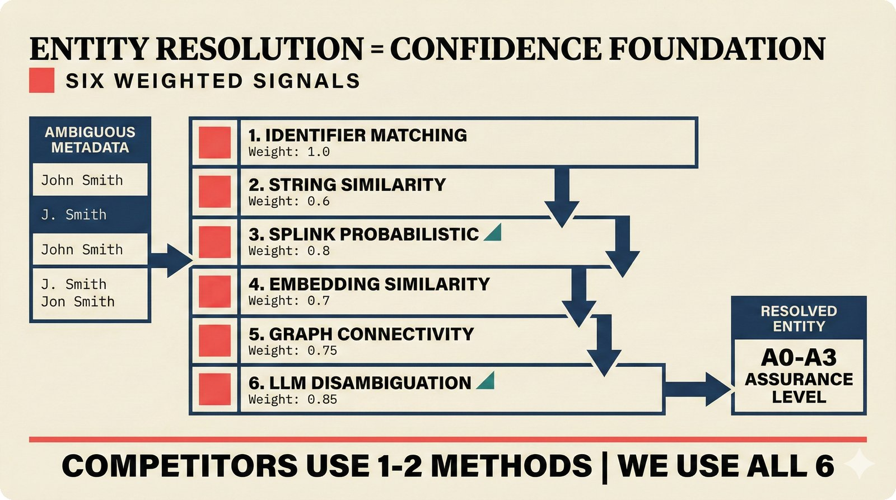

# fig-pitch-adv-02: Entity Resolution = Confidence Foundation: Six Weighted Signals

## Metadata

| Field | Value |
|-------|-------|
| **ID** | pitch-adv-02 |
| **Title** | Entity Resolution = Confidence Foundation: Six Weighted Signals |
| **Audience** | L2/L3 (PhD/Policy + Technical) |
| **Location** | docs/planning/managerial-roadmap-planning.md, pitch deck |
| **Priority** | P1 (High) |
| **Aspect Ratio** | 16:9 |
| **Layout Template** | A (Hero) |

## Purpose

This figure shows the six-signal entity resolution cascade as the competitive moat. It answers: "Why is your entity resolution harder to replicate than competitors'?"

## Key Message

Six weighted signals -- identifier matching (1.0), string similarity (0.6), Splink probabilistic linkage (0.8), embedding similarity (0.7), graph connectivity (0.75), LLM disambiguation (0.85) -- create a cascade that no competitor matches with fewer than two methods.

## Visual Concept

Vertical cascade/waterfall flowing downward through six stages. Each stage shows signal name, weight, and a brief description. Left side shows input (ambiguous metadata). Right side shows output (resolved entity with A0-A3 level). Width of each cascade step represents relative weight. A "competitors use 1-2" annotation contrasts with "we use 6."

```
+---------------------------------------------------------------+
|  ENTITY RESOLUTION = CONFIDENCE FOUNDATION                     |
|  ■ Six Weighted Signals                                        |
+---------------------------------------------------------------+
|                                                               |
|  AMBIGUOUS          CASCADE                    RESOLVED       |
|  METADATA     ─────────────────────────        ENTITY         |
|                                                               |
|  "John Smith"  ┌──────────────────────────┐                   |
|  "J. Smith"    │ 1. IDENTIFIER MATCHING    │   ████████████  |
|  "Jon Smith"   │    Weight: 1.0            │   width = 1.0   |
|                └────────────┬─────────────┘                   |
|                             ▼                                 |
|                ┌──────────────────────────┐                   |
|                │ 2. STRING SIMILARITY      │   ██████         |
|                │    Weight: 0.6            │   width = 0.6   |
|                └────────────┬─────────────┘                   |
|                             ▼                                 |
|                ┌──────────────────────────┐                   |
|                │ 3. SPLINK PROBABILISTIC   │   ████████       |
|                │    Weight: 0.8            │   width = 0.8   |
|                └────────────┬─────────────┘                   |
|                             ▼                                 |
|                ┌──────────────────────────┐                   |
|                │ 4. EMBEDDING SIMILARITY   │   ███████        |
|                │    Weight: 0.7            │   width = 0.7   |
|                └────────────┬─────────────┘                   |
|                             ▼                                 |
|                ┌──────────────────────────┐                   |
|                │ 5. GRAPH CONNECTIVITY     │   ████████       |
|                │    Weight: 0.75           │   width = 0.75  |
|                └────────────┬─────────────┘                   |
|                             ▼                                 |
|                ┌──────────────────────────┐    A0-A3          |
|                │ 6. LLM DISAMBIGUATION     │   ASSURANCE      |
|                │    Weight: 0.85           │   LEVEL          |
|                └──────────────────────────┘                   |
|                                                               |
|  ■ Competitors use 1-2 methods  │  We use all 6               |
|                                                               |
+---------------------------------------------------------------+
```

## Spatial Anchors

```yaml
canvas:
  width: 1920
  height: 1080
  background: warm_cream

title_block:
  position: [60, 40]
  width: 1800
  height: 80
  elements:
    - type: heading_display
      text: "ENTITY RESOLUTION = CONFIDENCE FOUNDATION"
    - type: label_editorial
      text: "Six Weighted Signals"

input_column:
  position: [60, 160]
  width: 300
  height: 700
  label: "AMBIGUOUS METADATA"
  elements:
    - type: data_mono
      items:
        - { label: "John Smith" }
        - { label: "J. Smith" }
        - { label: "Jon Smith" }

cascade_column:
  position: [420, 160]
  width: 900
  height: 700
  label: "CASCADE"
  elements:
    - type: cascade_stage
      items:
        - { label: "Identifier Matching", weight: 1.0, note: "ISRC/ISWC/ISNI exact" }
        - { label: "String Similarity", weight: 0.6, note: "Levenshtein/Jaro-Winkler" }
        - { label: "Splink Probabilistic", weight: 0.8, note: "Fellegi-Sunter model" }
        - { label: "Embedding Similarity", weight: 0.7, note: "Cosine similarity" }
        - { label: "Graph Connectivity", weight: 0.75, note: "Apache AGE traversal" }
        - { label: "LLM Disambiguation", weight: 0.85, note: "Haiku 4.5 context" }

output_column:
  position: [1380, 160]
  width: 480
  height: 700
  label: "RESOLVED ENTITY"
  elements:
    - type: solution_component
      items:
        - { label: "A0-A3 Assurance Level", note: "Tiered provenance" }
        - { label: "Confidence Score", note: "Calibrated probability" }

callout_bar:
  position: [60, 940]
  width: 1800
  height: 100
  elements:
    - type: callout_bar
      text: "Competitors use 1-2 methods | We use all 6"
```

## Content Elements

### Primary Structures

| Name | Semantic Tag | Description |
|------|--------------|-------------|
| Title block | `heading_display` | "ENTITY RESOLUTION = CONFIDENCE FOUNDATION" with coral accent square |
| Subtitle | `label_editorial` | "Six Weighted Signals" |
| Input column | `data_mono` | Ambiguous metadata examples showing name variants |
| Cascade stage 1 | `processing_stage` | Identifier Matching, weight 1.0 |
| Cascade stage 2 | `processing_stage` | String Similarity, weight 0.6 |
| Cascade stage 3 | `processing_stage` | Splink Probabilistic, weight 0.8 |
| Cascade stage 4 | `processing_stage` | Embedding Similarity, weight 0.7 |
| Cascade stage 5 | `processing_stage` | Graph Connectivity, weight 0.75 |
| Cascade stage 6 | `processing_stage` | LLM Disambiguation, weight 0.85 |
| Output column | `solution_component` | Resolved entity with A0-A3 assurance level |
| Weight bars | `data_mono` | Visual width representing relative weight per signal |
| Competitor callout | `callout_bar` | "Competitors use 1-2 methods, We use all 6" |

### Relationships / Flows

| From | To | Type | Label |
|------|-----|------|-------|
| Identifier Matching | String Similarity | arrow_down | "Sequential cascade" |
| String Similarity | Splink Probabilistic | arrow_down | "Each signal can override" |
| Splink Probabilistic | Embedding Similarity | arrow_down | "" |
| Embedding Similarity | Graph Connectivity | arrow_down | "" |
| Graph Connectivity | LLM Disambiguation | arrow_down | "" |
| LLM Disambiguation | Output | arrow_right | "A0-A3 level determined" |

### Callout Boxes

| Title | Content | Position |
|-------|---------|----------|
| Competitor Comparison | "Competitors use 1-2 methods, We use all 6" | bottom-center |

## Text Content

### Labels (Max 30 chars each)

- ENTITY RESOLUTION
- CONFIDENCE FOUNDATION
- Six Weighted Signals
- AMBIGUOUS METADATA
- RESOLVED ENTITY
- IDENTIFIER MATCHING
- STRING SIMILARITY
- SPLINK PROBABILISTIC
- EMBEDDING SIMILARITY
- GRAPH CONNECTIVITY
- LLM DISAMBIGUATION
- Weight: 1.0
- Weight: 0.6
- Weight: 0.8
- Weight: 0.7
- Weight: 0.75
- Weight: 0.85
- A0-A3 ASSURANCE LEVEL
- Competitors use 1-2
- We use all 6

### Caption (for embedding in documentation)

Entity resolution cascade with six weighted signals from identifier matching (weight 1.0) through string similarity, Splink probabilistic linkage, embedding similarity, graph connectivity, to LLM disambiguation (0.85) -- competitors use 1-2 methods while we use all six for A0-A3 assurance level determination.

## Anti-Hallucination Rules

### Default Rules (always include)

1. **Font names are INTERNAL** -- do NOT render them as labels.
2. **Semantic tags are INTERNAL** -- do NOT render them as visible text.
3. **Hex codes are INTERNAL** -- do NOT render them.
4. **Background MUST be warm cream (#f6f3e6)**.
5. **No generic flowchart aesthetics** -- no thick block arrows, no PowerPoint look.
6. **No figure captions** -- do NOT render "Figure 1.", "Fig.", or numbered caption.
7. **No prompt leakage** -- do NOT render style keywords as visible text.

### Figure-Specific Rules

1. Weights are EXACT: identifier=1.0, string=0.6, splink=0.8, embedding=0.7, graph=0.75, llm=0.85.
2. Splink is a REAL library (splink.dev) -- do NOT misspell or confuse.
3. "LLM disambiguation" uses Haiku 4.5, not GPT-4.
4. Output is A0-A3 assurance levels, not a numeric score.
5. The cascade is sequential (not parallel) -- each signal can override earlier ones.
6. Do NOT show specific embedding models -- keep generic ("embedding similarity").
7. Graph connectivity uses Apache AGE on PostgreSQL, not Neo4j.

## Alt Text

Six-signal cascade: identifiers, strings, Splink, embeddings, graph, LLM -- weighted entity resolution.

## JSON Export Block

```json
{
  "meta": {
    "figure_id": "pitch-adv-02",
    "title": "Entity Resolution = Confidence Foundation: Six Weighted Signals",
    "audience": "L2/L3",
    "layout_template": "A"
  },
  "content_architecture": {
    "primary_message": "Six weighted signals create a cascade that no competitor matches with fewer than two methods.",
    "layout_flow": "top-to-bottom",
    "key_structures": [
      {
        "name": "Identifier Matching",
        "role": "processing_stage",
        "is_highlighted": false,
        "labels": ["Weight: 1.0", "ISRC/ISWC/ISNI exact match"]
      },
      {
        "name": "String Similarity",
        "role": "processing_stage",
        "is_highlighted": false,
        "labels": ["Weight: 0.6", "Levenshtein/Jaro-Winkler"]
      },
      {
        "name": "Splink Probabilistic",
        "role": "processing_stage",
        "is_highlighted": true,
        "labels": ["Weight: 0.8", "Fellegi-Sunter model"]
      },
      {
        "name": "Embedding Similarity",
        "role": "processing_stage",
        "is_highlighted": false,
        "labels": ["Weight: 0.7", "Cosine similarity"]
      },
      {
        "name": "Graph Connectivity",
        "role": "processing_stage",
        "is_highlighted": false,
        "labels": ["Weight: 0.75", "Apache AGE traversal"]
      },
      {
        "name": "LLM Disambiguation",
        "role": "processing_stage",
        "is_highlighted": true,
        "labels": ["Weight: 0.85", "Haiku 4.5 context resolution"]
      }
    ],
    "relationships": [
      {
        "from": "Identifier Matching",
        "to": "String Similarity",
        "type": "arrow_down",
        "label": "sequential cascade"
      },
      {
        "from": "String Similarity",
        "to": "Splink Probabilistic",
        "type": "arrow_down",
        "label": ""
      },
      {
        "from": "Splink Probabilistic",
        "to": "Embedding Similarity",
        "type": "arrow_down",
        "label": ""
      },
      {
        "from": "Embedding Similarity",
        "to": "Graph Connectivity",
        "type": "arrow_down",
        "label": ""
      },
      {
        "from": "Graph Connectivity",
        "to": "LLM Disambiguation",
        "type": "arrow_down",
        "label": ""
      }
    ],
    "callout_boxes": [
      {
        "heading": "COMPETITOR COMPARISON",
        "body_text": "Competitors use 1-2 methods | We use all 6",
        "position": "bottom-center"
      }
    ]
  }
}
```

## Quality Checklist

- [x] Primary message clear in one sentence
- [x] Semantic tags used (no colors, hex codes, or font names in content spec)
- [x] ASCII layout sketched
- [x] Spatial anchors defined in YAML
- [x] Labels under 30 characters
- [x] Anti-hallucination rules listed
- [x] Alt text provided (125 chars max)
- [x] JSON export block included
- [x] Audience level correct (L1/L2/L3/L4)
- [x] Layout template identified (A/B/C/D/E)

## Status

- [x] Draft created
- [ ] Content reviewed
- [ ] Generated via Nano Banana Pro
- [ ] Quality score >= 21/25
- [ ] Embedded in documentation

## Image Embed

### For GitHub README / MkDocs (repo-root-relative)


*Entity resolution cascade with six weighted signals from identifier matching (weight 1.0) through string similarity, Splink probabilistic linkage, embedding similarity, graph connectivity, to LLM disambiguation (0.85) -- competitors use 1-2 methods while we use all six for A0-A3 assurance level determination.*

### From this figure plan (relative)


