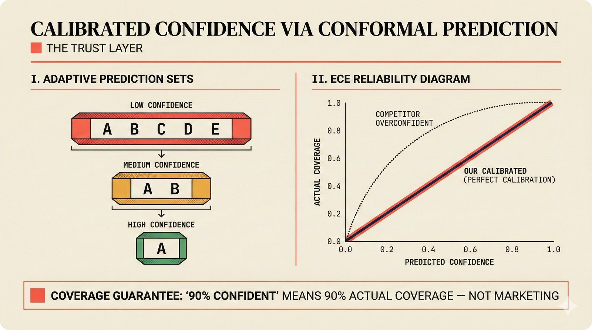

# fig-pitch-adv-03: Calibrated Confidence via Conformal Prediction: The Trust Layer

## Metadata

| Field | Value |
|-------|-------|
| **ID** | pitch-adv-03 |
| **Title** | Calibrated Confidence via Conformal Prediction: The Trust Layer |
| **Audience** | L2/L3 (PhD/Policy + Technical) |
| **Location** | docs/planning/managerial-roadmap-planning.md, pitch deck |
| **Priority** | P1 (High) |
| **Aspect Ratio** | 16:9 |
| **Layout Template** | B (Multi-Panel) |

## Purpose

This figure shows how conformal prediction provides calibrated confidence vs. competitors' black-box scores. It answers: "Why should regulators and CMOs trust your confidence scores?"

## Key Message

Adaptive Prediction Sets (APS) provide distribution-free coverage guarantees -- "90% confident" means 90% actual coverage, not overconfident marketing. ECE reliability diagrams prove it.

## Visual Concept

Two-panel layout. Left: APS algorithm visualization showing prediction sets shrinking as confidence increases. Right: ECE reliability diagram (Expected Calibration Error) comparing our calibrated diagonal vs. competitors' overconfident curve above the diagonal. Below both panels, a bar comparing "Our calibrated confidence" vs "Competitor black-box score."

```
+---------------------------------------------------------------+
|  CALIBRATED CONFIDENCE VIA CONFORMAL PREDICTION                |
|  ■ The Trust Layer                                             |
+-------------------------------+-------------------------------+
|                               |                               |
|  I. ADAPTIVE PREDICTION SETS  |  II. ECE RELIABILITY DIAGRAM  |
|  ─────────────────────────    |  ──────────────────────────    |
|                               |                               |
|  Low confidence:              |       1.0 ┐                   |
|  ┌─────────────────────┐      |           │  /                |
|  │ A  B  C  D  E       │      |   Actual  │ / Perfect         |
|  └─────────────────────┘      |   Coverage│/  calibration     |
|                               |           │     ·····         |
|  Medium confidence:           |       0.5 ┤   ····            |
|  ┌───────────┐                |           │ ···  Competitor   |
|  │ A  B      │                |           │··    overconfident |
|  └───────────┘                |       0.0 ┼─────────────┐     |
|                               |           0.0    0.5   1.0    |
|  High confidence:             |           Predicted Confidence |
|  ┌───┐                        |                               |
|  │ A │                        |  ── Our calibrated (diagonal) |
|  └───┘                        |  ·· Competitor (above line)   |
|                               |                               |
+-------------------------------+-------------------------------+
|                                                               |
|  ■ "90% confident" means 90% actual coverage — not marketing  |
|                                                               |
+---------------------------------------------------------------+
```

## Spatial Anchors

```yaml
canvas:
  width: 1920
  height: 1080
  background: warm_cream

title_block:
  position: [60, 40]
  width: 1800
  height: 80
  elements:
    - type: heading_display
      text: "CALIBRATED CONFIDENCE VIA CONFORMAL PREDICTION"
    - type: label_editorial
      text: "The Trust Layer"

left_panel:
  position: [60, 160]
  width: 860
  height: 700
  label: "ADAPTIVE PREDICTION SETS"
  elements:
    - type: prediction_sets
      items:
        - { confidence: "Low", set_size: 5, labels: ["A", "B", "C", "D", "E"] }
        - { confidence: "Medium", set_size: 2, labels: ["A", "B"] }
        - { confidence: "High", set_size: 1, labels: ["A"] }
    - type: label_editorial
      text: "Sets shrink as confidence increases"

right_panel:
  position: [980, 160]
  width: 860
  height: 700
  label: "ECE RELIABILITY DIAGRAM"
  elements:
    - type: reliability_diagram
      lines:
        - { label: "Our calibrated", style: "solid_diagonal", note: "On the line" }
        - { label: "Competitor", style: "dotted_above", note: "Overconfident — above diagonal" }
    - type: axis_labels
      x: "Predicted Confidence"
      y: "Actual Coverage"

callout_bar:
  position: [60, 900]
  width: 1800
  height: 120
  elements:
    - type: callout_bar
      text: "'90% confident' means 90% actual coverage — not marketing"
```

## Content Elements

### Primary Structures

| Name | Semantic Tag | Description |
|------|--------------|-------------|
| Title block | `heading_display` | "CALIBRATED CONFIDENCE VIA CONFORMAL PREDICTION" with coral accent square |
| Subtitle | `label_editorial` | "The Trust Layer" |
| APS panel | `processing_stage` | Left panel showing prediction sets shrinking as confidence increases |
| Low confidence set | `data_mono` | Wide set with 5 candidates |
| Medium confidence set | `data_mono` | Narrower set with 2 candidates |
| High confidence set | `data_mono` | Single candidate — high confidence |
| ECE panel | `processing_stage` | Right panel with reliability diagram |
| Calibrated line | `solution_component` | Solid diagonal line — perfect calibration |
| Competitor line | `processing_stage` | Dotted line above diagonal — overconfident |
| Axis labels | `data_mono` | "Predicted Confidence" (x) and "Actual Coverage" (y) |
| Callout bar | `callout_bar` | "90% confident means 90% actual coverage" |

### Relationships / Flows

| From | To | Type | Label |
|------|-----|------|-------|
| APS panel | ECE panel | conceptual | "Sets produce calibrated coverage" |
| Calibrated line | Competitor line | comparison | "On diagonal vs. above diagonal" |

### Callout Boxes

| Title | Content | Position |
|-------|---------|----------|
| Coverage Guarantee | "'90% confident' means 90% actual coverage -- not marketing" | bottom-center |

## Text Content

### Labels (Max 30 chars each)

- CALIBRATED CONFIDENCE
- CONFORMAL PREDICTION
- The Trust Layer
- ADAPTIVE PREDICTION SETS
- ECE RELIABILITY DIAGRAM
- Low confidence
- Medium confidence
- High confidence
- Predicted Confidence
- Actual Coverage
- Our calibrated
- Competitor overconfident
- Perfect calibration
- Distribution-free guarantee

### Caption (for embedding in documentation)

Calibrated confidence via Adaptive Prediction Sets with distribution-free coverage guarantees -- left panel shows APS prediction sets, right panel shows ECE reliability diagram comparing our calibrated confidence (on the diagonal) against competitors' overconfident black-box scores, providing the trust layer for EU AI Act compliance and SLA-grade licensing.

## Anti-Hallucination Rules

### Default Rules (always include)

1. **Font names are INTERNAL** -- do NOT render them as labels.
2. **Semantic tags are INTERNAL** -- do NOT render them as visible text.
3. **Hex codes are INTERNAL** -- do NOT render them.
4. **Background MUST be warm cream (#f6f3e6)**.
5. **No generic flowchart aesthetics** -- no thick block arrows, no PowerPoint look.
6. **No figure captions** -- do NOT render "Figure 1.", "Fig.", or numbered caption.
7. **No prompt leakage** -- do NOT render style keywords as visible text.

### Figure-Specific Rules

1. APS stands for Adaptive Prediction Sets -- do NOT expand differently.
2. ECE stands for Expected Calibration Error -- a standard ML calibration metric.
3. "Distribution-free" means no assumptions about the data distribution -- this is the key advantage.
4. The reliability diagram diagonal represents PERFECT calibration -- points above are overconfident.
5. Do NOT show specific calibration numbers -- keep conceptual.
6. Conformal prediction is from the statistics literature (Vovk et al.) -- not our invention.
7. SConU (Self-Consistency Under Uncertainty) is a related concept but not shown here.

## Alt Text

Two-panel: APS prediction sets and ECE reliability diagram showing calibrated vs black-box confidence.

## JSON Export Block

```json
{
  "meta": {
    "figure_id": "pitch-adv-03",
    "title": "Calibrated Confidence via Conformal Prediction: The Trust Layer",
    "audience": "L2/L3",
    "layout_template": "B"
  },
  "content_architecture": {
    "primary_message": "Adaptive Prediction Sets provide distribution-free coverage guarantees — '90% confident' means 90% actual coverage, not overconfident marketing.",
    "layout_flow": "left-to-right",
    "key_structures": [
      {
        "name": "Adaptive Prediction Sets",
        "role": "processing_stage",
        "is_highlighted": true,
        "labels": ["Low confidence (5 candidates)", "Medium confidence (2 candidates)", "High confidence (1 candidate)"]
      },
      {
        "name": "ECE Reliability Diagram",
        "role": "processing_stage",
        "is_highlighted": true,
        "labels": ["Our calibrated (on diagonal)", "Competitor overconfident (above diagonal)"]
      }
    ],
    "relationships": [
      {
        "from": "APS Panel",
        "to": "ECE Panel",
        "type": "conceptual",
        "label": "sets produce calibrated coverage"
      }
    ],
    "callout_boxes": [
      {
        "heading": "COVERAGE GUARANTEE",
        "body_text": "'90% confident' means 90% actual coverage — not marketing",
        "position": "bottom-center"
      }
    ]
  }
}
```

## Quality Checklist

- [x] Primary message clear in one sentence
- [x] Semantic tags used (no colors, hex codes, or font names in content spec)
- [x] ASCII layout sketched
- [x] Spatial anchors defined in YAML
- [x] Labels under 30 characters
- [x] Anti-hallucination rules listed
- [x] Alt text provided (125 chars max)
- [x] JSON export block included
- [x] Audience level correct (L1/L2/L3/L4)
- [x] Layout template identified (A/B/C/D/E)

## Status

- [x] Draft created
- [ ] Content reviewed
- [ ] Generated via Nano Banana Pro
- [ ] Quality score >= 21/25
- [ ] Embedded in documentation

## Image Embed

### For GitHub README / MkDocs (repo-root-relative)


*Calibrated confidence via Adaptive Prediction Sets with distribution-free coverage guarantees -- left panel shows APS prediction sets, right panel shows ECE reliability diagram comparing our calibrated confidence (on the diagonal) against competitors' overconfident black-box scores, providing the trust layer for EU AI Act compliance and SLA-grade licensing.*

### From this figure plan (relative)


