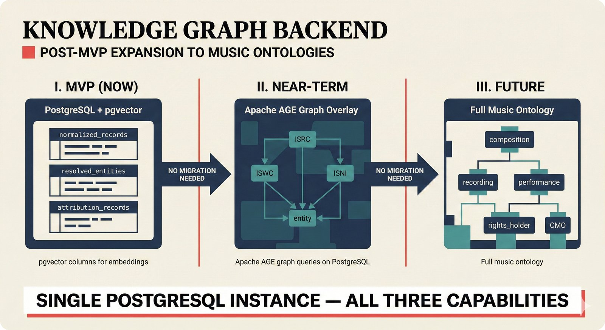

# fig-pitch-adv-04: Knowledge Graph Backend: Post-MVP Expansion to Music Ontologies

## Metadata

| Field | Value |
|-------|-------|
| **ID** | pitch-adv-04 |
| **Title** | Knowledge Graph Backend: Post-MVP Expansion to Music Ontologies |
| **Audience** | L2/L3 (PhD/Policy + Technical) |
| **Location** | docs/planning/managerial-roadmap-planning.md, pitch deck |
| **Priority** | P1 (High) |
| **Aspect Ratio** | 16:9 |
| **Layout Template** | C (Flowchart) |

## Purpose

This figure shows the database backend roadmap from MVP relational to full knowledge graph. It answers: "How does your data architecture evolve from MVP to enterprise?"

## Key Message

Single PostgreSQL instance with three capabilities (relational + pgvector + Apache AGE graph) evolves from MVP entity resolution to full music ontology without database migration.

## Visual Concept

Three-layer horizontal diagram. Layer 1 (left): Current MVP -- PostgreSQL tables (normalized_records, resolved_entities, attribution_records) with pgvector columns. Layer 2 (center): Near-term -- Apache AGE graph overlay connecting entities to ISRC/ISWC/ISNI nodes. Layer 3 (right): Future -- Full music ontology (composition, recording, performance, rights_holder, CMO). Arrows show progressive expansion.

```
+---------------------------------------------------------------+
|  KNOWLEDGE GRAPH BACKEND                                       |
|  ■ Post-MVP Expansion to Music Ontologies                      |
+---------------------------------------------------------------+
|                                                               |
|  I. MVP (NOW)          II. NEAR-TERM         III. FUTURE      |
|  ─────────────         ───────────────        ──────────       |
|                                                               |
|  PostgreSQL            + Apache AGE           Full Music       |
|  + pgvector            Graph Overlay          Ontology         |
|                                                               |
|  ┌──────────────┐      ┌──────────────┐      ┌────────────┐  |
|  │normalized_    │      │  (ISRC)──────│──────│composition │  |
|  │records        │      │  /    \      │      │     │      │  |
|  ├──────────────┤  ──▶  │(ISWC) (ISNI)│  ──▶ │  recording │  |
|  │resolved_     │      │  \    /      │      │     │      │  |
|  │entities      │      │  (entity)    │      │performance │  |
|  ├──────────────┤      │              │      │     │      │  |
|  │attribution_  │      │  Graph queries│      │rights_holder│ |
|  │records       │      │  on PostgreSQL│      │     │      │  |
|  └──────────────┘      └──────────────┘      │    CMO     │  |
|                                               └────────────┘  |
|  pgvector columns       No migration           No migration   |
|  for embeddings         needed                  needed         |
|                                                               |
|  ■ Single PostgreSQL instance — all three capabilities         |
|                                                               |
+---------------------------------------------------------------+
```

## Spatial Anchors

```yaml
canvas:
  width: 1920
  height: 1080
  background: warm_cream

title_block:
  position: [60, 40]
  width: 1800
  height: 80
  elements:
    - type: heading_display
      text: "KNOWLEDGE GRAPH BACKEND"
    - type: label_editorial
      text: "Post-MVP Expansion to Music Ontologies"

layer_1_mvp:
  position: [60, 160]
  width: 540
  height: 700
  label: "MVP (NOW)"
  elements:
    - type: database_tables
      items:
        - { label: "normalized_records", note: "ETL output" }
        - { label: "resolved_entities", note: "Entity resolution output" }
        - { label: "attribution_records", note: "Confidence scores" }
    - type: label_editorial
      text: "pgvector columns for embeddings"

layer_2_nearterm:
  position: [680, 160]
  width: 540
  height: 700
  label: "NEAR-TERM"
  elements:
    - type: graph_overlay
      nodes:
        - { label: "ISRC", note: "Recordings" }
        - { label: "ISWC", note: "Compositions" }
        - { label: "ISNI", note: "Creators" }
        - { label: "entity", note: "Resolved entity" }
    - type: label_editorial
      text: "Apache AGE graph queries on PostgreSQL"

layer_3_future:
  position: [1300, 160]
  width: 540
  height: 700
  label: "FUTURE"
  elements:
    - type: ontology_tree
      nodes:
        - { label: "composition", note: "Musical work" }
        - { label: "recording", note: "Specific recording" }
        - { label: "performance", note: "Live/studio session" }
        - { label: "rights_holder", note: "Legal owner" }
        - { label: "CMO", note: "Collection society" }
    - type: label_editorial
      text: "Full music ontology"

progression_arrows:
  elements:
    - type: arrow_right
      from: layer_1_mvp
      to: layer_2_nearterm
      label: "No migration needed"
    - type: arrow_right
      from: layer_2_nearterm
      to: layer_3_future
      label: "No migration needed"

callout_bar:
  position: [60, 940]
  width: 1800
  height: 100
  elements:
    - type: callout_bar
      text: "Single PostgreSQL instance — all three capabilities"
```

## Content Elements

### Primary Structures

| Name | Semantic Tag | Description |
|------|--------------|-------------|
| Title block | `heading_display` | "KNOWLEDGE GRAPH BACKEND" with coral accent square |
| Subtitle | `label_editorial` | "Post-MVP Expansion to Music Ontologies" |
| MVP layer | `processing_stage` | PostgreSQL tables with pgvector columns |
| Table: normalized_records | `data_mono` | ETL output table |
| Table: resolved_entities | `data_mono` | Entity resolution output table |
| Table: attribution_records | `data_mono` | Confidence scores table |
| Near-term layer | `processing_stage` | Apache AGE graph overlay with identifier nodes |
| ISRC node | `solution_component` | Recording identifier |
| ISWC node | `solution_component` | Composition identifier |
| ISNI node | `solution_component` | Creator identifier |
| Future layer | `solution_component` | Full music ontology tree |
| Ontology nodes | `solution_component` | Composition, recording, performance, rights_holder, CMO |
| Callout bar | `callout_bar` | "Single PostgreSQL instance" |

### Relationships / Flows

| From | To | Type | Label |
|------|-----|------|-------|
| MVP layer | Near-term layer | arrow_right | "No migration needed" |
| Near-term layer | Future layer | arrow_right | "No migration needed" |
| ISRC node | ISWC node | graph_edge | "Recording of composition" |
| ISNI node | entity node | graph_edge | "Creator identity" |

### Callout Boxes

| Title | Content | Position |
|-------|---------|----------|
| Single Instance | "Single PostgreSQL instance -- all three capabilities" | bottom-center |

## Text Content

### Labels (Max 30 chars each)

- KNOWLEDGE GRAPH BACKEND
- Post-MVP Expansion
- Music Ontologies
- MVP (NOW)
- NEAR-TERM
- FUTURE
- normalized_records
- resolved_entities
- attribution_records
- pgvector columns
- Apache AGE
- ISRC
- ISWC
- ISNI
- composition
- recording
- performance
- rights_holder
- CMO
- No migration needed
- Single PostgreSQL instance

### Caption (for embedding in documentation)

Knowledge graph backend roadmap: PostgreSQL with pgvector for MVP entity resolution, Apache AGE graph overlay connecting ISRC/ISWC/ISNI identifier nodes, and future expansion to full music ontology with composition, recording, performance, and rights holder nodes -- all on a single database instance without migration overhead.

## Anti-Hallucination Rules

### Default Rules (always include)

1. **Font names are INTERNAL** -- do NOT render them as labels.
2. **Semantic tags are INTERNAL** -- do NOT render them as visible text.
3. **Hex codes are INTERNAL** -- do NOT render them.
4. **Background MUST be warm cream (#f6f3e6)**.
5. **No generic flowchart aesthetics** -- no thick block arrows, no PowerPoint look.
6. **No figure captions** -- do NOT render "Figure 1.", "Fig.", or numbered caption.
7. **No prompt leakage** -- do NOT render style keywords as visible text.

### Figure-Specific Rules

1. PostgreSQL is the ONLY database -- no Neo4j, no MongoDB, no separate graph DB.
2. pgvector provides embedding storage and similarity search.
3. Apache AGE provides graph queries ON TOP of PostgreSQL -- not a separate system.
4. ISRC (recordings), ISWC (compositions), ISNI (creators) are REAL identifiers -- spell correctly.
5. DDEX is a metadata standard, not a database -- do NOT confuse.
6. The ontology expansion is POST-MVP -- do NOT imply it exists now.
7. "Single instance" means one PostgreSQL server handles all three capabilities.

## Alt Text

Three-layer: PostgreSQL relational MVP, Apache AGE graph overlay, full music ontology expansion.

## JSON Export Block

```json
{
  "meta": {
    "figure_id": "pitch-adv-04",
    "title": "Knowledge Graph Backend: Post-MVP Expansion to Music Ontologies",
    "audience": "L2/L3",
    "layout_template": "C"
  },
  "content_architecture": {
    "primary_message": "Single PostgreSQL instance with three capabilities evolves from MVP entity resolution to full music ontology without database migration.",
    "layout_flow": "left-to-right",
    "key_structures": [
      {
        "name": "MVP (Now)",
        "role": "processing_stage",
        "is_highlighted": false,
        "labels": ["normalized_records", "resolved_entities", "attribution_records", "pgvector columns"]
      },
      {
        "name": "Near-Term",
        "role": "processing_stage",
        "is_highlighted": true,
        "labels": ["Apache AGE", "ISRC nodes", "ISWC nodes", "ISNI nodes"]
      },
      {
        "name": "Future",
        "role": "solution_component",
        "is_highlighted": true,
        "labels": ["composition", "recording", "performance", "rights_holder", "CMO"]
      }
    ],
    "relationships": [
      {
        "from": "MVP",
        "to": "Near-Term",
        "type": "arrow_right",
        "label": "no migration needed"
      },
      {
        "from": "Near-Term",
        "to": "Future",
        "type": "arrow_right",
        "label": "no migration needed"
      }
    ],
    "callout_boxes": [
      {
        "heading": "SINGLE INSTANCE",
        "body_text": "Single PostgreSQL instance — all three capabilities",
        "position": "bottom-center"
      }
    ]
  }
}
```

## Quality Checklist

- [x] Primary message clear in one sentence
- [x] Semantic tags used (no colors, hex codes, or font names in content spec)
- [x] ASCII layout sketched
- [x] Spatial anchors defined in YAML
- [x] Labels under 30 characters
- [x] Anti-hallucination rules listed
- [x] Alt text provided (125 chars max)
- [x] JSON export block included
- [x] Audience level correct (L1/L2/L3/L4)
- [x] Layout template identified (A/B/C/D/E)

## Status

- [x] Draft created
- [ ] Content reviewed
- [ ] Generated via Nano Banana Pro
- [ ] Quality score >= 21/25
- [ ] Embedded in documentation

## Image Embed

### For GitHub README / MkDocs (repo-root-relative)


*Knowledge graph backend roadmap: PostgreSQL with pgvector for MVP entity resolution, Apache AGE graph overlay connecting ISRC/ISWC/ISNI identifier nodes, and future expansion to full music ontology with composition, recording, performance, and rights holder nodes -- all on a single database instance without migration overhead.*

### From this figure plan (relative)


