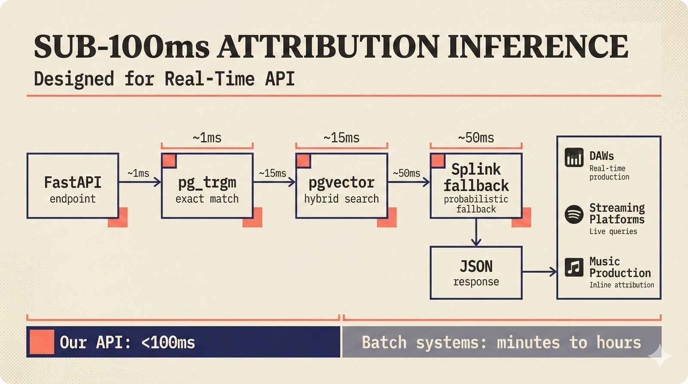

# fig-pitch-adv-05: Sub-100ms Attribution Inference: Designed for Real-Time API

## Metadata

| Field | Value |
|-------|-------|
| **ID** | pitch-adv-05 |
| **Title** | Sub-100ms Attribution Inference: Designed for Real-Time API |
| **Audience** | L2 (PhD/Policy + Light Technical) |
| **Location** | docs/planning/managerial-roadmap-planning.md, pitch deck |
| **Priority** | P1 (High) |
| **Aspect Ratio** | 16:9 |
| **Layout Template** | D (Split-Panel) |

## Purpose

This figure shows the inference pipeline with latency annotations for each stage. It answers: "Can your API handle real-time queries from DAWs and streaming platforms?"

## Key Message

Sub-100ms attribution inference: FastAPI, pg_trgm exact match (1ms), pgvector hybrid search (15ms), Splink fallback (50ms), response -- designed for real-time embedding in production workflows.

## Visual Concept

Left-to-right pipeline flow with latency annotations above each stage. Stages: FastAPI endpoint, pg_trgm exact match (green, 1ms), pgvector hybrid search (amber, 15ms), Splink probabilistic fallback (amber, 50ms), JSON response. Below: comparison bar showing "Our API: <100ms" vs "Batch systems: minutes to hours." DAW/streaming platform icons at the receiving end.

```
+---------------------------------------------------------------+
|  SUB-100ms ATTRIBUTION INFERENCE                               |
|  ■ Designed for Real-Time API                                  |
+---------------------------------------------------------------+
|                                                               |
|     ~1ms          ~15ms           ~50ms                       |
|      ▼              ▼               ▼                         |
|  ┌────────┐   ┌──────────┐   ┌────────────┐   ┌──────────┐  |
|  │FastAPI  │──▶│ pg_trgm  │──▶│  pgvector   │──▶│  Splink  │  |
|  │endpoint │   │ exact    │   │  hybrid     │   │ fallback │  |
|  │         │   │ match    │   │  search     │   │          │  |
|  └────────┘   └──────────┘   └────────────┘   └─────┬────┘  |
|                                                       │       |
|                                                       ▼       |
|                                                 ┌──────────┐  |
|                                                 │   JSON    │  |
|                                                 │ response  │  |
|                                                 └─────┬────┘  |
|                                                       │       |
|                                          ┌────────────┼───┐   |
|                                          │  DAWs      │   │   |
|                                          │  Streaming  │   │   |
|                                          │  Platforms  │   │   |
|                                          └────────────────┘   |
|                                                               |
+---------------------------------------------------------------+
|                                                               |
|  ■ Our API: <100ms   vs   Batch systems: minutes to hours     |
|                                                               |
+---------------------------------------------------------------+
```

## Spatial Anchors

```yaml
canvas:
  width: 1920
  height: 1080
  background: warm_cream

title_block:
  position: [60, 40]
  width: 1800
  height: 80
  elements:
    - type: heading_display
      text: "SUB-100ms ATTRIBUTION INFERENCE"
    - type: label_editorial
      text: "Designed for Real-Time API"

pipeline_flow:
  position: [60, 180]
  width: 1800
  height: 500
  elements:
    - type: pipeline_stage
      items:
        - { label: "FastAPI endpoint", latency: null, tier: "entry" }
        - { label: "pg_trgm exact match", latency: "~1ms", tier: "high_confidence" }
        - { label: "pgvector hybrid search", latency: "~15ms", tier: "medium_confidence" }
        - { label: "Splink fallback", latency: "~50ms", tier: "medium_confidence" }
        - { label: "JSON response", latency: null, tier: "output" }

latency_annotations:
  position: [60, 160]
  width: 1400
  height: 40
  elements:
    - type: data_mono
      items:
        - { text: "~1ms", x_offset: 320 }
        - { text: "~15ms", x_offset: 640 }
        - { text: "~50ms", x_offset: 960 }

receiving_end:
  position: [1400, 500]
  width: 400
  height: 200
  elements:
    - type: solution_component
      items:
        - { label: "DAWs", note: "Real-time production" }
        - { label: "Streaming Platforms", note: "Live queries" }
        - { label: "Music Production", note: "Inline attribution" }

comparison_bar:
  position: [60, 900]
  width: 1800
  height: 120
  elements:
    - type: comparison_bar
      left: { label: "Our API", value: "<100ms" }
      right: { label: "Batch systems", value: "minutes to hours" }
```

## Content Elements

### Primary Structures

| Name | Semantic Tag | Description |
|------|--------------|-------------|
| Title block | `heading_display` | "SUB-100ms ATTRIBUTION INFERENCE" with coral accent square |
| Subtitle | `label_editorial` | "Designed for Real-Time API" |
| FastAPI stage | `processing_stage` | Entry point -- web framework endpoint |
| pg_trgm stage | `processing_stage` | Trigram exact match, ~1ms latency |
| pgvector stage | `processing_stage` | Hybrid vector search, ~15ms latency |
| Splink stage | `processing_stage` | Probabilistic fallback, ~50ms latency |
| JSON response | `solution_component` | Output with confidence scores |
| Latency annotations | `data_mono` | ~1ms, ~15ms, ~50ms above respective stages |
| Receiving end | `solution_component` | DAWs, streaming platforms, music production |
| Comparison bar | `callout_bar` | "Our API: <100ms vs Batch systems: minutes to hours" |

### Relationships / Flows

| From | To | Type | Label |
|------|-----|------|-------|
| FastAPI endpoint | pg_trgm exact match | arrow_right | "Query enters" |
| pg_trgm exact match | pgvector hybrid search | arrow_right | "If no exact match" |
| pgvector hybrid search | Splink fallback | arrow_right | "If ambiguous" |
| Splink fallback | JSON response | arrow_right | "Attribution result" |
| JSON response | Receiving end | arrow_right | "Real-time delivery" |

### Callout Boxes

| Title | Content | Position |
|-------|---------|----------|
| Latency Comparison | "Our API: <100ms vs Batch systems: minutes to hours" | bottom-center |

## Text Content

### Labels (Max 30 chars each)

- SUB-100ms ATTRIBUTION
- Designed for Real-Time API
- FastAPI endpoint
- pg_trgm exact match
- pgvector hybrid search
- Splink fallback
- JSON response
- ~1ms
- ~15ms
- ~50ms
- DAWs
- Streaming Platforms
- Music Production
- Our API: <100ms
- Batch: minutes to hours

### Caption (for embedding in documentation)

Sub-100ms attribution inference pipeline flowing from FastAPI endpoint through pg_trgm exact match (1ms), pgvector hybrid search (15ms), and Splink probabilistic fallback (50ms) -- designed for real-time API embedding in DAWs, streaming platforms, and music production workflows where batch-only competitor systems cannot compete.

## Anti-Hallucination Rules

### Default Rules (always include)

1. **Font names are INTERNAL** -- do NOT render them as labels.
2. **Semantic tags are INTERNAL** -- do NOT render them as visible text.
3. **Hex codes are INTERNAL** -- do NOT render them.
4. **Background MUST be warm cream (#f6f3e6)**.
5. **No generic flowchart aesthetics** -- no thick block arrows, no PowerPoint look.
6. **No figure captions** -- do NOT render "Figure 1.", "Fig.", or numbered caption.
7. **No prompt leakage** -- do NOT render style keywords as visible text.

### Figure-Specific Rules

1. Latencies are APPROXIMATE targets: pg_trgm ~1ms, pgvector ~15ms, Splink ~50ms.
2. pg_trgm is a PostgreSQL extension for trigram text search -- do NOT misspell.
3. pgvector uses HNSW index for approximate nearest neighbor search.
4. Splink is the FALLBACK, not the primary path -- most queries resolve at pg_trgm or pgvector.
5. Do NOT show specific DAW names (Ableton, Logic) -- keep generic "DAWs."
6. FastAPI is the web framework -- do NOT substitute Flask or Django.
7. Response format is JSON -- do NOT show XML or protobuf.

## Alt Text

Pipeline: FastAPI to pg_trgm (1ms) to pgvector (15ms) to Splink (50ms) -- sub-100ms total.

## JSON Export Block

```json
{
  "meta": {
    "figure_id": "pitch-adv-05",
    "title": "Sub-100ms Attribution Inference: Designed for Real-Time API",
    "audience": "L2",
    "layout_template": "D"
  },
  "content_architecture": {
    "primary_message": "Sub-100ms attribution inference designed for real-time embedding in production workflows.",
    "layout_flow": "left-to-right",
    "key_structures": [
      {
        "name": "FastAPI Endpoint",
        "role": "processing_stage",
        "is_highlighted": false,
        "labels": ["Entry point"]
      },
      {
        "name": "pg_trgm Exact Match",
        "role": "processing_stage",
        "is_highlighted": true,
        "labels": ["~1ms", "Trigram text search"]
      },
      {
        "name": "pgvector Hybrid Search",
        "role": "processing_stage",
        "is_highlighted": true,
        "labels": ["~15ms", "HNSW approximate nearest neighbor"]
      },
      {
        "name": "Splink Fallback",
        "role": "processing_stage",
        "is_highlighted": false,
        "labels": ["~50ms", "Probabilistic linkage"]
      },
      {
        "name": "JSON Response",
        "role": "solution_component",
        "is_highlighted": false,
        "labels": ["Attribution result with confidence"]
      }
    ],
    "relationships": [
      {
        "from": "FastAPI Endpoint",
        "to": "pg_trgm",
        "type": "arrow_right",
        "label": "query enters"
      },
      {
        "from": "pg_trgm",
        "to": "pgvector",
        "type": "arrow_right",
        "label": "if no exact match"
      },
      {
        "from": "pgvector",
        "to": "Splink",
        "type": "arrow_right",
        "label": "if ambiguous"
      },
      {
        "from": "Splink",
        "to": "JSON Response",
        "type": "arrow_right",
        "label": "attribution result"
      }
    ],
    "callout_boxes": [
      {
        "heading": "LATENCY COMPARISON",
        "body_text": "Our API: <100ms vs Batch systems: minutes to hours",
        "position": "bottom-center"
      }
    ]
  }
}
```

## Quality Checklist

- [x] Primary message clear in one sentence
- [x] Semantic tags used (no colors, hex codes, or font names in content spec)
- [x] ASCII layout sketched
- [x] Spatial anchors defined in YAML
- [x] Labels under 30 characters
- [x] Anti-hallucination rules listed
- [x] Alt text provided (125 chars max)
- [x] JSON export block included
- [x] Audience level correct (L1/L2/L3/L4)
- [x] Layout template identified (A/B/C/D/E)

## Status

- [x] Draft created
- [ ] Content reviewed
- [ ] Generated via Nano Banana Pro
- [ ] Quality score >= 21/25
- [ ] Embedded in documentation

## Image Embed

### For GitHub README / MkDocs (repo-root-relative)


*Sub-100ms attribution inference pipeline flowing from FastAPI endpoint through pg_trgm exact match (1ms), pgvector hybrid search (15ms), and Splink probabilistic fallback (50ms) -- designed for real-time API embedding in DAWs, streaming platforms, and music production workflows where batch-only competitor systems cannot compete.*

### From this figure plan (relative)


