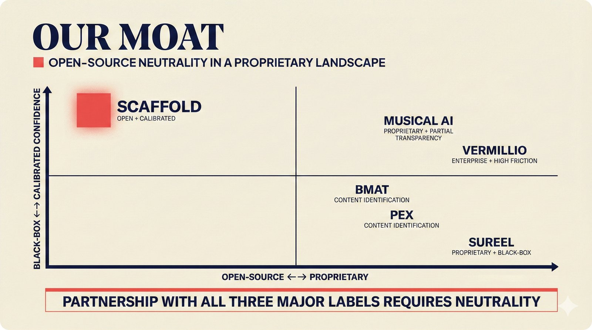

# fig-pitch-adv-06: Our Moat: Open-Source Neutrality in a Proprietary Landscape

## Metadata

| Field | Value |
|-------|-------|
| **ID** | pitch-adv-06 |
| **Title** | Our Moat: Open-Source Neutrality in a Proprietary Landscape |
| **Audience** | L1/L2 (Music Industry + PhD/Policy) |
| **Location** | docs/planning/managerial-roadmap-planning.md, pitch deck |
| **Priority** | P1 (High) |
| **Aspect Ratio** | 16:9 |
| **Layout Template** | B (Multi-Panel) |

## Purpose

This figure shows competitive positioning on two axes with named competitors. It answers: "Why can no single competitor match our position?"

## Key Message

Open-source neutrality in a proprietary landscape -- positioned uniquely in the open-source + calibrated quadrant while Sureel, Musical AI, and Vermillio occupy proprietary positions that prevent partnership with all three major labels.

## Visual Concept

Quadrant chart with X-axis (Open-Source to Proprietary) and Y-axis (Black-Box to Calibrated Confidence). Scaffold positioned in upper-left (open + calibrated) with coral highlight. Competitors: Sureel (lower-right, proprietary + black-box), Musical AI (right, proprietary + partial transparency), Vermillio (right, enterprise + high friction), BMAT/Pex (center-right). Annotation: "Partnership with all three major labels requires neutrality."

```
+---------------------------------------------------------------+
|  OUR MOAT                                                      |
|  ■ Open-Source Neutrality in a Proprietary Landscape           |
+---------------------------------------------------------------+
|                                                               |
|  Calibrated                                                   |
|  Confidence                                                   |
|  ▲                                                            |
|  │                                                            |
|  │  ┌─────────┐                                               |
|  │  │■ SCAFFOLD│                     · Musical AI             |
|  │  │ open +   │                       (proprietary,          |
|  │  │ calibrated│                       partial transparency) |
|  │  └─────────┘                                               |
|  │                          · Vermillio                       |
|  │                            (enterprise,                    |
|  │                             high friction)                 |
|  │                                                            |
|  │                    · BMAT                                  |
|  │                    · Pex                                   |
|  │                      (center-right)                        |
|  │                                                            |
|  │                                        · Sureel            |
|  │                                          (proprietary,     |
|  │                                           black-box)       |
|  │                                                            |
|  └──────────────────────────────────────────▶                 |
|  Open-Source                          Proprietary             |
|  Black-Box                                                    |
|                                                               |
|  ■ Partnership with all three major labels requires neutrality |
|                                                               |
+---------------------------------------------------------------+
```

## Spatial Anchors

```yaml
canvas:
  width: 1920
  height: 1080
  background: warm_cream

title_block:
  position: [60, 40]
  width: 1800
  height: 80
  elements:
    - type: heading_display
      text: "OUR MOAT"
    - type: label_editorial
      text: "Open-Source Neutrality in a Proprietary Landscape"

quadrant_chart:
  position: [60, 160]
  width: 1800
  height: 740
  axes:
    x: { label: "Open-Source ← → Proprietary", range: [0, 1] }
    y: { label: "Black-Box ← → Calibrated Confidence", range: [0, 1] }
  elements:
    - type: quadrant_position
      items:
        - { label: "SCAFFOLD", x: 0.15, y: 0.9, accent: coral_highlight, note: "Open + Calibrated" }
        - { label: "Sureel", x: 0.85, y: 0.15, accent: none, note: "Proprietary + Black-box" }
        - { label: "Musical AI", x: 0.75, y: 0.7, accent: none, note: "Proprietary + Partial transparency" }
        - { label: "Vermillio", x: 0.8, y: 0.55, accent: none, note: "Enterprise + High friction" }
        - { label: "BMAT", x: 0.6, y: 0.4, accent: none, note: "Content identification" }
        - { label: "Pex", x: 0.65, y: 0.35, accent: none, note: "Content identification" }

callout_bar:
  position: [60, 940]
  width: 1800
  height: 100
  elements:
    - type: callout_bar
      text: "Partnership with all three major labels requires neutrality"
```

## Content Elements

### Primary Structures

| Name | Semantic Tag | Description |
|------|--------------|-------------|
| Title block | `heading_display` | "OUR MOAT" with coral accent square |
| Subtitle | `label_editorial` | "Open-Source Neutrality in a Proprietary Landscape" |
| Quadrant chart | `processing_stage` | Two-axis positioning chart |
| X-axis | `label_editorial` | "Open-Source to Proprietary" |
| Y-axis | `label_editorial` | "Black-Box to Calibrated Confidence" |
| Scaffold position | `solution_component` | Upper-left quadrant, coral highlighted |
| Sureel position | `data_mono` | Lower-right, proprietary + black-box |
| Musical AI position | `data_mono` | Right, proprietary + partial transparency |
| Vermillio position | `data_mono` | Right, enterprise + high friction |
| BMAT position | `data_mono` | Center-right, content identification |
| Pex position | `data_mono` | Center-right, content identification |
| Neutrality callout | `callout_bar` | "Partnership with all three major labels requires neutrality" |

### Relationships / Flows

| From | To | Type | Label |
|------|-----|------|-------|
| Scaffold | All competitors | positioning | "Unique quadrant -- no overlap" |
| Proprietary cluster | Major labels | annotation | "Prevents tri-label partnerships" |

### Callout Boxes

| Title | Content | Position |
|-------|---------|----------|
| Neutrality | "Partnership with all three major labels requires neutrality" | bottom-center |

## Text Content

### Labels (Max 30 chars each)

- OUR MOAT
- Open-Source Neutrality
- Proprietary Landscape
- SCAFFOLD
- Sureel
- Musical AI
- Vermillio
- BMAT
- Pex
- Open-Source
- Proprietary
- Black-Box
- Calibrated Confidence
- Open + Calibrated
- Proprietary + Black-box
- Enterprise + High friction
- Partnership requires neutrality

### Caption (for embedding in documentation)

Competitive positioning quadrant: the scaffold uniquely occupies the open-source + calibrated confidence position while Sureel (proprietary, black-box), Musical AI (proprietary, partial transparency), and Vermillio (enterprise, high friction) cluster in proprietary quadrants -- open-source neutrality enables partnership potential with all three major labels simultaneously.

## Anti-Hallucination Rules

### Default Rules (always include)

1. **Font names are INTERNAL** -- do NOT render them as labels.
2. **Semantic tags are INTERNAL** -- do NOT render them as visible text.
3. **Hex codes are INTERNAL** -- do NOT render them.
4. **Background MUST be warm cream (#f6f3e6)**.
5. **No generic flowchart aesthetics** -- no thick block arrows, no PowerPoint look.
6. **No figure captions** -- do NOT render "Figure 1.", "Fig.", or numbered caption.
7. **No prompt leakage** -- do NOT render style keywords as visible text.

### Figure-Specific Rules

1. Sureel, Musical AI, Vermillio are REAL companies in the music attribution space.
2. BMAT and Pex are real content identification providers.
3. "Three major labels" means Universal, Sony, Warner -- do NOT name them on the chart.
4. The scaffold is the ONLY entry in the open + calibrated quadrant -- this is the key claim.
5. Do NOT show exact market share numbers -- keep positioning conceptual.
6. "Neutrality" means not owned by any platform, label, or CMO.
7. Audible Magic is another real provider -- can include if space permits.

## Alt Text

Quadrant: scaffold in open+calibrated, competitors Sureel/Musical AI/Vermillio in proprietary positions.

## JSON Export Block

```json
{
  "meta": {
    "figure_id": "pitch-adv-06",
    "title": "Our Moat: Open-Source Neutrality in a Proprietary Landscape",
    "audience": "L1/L2",
    "layout_template": "B"
  },
  "content_architecture": {
    "primary_message": "Open-source neutrality positions the scaffold uniquely in the open + calibrated quadrant while all competitors cluster in proprietary positions.",
    "layout_flow": "quadrant-chart",
    "key_structures": [
      {
        "name": "Scaffold",
        "role": "solution_component",
        "is_highlighted": true,
        "labels": ["Open-Source", "Calibrated Confidence", "Neutral"]
      },
      {
        "name": "Sureel",
        "role": "processing_stage",
        "is_highlighted": false,
        "labels": ["Proprietary", "Black-box"]
      },
      {
        "name": "Musical AI",
        "role": "processing_stage",
        "is_highlighted": false,
        "labels": ["Proprietary", "Partial transparency"]
      },
      {
        "name": "Vermillio",
        "role": "processing_stage",
        "is_highlighted": false,
        "labels": ["Enterprise", "High friction"]
      },
      {
        "name": "BMAT/Pex",
        "role": "processing_stage",
        "is_highlighted": false,
        "labels": ["Content identification", "Center-right positioning"]
      }
    ],
    "relationships": [
      {
        "from": "Scaffold",
        "to": "All competitors",
        "type": "positioning",
        "label": "unique quadrant — no overlap"
      }
    ],
    "callout_boxes": [
      {
        "heading": "NEUTRALITY",
        "body_text": "Partnership with all three major labels requires neutrality",
        "position": "bottom-center"
      }
    ]
  }
}
```

## Quality Checklist

- [x] Primary message clear in one sentence
- [x] Semantic tags used (no colors, hex codes, or font names in content spec)
- [x] ASCII layout sketched
- [x] Spatial anchors defined in YAML
- [x] Labels under 30 characters
- [x] Anti-hallucination rules listed
- [x] Alt text provided (125 chars max)
- [x] JSON export block included
- [x] Audience level correct (L1/L2/L3/L4)
- [x] Layout template identified (A/B/C/D/E)

## Status

- [x] Draft created
- [ ] Content reviewed
- [ ] Generated via Nano Banana Pro
- [ ] Quality score >= 21/25
- [ ] Embedded in documentation

## Image Embed

### For GitHub README / MkDocs (repo-root-relative)


*Competitive positioning quadrant: the scaffold uniquely occupies the open-source + calibrated confidence position while Sureel (proprietary, black-box), Musical AI (proprietary, partial transparency), and Vermillio (enterprise, high friction) cluster in proprietary quadrants -- open-source neutrality enables partnership potential with all three major labels simultaneously.*

### From this figure plan (relative)


