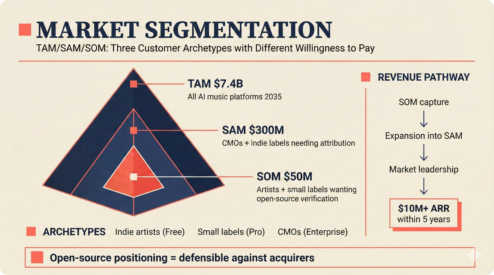

# fig-pitch-adv-07: TAM/SAM/SOM: Three Customer Archetypes with Different Willingness to Pay

## Metadata

| Field | Value |
|-------|-------|
| **ID** | pitch-adv-07 |
| **Title** | TAM/SAM/SOM: Three Customer Archetypes with Different Willingness to Pay |
| **Audience** | L1 (Music Industry / Investors) |
| **Location** | docs/planning/managerial-roadmap-planning.md, pitch deck |
| **Priority** | P1 (High) |
| **Aspect Ratio** | 16:9 |
| **Layout Template** | A (Hero) |

## Purpose

This figure shows market segmentation as TAM/SAM/SOM pyramid with revenue model per segment. It answers: "How big is the addressable market and what's the path to $10M+ ARR?"

## Key Message

TAM $7.4B (all AI music platforms by 2035), SAM $300M (CMOs + indie labels needing attribution), SOM $50M (artists + small labels wanting open-source verification) -- clear path to $10M+ ARR within 5 years.

## Visual Concept

An inverted pyramid or nested circles showing TAM, SAM, and SOM. Each level is annotated with a dollar amount, customer archetype, and revenue model. The right side shows a revenue pathway: SOM capture, expansion, and market leadership. A bottom callout reads: "Open-source positioning = defensible against acquirers."

```
+---------------------------------------------------------------+
|  MARKET SEGMENTATION                                           |
|  ■ TAM/SAM/SOM: Three Customer Archetypes                     |
+---------------------------------------------------------------+
|                                                                |
|         ┌─────────────────────────────────┐                    |
|         │         TAM  $7.4B              │   REVENUE PATHWAY  |
|         │   All AI music platforms 2035   │                    |
|         │                                 │   SOM capture      |
|         │   ┌─────────────────────┐       │     ↓              |
|         │   │     SAM  $300M      │       │   Expansion        |
|         │   │  CMOs + indie labels│       │     ↓              |
|         │   │                     │       │   Market leadership |
|         │   │  ┌─────────────┐    │       │                    |
|         │   │  │ SOM  $50M   │    │       │   → $10M+ ARR      |
|         │   │  │ Artists +   │    │       │     within 5 yrs   |
|         │   │  │ small labels│    │       │                    |
|         │   │  └─────────────┘    │       │                    |
|         │   └─────────────────────┘       │                    |
|         └─────────────────────────────────┘                    |
|                                                                |
|   ARCHETYPES:                                                  |
|   ■ Indie artists (Free)                                       |
|   ■ Small labels (Pro)                                         |
|   ■ CMOs (Enterprise)                                          |
|                                                                |
+---------------------------------------------------------------+
|  ■ "Open-source positioning = defensible against acquirers"    |
+---------------------------------------------------------------+
```

## Spatial Anchors

```yaml
canvas:
  width: 1920
  height: 1080
  background: warm_cream

title_block:
  position: [60, 40]
  width: 1800
  height: 80
  elements:
    - type: heading_display
      text: "MARKET SEGMENTATION"
    - type: label_editorial
      text: "TAM/SAM/SOM: Three Customer Archetypes with Different Willingness to Pay"

pyramid_block:
  position: [120, 160]
  width: 1000
  height: 680
  elements:
    - type: nested_shape
      id: tam
      label: "TAM $7.4B"
      sublabel: "All AI music platforms by 2035"
      position: outer
    - type: nested_shape
      id: sam
      label: "SAM $300M"
      sublabel: "CMOs + indie labels needing attribution"
      position: middle
    - type: nested_shape
      id: som
      label: "SOM $50M"
      sublabel: "Artists + small labels wanting open-source verification"
      position: inner

revenue_pathway:
  position: [1200, 160]
  width: 600
  height: 400
  elements:
    - type: label_editorial
      text: "REVENUE PATHWAY"
    - type: flow_step
      steps:
        - "SOM capture"
        - "Expansion into SAM"
        - "Market leadership"
        - "$10M+ ARR within 5 years"

archetypes_block:
  position: [120, 720]
  width: 1000
  height: 140
  elements:
    - type: label_editorial
      text: "ARCHETYPES"
    - type: list_item
      items:
        - "Indie artists (Free)"
        - "Small labels (Pro)"
        - "CMOs (Enterprise)"

callout_bar:
  position: [60, 900]
  width: 1800
  height: 120
  elements:
    - type: callout_bar
      text: "Open-source positioning = defensible against acquirers"
```

## Content Elements

### Primary Structures

| Name | Semantic Tag | Description |
|------|--------------|-------------|
| Title block | `heading_display` | "MARKET SEGMENTATION" with coral accent square |
| Subtitle | `label_editorial` | "TAM/SAM/SOM: Three Customer Archetypes with Different Willingness to Pay" |
| Nested pyramid | `processing_stage` | Three concentric shapes for TAM/SAM/SOM with dollar amounts |
| TAM layer | `deferred_option` | Outermost shape: $7.4B, all AI music platforms by 2035 |
| SAM layer | `deferred_option` | Middle shape: $300M, CMOs + indie labels |
| SOM layer | `selected_option` | Innermost shape (highlighted): $50M, artists + small labels |
| Revenue pathway | `processing_stage` | Right-side vertical flow from SOM capture to $10M+ ARR |
| Archetypes list | `label_editorial` | Three customer archetypes with tier labels |
| Callout bar | `callout_bar` | Bottom insight statement |

### Relationships / Flows

| From | To | Type | Label |
|------|-----|------|-------|
| SOM | SAM | expansion | "Grow into adjacent segment" |
| SAM | TAM | expansion | "Market leadership" |
| SOM | Revenue pathway | emphasis | "Starting point for capture" |

### Callout Boxes

| Title | Content | Position |
|-------|---------|----------|
| Defensibility | "Open-source positioning = defensible against acquirers" | bottom-center |

## Text Content

### Labels (Max 30 chars each)

- MARKET SEGMENTATION
- TAM $7.4B
- SAM $300M
- SOM $50M
- All AI music platforms 2035
- CMOs + indie labels
- Artists + small labels
- REVENUE PATHWAY
- SOM capture
- Expansion
- Market leadership
- $10M+ ARR within 5 years
- ARCHETYPES
- Indie artists (Free)
- Small labels (Pro)
- CMOs (Enterprise)

### Caption (for embedding in documentation)

TAM/SAM/SOM market segmentation: total addressable market of $7.4B across all AI music platforms by 2035, serviceable addressable market of $300M for CMOs and indie labels needing attribution infrastructure, and serviceable obtainable market of $50M for artists and small labels -- with clear revenue model per segment and path to $10M+ ARR.

## Anti-Hallucination Rules

### Default Rules (always include)

1. **Font names are INTERNAL** -- do NOT render them as labels.
2. **Semantic tags are INTERNAL** -- do NOT render them as visible text.
3. **Hex codes are INTERNAL** -- do NOT render them.
4. **Background MUST be warm cream (#f6f3e6)**.
5. **No generic flowchart aesthetics** -- no thick block arrows, no PowerPoint look.
6. **No figure captions** -- do NOT render "Figure 1.", "Fig.", or numbered caption.
7. **No prompt leakage** -- do NOT render style keywords as visible text.

### Figure-Specific Rules

1. TAM $7.4B is from Goldman Sachs / industry projections for generative music by 2035.
2. SAM $300M and SOM $50M are ESTIMATES -- do NOT present as fact.
3. "CMOs" means Collective Management Organizations -- NOT Chief Marketing Officers.
4. Three customer archetypes: indie artists (Free), small labels (Pro), CMOs (Enterprise).
5. "$10M+ ARR" is aspirational within 5 years -- not a guarantee.
6. Do NOT include AI companies (OpenAI, Google) as customer segments -- they are platform partners.
7. Open-source positioning makes acquisition less likely -- this is intentional.

## Alt Text

Market pyramid: TAM $7.4B, SAM $300M, SOM $50M with revenue model per segment.

## JSON Export Block

```json
{
  "meta": {
    "figure_id": "pitch-adv-07",
    "title": "TAM/SAM/SOM: Three Customer Archetypes with Different Willingness to Pay",
    "audience": "L1",
    "layout_template": "A"
  },
  "content_architecture": {
    "primary_message": "TAM $7.4B, SAM $300M, SOM $50M -- clear path to $10M+ ARR within 5 years.",
    "layout_flow": "left-to-right",
    "key_structures": [
      {
        "name": "TAM Layer",
        "role": "deferred_option",
        "is_highlighted": false,
        "labels": ["TAM $7.4B", "All AI music platforms by 2035"]
      },
      {
        "name": "SAM Layer",
        "role": "deferred_option",
        "is_highlighted": false,
        "labels": ["SAM $300M", "CMOs + indie labels needing attribution"]
      },
      {
        "name": "SOM Layer",
        "role": "selected_option",
        "is_highlighted": true,
        "labels": ["SOM $50M", "Artists + small labels"]
      },
      {
        "name": "Revenue Pathway",
        "role": "processing_stage",
        "is_highlighted": false,
        "labels": ["SOM capture", "Expansion", "Market leadership", "$10M+ ARR"]
      }
    ],
    "relationships": [
      {
        "from": "SOM",
        "to": "SAM",
        "type": "solid",
        "label": "expansion into adjacent segment"
      },
      {
        "from": "SAM",
        "to": "TAM",
        "type": "solid",
        "label": "market leadership"
      }
    ],
    "callout_boxes": [
      {
        "heading": "DEFENSIBILITY",
        "body_text": "Open-source positioning = defensible against acquirers",
        "position": "bottom-center"
      }
    ]
  }
}
```

## Quality Checklist

- [x] Primary message clear in one sentence
- [x] Semantic tags used (no colors, hex codes, or font names in content spec)
- [x] ASCII layout sketched
- [x] Spatial anchors defined in YAML
- [x] Labels under 30 characters
- [x] Anti-hallucination rules listed
- [x] Alt text provided (125 chars max)
- [x] JSON export block included
- [x] Audience level correct (L1/L2/L3/L4)
- [x] Layout template identified (A/B/C/D/E)

## Status

- [x] Draft created
- [ ] Content reviewed
- [ ] Generated via Nano Banana Pro
- [ ] Quality score >= 21/25
- [ ] Embedded in documentation

## Image Embed

### For GitHub README / MkDocs (repo-root-relative)


*TAM/SAM/SOM market segmentation: total addressable market of $7.4B across all AI music platforms by 2035, serviceable addressable market of $300M for CMOs and indie labels needing attribution infrastructure, and serviceable obtainable market of $50M for artists and small labels -- with clear revenue model per segment and path to $10M+ ARR.*

### From this figure plan (relative)


