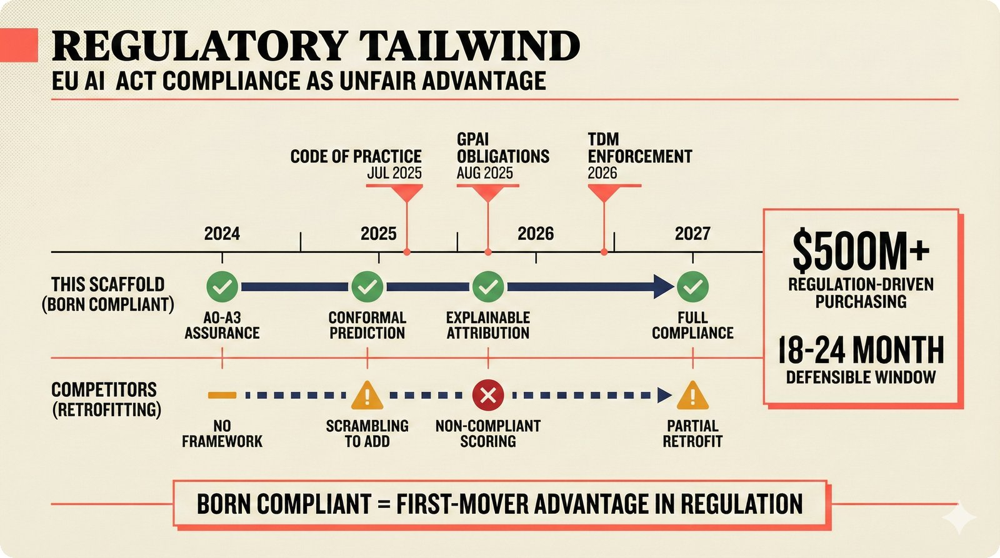

# fig-pitch-adv-08: Regulatory Tailwind: EU AI Act Compliance as Unfair Advantage

## Metadata

| Field | Value |
|-------|-------|
| **ID** | pitch-adv-08 |
| **Title** | Regulatory Tailwind: EU AI Act Compliance as Unfair Advantage |
| **Audience** | L1/L2 (Music Industry + PhD/Policy) |
| **Location** | docs/planning/managerial-roadmap-planning.md, pitch deck |
| **Priority** | P1 (High) |
| **Aspect Ratio** | 16:9 |
| **Layout Template** | C (Flowchart) |

## Purpose

This figure shows how EU AI Act creates mandatory demand and we're "born compliant." It answers: "Why does regulation help rather than hinder us?"

## Key Message

EU AI Act deadlines (GPAI obligations Aug 2025, TDM enforcement 2026) require explainability and confidence scoring -- A0-A3 assurance levels + conformal prediction = native compliance while competitors scramble to retrofit.

## Visual Concept

A timeline from 2024 to 2027 with EU AI Act milestones above and compliance status below. Our scaffold is shown as "born compliant" (green checkmarks at each milestone). Competitors are shown as "retrofitting" (amber/red at each milestone). A right panel shows "$500M+ regulation-driven purchasing" and "18-24 month defensible window."

```
+---------------------------------------------------------------+
|  REGULATORY TAILWIND                                           |
|  ■ EU AI Act Compliance as Unfair Advantage                    |
+---------------------------------------------------------------+
|                                                                |
|  EU AI ACT TIMELINE                                            |
|                                                                |
|  2024         2025           2026           2027               |
|  ─┬────────────┬─────────────┬──────────────┬──                |
|   │            │             │              │                  |
|   │       Code of     GPAI         TDM                        |
|   │       Practice    Obligations  Enforcement                 |
|   │       Jul 2025    Aug 2025     2026                        |
|                                                                |
|  THIS SCAFFOLD (born compliant):                               |
|   ✓            ✓             ✓              ✓                  |
|   A0-A3        Conformal     Explainable    Full               |
|   assurance    prediction    attribution    compliance         |
|                                                                |
|  COMPETITORS (retrofitting):                                   |
|   ─            ⚠             ✗              ⚠                  |
|   No           Scrambling    Non-compliant  Partial            |
|   framework    to add        scoring        retrofit           |
|                                                                |
|  ┌──────────────────────────────┐                              |
|  │  $500M+ regulation-driven    │                              |
|  │  purchasing                  │                              |
|  │  18-24 month defensible      │                              |
|  │  window                      │                              |
|  └──────────────────────────────┘                              |
|                                                                |
+---------------------------------------------------------------+
|  ■ "Born compliant = first-mover advantage in regulation"      |
+---------------------------------------------------------------+
```

## Spatial Anchors

```yaml
canvas:
  width: 1920
  height: 1080
  background: warm_cream

title_block:
  position: [60, 40]
  width: 1800
  height: 80
  elements:
    - type: heading_display
      text: "REGULATORY TAILWIND"
    - type: label_editorial
      text: "EU AI Act Compliance as Unfair Advantage"

timeline:
  position: [120, 160]
  width: 1200
  height: 100
  elements:
    - type: timeline_axis
      start: "2024"
      end: "2027"
    - type: milestone
      milestones:
        - { date: "Jul 2025", label: "Code of Practice" }
        - { date: "Aug 2025", label: "GPAI Obligations" }
        - { date: "2026", label: "TDM Enforcement" }

scaffold_track:
  position: [120, 300]
  width: 1200
  height: 160
  elements:
    - type: label_editorial
      text: "THIS SCAFFOLD (born compliant)"
    - type: status_row
      statuses:
        - { milestone: "2024", status: "pass", label: "A0-A3 assurance" }
        - { milestone: "Jul 2025", status: "pass", label: "Conformal prediction" }
        - { milestone: "Aug 2025", status: "pass", label: "Explainable attribution" }
        - { milestone: "2027", status: "pass", label: "Full compliance" }

competitor_track:
  position: [120, 500]
  width: 1200
  height: 160
  elements:
    - type: label_editorial
      text: "COMPETITORS (retrofitting)"
    - type: status_row
      statuses:
        - { milestone: "2024", status: "neutral", label: "No framework" }
        - { milestone: "Jul 2025", status: "warning", label: "Scrambling to add" }
        - { milestone: "Aug 2025", status: "fail", label: "Non-compliant scoring" }
        - { milestone: "2027", status: "warning", label: "Partial retrofit" }

advantage_panel:
  position: [1400, 300]
  width: 440
  height: 360
  elements:
    - type: callout_box
      items:
        - "$500M+ regulation-driven purchasing"
        - "18-24 month defensible window"

callout_bar:
  position: [60, 900]
  width: 1800
  height: 120
  elements:
    - type: callout_bar
      text: "Born compliant = first-mover advantage in regulation"
```

## Content Elements

### Primary Structures

| Name | Semantic Tag | Description |
|------|--------------|-------------|
| Title block | `heading_display` | "REGULATORY TAILWIND" with coral accent square |
| Subtitle | `label_editorial` | "EU AI Act Compliance as Unfair Advantage" |
| Timeline axis | `processing_stage` | Horizontal timeline from 2024 to 2027 |
| EU AI Act milestones | `label_editorial` | Key regulatory dates above timeline |
| Scaffold compliance track | `selected_option` | Green checkmarks at each milestone |
| Competitor retrofit track | `deferred_option` | Amber/red status at each milestone |
| Advantage panel | `callout_box` | Right panel with market size and window |
| Callout bar | `callout_bar` | Bottom insight statement |

### Relationships / Flows

| From | To | Type | Label |
|------|-----|------|-------|
| EU AI Act milestones | Scaffold track | compliance | "Native compliance at each date" |
| EU AI Act milestones | Competitor track | contrast | "Retrofitting at each date" |
| Scaffold track | Advantage panel | emphasis | "Born compliant = defensible window" |

### Callout Boxes

| Title | Content | Position |
|-------|---------|----------|
| Market Opportunity | "$500M+ regulation-driven purchasing, 18-24 month defensible window" | right-panel |
| Born Compliant | "Born compliant = first-mover advantage in regulation" | bottom-center |

## Text Content

### Labels (Max 30 chars each)

- REGULATORY TAILWIND
- EU AI Act Timeline
- Code of Practice Jul 2025
- GPAI Obligations Aug 2025
- TDM Enforcement 2026
- THIS SCAFFOLD
- Born compliant
- COMPETITORS
- Retrofitting
- A0-A3 assurance
- Conformal prediction
- Explainable attribution
- Full compliance
- No framework
- Scrambling to add
- Non-compliant scoring
- Partial retrofit
- $500M+ purchasing
- 18-24 month window

### Caption (for embedding in documentation)

EU AI Act as unfair advantage: GPAI obligations (Aug 2025) and TDM enforcement (2026) require explainability and confidence scoring -- our A0-A3 assurance levels and conformal prediction provide native compliance while competitors scramble to retrofit, creating an estimated 18-24 month defensible window in $500M+ regulation-driven purchasing.

## Anti-Hallucination Rules

### Default Rules (always include)

1. **Font names are INTERNAL** -- do NOT render them as labels.
2. **Semantic tags are INTERNAL** -- do NOT render them as visible text.
3. **Hex codes are INTERNAL** -- do NOT render them.
4. **Background MUST be warm cream (#f6f3e6)**.
5. **No generic flowchart aesthetics** -- no thick block arrows, no PowerPoint look.
6. **No figure captions** -- do NOT render "Figure 1.", "Fig.", or numbered caption.
7. **No prompt leakage** -- do NOT render style keywords as visible text.

### Figure-Specific Rules

1. EU AI Act dates: Code of Practice Jul 2025, GPAI obligations Aug 2025 -- EXACT.
2. "GPAI" = General Purpose AI -- do NOT expand differently.
3. "TDM" = Text and Data Mining from EU DSM Directive.
4. "$500M+" is an ESTIMATE of regulation-driven purchasing -- not verified.
5. "18-24 month window" is before competitors can catch up -- this is a strategic assessment, not guaranteed.
6. Do NOT name specific competitor retrofit timelines.
7. "Born compliant" means designed with regulation in mind from day one.
8. Do NOT include non-EU regulations (US Copyright Office, DMCA).

## Alt Text

EU AI Act timeline: scaffold born-compliant while competitors retrofit at each regulatory milestone.

## JSON Export Block

```json
{
  "meta": {
    "figure_id": "pitch-adv-08",
    "title": "Regulatory Tailwind: EU AI Act Compliance as Unfair Advantage",
    "audience": "L1/L2",
    "layout_template": "C"
  },
  "content_architecture": {
    "primary_message": "EU AI Act deadlines require explainability and confidence scoring -- A0-A3 + conformal prediction = native compliance while competitors retrofit.",
    "layout_flow": "left-to-right",
    "key_structures": [
      {
        "name": "Timeline Axis",
        "role": "processing_stage",
        "is_highlighted": false,
        "labels": ["2024", "Jul 2025", "Aug 2025", "2026", "2027"]
      },
      {
        "name": "EU AI Act Milestones",
        "role": "label_editorial",
        "is_highlighted": false,
        "labels": ["Code of Practice", "GPAI Obligations", "TDM Enforcement"]
      },
      {
        "name": "Scaffold Compliance Track",
        "role": "selected_option",
        "is_highlighted": true,
        "labels": ["A0-A3 assurance", "Conformal prediction", "Explainable attribution", "Full compliance"]
      },
      {
        "name": "Competitor Retrofit Track",
        "role": "deferred_option",
        "is_highlighted": false,
        "labels": ["No framework", "Scrambling", "Non-compliant", "Partial retrofit"]
      },
      {
        "name": "Advantage Panel",
        "role": "callout_box",
        "is_highlighted": true,
        "labels": ["$500M+ purchasing", "18-24 month window"]
      }
    ],
    "relationships": [
      {
        "from": "EU AI Act milestones",
        "to": "Scaffold track",
        "type": "solid",
        "label": "native compliance at each date"
      },
      {
        "from": "EU AI Act milestones",
        "to": "Competitor track",
        "type": "dashed",
        "label": "retrofitting at each date"
      }
    ],
    "callout_boxes": [
      {
        "heading": "MARKET OPPORTUNITY",
        "body_text": "$500M+ regulation-driven purchasing, 18-24 month defensible window",
        "position": "right-panel"
      },
      {
        "heading": "BORN COMPLIANT",
        "body_text": "Born compliant = first-mover advantage in regulation",
        "position": "bottom-center"
      }
    ]
  }
}
```

## Quality Checklist

- [x] Primary message clear in one sentence
- [x] Semantic tags used (no colors, hex codes, or font names in content spec)
- [x] ASCII layout sketched
- [x] Spatial anchors defined in YAML
- [x] Labels under 30 characters
- [x] Anti-hallucination rules listed
- [x] Alt text provided (125 chars max)
- [x] JSON export block included
- [x] Audience level correct (L1/L2/L3/L4)
- [x] Layout template identified (A/B/C/D/E)

## Status

- [x] Draft created
- [ ] Content reviewed
- [ ] Generated via Nano Banana Pro
- [ ] Quality score >= 21/25
- [ ] Embedded in documentation

## Image Embed

### For GitHub README / MkDocs (repo-root-relative)


*EU AI Act as unfair advantage: GPAI obligations (Aug 2025) and TDM enforcement (2026) require explainability and confidence scoring -- our A0-A3 assurance levels and conformal prediction provide native compliance while competitors scramble to retrofit, creating an estimated 18-24 month defensible window in $500M+ regulation-driven purchasing.*

### From this figure plan (relative)


