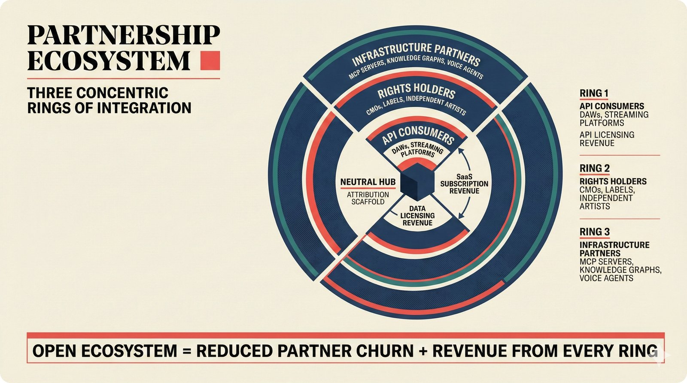

# fig-pitch-adv-09: Strategic Partnerships: Three Concentric Rings of Integration

## Metadata

| Field | Value |
|-------|-------|
| **ID** | pitch-adv-09 |
| **Title** | Strategic Partnerships: Three Concentric Rings of Integration |
| **Audience** | L1/L2 (Music Industry + PhD/Policy) |
| **Location** | docs/planning/managerial-roadmap-planning.md, pitch deck |
| **Priority** | P1 (High) |
| **Aspect Ratio** | 16:9 |
| **Layout Template** | B (Multi-Panel) |

## Purpose

This figure shows the partnership ecosystem as three concentric rings with revenue streams from each. It answers: "How does the platform create value for different partner types?"

## Key Message

Three concentric rings -- API consumers (DAWs, streaming), rights holders (CMOs, labels, artists), infrastructure partners (MCP servers, knowledge graphs) -- with revenue from all rings and open ecosystem reducing churn.

## Visual Concept

Three concentric rings centered on the scaffold. Ring 1 (inner): API consumers -- DAWs, streaming platforms. Ring 2 (middle): Rights holders -- CMOs, labels, independent artists. Ring 3 (outer): Infrastructure partners -- MCP servers, knowledge graphs, voice agents. Each ring is annotated with its revenue stream type. The center shows "Neutral Hub" with the scaffold.

```
+---------------------------------------------------------------+
|  PARTNERSHIP ECOSYSTEM                                         |
|  ■ Three Concentric Rings of Integration                       |
+---------------------------------------------------------------+
|                                                                |
|              ┌─────────────────────────────┐                   |
|              │  RING 3: INFRASTRUCTURE      │                  |
|              │  MCP servers, knowledge      │                  |
|              │  graphs, voice agents        │                  |
|              │  Revenue: data licensing     │                  |
|              │                              │                  |
|              │  ┌───────────────────────┐   │                  |
|              │  │  RING 2: RIGHTS       │   │                  |
|              │  │  CMOs, labels,        │   │                  |
|              │  │  independent artists  │   │                  |
|              │  │  Revenue: SaaS subs   │   │                  |
|              │  │                       │   │                  |
|              │  │  ┌─────────────────┐  │   │                  |
|              │  │  │ RING 1: API     │  │   │                  |
|              │  │  │ DAWs, streaming │  │   │                  |
|              │  │  │ Revenue: API    │  │   │                  |
|              │  │  │ licensing       │  │   │                  |
|              │  │  │                 │  │   │                  |
|              │  │  │  ┌───────────┐  │  │   │                  |
|              │  │  │  │  NEUTRAL  │  │  │   │                  |
|              │  │  │  │   HUB     │  │  │   │                  |
|              │  │  │  │ Scaffold  │  │  │   │                  |
|              │  │  │  └───────────┘  │  │   │                  |
|              │  │  └─────────────────┘  │   │                  |
|              │  └───────────────────────┘   │                  |
|              └─────────────────────────────┘                   |
|                                                                |
+---------------------------------------------------------------+
|  ■ "Open ecosystem = reduced partner churn + revenue from      |
|     every ring"                                                |
+---------------------------------------------------------------+
```

## Spatial Anchors

```yaml
canvas:
  width: 1920
  height: 1080
  background: warm_cream

title_block:
  position: [60, 40]
  width: 1800
  height: 80
  elements:
    - type: heading_display
      text: "PARTNERSHIP ECOSYSTEM"
    - type: label_editorial
      text: "Three Concentric Rings of Integration"

concentric_rings:
  position: [360, 160]
  width: 800
  height: 700
  elements:
    - type: ring
      id: ring_3_outer
      label: "INFRASTRUCTURE PARTNERS"
      sublabel: "MCP servers, knowledge graphs, voice agents"
      revenue: "Data licensing"
    - type: ring
      id: ring_2_middle
      label: "RIGHTS HOLDERS"
      sublabel: "CMOs, labels, independent artists"
      revenue: "SaaS subscriptions"
    - type: ring
      id: ring_1_inner
      label: "API CONSUMERS"
      sublabel: "DAWs, streaming platforms"
      revenue: "API licensing"
    - type: center
      id: hub
      label: "NEUTRAL HUB"
      sublabel: "Attribution Scaffold"

ring_annotations:
  position: [1200, 160]
  width: 660
  height: 700
  elements:
    - type: annotation_list
      items:
        - { ring: "Ring 1", partners: "DAWs, streaming platforms", revenue: "API licensing" }
        - { ring: "Ring 2", partners: "CMOs, labels, artists", revenue: "SaaS subscriptions" }
        - { ring: "Ring 3", partners: "MCP servers, KGs, voice agents", revenue: "Data licensing" }

callout_bar:
  position: [60, 900]
  width: 1800
  height: 120
  elements:
    - type: callout_bar
      text: "Open ecosystem = reduced partner churn + revenue from every ring"
```

## Content Elements

### Primary Structures

| Name | Semantic Tag | Description |
|------|--------------|-------------|
| Title block | `heading_display` | "PARTNERSHIP ECOSYSTEM" with coral accent square |
| Subtitle | `label_editorial` | "Three Concentric Rings of Integration" |
| Ring 3 (outer) | `processing_stage` | Infrastructure partners: MCP servers, knowledge graphs, voice agents |
| Ring 2 (middle) | `processing_stage` | Rights holders: CMOs, labels, independent artists |
| Ring 1 (inner) | `processing_stage` | API consumers: DAWs, streaming platforms |
| Center hub | `selected_option` | Neutral Hub: Attribution Scaffold (highlighted) |
| Ring annotations | `label_editorial` | Revenue stream annotations for each ring |
| Callout bar | `callout_bar` | Bottom insight statement |

### Relationships / Flows

| From | To | Type | Label |
|------|-----|------|-------|
| Ring 1 (API) | Center hub | integration | "API licensing revenue" |
| Ring 2 (Rights) | Center hub | integration | "SaaS subscription revenue" |
| Ring 3 (Infra) | Center hub | integration | "Data licensing revenue" |

### Callout Boxes

| Title | Content | Position |
|-------|---------|----------|
| Open Ecosystem | "Open ecosystem = reduced partner churn + revenue from every ring" | bottom-center |

## Text Content

### Labels (Max 30 chars each)

- PARTNERSHIP ECOSYSTEM
- INFRASTRUCTURE PARTNERS
- RIGHTS HOLDERS
- API CONSUMERS
- NEUTRAL HUB
- Attribution Scaffold
- MCP servers
- Knowledge graphs
- Voice agents
- CMOs
- Labels
- Independent artists
- DAWs
- Streaming platforms
- API licensing
- SaaS subscriptions
- Data licensing

### Caption (for embedding in documentation)

Strategic partnership ecosystem in three concentric rings: inner ring of API consumers (DAWs, streaming platforms), middle ring of rights holders (CMOs, labels, independent artists), and outer ring of infrastructure partners (MCP servers, knowledge graphs, voice agents) -- all centered on the scaffold as neutral hub with revenue streams from every ring and open ecosystem positioning reducing partner churn.

## Anti-Hallucination Rules

### Default Rules (always include)

1. **Font names are INTERNAL** -- do NOT render them as labels.
2. **Semantic tags are INTERNAL** -- do NOT render them as visible text.
3. **Hex codes are INTERNAL** -- do NOT render them.
4. **Background MUST be warm cream (#f6f3e6)**.
5. **No generic flowchart aesthetics** -- no thick block arrows, no PowerPoint look.
6. **No figure captions** -- do NOT render "Figure 1.", "Fig.", or numbered caption.
7. **No prompt leakage** -- do NOT render style keywords as visible text.

### Figure-Specific Rules

1. "DAWs" is generic -- do NOT name Ableton, Logic, FL Studio.
2. "Streaming platforms" is generic -- do NOT name Spotify, YouTube specifically.
3. CMOs include STIM, PRS, SACEM -- can name these as examples.
4. MCP = Model Context Protocol -- do NOT expand differently.
5. The scaffold is at the CENTER (neutral hub) -- not in any ring.
6. Revenue streams differ by ring -- API licensing, SaaS subscriptions, data licensing.
7. "Open ecosystem" means partners can integrate without lock-in.

## Alt Text

Three concentric rings: API consumers, rights holders, infrastructure partners around neutral scaffold hub.

## JSON Export Block

```json
{
  "meta": {
    "figure_id": "pitch-adv-09",
    "title": "Strategic Partnerships: Three Concentric Rings of Integration",
    "audience": "L1/L2",
    "layout_template": "B"
  },
  "content_architecture": {
    "primary_message": "Three concentric rings of partners with revenue from all rings and open ecosystem reducing churn.",
    "layout_flow": "centered",
    "key_structures": [
      {
        "name": "Ring 3 - Infrastructure Partners",
        "role": "processing_stage",
        "is_highlighted": false,
        "labels": ["MCP servers", "Knowledge graphs", "Voice agents", "Data licensing"]
      },
      {
        "name": "Ring 2 - Rights Holders",
        "role": "processing_stage",
        "is_highlighted": false,
        "labels": ["CMOs", "Labels", "Independent artists", "SaaS subscriptions"]
      },
      {
        "name": "Ring 1 - API Consumers",
        "role": "processing_stage",
        "is_highlighted": false,
        "labels": ["DAWs", "Streaming platforms", "API licensing"]
      },
      {
        "name": "Neutral Hub",
        "role": "selected_option",
        "is_highlighted": true,
        "labels": ["Attribution Scaffold", "Neutral Hub"]
      }
    ],
    "relationships": [
      {
        "from": "Ring 1",
        "to": "Center hub",
        "type": "solid",
        "label": "API licensing revenue"
      },
      {
        "from": "Ring 2",
        "to": "Center hub",
        "type": "solid",
        "label": "SaaS subscription revenue"
      },
      {
        "from": "Ring 3",
        "to": "Center hub",
        "type": "solid",
        "label": "data licensing revenue"
      }
    ],
    "callout_boxes": [
      {
        "heading": "OPEN ECOSYSTEM",
        "body_text": "Open ecosystem = reduced partner churn + revenue from every ring",
        "position": "bottom-center"
      }
    ]
  }
}
```

## Quality Checklist

- [x] Primary message clear in one sentence
- [x] Semantic tags used (no colors, hex codes, or font names in content spec)
- [x] ASCII layout sketched
- [x] Spatial anchors defined in YAML
- [x] Labels under 30 characters
- [x] Anti-hallucination rules listed
- [x] Alt text provided (125 chars max)
- [x] JSON export block included
- [x] Audience level correct (L1/L2/L3/L4)
- [x] Layout template identified (A/B/C/D/E)

## Status

- [x] Draft created
- [ ] Content reviewed
- [ ] Generated via Nano Banana Pro
- [ ] Quality score >= 21/25
- [ ] Embedded in documentation

## Image Embed

### For GitHub README / MkDocs (repo-root-relative)


*Strategic partnership ecosystem in three concentric rings: inner ring of API consumers (DAWs, streaming platforms), middle ring of rights holders (CMOs, labels, independent artists), and outer ring of infrastructure partners (MCP servers, knowledge graphs, voice agents) -- all centered on the scaffold as neutral hub with revenue streams from every ring and open ecosystem positioning reducing partner churn.*

### From this figure plan (relative)


