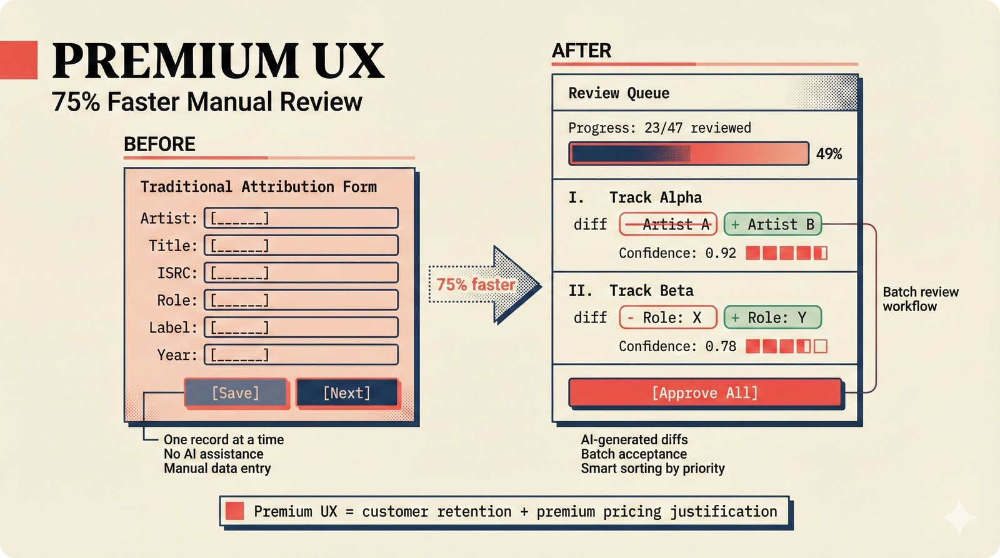

# fig-pitch-adv-10: Premium UX Reduces Attribution Friction: 75% Faster Manual Review

## Metadata

| Field | Value |
|-------|-------|
| **ID** | pitch-adv-10 |
| **Title** | Premium UX Reduces Attribution Friction: 75% Faster Manual Review |
| **Audience** | L1/L2 (Music Industry + PhD/Policy) |
| **Location** | docs/planning/managerial-roadmap-planning.md, pitch deck |
| **Priority** | P1 (High) |
| **Aspect Ratio** | 16:9 |
| **Layout Template** | B (Multi-Panel) |

## Purpose

This figure shows a before/after UX comparison for attribution review. It answers: "Why is your UX a competitive advantage in music tech?"

## Key Message

Batch review queue with AI diffs, "Approve All," progress counter, and smart sorting delivers 75% faster manual review than traditional one-at-a-time forms -- "premium UX first" is uncommon in music tech.

## Visual Concept

A two-panel before/after comparison. Left (Before): Traditional attribution entry form -- long form fields, one record at a time, no AI assistance, manual data entry. Right (After): Our review queue -- AI-generated diffs (highlighted changes), "Approve All" button, progress bar (23/47 reviewed), Roman numeral list items, smart sorting by confidence priority. Bottom callout: "Premium UX = customer retention + premium pricing justification."

```
+---------------------------------------------------------------+
|  PREMIUM UX                                                    |
|  ■ 75% Faster Manual Review                                    |
+---------------------------------------------------------------+
|                                                                |
|  BEFORE                        AFTER                           |
|  ┌──────────────────┐          ┌──────────────────┐            |
|  │  Traditional      │          │  Review Queue     │           |
|  │  Attribution Form │          │                   │           |
|  │                   │          │  Progress: 23/47  │           |
|  │  Artist: [______] │          │  ████████░░░░ 49% │           |
|  │  Title:  [______] │          │                   │           |
|  │  ISRC:   [______] │          │  I.  Track Alpha  │           |
|  │  Role:   [______] │          │      ── Artist A  │           |
|  │  Label:  [______] │          │      +  Artist B  │           |
|  │  Year:   [______] │          │      Confidence:  │           |
|  │                   │          │      0.92 ████    │           |
|  │  [Save] [Next]    │          │                   │           |
|  │                   │          │  II. Track Beta   │           |
|  │  One record at    │          │      ── Role: X   │           |
|  │  a time           │          │      +  Role: Y   │           |
|  │  No AI assist     │          │                   │           |
|  │  Manual entry     │          │  [Approve All]    │           |
|  └──────────────────┘          └──────────────────┘            |
|                                                                |
+---------------------------------------------------------------+
|  ■ "Premium UX = customer retention + premium pricing          |
|     justification"                                             |
+---------------------------------------------------------------+
```

## Spatial Anchors

```yaml
canvas:
  width: 1920
  height: 1080
  background: warm_cream

title_block:
  position: [60, 40]
  width: 1800
  height: 80
  elements:
    - type: heading_display
      text: "PREMIUM UX"
    - type: label_editorial
      text: "75% Faster Manual Review"

before_panel:
  position: [60, 160]
  width: 860
  height: 700
  elements:
    - type: label_editorial
      text: "BEFORE"
    - type: mockup_form
      fields:
        - "Artist: [text input]"
        - "Title: [text input]"
        - "ISRC: [text input]"
        - "Role: [text input]"
        - "Label: [text input]"
        - "Year: [text input]"
      buttons: ["Save", "Next"]
      annotations:
        - "One record at a time"
        - "No AI assistance"
        - "Manual data entry"

after_panel:
  position: [1000, 160]
  width: 860
  height: 700
  elements:
    - type: label_editorial
      text: "AFTER"
    - type: mockup_queue
      progress: "23/47 reviewed"
      items:
        - { numeral: "I", title: "Track Alpha", diff: "- Artist A → + Artist B", confidence: 0.92 }
        - { numeral: "II", title: "Track Beta", diff: "- Role: X → + Role: Y", confidence: 0.78 }
      buttons: ["Approve All"]
      annotations:
        - "AI-generated diffs"
        - "Batch acceptance"
        - "Smart sorting by priority"

callout_bar:
  position: [60, 900]
  width: 1800
  height: 120
  elements:
    - type: callout_bar
      text: "Premium UX = customer retention + premium pricing justification"
```

## Content Elements

### Primary Structures

| Name | Semantic Tag | Description |
|------|--------------|-------------|
| Title block | `heading_display` | "PREMIUM UX" with coral accent square |
| Subtitle | `label_editorial` | "75% Faster Manual Review" |
| Before panel | `deferred_option` | Traditional attribution entry form mockup |
| After panel | `selected_option` | AI-assisted batch review queue mockup (highlighted) |
| Progress counter | `label_editorial` | "23/47 reviewed" with progress bar |
| AI diff rows | `processing_stage` | Before/after field changes with confidence scores |
| Roman numeral items | `label_editorial` | I, II, III list items (Warp Records homage) |
| Approve All button | `selected_option` | Batch acceptance action |
| Callout bar | `callout_bar` | Bottom insight statement |

### Relationships / Flows

| From | To | Type | Label |
|------|-----|------|-------|
| Before panel | After panel | contrast | "75% faster" |
| AI diffs | Approve All | flow | "Batch review workflow" |
| Progress counter | Callout bar | emphasis | "Momentum drives retention" |

### Callout Boxes

| Title | Content | Position |
|-------|---------|----------|
| Premium UX | "Premium UX = customer retention + premium pricing justification" | bottom-center |

## Text Content

### Labels (Max 30 chars each)

- PREMIUM UX
- 75% Faster Manual Review
- BEFORE
- AFTER
- Traditional Attribution Form
- Review Queue
- Progress: 23/47 reviewed
- I. Track Alpha
- II. Track Beta
- Confidence: 0.92
- Approve All
- One record at a time
- No AI assistance
- Manual data entry
- AI-generated diffs
- Batch acceptance
- Smart sorting by priority

### Caption (for embedding in documentation)

Premium UX comparison: traditional one-at-a-time attribution entry form versus our AI-assisted batch review queue with diff highlighting, Approve All for bulk acceptance, progress counter, and smart sorting by review priority -- delivering an estimated 75% faster manual review and justifying premium tier pricing through UX quality uncommon in music tech.

## Anti-Hallucination Rules

### Default Rules (always include)

1. **Font names are INTERNAL** -- do NOT render them as labels.
2. **Semantic tags are INTERNAL** -- do NOT render them as visible text.
3. **Hex codes are INTERNAL** -- do NOT render them.
4. **Background MUST be warm cream (#f6f3e6)**.
5. **No generic flowchart aesthetics** -- no thick block arrows, no PowerPoint look.
6. **No figure captions** -- do NOT render "Figure 1.", "Fig.", or numbered caption.
7. **No prompt leakage** -- do NOT render style keywords as visible text.

### Figure-Specific Rules

1. "75% faster" is an ESTIMATE -- not from a published user study.
2. "Approve All" is a batch operation -- individual records can still be reviewed.
3. Roman numerals (I, II, III) are used for list items -- Warp Records design homage.
4. Progress counter format: "23/47 reviewed" -- shows momentum.
5. AI diffs show before/after for each field change.
6. Do NOT show specific artist or track names in the mockup -- use generic placeholders.
7. The review queue is a web UI feature -- not a CLI tool.
8. "Premium UX first" is the project's design philosophy from .claude/rules/11-ux-first-philosophy.md.

## Alt Text

Before/after: traditional attribution form vs AI-assisted batch review queue with Approve All.

## JSON Export Block

```json
{
  "meta": {
    "figure_id": "pitch-adv-10",
    "title": "Premium UX Reduces Attribution Friction: 75% Faster Manual Review",
    "audience": "L1/L2",
    "layout_template": "B"
  },
  "content_architecture": {
    "primary_message": "Batch review queue with AI diffs and Approve All delivers 75% faster manual review than traditional forms.",
    "layout_flow": "left-to-right",
    "key_structures": [
      {
        "name": "Before Panel",
        "role": "deferred_option",
        "is_highlighted": false,
        "labels": ["Traditional Attribution Form", "One record at a time", "No AI assistance", "Manual data entry"]
      },
      {
        "name": "After Panel",
        "role": "selected_option",
        "is_highlighted": true,
        "labels": ["Review Queue", "AI-generated diffs", "Approve All", "Progress: 23/47"]
      },
      {
        "name": "Progress Counter",
        "role": "label_editorial",
        "is_highlighted": false,
        "labels": ["23/47 reviewed", "49%"]
      },
      {
        "name": "AI Diff Rows",
        "role": "processing_stage",
        "is_highlighted": false,
        "labels": ["Track Alpha", "Track Beta", "Confidence: 0.92"]
      }
    ],
    "relationships": [
      {
        "from": "Before panel",
        "to": "After panel",
        "type": "dashed",
        "label": "75% faster"
      },
      {
        "from": "AI diffs",
        "to": "Approve All",
        "type": "solid",
        "label": "batch review workflow"
      }
    ],
    "callout_boxes": [
      {
        "heading": "PREMIUM UX",
        "body_text": "Premium UX = customer retention + premium pricing justification",
        "position": "bottom-center"
      }
    ]
  }
}
```

## Quality Checklist

- [x] Primary message clear in one sentence
- [x] Semantic tags used (no colors, hex codes, or font names in content spec)
- [x] ASCII layout sketched
- [x] Spatial anchors defined in YAML
- [x] Labels under 30 characters
- [x] Anti-hallucination rules listed
- [x] Alt text provided (125 chars max)
- [x] JSON export block included
- [x] Audience level correct (L1/L2/L3/L4)
- [x] Layout template identified (A/B/C/D/E)

## Status

- [x] Draft created
- [ ] Content reviewed
- [ ] Generated via Nano Banana Pro
- [ ] Quality score >= 21/25
- [ ] Embedded in documentation

## Image Embed

### For GitHub README / MkDocs (repo-root-relative)


*Premium UX comparison: traditional one-at-a-time attribution entry form versus our AI-assisted batch review queue with diff highlighting, Approve All for bulk acceptance, progress counter, and smart sorting by review priority -- delivering an estimated 75% faster manual review and justifying premium tier pricing through UX quality uncommon in music tech.*

### From this figure plan (relative)


