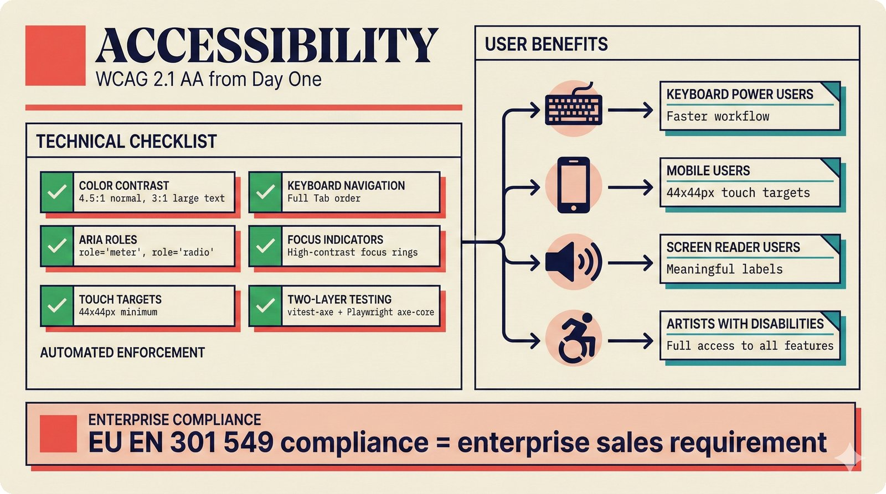

# fig-pitch-adv-11: Enterprise-Grade Accessibility: WCAG 2.1 AA from Day One

## Metadata

| Field | Value |
|-------|-------|
| **ID** | pitch-adv-11 |
| **Title** | Enterprise-Grade Accessibility: WCAG 2.1 AA from Day One |
| **Audience** | L1/L2 (Music Industry + PhD/Policy) |
| **Location** | docs/planning/managerial-roadmap-planning.md, pitch deck |
| **Priority** | P2 (Medium) |
| **Aspect Ratio** | 16:9 |
| **Layout Template** | D (Split-Panel) |

## Purpose

This figure shows accessibility as a competitive differentiator, not an afterthought. It answers: "Why should enterprise customers care about your accessibility posture?"

## Key Message

WCAG 2.1 AA from day one: 4.5:1 color contrast, keyboard navigation, ARIA roles, 44x44px touch targets, two-layer testing (vitest-axe + Playwright) -- EU EN 301 549 compliance as defensible moat.

## Visual Concept

A split panel layout. Left: Technical accessibility checklist (color contrast ratios, keyboard nav, ARIA roles, focus indicators, touch targets) with green checkmarks. Right: User journey showing how accessible design benefits all users -- keyboard power users, mobile users, screen reader users, and artists with disabilities. Bottom: "EU EN 301 549 compliance = enterprise sales requirement."

```
+---------------------------------------------------------------+
|  ACCESSIBILITY                                                 |
|  ■ WCAG 2.1 AA from Day One                                    |
+---------------------------------------------------------------+
|                                                                |
|  TECHNICAL CHECKLIST            USER BENEFITS                  |
|  ┌──────────────────┐          ┌──────────────────┐            |
|  │                   │          │                   │           |
|  │  ✓ Color contrast │          │  Keyboard power   │           |
|  │    4.5:1 normal   │          │  users             │           |
|  │    3:1 large text │          │  → Faster workflow │           |
|  │                   │          │                   │           |
|  │  ✓ Keyboard nav   │          │  Mobile users     │           |
|  │    Full Tab order │          │  → 44x44px targets │           |
|  │                   │          │                   │           |
|  │  ✓ ARIA roles     │          │  Screen reader    │           |
|  │    role="meter"   │          │  users             │           |
|  │    role="radio"   │          │  → Meaningful      │           |
|  │                   │          │    labels          │           |
|  │  ✓ Focus rings    │          │                   │           |
|  │    High-contrast  │          │  Artists with     │           |
|  │                   │          │  disabilities      │           |
|  │  ✓ Touch targets  │          │  → Full access    │           |
|  │    44x44px min    │          │                   │           |
|  │                   │          │                   │           |
|  │  ✓ Two-layer test │          │                   │           |
|  │    vitest-axe     │          │                   │           |
|  │    + Playwright   │          │                   │           |
|  └──────────────────┘          └──────────────────┘            |
|                                                                |
+---------------------------------------------------------------+
|  ■ "EU EN 301 549 compliance = enterprise sales requirement"   |
+---------------------------------------------------------------+
```

## Spatial Anchors

```yaml
canvas:
  width: 1920
  height: 1080
  background: warm_cream

title_block:
  position: [60, 40]
  width: 1800
  height: 80
  elements:
    - type: heading_display
      text: "ACCESSIBILITY"
    - type: label_editorial
      text: "WCAG 2.1 AA from Day One"

checklist_panel:
  position: [60, 160]
  width: 860
  height: 700
  elements:
    - type: label_editorial
      text: "TECHNICAL CHECKLIST"
    - type: checklist
      items:
        - { status: "pass", label: "Color contrast", detail: "4.5:1 normal, 3:1 large text" }
        - { status: "pass", label: "Keyboard navigation", detail: "Full Tab order" }
        - { status: "pass", label: "ARIA roles", detail: "role='meter', role='radio'" }
        - { status: "pass", label: "Focus indicators", detail: "High-contrast focus rings" }
        - { status: "pass", label: "Touch targets", detail: "44x44px minimum" }
        - { status: "pass", label: "Two-layer testing", detail: "vitest-axe + Playwright axe-core" }

benefits_panel:
  position: [1000, 160]
  width: 860
  height: 700
  elements:
    - type: label_editorial
      text: "USER BENEFITS"
    - type: user_journey_list
      items:
        - { user: "Keyboard power users", benefit: "Faster workflow" }
        - { user: "Mobile users", benefit: "44x44px touch targets" }
        - { user: "Screen reader users", benefit: "Meaningful labels" }
        - { user: "Artists with disabilities", benefit: "Full access to all features" }

callout_bar:
  position: [60, 900]
  width: 1800
  height: 120
  elements:
    - type: callout_bar
      text: "EU EN 301 549 compliance = enterprise sales requirement"
```

## Content Elements

### Primary Structures

| Name | Semantic Tag | Description |
|------|--------------|-------------|
| Title block | `heading_display` | "ACCESSIBILITY" with coral accent square |
| Subtitle | `label_editorial` | "WCAG 2.1 AA from Day One" |
| Checklist panel | `processing_stage` | Technical accessibility checklist with pass indicators |
| Color contrast item | `selected_option` | 4.5:1 normal, 3:1 large text (green check) |
| Keyboard nav item | `selected_option` | Full Tab order (green check) |
| ARIA roles item | `selected_option` | role="meter", role="radio" (green check) |
| Focus indicators item | `selected_option` | High-contrast focus rings (green check) |
| Touch targets item | `selected_option` | 44x44px minimum (green check) |
| Two-layer testing item | `selected_option` | vitest-axe + Playwright axe-core (green check) |
| Benefits panel | `processing_stage` | User journey showing benefits for all user types |
| Callout bar | `callout_bar` | Bottom insight statement |

### Relationships / Flows

| From | To | Type | Label |
|------|-----|------|-------|
| Checklist panel | Benefits panel | correspondence | "Each check enables user benefit" |
| Two-layer testing | All checklist items | verification | "Automated enforcement" |

### Callout Boxes

| Title | Content | Position |
|-------|---------|----------|
| Enterprise Compliance | "EU EN 301 549 compliance = enterprise sales requirement" | bottom-center |

## Text Content

### Labels (Max 30 chars each)

- ACCESSIBILITY
- WCAG 2.1 AA from Day One
- TECHNICAL CHECKLIST
- USER BENEFITS
- Color contrast 4.5:1
- Keyboard navigation
- ARIA roles
- Focus indicators
- Touch targets 44x44px
- Two-layer testing
- vitest-axe
- Playwright axe-core
- Keyboard power users
- Mobile users
- Screen reader users
- Artists with disabilities
- Faster workflow
- Meaningful labels
- Full access

### Caption (for embedding in documentation)

Enterprise-grade accessibility from day one: WCAG 2.1 AA compliance with 4.5:1 color contrast, full keyboard navigation, ARIA roles on custom components, 44x44px minimum touch targets, and two-layer automated testing via vitest-axe (component-level) and Playwright with axe-core (browser-level) -- EU EN 301 549 directive compliance positions accessibility as a competitive differentiator for enterprise sales.

## Anti-Hallucination Rules

### Default Rules (always include)

1. **Font names are INTERNAL** -- do NOT render them as labels.
2. **Semantic tags are INTERNAL** -- do NOT render them as visible text.
3. **Hex codes are INTERNAL** -- do NOT render them.
4. **Background MUST be warm cream (#f6f3e6)**.
5. **No generic flowchart aesthetics** -- no thick block arrows, no PowerPoint look.
6. **No figure captions** -- do NOT render "Figure 1.", "Fig.", or numbered caption.
7. **No prompt leakage** -- do NOT render style keywords as visible text.

### Figure-Specific Rules

1. WCAG 2.1 AA is the target level -- NOT AAA.
2. 4.5:1 ratio is for normal text, 3:1 for large text -- WCAG standards.
3. vitest-axe is the component-level testing tool.
4. @axe-core/playwright is the browser-level testing tool.
5. EN 301 549 is the EU accessibility directive -- REAL regulation.
6. 44x44px is the WCAG minimum touch target size.
7. ConfidenceGauge uses role="meter" -- a specific ARIA role.
8. Do NOT show specific disability categories -- keep inclusive and respectful.

## Alt Text

Accessibility checklist: WCAG 2.1 AA with color contrast, keyboard nav, ARIA, and two-layer testing.

## JSON Export Block

```json
{
  "meta": {
    "figure_id": "pitch-adv-11",
    "title": "Enterprise-Grade Accessibility: WCAG 2.1 AA from Day One",
    "audience": "L1/L2",
    "layout_template": "D"
  },
  "content_architecture": {
    "primary_message": "WCAG 2.1 AA from day one with two-layer testing -- EU EN 301 549 compliance as defensible moat.",
    "layout_flow": "left-to-right",
    "key_structures": [
      {
        "name": "Technical Checklist",
        "role": "processing_stage",
        "is_highlighted": false,
        "labels": ["Color contrast", "Keyboard nav", "ARIA roles", "Focus indicators", "Touch targets", "Two-layer testing"]
      },
      {
        "name": "Color Contrast",
        "role": "selected_option",
        "is_highlighted": true,
        "labels": ["4.5:1 normal", "3:1 large text"]
      },
      {
        "name": "ARIA Roles",
        "role": "selected_option",
        "is_highlighted": true,
        "labels": ["role=meter", "role=radio"]
      },
      {
        "name": "Two-Layer Testing",
        "role": "selected_option",
        "is_highlighted": true,
        "labels": ["vitest-axe", "Playwright axe-core"]
      },
      {
        "name": "User Benefits",
        "role": "processing_stage",
        "is_highlighted": false,
        "labels": ["Keyboard power users", "Mobile users", "Screen reader users", "Artists with disabilities"]
      }
    ],
    "relationships": [
      {
        "from": "Technical checklist",
        "to": "User benefits",
        "type": "solid",
        "label": "each check enables user benefit"
      }
    ],
    "callout_boxes": [
      {
        "heading": "ENTERPRISE COMPLIANCE",
        "body_text": "EU EN 301 549 compliance = enterprise sales requirement",
        "position": "bottom-center"
      }
    ]
  }
}
```

## Quality Checklist

- [x] Primary message clear in one sentence
- [x] Semantic tags used (no colors, hex codes, or font names in content spec)
- [x] ASCII layout sketched
- [x] Spatial anchors defined in YAML
- [x] Labels under 30 characters
- [x] Anti-hallucination rules listed
- [x] Alt text provided (125 chars max)
- [x] JSON export block included
- [x] Audience level correct (L1/L2/L3/L4)
- [x] Layout template identified (A/B/C/D/E)

## Status

- [x] Draft created
- [ ] Content reviewed
- [ ] Generated via Nano Banana Pro
- [ ] Quality score >= 21/25
- [ ] Embedded in documentation

## Image Embed

### For GitHub README / MkDocs (repo-root-relative)


*Enterprise-grade accessibility from day one: WCAG 2.1 AA compliance with 4.5:1 color contrast, full keyboard navigation, ARIA roles on custom components, 44x44px minimum touch targets, and two-layer automated testing via vitest-axe (component-level) and Playwright with axe-core (browser-level) -- EU EN 301 549 directive compliance positions accessibility as a competitive differentiator for enterprise sales.*

### From this figure plan (relative)


