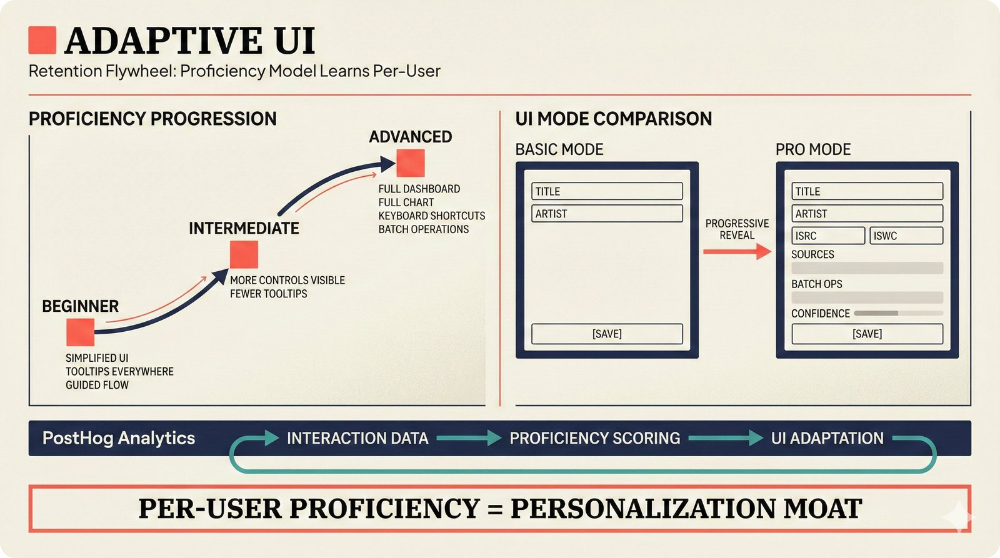

# fig-pitch-adv-13: Adaptive UI = Retention Flywheel: Proficiency Model Learns Per-User

## Metadata

| Field | Value |
|-------|-------|
| **ID** | pitch-adv-13 |
| **Title** | Adaptive UI = Retention Flywheel: Proficiency Model Learns Per-User |
| **Audience** | L1/L2 (Music Industry + PhD/Policy) |
| **Location** | docs/planning/managerial-roadmap-planning.md, pitch deck |
| **Priority** | P2 (Medium) |
| **Aspect Ratio** | 16:9 |
| **Layout Template** | B (Multi-Panel) |

## Purpose

This figure shows adaptive UI as a retention mechanism through per-user proficiency modeling. It answers: "How does the UI keep users engaged as they grow more skilled?"

## Key Message

Per-user proficiency model (Jotai + localStorage) progressively reveals features -- basic mode hides complexity, pro mode expands full controls -- creating a retention flywheel that's hard for competitors to replicate.

## Visual Concept

Two-panel layout. Left: Proficiency progression curve showing user journey from Beginner (simplified UI, tooltips, guided flow) through Intermediate (more controls visible, fewer tooltips) to Advanced (full dashboard, keyboard shortcuts, batch operations). Right: Two UI state mockups side by side -- Basic mode (clean, minimal fields) vs Pro mode (expanded controls, advanced analytics panel). Bottom: PostHog analytics integration arrow showing how interaction data feeds back into proficiency scoring.

```
+---------------------------------------------------------------+
|  ADAPTIVE UI                                                   |
|  ■ Retention Flywheel: Proficiency Model Learns Per-User       |
+-------------------------------+-------------------------------+
|                               |                               |
|  I. PROFICIENCY PROGRESSION   |  II. UI MODE COMPARISON       |
|  ─────────────────            |  ─────────────────            |
|                               |                               |
|              ● Advanced       |  BASIC MODE    PRO MODE       |
|             /  ■ Full dash    |  ┌─────────┐  ┌─────────┐    |
|            /   ■ Kbd shortcuts|  │ Title   │  │ Title   │    |
|           /    ■ Batch ops    |  │ Artist  │  │ Artist  │    |
|          /                    |  │ [Save]  │  │ ISRC    │    |
|         ● Intermediate        |  │         │  │ ISWC    │    |
|        /  ■ More controls     |  │         │  │ Sources │    |
|       /   ■ Fewer tooltips    |  │         │  │ Batch   │    |
|      /                        |  │         │  │ Confid. │    |
|     ● Beginner                |  └─────────┘  │ [Save]  │    |
|       ■ Simplified UI         |               └─────────┘    |
|       ■ Tooltips everywhere   |                               |
|       ■ Guided flow           |                               |
|                               |                               |
+-------------------------------+-------------------------------+
|  ┌─── PostHog Analytics ──────────────────────────────────┐   |
|  │  Interaction data ──→ Proficiency scoring ──→ UI adapt │   |
|  └────────────────────────────────────────────────────────┘   |
|  ■ "Per-user proficiency = personalization moat"              |
+---------------------------------------------------------------+
```

## Spatial Anchors

```yaml
canvas:
  width: 1920
  height: 1080
  background: warm_cream

title_block:
  position: [60, 40]
  width: 1800
  height: 80
  elements:
    - type: heading_display
      text: "ADAPTIVE UI"
    - type: label_editorial
      text: "Retention Flywheel: Proficiency Model Learns Per-User"

left_panel:
  position: [60, 160]
  width: 860
  height: 620
  label: "PROFICIENCY PROGRESSION"
  elements:
    - type: progression_curve
      stages:
        - id: beginner
          position: [100, 520]
          labels: ["Simplified UI", "Tooltips everywhere", "Guided flow"]
        - id: intermediate
          position: [400, 360]
          labels: ["More controls visible", "Fewer tooltips"]
        - id: advanced
          position: [700, 200]
          labels: ["Full dashboard", "Keyboard shortcuts", "Batch operations"]

right_panel:
  position: [980, 160]
  width: 860
  height: 620
  label: "UI MODE COMPARISON"
  elements:
    - type: mockup_pair
      basic_mode:
        position: [1000, 200]
        size: [360, 400]
        fields: ["Title", "Artist", "Save button"]
      pro_mode:
        position: [1420, 200]
        size: [360, 400]
        fields: ["Title", "Artist", "ISRC", "ISWC", "Sources", "Batch ops", "Confidence", "Save button"]

analytics_bar:
  position: [60, 820]
  width: 1800
  height: 80
  elements:
    - type: flow_arrow
      labels: ["Interaction data", "Proficiency scoring", "UI adaptation"]
    - type: label_editorial
      text: "PostHog Analytics"

callout_bar:
  position: [60, 940]
  width: 1800
  height: 100
  elements:
    - type: callout_bar
      text: "Per-user proficiency = personalization moat"
```

## Content Elements

### Primary Structures

| Name | Semantic Tag | Description |
|------|--------------|-------------|
| Title block | `heading_display` | "ADAPTIVE UI" with coral accent square |
| Subtitle | `label_editorial` | "Retention Flywheel: Proficiency Model Learns Per-User" |
| Proficiency curve | `processing_stage` | Beginner → Intermediate → Advanced progression |
| Beginner stage | `solution_component` | Simplified UI, tooltips, guided flow |
| Intermediate stage | `solution_component` | More controls, fewer tooltips |
| Advanced stage | `solution_component` | Full dashboard, keyboard shortcuts, batch ops |
| Basic mode mockup | `solution_component` | Clean, minimal fields UI state |
| Pro mode mockup | `solution_component` | Expanded controls, advanced analytics |
| PostHog flow | `processing_stage` | Interaction data → proficiency scoring → UI adaptation |
| Callout bar | `callout_bar` | Per-user proficiency = personalization moat |

### Relationships / Flows

| From | To | Type | Label |
|------|-----|------|-------|
| Beginner | Intermediate | arrow | "user grows" |
| Intermediate | Advanced | arrow | "user grows" |
| Interaction data | Proficiency scoring | arrow | "feeds" |
| Proficiency scoring | UI adaptation | arrow | "drives" |
| Basic mode | Pro mode | arrow | "progressive reveal" |

### Callout Boxes

| Title | Content | Position |
|-------|---------|----------|
| Personalization Moat | "Per-user proficiency = personalization moat" | bottom-center |
| Analytics Loop | "PostHog tracks engagement to inform A/B testing" | bottom-left |

## Text Content

### Labels (Max 30 chars each)

- ADAPTIVE UI
- Proficiency Model Learns
- PROFICIENCY PROGRESSION
- UI MODE COMPARISON
- Beginner
- Intermediate
- Advanced
- Simplified UI
- Tooltips everywhere
- Guided flow
- More controls visible
- Fewer tooltips
- Full dashboard
- Keyboard shortcuts
- Batch operations
- BASIC MODE
- PRO MODE
- PostHog Analytics
- Interaction data
- Proficiency scoring
- UI adaptation

### Caption (for embedding in documentation)

Adaptive UI retention flywheel: per-user proficiency model using Jotai state and localStorage progressively reveals features from beginner (simplified, guided) through intermediate to advanced (full controls, batch operations) -- PostHog analytics track engagement to inform A/B testing, creating a data-driven personalization loop that reduces churn.

## Anti-Hallucination Rules

### Default Rules (always include)

1. **Font names are INTERNAL** -- do NOT render them as labels.
2. **Semantic tags are INTERNAL** -- do NOT render them as visible text.
3. **Hex codes are INTERNAL** -- do NOT render them.
4. **Background MUST be warm cream (#f6f3e6)**.
5. **No generic flowchart aesthetics** -- no thick block arrows, no PowerPoint look.
6. **No figure captions** -- do NOT render "Figure 1.", "Fig.", or numbered caption.
7. **No prompt leakage** -- do NOT render style keywords as visible text.

### Figure-Specific Rules

1. Jotai is the state management library -- do NOT show Redux, Zustand, or other state managers.
2. localStorage is used for persistence -- not a backend database.
3. PostHog is the analytics platform -- do NOT show Google Analytics or Mixpanel.
4. "Basic mode" and "Pro mode" are UI MODES, not pricing tiers.
5. The proficiency model is client-side -- no ML model training involved.
6. Keyboard shortcuts are an ADVANCED feature, not available to beginners.
7. Do NOT show specific proficiency score numbers -- keep conceptual.

## Alt Text

Proficiency curve from beginner to advanced with basic vs pro UI mode comparison.

## JSON Export Block

```json
{
  "meta": {
    "figure_id": "pitch-adv-13",
    "title": "Adaptive UI = Retention Flywheel: Proficiency Model Learns Per-User",
    "audience": "L1/L2",
    "layout_template": "B"
  },
  "content_architecture": {
    "primary_message": "Per-user proficiency model (Jotai + localStorage) progressively reveals features, creating a retention flywheel that competitors cannot easily replicate.",
    "layout_flow": "left-to-right",
    "key_structures": [
      {
        "name": "Proficiency Curve",
        "role": "processing_stage",
        "is_highlighted": true,
        "labels": ["Beginner", "Intermediate", "Advanced"]
      },
      {
        "name": "Basic Mode",
        "role": "solution_component",
        "is_highlighted": false,
        "labels": ["Simplified UI", "Minimal fields", "Guided flow"]
      },
      {
        "name": "Pro Mode",
        "role": "solution_component",
        "is_highlighted": true,
        "labels": ["Full controls", "Batch operations", "Advanced analytics"]
      },
      {
        "name": "PostHog Analytics Loop",
        "role": "processing_stage",
        "is_highlighted": false,
        "labels": ["Interaction data", "Proficiency scoring", "UI adaptation"]
      }
    ],
    "relationships": [
      {
        "from": "Beginner",
        "to": "Advanced",
        "type": "arrow",
        "label": "proficiency progression"
      },
      {
        "from": "PostHog",
        "to": "Proficiency Model",
        "type": "arrow",
        "label": "analytics feedback loop"
      }
    ],
    "callout_boxes": [
      {
        "heading": "PERSONALIZATION MOAT",
        "body_text": "Per-user proficiency = personalization moat",
        "position": "bottom-center"
      }
    ]
  }
}
```

## Quality Checklist

- [x] Primary message clear in one sentence
- [x] Semantic tags used (no colors, hex codes, or font names in content spec)
- [x] ASCII layout sketched
- [x] Spatial anchors defined in YAML
- [x] Labels under 30 characters
- [x] Anti-hallucination rules listed
- [x] Alt text provided (125 chars max)
- [x] JSON export block included
- [x] Audience level correct (L1/L2/L3/L4)
- [x] Layout template identified (A/B/C/D/E)

## Status

- [x] Draft created
- [ ] Content reviewed
- [ ] Generated via Nano Banana Pro
- [ ] Quality score >= 21/25
- [ ] Embedded in documentation

## Image Embed

### For GitHub README / MkDocs (repo-root-relative)


*Adaptive UI retention flywheel: per-user proficiency model progressively reveals features from beginner through advanced, with PostHog analytics feedback loop.*

### From this figure plan (relative)


