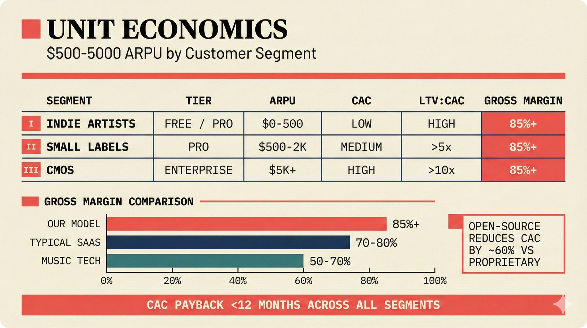

# fig-pitch-adv-14: Unit Economics: $500-5000 ARPU by Customer Segment

## Metadata

| Field | Value |
|-------|-------|
| **ID** | pitch-adv-14 |
| **Title** | Unit Economics: $500-5000 ARPU by Customer Segment |
| **Audience** | L1 (Music Industry / Investors) |
| **Location** | docs/planning/managerial-roadmap-planning.md, pitch deck |
| **Priority** | P1 (High) |
| **Aspect Ratio** | 16:9 |
| **Layout Template** | A (Hero) |

## Purpose

This figure shows unit economics by customer segment with LTV:CAC ratios. It answers: "Are the unit economics venture-scale?"

## Key Message

ARPU ranges from $0-500 (indie artists, freemium funnel) through $500-2,000 (small labels, Pro tier) to $5,000+ (CMOs, Enterprise SLA) -- with CAC payback under 12 months and gross margins above 85%.

## Visual Concept

Table/matrix layout with three rows (one per customer segment). Columns: Segment, Tier, ARPU, CAC, LTV:CAC, Gross Margin. Below the table: a bar chart comparing our gross margin (85%+) against typical SaaS (70-80%) and music tech competitors (50-70%). Right side annotation: "Open-source reduces CAC by ~60% vs proprietary."

```
+---------------------------------------------------------------+
|  UNIT ECONOMICS                                                |
|  ■ $500-5000 ARPU by Customer Segment                         |
+---------------------------------------------------------------+
|                                                               |
|  SEGMENT        TIER         ARPU       CAC    LTV:CAC  MARGIN|
|  ─────────────────────────────────────────────────────────────|
|  Indie Artists  Free/Pro     $0-500     Low    High     85%+  |
|  Small Labels   Pro          $500-2K    Med    >5x      85%+  |
|  CMOs           Enterprise   $5K+       High   >10x     85%+  |
|                                                               |
|  ─────────────────────────────────────────────────────────────|
|                                                               |
|  GROSS MARGIN COMPARISON                                      |
|  ─────────────────────────                                    |
|                                                               |
|  Our Model     ████████████████████████████  85%+             |
|  Typical SaaS  ██████████████████████        70-80%           |
|  Music Tech    ██████████████                 50-70%           |
|                                                               |
|  ├────┼────┼────┼────┼────┼────┼────┼────┼────┤              |
|  0%  10%  20%  30%  40%  50%  60%  70%  80%  90%             |
|                                                               |
|                     ■ "Open-source reduces CAC by ~60%        |
|                        vs proprietary"                        |
+---------------------------------------------------------------+
```

## Spatial Anchors

```yaml
canvas:
  width: 1920
  height: 1080
  background: warm_cream

title_block:
  position: [60, 40]
  width: 1800
  height: 80
  elements:
    - type: heading_display
      text: "UNIT ECONOMICS"
    - type: label_editorial
      text: "$500-5000 ARPU by Customer Segment"

economics_table:
  position: [60, 160]
  width: 1800
  height: 320
  label: "ECONOMICS BY SEGMENT"
  rows:
    - id: indie_artists
      elements:
        - { type: label_editorial, text: "Indie Artists" }
        - { type: data_mono, text: "Free / Pro" }
        - { type: data_mono, text: "$0-500" }
        - { type: data_mono, text: "Low" }
        - { type: data_mono, text: "High" }
        - { type: data_mono, text: "85%+" }
    - id: small_labels
      elements:
        - { type: label_editorial, text: "Small Labels" }
        - { type: data_mono, text: "Pro" }
        - { type: data_mono, text: "$500-2K" }
        - { type: data_mono, text: "Medium" }
        - { type: data_mono, text: ">5x" }
        - { type: data_mono, text: "85%+" }
    - id: cmos
      elements:
        - { type: label_editorial, text: "CMOs" }
        - { type: data_mono, text: "Enterprise" }
        - { type: data_mono, text: "$5K+" }
        - { type: data_mono, text: "High" }
        - { type: data_mono, text: ">10x" }
        - { type: data_mono, text: "85%+" }

margin_chart:
  position: [60, 540]
  width: 1400
  height: 320
  label: "GROSS MARGIN COMPARISON"
  elements:
    - type: bar_chart
      bars:
        - { label: "Our Model", value: "85%+", fill: highlighted }
        - { label: "Typical SaaS", value: "70-80%", fill: default }
        - { label: "Music Tech", value: "50-70%", fill: muted }

annotation:
  position: [1500, 540]
  width: 360
  height: 320
  elements:
    - type: callout_text
      text: "Open-source reduces CAC by ~60% vs proprietary"

callout_bar:
  position: [60, 920]
  width: 1800
  height: 100
  elements:
    - type: callout_bar
      text: "CAC payback <12 months across all segments"
```

## Content Elements

### Primary Structures

| Name | Semantic Tag | Description |
|------|--------------|-------------|
| Title block | `heading_display` | "UNIT ECONOMICS" with coral accent square |
| Subtitle | `label_editorial` | "$500-5000 ARPU by Customer Segment" |
| Indie Artists row | `solution_component` | Free/Pro tier, $0-500 ARPU |
| Small Labels row | `solution_component` | Pro tier, $500-2K ARPU |
| CMOs row | `solution_component` | Enterprise tier, $5K+ ARPU |
| Column headers | `label_editorial` | Segment, Tier, ARPU, CAC, LTV:CAC, Margin |
| Gross margin bars | `processing_stage` | Three bars comparing margin percentages |
| CAC annotation | `callout_text` | Open-source reduces CAC by ~60% |
| Callout bar | `callout_bar` | CAC payback <12 months across all segments |

### Relationships / Flows

| From | To | Type | Label |
|------|-----|------|-------|
| Indie Artists | Small Labels | arrow | "upgrade path" |
| Small Labels | CMOs | arrow | "upgrade path" |
| Open-source | CAC | annotation | "reduces by ~60%" |

### Callout Boxes

| Title | Content | Position |
|-------|---------|----------|
| CAC Advantage | "Open-source reduces CAC by ~60% vs proprietary" | right-annotation |
| Payback | "CAC payback <12 months across all segments" | bottom-center |

## Text Content

### Labels (Max 30 chars each)

- UNIT ECONOMICS
- ARPU by Customer Segment
- SEGMENT
- TIER
- ARPU
- CAC
- LTV:CAC
- GROSS MARGIN
- Indie Artists
- Small Labels
- CMOs
- Free / Pro
- Pro
- Enterprise
- $0-500
- $500-2K
- $5K+
- GROSS MARGIN COMPARISON
- Our Model 85%+
- Typical SaaS 70-80%
- Music Tech 50-70%

### Caption (for embedding in documentation)

Unit economics by customer segment: indie artists at $0-500 ARPU (freemium funnel), small labels at $500-2,000 (Pro tier), CMOs at $5,000+ (Enterprise SLA) -- with CAC payback under 12 months, gross margins above 85%, and open-source distribution reducing customer acquisition costs by an estimated 60% versus proprietary competitors.

## Anti-Hallucination Rules

### Default Rules (always include)

1. **Font names are INTERNAL** -- do NOT render them as labels.
2. **Semantic tags are INTERNAL** -- do NOT render them as visible text.
3. **Hex codes are INTERNAL** -- do NOT render them.
4. **Background MUST be warm cream (#f6f3e6)**.
5. **No generic flowchart aesthetics** -- no thick block arrows, no PowerPoint look.
6. **No figure captions** -- do NOT render "Figure 1.", "Fig.", or numbered caption.
7. **No prompt leakage** -- do NOT render style keywords as visible text.

### Figure-Specific Rules

1. ARPU ranges are ESTIMATES -- not from actual customers.
2. "CAC payback <12 months" is a TARGET, not achieved.
3. "85%+ gross margin" is for software SaaS -- realistic for this model.
4. "60% CAC reduction" from open-source is an ESTIMATE based on industry benchmarks.
5. Three segments only: indie artists, small labels, CMOs.
6. "Freemium funnel" means free tier converts to paid -- standard SaaS model.
7. Do NOT show specific LTV numbers -- keep as ratios.

## Alt Text

Unit economics table: indie $0-500, labels $500-2K, CMOs $5K+ ARPU with 85%+ gross margin.

## JSON Export Block

```json
{
  "meta": {
    "figure_id": "pitch-adv-14",
    "title": "Unit Economics: $500-5000 ARPU by Customer Segment",
    "audience": "L1",
    "layout_template": "A"
  },
  "content_architecture": {
    "primary_message": "ARPU ranges from $0-500 (indie) through $500-2K (labels) to $5K+ (CMOs), with 85%+ gross margins and CAC payback under 12 months.",
    "layout_flow": "top-to-bottom",
    "key_structures": [
      {
        "name": "Indie Artists Segment",
        "role": "solution_component",
        "is_highlighted": false,
        "labels": ["Indie Artists", "Free/Pro", "$0-500 ARPU", "Low CAC"]
      },
      {
        "name": "Small Labels Segment",
        "role": "solution_component",
        "is_highlighted": false,
        "labels": ["Small Labels", "Pro", "$500-2K ARPU", "Medium CAC"]
      },
      {
        "name": "CMOs Segment",
        "role": "solution_component",
        "is_highlighted": true,
        "labels": ["CMOs", "Enterprise", "$5K+ ARPU", ">10x LTV:CAC"]
      },
      {
        "name": "Gross Margin Comparison",
        "role": "processing_stage",
        "is_highlighted": true,
        "labels": ["Our Model 85%+", "Typical SaaS 70-80%", "Music Tech 50-70%"]
      }
    ],
    "relationships": [
      {
        "from": "Indie Artists",
        "to": "Small Labels",
        "type": "arrow",
        "label": "upgrade path"
      },
      {
        "from": "Small Labels",
        "to": "CMOs",
        "type": "arrow",
        "label": "upgrade path"
      }
    ],
    "callout_boxes": [
      {
        "heading": "CAC ADVANTAGE",
        "body_text": "Open-source reduces CAC by ~60% vs proprietary",
        "position": "right-annotation"
      }
    ]
  }
}
```

## Quality Checklist

- [x] Primary message clear in one sentence
- [x] Semantic tags used (no colors, hex codes, or font names in content spec)
- [x] ASCII layout sketched
- [x] Spatial anchors defined in YAML
- [x] Labels under 30 characters
- [x] Anti-hallucination rules listed
- [x] Alt text provided (125 chars max)
- [x] JSON export block included
- [x] Audience level correct (L1/L2/L3/L4)
- [x] Layout template identified (A/B/C/D/E)

## Status

- [x] Draft created
- [ ] Content reviewed
- [ ] Generated via Nano Banana Pro
- [ ] Quality score >= 21/25
- [ ] Embedded in documentation

## Image Embed

### For GitHub README / MkDocs (repo-root-relative)


*Unit economics by customer segment with 85%+ gross margins and open-source CAC advantage.*

### From this figure plan (relative)


