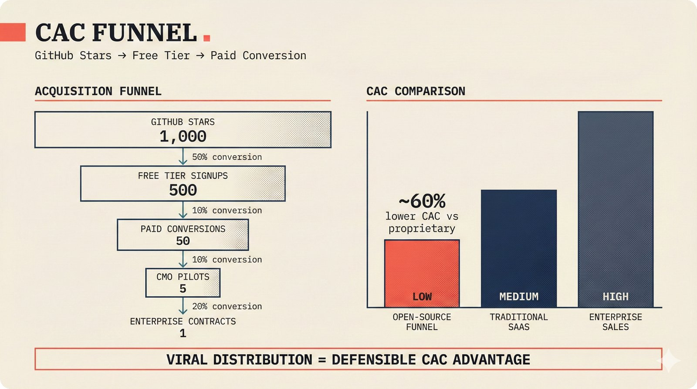

# fig-pitch-adv-15: CAC Funnel: GitHub Stars → Free Tier → Paid Conversion

## Metadata

| Field | Value |
|-------|-------|
| **ID** | pitch-adv-15 |
| **Title** | CAC Funnel: GitHub Stars → Free Tier → Paid Conversion |
| **Audience** | L1 (Music Industry / Investors) |
| **Location** | docs/planning/managerial-roadmap-planning.md, pitch deck |
| **Priority** | P1 (High) |
| **Aspect Ratio** | 16:9 |
| **Layout Template** | B (Multi-Panel) |

## Purpose

This figure shows the open-source customer acquisition funnel from GitHub stars to enterprise contracts. It answers: "How does open-source reduce your CAC?"

## Key Message

Open-source acquisition funnel: 1,000 GitHub stars → 500 free signups → 50 paid customers (10% conversion) → 5 CMO pilots → 1 enterprise contract -- open-source reduces CAC by ~60% vs proprietary SaaS.

## Visual Concept

Left panel: Classic funnel diagram narrowing from top (GitHub Stars: 1,000) through Free Tier Signups (500) → Paid Conversions (50, 10%) → CMO Pilots (5) → Enterprise Contracts (1). Each level shows conversion rate. Right panel: CAC comparison bars -- Our open-source funnel vs Traditional SaaS vs Enterprise sales, showing cost per acquisition at each level. Bottom: "Viral distribution = defensible CAC advantage."

```
+---------------------------------------------------------------+
|  CAC FUNNEL                                                    |
|  ■ GitHub Stars → Free Tier → Paid Conversion                 |
+-------------------------------+-------------------------------+
|                               |                               |
|  I. ACQUISITION FUNNEL        |  II. CAC COMPARISON           |
|  ─────────────────            |  ─────────────────            |
|                               |                               |
|  ┌───────────────────────┐    |                               |
|  │  GitHub Stars: 1,000  │    |  Open-Source                  |
|  └───────┬───────────────┘    |  ████████         Low         |
|          │ 50%                |                               |
|  ┌───────┴───────────┐       |  Traditional SaaS             |
|  │  Free Signups: 500│       |  ██████████████████ Medium     |
|  └───────┬───────────┘       |                               |
|          │ 10%                |  Enterprise Sales             |
|    ┌─────┴─────────┐         |  ██████████████████████ High   |
|    │  Paid: 50     │         |                               |
|    └─────┬─────────┘         |  ├────┼────┼────┤             |
|          │ 10%                |  Low  Med  High               |
|      ┌───┴─────┐             |                               |
|      │Pilots: 5│             |  ■ "~60% lower CAC            |
|      └───┬─────┘             |     vs proprietary"           |
|          │ 20%                |                               |
|       ┌──┴──┐                |                               |
|       │Ent:1│                |                               |
|       └─────┘                |                               |
|                               |                               |
+-------------------------------+-------------------------------+
|  ■ "Viral distribution = defensible CAC advantage"            |
+---------------------------------------------------------------+
```

## Spatial Anchors

```yaml
canvas:
  width: 1920
  height: 1080
  background: warm_cream

title_block:
  position: [60, 40]
  width: 1800
  height: 80
  elements:
    - type: heading_display
      text: "CAC FUNNEL"
    - type: label_editorial
      text: "GitHub Stars → Free Tier → Paid Conversion"

left_panel:
  position: [60, 160]
  width: 860
  height: 720
  label: "ACQUISITION FUNNEL"
  elements:
    - type: funnel_diagram
      levels:
        - id: github_stars
          position: [80, 180]
          width: 760
          label: "GitHub Stars"
          value: "1,000"
        - id: free_signups
          position: [140, 300]
          width: 640
          label: "Free Tier Signups"
          value: "500"
          conversion: "50%"
        - id: paid
          position: [220, 420]
          width: 480
          label: "Paid Conversions"
          value: "50"
          conversion: "10%"
        - id: pilots
          position: [300, 540]
          width: 320
          label: "CMO Pilots"
          value: "5"
          conversion: "10%"
        - id: enterprise
          position: [380, 660]
          width: 160
          label: "Enterprise Contracts"
          value: "1"
          conversion: "20%"

right_panel:
  position: [980, 160]
  width: 860
  height: 720
  label: "CAC COMPARISON"
  elements:
    - type: bar_chart
      bars:
        - { label: "Open-Source Funnel", value: "Low", fill: highlighted }
        - { label: "Traditional SaaS", value: "Medium", fill: default }
        - { label: "Enterprise Sales", value: "High", fill: muted }
    - type: callout_text
      text: "~60% lower CAC vs proprietary"

callout_bar:
  position: [60, 920]
  width: 1800
  height: 100
  elements:
    - type: callout_bar
      text: "Viral distribution = defensible CAC advantage"
```

## Content Elements

### Primary Structures

| Name | Semantic Tag | Description |
|------|--------------|-------------|
| Title block | `heading_display` | "CAC FUNNEL" with coral accent square |
| Subtitle | `label_editorial` | "GitHub Stars → Free Tier → Paid Conversion" |
| GitHub Stars level | `processing_stage` | Top of funnel: 1,000 stars |
| Free Signups level | `processing_stage` | 500 signups at 50% conversion |
| Paid Conversions level | `processing_stage` | 50 customers at 10% conversion |
| CMO Pilots level | `processing_stage` | 5 pilots at 10% conversion |
| Enterprise level | `processing_stage` | 1 contract at 20% conversion |
| Conversion rates | `data_mono` | Percentage between each level |
| CAC comparison bars | `solution_component` | Three bars: open-source, SaaS, enterprise |
| CAC annotation | `callout_text` | ~60% lower CAC vs proprietary |
| Callout bar | `callout_bar` | Viral distribution = defensible CAC advantage |

### Relationships / Flows

| From | To | Type | Label |
|------|-----|------|-------|
| GitHub Stars | Free Signups | funnel_arrow | "50% conversion" |
| Free Signups | Paid Conversions | funnel_arrow | "10% conversion" |
| Paid Conversions | CMO Pilots | funnel_arrow | "10% conversion" |
| CMO Pilots | Enterprise | funnel_arrow | "20% conversion" |

### Callout Boxes

| Title | Content | Position |
|-------|---------|----------|
| CAC Reduction | "~60% lower CAC vs proprietary" | right-panel |
| Distribution | "Viral distribution = defensible CAC advantage" | bottom-center |

## Text Content

### Labels (Max 30 chars each)

- CAC FUNNEL
- GitHub Stars → Paid Conversion
- ACQUISITION FUNNEL
- CAC COMPARISON
- GitHub Stars: 1,000
- Free Tier Signups: 500
- Paid Conversions: 50
- CMO Pilots: 5
- Enterprise Contracts: 1
- 50% conversion
- 10% conversion
- 20% conversion
- Open-Source Funnel
- Traditional SaaS
- Enterprise Sales
- Low
- Medium
- High
- ~60% lower CAC

### Caption (for embedding in documentation)

Open-source customer acquisition funnel: 1,000 GitHub stars driving 500 free tier signups, 10% paid conversion to 50 Pro customers, 5 CMO pilot programs, and 1 enterprise contract -- right panel shows open-source distribution reducing CAC by an estimated 60% versus proprietary SaaS and traditional enterprise sales approaches.

## Anti-Hallucination Rules

### Default Rules (always include)

1. **Font names are INTERNAL** -- do NOT render them as labels.
2. **Semantic tags are INTERNAL** -- do NOT render them as visible text.
3. **Hex codes are INTERNAL** -- do NOT render them.
4. **Background MUST be warm cream (#f6f3e6)**.
5. **No generic flowchart aesthetics** -- no thick block arrows, no PowerPoint look.
6. **No figure captions** -- do NOT render "Figure 1.", "Fig.", or numbered caption.
7. **No prompt leakage** -- do NOT render style keywords as visible text.

### Figure-Specific Rules

1. Funnel numbers are TARGETS, not actuals.
2. "10% conversion" is the free-to-paid target -- industry benchmark for dev tools.
3. "1,000 GitHub stars" is an 18-month target.
4. "5 CMO pilots" assumes 3-month trial periods.
5. "1 enterprise contract" is the M18 target from the roadmap.
6. "60% CAC reduction" is an estimate -- not verified.
7. Do NOT show specific dollar amounts for CAC -- keep as relative comparison.
8. The funnel is for the FULL 18-month period, not monthly.

## Alt Text

Acquisition funnel: 1000 GitHub stars to 50 paid to 1 enterprise, with CAC comparison.

## JSON Export Block

```json
{
  "meta": {
    "figure_id": "pitch-adv-15",
    "title": "CAC Funnel: GitHub Stars to Free Tier to Paid Conversion",
    "audience": "L1",
    "layout_template": "B"
  },
  "content_architecture": {
    "primary_message": "Open-source acquisition funnel: 1,000 GitHub stars to 1 enterprise contract, reducing CAC by ~60% vs proprietary SaaS.",
    "layout_flow": "left-to-right",
    "key_structures": [
      {
        "name": "Acquisition Funnel",
        "role": "processing_stage",
        "is_highlighted": true,
        "labels": ["1,000 Stars", "500 Free", "50 Paid", "5 Pilots", "1 Enterprise"]
      },
      {
        "name": "Open-Source CAC",
        "role": "solution_component",
        "is_highlighted": true,
        "labels": ["Open-Source Funnel", "Low CAC"]
      },
      {
        "name": "Traditional SaaS CAC",
        "role": "solution_component",
        "is_highlighted": false,
        "labels": ["Traditional SaaS", "Medium CAC"]
      },
      {
        "name": "Enterprise Sales CAC",
        "role": "solution_component",
        "is_highlighted": false,
        "labels": ["Enterprise Sales", "High CAC"]
      }
    ],
    "relationships": [
      {
        "from": "GitHub Stars",
        "to": "Enterprise Contracts",
        "type": "funnel",
        "label": "conversion funnel"
      }
    ],
    "callout_boxes": [
      {
        "heading": "CAC ADVANTAGE",
        "body_text": "Viral distribution = defensible CAC advantage",
        "position": "bottom-center"
      }
    ]
  }
}
```

## Quality Checklist

- [x] Primary message clear in one sentence
- [x] Semantic tags used (no colors, hex codes, or font names in content spec)
- [x] ASCII layout sketched
- [x] Spatial anchors defined in YAML
- [x] Labels under 30 characters
- [x] Anti-hallucination rules listed
- [x] Alt text provided (125 chars max)
- [x] JSON export block included
- [x] Audience level correct (L1/L2/L3/L4)
- [x] Layout template identified (A/B/C/D/E)

## Status

- [x] Draft created
- [ ] Content reviewed
- [ ] Generated via Nano Banana Pro
- [ ] Quality score >= 21/25
- [ ] Embedded in documentation

## Image Embed

### For GitHub README / MkDocs (repo-root-relative)


*Open-source customer acquisition funnel from GitHub stars to enterprise contracts, with ~60% CAC reduction versus proprietary approaches.*

### From this figure plan (relative)


