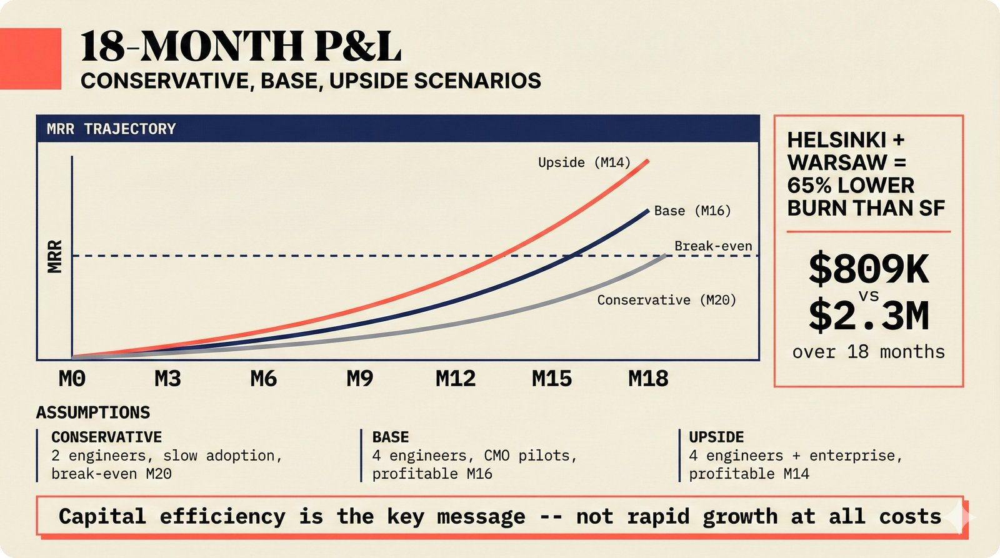

# fig-pitch-adv-16: 18-Month P&L Scenarios: Conservative, Base, Upside

## Metadata

| Field | Value |
|-------|-------|
| **ID** | pitch-adv-16 |
| **Title** | 18-Month P&L Scenarios: Conservative, Base, Upside |
| **Audience** | L1 (Music Industry / Investors) |
| **Location** | docs/planning/managerial-roadmap-planning.md, pitch deck |
| **Priority** | P1 (High) |
| **Aspect Ratio** | 16:9 |
| **Layout Template** | D (Split-Panel) |

## Purpose

This figure shows three financial scenarios with different assumptions. It answers: "What's the capital path and when do you break even?"

## Key Message

Three P&L scenarios -- Conservative (2 engineers, break-even M20), Base (4 engineers, profitable M16), Upside (4 engineers + enterprise, profitable M14) -- all using Helsinki + Warsaw cost base for capital efficiency.

## Visual Concept

Three parallel MRR curves (Conservative in gray, Base in blue, Upside in coral/green) plotted against time (M0-M18). Below each curve: key assumptions (team size, adoption rate, enterprise deals). Horizontal dashed line at break-even point. Right annotation: "Helsinki + Warsaw = 65% lower burn than SF." Bottom: burn rate comparison across scenarios.

```
+---------------------------------------------------------------+
|  18-MONTH P&L                                                  |
|  ■ Conservative, Base, Upside Scenarios                        |
+---------------------------------------------------------------+
|                                                               |
|  MRR                                                          |
|   ^                                                           |
|   |                              / Upside (M14)               |
|   |                            /                              |
|   |                          /   / Base (M16)                 |
|   |                        /   /                              |
|   |                      /   /                                |
|   |  - - - - - - - - - / - / - - - - Break-even - - -        |
|   |                  / - /          / Conservative (M20)      |
|   |                /   /          /                           |
|   |              /   /          /                             |
|   |            /   /          /                               |
|   |          /   /          /                                 |
|   |        /   /          /                ┌────────────────┐ |
|   |      /   /          /                  │Helsinki+Warsaw │ |
|   |    /   /                               │= 65% lower    │ |
|   |  /   /                                 │burn than SF    │ |
|   +────┼────┼────┼────┼────┼────┼────>     └────────────────┘ |
|   M0   M3   M6   M9   M12  M15  M18                          |
|                                                               |
|  ─────────────────────────────────────────────────────────── |
|  ASSUMPTIONS                                                  |
|  Conservative: 2 engineers, slow adoption                     |
|  Base: 4 engineers, CMO pilots                                |
|  Upside: 4 engineers + enterprise deals                       |
|                                                               |
|  BURN RATE: Helsinki+Warsaw ~$809K vs SF ~$2.3M (18 months)  |
+---------------------------------------------------------------+
```

## Spatial Anchors

```yaml
canvas:
  width: 1920
  height: 1080
  background: warm_cream

title_block:
  position: [60, 40]
  width: 1800
  height: 80
  elements:
    - type: heading_display
      text: "18-MONTH P&L"
    - type: label_editorial
      text: "Conservative, Base, Upside Scenarios"

chart_area:
  position: [60, 160]
  width: 1400
  height: 560
  label: "MRR TRAJECTORY"
  elements:
    - type: line_chart
      x_axis: "Months (M0-M18)"
      y_axis: "MRR"
      curves:
        - id: conservative
          style: muted
          break_even: "M20"
          label: "Conservative"
        - id: base
          style: default
          break_even: "M16"
          label: "Base"
        - id: upside
          style: highlighted
          break_even: "M14"
          label: "Upside"
    - type: reference_line
      style: dashed
      label: "Break-even"

annotation_panel:
  position: [1500, 160]
  width: 360
  height: 560
  elements:
    - type: callout_text
      text: "Helsinki + Warsaw = 65% lower burn than SF"
    - type: data_mono
      text: "$809K vs $2.3M over 18 months"

assumptions_bar:
  position: [60, 760]
  width: 1800
  height: 200
  label: "ASSUMPTIONS"
  rows:
    - id: conservative
      elements:
        - { type: label_editorial, text: "Conservative" }
        - { type: body_text, text: "2 engineers, slow adoption, break-even M20" }
    - id: base
      elements:
        - { type: label_editorial, text: "Base" }
        - { type: body_text, text: "4 engineers, CMO pilots, profitable M16" }
    - id: upside
      elements:
        - { type: label_editorial, text: "Upside" }
        - { type: body_text, text: "4 engineers + enterprise, profitable M14" }

callout_bar:
  position: [60, 980]
  width: 1800
  height: 60
  elements:
    - type: callout_bar
      text: "Capital efficiency is the key message -- not rapid growth at all costs"
```

## Content Elements

### Primary Structures

| Name | Semantic Tag | Description |
|------|--------------|-------------|
| Title block | `heading_display` | "18-MONTH P&L" with coral accent square |
| Subtitle | `label_editorial` | "Conservative, Base, Upside Scenarios" |
| Conservative curve | `processing_stage` | Gray line, break-even at M20 |
| Base curve | `processing_stage` | Blue line, profitable at M16 |
| Upside curve | `processing_stage` | Highlighted line, profitable at M14 |
| Break-even line | `reference_line` | Horizontal dashed line |
| Time axis | `data_mono` | M0 through M18 labels |
| Geography annotation | `callout_text` | Helsinki + Warsaw = 65% lower burn |
| Burn rate comparison | `data_mono` | $809K vs $2.3M |
| Assumptions table | `solution_component` | Three rows with scenario details |
| Callout bar | `callout_bar` | Capital efficiency message |

### Relationships / Flows

| From | To | Type | Label |
|------|-----|------|-------|
| Conservative | M20 | curve | "break-even" |
| Base | M16 | curve | "profitable" |
| Upside | M14 | curve | "profitable" |
| Helsinki+Warsaw | SF | comparison | "65% lower burn" |

### Callout Boxes

| Title | Content | Position |
|-------|---------|----------|
| Geography Advantage | "Helsinki + Warsaw = 65% lower burn than SF" | right-annotation |
| Capital Efficiency | "Capital efficiency is the key message" | bottom-center |

## Text Content

### Labels (Max 30 chars each)

- 18-MONTH P&L
- Conservative, Base, Upside
- MRR TRAJECTORY
- Conservative
- Base
- Upside
- Break-even
- M0
- M3
- M6
- M9
- M12
- M15
- M18
- M20
- Helsinki + Warsaw
- 65% lower burn than SF
- $809K vs $2.3M
- ASSUMPTIONS
- 2 engineers, slow adoption
- 4 engineers, CMO pilots
- 4 eng + enterprise deals

### Caption (for embedding in documentation)

18-month P&L in three scenarios: Conservative (2 engineers, slow adoption, break-even at M20), Base (4 engineers, CMO pilots, profitable by M16), and Upside (4 engineers plus enterprise deals, profitable by M14) -- Helsinki + Warsaw cost base delivers 65% lower burn than San Francisco while maintaining equivalent engineering output.

## Anti-Hallucination Rules

### Default Rules (always include)

1. **Font names are INTERNAL** -- do NOT render them as labels.
2. **Semantic tags are INTERNAL** -- do NOT render them as visible text.
3. **Hex codes are INTERNAL** -- do NOT render them.
4. **Background MUST be warm cream (#f6f3e6)**.
5. **No generic flowchart aesthetics** -- no thick block arrows, no PowerPoint look.
6. **No figure captions** -- do NOT render "Figure 1.", "Fig.", or numbered caption.
7. **No prompt leakage** -- do NOT render style keywords as visible text.

### Figure-Specific Rules

1. All financial projections are ESTIMATES -- not guarantees.
2. "Helsinki + Warsaw" is the preferred geography scenario.
3. Break-even dates: Conservative M20, Base M16, Upside M14.
4. "65% lower burn" compares Helsinki+Warsaw ($809K) to SF ($2.3M) over 18 months.
5. Team sizes: Conservative 2, Base 4, Upside 4+.
6. Do NOT show specific MRR dollar amounts -- keep curves directional.
7. Do NOT claim profitability is certain -- these are scenarios.
8. "Capital efficiency" is the key message -- not rapid growth at all costs.

## Alt Text

Three P&L curves: conservative break-even M20, base profitable M16, upside profitable M14.

## JSON Export Block

```json
{
  "meta": {
    "figure_id": "pitch-adv-16",
    "title": "18-Month P&L Scenarios: Conservative, Base, Upside",
    "audience": "L1",
    "layout_template": "D"
  },
  "content_architecture": {
    "primary_message": "Three P&L scenarios using Helsinki+Warsaw cost base: Conservative (break-even M20), Base (profitable M16), Upside (profitable M14) -- 65% lower burn than SF.",
    "layout_flow": "left-to-right",
    "key_structures": [
      {
        "name": "Conservative Scenario",
        "role": "processing_stage",
        "is_highlighted": false,
        "labels": ["Conservative", "2 engineers", "Break-even M20"]
      },
      {
        "name": "Base Scenario",
        "role": "processing_stage",
        "is_highlighted": false,
        "labels": ["Base", "4 engineers", "Profitable M16"]
      },
      {
        "name": "Upside Scenario",
        "role": "processing_stage",
        "is_highlighted": true,
        "labels": ["Upside", "4+ engineers", "Profitable M14"]
      },
      {
        "name": "Geography Advantage",
        "role": "solution_component",
        "is_highlighted": true,
        "labels": ["Helsinki + Warsaw", "65% lower burn", "$809K vs $2.3M"]
      }
    ],
    "relationships": [
      {
        "from": "Time (M0)",
        "to": "Break-even",
        "type": "curve",
        "label": "MRR trajectory"
      }
    ],
    "callout_boxes": [
      {
        "heading": "GEOGRAPHY ADVANTAGE",
        "body_text": "Helsinki + Warsaw = 65% lower burn than SF",
        "position": "right-annotation"
      }
    ]
  }
}
```

## Quality Checklist

- [x] Primary message clear in one sentence
- [x] Semantic tags used (no colors, hex codes, or font names in content spec)
- [x] ASCII layout sketched
- [x] Spatial anchors defined in YAML
- [x] Labels under 30 characters
- [x] Anti-hallucination rules listed
- [x] Alt text provided (125 chars max)
- [x] JSON export block included
- [x] Audience level correct (L1/L2/L3/L4)
- [x] Layout template identified (A/B/C/D/E)

## Status

- [x] Draft created
- [ ] Content reviewed
- [ ] Generated via Nano Banana Pro
- [ ] Quality score >= 21/25
- [ ] Embedded in documentation

## Image Embed

### For GitHub README / MkDocs (repo-root-relative)


*18-month P&L in three scenarios with Helsinki+Warsaw cost base delivering 65% lower burn than San Francisco.*

### From this figure plan (relative)


