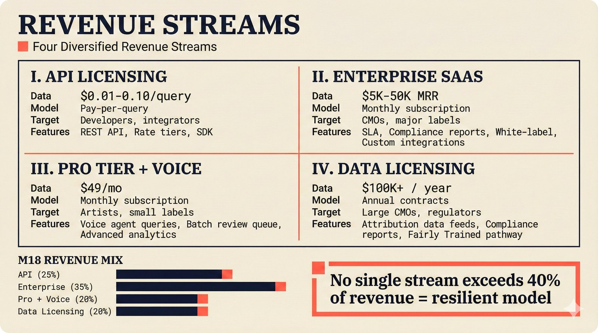

# fig-pitch-adv-17: Four Revenue Streams: API, Enterprise, Voice Upsell, Data Licensing

## Metadata

| Field | Value |
|-------|-------|
| **ID** | pitch-adv-17 |
| **Title** | Four Revenue Streams: API, Enterprise, Voice Upsell, Data Licensing |
| **Audience** | L1 (Music Industry / Investors) |
| **Location** | docs/planning/managerial-roadmap-planning.md, pitch deck |
| **Priority** | P1 (High) |
| **Aspect Ratio** | 16:9 |
| **Layout Template** | B (Multi-Panel) |

## Purpose

This figure shows four diversified revenue streams with contribution projections. It answers: "How diversified is your revenue and what protects against single-stream risk?"

## Key Message

Four revenue streams -- API licensing ($0.01-0.10/query), Enterprise SaaS ($5K-50K MRR), Pro tier with voice ($49/mo), Data licensing to CMOs ($100K+ annual) -- diversified revenue reduces single-stream risk.

## Visual Concept

Four-panel grid (2x2). Each panel: stream name, pricing model, target customers, projected contribution. Top-left: API licensing (pay-per-query). Top-right: Enterprise SaaS (monthly subscription). Bottom-left: Pro tier with voice (premium upsell). Bottom-right: Data licensing (annual contracts). Center: pie chart or bar showing projected revenue mix at M18. Bottom callout: "No single stream exceeds 40% of revenue = resilient model."

```
+---------------------------------------------------------------+
|  REVENUE STREAMS                                               |
|  ■ Four Diversified Revenue Streams                            |
+-------------------------------+-------------------------------+
|                               |                               |
|  I. API LICENSING             |  II. ENTERPRISE SAAS          |
|  ─────────────────            |  ─────────────────            |
|                               |                               |
|  Model: Pay-per-query         |  Model: Monthly subscription  |
|  Price: $0.01-0.10/query      |  Price: $5K-50K MRR           |
|  Target: Developers,          |  Target: CMOs, major labels   |
|          integrators          |  Features: SLA, compliance,   |
|  Features: REST API,          |    white-label, custom        |
|    rate tiers, SDK            |    integrations               |
|                               |                               |
+-------------------------------+-------------------------------+
|                               |                               |
|  III. PRO TIER + VOICE        |  IV. DATA LICENSING           |
|  ─────────────────            |  ─────────────────            |
|                               |                               |
|  Model: Monthly subscription  |  Model: Annual contracts      |
|  Price: $49/mo                |  Price: $100K+ / year         |
|  Target: Artists, small       |  Target: Large CMOs,          |
|          labels               |          regulators           |
|  Features: Voice agent,       |  Features: Attribution data   |
|    batch review, analytics    |    feeds, compliance reports, |
|                               |    Fairly Trained pathway     |
|                               |                               |
+-------------------------------+-------------------------------+
|                                                               |
|  M18 REVENUE MIX          ■ "No single stream exceeds        |
|  ████ API (25%)               40% of revenue =                |
|  ████ Enterprise (35%)        resilient model"                |
|  ████ Pro + Voice (20%)                                       |
|  ████ Data Licensing (20%)                                    |
|                                                               |
+---------------------------------------------------------------+
```

## Spatial Anchors

```yaml
canvas:
  width: 1920
  height: 1080
  background: warm_cream

title_block:
  position: [60, 40]
  width: 1800
  height: 80
  elements:
    - type: heading_display
      text: "REVENUE STREAMS"
    - type: label_editorial
      text: "Four Diversified Revenue Streams"

grid:
  layout: "2x2"
  gap: 40

  top_left:
    position: [60, 160]
    width: 860
    height: 320
    label: "API LICENSING"
    elements:
      - { type: label_editorial, text: "API LICENSING" }
      - { type: body_text, text: "Pay-per-query" }
      - { type: data_mono, text: "$0.01-0.10/query" }
      - { type: body_text, text: "Target: Developers, integrators" }
      - type: features
        items: ["REST API", "Rate tiers", "SDK"]

  top_right:
    position: [980, 160]
    width: 860
    height: 320
    label: "ENTERPRISE SAAS"
    elements:
      - { type: label_editorial, text: "ENTERPRISE SAAS" }
      - { type: body_text, text: "Monthly subscription" }
      - { type: data_mono, text: "$5K-50K MRR" }
      - { type: body_text, text: "Target: CMOs, major labels" }
      - type: features
        items: ["SLA", "Compliance reports", "White-label", "Custom integrations"]

  bottom_left:
    position: [60, 520]
    width: 860
    height: 320
    label: "PRO TIER + VOICE"
    elements:
      - { type: label_editorial, text: "PRO TIER + VOICE" }
      - { type: body_text, text: "Monthly subscription" }
      - { type: data_mono, text: "$49/mo" }
      - { type: body_text, text: "Target: Artists, small labels" }
      - type: features
        items: ["Voice agent queries", "Batch review queue", "Advanced analytics"]

  bottom_right:
    position: [980, 520]
    width: 860
    height: 320
    label: "DATA LICENSING"
    elements:
      - { type: label_editorial, text: "DATA LICENSING" }
      - { type: body_text, text: "Annual contracts" }
      - { type: data_mono, text: "$100K+ / year" }
      - { type: body_text, text: "Target: Large CMOs, regulators" }
      - type: features
        items: ["Attribution data feeds", "Compliance reports", "Fairly Trained pathway"]

revenue_mix:
  position: [60, 880]
  width: 860
  height: 140
  label: "M18 REVENUE MIX"
  elements:
    - type: bar_chart
      bars:
        - { label: "API", value: "25%" }
        - { label: "Enterprise", value: "35%" }
        - { label: "Pro + Voice", value: "20%" }
        - { label: "Data Licensing", value: "20%" }

callout_bar:
  position: [980, 880]
  width: 860
  height: 140
  elements:
    - type: callout_bar
      text: "No single stream exceeds 40% of revenue = resilient model"
```

## Content Elements

### Primary Structures

| Name | Semantic Tag | Description |
|------|--------------|-------------|
| Title block | `heading_display` | "REVENUE STREAMS" with coral accent square |
| Subtitle | `label_editorial` | "Four Diversified Revenue Streams" |
| API Licensing panel | `solution_component` | Pay-per-query at $0.01-0.10 |
| Enterprise SaaS panel | `solution_component` | Monthly subscription at $5K-50K MRR |
| Pro Tier + Voice panel | `solution_component` | $49/mo with voice agent |
| Data Licensing panel | `solution_component` | Annual contracts at $100K+ |
| Price labels | `data_mono` | Pricing for each stream |
| Revenue mix bars | `processing_stage` | M18 projected revenue distribution |
| Callout bar | `callout_bar` | No single stream exceeds 40% |

### Relationships / Flows

| From | To | Type | Label |
|------|-----|------|-------|
| API Licensing | Revenue Mix | contribution | "25%" |
| Enterprise SaaS | Revenue Mix | contribution | "35%" |
| Pro + Voice | Revenue Mix | contribution | "20%" |
| Data Licensing | Revenue Mix | contribution | "20%" |

### Callout Boxes

| Title | Content | Position |
|-------|---------|----------|
| Resilience | "No single stream exceeds 40% of revenue = resilient model" | bottom-right |

## Text Content

### Labels (Max 30 chars each)

- REVENUE STREAMS
- Four Diversified Streams
- API LICENSING
- ENTERPRISE SAAS
- PRO TIER + VOICE
- DATA LICENSING
- Pay-per-query
- Monthly subscription
- Annual contracts
- $0.01-0.10/query
- $5K-50K MRR
- $49/mo
- $100K+ / year
- Developers, integrators
- CMOs, major labels
- Artists, small labels
- Large CMOs, regulators
- M18 REVENUE MIX
- API 25%
- Enterprise 35%
- Pro + Voice 20%
- Data Licensing 20%

### Caption (for embedding in documentation)

Four diversified revenue streams: API licensing at $0.01-0.10 per attribution query, Enterprise SaaS at $5K-50K monthly recurring revenue per CMO, Pro tier at $49/mo with voice agent and batch review, and Data licensing to CMOs at $100K+ annual contracts -- diversified model where no single stream exceeds 40% of revenue reduces risk.

## Anti-Hallucination Rules

### Default Rules (always include)

1. **Font names are INTERNAL** -- do NOT render them as labels.
2. **Semantic tags are INTERNAL** -- do NOT render them as visible text.
3. **Hex codes are INTERNAL** -- do NOT render them.
4. **Background MUST be warm cream (#f6f3e6)**.
5. **No generic flowchart aesthetics** -- no thick block arrows, no PowerPoint look.
6. **No figure captions** -- do NOT render "Figure 1.", "Fig.", or numbered caption.
7. **No prompt leakage** -- do NOT render style keywords as visible text.

### Figure-Specific Rules

1. API pricing $0.01-0.10 per query is a RANGE -- pricing not finalized.
2. Enterprise MRR $5K-50K depends on CMO size.
3. Voice is PART of the Pro tier at $49/mo -- not a separate pricing stream.
4. Data licensing $100K+ annual is aspirational for large CMOs.
5. "40% cap" is a design principle, not a hard rule.
6. Revenue mix projections are for M18 -- not current.
7. Do NOT show specific total revenue numbers -- keep as proportional.
8. Fairly Trained certification pathway could enable premium data licensing.

## Alt Text

Four revenue panels: API licensing, enterprise SaaS, voice Pro tier, data licensing to CMOs.

## JSON Export Block

```json
{
  "meta": {
    "figure_id": "pitch-adv-17",
    "title": "Four Revenue Streams: API, Enterprise, Voice Upsell, Data Licensing",
    "audience": "L1",
    "layout_template": "B"
  },
  "content_architecture": {
    "primary_message": "Four diversified revenue streams -- API, Enterprise, Pro+Voice, Data Licensing -- with no single stream exceeding 40% of revenue.",
    "layout_flow": "grid-2x2",
    "key_structures": [
      {
        "name": "API Licensing",
        "role": "solution_component",
        "is_highlighted": false,
        "labels": ["API Licensing", "$0.01-0.10/query", "Developers"]
      },
      {
        "name": "Enterprise SaaS",
        "role": "solution_component",
        "is_highlighted": true,
        "labels": ["Enterprise SaaS", "$5K-50K MRR", "CMOs"]
      },
      {
        "name": "Pro Tier + Voice",
        "role": "solution_component",
        "is_highlighted": false,
        "labels": ["Pro + Voice", "$49/mo", "Artists"]
      },
      {
        "name": "Data Licensing",
        "role": "solution_component",
        "is_highlighted": false,
        "labels": ["Data Licensing", "$100K+/year", "Large CMOs"]
      },
      {
        "name": "Revenue Mix",
        "role": "processing_stage",
        "is_highlighted": true,
        "labels": ["API 25%", "Enterprise 35%", "Pro+Voice 20%", "Data 20%"]
      }
    ],
    "relationships": [
      {
        "from": "All Streams",
        "to": "Revenue Mix",
        "type": "contribution",
        "label": "projected M18 mix"
      }
    ],
    "callout_boxes": [
      {
        "heading": "RESILIENT MODEL",
        "body_text": "No single stream exceeds 40% of revenue = resilient model",
        "position": "bottom-right"
      }
    ]
  }
}
```

## Quality Checklist

- [x] Primary message clear in one sentence
- [x] Semantic tags used (no colors, hex codes, or font names in content spec)
- [x] ASCII layout sketched
- [x] Spatial anchors defined in YAML
- [x] Labels under 30 characters
- [x] Anti-hallucination rules listed
- [x] Alt text provided (125 chars max)
- [x] JSON export block included
- [x] Audience level correct (L1/L2/L3/L4)
- [x] Layout template identified (A/B/C/D/E)

## Status

- [x] Draft created
- [ ] Content reviewed
- [ ] Generated via Nano Banana Pro
- [ ] Quality score >= 21/25
- [ ] Embedded in documentation

## Image Embed

### For GitHub README / MkDocs (repo-root-relative)


*Four diversified revenue streams with no single stream exceeding 40% of projected M18 revenue.*

### From this figure plan (relative)


