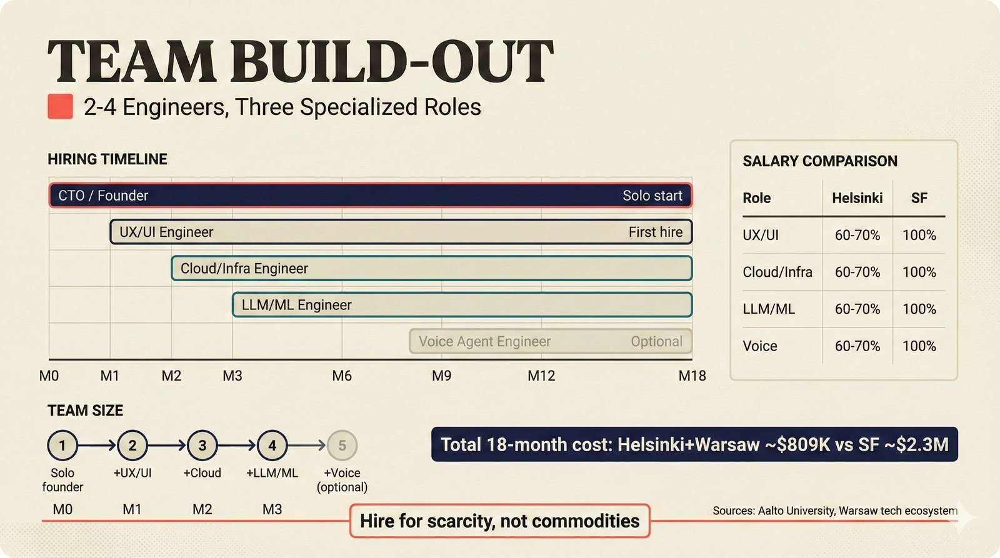

# fig-pitch-adv-18: Team Build-Out: 2-4 Engineers, Three Specialized Roles

## Metadata

| Field | Value |
|-------|-------|
| **ID** | pitch-adv-18 |
| **Title** | Team Build-Out: 2-4 Engineers, Three Specialized Roles |
| **Audience** | L1 (Music Industry / Investors) |
| **Location** | docs/planning/managerial-roadmap-planning.md, pitch deck |
| **Priority** | P1 (High) |
| **Aspect Ratio** | 16:9 |
| **Layout Template** | A (Hero) |

## Purpose

This figure shows the phased hiring plan with roles, timing, and cost rationale. It answers: "Does the founder have a realistic team-building plan?"

## Key Message

Phased hiring: CTO/founder from M0, UX/UI engineer M1, cloud/infrastructure M2, LLM/ML engineer M3, optional voice engineer M8 -- Helsinki base salaries at 60-70% of SF, recruiting from Aalto University and Warsaw tech ecosystem.

## Visual Concept

Gantt chart showing 18-month hiring timeline. Each role as a horizontal bar starting at their hire month and extending to M18. Color-coded by specialization. Right side: salary comparison (Helsinki vs London vs SF) for each role. Bottom: team size growth curve (1 → 2 → 3 → 4 → 5). Annotation: "Hire for scarcity, not commodities."

```
+---------------------------------------------------------------+
|  TEAM BUILD-OUT                                                |
|  ■ 2-4 Engineers, Three Specialized Roles                      |
+-----------------------------------------------+---------------+
|                                               |               |
|  HIRING TIMELINE (GANTT)                      | SALARY COMP.  |
|  ─────────────────────                        | ───────────── |
|                                               |               |
|  CTO/Founder                                  | Helsinki  SF  |
|  ████████████████████████████████████  M0-M18 | --      --    |
|                                               |               |
|  UX/UI Engineer                               |               |
|     ████████████████████████████████  M1-M18  | 60-70%  100%  |
|                                               |               |
|  Cloud/Infra Engineer                         |               |
|        ██████████████████████████████  M2-M18 | 60-70%  100%  |
|                                               |               |
|  LLM/ML Engineer                              |               |
|           ████████████████████████████  M3-M18| 60-70%  100%  |
|                                               |               |
|  Voice Agent Engineer (optional)              |               |
|                       ████████████████  M8-M18| 60-70%  100%  |
|                                               |               |
|  ├──┼──┼──┼──┼──┼──┼──┼──┼──┼──┼──┼──┤      |               |
|  M0 M1 M2 M3    M6       M9      M12    M18  |               |
|                                               |               |
+-----------------------------------------------+---------------+
|  TEAM SIZE: 1 → 2 → 3 → 4 ──────────── → 5 (optional)       |
|                                                               |
|  TOTAL 18-MO COST: Helsinki+Warsaw ~$809K vs SF ~$2.3M       |
|  ■ "Hire for scarcity, not commodities"                       |
|  Sources: Aalto University, Warsaw tech ecosystem             |
+---------------------------------------------------------------+
```

## Spatial Anchors

```yaml
canvas:
  width: 1920
  height: 1080
  background: warm_cream

title_block:
  position: [60, 40]
  width: 1800
  height: 80
  elements:
    - type: heading_display
      text: "TEAM BUILD-OUT"
    - type: label_editorial
      text: "2-4 Engineers, Three Specialized Roles"

gantt_chart:
  position: [60, 160]
  width: 1360
  height: 560
  label: "HIRING TIMELINE"
  elements:
    - type: gantt_bars
      roles:
        - id: cto_founder
          label: "CTO / Founder"
          start: "M0"
          end: "M18"
          style: highlighted
        - id: ux_engineer
          label: "UX/UI Engineer"
          start: "M1"
          end: "M18"
          style: default
        - id: cloud_engineer
          label: "Cloud/Infra Engineer"
          start: "M2"
          end: "M18"
          style: default
        - id: llm_engineer
          label: "LLM/ML Engineer"
          start: "M3"
          end: "M18"
          style: default
        - id: voice_engineer
          label: "Voice Agent Engineer"
          start: "M8"
          end: "M18"
          style: muted
          note: "(optional)"

salary_panel:
  position: [1460, 160]
  width: 400
  height: 560
  label: "SALARY COMPARISON"
  elements:
    - type: comparison_table
      columns: ["Role", "Helsinki", "SF"]
      rows:
        - { role: "UX/UI", helsinki: "60-70%", sf: "100%" }
        - { role: "Cloud/Infra", helsinki: "60-70%", sf: "100%" }
        - { role: "LLM/ML", helsinki: "60-70%", sf: "100%" }
        - { role: "Voice", helsinki: "60-70%", sf: "100%" }

team_size_bar:
  position: [60, 760]
  width: 1800
  height: 100
  elements:
    - type: growth_curve
      data_points:
        - { month: "M0", size: 1, label: "Solo founder" }
        - { month: "M1", size: 2, label: "+UX/UI" }
        - { month: "M2", size: 3, label: "+Cloud" }
        - { month: "M3", size: 4, label: "+LLM/ML" }
        - { month: "M8", size: 5, label: "+Voice (optional)" }

callout_bar:
  position: [60, 900]
  width: 1800
  height: 140
  elements:
    - type: data_mono
      text: "Total 18-month cost: Helsinki+Warsaw ~$809K vs SF ~$2.3M"
    - type: callout_bar
      text: "Hire for scarcity, not commodities"
    - type: body_text
      text: "Sources: Aalto University, Warsaw tech ecosystem"
```

## Content Elements

### Primary Structures

| Name | Semantic Tag | Description |
|------|--------------|-------------|
| Title block | `heading_display` | "TEAM BUILD-OUT" with coral accent square |
| Subtitle | `label_editorial` | "2-4 Engineers, Three Specialized Roles" |
| CTO/Founder bar | `processing_stage` | M0-M18, highlighted as first |
| UX/UI Engineer bar | `processing_stage` | M1-M18 hire |
| Cloud/Infra Engineer bar | `processing_stage` | M2-M18 hire |
| LLM/ML Engineer bar | `processing_stage` | M3-M18 hire |
| Voice Agent Engineer bar | `processing_stage` | M8-M18, marked optional |
| Salary comparison | `solution_component` | Helsinki vs SF cost table |
| Team size curve | `processing_stage` | Growth from 1 to 5 |
| Cost comparison | `data_mono` | $809K vs $2.3M |
| Callout bar | `callout_bar` | Hire for scarcity, not commodities |
| Recruitment sources | `body_text` | Aalto University, Warsaw tech ecosystem |

### Relationships / Flows

| From | To | Type | Label |
|------|-----|------|-------|
| M0 | M1 | timeline | "first hire" |
| M1 | M2 | timeline | "second hire" |
| M2 | M3 | timeline | "third hire" |
| M3 | M8 | timeline | "optional fourth hire" |
| Helsinki salaries | SF salaries | comparison | "60-70% of SF" |

### Callout Boxes

| Title | Content | Position |
|-------|---------|----------|
| Cost Efficiency | "Helsinki+Warsaw ~$809K vs SF ~$2.3M" | bottom-left |
| Hiring Philosophy | "Hire for scarcity, not commodities" | bottom-center |
| Talent Sources | "Aalto University, Warsaw tech ecosystem" | bottom-right |

## Text Content

### Labels (Max 30 chars each)

- TEAM BUILD-OUT
- Specialized Roles
- HIRING TIMELINE
- CTO / Founder
- UX/UI Engineer
- Cloud/Infra Engineer
- LLM/ML Engineer
- Voice Agent Engineer
- (optional)
- SALARY COMPARISON
- Helsinki
- SF
- 60-70%
- 100%
- M0
- M1
- M2
- M3
- M8
- M18
- TEAM SIZE
- $809K vs $2.3M
- Aalto University
- Warsaw tech ecosystem

### Caption (for embedding in documentation)

Phased team build-out over 18 months: CTO/founder from M0, UX/UI engineer at M1, cloud/infrastructure engineer at M2, LLM/ML engineer at M3, and optional voice agent engineer at M8 -- Helsinki base salaries at 60-70% of San Francisco equivalents with recruitment pipeline from Aalto University and Warsaw tech ecosystem, growing from solo founder to 5-person team.

## Anti-Hallucination Rules

### Default Rules (always include)

1. **Font names are INTERNAL** -- do NOT render them as labels.
2. **Semantic tags are INTERNAL** -- do NOT render them as visible text.
3. **Hex codes are INTERNAL** -- do NOT render them.
4. **Background MUST be warm cream (#f6f3e6)**.
5. **No generic flowchart aesthetics** -- no thick block arrows, no PowerPoint look.
6. **No figure captions** -- do NOT render "Figure 1.", "Fig.", or numbered caption.
7. **No prompt leakage** -- do NOT render style keywords as visible text.

### Figure-Specific Rules

1. CTO/founder is the FIRST person -- not a separate hire.
2. UX/UI engineer at M1 -- first external hire.
3. Cloud/infrastructure engineer at M2.
4. LLM/ML engineer at M3.
5. Voice agent engineer at M8 -- this role is OPTIONAL.
6. "60-70% of SF" is for equivalent roles -- verified in roadmap research.
7. Aalto University (Helsinki) and Warsaw tech ecosystem are REAL recruitment sources.
8. "Hire for scarcity" means LLM and voice skills, not generic web dev.
9. Total 18-month cost: Helsinki+Warsaw ~$809K vs SF ~$2.3M.

## Alt Text

Hiring Gantt: CTO M0, UX M1, Cloud M2, LLM M3, Voice M8 with Helsinki salary savings.

## JSON Export Block

```json
{
  "meta": {
    "figure_id": "pitch-adv-18",
    "title": "Team Build-Out: 2-4 Engineers, Three Specialized Roles",
    "audience": "L1",
    "layout_template": "A"
  },
  "content_architecture": {
    "primary_message": "Phased hiring from solo founder to 5-person team, with Helsinki+Warsaw salaries at 60-70% of SF, totaling ~$809K vs ~$2.3M over 18 months.",
    "layout_flow": "left-to-right",
    "key_structures": [
      {
        "name": "CTO/Founder",
        "role": "processing_stage",
        "is_highlighted": true,
        "labels": ["CTO/Founder", "M0-M18", "Solo start"]
      },
      {
        "name": "UX/UI Engineer",
        "role": "processing_stage",
        "is_highlighted": false,
        "labels": ["UX/UI", "M1-M18", "First hire"]
      },
      {
        "name": "Cloud/Infra Engineer",
        "role": "processing_stage",
        "is_highlighted": false,
        "labels": ["Cloud/Infra", "M2-M18"]
      },
      {
        "name": "LLM/ML Engineer",
        "role": "processing_stage",
        "is_highlighted": false,
        "labels": ["LLM/ML", "M3-M18"]
      },
      {
        "name": "Voice Agent Engineer",
        "role": "processing_stage",
        "is_highlighted": false,
        "labels": ["Voice Agent", "M8-M18", "Optional"]
      },
      {
        "name": "Salary Comparison",
        "role": "solution_component",
        "is_highlighted": true,
        "labels": ["Helsinki 60-70%", "SF 100%", "$809K vs $2.3M"]
      }
    ],
    "relationships": [
      {
        "from": "M0",
        "to": "M18",
        "type": "timeline",
        "label": "phased hiring"
      }
    ],
    "callout_boxes": [
      {
        "heading": "HIRING PHILOSOPHY",
        "body_text": "Hire for scarcity, not commodities",
        "position": "bottom-center"
      }
    ]
  }
}
```

## Quality Checklist

- [x] Primary message clear in one sentence
- [x] Semantic tags used (no colors, hex codes, or font names in content spec)
- [x] ASCII layout sketched
- [x] Spatial anchors defined in YAML
- [x] Labels under 30 characters
- [x] Anti-hallucination rules listed
- [x] Alt text provided (125 chars max)
- [x] JSON export block included
- [x] Audience level correct (L1/L2/L3/L4)
- [x] Layout template identified (A/B/C/D/E)

## Status

- [x] Draft created
- [ ] Content reviewed
- [ ] Generated via Nano Banana Pro
- [ ] Quality score >= 21/25
- [ ] Embedded in documentation

## Image Embed

### For GitHub README / MkDocs (repo-root-relative)


*Phased team build-out from solo founder to 5-person team with Helsinki+Warsaw salaries at 60-70% of San Francisco.*

### From this figure plan (relative)


