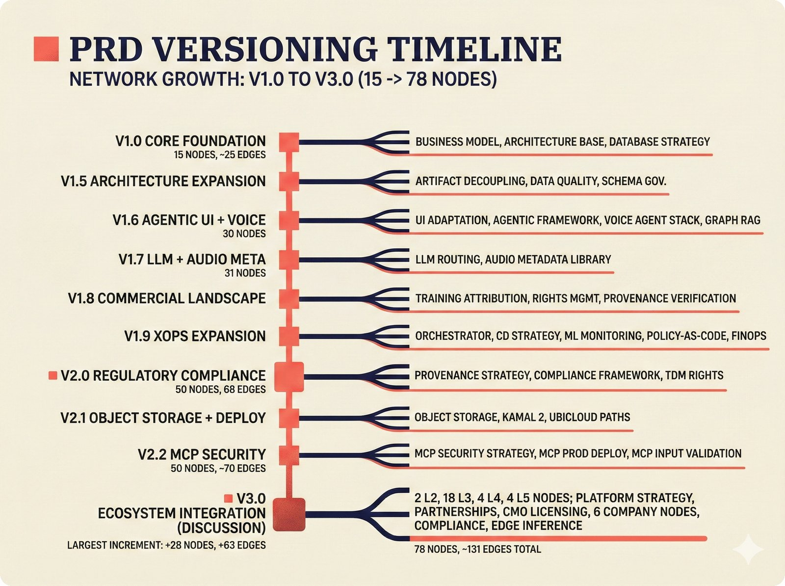

# fig-prd-09: PRD Versioning Timeline

## Metadata

| Field | Value |
|-------|-------|
| **ID** | fig-prd-09 |
| **Title** | PRD Versioning Timeline -- v1.0 to v3.0 Evolution |
| **Audience** | L2 (PhD Student / Policy Researcher) |
| **Complexity** | L2 (structural overview) |
| **Location** | docs/prd/decisions/REPORT.md |
| **Priority** | P2 (Medium) |
| **Dimensions** | 1200 x 900px (4:3) |

## Purpose & Key Message

Traces the evolution of the PRD decision network from initial version through v3.0.0. Shows which nodes were added at each version, demonstrating that the network grows incrementally as new decisions become relevant. This validates the probabilistic approach -- new decisions can be added without disrupting existing ones. The v3.0.0 expansion represents the largest single version jump, adding 28 ecosystem integration nodes.

The key message is: "The decision network has grown from 15 initial nodes to 78 nodes across 10 major versions -- the v3.0.0 'Discussion' expansion added 28 ecosystem nodes in the single largest version increment, bringing total edges to ~131."

## Visual Concept (ASCII Layout)

```
+---------------------------------------------------------------+
|  PRD VERSIONING TIMELINE                                       |
|  ■ Network Growth: v1.0 to v3.0 (15 → 78 nodes)              |
+---------------------------------------------------------------+
|                                                                |
|  v1.0 ──■── Core Foundation                                   |
|  │       L1-L3 core decisions (business, architecture, DB)     |
|  │       ~15 initial nodes, ~25 edges                          |
|  │                                                             |
|  v1.5 ──■── Architecture Expansion                             |
|  │       + Artifact Decoupling, Data Quality, Schema Gov.      |
|  │                                                             |
|  v1.6 ──■── Agentic UI + Voice + Graph RAG                    |
|  │       + UI Adaptation, Agentic UI, Voice, Graph RAG         |
|  │       30 nodes total                                        |
|  │                                                             |
|  v1.7 ──■── LLM + Audio Metadata                              |
|  │       + LLM Routing Strategy, Audio Metadata Library        |
|  │       31 nodes total                                        |
|  │                                                             |
|  v1.8 ──■── Commercial Landscape                               |
|  │       + Training Attribution, Rights Mgmt, Provenance,      |
|  │         External Registry Integration                       |
|  │                                                             |
|  v1.9 ──■── xOps Expansion                                    |
|  │       + Orchestrator, CD Strategy, ML Monitoring, Docs,     |
|  │         Policy-as-Code, FinOps, Ethics Governance           |
|  │                                                             |
|  v2.0 ──■── Regulatory Compliance                              |
|  │       + Provenance Strategy, Compliance Framework,          |
|  │         TDM Rights Reservation                              |
|  │       50 nodes, 68 edges                                    |
|  │                                                             |
|  v2.1 ──■── Object Storage + Deployment                        |
|  │       + Object Storage, Kamal 2, Ubicloud paths             |
|  │                                                             |
|  v2.2 ──■── MCP Security                                       |
|  │       + MCP Security Strategy, MCP Production Deployment,   |
|  │         MCP Input Validation                                |
|  │       50 nodes, ~70 edges                                   |
|  │                                                             |
|  v3.0 ──■── ECOSYSTEM INTEGRATION (Discussion)                 |
|          + 28 new nodes: 2 L2, 18 L3, 4 L4, 4 L5              |
|          + Platform strategy, partnerships, CMO licensing,     |
|            6 company nodes, compliance, edge inference          |
|          + ~63 new edges                                       |
|          78 nodes, ~131 edges                                  |
|                                                                |
+---------------------------------------------------------------+
```

## Content Elements

| Element | Semantic Tag | Description |
|---------|--------------|-------------|
| Title block | `heading_display` | "PRD VERSIONING TIMELINE" with coral accent square |
| Version milestones | `decision_point` | Vertical timeline with version markers (10 versions) |
| Version labels | `label_editorial` | v1.0 through v3.0 with descriptive names |
| Added nodes per version | `branching_path` | List of new decision nodes added at each version |
| Node/edge count markers | `data_mono` | Running totals at key milestones (15/25 → 50/68 → 78/131) |
| v3.0 highlight | `primary_outcome` | Largest single increment emphasized: +28 nodes, +63 edges |
| Timeline line | `accent_line_v` | Vertical coral accent line connecting versions |

## Anti-Hallucination Rules

1. The _network.yaml version is 3.0.0 as of 2026-02-14.
2. Total: 78 nodes, ~131 edges across 10 major versions.
3. Key v1.6 additions: UI Adaptation Strategy, Agentic UI Framework, Voice Agent Stack, Graph RAG Engine (30 nodes).
4. Key v1.7 additions: LLM Routing Strategy, Audio Metadata Library (31 nodes).
5. Key v1.8 additions (commercial landscape): Training Attribution Integration, Rights Management Scope, Provenance Verification, External Registry Integration.
6. Key v1.9 additions (xOps): Orchestrator Choice, CD Strategy, ML Monitoring, Documentation Tooling, Policy-as-Code, FinOps Strategy, Ethics Governance.
7. Key v2.0 additions (regulatory): Provenance & Citation Strategy, Compliance Framework Mapping, TDM Rights Reservation (50 nodes, 68 edges).
8. Key v2.1 additions: Object Storage, Kamal 2 container, Ubicloud managed PG paths.
9. Key v2.2 additions (MCP security): MCP Security Strategy, MCP Production Deployment, MCP Input Validation (50 nodes, ~70 edges).
10. Key v3.0 additions (Discussion expansion): 28 new ecosystem nodes (2 L2, 18 L3, 4 L4, 4 L5), ~63 new edges (78 nodes, ~131 edges). Largest single-version increment.
11. The exact version numbers and node assignments are reconstructed from the _network.yaml structure. Some assignments may differ from actual git history.
12. Background must be warm cream (#f6f3e6).

## Alt Text

Timeline visualization: evolution of the music attribution scaffold probabilistic PRD from v1.0 core foundation through v3.0 ecosystem expansion, showing growth from 15 to 78 decision nodes across ten versions with the v3.0 Discussion expansion adding 28 ecosystem integration nodes as the largest single increment.

## Image Embed

### For GitHub README / MkDocs (repo-root-relative)


*Figure 9. The probabilistic PRD has grown from 15 initial nodes (v1.0) to 78 nodes (v3.0) across ten versions, with the v3.0 Discussion expansion adding 28 ecosystem integration nodes and ~63 edges -- the largest single increment, bringing total edges to ~131.*

### From this figure plan (relative)


