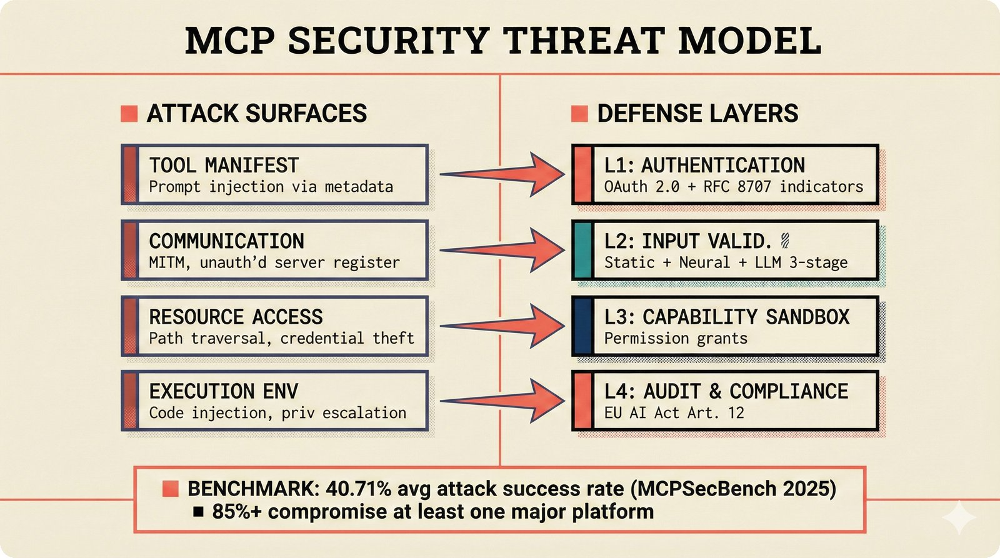

# fig-repo-17: MCP Security Threat Model

## Metadata

| Field | Value |
|-------|-------|
| **ID** | fig-repo-17 |
| **Title** | MCP Security Threat Model: Four Attack Surfaces, Four Defense Layers |
| **Audience** | L3 (Software Engineer) |
| **Location** | docs/prd/mcp-server-prd.md, docs/architecture/README.md |
| **Priority** | P1 (High) |
| **Aspect Ratio** | 16:9 |
| **Layout Template** | D (Split-Panel) |

## Purpose

Visualize the four attack surfaces identified by MCP Security Bench (tool manifest, communication, resource access, execution) and the corresponding four-layer defense (authentication, input validation, capability sandbox, audit). Engineers need this to understand what they're defending against and which layer handles each threat.

## Key Message

MCP implementations have a 40.71% average attack success rate — defense-in-depth with four dedicated layers is mandatory, not optional.

## Visual Concept

Split-panel layout: LEFT shows attack surfaces as threat vectors with red severity indicators, RIGHT shows defense layers as a stacked wall. Connecting lines map each threat to its primary mitigation layer.

```
+-----------------------------------------------------------------------+
|  MCP SECURITY THREAT MODEL                                             |
|  ■ Attack Surfaces vs. Defense Layers                                  |
+-----------------------------------------------------------------------+
|                                                                        |
|  ATTACK SURFACES                    DEFENSE LAYERS                     |
|  ────────────────                   ──────────────                     |
|                                                                        |
|  ┌───────────────────┐    ───▶    ┌───────────────────┐               |
|  │ Tool Manifest     │            │ L1: Authentication │               |
|  │ Prompt injection  │            │ OAuth 2.0 + RFC    │               |
|  │ via metadata      │            │ 8707 indicators    │               |
|  └───────────────────┘            └───────────────────┘               |
|                                                                        |
|  ┌───────────────────┐    ───▶    ┌───────────────────┐               |
|  │ Communication     │            │ L2: Input Valid.   │               |
|  │ MITM, unauth'd    │            │ Static + Neural    │               |
|  │ server register   │            │ + LLM 3-stage      │               |
|  └───────────────────┘            └───────────────────┘               |
|                                                                        |
|  ┌───────────────────┐    ───▶    ┌───────────────────┐               |
|  │ Resource Access   │            │ L3: Capability     │               |
|  │ Path traversal,   │            │ Sandbox            │               |
|  │ credential theft  │            │ Permission grants  │               |
|  └───────────────────┘            └───────────────────┘               |
|                                                                        |
|  ┌───────────────────┐    ───▶    ┌───────────────────┐               |
|  │ Execution Env     │            │ L4: Audit &        │               |
|  │ Code injection,   │            │ Compliance         │               |
|  │ priv escalation   │            │ EU AI Act Art. 12  │               |
|  └───────────────────┘            └───────────────────┘               |
|                                                                        |
|  ┌───────────────────────────────────────────────────────────────────┐ |
|  │  40.71% avg attack success rate (MCPSecBench 2025)  ■  85%+      │ |
|  │  compromise at least one major platform                           │ |
|  └───────────────────────────────────────────────────────────────────┘ |
+-----------------------------------------------------------------------+
```

## Spatial Anchors

```yaml
canvas:
  width: 1920
  height: 1080
  background: primary_background

zones:
  - id: title_zone
    bounds: [0, 0, 1920, 120]
    content: "MCP SECURITY THREAT MODEL"
    role: title

  - id: left_panel
    bounds: [80, 160, 840, 720]
    role: threat_panel

  - id: right_panel
    bounds: [1000, 160, 840, 720]
    role: defense_panel

  - id: callout_zone
    bounds: [80, 920, 1760, 120]
    role: callout_box

anchors:
  - id: threat_manifest
    position: [120, 200]
    size: [760, 140]
    role: security_layer

  - id: threat_comms
    position: [120, 380]
    size: [760, 140]
    role: security_layer

  - id: threat_resource
    position: [120, 560]
    size: [760, 140]
    role: security_layer

  - id: threat_exec
    position: [120, 740]
    size: [760, 140]
    role: security_layer

  - id: defense_auth
    position: [1040, 200]
    size: [760, 140]
    role: security_layer

  - id: defense_validation
    position: [1040, 380]
    size: [760, 140]
    role: security_layer

  - id: defense_sandbox
    position: [1040, 560]
    size: [760, 140]
    role: security_layer

  - id: defense_audit
    position: [1040, 740]
    size: [760, 140]
    role: security_layer

  - id: flow_1
    from: threat_manifest
    to: defense_auth
    type: arrow
    label: "mitigated by"

  - id: flow_2
    from: threat_comms
    to: defense_validation
    type: arrow
    label: "mitigated by"

  - id: flow_3
    from: threat_resource
    to: defense_sandbox
    type: arrow
    label: "mitigated by"

  - id: flow_4
    from: threat_exec
    to: defense_audit
    type: arrow
    label: "mitigated by"
```

## Content Elements

### Primary Structures

| Name | Semantic Tag | Description |
|------|--------------|-------------|
| Tool Manifest attack | `security_layer` | Prompt injection via tool metadata |
| Communication attack | `security_layer` | MITM, unauthorized server registration |
| Resource Access attack | `security_layer` | Path traversal, credential theft |
| Execution Environment attack | `security_layer` | Code injection, privilege escalation |
| Authentication layer | `security_layer` | OAuth 2.0 Resource Server + RFC 8707 |
| Input Validation layer | `security_layer` | Static + Neural + LLM three-stage detection |
| Capability Sandbox layer | `security_layer` | Permission grants with expiration |
| Audit & Compliance layer | `security_layer` | Immutable logging, EU AI Act Art. 12 |

### Relationships / Flows

| From | To | Type | Label |
|------|-----|------|-------|
| Tool Manifest | Authentication | arrow | "mitigated by" |
| Communication | Input Validation | arrow | "mitigated by" |
| Resource Access | Capability Sandbox | arrow | "mitigated by" |
| Execution Environment | Audit & Compliance | arrow | "mitigated by" |

### Callout Boxes

| Title | Content | Position |
|-------|---------|----------|
| "BENCHMARK" | 40.71% avg attack success rate across MCP implementations — 85%+ compromise at least one major platform (MCPSecBench 2025) | bottom-center |

## Text Content

### Labels (Max 30 chars each)

- Label 1: "Tool Manifest"
- Label 2: "Communication"
- Label 3: "Resource Access"
- Label 4: "Execution Environment"
- Label 5: "L1: Authentication"
- Label 6: "L2: Input Validation"
- Label 7: "L3: Capability Sandbox"
- Label 8: "L4: Audit & Compliance"

### Caption (for embedding in documentation)

MCP security threat model mapping four attack surfaces to four defense layers, based on MCPSecBench finding 40.71% average attack success rate across implementations.

## Anti-Hallucination Rules

### Default Rules (always include)

1. **Font names are INTERNAL** -- "Instrument Serif", "Plus Jakarta Sans", "IBM Plex Mono" are CSS references. Do NOT render them as labels in the image.
2. **Semantic tags are INTERNAL** -- Do NOT render them as visible text.
3. **Hex codes are INTERNAL** -- Do NOT render them.
4. **Background MUST be warm cream (#f6f3e6)** -- exact match to frontend surface color.
5. **No generic flowchart aesthetics** -- no thick block arrows, no rounded rectangles, no PowerPoint look.
6. **No figure captions** -- do NOT render "Figure 17." or any numbered academic caption.
7. **No prompt leakage** -- do NOT render style keywords as visible text.

### Figure-Specific Rules

8. The 40.71% statistic is from MCP Security Bench (arxiv:2510.15994). Do NOT fabricate other statistics.
9. The 85%+ statistic is from MCPSecBench (arxiv:2508.13220). These are separate benchmarks.
10. Defense layers are numbered L1-L4 in order of request processing (auth first, audit last).
11. Do NOT show specific company names as attacked — keep generic.

## Alt Text

MCP security threat model: four attack surfaces (tool manifest, communication, resource access, execution) mapped to four defense layers (authentication, input validation, capability sandbox, audit) with benchmark showing 40.71% average attack success rate.

## Image Embed

### For GitHub README / MkDocs (repo-root-relative)


*Figure 17. MCP security threat model mapping attack surfaces to defense-in-depth layers, based on MCPSecBench 2025 benchmarks.*

### From this figure plan (relative)



## Quality Checklist

- [x] Primary message clear in one sentence
- [x] Semantic tags used (no colors, hex codes, or font names in content spec)
- [x] ASCII layout sketched
- [x] Spatial anchors defined in YAML
- [x] Labels under 30 characters
- [x] Anti-hallucination rules listed
- [x] Alt text provided
- [x] Audience level correct (L3)
- [x] Layout template identified (D)

## Status

- [x] Draft created
- [ ] Content reviewed
- [ ] Generated via Nano Banana Pro
- [ ] Quality score >= 21/25
- [ ] Embedded in documentation
