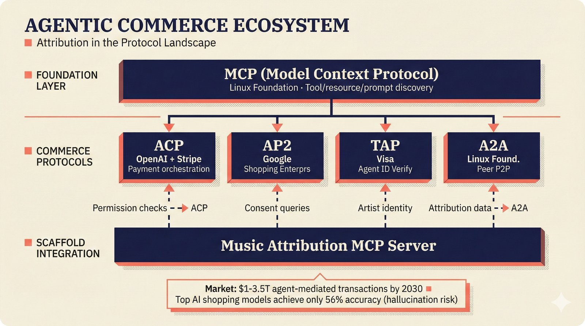

# fig-repo-19: Agentic Commerce Ecosystem

## Metadata

| Field | Value |
|-------|-------|
| **ID** | fig-repo-19 |
| **Title** | Agentic Commerce Ecosystem: Attribution in the Protocol Landscape |
| **Audience** | L2 (PhD/Policy) |
| **Location** | docs/knowledge-base/technical/mcp/SYNTHESIS.md |
| **Priority** | P2 (Medium) |
| **Aspect Ratio** | 16:9 |
| **Layout Template** | B (Multi-Panel) |

## Purpose

Map the emerging agentic commerce protocol landscape (MCP, ACP, AP2, TAP, A2A) and show where music attribution data fits as an infrastructure layer. Policy researchers and engineers need to understand protocol relationships and the scaffold's integration points.

## Key Message

Music attribution is a foundational data layer for agentic commerce — the scaffold's MCP server feeds verified attribution data into commerce protocols that handle $1-3.5T in projected agent-mediated transactions by 2030.

## Visual Concept

Multi-panel layout with three horizontal bands: foundation layer (MCP), commerce protocols (ACP, AP2, TAP, A2A), and the scaffold's integration points. Connection lines show data flows between layers.

```
+-----------------------------------------------------------------------+
|  AGENTIC COMMERCE ECOSYSTEM                                            |
|  ■ Attribution in the Protocol Landscape                               |
+-----------------------------------------------------------------------+
|                                                                        |
|  FOUNDATION LAYER                                                      |
|  ────────────────                                                      |
|  ┌───────────────────────────────────────────────────────────────────┐ |
|  │  MCP (Model Context Protocol)                                     │ |
|  │  Linux Foundation · Tool/resource/prompt discovery                 │ |
|  └───────────────────────────────────────────────────────────────────┘ |
|       │            │            │            │                         |
|  COMMERCE PROTOCOLS                                                    |
|  ──────────────────                                                    |
|  ┌──────────┐ ┌──────────┐ ┌──────────┐ ┌──────────┐                |
|  │   ACP    │ │   AP2    │ │   TAP    │ │   A2A    │                |
|  │ OpenAI + │ │  Google  │ │   Visa   │ │  Linux   │                |
|  │ Stripe   │ │ Shopping │ │ Agent ID │ │ Found.   │                |
|  │ Payment  │ │ Enterprs │ │ Verify   │ │ Peer P2P │                |
|  └──────────┘ └──────────┘ └──────────┘ └──────────┘                |
|       │            │            │            │                         |
|  SCAFFOLD INTEGRATION                                                  |
|  ────────────────────                                                  |
|  ┌───────────────────────────────────────────────────────────────────┐ |
|  │  Music Attribution MCP Server                                     │ |
|  │  Permission checks ──▶ ACP    Attribution data ──▶ A2A           │ |
|  │  Artist identity   ──▶ TAP    Consent queries  ──▶ AP2           │ |
|  └───────────────────────────────────────────────────────────────────┘ |
|                                                                        |
|  ┌───────────────────────────────────────────────────────────────────┐ |
|  │  Market: $1-3.5T agent-mediated transactions by 2030  ■  Top AI  │ |
|  │  shopping models achieve only 56% accuracy (hallucination risk)   │ |
|  └───────────────────────────────────────────────────────────────────┘ |
+-----------------------------------------------------------------------+
```

## Spatial Anchors

```yaml
canvas:
  width: 1920
  height: 1080
  background: primary_background

zones:
  - id: title_zone
    bounds: [0, 0, 1920, 120]
    content: "AGENTIC COMMERCE ECOSYSTEM"
    role: title

  - id: foundation_zone
    bounds: [80, 140, 1760, 160]
    role: content_area

  - id: commerce_zone
    bounds: [80, 360, 1760, 280]
    role: content_area

  - id: scaffold_zone
    bounds: [80, 700, 1760, 180]
    role: content_area

  - id: callout_zone
    bounds: [80, 920, 1760, 120]
    role: callout_box

anchors:
  - id: mcp_foundation
    position: [120, 160]
    size: [1680, 120]
    role: processing_stage

  - id: acp_protocol
    position: [120, 400]
    size: [380, 200]
    role: api_endpoint

  - id: ap2_protocol
    position: [540, 400]
    size: [380, 200]
    role: api_endpoint

  - id: tap_protocol
    position: [960, 400]
    size: [380, 200]
    role: api_endpoint

  - id: a2a_protocol
    position: [1380, 400]
    size: [380, 200]
    role: api_endpoint

  - id: scaffold_server
    position: [120, 720]
    size: [1680, 140]
    role: solution_component

  - id: flow_mcp_to_acp
    from: mcp_foundation
    to: acp_protocol
    type: arrow

  - id: flow_mcp_to_ap2
    from: mcp_foundation
    to: ap2_protocol
    type: arrow

  - id: flow_mcp_to_tap
    from: mcp_foundation
    to: tap_protocol
    type: arrow

  - id: flow_mcp_to_a2a
    from: mcp_foundation
    to: a2a_protocol
    type: arrow

  - id: flow_scaffold_acp
    from: scaffold_server
    to: acp_protocol
    type: dashed
    label: "permission checks"

  - id: flow_scaffold_a2a
    from: scaffold_server
    to: a2a_protocol
    type: dashed
    label: "attribution data"

  - id: flow_scaffold_tap
    from: scaffold_server
    to: tap_protocol
    type: dashed
    label: "artist identity"
```

## Content Elements

### Primary Structures

| Name | Semantic Tag | Description |
|------|--------------|-------------|
| MCP Foundation | `processing_stage` | Model Context Protocol — Linux Foundation, tool/resource/prompt discovery |
| ACP (Agent Commerce Protocol) | `api_endpoint` | OpenAI + Stripe — payment orchestration for agent transactions |
| AP2 (Agent Payment Protocol) | `api_endpoint` | Google — enterprise shopping and procurement agents |
| TAP (Token Agent Protocol) | `api_endpoint` | Visa — agent identity verification and payment authorization |
| A2A (Agent-to-Agent) | `api_endpoint` | Linux Foundation — peer-to-peer agent coordination |
| Scaffold MCP Server | `solution_component` | Attribution and permission queries serving commerce protocols |

### Relationships / Flows

| From | To | Type | Label |
|------|-----|------|-------|
| MCP Foundation | ACP | arrow | "uses MCP for tool access" |
| MCP Foundation | AP2 | arrow | "compatible via UCP" |
| MCP Foundation | TAP | arrow | "agent verification layer" |
| MCP Foundation | A2A | arrow | "peer coordination" |
| Scaffold Server | ACP | dashed | "permission checks" |
| Scaffold Server | A2A | dashed | "attribution data" |
| Scaffold Server | TAP | dashed | "artist identity" |
| Scaffold Server | AP2 | dashed | "consent queries" |

### Callout Boxes

| Title | Content | Position |
|-------|---------|----------|
| "MARKET" | $1-3.5T agent-mediated transactions by 2030 (McKinsey). Top AI shopping models achieve only 56% accuracy due to hallucination on prices/links. | bottom-center |

## Text Content

### Labels (Max 30 chars each)

- Label 1: "MCP (Model Context Protocol)"
- Label 2: "ACP · OpenAI + Stripe"
- Label 3: "AP2 · Google"
- Label 4: "TAP · Visa"
- Label 5: "A2A · Linux Foundation"
- Label 6: "Attribution MCP Server"
- Label 7: "Permission checks"
- Label 8: "Attribution data exchange"

### Caption (for embedding in documentation)

Agentic commerce ecosystem showing the scaffold's MCP server feeding verified attribution data into commerce protocols (ACP, AP2, TAP, A2A) for agent-mediated music transactions.

## Anti-Hallucination Rules

### Default Rules (always include)

1. **Font names are INTERNAL** -- Do NOT render them as labels in the image.
2. **Semantic tags are INTERNAL** -- Do NOT render them as visible text.
3. **Hex codes are INTERNAL** -- Do NOT render them.
4. **Background MUST be warm cream (#f6f3e6)**.
5. **No generic flowchart aesthetics**.
6. **No figure captions** -- do NOT render "Figure 19." or any numbered caption.
7. **No prompt leakage**.

### Figure-Specific Rules

8. Protocol names MUST be accurate: ACP (Agent Commerce Protocol, OpenAI+Stripe), AP2 (Agent Payment Protocol, Google), TAP (Token Agent Protocol, Visa), A2A (Agent-to-Agent, Linux Foundation via AAIF).
9. The $1-3.5T market figure is from McKinsey's agentic commerce report (2025). Do NOT fabricate other market sizes.
10. The 56% accuracy statistic is from arxiv:2512.04921. Do NOT attribute to other sources.
11. MCP was donated to AAIF under Linux Foundation in December 2025.
12. Do NOT show UCP (Universal Commerce Protocol) as a concrete standard — it's a proposed unification layer, not yet released.
13. Worldpay (Nov 2025) and Adyen (Nov 2025) MCP payment servers exist but should NOT be shown as protocol-level elements — they are implementations.

## Alt Text

Agentic commerce ecosystem: three-tier protocol landscape showing MCP as foundation layer, four commerce protocols (ACP, AP2, TAP, A2A) as transaction layer, and the music attribution MCP server feeding verified attribution data and permission checks into the commerce protocol stack.

## Image Embed

### For GitHub README / MkDocs (repo-root-relative)


*Figure 19. The music attribution scaffold's position in the agentic commerce protocol landscape.*

### From this figure plan (relative)



## Quality Checklist

- [x] Primary message clear in one sentence
- [x] Semantic tags used (no colors, hex codes, or font names in content spec)
- [x] ASCII layout sketched
- [x] Spatial anchors defined in YAML
- [x] Labels under 30 characters
- [x] Anti-hallucination rules listed
- [x] Alt text provided
- [x] Audience level correct (L2)
- [x] Layout template identified (B)

## Status

- [x] Draft created
- [ ] Content reviewed
- [ ] Generated via Nano Banana Pro
- [ ] Quality score >= 21/25
- [ ] Embedded in documentation
