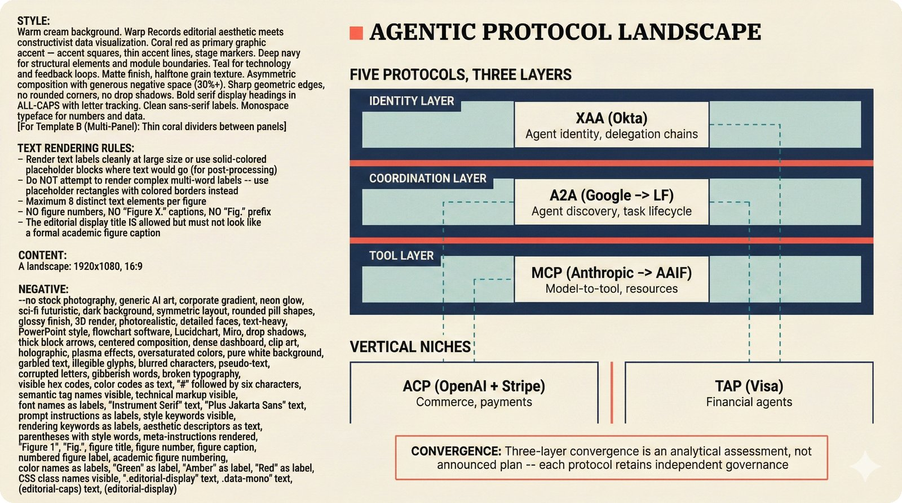

# fig-repo-24: Agentic Protocol Landscape

## Metadata

| Field | Value |
|-------|-------|
| **ID** | fig-repo-24 |
| **Title** | Agentic Protocol Landscape: MCP, ACP, A2A, TAP, XAA |
| **Audience** | L2 (PhD/Policy) |
| **Location** | docs/planning/mcp-security-production-research.md |
| **Priority** | P1 (High) |
| **Aspect Ratio** | 16:9 |
| **Layout Template** | B (Multi-Panel) |

## Purpose

Map the five major agentic protocols (MCP, ACP, A2A, TAP, XAA) across three layers (tool, coordination, identity) showing how they complement rather than compete, with the convergence thesis toward MCP + A2A + identity layer.

## Key Message

Five protocols are converging into a three-layer stack: MCP (tools) + A2A (coordination) + XAA (identity) -- with ACP and TAP as vertical niches for commerce and finance.

## Visual Concept

Three horizontal layer bands stacked vertically (identity on top, coordination in the middle, tool at the bottom), each containing its primary protocol. Below the stack, two smaller panels show ACP and TAP as vertical niches. Connecting lines show how the niches intersect specific layers.

```
+-----------------------------------------------------------------------+
|  AGENTIC PROTOCOL LANDSCAPE                                            |
|  ■ Five Protocols, Three Layers                                        |
+-----------------------------------------------------------------------+
|                                                                        |
|  IDENTITY LAYER                                                        |
|  ┌───────────────────────────────────────────────────────┐             |
|  │  XAA (Okta)  -- Agent identity, delegation chains    │             |
|  └───────────────────────────────────────────────────────┘             |
|                                                                        |
|  COORDINATION LAYER                                                    |
|  ┌───────────────────────────────────────────────────────┐             |
|  │  A2A (Google -> LF)  -- Agent discovery, task life   │             |
|  └───────────────────────────────────────────────────────┘             |
|                                                                        |
|  TOOL LAYER                                                            |
|  ┌───────────────────────────────────────────────────────┐             |
|  │  MCP (Anthropic -> AAIF)  -- Model-to-tool, resources│             |
|  └───────────────────────────────────────────────────────┘             |
|                                                                        |
|  VERTICAL NICHES                                                       |
|  ┌─────────────────────┐  ┌─────────────────────┐                     |
|  │ ACP (OpenAI+Stripe) │  │ TAP (Visa)          │                     |
|  │ Commerce, payments  │  │ Financial agents     │                     |
|  └─────────────────────┘  └─────────────────────┘                     |
+-----------------------------------------------------------------------+
```

## Spatial Anchors

```yaml
canvas:
  width: 1920
  height: 1080
  background: primary_background

zones:
  - id: title_zone
    bounds: [0, 0, 1920, 120]
    content: "AGENTIC PROTOCOL LANDSCAPE"
    role: title

  - id: stack_zone
    bounds: [80, 140, 1760, 600]
    role: content_area

  - id: niche_zone
    bounds: [80, 780, 1760, 160]
    role: content_area

  - id: callout_zone
    bounds: [80, 960, 1760, 80]
    role: callout_box

anchors:
  - id: layer_identity
    position: [120, 160]
    size: [1680, 140]
    role: protocol_layer

  - id: layer_coordination
    position: [120, 340]
    size: [1680, 140]
    role: protocol_layer

  - id: layer_tool
    position: [120, 520]
    size: [1680, 140]
    role: protocol_layer

  - id: niche_acp
    position: [120, 800]
    size: [780, 120]
    role: protocol_niche

  - id: niche_tap
    position: [960, 800]
    size: [780, 120]
    role: protocol_niche

  - id: convergence_label
    position: [120, 700]
    size: [1680, 60]
    role: section_heading
```

## Content Elements

### Primary Structures

| Name | Semantic Tag | Description |
|------|--------------|-------------|
| Identity Layer | `protocol_layer` | XAA from Okta -- agent identity and delegation chains |
| Coordination Layer | `protocol_layer` | A2A from Google, donated to Linux Foundation -- agent discovery, task lifecycle |
| Tool Layer | `protocol_layer` | MCP from Anthropic, donated to AAIF -- model-to-tool interface, resources |
| ACP niche | `protocol_niche` | Agent Commerce Protocol from OpenAI + Stripe -- commerce and payments |
| TAP niche | `protocol_niche` | Transaction Authorization Protocol from Visa -- financial agent authorization |

### Relationships / Flows

| From | To | Type | Label |
|------|-----|------|-------|
| Identity Layer | Coordination Layer | stacked | layer ordering |
| Coordination Layer | Tool Layer | stacked | layer ordering |
| ACP niche | Coordination Layer | dashed | intersects |
| ACP niche | Tool Layer | dashed | intersects |
| TAP niche | Identity Layer | dashed | intersects |
| TAP niche | Coordination Layer | dashed | intersects |

### Callout Boxes

| Title | Content | Position |
|-------|---------|----------|
| "CONVERGENCE" | Three-layer convergence is an analytical assessment, not an announced plan -- each protocol retains independent governance | bottom-center |

## Text Content

### Labels (Max 30 chars each)

- Label 1: "IDENTITY LAYER"
- Label 2: "COORDINATION LAYER"
- Label 3: "TOOL LAYER"
- Label 4: "VERTICAL NICHES"
- Label 5: "XAA (Okta)"
- Label 6: "A2A (Google -> LF)"
- Label 7: "MCP (Anthropic -> AAIF)"
- Label 8: "ACP (OpenAI + Stripe)"
- Label 9: "TAP (Visa)"

### Caption (for embedding in documentation)

Agentic protocol landscape showing five protocols converging into a three-layer stack: XAA for identity, A2A for coordination, MCP for tools, with ACP and TAP as vertical niches for commerce and finance.

## Anti-Hallucination Rules

### Default Rules (always include)

1. **Font names are INTERNAL** -- "Instrument Serif", "Plus Jakarta Sans", "IBM Plex Mono" are CSS references. Do NOT render them as labels in the image.
2. **Semantic tags are INTERNAL** -- Do NOT render them as visible text.
3. **Hex codes are INTERNAL** -- Do NOT render them.
4. **Background MUST be warm cream (#f6f3e6)** -- exact match to frontend surface color.
5. **No generic flowchart aesthetics** -- no thick block arrows, no rounded rectangles, no PowerPoint look.
6. **No figure captions** -- do NOT render "Figure 24." or any numbered academic caption.
7. **No prompt leakage** -- do NOT render style keywords as visible text.

### Figure-Specific Rules

8. MCP originated from Anthropic, donated to AAIF/Linux Foundation Dec 2025. Do NOT omit the AAIF donation.
9. ACP is from OpenAI + Stripe. Do NOT say "just OpenAI."
10. A2A originated from Google as Agent2Agent, donated to Linux Foundation. Do NOT omit the LF donation.
11. TAP is from Visa. Do NOT confuse with Google's TAP/TPU.
12. XAA is from Okta. Do NOT confuse with other authentication protocols.
13. The three-layer convergence thesis is an analytical assessment, NOT an announced plan.

## Alt Text

Agentic protocol landscape showing three convergent layers -- XAA identity from Okta, A2A coordination from Google via Linux Foundation, MCP tools from Anthropic via AAIF -- plus vertical niches ACP for commerce from OpenAI and Stripe, and TAP for financial agents from Visa.

## Image Embed

### For GitHub README / MkDocs (repo-root-relative)


*Figure 24. Agentic protocol landscape mapping MCP, A2A, XAA, ACP, and TAP across three complementary layers.*

### From this figure plan (relative)



## Quality Checklist

- [x] Primary message clear in one sentence
- [x] Semantic tags used (no colors, hex codes, or font names in content spec)
- [x] ASCII layout sketched
- [x] Spatial anchors defined in YAML
- [x] Labels under 30 characters
- [x] Anti-hallucination rules listed
- [x] Alt text provided
- [x] Audience level correct (L2)
- [x] Layout template identified (B)

## Status

- [x] Draft created
- [ ] Content reviewed
- [ ] Generated via Nano Banana Pro
- [ ] Quality score >= 21/25
- [ ] Embedded in documentation
