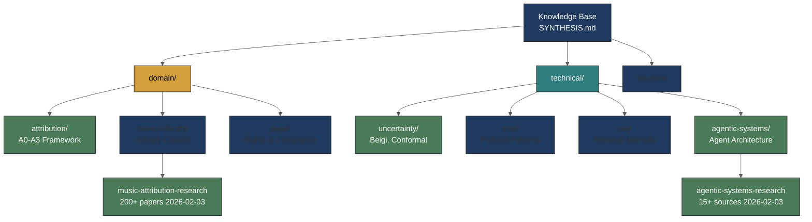

# Knowledge Base

This directory contains synthesized knowledge for RAG-optimized retrieval by Claude Code and other LLM tools.

## Knowledge Structure



### Text View

```
knowledge-base/
├── README.md                 # This file
├── SYNTHESIS.md              # Cross-domain synthesis
├── domain/                   # Music industry knowledge
│   ├── attribution/          # A0-A3 framework, oracle problem
│   ├── music-industry/       # Industry context + research
│   │   └── music-attribution-research-2026-02-03.md  # 200+ paper synthesis
│   ├── legal/                # Rights & compliance
│   └── economics/            # Market economics
├── technical/                # AI/ML technical knowledge
│   ├── uncertainty/          # Beigi taxonomy, conformal prediction
│   ├── mcp/                  # Protocol patterns
│   ├── rag/                  # Retrieval methods
│   ├── agentic-systems/      # Agent architecture
│   │   └── agentic-systems-research-2026-02-03.md  # 15+ source synthesis
│   └── context-engineering/  # Context management
├── ai/                       # AI research & references
│   └── raw-sources/          # NOT TRACKED - raw downloads
└── sources/                  # Literature notes
```

## Key Research Synthesis

### Music Attribution Research (2026-02-03)

The [music-attribution-research-2026-02-03.md](music/music-attribution-research-2026-02-03.md) synthesizes 200+ academic papers with actionable insights:

| Research Area | Key Finding | Product Implication |
|---------------|-------------|---------------------|
| Oracle Problem | Cannot prove training causation | Deterrence-based, not detection-based |
| Watermark Robustness | Neural codecs defeat all watermarks | Use declaration (A0-A3), not embedding |
| Machine Unlearning | Causes catastrophic forgetting | Consent before training, not after |
| Artist Perspectives | Accept AI tools, reject AI substitution | Gap-filling chat, not automation |
| Data Provenance | 80%+ of training data undocumented | Provenance tracking is competitive moat |

### Agentic Systems Technical Research (2026-02-03)

The [agentic-systems-research-2026-02-03.md](technical/agentic-systems-research-2026-02-03.md) synthesizes 15+ sources on technical architecture:

| Research Area | Key Finding | Product Implication |
|---------------|-------------|---------------------|
| MCP Security | 40.71% average attack success rate | Three-tier trust model essential |
| Multi-Agent | 17.2x error amplification on sequential tasks | Single-agent for attribution pipeline |
| EU AI Act | €35M penalty for non-compliance (Aug 2025+) | Audit logging mandatory |
| Memory Architecture | RAG → Contextual Memory shift in 2026 | Hybrid memory for chat interface |
| Agentic Commerce | Protocol fragmentation (ACP/AP2/TAP) | MCP as unifying foundation layer |

## Raw Sources Workflow

**Important**: Raw source files are NOT tracked in git.

### What Goes in `raw-sources/` (gitignored)

- Downloaded web pages ("Save Page As" HTML + assets)
- Academic papers (PDF, HTML)
- Any format that isn't LLM-friendly

### Conversion to Markdown

All raw sources should be converted to clean markdown before use:

1. **Web pages**: Use browser "Reader Mode" or tools like `pandoc`
2. **PDFs**: Use document-to-markdown conversion
3. **Academic papers**: Extract key insights, not full text

Reference skills for conversion (from sci-llm-writer):
- `biblio-markdown-cleaner` - Clean bibliography formatting
- `document-to-markdown` - Convert documents to clean markdown

### Why Markdown?

- **Token-efficient**: No HTML/PDF overhead
- **RAG-optimized**: Clean text for embedding
- **Version-controlled**: Diffs are meaningful
- **LLM-friendly**: Direct consumption without parsing

## SYNTHESIS.md Pattern

Each directory should have a `SYNTHESIS.md` that:
1. Aggregates key insights from child documents
2. Provides cross-references to related domains
3. Serves as the primary RAG retrieval target

See [PLAN.md](../planning/initial-hierarchical-doc-planning/PLAN.md) Section 3 for details.
