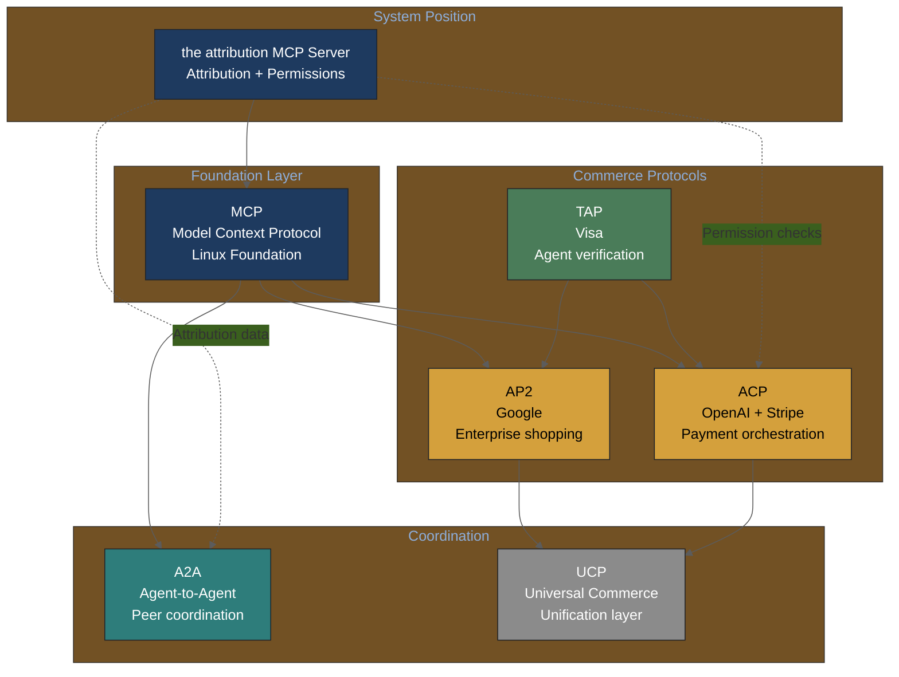

# MCP Knowledge Synthesis

Model Context Protocol patterns and security considerations for the system.

## Protocol Status (February 2026)

- **Governance**: Donated to Agentic AI Foundation (AAIF) under Linux Foundation (Dec 2025)
- **Current Spec**: November 2025 (2025-11-25)
- **Registry**: MCP Registry preview (Sep 2025) - single source of truth for servers

## Key Specification Updates

### [November 2025](https://modelcontextprotocol.io/specification/2025-11-25/basic/authorization)
- OAuth Resource Server classification (mandatory)
- Resource Indicators ([RFC 8707](https://www.rfc-editor.org/rfc/rfc8707)) for token scoping
- SEP-1024: Client security requirements
- SEP-835: Default scopes definition
- Asynchronous execution support
- Enterprise governance features

### June 2025
- Authorization handling clarification
- Token mis-redemption threat mitigation ([Auth0 analysis](https://auth0.com/blog/mcp-specs-update-all-about-auth/))

## Security Threat Model

### Attack Success Rates
- **40.71%** average across implementations ([MCP Security Bench](https://arxiv.org/abs/2510.15994))
- **85%+** compromise at least one major platform ([MCPSecBench](https://arxiv.org/abs/2508.13220))

### Four Attack Surfaces

| Surface | Threat | The System Mitigation |
|---------|--------|---------------------|
| Tool Manifest | Prompt injection via metadata | Three-stage detection |
| Server Communication | MITM, unauthorized registration | SHA-256 whitelist |
| Resource Access | Path traversal, credential theft | Capability sandbox |
| Execution Environment | Code injection, escalation | Subprocess executor |

## the attribution MCP Architecture

### Three-Tier Trust Model

```python
class AccessTier(Enum):
    INTERNAL = 1   # Full R/W, unlimited
    VERIFIED = 2   # R + scoped W, 1000/hr
    PUBLIC = 3     # Read-only, 100/hr
```

### Tool Definitions

| Tool | Access | Purpose |
|------|--------|---------|
| `get_artist_attribution` | All | Query attribution data |
| `search_songs` | All | Search with confidence filter |
| `verify_credit` | All | Verify specific claims |
| `check_permissions` | Tier 2+ | AI training consent |
| `get_usage_audit` | Tier 2+ | Artist audit trail access |

## Commerce Integration

### Protocol Landscape (2025-2026)

| Protocol | Provider | MCP Relationship |
|----------|----------|------------------|
| ACP | OpenAI + Stripe | Uses MCP for tool access |
| AP2 | Google | Compatible via UCP |
| TAP | Visa | Agent verification layer |
| A2A | Linux Foundation | Peer coordination |

### Agentic Commerce Protocol Relationships



**System Integration Points**:
- **ACP**: Permission verification before AI music transactions
- **A2A**: Attribution data exchange between music AI agents
- **TAP**: Artist identity verification for high-value transactions

### Visual: Agentic Commerce Ecosystem


*the system in agentic commerce: MCP-based attribution data flows to commerce protocols (ACP, AP2, TAP) enabling verified AI music transactions. [Market opportunity $1T US / $3-5T global by 2030](https://www.mckinsey.com/capabilities/quantumblack/our-insights/the-agentic-commerce-opportunity-how-ai-agents-are-ushering-in-a-new-era-for-consumers-and-merchants); [top AI shopping models achieve only 56%](https://arxiv.org/abs/2512.04921) due to hallucination on prices/links.*

### MCP Payment Servers

- Worldpay (Nov 2025): 52B+ transactions
- Adyen (Nov 2025): Direct LLM integration
- Visa (2026): Native API access

## Implementation Checklist

- [x] OAuth 2.0 integration design
- [x] Three-tier access control design
- [x] Tool definitions in PRD
- [ ] RFC 8707 Resource Indicators
- [ ] MCP Registry submission
- [ ] Rate limiting implementation
- [ ] Audit logging for compliance

## Cross-References

- [agentic-systems-research-2026-02-03.md](../agentic-systems-research-2026-02-03.md) - Full research synthesis
- [mcp-server-prd.md](../../../prd/mcp-server-prd.md) - API specification
- [MCP Specification](https://modelcontextprotocol.io/specification/2025-11-25)
