# Documentation Improvement Plan: Bridging Technical & Domain Expertise

**Date**: 2026-02-04
**Status**: Planning
**Branch**: `chore/improve-docs`

---

## Executive Summary

This plan addresses the critical gap between **low-level technical implementation** and **high-level domain expertise** in the system documentation. The goal is to create documentation that serves:

1. **Technical Engineers**: Deep implementation details, code patterns, architecture decisions
2. **Domain Experts (Imogen Heap, Andy)**: Conceptualized technical concepts, business implications
3. **Decision Makers**: How technical choices shape executive decisions and product strategy

A key focus is surfacing **known unknowns** and **unknown unknowns** to prevent late-stage architecture rethinks.

---

## The Problem: Specification Drift & Late Feature Bombs

```mermaid
flowchart TD
    subgraph "Current Anti-Pattern"
        A[Loose Initial Specs] --> B[MVP-Optimized Tech Choices]
        B --> C[Demo to Domain Expert]
        C --> D[💣 Major Feature Request]
        D --> E[Architecture Rethink]
        E --> F[Technical Debt]
        F --> G[Delayed Launch]
    end

    subgraph "Target Pattern"
        H[Comprehensive Discovery] --> I[Scalable Tech Choices]
        I --> J[MVP with Deferred Features]
        J --> K[Domain Expert Review]
        K --> L[Feature Request]
        L --> M{Already Anticipated?}
        M -->|Yes| N[Activate Deferred Feature]
        M -->|No| O[Minor Architecture Adjustment]
    end

    style D fill:#ff6b6b
    style M fill:#4ecdc4
```



---

## Dual-Audience Documentation Strategy

### Audience Matrix


### Document Structure Template

Every major PRD should include:

```markdown
# [Feature Name]

## For Domain Experts (Imogen/Andy)
> **In Plain English**: What this does and why it matters for artists
> **Business Impact**: How this affects revenue, user experience, trust
> **What We Need From You**: Questions that only domain experts can answer

## For Technical Engineers
> **Architecture Overview**: System design with Mermaid diagrams
> **Implementation Details**: Code patterns, API contracts
> **Trade-offs**: Why this approach vs. alternatives

## Known Unknowns
> Questions we know we need to answer but haven't yet

## Unknown Unknowns Surface
> What categories of surprises might emerge?
```

---

## The Unknowns Framework

### Rumsfeld Matrix for PRD Planning


### Questions for Domain Experts

To surface **unknown knowns** (things experts know but haven't told us):


---

## Technical Choices & Executive Impact

### Decision Flow: How Tech Shapes Strategy


### Scalability vs MVP Trade-offs

| Component | Quick MVP Choice | Scalable Choice | Why Scalable Matters |
|-----------|------------------|-----------------|----------------------|
| **Database** | SQLite | PostgreSQL | Multi-tenant, concurrent users, pgvector |
| **Graph** | None | Apache AGE | Credit relationships are inherently graphs |
| **LLM** | Direct API | LangGraph | Complex multi-step attribution workflows |
| **Voice** | Vapi (managed) | Pipecat (self-hosted) | Cost at scale, customization |
| **Confidence** | Heuristics | Conformal Prediction | "90% confident" must MEAN 90% |

**Key Insight**: Choosing PostgreSQL from day 1 means pgvector + Apache AGE are always available without migration. Choosing SQLite means painful migration later.

---

## Mermaid Diagrams Across Documentation

### Required Diagram Types per PRD

| PRD Type | Required Diagrams |
|----------|-------------------|
| **Domain TOC** | Architecture overview, data flow, integration points |
| **Implementation PRD** | Sequence diagrams, class diagrams, state machines |
| **Cross-cutting** | Dependency graph, integration matrix |
| **Planning** | Gantt charts, decision trees, risk matrices |

### Example: Attribution Engine Overview

```mermaid
flowchart TB
    subgraph Sources["Data Sources"]
        D[Discogs API]
        M[MusicBrainz API]
        A[Artist Input]
        L[Liner Notes OCR]
    end

    subgraph Attribution["Attribution Engine"]
        AGG[Multi-Source<br/>Aggregator]
        CONF[Conformal<br/>Prediction]
        GAP[Gap<br/>Analysis]
        SRC[Source<br/>Attribution]
    end

    subgraph Output["Outputs"]
        HIGH[High Confidence<br/>Auto-populate]
        MED[Medium Confidence<br/>User Confirm]
        LOW[Low Confidence<br/>Chat Gap-Fill]
    end

    D --> AGG
    M --> AGG
    A --> AGG
    L --> AGG

    AGG --> CONF
    CONF --> SRC
    SRC --> GAP

    CONF -->|≥90%| HIGH
    CONF -->|70-90%| MED
    CONF -->|<70%| LOW
    GAP --> LOW

    style HIGH fill:#4ecdc4
    style MED fill:#ffe66d
    style LOW fill:#ff6b6b
```



---

## Consolidated Unknowns Document

### Purpose

Create `docs/prd/UNKNOWNS-FOR-DOMAIN-EXPERTS.md` - a single document that:

1. Lists ALL questions needing domain expert input
2. Explains WHY each question matters technically
3. Shows impact of different answers
4. Provides structured format for responses

### Proposed Structure

```markdown
# Questions for Domain Experts

## How to Use This Document

1. Read each question section
2. Consider the "Why This Matters" context
3. Provide your answer in the response box
4. Flag any questions that trigger NEW questions

## Section 1: Confidence & Trust

### Q1.1: What confidence level makes you trust automated data?

**Why This Matters**: We can show "90% confident" but need to know if that's
enough for you to trust it, or if you need 99%, or if any automation is suspect.

**Technical Impact**:
- Higher threshold = more manual review = slower but safer
- Lower threshold = more automation = faster but riskier

**Your Answer**: [________________]

### Q1.2: When sources disagree, whose word is final?

...
```

---

## Implementation Roadmap

### Phase 1: Document Audit & Templates


### Deliverables

1. **UNKNOWNS-FOR-DOMAIN-EXPERTS.md** - Consolidated questions document
2. **Updated TOCs** - Mermaid diagrams in all 10 domain TOCs
3. **Dual-audience sections** - Each major PRD has expert + engineer sections
4. **Decision impact matrices** - How tech choices affect business

---

## Success Criteria

| Criteria | Measurement |
|----------|-------------|
| Domain expert can understand any PRD | Imogen/Andy review without confusion |
| Engineers have implementation clarity | No ambiguous specs |
| Unknowns are surfaced before coding | Questions documented before implementation |
| Tech choices support scale | No "we need to rewrite" moments |
| Late feature requests fit architecture | 80%+ requests are "activate deferred feature" |

---

## Appendix A: Verbatim User Prompt

> Let's create a new branc then from main chore/improve-docs and let's plan how to make the .md files across more comprehensive for both the a) low-level technical engineer crowd, b) high-level domain expert (mention Imogen and Andy explictly) crowd that need the technical concepts conceptualized for their domain knowledge, and why the low-level options discussed in the hierarchical PRD matter to them, and what they should know of the low-level tech and how executive decision making are shaped by different choices. And as an extra very important focus is to weave in to the documentation the "known unknowns" and "unknown unknowns". What should we be asking from the domain knowledge expert to further refine our choice of components to PRD? As based previous experience with non-developers, the specifications are too loosely defined typically and new large feature request come from domain experts in drops at worst causin rethinking of the whole architecture. In ideal case, we would choose tooling/libraries that would mostly scale to all sorts of imaginable use cases, and we simply defer the implementation of certain non-MVP features, but we should not overoptimize the tool choice for some quick and dirty MVP win, if this make sense as an explanation? Remember to use Mermaid graphs extensively across the repo, and also design and create finally a coherent one .md file explaining all the unknowns to domain experts so that there is one document that they could think of? Save the plan with my prompt verbatim to /home/petteri/Dropbox/github-personal/music-attribution-scaffold/docs/planning/doc-improvement-with-unknowns.md ! Add an appendix on some quick'n'dirty Nano Banana image creations then (24-48 prompt titles without actually creating the prompts), and let's focus on the Nano Banana Pro figure prompts later in detail!

---

## Appendix B: Nano Banana Pro Figure Prompt Titles

Visual documentation prompts for risograph-style technical illustrations. To be developed in detail later.

### Category 1: Architecture Diagrams (8 prompts)

1. **"The Attribution Engine Heart"** - Core data flow visualization
2. **"Source Confluence"** - Multi-source aggregation rivers merging
3. **"Confidence Spectrum"** - HIGH/MEDIUM/LOW as color gradients
4. **"The PostgreSQL Foundation"** - Database as building foundation
5. **"Graph of Credits"** - Artist-Work-Credit relationship web
6. **"MCP Bridge"** - The system connecting to AI platforms
7. **"The Permission Gate"** - Consent flow as architectural gateway
8. **"Observability Lighthouse"** - Langfuse watching over the system

### Category 2: User Journey Illustrations (8 prompts)

9. **"Artist Onboarding Path"** - Journey from signup to verified catalog
10. **"Gap-Filling Conversation"** - Chat bubbles filling missing data
11. **"Confidence Reveal"** - Curtain revealing trusted vs uncertain data
12. **"The Verification Handshake"** - Artist confirming automated data
13. **"Album Timeline"** - One album at a time workflow
14. **"Source Disagreement Dialog"** - Two sources with different stories
15. **"The Collaborator Network"** - Reaching out to fill gaps
16. **"Trust Building Blocks"** - Progressive trust accumulation

### Category 3: Technical Concept Metaphors (8 prompts)

17. **"Conformal Prediction Guarantee"** - Mathematical confidence as fortress
18. **"The Calibration Scale"** - Balancing accuracy and coverage
19. **"Multi-Tenant Walls"** - Data isolation as apartment building
20. **"The Rejection Garden"** - Technologies we chose NOT to use
21. **"Progressive Disclosure Layers"** - Peeling back complexity
22. **"The Context Window"** - LLM receiving right information
23. **"Uncertainty Quantification Meter"** - Measuring what we don't know
24. **"The Scalability Ladder"** - MVP to enterprise growth

### Category 4: Domain Expert Concepts (8 prompts)

25. **"Imogen's Vision Tree"** - Artist control branching into features
26. **"Andy's Confidence Triage"** - Sorting data by certainty
27. **"The 40% Problem"** - Visualizing incorrect metadata scale
28. **"Digital Twin Mirror"** - Voice agent reflecting artist
29. **"Permission Bundle Package"** - Wrapped consent sets
30. **"The ArtistID Card"** - Self-sovereign identity
31. **"Revenue Stream Map"** - How correct attribution = money
32. **"The Unknown Unknowns Fog"** - Surfacing hidden questions

### Category 5: Process & Workflow (8 prompts)

33. **"The PRD Hierarchy Tree"** - L1 → L2 → L3 structure
34. **"Divergent Council Circle"** - Multiple perspectives generating ideas
35. **"The Iteration Loop"** - Ralph Wiggum continuous improvement
36. **"Cross-Reference Web"** - PRDs linking to each other
37. **"The Decision Matrix"** - Choosing between options
38. **"MVP vs Scale Fork"** - Two paths from same starting point
39. **"The Documentation Bridge"** - Connecting tech to domain experts
40. **"Known Unknowns Map"** - Charting what we need to discover

### Category 6: Integration & Ecosystem (8 prompts)

41. **"Mogen Permission Request"** - AI asking for consent
42. **"Discogs + MusicBrainz Merge"** - External data sources joining
43. **"The Langfuse Dashboard"** - Observability control panel
44. **"Voice Pipeline Flow"** - STT → LLM → TTS visualization
45. **"The Neon Cloud"** - PostgreSQL floating in infrastructure
46. **"Render Deployment Rocket"** - Launching to production
47. **"The Audit Trail"** - Who changed what when
48. **"Ecosystem Constellation"** - All services connected

---

## Next Steps

1. [ ] Create `UNKNOWNS-FOR-DOMAIN-EXPERTS.md` with structured questions
2. [ ] Add Mermaid diagrams to all 10 TOC files
3. [ ] Add "For Domain Experts" sections to top PRDs
4. [ ] Schedule Imogen/Andy review session
5. [ ] Select priority Nano Banana prompts for visualization
6. [ ] Iterate based on domain expert feedback
