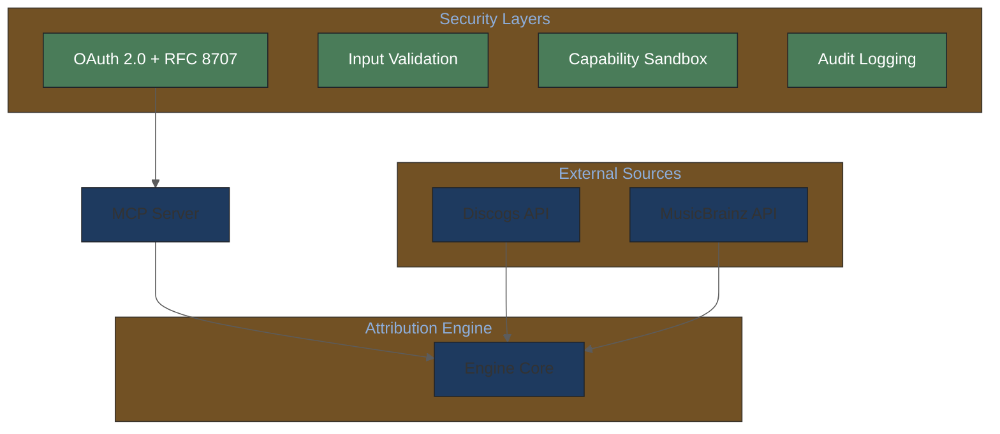

# Figure & Documentation Improvement Plan

**Created**: 2026-02-03
**Status**: Reviewed & Updated
**Reviewer**: Claude Plan Agent (2026-02-03)
**Scope**: Mermaid diagrams, Nano Banana Pro figures, documentation updates based on new research

---

## Executive Summary

This plan identifies opportunities to improve the system documentation based on the new research syntheses:
- [music-attribution-research-2026-02-03.md](../knowledge-base/domain/music-industry/music-attribution-research-2026-02-03.md) - 200+ papers
- [agentic-systems-research-2026-02-03.md](../knowledge-base/technical/agentic-systems-research-2026-02-03.md) - 15+ sources

### Gap Analysis Summary

| Category | Current | Needed | Priority |
|----------|---------|--------|----------|
| Mermaid diagrams | 18 | +9 new | High |
| Mermaid updates | - | 4 updates | Medium |
| Nano Banana Pro figures | 8 | +4 new | Medium |
| Documentation updates | - | 5 files | High |

### Reviewer Recommendations Applied

1. Fixed file path: `music/` → `domain/music-industry/`
2. Corrected diagram count: 17 → 18 (missed conversation flow in chat-interface-prd.md)
3. Elevated Oracle Problem diagram to HIGH priority
4. Added 3 high-value diagrams: Data Provenance Taxonomy, Watermark Failure Matrix, Deterrence Economics

---

## 1. Mermaid Diagram Inventory

### 1.1 Existing Diagrams (18 total)

| Location | Diagram Type | Description | Update Needed? |
|----------|-------------|-------------|----------------|
| `architecture/README.md` | flowchart | System architecture | Yes - add security layers |
| `architecture/README.md` | sequence | Entity resolution flow | No |
| `architecture/README.md` | sequence | MCP request flow | Yes - add compliance logging |
| `architecture/README.md` | erDiagram | Database schema | No |
| `architecture/README.md` | stateDiagram | A0-A3 state machine | No |
| `architecture/README.md` | flowchart | Confidence scoring | Yes - add attribution types |
| `knowledge-base/README.md` | flowchart | Knowledge hierarchy | Yes - add research files |
| `prd/README.md` | flowchart | PRD hierarchy | No |
| `prd/vision-v1.md` | flowchart | Target users | No |
| `prd/vision-v1.md` | flowchart | System design | No |
| `prd/vision-v1.md` | erDiagram | Data model | No |
| `prd/attribution-engine-prd.md` | flowchart | Pipeline overview | Yes - single-agent notation |
| `prd/chat-interface-prd.md` | stateDiagram | Workflow | No |
| `prd/chat-interface-prd.md` | flowchart | Conversation flow (line 99) | No |
| `prd/chat-interface-prd.md` | flowchart | Components | Yes - add memory layer |
| `prd/mcp-server-prd.md` | flowchart | Trust tiers | Yes - add Nov 2025 spec |
| `prd/mcp-server-prd.md` | flowchart | MCP tools | No |
| `prd/mcp-server-prd.md` | sequence | ITA flow | No |

### 1.2 New Mermaid Diagrams Needed

#### HIGH PRIORITY

**1. MCP Security Architecture** (for `mcp-server-prd.md` Section 5.1)
```
Location: docs/prd/mcp-server-prd.md
Type: flowchart
Purpose: Visualize four-layer security architecture
Content: Authentication → Input Validation → Capability Sandbox → Audit
Research basis: 40.71% attack success rate, MCPSecBench findings
```

**2. Memory Architecture** (for `chat-interface-prd.md` Section 4.4)
```
Location: docs/prd/chat-interface-prd.md
Type: flowchart
Purpose: Visualize hybrid memory pattern
Content: Short-term (Redis) → Long-term (pgvector) → Semantic → Procedural
Research basis: RAG → Contextual Memory shift, 10+ turn support
```

**3. Single-Agent Attribution Pipeline** (for `technical/agentic-systems/SYNTHESIS.md`)
```
Location: docs/knowledge-base/technical/agentic-systems/SYNTHESIS.md
Type: flowchart
Purpose: Show why single-agent chosen over multi-agent
Content: Sequential: Fetch → Resolve → Score (tool orchestration, not agent split)
Research basis: 17.2x error amplification, Google scaling principles
```

**4. Oracle Problem Visualization** (for `vision-v1.md` Section 8.1)
```
Location: docs/prd/vision-v1.md (Section 8.1 Research-Informed Risk Analysis)
Type: flowchart
Purpose: Visualize three epistemic barriers - foundational to the system positioning
Content: Training verification ✗, Influence attribution ✗, Absence proof ✗
Research basis: [Morreale et al. (2025)](https://arxiv.org/abs/2510.08062) Attribution-by-design, Section 2.1
```

**5. Data Provenance Taxonomy (L1-L4)** (for `attribution-engine-prd.md`)
```
Location: docs/prd/attribution-engine-prd.md (new Section 5.5)
Type: flowchart
Purpose: Show why the system operates at L3 (Traceability) level
Content: L1 (Non-usability) → L2 (Privacy) → L3 (Traceability) ← the system → L4 (Deletability)
Research basis: [Longpre et al. (2024)](https://proceedings.mlr.press/v235/longpre24b.html) Data Provenance Initiative - 80%+ content has non-commercial restrictions
```

**6. Watermark Failure Matrix** (for `domain/music-industry/SYNTHESIS.md`)
```
Location: docs/knowledge-base/domain/music-industry/SYNTHESIS.md
Type: flowchart or table visualization
Purpose: Explain why declaration-based (A0-A3) instead of embedded attribution
Content: Attack types vs survival rates (<20% for neural codecs Encodec/DAC)
Research basis: [Özer et al. (2025)](https://arxiv.org/abs/2505.19663) RAW-Bench study - neural codecs defeat watermarks
```

**7. Deterrence Economics Model** (for `mcp-server-prd.md` Section 8.2)
```
Location: docs/prd/mcp-server-prd.md (Section 8.2)
Type: flowchart
Purpose: Visualize compliance formula and HADOPI evidence
Content: p × d × F ≥ g formula, audit logging → awareness → compliance
Research basis: [Becker (1968)](https://www.nber.org/system/files/chapters/c3625/c3625.pdf) Economics of Crime; [Danaher et al. (2014)](https://onlinelibrary.wiley.com/doi/abs/10.1111/joie.12056) HADOPI study
```

#### MEDIUM PRIORITY

**8. EU AI Act Compliance Timeline** (for `vision-v1.md`)
```
Location: docs/prd/vision-v1.md (Section 1.4)
Type: timeline or gantt
Purpose: Show regulatory deadlines affecting the system
Content: Aug 2025 (GPAI) → Aug 2026 (high-risk) → Aug 2027 (regulated products)
Research basis: [DLA Piper (Aug 2025)](https://www.dlapiper.com/en-us/insights/publications/2025/08/latest-wave-of-obligations-under-the-eu-ai-act-take-effect) EU AI Act enforcement timeline
```

**9. Agentic Commerce Protocol Landscape** (for `mcp/SYNTHESIS.md`)
```
Location: docs/knowledge-base/technical/mcp/SYNTHESIS.md
Type: flowchart
Purpose: Show protocol relationships and the system positioning
Content: ACP (OpenAI) ↔ AP2 (Google) ↔ TAP (Visa) ← MCP (foundation layer)
Research basis: [McKinsey (2025)](https://www.mckinsey.com/capabilities/quantumblack/our-insights/the-agentic-commerce-opportunity-how-ai-agents-are-ushering-in-a-new-era-for-consumers-and-merchants) Agentic Commerce Opportunity
```

---

## 2. Mermaid Diagram Updates

### 2.1 Update: System Architecture (`architecture/README.md`)

**Current**: Shows basic component layout
**Update**: Add security layers annotation



### 2.2 Update: Knowledge Base Hierarchy (`knowledge-base/README.md`)

**Current**: Shows domain/technical/sources structure
**Update**: Add music/ and new research files

```diff
+ KB --> M[music/<br/>Music Research]
+ M --> MR[music-attribution-research<br/>200+ papers]
+ T --> TA[agentic-systems/<br/>Agent Architecture]
+ TA --> TAR[agentic-systems-research<br/>15+ sources]
```

### 2.3 Update: Confidence Scoring (`architecture/README.md`)

**Current**: Shows scoring algorithm
**Update**: Add attribution type distinction

```diff
+ SCORE --> TYPE{Attribution<br/>Type?}
+ TYPE -->|Artist confirmed| VERIFIED[Verified<br/>Cryptographic]
+ TYPE -->|Source agreement| CORR[Corroborative<br/>Similarity-based]
+ CORR --> DISCLAIMER[Add Disclaimer]
```

### 2.4 Update: Chat Components (`chat-interface-prd.md`)

**Current**: Shows UI, Engine, Session State
**Update**: Add Memory layer

```diff
+ subgraph memory[" Memory Layer "]
+     STM[Short-term<br/>Redis]
+     LTM[Long-term<br/>pgvector]
+     SEM[Semantic<br/>Entity Graph]
+ end
+ CE <--> memory
```

---

## 3. Nano Banana Pro Figure Plans

### 3.1 Existing Figures (8 total, all generated)

| ID | Title | Status | Update Needed? |
|----|-------|--------|----------------|
| fig-tech-01 | Attribution Pipeline | Generated | Yes - single-agent |
| fig-tech-02 | MCP Architecture | Generated | Yes - security layers |
| fig-tech-03 | Confidence Scoring | Generated | Yes - attribution types |
| fig-tech-04 | Database Schema | Generated | No |
| fig-domain-01 | Attribution Crisis | Generated | No |
| fig-domain-02 | Attribution Solution | Generated | No |
| fig-domain-03 | MCP AI Attribution | Generated | Yes - ITA framework |
| fig-domain-04 | Trust Tiers | Generated | Yes - Nov 2025 spec |

### 3.2 New Figure Plans Needed

#### HIGH PRIORITY

**fig-tech-05: MCP Security Threat Model**
```yaml
id: fig-tech-05
title: "MCP Security Threat Model"
type: technical
audience: developers
purpose: Visualize attack surfaces and mitigations
content:
  - Four attack surfaces (manifest, communication, resource, execution)
  - 40.71% attack success rate statistic
  - Three-stage detection pipeline
  - Graduated containment levels
research_basis: MCPSecBench 2025, Red Hat MCP Security
```

**fig-domain-05: EU AI Act Compliance**
```yaml
id: fig-domain-05
title: "EU AI Act Compliance for Music AI"
type: domain
audience: music industry
purpose: Show regulatory context and the system value
content:
  - Timeline: Aug 2025 → Aug 2026 → Aug 2027
  - €35M penalty exposure
  - GPAI obligations (training data transparency)
  - The system as compliance enabler
research_basis: DLA Piper 2025, EU AI Act official timeline
```

#### MEDIUM PRIORITY

**fig-tech-06: Single vs Multi-Agent Decision**
```yaml
id: fig-tech-06
title: "Why Single-Agent for Attribution"
type: technical
audience: developers
purpose: Justify architectural decision with data
content:
  - Decision tree: Sequential vs Parallel tasks
  - 17.2x error amplification statistic
  - 45% accuracy threshold
  - Tool orchestration vs agent splitting
research_basis: Google Research 2025, Analytics Vidhya 2026
```

**fig-domain-06: Agentic Commerce Ecosystem**
```yaml
id: fig-domain-06
title: "Attribution in Agentic Commerce"
type: domain
audience: music industry + AI platforms
purpose: Position the system in protocol landscape
content:
  - Protocol logos: ACP, AP2, TAP, A2A, MCP
  - The system as verified data source
  - AI hallucination problem (ACE benchmark)
  - Structured attribution prevents fabrication
research_basis: BCG 2025, McKinsey 2025, ACE Benchmark
```

---

## 4. Documentation Updates

### 4.1 Files Requiring Updates

| File | Section | Update Type | Priority |
|------|---------|-------------|----------|
| `prd/vision-v1.md` | 1.4 Regulatory | Add EU AI Act timeline | High |
| `architecture/README.md` | System | Add security layer annotations | High |
| `prd/attribution-engine-prd.md` | 3.1 | Add single-agent justification | Medium |
| `knowledge-base/README.md` | Structure | Update diagram with new files | Medium |
| `prd/SYNTHESIS.md` | All | Create cross-PRD synthesis | Low |

### 4.2 New Documentation Recommended

| File | Purpose | Priority |
|------|---------|----------|
| `knowledge-base/domain/legal/eu-ai-act-2025.md` | EU AI Act summary for the system | Medium |
| `knowledge-base/technical/security/SYNTHESIS.md` | Security patterns synthesis | Medium |
| `architecture/adr/0005-single-agent-architecture.md` | ADR for agent architecture decision | High |

---

## 5. Implementation Roadmap

### Phase 1: Critical Updates (Week 1) ✓ COMPLETED

**Mermaid Diagrams**:
- [x] Add MCP Security Architecture to `mcp-server-prd.md`
- [x] Add Memory Architecture to `chat-interface-prd.md`
- [x] Update Knowledge Base hierarchy diagram

**Documentation**:
- [x] Create ADR-0005 for single-agent decision
- [x] Add Oracle Problem diagram to `vision-v1.md`

### Phase 2: Enhanced Visuals (Week 2) ✓ COMPLETED

**Mermaid Diagrams**:
- [x] Update System Architecture with security layers
- [x] Add Data Provenance Taxonomy diagram
- [x] Add Agentic Commerce protocol diagram
- [x] Add Deterrence Economics diagram

**Nano Banana Pro**:
- [x] Create fig-tech-05 plan: MCP Security Threat Model
- [x] Create fig-domain-05 plan: EU AI Act Compliance

### Phase 3: Polish (Week 3) ✓ COMPLETED

**Nano Banana Pro**:
- [x] Create fig-tech-06 plan: Single vs Multi-Agent
- [x] Create fig-domain-06 plan: Agentic Commerce Ecosystem
- [ ] Update existing figures (tech-01, tech-02, tech-03, domain-03, domain-04) - FUTURE
- [ ] Generate figures via Nano Banana Pro - FUTURE

**Documentation**:
- [ ] Create `prd/SYNTHESIS.md` cross-PRD summary - FUTURE
- [ ] Create security SYNTHESIS.md - FUTURE

---

## 6. Review Checklist

### Mermaid Style Compliance
- [ ] All diagrams use standard init block with brand colors
- [ ] Consistent node naming conventions
- [ ] Subgraph labels follow style guide
- [ ] Links use correct arrow types

### Nano Banana Pro Style Compliance
- [ ] Herman Miller aesthetic maintained
- [ ] Off-white background (#F8F6F0)
- [ ] No sci-fi/neon effects
- [ ] Semantic tags only in content specs

### Research Citation Compliance
- [ ] All new diagrams cite research basis
- [ ] Statistics include source references
- [ ] Cross-references to knowledge base included

---

## 7. Success Metrics

| Metric | Target | Measurement |
|--------|--------|-------------|
| Mermaid diagram coverage | 27 total (18 + 9 new) | Count in docs |
| Nano Banana Pro figures | 12 total | Count in assets/ |
| Research citation rate | 100% | New content audit |
| Style guide compliance | 100% | Manual review |

## 8. Review Process

### 8.1 Research Accuracy Review

For each new diagram:
1. **Citation verification**: Does the diagram cite specific research source with section reference?
2. **Statistic accuracy**: Are numbers (40.71%, 17.2x, €35M) correct per source?
3. **Conceptual accuracy**: Does visualization correctly represent research findings?

### 8.2 Style Guide Compliance Checklist

For Mermaid diagrams:
- [ ] Uses complete init block from MERMAID-STYLE-GUIDE.md
- [ ] Background color: `#fcfaf5`
- [ ] Primary color: `#1E3A5F` (System Deep Blue)
- [ ] MCP/Protocol color: `#2E7D7B` (Teal)
- [ ] User/Action color: `#D4A03C` (Gold)
- [ ] Success/Data color: `#4A7C59` (Forest Green)
- [ ] Uses classDef for reusable styles

### 8.3 Acceptance Criteria

A diagram is complete when:
1. Research basis is explicitly cited with [Author, Year] format
2. Style guide compliance checklist passes
3. Renders correctly in GitHub markdown preview
4. Cross-referenced in relevant PRD/knowledge-base file

---

## Appendix: Style References

- [MERMAID-STYLE-GUIDE.md](../figures/MERMAID-STYLE-GUIDE.md)
- [STYLE-GUIDE.md](../figures/STYLE-GUIDE.md)
- [CONTENT-TEMPLATE.md](../figures/CONTENT-TEMPLATE.md)

---

## Changelog

| Date | Change | Author |
|------|--------|--------|
| 2026-02-03 | Initial draft | Claude |
| 2026-02-03 | Phase 1-3 execution complete | Claude |
