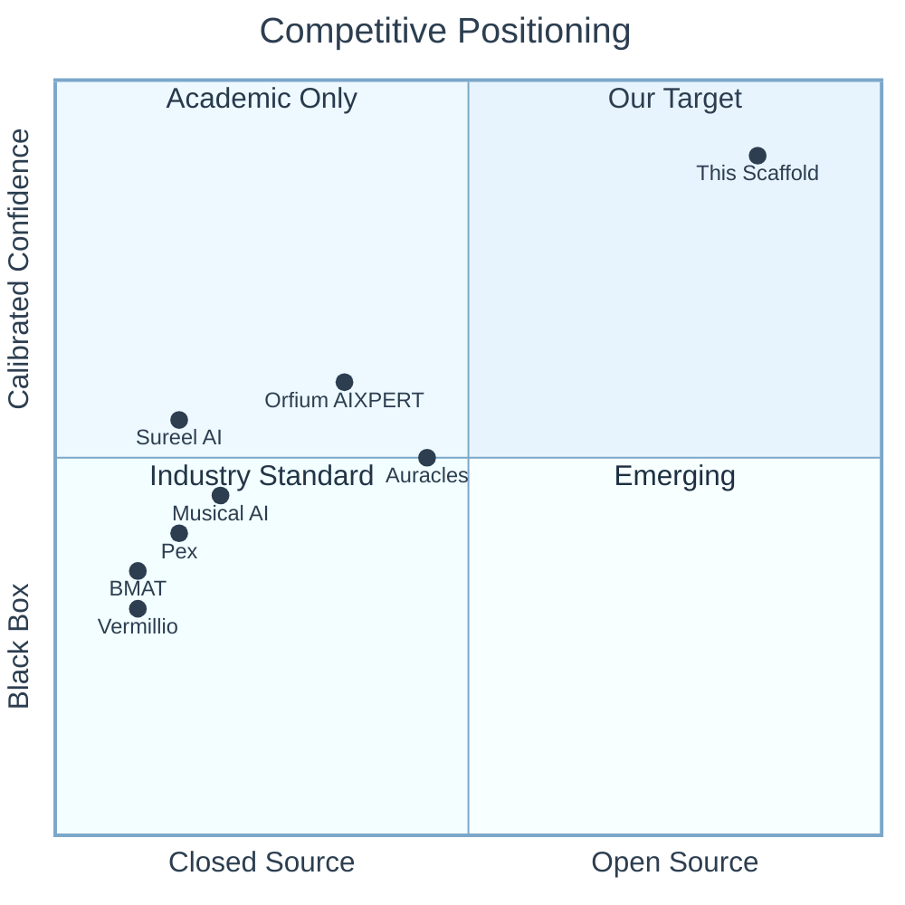
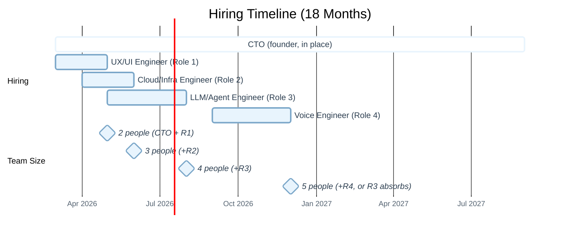

# 18-Month Managerial Roadmap: Music Attribution Scaffold

> **Document**: Probabilistic multi-hypothesis implementation plan for a 2-4 engineer team
> **Date**: 2026-02-16
> **Author**: Petteri Teikari (interim CTO) + Claude Code
> **Funding assumption**: Pre-seed ($1-2M) or Seed ($2-5M)
> **Companion to**: [SSRN No. 6109087](https://papers.ssrn.com/sol3/papers.cfm?abstract_id=6109087)

---

## Table of Contents

1. [User Prompt (Verbatim)](#1-user-prompt-verbatim)
2. [Executive Summary](#2-executive-summary)
3. [Competitive Positioning](#3-competitive-positioning)
4. [Team Roles & Hiring Plan](#4-team-roles--hiring-plan)
5. [18-Month Milestone Roadmap](#5-18-month-milestone-roadmap)
6. [Multi-Hypothesis Technology Decisions](#6-multi-hypothesis-technology-decisions)
7. [Financial Planning](#7-financial-planning)
8. [Risk Matrix](#8-risk-matrix)
9. [GitHub Project Board Structure](#9-github-project-board-structure)
10. [Pitch Deck Figure Plans](#10-pitch-deck-figure-plans)

---

## 1. User Prompt (Verbatim)

<details>
<summary>Click to expand original prompt</summary>

Could we create a feat/managerial-layer that mostly involves about improving the Github Project for division of labor type of project planning! Imagine that we were pitching for investors with 2-4 engineers hired for this project, and what would be the 18-month planning when developing what you can now think of all these companies doing: ## Music AI Attribution Landscape

The music AI attribution space is undergoing rapid consolidation. This section provides a compact overview — see the [full landscape report](docs/planning/music-tech-landscape/README.md) for detailed company profiles, academic papers, and buy-vs-build analysis.

### Attribution Infrastructure

| Company | Approach | Funding | Key Differentiator |
|---|---|---|---|
| [**Sureel AI**](https://sureel.ai) | Training-time gradient tracking | Undisclosed | 86–90% accuracy claimed; STIM partnership; 5 patents |
| [**Musical AI**](https://musical.ai) | Training-time influence tracking | $6M | Fairly Trained certified; Beatoven.ai integration |
| [**Vermillio**](https://vermillio.com) | Content monitoring (TraceID) | $16M | Sony Music's first AI investment; TIME100 |
| [**ProRata.ai**](https://prorata.ai) | Cross-media attribution | $40M | UMG partnership; beyond music |
| [**Pex**](https://pex.com) | Content identification | Established | Positioning for AI attribution |
| [**Auracles**](https://auracles.io) | Artist-controlled digital identity & permissions | Undisclosed | Founded by Imogen Heap; artist-verified metadata layer |
| [**Klay Vision**](https://klay.vision) | Large Music Model with per-use attribution | Licensed by all 3 majors | First to secure UMG + Sony + WMG licensing (Nov 2025) |
| [**SoundPatrol**](https://soundpatrol.com) | Neural fingerprinting (semantic similarity) | Undisclosed | UMG & Sony collaboration; catches AI derivatives beyond exact matching |
| [**Orfium (AIXPERT)**](https://orfium.com) | Explainable AI for copyright attribution | EUR 7.5M EU grant | 3-year research consortium; 3 of 135 proposals selected |
| [**Audible Magic**](https://audiblemagic.com) | Automated content recognition | Established | 25+ years; Udio partnership; "Broad Spectrum" altered-audio detection |
| [**BMAT**](https://bmat.com) | Audio fingerprinting at scale | Established | 80M IDs/day; 100+ CMOs; 2,000+ labels in 85 countries |
| [**Muso.AI**](https://muso.ai) | Verified music credits platform | Established | 50M+ verified tracks; identity verification via ID scan |
| **This scaffold** | A0–A3 assurance + conformal prediction | Open-source | Transparent, auditable, MCP-native |

. As this is now the "base boilerplate scaffold" for this project and the idea was that it would be now easier to plan who does what in this probabilistic PRD and ensuring that multiple people can work efficiently on the same project! Me as a human interim CTO could identify certain roles: 1) (Agentic) UX/UI expert who understands how user behavior can be learning, how we can hyperpersonalize the attribution annotation process, how the agentic frontend (AG-UI, A2UI, etc.) can allow better UX and better throughput. 2) Cloud/Infrastructure expert who knows how to deploy things in cost-efficient manner so that we are cost-efficient from scratch, and knows how to set cloud-agnostic deployment e.g. on Hetzner if it us who have to pay for credits. And if we would get AWS/Google/Azure credits in some startup program, make sure that the expert knows how to do cloud-agnostic deployments also on these platforms that love to do vendor lock-ins with their "drug dealer" business model and get you to use their platform-specific services (a bit like postgres, but AWS vendor lock-in type :D). Cloud expert could know how to use Pulumi for IaC then for deployments of Dockers with Kubernetes (or Nomad) skills. 3) There could be a LLM/multi-agent expert then who then knows how to create music ontologies, knowledge graphs, do production-grade LLM systems involving tools such as LangGraph, Pydantic, Langfuse and Braintrust. 4) If we do the voice agent upsell (premium feature), then there should be person who understands voice-agent system beyond the typical elevanlabs demo use, see e.g. /home/petteri/Dropbox/github-personal/dpp-agents/knowledge-base/documentation/prd/voice-agent-tech-prd.md from older repo and the voice PRD in this repo. A person who likes to attend webinars like https://luma.com/cvnyuvrq "Voice Agent Webinar with Simplismart & Pipecat [...]". the LLM multi-agent person could be the same as the voice agent person if we need to be cost-aware or/and have problems finding these roles. You can do some preliminary CFO-like cost planning for the 12-18 month pre-seed round / seed round with average salaries in few different locations 1) San Francisco (very high salaries), 2) London/Zürich (high Euro salaries), 3) Helsinki (middle Euro salaries), and 4) Warsaw (lower Euro salaries). The cost planning could be some prelim Monte Carlo type of planning for financial runway (for pre-seed or seed). Let's focus on the technical tasks, roles and milestones and the financial planning can be more hand-waivy then. So could you create more Issues to the Project and plan directly for the Github Project roadmap how the 18-month project could look like if we would get funding to build something like this. Plan with reviewer agents comprehensively a multi-hypothesis probabilistic implementation plan, and keep the different considered options while offering your recommended approach for our highest-confidence MVP.

</details>

---

## 2. Executive Summary

### The Opportunity

The music AI attribution space has attracted $300M+ in equity funding (Suno $250M, Vermillio $16M, Musical AI $6M, ProRata $40M) but **no player offers transparent, auditable attribution with calibrated confidence**. Every competitor is a black box. Our scaffold is the only open-source, research-backed system with:

- **A0-A3 assurance levels** mapping to ISRC/ISWC/ISNI standards
- **Conformal prediction** for calibrated confidence intervals
- **MCP-native consent infrastructure** for machine-readable permissions
- **Probabilistic PRD** capturing deployment flexibility across team archetypes

### The Plan

| Phase | Timeline | Milestone | Team Size |
|-------|----------|-----------|-----------|
| **Phase 1: Foundation** | M0-M6 | Production-ready attribution API + agentic UI | 2-3 engineers |
| **Phase 2: Scale** | M6-M12 | Knowledge graph, CMO pilot, voice agent beta | 3-4 engineers |
| **Phase 3: Ecosystem** | M12-M18 | Multi-agent orchestration, edge deployment, enterprise | 4 engineers |

### Recommended Approach (Highest-Confidence MVP)

**Helsinki-based core team** (2 initial hires) + **1 Warsaw-based infrastructure engineer**, scaling to 4 by M6. Start with Hetzner for cost efficiency, cloud-agnostic via Pulumi, API-based LLM inference. MVP targets independent artists and small labels (Auracles-aligned user base).

---

## 3. Competitive Positioning

### Our Differentiators vs. Every Competitor



### Strategic Positioning: The "Neutral Infrastructure" Play

Unlike Sureel (STIM-aligned), Musical AI (Fairly Trained-aligned), or Vermillio (Sony-aligned), we are **not locked to any single industry partner**. This neutrality is our moat for:

1. **CMOs** that want attribution without giving data to a competitor's platform
2. **Independent artists** who distrust label-backed solutions
3. **Regulators** who need auditable, explainable systems for EU AI Act compliance
4. **Researchers** who need reproducible attribution benchmarks

---

## 4. Team Roles & Hiring Plan

### Role Definitions

#### Role 1: Agentic UX/UI Engineer

**Focus**: Hyperpersonalized attribution annotation, adaptive UI, behavioral analytics

| Responsibility | Technical Stack |
|---------------|----------------|
| Attribution review queue with AI suggestions (approve/reject diffs) | Next.js 15, Tailwind v4, Jotai |
| Adaptive UI proficiency model (learning user behavior) | PostHog, feature flags, A/B testing |
| AG-UI / CopilotKit sidebar for conversational attribution | CopilotKit, SSE streaming |
| Accessibility (WCAG 2.1 AA), responsive design | vitest-axe, Playwright axe-core |
| Batch operations, progressive disclosure, smart defaults | React Testing Library, Vitest |

**Hiring priority**: M0-M1 (immediate)
**Where to find**: Design engineering communities, CopilotKit Discord, AG-UI early adopters

#### Role 2: Cloud/Infrastructure Engineer

**Focus**: Cost-efficient, cloud-agnostic deployment with IaC-first approach

| Responsibility | Technical Stack |
|---------------|----------------|
| Pulumi IaC for multi-cloud (Hetzner primary, AWS/GCP fallback) | Pulumi (Python SDK), Docker |
| Kubernetes (or Nomad) orchestration | k3s (lightweight) or Nomad |
| CI/CD pipeline hardening (GitHub Actions → ArgoCD) | GitHub Actions, ArgoCD |
| Database operations (PostgreSQL + pgvector + Apache AGE) | PostgreSQL 16, Alembic |
| Observability stack (Prometheus, Grafana, Loki, Tempo) | OpenTelemetry, Grafana stack |
| FinOps dashboard and cost optimization | Infracost, custom dashboards |
| Security (secrets management, network policies, RBAC) | Vault/SOPS, Falco |

**Hiring priority**: M1-M2
**Where to find**: CNCF community, Pulumi Discord, Hetzner power users, NixOS community

#### Role 3: LLM/Multi-Agent Engineer

**Focus**: Music ontologies, knowledge graphs, production-grade LLM systems

| Responsibility | Technical Stack |
|---------------|----------------|
| Music ontology and knowledge graph construction | Apache AGE (PostgreSQL), RDF/OWL |
| Multi-agent orchestration for attribution pipelines | PydanticAI, LangGraph |
| Entity resolution with Bayesian confidence updating | Splink, pgmpy |
| LLM observability and evaluation | Langfuse, Braintrust |
| MCP tool development (attribution, permissions, metadata) | MCP SDK, FastAPI |
| Prompt engineering and model routing | PydanticAI FallbackModel |
| Training data attribution research (DataInf, TRAK, TracIn) | PyTorch, research papers |

**Hiring priority**: M2-M3
**Where to find**: PydanticAI community, LangChain/LangGraph contributors, music information retrieval (MIR) conferences (ISMIR)

#### Role 4: Voice Agent Engineer (Phase 2, can merge with Role 3)

**Focus**: Sub-400ms real-time voice pipeline for premium attribution queries

| Responsibility | Technical Stack |
|---------------|----------------|
| Voice pipeline orchestration | Pipecat, Daily.co WebRTC |
| STT integration (streaming, multilingual) | Deepgram Nova-2, Whisper v3 |
| TTS with persona consistency | Kokoro (open-weight), ElevenLabs fallback |
| Persona drift monitoring | Sentence-transformers, Langfuse |
| Latency optimization (<400ms TTFB) | Edge inference, connection pooling |
| Voice-first UX design collaboration | Vapi (demo) → Pipecat (production) |

**Hiring priority**: M6-M8 (Phase 2 start)
**Where to find**: Pipecat community, Daily.co developer community, real-time audio engineers, WebRTC specialists

### Hiring Timeline



### Role Merging Strategy (Cost-Constrained)

If funding is tight (pre-seed < $1M), merge Role 3 + Role 4:

| Scenario | Team | Monthly Burn | Runway ($1M) |
|----------|------|-------------|--------------|
| **4 roles, 4 people** | CTO + R1 + R2 + R3 + R4 | $35-45K | 22-28 months |
| **4 roles, 3 people** (R3+R4 merged) | CTO + R1 + R2 + R3/R4 | $28-35K | 28-36 months |
| **3 roles, 2 people** (MVP-only) | CTO + R1 + R2 | $20-25K | 40-50 months |

**Recommendation**: Start with 3 people (CTO + R1 + R2), hire R3 at M3, evaluate R4 need at M8.

---

## 5. 18-Month Milestone Roadmap

### Phase 1: Foundation (M0-M6) — "Make It Work"

**Goal**: Production-ready attribution API + agentic UI with real data sources

**Team**: CTO + UX/UI Engineer + Cloud/Infra Engineer (+ LLM Engineer from M3)

#### M0-M2: Infrastructure & API Hardening

| Task | Owner | Priority | Dependencies |
|------|-------|----------|-------------|
| Pulumi IaC for Hetzner (PostgreSQL, app server, Redis) | R2 | P0 | — |
| Docker Compose → Kubernetes migration (k3s) | R2 | P0 | Pulumi |
| CI/CD hardening: ArgoCD for GitOps deployment | R2 | P1 | k3s |
| OpenTelemetry auto-instrumentation for FastAPI | R2 | P1 | k3s |
| Grafana + Prometheus + Loki observability stack | R2 | P1 | k3s |
| Wire BatchEnvelope into ETL pipeline | CTO | P1 | — |
| Attribution API rate limiting (slowapi) | CTO | P1 | — |
| Frontend: attribution review queue MVP | R1 | P0 | — |
| Frontend: batch approve/reject workflow | R1 | P0 | Review queue |
| Frontend: responsive mobile layout | R1 | P1 | Review queue |
| PostHog analytics instrumentation | R1 | P1 | Review queue |

#### M2-M4: Real Data Integration

| Task | Owner | Priority | Dependencies |
|------|-------|----------|-------------|
| MusicBrainz bulk data pipeline (not just API) | R3/CTO | P0 | Infra ready |
| Discogs data pipeline with rate limiting | R3/CTO | P0 | Infra ready |
| AcoustID fingerprinting at scale | R3/CTO | P1 | Audio pipeline |
| Entity resolution with real data (Splink tuning) | R3 | P0 | Data pipelines |
| Conformal prediction calibration on real dataset | R3 | P0 | Entity resolution |
| Golden dataset creation (100 manually-verified works) | CTO + R3 | P0 | Data pipelines |
| Frontend: real-time confidence visualization | R1 | P0 | API endpoints |
| Frontend: data source comparison view | R1 | P1 | Multi-source API |
| Secrets management (Vault or SOPS) | R2 | P1 | k3s |
| Automated database backups | R2 | P1 | PostgreSQL |

#### M4-M6: MVP Launch

| Task | Owner | Priority | Dependencies |
|------|-------|----------|-------------|
| MCP permission tools (check_permissions, query_consent) | R3 | P0 | MCP SDK |
| Production AG-UI adapter (full 31 event types) | R1 + R3 | P0 | CopilotKit |
| A2A agent discovery via Agent Cards | R3 | P1 | MCP tools |
| ISRC/ISWC/ISNI validation pipeline | R3 | P0 | Entity resolution |
| Attribution evaluation framework (precision/recall/F1) | R3 | P0 | Golden dataset |
| Benchmark against Musical AI / Sureel baselines | CTO + R3 | P1 | Eval framework |
| Frontend: onboarding flow for independent artists | R1 | P0 | Auth system |
| Auth system (OAuth 2.1 with three-tier access) | R2 | P0 | — |
| Staging environment on Hetzner | R2 | P0 | Pulumi |
| Load testing (k6 or locust) | R2 | P1 | Staging |
| **MVP DEMO to early users** | ALL | P0 | Everything above |

### Phase 2: Scale (M6-M12) — "Make It Good"

**Goal**: Knowledge graph, CMO pilot readiness, voice agent beta, first paying users

**Team**: CTO + R1 + R2 + R3 + R4 (or R3 absorbing R4)

#### M6-M9: Knowledge Graph & Intelligence Layer

| Task | Owner | Priority | Dependencies |
|------|-------|----------|-------------|
| Apache AGE (graph) integration with PostgreSQL | R3 | P0 | Phase 1 complete |
| Music ontology schema (works, recordings, artists, labels) | R3 | P0 | AGE running |
| GraphRAG for attribution chain reasoning | R3 | P1 | Knowledge graph |
| Langfuse integration for LLM observability | R3 | P1 | Agent system |
| Braintrust eval framework for agent quality | R3 | P1 | Langfuse |
| Multi-agent pipeline: metadata → resolution → scoring | R3 | P0 | PydanticAI agents |
| LangGraph orchestration for complex workflows | R3 | P1 | Multi-agent |
| STIM CMO pilot observer interface | CTO + R3 | P0 | Knowledge graph |
| Fairly Trained certification integration | CTO | P1 | API ready |
| Voice agent: Vapi demo prototype | R4 | P0 | — |
| Voice agent: Pipecat migration plan | R4 | P1 | Vapi demo |
| Frontend: knowledge graph visualization | R1 | P1 | AGE integration |
| Frontend: voice agent upsell surface (Pro tier) | R1 | P0 | Voice demo |
| Adaptive UI proficiency model | R1 | P1 | PostHog data |
| Multi-cloud Pulumi: AWS/GCP targets | R2 | P1 | Startup credits |
| Auto-scaling policies | R2 | P1 | k8s/Nomad |
| CDN for static assets | R2 | P1 | — |

#### M9-M12: Production Hardening & First Revenue

| Task | Owner | Priority | Dependencies |
|------|-------|----------|-------------|
| EU AI Act GPAI compliance reporting pipeline | CTO + R2 | P0 | Audit trail |
| TDM rights reservation monitoring | CTO + R3 | P1 | MCP tools |
| SoundExchange ISRC lookup MCP tool | R3 | P1 | MCP SDK |
| Content identification system (multi-fingerprint) | R3 | P0 | Audio pipeline |
| Voice agent: Pipecat production (<400ms latency) | R4 | P0 | Pipecat migration |
| Voice agent: persona drift monitoring (Langfuse) | R4 | P1 | Voice production |
| Stripe integration for Pro tier billing | R2 + R1 | P0 | Auth system |
| Frontend: enterprise dashboard (multi-user) | R1 | P1 | Auth + billing |
| Frontend: attribution diff review (AI suggestions) | R1 | P0 | Multi-agent |
| Penetration testing | R2 | P1 | Production |
| SOC 2 Type 1 preparation | R2 + CTO | P1 | Security audit |
| **First paying customers (target: 5-10)** | CTO | P0 | Billing + MVP |

### Phase 3: Ecosystem (M12-M18) — "Make It Scale"

**Goal**: Multi-agent orchestration, edge deployment, enterprise features, Series A readiness

**Team**: Full team (4 engineers + CTO)

#### M12-M15: Platform & Partnerships

| Task | Owner | Priority | Dependencies |
|------|-------|----------|-------------|
| Agentic commerce protocol (MCP + ACP) | R3 | P1 | MCP production |
| Agent interoperability (MCP + A2A) | R3 | P0 | Multi-agent stable |
| Musical AI training data exchange API | R3 | P1 | Partnership |
| Sureel AI audio identification connector | R3 | P1 | Partnership |
| Edge inference strategy (Cloudflare Workers) | R2 | P1 | — |
| DDEX ERN 4.3.2 connector | R3 | P1 | Entity resolution |
| C2PA manifest generation for AttributionRecords | R3 | P1 | Provenance chain |
| Voice agent: multi-language STT/TTS | R4 | P1 | Voice production |
| Voice agent: emotion detection (Hume AI eval) | R4 | P2 | Voice production |
| Frontend: white-label theming for enterprise | R1 | P1 | Design system |
| Frontend: self-serve onboarding flow | R1 | P0 | Billing |
| ISO 42001 + EU AI Act dual-track compliance | CTO + R2 | P1 | GPAI pipeline |

#### M15-M18: Series A Preparation

| Task | Owner | Priority | Dependencies |
|------|-------|----------|-------------|
| Market intelligence monitoring system | CTO | P1 | — |
| Attribution accuracy monitoring (periodic eval) | R3 | P0 | Golden dataset v2 |
| Partnership health metrics dashboard | CTO + R1 | P1 | Partnerships |
| Automated regulatory monitoring dashboard | CTO + R2 | P1 | Compliance |
| Performance benchmarks (attribution speed, accuracy) | R3 + R2 | P0 | Eval framework |
| Bayesian network signal integration (pgmpy) | R3 | P1 | Knowledge graph |
| ETL orchestration (Prefect 3.x) | R2 + R3 | P1 | Pipeline maturity |
| ML monitoring (Evidently integration) | R3 | P1 | Model in production |
| SkyPilot multi-cloud training config | R2 | P2 | GPU workloads |
| **Series A pitch materials** | CTO | P0 | All metrics |
| **Target: 50+ paying customers, 3+ CMO pilots** | CTO | P0 | Everything |

---

## 6. Multi-Hypothesis Technology Decisions

For each major decision, we present the options with confidence weights and our recommendation.

### 6.1 Compute Platform

| Option | Confidence | Pros | Cons |
|--------|-----------|------|------|
| **Hetzner (recommended)** | 0.55 | 3-5x cheaper than hyperscalers; EU data centers (GDPR); no vendor lock-in | Smaller ecosystem; manual K8s setup; no managed ML services |
| **AWS (with startup credits)** | 0.25 | $100K AWS Activate credits; broadest service catalog; enterprise credibility | Vendor lock-in risk; expensive after credits expire; complex billing |
| **GCP (with startup credits)** | 0.15 | $100K Google for Startups credits; best Kubernetes (GKE); good AI/ML services | Vendor lock-in; less enterprise credibility than AWS |
| **Hybrid (Hetzner + cloud overflow)** | 0.05 | Best of both; Hetzner for baseline, cloud for burst | Operational complexity; two sets of IaC |

**Decision gate**: Apply to AWS Activate and Google for Startups at M0. If credits approved ($100K+), use hybrid approach. Otherwise, Hetzner-only.

### 6.2 Container Orchestration

| Option | Confidence | Pros | Cons |
|--------|-----------|------|------|
| **k3s (recommended)** | 0.50 | Lightweight Kubernetes; runs on Hetzner VMs; full K8s API compatibility | Still Kubernetes complexity; single-node limitations |
| **Nomad** | 0.25 | Simpler than K8s; HashiCorp ecosystem (Vault, Consul); lower overhead | Smaller community; fewer integrations; less hiring pool |
| **Docker Compose (for MVP)** | 0.20 | Simplest; already in use; no orchestration overhead | Doesn't scale; no self-healing; manual deployments |
| **Full Kubernetes (managed)** | 0.05 | Enterprise-grade; auto-scaling; self-healing | Overkill for 4-person team; expensive managed options |

**Recommendation**: Docker Compose for M0-M3 (already works), migrate to k3s at M3-M4.

### 6.3 LLM Provider Strategy

| Option | Confidence | Pros | Cons |
|--------|-----------|------|------|
| **Anthropic primary + FallbackModel (recommended)** | 0.55 | Best reasoning quality; PydanticAI native; existing integration | Single-vendor dependency; pricing changes |
| **Multi-provider from day one** | 0.25 | Risk mitigation; cost optimization per task | Complexity; inconsistent behavior; more testing |
| **Self-hosted (DeepSeek/Llama)** | 0.15 | No API costs at scale; data privacy; no rate limits | GPU costs; maintenance; lower quality for complex tasks |
| **OpenAI primary** | 0.05 | Largest ecosystem; most third-party tools | Higher cost; less reasoning quality; privacy concerns |

**Recommendation**: Anthropic (Haiku for routing, Sonnet for reasoning, Opus for complex) via PydanticAI FallbackModel. Evaluate self-hosted at M9-M12 when GPU costs justify it.

### 6.4 Knowledge Graph Backend

| Option | Confidence | Pros | Cons |
|--------|-----------|------|------|
| **Apache AGE (recommended)** | 0.45 | PostgreSQL extension; no extra infra; Cypher queries; unified DB | Less mature than Neo4j; fewer graph algorithms |
| **Neo4j Aura** | 0.30 | Best graph DB; rich algorithm library; managed service | Extra infrastructure; cost; data duplication |
| **LightRAG (PostgreSQL-native GraphRAG)** | 0.20 | Lightweight; built for LLM-augmented retrieval | Less flexible than full graph DB; early-stage project |
| **No graph (relational only)** | 0.05 | Simplest; fewer moving parts | Misses relationship-centric music ontology benefits |

**Recommendation**: Apache AGE. Single PostgreSQL instance for relational + vector + graph.

### 6.5 Voice Agent Architecture

| Option | Confidence | Pros | Cons |
|--------|-----------|------|------|
| **Vapi (demo) → Pipecat (production)** | 0.50 | Fast demo with Vapi; migrate to Pipecat for cost/control | Two integrations; migration effort |
| **Pipecat from day one** | 0.30 | Full control; lowest per-conversation cost (~$0.02) | Longer initial setup; more infra to manage |
| **Vapi only (managed)** | 0.15 | Simplest; no infrastructure; fast iteration | Expensive at scale ($0.12/conv); vendor dependency |
| **No voice (defer to Series A)** | 0.05 | Zero cost; focus on core attribution | Misses premium tier revenue; competitive disadvantage |

**Recommendation**: Vapi for investor demo at M6-M8, Pipecat migration at M9-M12.

### 6.6 IaC Tooling

| Option | Confidence | Pros | Cons |
|--------|-----------|------|------|
| **Pulumi (Python SDK) (recommended)** | 0.55 | Same language as backend; real programming (loops, conditions); multi-cloud | Smaller community than Terraform; state management |
| **OpenTofu** | 0.25 | Terraform-compatible; huge community; proven at scale | HCL language (not Python); BSL license concerns gone but ecosystem fragmented |
| **Ansible (for Hetzner)** | 0.15 | Simple for VPS provisioning; agentless; good for Hetzner | Not declarative; doesn't handle cloud-agnostic well |
| **CDK (AWS-specific)** | 0.05 | Best for AWS-only; TypeScript/Python SDK | AWS lock-in; useless for Hetzner |

**Recommendation**: Pulumi Python SDK. Aligns with the team's Python expertise.

---

## 7. Financial Planning

### 7.1 Salary Benchmarks by Location

All figures: annual base salary (USD equivalent). Loaded cost = 1.2-1.4x base depending on location.

| Role | San Francisco | London/Zurich | Helsinki | Warsaw |
|------|-------------|--------------|----------|--------|
| **UX/UI Engineer (R1)** | $180-260K | $100-225K | $70-103K | $48-77K |
| **Cloud/Infra Engineer (R2)** | $170-240K | $94-213K | $65-97K | $43-72K |
| **LLM/Agent Engineer (R3)** | $200-300K | $113-247K | $76-114K | $53-87K |
| **Voice Engineer (R4)** | $190-280K | $106-235K | $70-108K | $48-82K |

### 7.2 Scenario Analysis: 18-Month Runway

#### Scenario A: Lean Helsinki + Warsaw (Recommended)

```
Funding needed: $800K - $1.2M (pre-seed)

Team cost (18 months):
  CTO (Helsinki, loaded)           : EUR 130K × 1.5yr = EUR 195K (~$211K)
  R1 UX/UI (Helsinki, loaded)      : EUR 100K × 1.5yr = EUR 150K (~$162K)
  R2 Cloud (Warsaw, loaded)        : PLN 290K × 1.5yr = PLN 435K (~$105K)
  R3 LLM (Helsinki, from M3)       : EUR 107K × 1.25yr = EUR 134K (~$145K)
  R4 Voice (Warsaw, from M8)       : PLN 330K × 0.83yr = PLN 274K (~$66K)
  ──────────────────────────────────────────────────
  People subtotal (18 months)      : ~$689K

Infrastructure (18 months):
  Cloud (Hetzner primary)          : ~$30K
  LLM API costs                    : ~$25K
  SaaS tools (PostHog, Langfuse)   : ~$10K
  ──────────────────────────────────────────────────
  Infra subtotal                   : ~$65K

Operations:
  Legal / incorporation            : ~$15K
  Travel (conferences, ISMIR, CMO meetings) : ~$20K
  Misc (equipment, office, buffer) : ~$20K
  ──────────────────────────────────────────────────
  Ops subtotal                     : ~$55K

TOTAL 18-MONTH BUDGET              : ~$809K
With 20% contingency               : ~$971K
```

#### Scenario B: Mixed European Team (London + Helsinki)

```
Funding needed: $1.5M - $2M (seed)

Team cost (18 months):
  CTO (London, loaded)             : GBP 140K × 1.5yr = GBP 210K (~$263K)
  R1 UX/UI (London, loaded)        : GBP 122K × 1.5yr = GBP 183K (~$229K)
  R2 Cloud (Helsinki, loaded)      : EUR 93K × 1.5yr = EUR 140K (~$151K)
  R3 LLM (London, from M3)         : GBP 142K × 1.25yr = GBP 178K (~$222K)
  R4 Voice (Helsinki, from M8)     : EUR 100K × 0.83yr = EUR 83K (~$90K)
  ──────────────────────────────────────────────────
  People subtotal (18 months)      : ~$955K

Infrastructure + Ops               : ~$140K

TOTAL 18-MONTH BUDGET              : ~$1,095K
With 20% contingency               : ~$1,314K
```

#### Scenario C: SF-Based Team (Maximum Spend)

```
Funding needed: $3M - $4M (seed)

Team cost (18 months):
  CTO (SF, loaded)                 : $350K × 1.5yr = $525K
  R1 UX/UI (SF, loaded)            : $290K × 1.5yr = $435K
  R2 Cloud (SF, loaded)            : $275K × 1.5yr = $413K
  R3 LLM (SF, from M3)             : $325K × 1.25yr = $406K
  R4 Voice (SF, from M8)           : $300K × 0.83yr = $249K
  ──────────────────────────────────────────────────
  People subtotal (18 months)      : ~$2,028K

Infrastructure + Ops               : ~$200K
Office (5 seats SF, 18mo)          : ~$90K

TOTAL 18-MONTH BUDGET              : ~$2,318K
With 20% contingency               : ~$2,782K
```

### 7.3 Monte Carlo Runway Sensitivity

Key variables for runway sensitivity (Helsinki + Warsaw scenario):

| Variable | Base Case | Pessimistic (-1σ) | Optimistic (+1σ) |
|----------|-----------|-------------------|-------------------|
| **Hiring delay** | On schedule | +2 months each role | -1 month each |
| **LLM API cost growth** | $1.5K/mo by M12 | $4K/mo (more usage) | $0.5K/mo (price drops) |
| **Revenue onset** | M10 | M14 (delayed traction) | M7 (early pilots) |
| **MRR at M18** | $5K/mo | $1K/mo | $15K/mo |
| **Cloud cost** | $2K/mo by M12 | $5K/mo (GPU needs) | $1K/mo (efficient) |

**Monte Carlo result** (1000 simulations, Helsinki+Warsaw):
- **P10 runway**: 14 months (need to raise at M12)
- **P50 runway**: 19 months (comfortable to Series A)
- **P90 runway**: 26 months (revenue extends runway)

### 7.4 Revenue Model Assumptions

| Tier | Price | Target Users | Expected M18 |
|------|-------|-------------|-------------|
| **Free** (open-source core) | $0 | Researchers, OSS community | 500+ |
| **Pro** (voice agent, batch, API) | $49/mo | Independent artists, small labels | 30-80 |
| **Enterprise** (SLA, compliance, white-label) | $499/mo | CMOs, distributors, platforms | 3-5 |

**Target ARR at M18**: $50K-$150K (not enough to sustain, but validates for Series A)

---

## 8. Risk Matrix

| Risk | Probability | Impact | Mitigation |
|------|------------|--------|------------|
| **Sureel/Musical AI achieves dominant market position** | 0.30 | High | Differentiate on transparency and open-source; target underserved segments (independents, CMOs) |
| **EU AI Act enforcement delayed or weakened** | 0.20 | Medium | Compliance is a feature, not the entire value prop; attribution value exists without regulation |
| **LLM API costs increase significantly** | 0.15 | Medium | Self-hosted fallback path (DeepSeek, Llama); Pulumi makes GPU provisioning easy |
| **Voice agent market doesn't materialize** | 0.25 | Medium | Voice is premium upsell, not core; defer without affecting core business |
| **Hiring difficulty (LLM/voice engineers scarce)** | 0.40 | High | Merge R3+R4; hire generalists who can specialize; remote-first widens pool |
| **MCP protocol changes break integrations** | 0.10 | Medium | AAIF governance stabilizes protocol; our MCP tools are simple wrappers |
| **Competitor open-sources attribution system** | 0.15 | High | First-mover on calibrated confidence; community and documentation moat |
| **PostgreSQL unified approach hits scaling limits** | 0.10 | Medium | pgvector benchmarks show 471 QPS at 99% recall; well beyond startup scale |

---

## 9. GitHub Project Board Structure

### New Labels for Managerial Layer

| Label | Color | Description |
|-------|-------|-------------|
| `role:ux-ui` | `#7057ff` | Assigned to UX/UI Engineer (R1) |
| `role:cloud-infra` | `#d4c5f9` | Assigned to Cloud/Infra Engineer (R2) |
| `role:llm-agent` | `#E84C4F` | Assigned to LLM/Agent Engineer (R3) |
| `role:voice-agent` | `#0e8a16` | Assigned to Voice Agent Engineer (R4) |
| `phase-1` | `#E8F4FD` | Phase 1: Foundation (M0-M6) |
| `phase-2` | `#FDF2E9` | Phase 2: Scale (M6-M12) |
| `phase-3` | `#EAFAF1` | Phase 3: Ecosystem (M12-M18) |
| `milestone:mvp-demo` | `#b60205` | MVP demo milestone (M6) |
| `milestone:first-revenue` | `#e4e669` | First paying customers (M12) |
| `milestone:series-a` | `#0e8a16` | Series A readiness (M18) |

### Iteration Planning

| Iteration | Dates | Focus |
|-----------|-------|-------|
| Sprint 1-3 | M0-M1.5 | Infrastructure foundation, review queue MVP |
| Sprint 4-6 | M1.5-M3 | Real data integration, entity resolution |
| Sprint 7-9 | M3-M4.5 | MCP tools, AG-UI production, auth |
| Sprint 10-12 | M4.5-M6 | MVP polish, evaluation framework, demo prep |
| Sprint 13-18 | M6-M9 | Knowledge graph, voice demo, CMO pilot |
| Sprint 19-24 | M9-M12 | Production hardening, billing, first revenue |
| Sprint 25-30 | M12-M15 | Platform partnerships, compliance |
| Sprint 31-36 | M15-M18 | Scale, Series A prep |

---

## 10. Pitch Deck Figure Plans

### Figure 1: Market Opportunity

**Title**: "The $7.4B Generative Music Market Needs Attribution Infrastructure"
**Type**: Market size waterfall chart
**Content**: $558M (2024) → $7.4B (2035), 26.5% CAGR. Highlight attribution infrastructure as % of market.
**Style**: Mermaid bar chart, white background, muted pastels
**File**: `fig-pitch-01-market-opportunity.png`

### Figure 2: Competitive Landscape Positioning

**Title**: "The Only Open-Source, Calibrated Attribution System"
**Type**: Quadrant chart (open vs closed, black box vs calibrated)
**Content**: Position this scaffold vs Sureel, Musical AI, Vermillio, Pex, BMAT, Auracles
**Style**: Mermaid quadrant chart (see Section 3)
**File**: `fig-pitch-02-competitive-positioning.png`

### Figure 3: Technology Architecture

**Title**: "Unified PostgreSQL: Relational + Vector + Graph in One"
**Type**: System architecture diagram
**Content**: 5 pipelines (ETL → Entity Resolution → Attribution → API/MCP → Chat), PostgreSQL with pgvector + Apache AGE, Next.js frontend, PydanticAI agents
**Style**: Mermaid flowchart, white background
**File**: `fig-pitch-03-architecture.png`

### Figure 4: A0-A3 Assurance Levels

**Title**: "From Unknown to Artist-Verified: Tiered Provenance"
**Type**: Stepped progression diagram
**Content**: A0 (no data) → A1 (single source) → A2 (multi-source agreement) → A3 (artist-verified). Each level maps to ISRC/ISWC/ISNI standards.
**Style**: Mermaid flowchart with color-coded assurance levels
**File**: `fig-pitch-04-assurance-levels.png`

### Figure 5: Team & Hiring Timeline

**Title**: "4 Specialized Roles, Phased Hiring"
**Type**: Gantt chart
**Content**: CTO → R1 (UX/UI) → R2 (Cloud) → R3 (LLM) → R4 (Voice), with team size milestones
**Style**: Mermaid gantt chart (see Section 4)
**File**: `fig-pitch-05-team-hiring.png`

### Figure 6: 18-Month Milestone Roadmap

**Title**: "Foundation → Scale → Ecosystem"
**Type**: Timeline with milestones
**Content**: Three phases, key deliverables, demo/revenue/Series A gates
**Style**: Mermaid timeline or gantt
**File**: `fig-pitch-06-milestone-roadmap.png`

### Figure 7: Financial Runway (3 Scenarios)

**Title**: "Helsinki+Warsaw: 3x Engineering Per Dollar vs. SF"
**Type**: Stacked bar chart comparing 3 location scenarios
**Content**: People cost, infra cost, ops cost for Helsinki+Warsaw vs London+Helsinki vs SF
**Style**: Mermaid bar chart
**File**: `fig-pitch-07-financial-scenarios.png`

### Figure 8: Revenue Model

**Title**: "Open-Source Core + Paid Pro + Enterprise"
**Type**: Pricing tier diagram
**Content**: Free (OSS), Pro ($49/mo, voice + batch + API), Enterprise ($499/mo, SLA + compliance)
**Style**: Three columns with feature comparison
**File**: `fig-pitch-08-revenue-model.png`

### Figure 9: Moat & Defensibility

**Title**: "6 Competitive Advantages No One Can Copy Overnight"
**Type**: Hexagon or radar chart
**Content**: Open-source trust, calibrated confidence, MCP-native, neutral positioning, probabilistic PRD, EU AI Act compliance
**Style**: Mermaid or static infographic
**File**: `fig-pitch-09-moat-defensibility.png`

### Figure 10: Voice Agent Premium (Upsell)

**Title**: "Voice Attribution Queries: <400ms Real-Time"
**Type**: Voice pipeline architecture diagram
**Content**: User → STT (Deepgram) → LLM (Claude Haiku) → Attribution Tools → TTS (Kokoro) → User. Cost: $0.02/conversation self-hosted.
**Style**: Mermaid flowchart
**File**: `fig-pitch-10-voice-agent.png`

### Figure 11: Regulatory Tailwind

**Title**: "EU AI Act Creates Mandatory Attribution Infrastructure"
**Type**: Timeline with regulatory milestones
**Content**: EU AI Act GPAI obligations (Aug 2025), Code of Practice (Jul 2025), TDM Article 4 enforcement, STIM pilot
**Style**: Mermaid timeline
**File**: `fig-pitch-11-regulatory-tailwind.png`

### Figure 12: Partnership Strategy

**Title**: "The Neutral Infrastructure Layer for the Music AI Ecosystem"
**Type**: Hub-and-spoke diagram
**Content**: This scaffold at center, connected to CMOs (STIM, GEMA, PRS), platforms (Suno, Udio), attribution providers (Sureel, Musical AI), registries (SoundExchange, ISNI), certifiers (Fairly Trained)
**Style**: Mermaid flowchart
**File**: `fig-pitch-12-partnership-strategy.png`

---

## Appendix A: Existing GitHub Issues Mapped to Roadmap

The repository already has ~55 open issues. Here's how they map to the 18-month roadmap:

### Phase 1 Issues (Already Exist)

- #55: OpenTelemetry auto-instrumentation → M0-M2, R2
- #56: Grafana + Prometheus + Loki → M0-M2, R2
- #63: API rate limiting → M0-M2, CTO
- #64: Wire BatchEnvelope → M0-M2, CTO
- #30: Production AG-UI adapter → M4-M6, R1+R3
- #23: Attribution failure graceful degradation → M4-M6, R3
- #60: Evaluate IaC: Pulumi vs OpenTofu → M0-M1, R2

### Phase 2 Issues (Already Exist)

- #89: Knowledge graph backend (AGE vs Neo4j) → M6-M9, R3
- #66: Braintrust eval framework → M6-M9, R3
- #36: Pydantic Logfire observability → M6-M9, R3
- #74: STIM CMO pilot observer → M6-M9, CTO+R3
- #80: Fairly Trained certification → M6-M9, CTO
- #31: LLM routing with FallbackModel → M6-M9, R3
- #72: EU AI Act GPAI compliance → M9-M12, CTO+R2
- #77: SoundExchange ISRC lookup → M9-M12, R3

### Phase 3 Issues (Already Exist)

- #94: Agent interoperability (MCP + A2A) → M12-M15, R3
- #105: Agentic commerce protocol → M12-M15, R3
- #83: Musical AI training data exchange → M12-M15, R3
- #87: Sureel AI audio identification connector → M12-M15, R3
- #25: DDEX ERN 4.3.2 connector → M12-M15, R3
- #24: C2PA manifest generation → M12-M15, R3
- #27: Bayesian network signal integration → M15-M18, R3

---

*Document generated: 2026-02-16*
*Next steps: Create new GitHub issues for gaps, set up project board iterations, begin Phase 1 execution*
