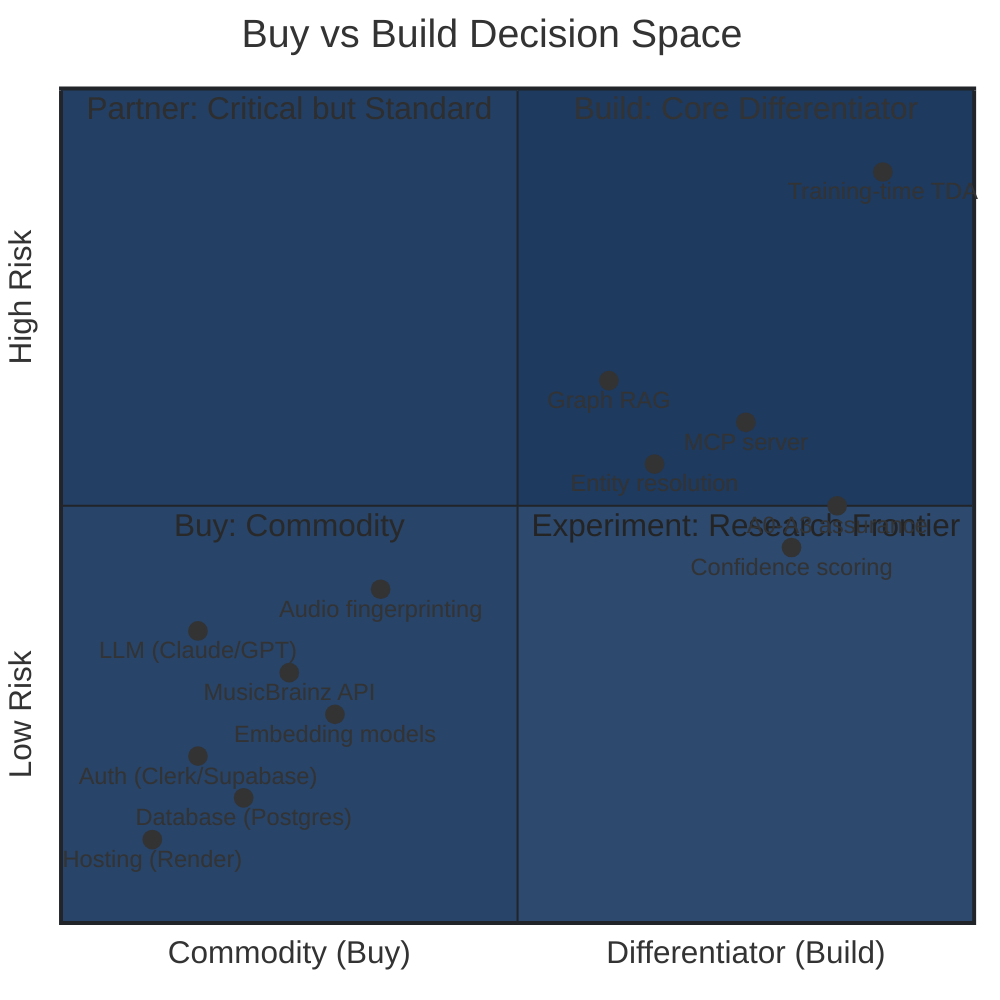
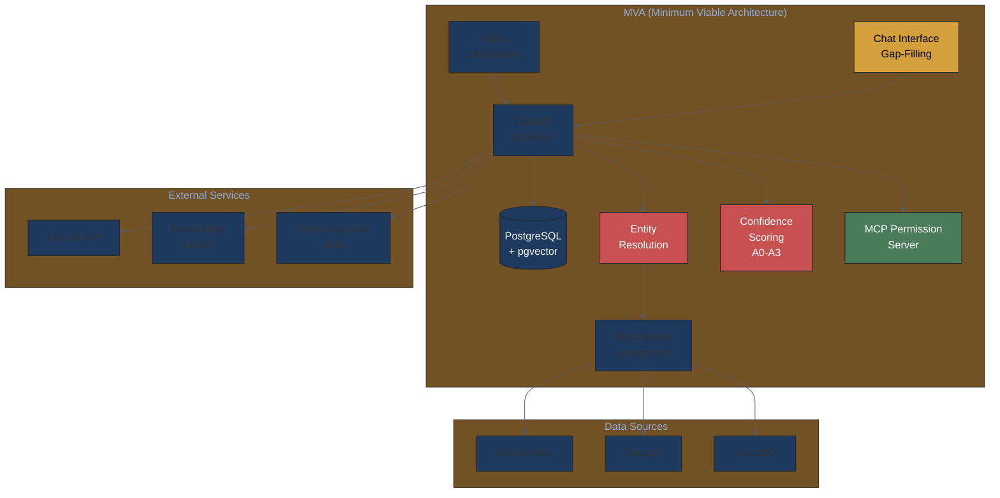

# Buy vs Build Analysis — Music Attribution Scaffold

> **Parent**: [README.md](README.md) > Buy vs Build Analysis
> **Updated**: 2026-02-10

---

## Decision Framework

Every component in the scaffold falls on a spectrum from "commodity infrastructure" (buy) to "core differentiator" (build). The decision depends on three factors:

1. **Strategic value**: Is this component part of our unique value proposition?
2. **Build complexity**: How hard is it to build well?
3. **Switch cost**: If we buy now, how painful is it to switch later?

---

## The Decision Matrix



---

## Component-by-Component Analysis

### BUY: Infrastructure & Commodity Components

#### Authentication

| Aspect | Assessment |
|--------|-----------|
| **Decision** | BUY |
| **Options** | Clerk ($0/mo free tier), Supabase Auth ($0/mo free tier) |
| **Rationale** | Commodity; zero differentiation; free at MVP scale |
| **Switch cost** | Low (standard OAuth flows) |
| **Monthly cost** | $0-25 |

Authentication has no strategic value for an attribution scaffold. Both Clerk and Supabase offer generous free tiers. Use whichever integrates best with the frontend framework.

#### Database (PostgreSQL)

| Aspect | Assessment |
|--------|-----------|
| **Decision** | BUY (managed) |
| **Options** | Neon ($0 free tier → $19 Pro), Supabase ($0 → $25), Railway ($5) |
| **Rationale** | PostgreSQL is the right database; hosting it is commodity |
| **Switch cost** | Medium (Neon → Supabase straightforward; cloud migration harder) |
| **Monthly cost** | $0-25 |

PostgreSQL with pgvector handles relational + vector workloads in a single database. No need for separate vector DB at MVP scale. Neon's free tier provides 0.5 GB storage — sufficient for early development.

#### Hosting / Compute

| Aspect | Assessment |
|--------|-----------|
| **Decision** | BUY |
| **Options** | Render ($7-25), Railway ($5+), Fly.io ($0 free) |
| **Rationale** | Commodity; easy to migrate between platforms |
| **Switch cost** | Low (Docker containers are portable) |
| **Monthly cost** | $7-25 |

All three platforms support Docker deployments with minimal configuration. Render has the best developer experience for Python apps. Railway has the most generous free tier. Fly.io offers global edge deployment.

#### LLM API (Claude/GPT)

| Aspect | Assessment |
|--------|-----------|
| **Decision** | BUY |
| **Options** | Claude API (Anthropic), GPT-4 (OpenAI) |
| **Rationale** | No moat in model choice; abstract behind interface |
| **Switch cost** | Low (if properly abstracted) |
| **Monthly cost** | $10-50 (low volume) |

The LLM powers our gap-filling chat interface and assists with entity resolution. There's no strategic advantage to a specific model — abstract behind an interface and use whatever has the best price/performance.

#### Embedding Models

| Aspect | Assessment |
|--------|-----------|
| **Decision** | BUY (API) or BUILD (local) |
| **Options** | OpenAI text-embedding-3-small ($0.02/1M tokens), local sentence-transformers (free, GPU needed) |
| **Rationale** | Text embeddings are commodity; audio embeddings may need CLAP (local) |
| **Switch cost** | Medium (embedding dimensions vary; may need re-indexing) |
| **Monthly cost** | $5-20 |

For text metadata matching, API embeddings are cheapest. For audio embeddings (CLAP), local inference is necessary. Our scaffold should support both.

---

### BUILD ON: Open-Source Foundations + Custom Logic

#### MusicBrainz Integration

| Aspect | Assessment |
|--------|-----------|
| **Decision** | BUILD (thin wrapper) |
| **Foundation** | musicbrainzngs (open-source Python library) |
| **Custom work** | Rate limiting, caching, entity normalization, relationship traversal |
| **Build time** | 1-2 weeks |

MusicBrainz's API is free and comprehensive, but our integration needs custom logic for:
- Fuzzy matching across naming variations
- Relationship graph traversal (recording → work → songwriter chain)
- ISRC → MBID → full credit resolution pipeline
- Local caching to respect rate limits

#### Audio Fingerprinting

| Aspect | Assessment |
|--------|-----------|
| **Decision** | BUILD ON (Chromaprint + custom similarity) |
| **Foundation** | chromaprint/pyacoustid (open-source) |
| **Custom work** | Similarity scoring beyond exact match; batch processing pipeline |
| **Build time** | 2-3 weeks |

Chromaprint + AcoustID give us audio → MusicBrainz linking for free. Our custom layer adds:
- Similarity scoring (how *close* is a match, not just exact match)
- Batch fingerprinting pipeline for catalog ingestion
- Integration with our confidence scoring (fingerprint match quality → A0/A1/A2 confidence)

---

### BUILD: Core Differentiators

These are the components that make this scaffold unique. No commercial alternative exists.

#### Entity Resolution Engine

| Aspect | Assessment |
|--------|-----------|
| **Decision** | BUILD (core differentiator) |
| **Foundation** | MusicBrainz + Discogs + custom logic |
| **What makes it unique** | Cross-source reconciliation with transparent confidence |
| **Build time** | 4-6 weeks |

Entity resolution is the process of determining that "Imogen Heap", "iMegaphone", and MusicBrainz artist MBID `a565e71c-...` all refer to the same person. Our approach:

1. **Source ingestion**: Pull artist/recording/work data from multiple sources
2. **Candidate generation**: Fuzzy string matching, acoustic fingerprint matching, ISRC lookup
3. **Candidate ranking**: Confidence scoring based on evidence quality and quantity
4. **Conflict resolution**: When sources disagree, flag for expert review
5. **Assurance assignment**: Map evidence to A0-A3 levels

**Why no one else offers this**: Sureel and Musical AI have proprietary entity resolution built into their attribution pipelines, but it's a black box. Our scaffold makes the entity resolution process transparent, auditable, and extensible.

#### Confidence Scoring (A0-A3 Assurance)

| Aspect | Assessment |
|--------|-----------|
| **Decision** | BUILD (core differentiator) |
| **Foundation** | MAPIE/crepes (conformal prediction libraries) |
| **What makes it unique** | Formal statistical guarantees on attribution confidence |
| **Build time** | 2-3 weeks |

No competitor uses formal uncertainty quantification methods. Our scaffold uses conformal prediction to provide guarantees like: "With 90% probability, Artist X's contribution to this generated track is between 15% and 35%."

The A0-A3 assurance levels operationalize this:
- **A0** (Unknown): No provenance data available; confidence = prior only
- **A1** (Self-Declared): Artist's own claim; confidence based on self-report reliability
- **A2** (Source-Verified): Cross-referenced against databases; confidence from source agreement
- **A3** (Identity-Verified): Full verification chain; confidence from cryptographic/institutional proof

#### MCP Permission Server

| Aspect | Assessment |
|--------|-----------|
| **Decision** | BUILD (core differentiator) |
| **Foundation** | MCP protocol spec (Anthropic) |
| **What makes it unique** | Machine-readable consent infrastructure for AI platforms |
| **Build time** | 1-2 weeks (read-only MVP) |

No competitor offers MCP-based consent infrastructure. Our permission server enables:
- AI platforms to query: "Can I use Artist X's catalog for training?"
- Machine-readable responses with license terms, restrictions, and pricing
- Audit trail of who queried what, when

This is the "Attribution-by-Design" concept (Morreale et al., 2025) made practical.

#### Graph Knowledge Base (Graph RAG)

| Aspect | Assessment |
|--------|-----------|
| **Decision** | BUILD (core differentiator) |
| **Foundation** | PostgreSQL recursive CTEs → potential Neo4j migration |
| **What makes it unique** | Graph RAG over entity-resolved music data |
| **Build time** | 3-4 weeks |

The music industry is inherently a graph: artists → recordings → works → labels → publishers → rights holders. Our scaffold builds a knowledge graph from entity-resolved data, then uses RAG (Retrieval Augmented Generation) to answer complex attribution queries like:
- "Who are all the uncredited contributors to this album?"
- "What is the rights chain for this composition across territories?"
- "Which recordings sample this work?"

#### Chat-Based Gap Filling

| Aspect | Assessment |
|--------|-----------|
| **Decision** | BUILD (moderate differentiator) |
| **Foundation** | Claude API + custom UX |
| **What makes it unique** | Conversational workflow for filling metadata gaps |
| **Build time** | 2-3 weeks |

The LLM integration is commodity, but the UX workflow is unique: guiding domain experts through a conversational process to fill in missing attribution data, with system prompts tuned to the music domain.

---

## What Musical AI Is Likely Building (Reverse-Engineered Architecture)

Based on public statements, job postings, partnerships, and product descriptions:

### Estimated Technical Stack

```
┌─────────────────────────────────────────────────────┐
│                  Musical AI Platform                 │
├─────────────────────────────────────────────────────┤
│ Layer 7: Dashboard / API                            │
│   - Rights holder portal (catalog management)       │
│   - AI company API (attribution queries)            │
│   - Royalty reporting interface                      │
├─────────────────────────────────────────────────────┤
│ Layer 6: Payment Distribution                       │
│   - Royalty calculation engine                       │
│   - Payment processing integration                  │
│   - Revenue reconciliation                          │
├─────────────────────────────────────────────────────┤
│ Layer 5: Attribution Computation                    │
│   - Influence percentage calculation                │
│   - Training-time hooks (partner integration)       │
│   - Per-generation attribution reports              │
│   - "Royalty sheet" generation                      │
├─────────────────────────────────────────────────────┤
│ Layer 4: Embedding / Fingerprint Index              │
│   - Audio embedding computation                     │
│   - Vector similarity search                        │
│   - Fingerprint database                            │
├─────────────────────────────────────────────────────┤
│ Layer 3: Catalog Ingestion Pipeline                 │
│   - Audio fingerprinting                            │
│   - Metadata normalization                          │
│   - Rights verification                             │
│   - Format conversion                               │
├─────────────────────────────────────────────────────┤
│ Layer 2: Data Storage                               │
│   - Catalog database (metadata)                     │
│   - Vector store (embeddings)                       │
│   - Rights database (permissions)                   │
│   - Audit log (all operations)                      │
├─────────────────────────────────────────────────────┤
│ Layer 1: Infrastructure                             │
│   - Cloud hosting (likely AWS/GCP)                  │
│   - CDN for audio delivery                          │
│   - Queue system for async processing               │
│   - Monitoring and alerting                         │
└─────────────────────────────────────────────────────┘
```

### What We Could Replicate

| Layer | Replicable? | Notes |
|-------|------------|-------|
| L1: Infrastructure | Yes (commodity) | Standard cloud deployment |
| L2: Data Storage | Yes (commodity) | PostgreSQL + pgvector |
| L3: Catalog Ingestion | Yes (open-source tools) | Chromaprint + musicbrainzngs + mutagen |
| L4: Embedding Index | Yes (open-source tools) | CLAP + pgvector/FAISS |
| L5: Attribution Computation | **Partially** | Similarity-based (not training-time); different methodology |
| L6: Payment Distribution | Skip for MVP | Standard fintech; not our differentiator |
| L7: Dashboard/API | Yes | FastAPI + Next.js |

### What We Uniquely Add That Musical AI Doesn't

| Capability | Musical AI | Our Scaffold |
|-----------|------------|--------------|
| **Transparency** | Black box | Open-source, auditable |
| **Confidence metrics** | "Royalty sheet" (percentages) | A0-A3 + conformal prediction intervals |
| **Permission queries** | API-based (proprietary) | MCP protocol (standard) |
| **Entity resolution** | Proprietary | Open, extensible, multi-source |
| **Academic rigor** | None published | SSRN preprint methodology |
| **Domain agnosticism** | Music only | Backbone works for DPP, supply chain |
| **Training-time TDA** | Yes (requires integration) | No (different paradigm) |
| **Payment processing** | Yes | No (not our layer) |

---

## Minimum Viable Architecture (MVA) Definition

### What MVA Means

The MVA is the minimum technical architecture that demonstrates enough value to attract initial users (artists, rights holders) and generate meaningful feedback. It must balance:

- **Technical credibility** — enough to convince engineers this is real
- **Domain value** — enough to convince musicians this is useful
- **Business viability** — enough to convince investors this has a path to revenue

### MVA Component Diagram



**Legend**: Red = core differentiator (build), Blue = data layer, Green = protocol layer, Yellow = UX layer.

### MVA Cost Estimate (Tiered)

#### Tier 0 — Proof of Concept (demonstrable in weeks)

| Component | Monthly Cost | Notes |
|-----------|-------------|-------|
| FastAPI on Render/Railway | $7-25 | Single application |
| PostgreSQL + pgvector on Neon | $0 | Free tier (0.5 GB) |
| MusicBrainz/Discogs APIs | $0 | Free (rate-limited) |
| Static docs on Vercel | $0 | Free |
| **Total** | **$7-25/month** | — |

#### Tier 1 — Minimum Viable Architecture (4-8 weeks)

| Component | Monthly Cost | Provider | Notes |
|-----------|-------------|----------|-------|
| Compute (API + worker) | $7-25 | Render/Railway | Starter tier |
| PostgreSQL + pgvector | $0-19 | Neon | 0.5 GB free tier |
| Claude API | $10-50 | Anthropic | Low volume during dev |
| Embedding model API | $5-20 | OpenAI | text-embedding-3-small |
| Auth | $0-25 | Clerk/Supabase | Free tier generous |
| Domain + DNS | $1/mo | Cloudflare/Namecheap | — |
| **Total** | **$22-139/month** | — | — |

#### Tier 2 — Production-Ready (3-6 months)

| Component | Monthly Cost | Notes |
|-----------|-------------|-------|
| Application server with auto-scaling | $100-300 | — |
| PostgreSQL with replication | $50-150 | — |
| Redis cache | $30-50 | — |
| Object storage + CDN | $15-50 | — |
| Monitoring (Langfuse self-hosted) | $0-25 | — |
| **Total** | **$195-575/month** | — |

#### Infrastructure Cost Comparison by Provider

| Component | Hetzner | Render | DigitalOcean | AWS/GCP |
|-----------|---------|--------|--------------|---------|
| Compute (2 vCPU, 4GB) | ~$7 | ~$25 | ~$24 | ~$35 |
| PostgreSQL (managed) | N/A ($7 self-host) | ~$19 | ~$15 | ~$50 |
| Redis | N/A ($4 self-host) | ~$10 | ~$15 | ~$25 |
| Object Storage (100GB) | ~$5 | included | ~$5 | ~$5 |
| **Total baseline** | **~$23** | **~$54** | **~$59** | **~$115** |

Hetzner is ~35% cheaper than AWS but requires self-management. Render trades cost for operational simplicity.

This is extraordinarily low for a functional attribution platform. Musical AI charges customers; Vermillio charges $4,000/month. Our open-source scaffold can demonstrate core capabilities at <$150/month infrastructure cost.

### MVA Timeline Estimate

| Phase | Duration | Output | Dependencies |
|-------|----------|--------|--------------|
| Core backend (API + DB + entity resolution) | 4-6 weeks | Working API with MusicBrainz integration | — |
| Confidence scoring (A0-A3) | 2-3 weeks | Assurance level assignment | Entity resolution |
| Chat gap-filling interface | 2-3 weeks | Basic conversational UX | Backend API |
| MCP permission server | 1-2 weeks | Read-only permission queries | Database schema |
| Artist dashboard | 2-3 weeks | Basic catalog view + confidence | All backend components |
| **Total to demo** | **11-17 weeks** | — | — |

For a solo developer or 2-person team: ~3-4 months to a demonstrable prototype. Industry benchmarks suggest SaaS MVPs with AI features cost $30-100K and take 3-6 months.

### MVA → Probabilistic PRD Mapping

The MVA maps to specific decision node paths in the probabilistic PRD:

```yaml
mva_path:
  L1_build_vs_buy: managed_services     # Buy infrastructure, build differentiators
  L1_target_market: indie_artists       # Not majors (too complex for MVP)
  L2_data_model: graph_enhanced_rdbms   # PostgreSQL + entity graph
  L2_api_protocol: rest_mcp_hybrid      # REST API + MCP server
  L2_service_decomposition: modular_monolith
  L3_primary_database: postgresql_unified
  L3_graph_strategy: pg_recursive_cte   # Start simple, migrate to Neo4j if needed
  L3_llm_provider: anthropic_primary
  L3_frontend: next_js_app_router
  L3_auth: clerk_or_supabase
  L4_compute: render_or_railway
  L4_database_hosting: neon
  joint_probability: 0.35               # Given solo_hacker archetype
```

### Post-MVA Expansion Path

| Phase | Timeline (after MVA) | Additions |
|-------|---------------------|-----------|
| **V1.1** | +4 weeks | Discogs integration, batch fingerprinting, improved entity resolution |
| **V1.2** | +4 weeks | Expert feedback system (FeedbackCards), multi-reviewer convergence |
| **V1.3** | +6 weeks | CLAP audio embeddings, graph RAG, MCP write permissions |
| **V2.0** | +8 weeks | Neo4j migration, public API, SoundExchange registry integration |

---

## Reference Company Architectures

Successful music metadata/attribution companies provide architecture lessons:

| Company | Scale | Stack | Key Lesson |
|---------|-------|-------|-----------|
| **BMAT Music Innovators** | 27B matches/day, 80M identifications/day, 100+ CMOs across 124 countries | Django, Apache HTTP, RabbitMQ | Started focused (broadcast monitoring), expanded to "Music Operating System" |
| **Pex** | 18B+ audiovisual files indexed | SDK-based: fingerprint hashes → Attribution Engine, <5s match | Proprietary fingerprinting as moat; SDK model reduces integration friction |
| **Audible Magic** | Billions of monthly transactions | Emmy-winning ACR technology | Long-term trust as "neutral intermediary"; recently partnered with Udio |
| **Gracenote** | Global music metadata standard | SDKs, libraries, APIs across platforms | Valuation grew 3x in 3 years (Sony→Tribune $170M→Nielsen $560M) |
| **ACRCloud** | 150M+ tracks indexed | API-first, per-query pricing | Usage-based pricing lowers barrier to entry for smaller players |

**Common patterns across successful companies**:
1. All started as modular monoliths, extracted services only at scale
2. Audio fingerprinting/metadata is the core moat in every case
3. "Neutral intermediary" positioning creates trust with both sides
4. API-first design enables ecosystem growth

---

## The "Buy Everything" Alternative

What if we just use existing commercial attribution services?

### Scenario: Buy Sureel or Musical AI

| Aspect | Outcome |
|--------|---------|
| **Cost** | Unknown (neither publishes pricing) — likely $X,000/month |
| **Transparency** | None (proprietary black boxes) |
| **Customization** | Limited to their API capabilities |
| **Academic value** | Minimal (can't publish methodology) |
| **Lock-in** | High (proprietary formats, APIs) |
| **Speed to market** | Faster (weeks not months) |
| **Portfolio value** | None (using someone else's product) |

### Why Build?

1. **Open-source is the moat**: In a market where everyone is proprietary, being auditable is unique
2. **Academic credibility**: Published methodology creates trust that "trust us" doesn't
3. **Composability**: Our scaffold can integrate *with* Sureel or Musical AI, not instead of them
4. **Portfolio value**: The scaffold demonstrates engineering skill; buying a SaaS doesn't
5. **Domain agnosticism**: Our architecture generalizes; theirs doesn't
6. **Cost**: $22-139/month vs unknown thousands/month
