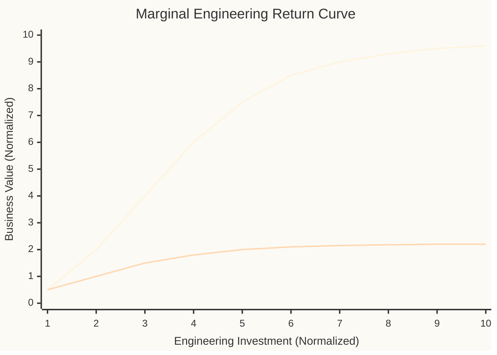
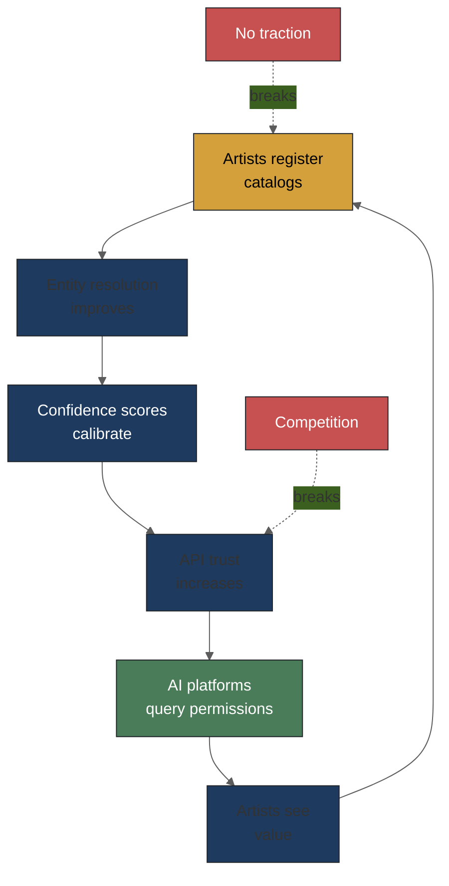
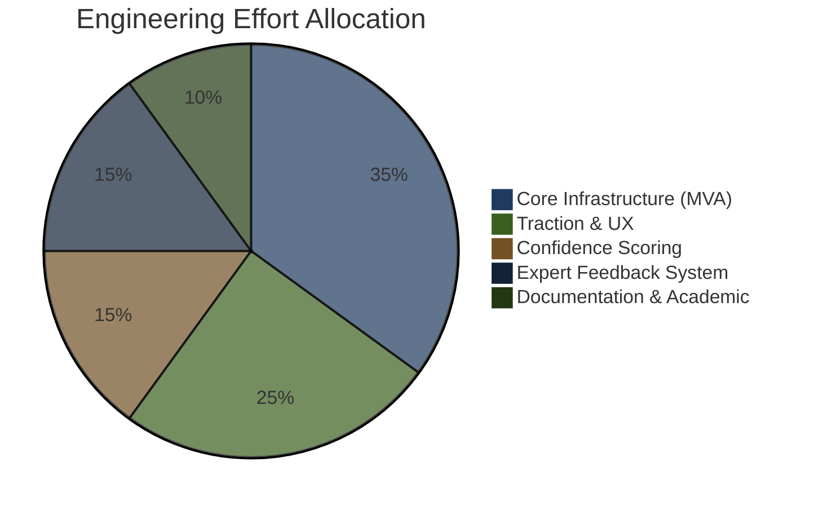

# Risk & Probability Framework — Music Attribution Scaffold

> **Parent**: [README.md](README.md) > Risk & Probability Framework
> **Updated**: 2026-02-10

---

## The Fundamental Question

**If we invest 3x engineering resources beyond the MVA, does the business outcome improve more than 1.01x?**

This question is critical because attribution infrastructure has a unique property: its value is almost entirely dependent on *adoption*, not *technical sophistication*. A perfect attribution system with zero users is worthless. A crude system with thousands of artists is valuable.

---

## Marginal Engineering Return Curve

### Reading the Curve

**With traction** (artists, labels engaging): Engineering investment compounds. Better entity resolution means better confidence, which attracts more users, which provides more data for calibration, which improves confidence further. This is the adoption flywheel.

**Without traction**: Engineering beyond MVA has near-zero marginal return. Building Neo4j integration, advanced conformal prediction, or multi-source fusion is pointless if nobody is using the system. The curve flatlines at ~2.2x regardless of input.

### Inflection Points

| Investment Level | With Traction | Without Traction | Decision |
|-----------------|---------------|-----------------|----------|
| **1x (MVA)** | 0.5 | 0.5 | **Always do this** |
| **2x** | 2.0 | 1.0 | Do if early signals positive |
| **3x** | 4.0 | 1.5 | Only with confirmed traction |
| **5x** | 7.5 | 2.0 | Only with revenue or partnerships |
| **10x** | 9.6 | 2.2 | Full product-market fit required |

**Key insight**: The gap between "with traction" and "without traction" grows *exponentially* with investment. At 1x, the gap is 0. At 10x, the gap is 7.4x. This means the first priority is always traction validation, not engineering excellence.

---

## Risk Matrix

### Critical Risks (P > 0.3, Impact: Critical or High)

| Risk | Probability | Impact | Mitigation Strategy | Monitoring Signal |
|------|-------------|--------|---------------------|-------------------|
| **No user traction** | 0.45 | Critical | Start with known contacts (Imogen/Andy); demonstrate value on their catalogs before scaling | Week 1-4: catalog registration attempts; Month 2: active users |
| **Funding dries up** | 0.50 | High | Open-source ensures continuity regardless; academic paper provides credibility independent of product | Monthly: burn rate; Quarterly: funding pipeline |
| **AI platforms ignore permissions** | 0.35 | High | Monitor EU AI Act enforcement; legal developments; focus on platforms that already license (Suno post-Warner, Soundverse) | Quarterly: regulatory scan; Partnership attempts |
| **Major label builds competing system** | 0.30 | High | Focus on indie/heritage artists where labels don't reach; open-source creates different value proposition (transparency vs enterprise) | Industry news: Sony/UMG/Warner AI announcements |

### Moderate Risks (P > 0.2, Impact: Medium)

| Risk | Probability | Impact | Mitigation Strategy | Monitoring Signal |
|------|-------------|--------|---------------------|-------------------|
| **Confidence calibration fails with limited data** | 0.40 | Medium | Conformal prediction works with small samples; use Bayesian updating; start with wide intervals that narrow with data | Calibration plots at each review cycle |
| **Regulatory shift invalidates approach** | 0.30 | Medium | Flexible architecture; abstract regulatory-specific logic; monitor EU AI Act (effective Aug 2026), US Copyright Office guidance | Quarterly: legislative tracking |
| **Entity resolution doesn't scale** | 0.25 | Medium | Start simple (MusicBrainz fuzzy match); PostgreSQL handles millions of records; migrate to dedicated graph DB if needed | Performance benchmarks at 10K, 100K, 1M entities |
| **MCP protocol evolves incompatibly** | 0.20 | Medium | Abstract protocol layer behind interface; MCP is Anthropic-backed with strong momentum and growing ecosystem | Monthly: MCP spec updates; Claude tool use changes |

### Low-Probability but High-Impact Risks

| Risk | Probability | Impact | Mitigation |
|------|-------------|--------|------------|
| **Sureel or Musical AI open-sources** | 0.05 | Critical | Unlikely given business models; if it happens, our scaffold becomes a compatible layer |
| **Blockchain attribution becomes standard** | 0.10 | High | Monitor Mubert; architect for optional on-chain layer |
| **Training-time TDA becomes trivial** | 0.05 | High | If TDA is solved, our scaffold becomes more valuable (confidence layer on top of precise attribution) |
| **Music AI generation market collapses** | 0.05 | Critical | Domain-agnostic backbone pivots to DPP/traceability |

---

## The Adoption Flywheel

### Virtuous Cycle

### Flywheel Components

| Stage | What Happens | What Must Be True | Failure Mode |
|-------|-------------|-------------------|--------------|
| **Artists register** | Artist uploads catalog metadata (ISRC, credits, permissions) | System is easy to use; artist sees clear value proposition | UX too complex; value unclear |
| **Entity resolution improves** | More data → better fuzzy matching, fewer ambiguities | Entity resolution pipeline handles new data types | Data quality too poor; mismatches increase |
| **Confidence calibrates** | A0→A1→A2 upgrades become more reliable with more data | Conformal prediction intervals narrow with sample size | Calibration fails; confidence stagnates |
| **API trust increases** | External consumers (AI platforms) trust our confidence scores | Calibration is demonstrably accurate | Scores prove unreliable in practice |
| **AI platforms query** | Suno, Soundverse, etc. query permissions before training | Platforms have incentive to query (legal, ethical, or business) | Platforms don't care; no enforcement |
| **Artists see value** | Artists receive attribution reports, usage notifications | Reports are accurate and useful | Reports are wrong or unhelpful |

### Breaking Points

The flywheel can be broken at two critical points:

1. **No traction (breaks at "Artists register")**: If artists don't register, nothing else works. This is the highest-probability risk (0.45).

   **Mitigation**: Start with a tiny cohort of known, motivated artists. Imogen Heap has been vocal about attribution. Andy (rights admin) can provide industry perspective. Getting 10 committed artists is better than marketing to 10,000.

2. **Competition (breaks at "API trust increases")**: If a well-funded competitor (Vermillio, Musical AI) offers a better-known attribution API, platforms may prefer them.

   **Mitigation**: Open-source provides a fundamentally different value proposition. Platforms looking for *auditable, transparent* attribution (for regulatory compliance, for example) would prefer an open system. Position as complementary, not competitive.

---

## Engineering Effort Allocation

### Recommended Split (First 6 Months)

### Why "Traction & UX" Gets 25%

Most engineering teams under-invest in the components that drive adoption:
- **Onboarding flow**: How quickly can an artist go from signup to seeing their catalog with confidence scores?
- **First-value time**: How fast does the artist see something useful?
- **Feedback loop**: How easily can they correct errors?
- **Sharing**: Can they show the system to other artists?

These UX concerns are *not* separate from the technical architecture. They should be co-designed with entity resolution and confidence scoring from day one.

---

## Scenario Analysis

### Scenario 1: Best Case (P ≈ 0.15)

- 50+ artists register in first 6 months
- Entity resolution achieves >90% accuracy on registered catalogs
- One AI platform integrates MCP permission queries
- SSRN paper gets cited by regulatory body
- **Outcome**: Strong case for seed funding or institutional partnership

### Scenario 2: Base Case (P ≈ 0.40)

- 10-20 artists register (mostly from personal network)
- Entity resolution works well on MusicBrainz-covered catalogs
- No AI platform integration yet, but demo is compelling
- Paper gets modest academic attention
- **Outcome**: Strong portfolio piece; basis for next grant/funding application

### Scenario 3: Pivot Case (P ≈ 0.30)

- Few artists register; music domain proves too fragmented
- Technical architecture proves sound but domain traction fails
- DPP/supply chain traceability emerges as better fit
- **Outcome**: Pivot backbone to DPP domain; rewrite overlays

### Scenario 4: Worst Case (P ≈ 0.15)

- No meaningful traction in any domain
- Technical execution issues (calibration fails, performance bottlenecks)
- Market moves to pure licensing (no attribution needed)
- **Outcome**: Open-source contribution to academic research; learning experience

---

## Decision Gates

### Gate 1: MVA Complete (Week 14-17)

**Decision**: Does the prototype demonstrate enough value to continue?

| Criteria | Threshold | Status |
|----------|-----------|--------|
| Entity resolution works on test catalog | >80% accuracy on 100 known tracks | Pending |
| A0-A3 assignment functions | Correct level for 90% of test cases | Pending |
| At least 3 external people have used the system | Qualitative feedback collected | Pending |

**If pass**: Continue to V1.1 (expand integrations)
**If fail**: Diagnose root cause; consider pivot to DPP domain

### Gate 2: Traction Validation (Month 6)

**Decision**: Is there a path to sustainable adoption?

| Criteria | Threshold | Status |
|----------|-----------|--------|
| Active registered catalogs | >10 artists | Pending |
| Expert feedback submissions | >50 FeedbackCards | Pending |
| External interest | 1+ AI platform or CMO inquiry | Pending |

**If pass**: Pursue seed funding or institutional partnership
**If fail**: Evaluate pivot or wind down

### Gate 3: Market Validation (Month 12)

**Decision**: Is this a viable product or research project?

| Criteria | Threshold | Status |
|----------|-----------|--------|
| MCP queries from external platforms | >100/month | Pending |
| Revenue or partnership value | >$0 | Pending |
| Paper citations or regulatory references | >3 | Pending |

**If pass**: Scale
**If fail**: Maintain as research project; seek grant funding

---

## Uncertainty Quantification for This Risk Framework

These risk probabilities are themselves uncertain. They represent informed estimates based on:

1. **Market analogies**: Similar B2B SaaS platforms in music tech (Songtradr, DistroKid early stages)
2. **Academic literature**: Startup failure rates (~90% overall, ~75% for funded startups)
3. **Domain interviews**: Conversations with music industry professionals
4. **Competitor analysis**: Observing Musical AI, Sureel, and Vermillio trajectories

**Confidence interval on risk estimates**: ±15 percentage points. The "No user traction" risk at 0.45 could realistically be anywhere from 0.30 to 0.60.

**Review cadence**: Re-assess all probabilities quarterly, informed by:
- Actual adoption metrics
- Competitive landscape changes
- Regulatory developments
- Technical milestone achievement
