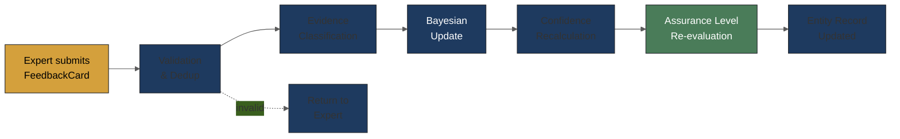
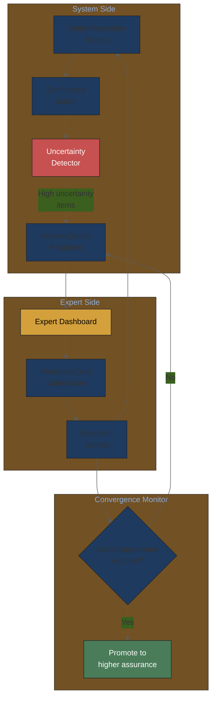

# Domain Expert Feedback Mechanisms — Music Attribution Scaffold

> **Parent**: [README.md](README.md) > Domain Expert Feedback Mechanisms
> **Updated**: 2026-02-10

---

## Why Feedback Is Architecturally Critical

The feedback system is not a feature — it is the core value proposition of the scaffold. Here's why:

1. **Music metadata is notoriously incomplete**: Even MusicBrainz, the most comprehensive open database, has significant gaps in session musician credits, producer roles, and writing splits.
2. **Ground truth lives in people's heads**: The drummer on a 1992 session knows they played on that album. No database captures this.
3. **Confidence calibration requires human validation**: Our A0-A3 assurance levels can only be trusted if humans confirm they match reality.
4. **Active learning reduces review burden**: By prioritizing the most uncertain items for review, we maximize the value of each expert's time.

The adoption flywheel depends on this: more feedback → better confidence → more trust → more users → more feedback.

---

## Domain Expert Profiles

Our feedback system must accommodate different types of experts:

### Profile 1: Artist / Songwriter

| Attribute | Details |
|-----------|---------|
| **Knowledge** | Definitive on their own works; strong on collaborators |
| **Tech literacy** | Variable (some very tech-savvy, some not) |
| **Motivation** | Ensure proper credit and compensation |
| **Time budget** | Limited; review must be quick (< 5 min per song) |
| **Trust level** | High on own catalog; may overstate contribution |

### Profile 2: Manager / Rights Administrator

| Attribute | Details |
|-----------|---------|
| **Knowledge** | Broad catalog knowledge; contractual details |
| **Tech literacy** | Generally moderate |
| **Motivation** | Protect and monetize client catalog |
| **Time budget** | Moderate; can batch review multiple items |
| **Trust level** | High on contractual credits; may miss informal contributions |

### Profile 3: Musicologist / Researcher

| Attribute | Details |
|-----------|---------|
| **Knowledge** | Deep historical knowledge; influence analysis |
| **Tech literacy** | Often high |
| **Motivation** | Academic accuracy; career incentive |
| **Time budget** | Moderate to high; more willing to do detailed review |
| **Trust level** | High on documented relationships; may over-interpret influence |

### Profile 4: Producer / Engineer

| Attribute | Details |
|-----------|---------|
| **Knowledge** | Detailed session-level knowledge; technical contributions |
| **Tech literacy** | High |
| **Motivation** | Recognition of production contributions |
| **Time budget** | Limited (active professionals) |
| **Trust level** | Very high on sessions they participated in |

---

## Feedback Mechanism 1: FeedbackCards (Zhou et al., 2023)

### Background

FeedbackCards ([arXiv:2307.15475](https://arxiv.org/abs/2307.15475)) are structured documents for capturing stakeholder corrections and overrides that support continual learning. Originally designed for ML model feedback in healthcare/policy, adapted here for music attribution.

### FeedbackCard Schema for Attribution Review

```yaml
feedback_card:
  # --- Card metadata ---
  version: "1.0"
  card_id: "fc-2026-02-10-001"   # Unique identifier
  created_at: "2026-02-10T14:30:00Z"
  review_session_id: "rs-001"     # Groups cards from same session

  # --- Reviewer identity ---
  reviewer:
    id: "expert_001"
    role: artist                   # artist | manager | rights_admin | musicologist | producer
    expertise_level: domain_expert # novice | intermediate | domain_expert
    catalog_size: 47               # Songs in their catalog (self-reported)
    years_experience: 15           # Years in the industry
    relationship_to_entity: self   # self | collaborator | observer | researcher

  # --- Entity under review ---
  reviewed_entity:
    type: song_attribution         # song_attribution | artist_identity | recording_credit | work_relationship
    entity_id: "isrc:GBAYE0000001"
    title: "Midnight Shadows"
    year: 2019
    current_assurance_level: A2

  # --- System's current attribution ---
  system_attribution:
    assurance_level: A2            # A0 | A1 | A2 | A3
    confidence_interval: [0.70, 0.92]  # Conformal prediction interval
    credits:
      primary_songwriter:
        name: "Jamie Chen"
        confidence: 0.85
        sources: ["musicbrainz", "discogs"]
      producer:
        name: "Studio X"
        confidence: 0.72
        sources: ["musicbrainz"]
      session_drummer:
        name: null
        confidence: 0.0
        sources: []

  # --- Expert corrections ---
  expert_corrections:
    - field: "credits.session_drummer"
      system_value: null
      corrected_value: "Marcus Williams"
      expert_confidence: 0.95       # How certain is the expert? (0-1)
      evidence: "I was at the session. He played on tracks 1-8."
      evidence_type: firsthand_knowledge  # firsthand_knowledge | documentary | informed_opinion | hearsay
      evidence_artifacts: []         # Links to contracts, photos, liner notes

    - field: "credits.primary_songwriter.confidence"
      system_value: 0.85
      corrected_value: 0.95
      expert_confidence: 0.90
      evidence: "Jamie wrote this solo, no co-writers."
      evidence_type: firsthand_knowledge

    - field: "credits.backing_vocalist"
      system_value: null             # Field doesn't exist in system
      corrected_value: "Sarah Kim"
      expert_confidence: 0.80
      evidence: "She sang harmonies on the chorus."
      evidence_type: firsthand_knowledge

  # --- Meta-feedback ---
  meta_feedback:
    overall_quality: 4               # 1-5 scale: how good was the system's attribution overall?
    missing_roles: ["backing_vocalist", "mixing_engineer"]
    unexpected_roles: []
    time_spent_minutes: 3
    difficulty: easy                  # easy | moderate | hard | expert_only
    would_review_again: true
    free_text: "Good job on the main credits, just missing the session players."
```

### FeedbackCard Processing Pipeline



### Processing Steps

1. **Validation & Dedup**: Check card is complete, not duplicate, reviewer is authorized
2. **Evidence Classification**: Weight the correction based on evidence type:
   - `firsthand_knowledge`: Weight 0.9 (they were there)
   - `documentary`: Weight 0.8 (they have a contract/liner notes)
   - `informed_opinion`: Weight 0.5 (they know the artist/genre)
   - `hearsay`: Weight 0.2 (they heard it from someone)
3. **Bayesian Update**: Update the entity's probability distribution using the expert's correction as a new observation
4. **Confidence Recalculation**: Re-run conformal prediction with updated data
5. **Assurance Level Re-evaluation**: Check if the entity qualifies for a higher (or lower) assurance level
6. **Entity Record Updated**: Write changes to database with full audit trail

---

## Feedback Mechanism 2: Visual Analogue Scale (VAS)

### Why VAS?

VAS scales are used in clinical research because they capture nuanced judgments that discrete scales miss. Instead of "Is this correct? Yes/No", VAS asks "How confident are you?" on a continuous scale.

For non-technical experts, a slider is more intuitive than entering a number.

### VAS Design for Attribution Review

```
How confident are you that this attribution is correct?

Not at all ├──────────────|───────────────────┤ Completely
confident   0%            50%        ↑(73%)    100%   confident
                                   System says

Your assessment: ____%
```

### VAS Implementation Details

| Aspect | Design Decision |
|--------|----------------|
| **Scale range** | 0-100 (continuous, displayed as percentage) |
| **System anchor** | Show system confidence on the scale (optional, configurable) |
| **Anchoring bias** | Consider hiding system confidence for first assessment (to avoid anchoring) |
| **Resolution** | 1% increments (100 positions) |
| **Input method** | Slider (touch-friendly) or click on scale |
| **Response time** | Track time-to-response as data quality signal |

### Critical Design Finding: Center-Bias

Research on VAS accuracy shows that epistemically uncertain respondents spike at exactly 50 on the scale. This means:
- A raw VAS response of 50 should be treated as **"epistemic uncertainty"** (expert doesn't know), not a genuine 50% confidence estimate
- The interface must include a separate **"I'm not sure"** escape hatch
- If expert places at 50, prompt: "Are you unsure, or do you think it's genuinely about 50-50?"

Source: [Accuracy and Precision of VAS Responses (Springer)](https://link.springer.com/article/10.3758/s13428-022-02021-0)

### VAS → Bayesian Update

The expert's VAS response is converted to a Beta distribution prior:

```
If expert says 85% confident:
  → Beta(alpha=8.5, beta=1.5)  # Concentrated around 0.85

If expert says 50% confident:
  → Beta(alpha=5, beta=5)       # Concentrated around 0.50

Combined with system's posterior:
  → Bayesian conjugate update → New posterior distribution
```

The width of the expert's Beta distribution (uncertainty about their own uncertainty) can be modulated by:
- Expertise level (domain_expert → narrower; novice → wider)
- Evidence type (firsthand → narrower; hearsay → wider)
- Past accuracy (if expert's corrections have proven accurate → narrower)

---

## Feedback Mechanism 3: Hypothetical Outcome Plots (HOPs)

### Why HOPs?

Research shows that Hypothetical Outcome Plots "greatly improve multivariate probability estimation over conventional static uncertainty visualizations" and "leverage the ability of the visual system to quickly, accurately, and automatically process the summary statistical properties of ensembles."

For our attribution context: instead of showing "confidence = 73%", animate 20 possible attribution scenarios. In most animations, Artist X is the primary contributor. In a few, Artist Y appears instead. The expert *sees* the uncertainty rather than reading a number.

### HOPs Application to Attribution

```
Scenario animation (20 frames, 0.5s each):

Frame 1:  Songwriter: Jamie Chen (100%) | Producer: Studio X (100%) | Drummer: Marcus Williams
Frame 2:  Songwriter: Jamie Chen (100%) | Producer: Studio X (100%) | Drummer: Unknown
Frame 3:  Songwriter: Jamie Chen (85%)  | Producer: Studio X (100%) | Drummer: Marcus Williams
Frame 4:  Songwriter: Jamie Chen (100%) | Producer: Studio X  (72%) | Drummer: Marcus Williams
...
Frame 20: Songwriter: Jamie Chen (100%) | Producer: Unknown         | Drummer: Marcus Williams

Summary visible: "In 17/20 scenarios, Jamie Chen is the songwriter. In 14/20, Studio X produced."
```

### Implementation Considerations

- **Complexity**: HOPs are more complex to implement than VAS or FeedbackCards
- **Phase**: Implement in V1.2 or later, after basic feedback is validated
- **Library**: D3.js or Vega-Lite for web-based animations
- **Accessibility**: Must work alongside static summaries for users who can't process animations

---

## Feedback Mechanism 4: Calibration Interface

### Combined Interface Pattern

The expert dashboard presents a combined interface:

```
┌─────────────────────────────────────────────────────┐
│ Song: "Midnight Shadows" (2019)                     │
│ Current Assurance: A2 (Source-Verified)              │
│                                                     │
│ ┌─ System Attribution ─────────────────────────────┐│
│ │ Songwriter: Jamie Chen         [████████░░] 85%  ││
│ │ Producer:   Studio X           [███████░░░] 72%  ││
│ │ Drummer:    [UNKNOWN]          [░░░░░░░░░░]  0%  ││
│ │ ⚠ Flagged: Uncredited session musicians likely   ││
│ └──────────────────────────────────────────────────┘│
│                                                     │
│ ┌─ Your Review ────────────────────────────────────┐│
│ │                                                  ││
│ │ Overall: [✓ Correct] [~ Partially] [✗ Wrong]     ││
│ │                                                  ││
│ │ Corrections:                                     ││
│ │ ┌ Drummer ─────────────────────────────────────┐ ││
│ │ │ Name: [Marcus Williams          ]            │ ││
│ │ │ Your confidence:                             │ ││
│ │ │ Low ├──────────────────────|──┤ High         │ ││
│ │ │                            ↑ 90%             │ ││
│ │ │ Evidence: [I was at the session]             │ ││
│ │ │ Type: ◉ Firsthand ○ Documentary ○ Opinion   │ ││
│ │ └─────────────────────────────────────────────┘ ││
│ │                                                  ││
│ │ [+ Add missing credit]                           ││
│ │                                                  ││
│ │ Time spent: auto-tracked                         ││
│ │                                                  ││
│ │ [Submit Review]    [Skip — Not Sure]             ││
│ └──────────────────────────────────────────────────┘│
└─────────────────────────────────────────────────────┘
```

---

## Active Learning Loop

### How Active Learning Works in This Context

Active learning selects the *most informative* items for expert review, maximizing the value of each expert interaction.



### Priority Queue Logic

Items are prioritized for review based on:

#### 1. Decision Boundary Proximity

Items where confidence is near a threshold between assurance levels:

| Boundary | Range | Why Priority |
|----------|-------|--------------|
| A0 → A1 | Confidence 0.40-0.60 | Could be upgraded with minimal evidence |
| A1 → A2 | Confidence 0.60-0.80 | Source verification would unlock higher trust |
| A2 → A3 | Confidence 0.80-0.95 | Identity verification would provide maximum assurance |

#### 2. Source Disagreement

When multiple data sources provide conflicting information:

```
MusicBrainz says: Songwriter is "J. Chen"
Discogs says: Songwriter is "Jamie Chen-Wong"
ISRC database says: No songwriter data

→ Priority: HIGH (entity resolution ambiguity)
```

#### 3. Entity Resolution Ambiguity

When the system found multiple candidates for an entity:

```
Artist search for "Mike Johnson":
  Candidate 1: Mike Johnson (blues guitarist, b. 1965)
  Candidate 2: Mike Johnson (session drummer, Nashville)
  Candidate 3: Mike Johnson (DJ, London)

→ Priority: HIGH (disambiguation needed)
```

#### 4. Never-Reviewed Items

Items that have never been seen by a human expert:

```
Song "Midnight Shadows" (ISRC: GBAYE0000001)
  Last reviewed: NEVER
  System confidence: 0.72
  Assurance level: A2 (automated only)

→ Priority: MEDIUM (should have at least one human confirmation)
```

#### 5. Staleness

Items that were reviewed long ago and may have changed:

```
Song "Classic Track" (ISRC: GBXYZ0001234)
  Last reviewed: 2024-03-15 (22 months ago)
  Rights may have transferred
  New sources available

→ Priority: MEDIUM (periodic re-validation)
```

### Priority Scoring Formula

```python
priority = (
    w1 * decision_boundary_proximity(confidence)  # 0-1
    + w2 * source_disagreement_score(sources)      # 0-1
    + w3 * entity_ambiguity_score(candidates)      # 0-1
    + w4 * never_reviewed_flag(review_count)       # 0 or 1
    + w5 * staleness_score(last_review_date)       # 0-1
)

# Default weights (tunable per archetype)
w1, w2, w3, w4, w5 = 0.30, 0.25, 0.20, 0.15, 0.10
```

---

## Multi-Reviewer Convergence

### Why Multiple Reviewers?

A single expert opinion can be biased (self-interest, incomplete knowledge, anchoring). For high-assurance levels, we need independent confirmation.

### Convergence Protocol

| Assurance Target | Min Reviewers | Agreement Threshold | Reviewer Requirements |
|-----------------|---------------|--------------------|-----------------------|
| **A1** (Self-Declared) | 1 | N/A | The artist themselves |
| **A2** (Source-Verified) | 1 expert | Single confirmation | Any domain expert; must not be the artist |
| **A3** (Identity-Verified) | 2+ experts | 80% agreement | Independent experts; at least one external to the project |

### Measuring Convergence

**Inter-rater reliability** using Krippendorff's alpha:

```
α > 0.80  →  Strong agreement   →  Promote to higher assurance
α = 0.67-0.80  →  Moderate    →  Request one more review
α < 0.67  →  Disagreement     →  Flag for discussion; don't promote
```

For continuous ratings (VAS), use intraclass correlation coefficient (ICC):

```
ICC > 0.75  →  Good reliability  →  Use mean rating
ICC = 0.50-0.75  →  Moderate   →  Use conservative (lower) estimate
ICC < 0.50  →  Poor             →  Flag; reviewers may be assessing different things
```

### Disagreement Resolution

When reviewers disagree:

1. **Identify disagreement type**:
   - Factual (who played on the session?) → Present evidence to both; request reconciliation
   - Judgmental (how influential was this?) → Accept as genuine uncertainty; widen confidence interval
   - Definitional (does "producer" include mixing?) → Clarify role definitions

2. **Escalation path**:
   - Reviewers discuss (if willing)
   - Third reviewer tie-breaks
   - Flag as "contested" with explanation visible in attribution record

3. **Document everything**: Every disagreement and resolution feeds back into the system's understanding of domain ambiguity.

---

## Integration with Probabilistic PRD

### Decision Node: Expert Feedback Mechanism

```yaml
decision_id: expert_feedback_mechanism
decision_level: L3_implementation
options:
  - option_id: inline_vas_cards
    prior_probability: 0.45
    description: "VAS sliders + FeedbackCards inline with dashboard"
    status: recommended
    rationale: "Lowest friction; experts review while browsing catalog"
    dependencies: ["artist_dashboard"]

  - option_id: separate_review_app
    prior_probability: 0.25
    description: "Dedicated review application with queue management"
    status: viable
    rationale: "Better for batch reviewers; higher complexity"
    dependencies: ["artist_dashboard", "review_queue_service"]

  - option_id: chat_based_review
    prior_probability: 0.20
    description: "Review embedded in conversational gap-filling"
    status: viable
    rationale: "Most natural for non-technical experts; harder to structure"
    dependencies: ["chat_interface", "llm_integration"]

  - option_id: email_questionnaire
    prior_probability: 0.10
    description: "Periodic email with review requests"
    status: deferred
    rationale: "Lowest tech requirement; worst response rate"
    dependencies: ["email_service"]

archetype_weights:
  musician_first_team:
    probability_overrides:
      inline_vas_cards: 0.55     # Most accessible for non-technical users
      chat_based_review: 0.25    # Conversational is comfortable
      separate_review_app: 0.15
      email_questionnaire: 0.05

  engineer_heavy_startup:
    probability_overrides:
      separate_review_app: 0.40  # Engineers prefer structured tools
      inline_vas_cards: 0.35
      chat_based_review: 0.20
      email_questionnaire: 0.05
```

---

## Related Feedback Frameworks

### Model Cards (Mitchell et al., 2019)

Structured documentation for ML models. Our "Attribution Model Card" would document:
- What data sources feed entity resolution
- Known biases (genre coverage, era coverage, geographic bias)
- Performance metrics across subgroups

### Data Cards (Pushkarna et al., 2022)

Documentation for datasets. Our "Catalog Data Card" would document:
- Completeness metrics (what percentage of tracks have full credits?)
- Source provenance (where did each field come from?)
- Known gaps and biases

### MCP Server Cards (proposed in companion manuscripts)

Documentation for MCP servers. Our permission server would have:
- What permissions it can query
- Response format and confidence levels
- Rate limits and availability

### Use Case Cards

Documentation for specific use cases of the scaffold:
- "As an indie artist, I want to verify my catalog credits"
- "As an AI platform, I want to check training permissions"
- "As a rights administrator, I want to monitor attribution accuracy"

---

## Calibration Loop

The feedback system forms a closed calibration loop:

```
1. System makes prediction with confidence
2. Expert reviews (confirms/corrects via VAS + FeedbackCard)
3. Correction becomes new calibration data point
4. System recalibrates (weekly rolling window)
5. ECE (Expected Calibration Error) tracked in monitoring
6. Target: ECE < 0.05 for production quality
```

**Key academic reference**: Gelman et al. (2025, arXiv:2503.11709) — "Conformal Prediction and Human Decision Making" — shows conformal prediction sets improve human decision-making accuracy compared to fixed-size prediction sets. Set size itself communicates uncertainty: larger sets signal more model uncertainty.

**Practical calibration interface elements**:

| Element | Purpose |
|---------|---------|
| **Reliability diagram** | Show overall system calibration (predicted vs actual accuracy per bin) |
| **Per-field prediction sets** | Show alternatives when uncertain (dropdown with ranked candidates) |
| **Source agreement indicator** | Colored dots showing which databases agree/disagree |
| **Historical accuracy badge** | "This field type: 93% accurate last month" |
| **Expert override log** | All overrides stored for recalibration |

**Tool reference**: The [`elicit`](https://github.com/florence-bockting/elicit) package provides expert knowledge elicitation for learning prior distributions in Bayesian models, directly applicable to translating domain expert feedback into well-defined priors.

---

## Implementation Roadmap

| Phase | Timeline | Deliverable |
|-------|----------|------------|
| **V1.0** (MVA) | Month 1-3 | Basic correction form (simplified FeedbackCard) + VAS slider |
| **V1.1** | Month 4-5 | Full FeedbackCard schema + Bayesian update pipeline |
| **V1.2** | Month 6-7 | Active learning priority queue + multi-reviewer support |
| **V1.3** | Month 8-9 | HOPs visualization + convergence monitoring |
| **V2.0** | Month 10-12 | Chat-based review integration + cross-reviewer analytics |
