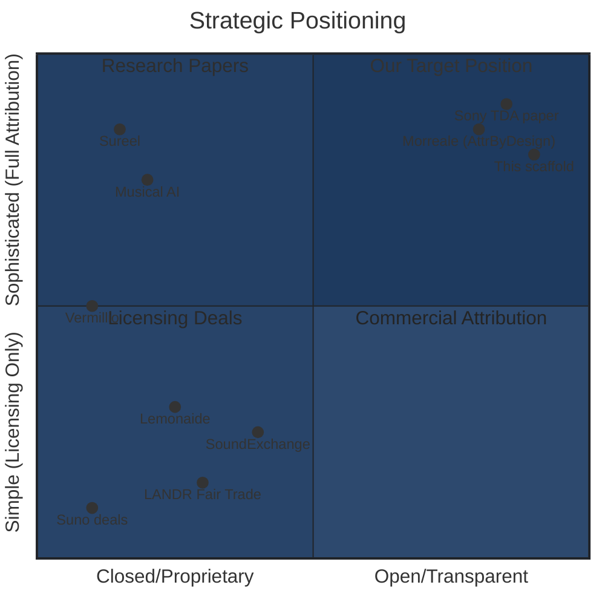

# Strategic Implications — Music Attribution Scaffold

> **Parent**: [README.md](README.md) > Strategic Implications
> **Updated**: 2026-02-10

---

## What No One Else Offers

Six capabilities differentiate this scaffold from every commercial player in the market:

### 1. Open-Source Transparency

| Aspect | Our Scaffold | Competitors |
|--------|-------------|-------------|
| **Code** | MIT/Apache licensed, public GitHub | Proprietary, closed-source |
| **Methodology** | Published SSRN preprint | Trade secrets |
| **Auditable** | Anyone can inspect attribution logic | "Trust our API" |
| **Extensible** | Fork, modify, contribute | Locked to vendor roadmap |

**Why it matters**: The EU AI Act (effective August 2026) requires transparency in AI systems. Open-source attribution methodology positions this scaffold as the *compliance-friendly* choice. Regulatory bodies can audit the system. Academic researchers can validate the methodology. Rights holders can verify that confidence scores are meaningful.

**Nearest competitor**: None. Every attribution company (Sureel, Musical AI, Vermillio, ProRata) is proprietary.

---

### 2. A0-A3 Assurance Levels

| Level | Definition | Evidence Required | Confidence Source |
|-------|-----------|-------------------|-------------------|
| **A0** (Unknown) | No provenance data available | None | Prior distribution only |
| **A1** (Self-Declared) | Artist's own claim | Self-report | Self-report reliability + historical accuracy |
| **A2** (Source-Verified) | Cross-referenced against databases | 2+ agreeing sources | Source agreement probability |
| **A3** (Identity-Verified) | Full verification chain | Institutional verification (CMO, label, ISNI) | Cryptographic/institutional proof |

**Why it matters**: No competitor provides a formal framework for *how confident* they are in an attribution. Sureel claims "86-90% accuracy" but doesn't specify what that means for individual tracks. Musical AI produces "royalty sheets" with percentages but doesn't communicate uncertainty.

Our assurance levels are formally defined, mapped to evidence types, and backed by conformal prediction intervals. This is the difference between "we think Artist X contributed 30%" and "with 90% probability, Artist X contributed between 25% and 37%."

**Nearest competitor**: Sureel has "attribution likelihood" but without a formal framework.

---

### 3. Conformal Prediction Confidence

**What it is**: Conformal prediction provides distribution-free, finite-sample valid coverage guarantees. This means we can say "with probability ≥ 90%, the true attribution falls within this interval" — and that guarantee holds regardless of the underlying data distribution.

**Why it matters for attribution**:
- Traditional confidence intervals assume normality → unreliable for skewed attribution distributions
- Bayesian credible intervals assume the prior is correct → circular reasoning
- Conformal prediction intervals are valid regardless of model assumptions

**No competitor uses formal UQ methods**. This is a genuine differentiator with both academic and practical value.

**Nearest competitor**: No one.

---

### 4. MCP Permission Patchbay

**What it is**: A Model Context Protocol server that enables AI platforms to query: "Can I use Artist X's catalog for training? Under what terms?"

**Why it matters**: As AI music generation moves to licensed-only models (Suno post-Warner, Udio's pivot), every platform needs a way to check permissions. Our MCP server provides this as a standard protocol query rather than bespoke API integration.

**Integration potential**:
- AI platforms (Suno, Soundverse, Beatoven.ai) query permissions before training
- Rights organizations (STIM, ASCAP, BMI) register permissions
- The scaffold becomes the neutral permission layer between rights holders and AI companies

**Nearest competitor**: SoundExchange AI Registry is closest but uses a proprietary registration system, not MCP.

---

### 5. Domain-Agnostic Backbone

**What it is**: The core architecture — entity resolution + confidence scoring + permissioned API + agentic consumers — works for any domain with fragmented metadata and provenance requirements.

**The isomorphism**:

| Music Attribution | DPP Traceability | Generic Graph RAG |
|------------------|------------------|-------------------|
| Discogs + MusicBrainz | GS1 + EPCIS | Any fragmented sources |
| Entity resolution | Product matching | Entity linking |
| Artist/Credit + A0-A3 | Product/Passport + T0-T3 | Entity/Record + confidence |
| MCP permission server | Digital Link resolver | API gateway |
| AI music platforms | Supply chain agents | Any agentic consumer |

**Why it matters**: Music attribution is the first domain, but the scaffold's value extends to Digital Product Passports (EU ESPR regulation), supply chain traceability, academic citation networks, and any domain where fragmented data must be reconciled with transparent confidence.

**Nearest competitor**: All competitors are music-only.

---

### 6. Academic Foundation

**What it is**: The scaffold is companion code to Teikari, P. (2026). "Music Attribution with Transparent Confidence." SSRN No. 6109087.

**Why it matters**:
- Published methodology creates credibility that "trust us" doesn't
- Academic citations create a feedback loop (researchers cite → more visibility → more adoption)
- Regulatory bodies reference academic work when drafting guidelines
- The paper establishes intellectual priority for the A0-A3 framework

**Nearest competitor**: Morreale et al. (2025) "Attribution-by-Design" is theoretical only (no implementation).

---

## Strategic Positioning Map



### Reading the Map

- **Top-right (our position)**: Sophisticated attribution + open/transparent. Unique space. The only other entities here are academic papers — which have no implementation.
- **Top-left (Sureel, Musical AI)**: Sophisticated attribution but proprietary. These are our complementary partners, not competitors.
- **Bottom-left (Suno deals, LANDR)**: Simple licensing, proprietary. High traction, low sophistication.
- **Bottom-right**: Empty. Simple + open has no value proposition.

**Strategic insight**: Our position is defensible because it requires *both* academic rigor and engineering execution. Papers alone can't serve as infrastructure. Proprietary systems alone can't provide transparency. We're the only entity combining both.

---

## Competitive Strategy

### Paradigm: Complement, Don't Compete

The scaffold should be positioned as **infrastructure that attribution companies plug into**, not as a competitor to them.

```
                Attribution Companies
                (Sureel, Musical AI)
                        ↓
                Attribution Scores
                        ↓
    ┌───────────────────────────────────────┐
    │         This Scaffold                 │
    │  Entity Resolution + Confidence       │
    │  + MCP Permission Server              │
    │  + Expert Feedback + Audit Trail      │
    └───────────────────────────────────────┘
                        ↓
                Transparent, Auditable
                Attribution Records
                        ↓
                AI Platforms, CMOs,
                Regulatory Bodies
```

### Why This Works

1. **Sureel/Musical AI benefit**: They gain a transparent, auditable layer on top of their proprietary attribution. This helps their sales pitch: "Our attribution is verified by an open, auditable infrastructure."
2. **AI platforms benefit**: They get a standard query interface (MCP) rather than integrating with multiple proprietary APIs.
3. **Rights holders benefit**: They get transparency into how attribution decisions are made.
4. **Regulators benefit**: They get an auditable system for compliance verification.

---

## Industry Gap Analysis

Based on comprehensive review of all platforms, 10 critical gaps remain unsolved:

| # | Gap | Why It Matters | Who's Closest |
|---|-----|---------------|---------------|
| 1 | **No production-ready per-output attribution** | Every platform uses licensing-only, watermarking-only, or early prototypes | Sureel (86-90% claimed), Musical AI |
| 2 | **Influence functions are computationally intractable at scale** | Leave-one-out requires retraining millions of times | Sony (NeurIPS 2025) working on scaling |
| 3 | **Embedding similarity conflates correlation with causation** | Similar ≠ influenced by; coincidence indistinguishable from training influence | Barnett et al. acknowledge this explicitly |
| 4 | **Compositional vs. recording attribution unsolved** | Split-rights structure requires separating melody/lyrics from production | Sureel (only claimant) |
| 5 | **Synthetic data chains create attribution debt** | AI-generated data training subsequent models makes tracing exponentially harder | No one |
| 6 | **Hidden architectural dependencies untracked** | Encoders/compression modules trained on separate datasets influence every output | No one |
| 7 | **No interoperability standard** | Each platform uses proprietary formats; no cross-platform attribution protocol | **Our MCP approach addresses this** |
| 8 | **Opt-in fragmentation** | Multi-writer tracks (10+ writers common in pop/hip-hop) fail if any writer declines | Source Audio (one-stop rights) |
| 9 | **Oracle Problem remains fundamental** | Digital systems cannot fully verify physical/training reality | Theoretical ceiling acknowledged in our SSRN paper |
| 10 | **Gap between deterrence and detection** | Industry converging on deterrence economics rather than perfect attribution | All platforms implicitly |

### Emerging Industry Convergence: Layered Approach

The industry is settling on a five-layer approach, but no single company offers all layers:

| Layer | Purpose | Current Leaders |
|-------|---------|----------------|
| **Legal** | Licensing agreements | Suno/WMG, Udio/UMG |
| **Provenance** | Watermarking ("was this AI-generated?") | Google SynthID |
| **Influence** | Approximate attribution ("which training data contributed?") | Soundverse, Sureel, Musical AI |
| **Enforcement** | Fingerprinting and scanning | Udio, Soundverse Deep Search |
| **Compensation** | Revenue sharing tied to licensing tiers | All platforms |

**Our scaffold's unique position**: We can provide the **confidence and trust layer** that sits across all five layers — auditing and communicating how reliable each layer's output is.

---

## Six Strategic Recommendations

### 1. Don't Compete on Training-Time TDA

Leave gradient-tracking to Sureel, Sony, and Musical AI. Our value is in the *metadata layer* (entity resolution, confidence, permissions), not the model internals.

**Why**: Training-time TDA requires:
- Integration during model training (we don't control any models)
- Massive compute for retraining experiments
- Patent-protected methods (Sureel has 5 patents)
- Access to training data (we don't have billions of songs)

**Instead**: Be the layer that *interprets and communicates* attribution results from any TDA method. Our confidence scoring works regardless of whether attribution came from unlearning (Sony), influence functions (Sureel), or embedding similarity (our own).

---

### 2. Partner, Don't Replace

Design the MCP server so Musical AI, Sureel, or STIM could plug into our permission infrastructure. We provide the consent query layer; they provide the attribution computation.

**Concrete integration points**:
- Musical AI's "royalty sheet" → ingested as A2 attribution data in our system
- Sureel's "attribution graph" → consumed as evidence for confidence scoring
- STIM's licensing decisions → registered as permissions in our MCP server
- SoundExchange Registry → queried as A3 verification source

---

### 3. Traction > Technical Sophistication

The market repeatedly shows that trust and adoption matter more than attribution precision.

**Evidence**:
- Water & Music: "Perfect attribution doesn't exist... trust matters more"
- Suno settled with Warner for flat licensing, not attribution-based compensation
- LANDR's ~20% pro-rata model requires zero attribution technology
- Musical AI's success comes from industry relationships (ex-Beatport CEO), not published accuracy metrics

**Action**: Focus first on getting Imogen/Andy's catalogs into the system. One enthusiastic artist who shows the system to others is worth more than a 10% improvement in entity resolution F1-score.

---

### 4. Open-Source Is the Moat

In a market where everyone is proprietary, being the only open, auditable attribution system creates unique positioning.

**For regulatory compliance**: EU AI Act mandates transparency in AI systems affecting individuals' rights. An open-source attribution system is the easiest path to compliance for any AI platform.

**For academic credibility**: Researchers can cite, replicate, and build on our methodology. This creates a network effect that proprietary systems can't match.

**For talent**: Engineers are more attracted to contributing to open-source projects than proprietary systems.

**For trust**: Rights holders who've been burned by opaque streaming royalty calculations want to *see* how attribution works.

---

### 5. Start with A1-A2, Earn A3

MVP should handle self-declared (A1) and source-verified (A2) attributions well. Identity-verified (A3) requires institutional verification infrastructure that can come later.

**A1 (Self-Declared)** is achievable immediately:
- Artist registers and claims their catalog
- System confirms claims against MusicBrainz/Discogs
- Any confirmed claims become A1

**A2 (Source-Verified)** requires cross-referencing:
- Multiple database sources agree
- Audio fingerprint matches confirm recording identity
- Expert review provides additional evidence

**A3 (Identity-Verified)** requires infrastructure:
- ISNI verification
- CMO confirmation (STIM, ASCAP, etc.)
- Institutional signing (label confirmation)
- This is a V2+ feature

---

### 6. The Feedback Loop IS the Product

The domain expert FeedbackCard system is not a feature — it's the core value proposition. Better human input → better confidence → more trust → more users.

**Why this matters more than technical sophistication**:
- A system that gets 70% of attributions right but has excellent expert correction UX will *quickly become* a system that gets 95% right
- A system that gets 90% right but has no correction mechanism will *stay at 90%* — and the 10% errors will erode trust

**Design implication**: The feedback system should be designed *first*, not bolted on after the entity resolution engine. The expert correction workflow should shape the database schema, the confidence model, and the API design.

---

## Market Timing Analysis

### Why Now?

1. **Suno/Warner deal (Nov 2025)**: Establishes that AI music companies *must* license → creates demand for attribution infrastructure
2. **STIM collective licence (Sep 2025)**: First collective licensing framework → creates template for global CMO adoption
3. **EU AI Act (effective Aug 2026)**: Mandates transparency → creates compliance demand for auditable systems
4. **Musical AI Series A (Jan 2026)**: Validates investor interest in attribution infrastructure
5. **Transition period**: Industry is between "wild west" and "fully licensed" → maximum opportunity for standard-setting

### Why Open-Source Now?

The window for establishing open standards in music attribution is narrow:
- If Sureel or Musical AI become de facto standards with proprietary APIs, interoperability becomes an afterthought
- If each CMO builds its own registry (STIM already has), fragmentation increases
- An open protocol established *during the transition* has the best chance of becoming the common layer

---

## Reviewer Feedback Log

This section tracks iterative domain expert feedback on the entire landscape report.

| Date | Reviewer | Domain | Key Feedback | Resolution |
|------|----------|--------|-------------|------------|
| 2026-02-10 | Initial draft | — | Generated from web research + local sources | — |
| — | *Imogen* | Artist/songwriter | *Pending* | — |
| — | *Andy* | Rights administration | *Pending* | — |
| — | *Technical reviewer* | Engineering | *Pending* | — |

### Reviewer Instructions

When reviewing this document:

1. **Check factual accuracy**: Are the company descriptions, funding amounts, and partnership details correct?
2. **Assess market positioning**: Does the strategic positioning map accurately reflect the competitive landscape?
3. **Evaluate risk estimates**: Are the probability estimates in the risk framework reasonable?
4. **Identify missing players**: Are there important companies, projects, or approaches we've missed?
5. **Validate MVA scope**: Is the proposed minimum viable architecture sufficient to demonstrate value?
6. **Comment on feedback mechanisms**: Would the proposed expert feedback interface work for you?

Submit corrections as FeedbackCards (see [09-feedback-mechanisms.md](09-feedback-mechanisms.md)) or free-text comments.

---

## Sources Index (Comprehensive)

### Company Sources

| Source | URL | Accessed |
|--------|-----|----------|
| Musical AI funding (MBW) | [musicbusinessworldwide.com](https://www.musicbusinessworldwide.com/musical-ai-bags-4-5m-in-funding-round-to-scale-ai-attribution-tech/) | 2026-02-10 |
| Musical AI funding (DMN) | [digitalmusicnews.com](https://www.digitalmusicnews.com/2026/01/13/musical-ai-funding-january-2026/) | 2026-02-10 |
| Sureel AI (A2IM) | [a2im.org](https://a2im.org/ams-sureel-ai/) | 2026-02-10 |
| Sureel patents | [patents.justia.com](https://patents.justia.com/assignee/sureel-inc) | 2026-02-10 |
| STIM-Sureel deal (DMN) | [digitalmusicnews.com](https://www.digitalmusicnews.com/2025/09/26/stim-taps-sureel-ai-attribution-tracking/) | 2026-02-10 |
| Vermillio (Axios) | [axios.com](https://www.axios.com/2025/03/03/vermillio-ai-rights-licensing-sony-music) | 2026-02-10 |
| Suno Series C (TechCrunch) | [techcrunch.com](https://techcrunch.com/2025/11/19/legally-embattled-ai-music-startup-suno-raises-at-2-45b-valuation-on-200m-revenue/) | 2026-02-10 |
| Warner-Suno deal (MBW) | [musicbusinessworldwide.com](https://www.musicbusinessworldwide.com/warner-music-group-settles-with-suno-strikes-first-of-its-kind-deal-with-ai-song-generator/) | 2026-02-10 |
| UMG-Udio (Hollywood Reporter) | [hollywoodreporter.com](https://www.hollywoodreporter.com/music/music-industry-news/universal-music-group-announces-settlement-with-udio-1236414023/) | 2026-02-10 |
| Fairly Trained certified | [fairlytrained.org](https://www.fairlytrained.org/certified-models) | 2026-02-10 |
| Soundverse whitepaper | [soundverse.ai](https://www.soundverse.ai/blog/article/soundverse-just-released-a-blueprint-for-fair-ai-music) | 2026-02-10 |
| SoundExchange AI Registry | [soundexchange.com](https://www.soundexchange.com/news/soundexchange-developing-global-ai-sound-recording-registry/) | 2026-02-10 |
| Mubert + Polkadot | [mubert.com](https://mubert.com/blog/mubert-partners-with-polkadot-and-web3-foundation-to-build-a-decentralized-data-chain-for-creators-and-generative-ai) | 2026-02-10 |

### Academic Sources

| Paper | arXiv/DOI | Year |
|-------|-----------|------|
| Choi et al. "Large-Scale TDA via Unlearning" | [2506.18312](https://arxiv.org/abs/2506.18312) | 2025 |
| Morreale et al. "Attribution-by-Design" | [2510.08062](https://arxiv.org/abs/2510.08062) | 2025 |
| Barnett et al. "Musical Roots via Audio Embeddings" | [2401.14542](https://arxiv.org/abs/2401.14542) | 2024 |
| Epple et al. "Watermarking Training Data" | [2412.08549](https://arxiv.org/abs/2412.08549) | 2024 |
| Batlle-Roca et al. "MiRA" | [2407.14364](https://arxiv.org/abs/2407.14364) | 2024 |
| Kang et al. "AudioGenX" | [2502.00459](https://arxiv.org/abs/2502.00459) | 2025 |
| Afchar et al. "AI Music Detection" | [2501.10111](https://arxiv.org/abs/2501.10111) | 2025 |
| Dornis & Stober "Gen AI Training & Copyright" | [2502.15858](https://arxiv.org/abs/2502.15858) | 2025 |
| Lin et al. "DAS" | [2410.18639](https://arxiv.org/abs/2410.18639) | 2024 |
| Ji et al. "SSIMuse" | [2509.13658](https://arxiv.org/abs/2509.13658) | 2025 |
| Zhou et al. "FeedbackCards" | [2307.15475](https://arxiv.org/abs/2307.15475) | 2023 |

### Industry Analysis

| Source | URL |
|--------|-----|
| Water & Music: Music AI Attribution | [waterandmusic.com](https://www.waterandmusic.com/music-ai-attribution/) |
| Water & Music: Investor Recap | [waterandmusic.com](https://www.waterandmusic.com/music-tech-capital-investor-recap-nyc/) |
| Music Ally: A to Z of AI Music 2025 | [musically.com](https://musically.com/2025/12/17/the-a-to-z-of-ai-music-in-2025-part-4-transparency-to-zero-sum-game/) |
| MusicWorks: Data & Licensing | [musicworks.substack.com](https://musicworks.substack.com/p/data-licensing-and-the-future-of) |
| Billboard: Top AI Music Companies 2026 | [billboard.com](https://www.billboard.com/lists/top-ai-music-companies-2026-future-music/) |
| Appetite for Distraction: Computational Copyright | [appetitefordistraction.xyz](https://www.appetitefordistraction.xyz/p/not-another-rant-on-ethical-training) |
