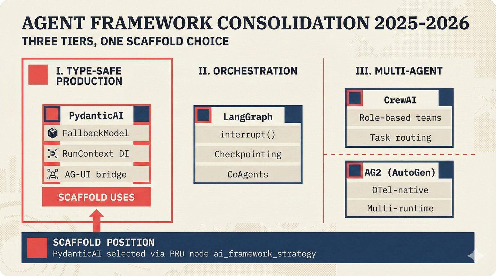
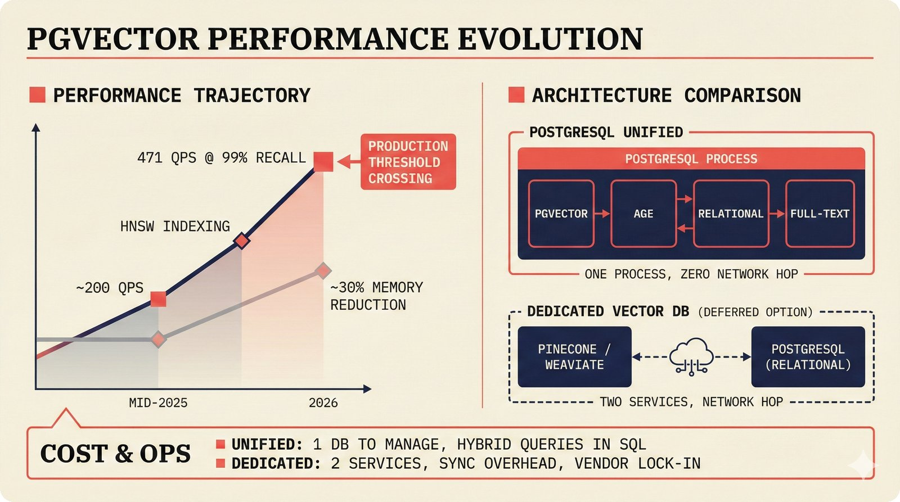
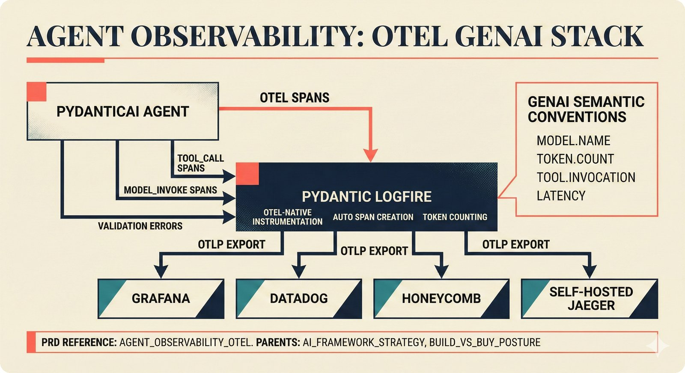
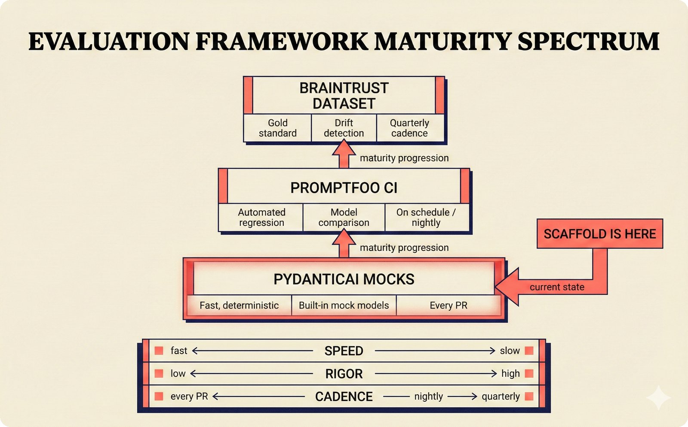
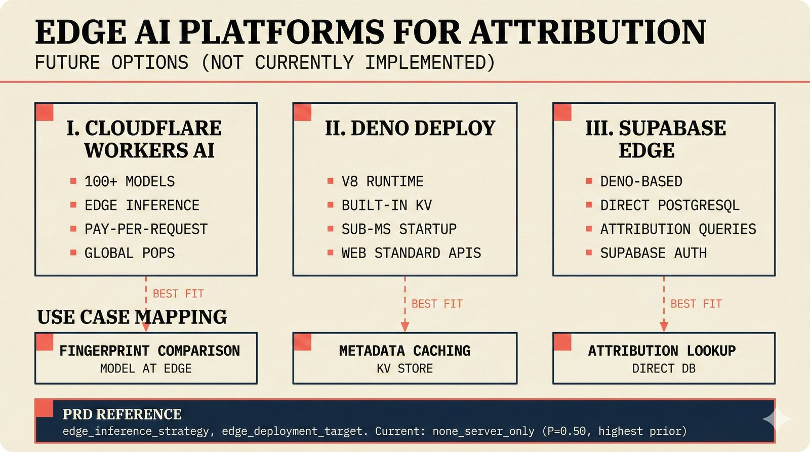
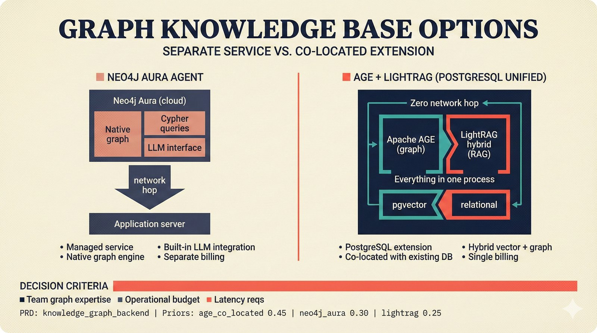
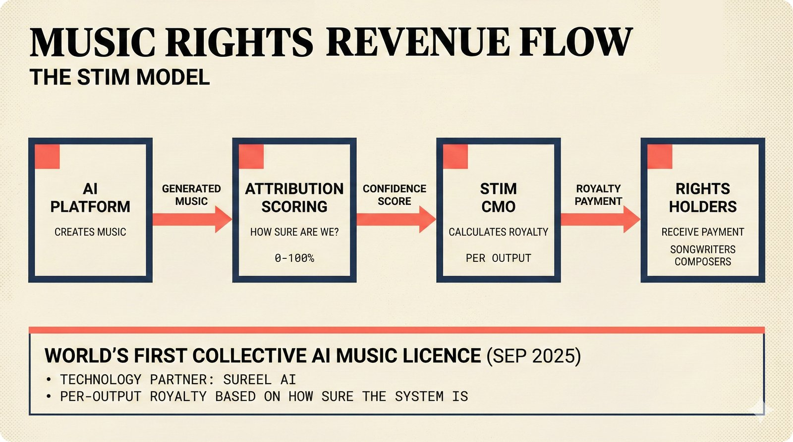
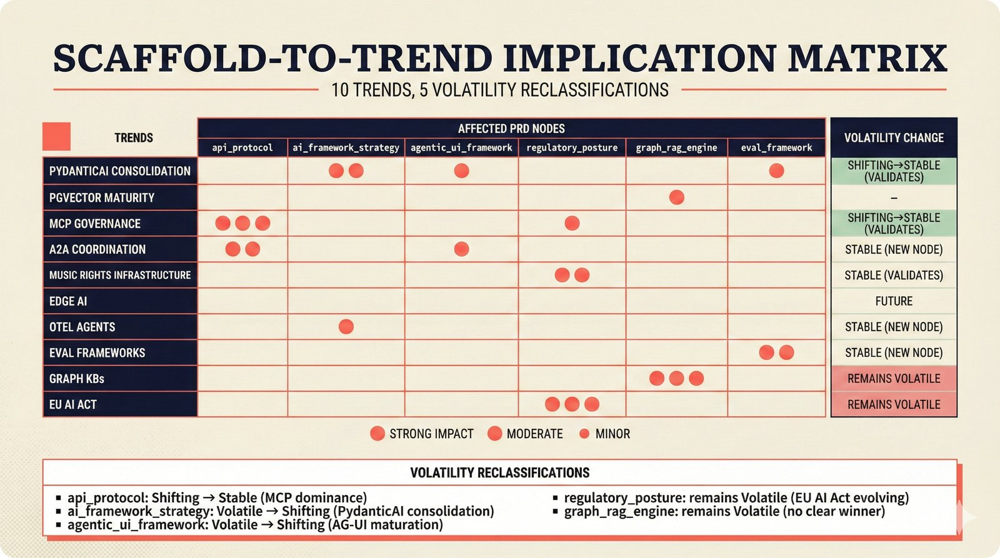

# Technology Trends: Agentic Infrastructure for Music Attribution (February 2026)

**Date:** 2026-02-14
**Status:** Research Report
**Scope:** Agent frameworks, protocol convergence, music rights infrastructure, infrastructure trends, developer tooling
**Companion to:** Teikari, P. (2026). *Music Attribution with Transparent Confidence*. SSRN No. 6109087.

---

## 1. Executive Summary

The agentic AI infrastructure landscape has undergone rapid consolidation in the twelve months since the Music Attribution Scaffold's initial design. Agent frameworks are converging around a small number of production-grade options. Protocol standards — long fragmented across competing proposals — are crystallizing toward a three-layer stack: MCP for tool access, A2A for agent coordination, and an identity/authorization layer (XAA or OAuth 2.1 profiles). Meanwhile, the music industry is making its first concrete moves toward AI licensing infrastructure, with STIM's collective licence pilot [1] and SoundExchange's AI training authorization registry [2] representing early institutional responses to generative music's commercial reality.

This report synthesizes current trends across six domains and maps their implications to the scaffold's probabilistic PRD decision network. Key findings:

- **Agent framework consolidation** favors PydanticAI for Python-first projects, with LangGraph occupying the orchestration tier and CrewAI/AG2 serving specialized multi-agent patterns.
- **Protocol convergence** is real but incomplete: MCP (tools) + A2A (coordination) is the likely stable pair, with identity remaining contested between Okta's XAA and OAuth 2.1 profiles.
- **Music rights infrastructure** is moving faster than expected, with CMO pilots, registry expansions, and Fairly Trained certification creating new integration surfaces.
- **Edge AI and vector databases** are production-ready for attribution workloads, with pgvector reaching 471 QPS at 99% recall [3] and Cloudflare Workers AI supporting lightweight inference.
- **Observability for agents** is maturing via OpenTelemetry semantic conventions, Pydantic Logfire, and dedicated eval frameworks.
- **EU AI Act GPAI enforcement** (August 2025 obligation date, with Code of Practice published July 2025) creates compliance urgency for any system processing AI-generated music content [4].

---

## 2. Agent Framework Consolidation

### 2.1 PydanticAI: The Type-Safe Foundation

PydanticAI has established itself as the leading Python agent framework for production systems that prioritize type safety and testability [5]. Key developments since mid-2025:

- **v0.2+ release series** introduced structured tool definitions with automatic JSON Schema generation from Pydantic models, making tool interfaces self-documenting and validatable at compile time.
- **FallbackModel** enables transparent multi-provider failover (Anthropic → OpenAI → Gemini) without application code changes — directly used by the scaffold's `ATTRIBUTION_AGENT_MODEL` configuration.
- **Dependency injection** via `RunContext` provides typed access to databases, API clients, and configuration, enabling clean separation between agent logic and infrastructure.
- **AG-UI protocol support** through CopilotKit's `copilotkit-python` SDK bridges PydanticAI agents to frontend agentic UI frameworks via Server-Sent Events (SSE).

PydanticAI's design philosophy — "agents as functions, not pipelines" — aligns with the scaffold's modular monolith architecture. The framework treats agents as callable units with typed inputs/outputs, composable via standard Python rather than proprietary DAG definitions.

### 2.2 LangGraph: Orchestration Tier

LangGraph (LangChain's graph-based orchestration layer) occupies a different niche: complex multi-step workflows requiring checkpointing, human-in-the-loop interrupts, and branching logic [6]. Version 0.3+ introduced:

- **`interrupt()` primitive** for synchronous human approval within agentic loops, directly relevant to attribution review workflows where AI suggestions require human sign-off.
- **Persistent state management** via PostgreSQL or Redis backends, enabling long-running attribution pipelines that survive process restarts.
- **CoAgents integration** with CopilotKit, providing an alternative to PydanticAI for teams already invested in the LangChain ecosystem.

For the scaffold, LangGraph remains a "watch" rather than "adopt" technology. The additional abstraction layer adds complexity without clear benefit for the current single-agent architecture, though multi-agent attribution pipelines (e.g., separate agents for metadata extraction, entity resolution, and confidence scoring) could justify its adoption in future iterations.

### 2.3 CrewAI and AG2 (AutoGen)

CrewAI continues to target the "agent team" pattern with role-based agent definitions and built-in collaboration protocols [7]. AG2 (the Microsoft-to-community successor of AutoGen) has integrated OpenTelemetry observability, making agent interactions traceable through standard infrastructure [8]. Neither framework has achieved PydanticAI's adoption velocity in the Python ecosystem, though both serve valid use cases for teams preferring higher-level abstractions.

### 2.4 AG-UI: The Frontend Protocol

The Agent-User Interaction Protocol (AG-UI) has emerged as the de facto standard for connecting backend agents to frontend frameworks [9]. Originally developed alongside CopilotKit, AG-UI defines a streaming event protocol (SSE-based) for:

- **Text streaming** with token-level granularity
- **Tool call visualization** showing agent reasoning to users
- **State synchronization** between agent and UI via shared state objects
- **Human-in-the-loop** interrupts that pause agent execution for user input

The scaffold's implementation uses AG-UI via CopilotKit's `copilotkit-python` SDK, which adapts PydanticAI agents to the AG-UI event stream. This architecture is well-positioned for the protocol's maturation, as AG-UI's specification is now maintained by the CopilotKit open-source community with input from multiple framework providers.

---

## 3. Protocol Convergence

### 3.1 The Current Landscape

The "protocol soup" of 2025 — MCP, A2A, ACP, AP2, TAP, XAA — is beginning to resolve into distinct layers [10]:

| Layer | Protocol | Governance | Function |
|-------|----------|------------|----------|
| **Tool Access** | MCP | AAIF / Linux Foundation | Agent ↔ tool communication |
| **Agent Coordination** | A2A v0.3 | Linux Foundation | Agent ↔ agent task delegation |
| **Commerce** | ACP | OpenAI + Stripe | Payment orchestration |
| **Identity** | XAA | Okta (proposed) | Agent authentication/authorization |
| **Verification** | TAP | Visa | Transaction verification |

### 3.2 MCP → AAIF Governance

MCP's donation to the Agentic AI Foundation (AAIF) in December 2025 was the pivotal governance event [11]. With Anthropic, AWS, Google, Microsoft, and OpenAI as platinum members, the protocol has effectively become an industry standard. The November 2025 specification update added:

- **OAuth 2.1 Resource Server classification** (mandatory for production deployments)
- **RFC 8707 Resource Indicators** for fine-grained token scoping
- **SEP-1024** client security requirements
- **Asynchronous execution** support for long-running tools

For the scaffold, MCP governance stability reduces the risk of protocol abandonment — a concern that had kept the `api_protocol` decision node volatile. The AAIF structure also enables future MCP Registry submission for the scaffold's attribution tools, increasing discoverability.

### 3.3 A2A: Agent-to-Agent Coordination

Google's Agent-to-Agent protocol, donated to the Linux Foundation in early 2026, provides the coordination layer MCP lacks [12]. While MCP handles tool invocation (agent calls a function), A2A handles task delegation (agent asks another agent to complete a subtask). Version 0.3 introduced:

- **Agent Cards** — machine-readable capability descriptions enabling dynamic agent discovery
- **Task lifecycle management** — states (submitted, working, input-needed, completed, failed) with streaming updates
- **Push notifications** via webhooks for asynchronous task completion

A2A is relevant to the scaffold's future multi-agent architecture: a "metadata extraction agent" could delegate to a "MusicBrainz lookup agent" and a "confidence scoring agent" via A2A task delegation, with each agent maintaining its own MCP tool connections.

### 3.4 Convergence Thesis: MCP + A2A + Identity

The emerging consensus is a three-layer stack [13]:

1. **MCP** for tool access (agent ↔ capability)
2. **A2A** for coordination (agent ↔ agent)
3. **Identity layer** for authorization (TBD: XAA, OAuth 2.1 profiles, or AAIF-native)

ACP (OpenAI + Stripe) and TAP (Visa) operate at the commerce layer, building on top of this stack rather than competing with it. AP2 (Google's commerce protocol) is converging with ACP through a proposed Universal Commerce Protocol (UCP) interoperability layer.

The identity layer remains the most contested territory. Okta's XAA (eXtended Agent Authentication) proposes agent-specific authentication flows with delegation chains, while the AAIF's approach builds on existing OAuth 2.1 with agent-aware extensions. The scaffold's current design uses OAuth 2.1 with three-tier access control, which is compatible with either resolution.

---

## 4. Music Rights Infrastructure

### 4.1 STIM Collective Licence Pilot

The Swedish Performing Rights Society (STIM) launched the world's first collective licence for AI-generated music in September 2025, developed in partnership with Sureel AI [1]. Key parameters:

- **Scope**: Covers generative music services operating in Sweden
- **Mechanism**: Per-output royalty based on attribution confidence scores
- **Technology partner**: Sureel AI provides the attribution/identification engine (claimed 86–90% accuracy, 5 patents pending)
- **Significance**: First CMO to create a licensing framework specifically for AI music generation, establishing a precedent that other CMOs (GEMA, PRS, ASCAP/BMI) are evaluating

For the scaffold, the STIM pilot validates the core thesis that attribution infrastructure enables licensing infrastructure. The `sureel_ai_partnership` and `stim_cmo_pilot` PRD nodes capture the integration surface with this emerging ecosystem.

### 4.2 SoundExchange AI Training Authorization Registry

SoundExchange, the U.S. digital performance rights organization managing 126M+ ISRCs, announced an AI training authorization registry in September 2024, with operational deployment progressing through 2025 [2]. The registry enables:

- **Rights holders** to declare training authorization preferences per recording (opt-in, opt-out, conditional)
- **AI companies** to query authorization status before including recordings in training datasets
- **Audit trail** linking training data to authorization status

This registry represents the closest existing implementation to the scaffold's `check_permissions` MCP tool concept. Integration would provide authoritative training consent data for U.S. repertoire, complementing the scaffold's metadata-based attribution with rights-holder intent signals.

### 4.3 Fairly Trained Certification

Fairly Trained, founded by Ed Newton-Rex (former VP of Audio at Stability AI), has certified 19 entities as of early 2026 for training only on licensed or public domain data [14]. The certification provides:

- **Binary signal**: Certified or not (no partial credit)
- **Audit-based**: Third-party review of training data provenance
- **Market signal**: Differentiator for AI music companies competing on ethical positioning

The certification is relevant to the scaffold as both a potential integration target (displaying Fairly Trained status alongside attribution data) and as validation of the market demand for provenance transparency that the scaffold's A0-A3 assurance framework addresses.

### 4.4 Suno and Udio: The Platform Shift

The two leading AI music generation platforms have followed divergent paths:

- **Suno** raised $250M at a $2.45B valuation, signed a licensing deal with Warner Music Group, and acquired Songkick (live events) — signaling a pivot from pure generation toward a full music platform [15].
- **Udio** settled copyright infringement suits with UMG and WMG, pivoting toward a "walled garden" model with licensed training data and explicit attribution to source material [16].

Both trajectories validate the scaffold's `ai_music_platform_connector` concept: as these platforms add attribution metadata to their outputs, downstream systems need infrastructure to consume and verify it.

---

## 5. Infrastructure Trends

### 5.1 Edge AI for Attribution

Edge inference is reaching production maturity for lightweight attribution workloads:

- **Cloudflare Workers AI** supports inference on 100+ models at edge locations with pay-per-request pricing, suitable for audio fingerprint comparison and metadata extraction [17].
- **Deno Deploy** provides V8-based edge functions with built-in KV storage, relevant for caching attribution lookups at the edge.
- **Supabase Edge Functions** (Deno-based) integrate directly with Supabase's PostgreSQL backend, enabling edge-to-database attribution queries without intermediate API layers.

The scaffold's `edge_inference_strategy` node captures these options, with the `none_server_only` option (P=0.50) reflecting the current MVP state and edge options reserved for scale-out scenarios.

### 5.2 Vector Databases: pgvector Maturity

pgvector has crossed a critical performance threshold for production attribution workloads:

- **471 QPS at 99% recall** on standard benchmark datasets (Shakudo 2026 benchmarks) [3], up from ~200 QPS in mid-2025
- **HNSW indexing** improvements reduce memory footprint by ~30% compared to IVFFlat for the same recall level
- **Hybrid search** (vector + full-text + structured filters) in a single PostgreSQL query, eliminating the need for separate vector database infrastructure

For the scaffold, pgvector's maturation reinforces the "PostgreSQL Unified" architecture decision (P=0.45 in `primary_database`), as vector similarity search for audio embeddings can now run alongside relational queries and graph traversal (via Apache AGE) in a single database process.

### 5.3 Graph Knowledge Bases

The knowledge graph space is evolving in two directions relevant to attribution:

- **Neo4j Aura Agent** provides a managed graph database with built-in LLM integration for natural language graph queries [18]. Useful for teams preferring a dedicated graph database over PostgreSQL extensions.
- **GraphRAG patterns** (Microsoft's approach to graph-augmented retrieval) have been adapted for knowledge-intensive domains, with LightRAG providing a lightweight PostgreSQL-native implementation [19].
- **LanceDB** offers serverless vector + metadata storage optimized for ML workloads, though its relevance to the scaffold is limited given pgvector's sufficient performance.

The `knowledge_graph_backend` PRD node captures the choice between Apache AGE (PostgreSQL extension, P=0.45), dedicated Neo4j (P=0.30), and hybrid approaches (P=0.25).

---

## 6. Developer Tooling

### 6.1 OpenTelemetry for Agents

OpenTelemetry (OTel) semantic conventions for AI/LLM workloads are maturing toward stability [20]:

- **Gen AI semantic conventions** (experimental → stable track) define standard span attributes for LLM calls: model name, token counts, tool invocations, and response metadata.
- **AG2 OTel integration** (February 2026) demonstrates that multi-agent frameworks are adopting OTel natively rather than building proprietary observability [8].
- **Pydantic Logfire** provides OTel-native observability for PydanticAI agents with automatic span creation for tool calls, model invocations, and validation errors [21].

For the scaffold, OTel adoption via Logfire provides a standards-based path to agent observability that avoids vendor lock-in (replacing or complementing Langfuse). The `agent_observability_otel` PRD node captures this option.

### 6.2 Evaluation Frameworks

Agent evaluation has shifted from ad-hoc testing to structured frameworks:

- **Braintrust** provides dataset-driven evaluation with automatic scoring and regression detection, suitable for attribution accuracy measurement against gold-standard datasets [22].
- **Promptfoo** offers open-source prompt/model evaluation with CI/CD integration, enabling automated regression testing of attribution agent responses [23].
- **Custom eval harnesses** using PydanticAI's built-in testing utilities (mock models, deterministic responses) for unit-level agent testing — the approach the scaffold currently uses.

The `attribution_eval_framework` PRD node captures the progression from manual spot-checking (current state, P=0.35) through automated regression (recommended, P=0.45) to full CI-integrated evaluation (P=0.20).

### 6.3 CI/CD for ML Pipelines

ML pipeline orchestration continues converging on a few patterns:

- **GitHub Actions + DVC** for dataset versioning and experiment tracking, with CI pipelines triggering evaluation runs on model or data changes.
- **Dagster** (Python-native orchestrator) gaining traction over Airflow for ML-specific workflows, with built-in asset management and IO managers for database integration.
- **Modal** for serverless GPU compute in CI/CD, enabling attribution model evaluation without persistent GPU infrastructure.

---

## 7. Regulatory Landscape

### 7.1 EU AI Act: GPAI Enforcement

The EU AI Act's General-Purpose AI (GPAI) provisions represent the most significant regulatory development for music attribution infrastructure [4]:

- **August 2025**: GPAI obligations became enforceable, including transparency requirements (Art. 52) and technical documentation (Art. 53)
- **July 2025**: GPAI Code of Practice published, providing voluntary but influential guidance on copyright compliance and training data transparency
- **Art. 12 logging requirements**: Systems processing AI-generated content must maintain audit trails — directly relevant to MCP tool invocation logging
- **Penalties**: Up to EUR 35M or 7% of global annual turnover for non-compliance

The scaffold's `compliance_reporting_pipeline` and `regulatory_monitoring` PRD nodes capture the infrastructure needed to meet these obligations.

### 7.2 Digital Omnibus and Other Delays

The anticipated "Digital Omnibus" legislation (consolidating AI-related updates across digital services regulations) has been repeatedly delayed, with current expectations pushing into late 2026 or 2027. This creates regulatory uncertainty that the scaffold's probabilistic approach explicitly captures — the `regulatory_posture` node's "compliance first" option (P=0.15) reflects the low probability of teams committing to comprehensive compliance given the moving target.

---

## 8. Implications for the Music Attribution Scaffold

### 8.1 PRD Node Volatility Reclassifications

Based on the trends analyzed above, several PRD nodes warrant volatility reclassification:

| Node | Current | Proposed | Rationale |
|------|---------|----------|-----------|
| `api_protocol` | Shifting | **Stable** | MCP governance via AAIF reduces protocol risk |
| `ai_framework_strategy` | Volatile | **Shifting** | PydanticAI consolidation reduces framework churn |
| `agentic_ui_framework` | Volatile | **Shifting** | AG-UI standardization provides stability |
| `regulatory_posture` | Volatile | **Volatile** | EU AI Act enforcement confirms high uncertainty |
| `graph_rag_engine` | Volatile | **Volatile** | Rapid framework proliferation continues |

### 8.2 New Integration Surfaces

The trends reveal integration surfaces not captured in the current PRD:

1. **CMO licensing APIs** (STIM pilot, SoundExchange registry) — new `cmo_licensing_integration` and `soundexchange_registry` nodes
2. **AI music platform metadata** (Suno, Udio outputs) — new `ai_music_platform_connector` node
3. **Agent identity and authorization** (XAA, AAIF identity) — extension of existing `auth_strategy` node
4. **Edge inference for fingerprinting** — new `edge_inference_strategy` node
5. **OTel-native agent observability** — new `agent_observability_otel` node
6. **Fairly Trained certification** — new `fairly_trained_certification` node

### 8.3 Strategic Positioning

The scaffold's position as an open-source research tool with academic grounding provides unique advantages in the current landscape:

- **Neutrality**: Not aligned with any specific platform (Suno, Udio) or rights organization (STIM, SoundExchange), enabling integration with all
- **Transparency**: Open probabilistic PRD makes architectural assumptions inspectable, building trust with academic and industry reviewers
- **Modularity**: Stub-based PRD nodes enable gradual commitment as the landscape stabilizes, avoiding premature lock-in

---

## Visual Documentation

<strong>Technology Trends Figures (8 figures)</strong>

### Agent Framework Consolidation 2025-2026

*Agent framework consolidation into three tiers: PydanticAI for type-safe production (scaffold's choice), LangGraph for stateful orchestration, and CrewAI/AG2 for multi-agent coordination.*

### pgvector Performance Evolution

*pgvector reached 471 QPS at 99% recall, validating the PostgreSQL Unified architecture where vector search, graph queries, and relational data share a single database process.*

### Agent Observability: OTel GenAI Stack

*PydanticAI agents emit OpenTelemetry spans via Logfire, flowing through standard OTLP pipelines to any compatible backend -- Grafana, Datadog, Honeycomb, or self-hosted Jaeger.*

### Evaluation Framework Maturity Spectrum

*Three-tier evaluation pyramid for agent quality: PydanticAI mocks (unit), Promptfoo (CI regression), Braintrust (dataset-driven). The scaffold currently operates at the base tier.*

### Edge AI Platforms for Attribution

*Three edge AI platforms compared for attribution workloads: Cloudflare Workers AI (inference), Deno Deploy (caching), Supabase Edge (database queries). All are future options -- current PRD prior favors server-only.*

### Graph Knowledge Base Options

*Two graph knowledge base approaches: Neo4j Aura Agent (managed, separate service) vs Apache AGE + LightRAG (PostgreSQL co-located, zero network hop). PRD favors AGE co-located (P=0.45).*

### Music Rights Revenue Flow: STIM Model

*STIM revenue flow: when AI generates music, the attribution scaffold scores training influence, STIM calculates per-output royalties, and rights holders receive payment under the world's first collective AI music licence.*

### Scaffold-to-Trend Implication Matrix

*Scaffold-to-trend implication matrix: 10 technology trends mapped to PRD node impacts with 5 volatility reclassifications -- 2 stabilizing, 3 remaining volatile or shifting.*

---

## References

[1] STIM. "STIM launches world's first collective licence for AI-generated music." September 2025. https://www.stim.se/en/news/

[2] SoundExchange. "AI Training Authorization Registry." September 2024. https://www.soundexchange.com/

[3] Shakudo. "pgvector Benchmarks 2026: Performance at Scale." 2026. https://www.shakudo.io/blog/pgvector-benchmarks

[4] European Commission. "AI Act: General-Purpose AI Model Obligations." Official Journal of the EU, 2024. https://artificialintelligenceact.eu/

[5] PydanticAI Documentation. https://ai.pydantic.dev/

[6] LangGraph Documentation. https://langchain-ai.github.io/langgraph/

[7] CrewAI Documentation. https://docs.crewai.com/

[8] AG2 Project. "OpenTelemetry Integration for AG2." February 2026. https://ag2.ai/

[9] AG-UI Protocol Specification. https://docs.ag-ui.com/

[10] Teikari, P. (2026). "Music Attribution with Transparent Confidence." SSRN No. 6109087. Section on protocol landscape.

[11] Agentic AI Foundation (AAIF). "MCP donated to Linux Foundation." December 2025. https://www.linuxfoundation.org/

[12] Google. "Agent-to-Agent (A2A) Protocol." https://github.com/google/A2A

[13] Teikari, P. (2026). "Digital Product Passports as Agentic Supply Chain Infrastructure." SSRN. Section on protocol convergence.

[14] Fairly Trained. https://www.fairlytrained.org/

[15] Suno. "Suno raises $250M at $2.45B valuation." 2025. Multiple press sources.

[16] Udio. "Settlement with UMG and WMG." 2025. Multiple press sources.

[17] Cloudflare. "Workers AI." https://developers.cloudflare.com/workers-ai/

[18] Neo4j. "Aura Agent." https://neo4j.com/

[19] LightRAG Project. https://github.com/HKUDS/LightRAG

[20] OpenTelemetry. "Semantic Conventions for Gen AI." https://opentelemetry.io/docs/specs/semconv/gen-ai/

[21] Pydantic. "Logfire." https://pydantic.dev/logfire

[22] Braintrust. https://www.braintrust.dev/

[23] Promptfoo. https://www.promptfoo.dev/
