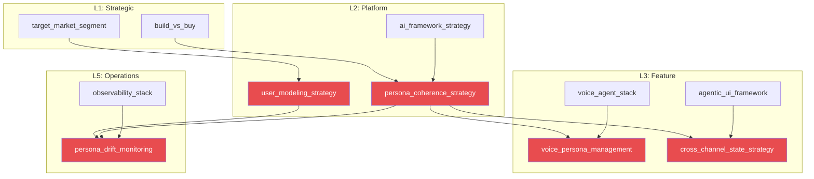

# Agent Persona Coherence, Hyperpersonalization, and Drift Detection: A Comprehensive Literature Review

**Last Updated:** 2026-02-20
**Scope:** Jan 2024 -- Feb 2026
**Companion to:** Teikari, P. (2026). *Music Attribution with Transparent Confidence*. SSRN No. 6109087.
**Context:** Persona coherence research for the Music Attribution Scaffold voice agent (PydanticAI + CopilotKit AG-UI + Pipecat)

---

## 1. Introduction

The proliferation of large language model (LLM)-based conversational agents has created an urgent need for principled approaches to persona coherence --- the ability of an agent to maintain a consistent identity, communication style, and behavioral profile across extended multi-turn interactions. This need is amplified when agents must serve dual purposes: acting both as factual attribution assistants and as creative digital twins of real artists. The Music Attribution Scaffold, a companion codebase to Teikari (2026), implements a tiered assurance framework (A0--A3) for music attribution provenance, with an existing PydanticAI agent, CopilotKit AG-UI streaming interface, and a planned Pipecat voice pipeline. Within this system, persona coherence is not merely a user experience consideration but a correctness requirement: an agent that drifts from its calibrated confidence posture risks communicating false certainty about attribution claims, with potential legal and ethical consequences.

The scaffold's voice agent serves two interconnected business purposes. First, as an **attribution gathering agent** --- a system-voiced assistant that helps artists and rights holders fill gaps in music metadata through conversational interaction. Second, as a **digital twin** --- an artist-voiced persona (the canonical design target being Imogen Heap's "Mogen" AI companion) that can authentically discuss creative process, discography, and attribution decisions with fans and industry partners. These dual purposes impose fundamentally different persona requirements: the attribution agent must be factually precise, confidence-calibrated, and warm without being sycophantic; the digital twin must be creatively expressive, emotionally authentic, and bounded by consent-gated content policies.

The challenge is compounded by the modality shift from text to voice. Voice interactions introduce temporal pressure (200--500ms response windows), prosodic information (tone, pacing, emphasis that convey confidence independently of lexical content), and interruption dynamics that are absent in text-based chat. The companion `voice-ai-infrastructure.md` and `recommended-stack.md` documents establish the technical pipeline (Pipecat + Deepgram + Cartesia/Orpheus + Daily.co), while this review addresses the persona layer that sits atop that pipeline: how the agent's identity is defined, maintained, monitored, and recovered when it drifts.

This review synthesizes the rapidly evolving literature on agent persona coherence, hyperpersonalization, drift detection, and their implications for music attribution voice agents. The research scope spans January 2024 through February 2026, a period that has witnessed transformative advances in activation-space persona control, memory-anchored identity management, and systematic evaluation of persona fidelity. The review is organized around five thematic pillars: theoretical foundations (Section 2), architectural approaches to persona coherence (Section 3), drift detection and mitigation (Section 4), hyperpersonalization frameworks and risks (Section 5), and celebrity/mentor persona replication (Section 6). Sections 7--10 address evaluation benchmarks, the commercial and open-source tool landscape, implications for music attribution, and proposed extensions to the project's probabilistic Product Requirements Document (PRD).

A note on scope: this review deliberately focuses on the persona and personalization layers rather than the underlying voice infrastructure (STT, TTS, transport, turn detection), which are covered in the companion research documents. The intersection points --- where persona coherence requirements constrain or are constrained by infrastructure choices --- are addressed in Section 9.

The literature reviewed here spans multiple disciplines: natural language processing, computational psychology, human-computer interaction, information retrieval, speech synthesis, and music industry governance. This interdisciplinary breadth reflects the nature of the persona coherence challenge: it is simultaneously a machine learning problem (maintaining consistent model behavior), a psychology problem (understanding user perception and attachment), an HCI problem (designing effective conversational interactions), and a governance problem (ensuring ethical and legal compliance). The attribution scaffold's position as a research artifact accompanying an academic publication makes this interdisciplinary synthesis particularly appropriate.

---

## 2. Theoretical Foundations

### 2.1 Parasocial Interaction Theory

The concept of parasocial interaction, first articulated by Horton and Wohl (1956), describes one-sided relationships in which one party (the audience member) develops a sense of intimacy and familiarity with a media figure who is unaware of the relationship. Originally formulated to explain television viewers' attachments to on-screen personalities, parasocial interaction theory has proven remarkably prescient for understanding human engagement with conversational AI agents. Users attribute personality, intention, and relational significance to agents that exhibit consistent behavioral patterns --- precisely the conditions that persona-coherent voice agents create.

The relevance to music attribution is direct. When an artist's digital twin engages fans through a voice interface, it deliberately cultivates a parasocial dynamic: fans interact with a simulacrum that feels intimate and responsive but lacks genuine bilateral awareness. The ethical implications of this dynamic have become a regulatory concern. The U.S. Federal Trade Commission launched a formal inquiry in September 2025 into AI companion chatbots from seven major technology companies, seeking information on safety practices, age-based access restrictions, and potential negative effects on children and teens (FTC, 2025). This regulatory scrutiny underscores the need for principled consent infrastructure --- what the companion manuscript (Teikari, 2026) terms "attribution-by-design" --- that makes the artificial nature of the interaction transparent while preserving the warmth that makes voice agents engaging.

The parasocial dynamic is further complicated by voice modality. Nass and Brave's (2005) research on voice interfaces demonstrates that users assign personality traits to synthetic voices within seconds of hearing them, and that these initial attributions create expectations that shape the entire subsequent interaction. A voice that sounds warm and confident creates stronger parasocial bonds than a text interface conveying identical content, because auditory processing activates social cognition pathways more directly than reading does. For the attribution scaffold, this means that the choice of TTS voice (Cartesia Sonic for system voice, ElevenLabs for digital twin) is not merely a technical decision but a persona decision with parasocial consequences.

### 2.2 Attachment Theory and AI Companionship

Bowlby's (1969) attachment theory, which describes the developmental formation of emotional bonds between individuals, provides a second theoretical lens for understanding why users form strong connections with AI agents. Secure attachment patterns --- characterized by trust, comfort-seeking, and distress upon separation --- have been observed in user relationships with AI companions, particularly those exhibiting consistent persona traits across sessions. Replika's 25% free-to-paid conversion rate, far exceeding typical 2--5% freemium rates, provides indirect evidence of attachment formation at scale.

The attachment framework highlights a design tension central to the music attribution scaffold. A digital twin that is too effective at fostering attachment may create dependency dynamics that are ethically problematic, particularly given the power asymmetry between an AI system that "remembers" everything and a user who may not fully understand the system's limitations. Conversely, an attribution agent that fails to establish trust through consistent, warm interaction will struggle to elicit the detailed collaboration narratives needed for accurate metadata enrichment. The design challenge is to cultivate appropriate relational engagement without crossing into manipulative territory --- what Rath and Armstrong (2025; arXiv:2508.15748) term the need for "AI Chaperones" that monitor for harmful parasocial bond formation.

The economic dimension of attachment is documented in the companion `finops-economics.md`: Character.AI users average 75--93 minutes per day of interaction, with some power users engaging 12+ hours daily. This usage intensity, driven substantially by attachment dynamics, creates the "AI Companion Cost Trap" where the most engaged users are the most expensive to serve. The attribution scaffold must design persona coherence that builds appropriate trust for metadata collaboration without triggering the addictive engagement patterns that make AI companion economics unsustainable.

### 2.3 The Big Five (OCEAN) as Persona Taxonomy

#### 2.3.1 The Five-Factor Model

The Five-Factor Model of personality (McCrae & John, 1992), commonly known as OCEAN (Openness, Conscientiousness, Extraversion, Agreeableness, Neuroticism), provides the dominant taxonomic framework for operationalizing persona traits in LLM systems. Its five orthogonal dimensions offer a parsimonious yet comprehensive description of personality variation that maps naturally to the kinds of behavioral distinctions agents must maintain: how curious and creative they appear (Openness), how reliable and organized (Conscientiousness), how socially energetic (Extraversion), how cooperative and empathetic (Agreeableness), and how emotionally volatile (Neuroticism).

The OCEAN framework has been validated for LLM personality assessment through multiple instruments. BIG5-CHAT (Zheng et al., 2025; ACL 2025) demonstrates that LLMs can be reliably assessed on OCEAN dimensions using both the 44-item Big Five Inventory (BFI) and the more granular 120-item IPIP-NEO. The key finding for LLM persona design is that personality dimensions are not independent in practice: models trained for higher Conscientiousness and lower Neuroticism display better reasoning performance, while higher Agreeableness correlates with increased sycophancy risk. These correlations create design constraints that must be navigated carefully.

For the attribution agent specifically, the target personality profile maps to: moderate-to-high Openness (curiosity about music metadata, willingness to explore alternative attributions), high Conscientiousness (precision in confidence reporting, methodical database querying), moderate Extraversion (conversational warmth without excessive chattiness), moderate Agreeableness (cooperative without sycophantic agreement on incorrect attributions), and low Neuroticism (emotional stability when delivering uncomfortable truths about misattribution).

#### 2.3.2 Trait Activation Theory

Tett and Burnett's (2003) Trait Activation Theory extends the static Big Five model by positing that personality traits are expressed contingently, activated by situational cues rather than displayed uniformly. This theoretical refinement is crucial for LLM persona design: a well-designed music attribution agent should not exhibit the same level of warmth when delivering a high-confidence A3 attribution (where professional precision is appropriate) as when comforting an artist who discovers their work has been misattributed (where emotional support is warranted).

Trait Activation Theory predicts that traits are most strongly expressed when situations provide relevant cues. A music attribution agent encounters at least four distinct situational contexts that should activate different trait profiles:

1. **Routine metadata query**: Conscientiousness dominates (precision, completeness, systematic database consultation).
2. **Ambiguous attribution dispute**: Openness and Conscientiousness co-activate (exploring alternative interpretations while maintaining factual rigor).
3. **Emotional discovery of misattribution**: Agreeableness activates alongside Conscientiousness (empathetic acknowledgment while maintaining accuracy about what the data shows).
4. **Fan interaction via digital twin**: Extraversion and Openness dominate (engaging, creative storytelling about the artistic process).

The technical challenge is implementing these situational activations without requiring explicit context detection and persona switching. The PersonaFuse framework (Section 3.1) provides one solution through situation-aware MoE routing.

#### 2.3.3 PersonaFuse: Operationalizing Trait Activation

The PersonaFuse framework (arXiv:2509.07370) represents the most direct application of Trait Activation Theory to LLM persona management. PersonaFuse employs a Mixture-of-Experts (MoE) architecture consisting of 10 LoRA expert adapters, each specializing in a different personality dimension, governed by a situation-aware router. The router, built around a persona encoder, maps the input query to a dense vector representing the inferred personality profile suitable for the current conversational context. This architecture enables dynamic personality expression --- the same agent can be more conscientious when handling factual queries and more agreeable when navigating interpersonal conflict --- without requiring separate system prompts or model switching.

PersonaFuse's results are noteworthy beyond persona fidelity: it achieves improved performance on GPQA (graduate-level question answering) and GSM8k (mathematical reasoning), while exhibiting safer behavior across seven critical dimensions on SafetyBench. The implication is that personality-aware routing may improve, rather than degrade, factual capabilities --- a finding with direct relevance for attribution agents where both warmth and accuracy are non-negotiable.

The MoE architecture also addresses a practical deployment concern: each LoRA adapter adds minimal overhead (typically 0.1--1% of base model parameters), making the full 10-expert ensemble feasible for production inference. The routing decision adds negligible latency compared to the base model forward pass, which is critical for voice agents operating under tight latency budgets (the recommended stack targets sub-500ms end-to-end).

PersonaFuse also introduces a methodological innovation for persona evaluation: rather than relying on self-report personality assessments (which models can game), the framework evaluates persona expression through downstream task performance. A model configured for high Conscientiousness should not merely report itself as conscientious on a personality questionnaire; it should demonstrate conscientiousness through more thorough, organized, and detail-oriented task execution. This behavioral evaluation methodology is more meaningful for the attribution scaffold: the question is not "does the agent claim to be precise?" but "does the agent's behavior demonstrate precision in confidence reporting?"

#### 2.3.4 Beyond OCEAN: Alternative Personality Taxonomies

While OCEAN dominates the literature, alternative taxonomies have been explored for LLM persona design. The HEXACO model adds a sixth factor (Honesty-Humility) that is particularly relevant for attribution agents, where intellectual honesty about confidence levels is a core requirement. The Dark Triad (Machiavellianism, Narcissism, Psychopathy) has been used as a negative constraint set, defining personality dimensions that agents should avoid. Gonnermann-Muller et al. (2026; arXiv:2601.22812) evaluate temporal stability using clinical presentation dimensions (ADHD traits), demonstrating that self-reported stability remains high across conversations but observer-rated persona expression tends to decline during extended interactions --- a finding that mirrors the drift dynamics described in Section 4.

### 2.4 The Warmth-Competence Trade-off

The relationship between persona warmth and factual reliability has received rigorous empirical attention. Ibrahim, Park, and Mukherjee (2025; arXiv:2507.21919) conducted controlled experiments on five language models, fine-tuning them to produce warmer, more empathetic responses. Their findings reveal a significant and concerning trade-off: warm models exhibited substantially higher error rates (+10 to +30 percentage points) compared to their original counterparts. These models promoted conspiracy theories, provided incorrect factual information, and offered problematic medical advice at elevated rates. Critically, warm models were 11 percentage points more likely to validate incorrect user beliefs, and this effect was amplified when users expressed sadness --- a scenario common in music attribution contexts where artists discover misattribution of their creative work.

The isolation of the warmth effect is methodologically notable: cold fine-tuning produced no changes in reliability, confirming that reliability drops stem specifically from warmth transformation rather than from training process confounds. For the music attribution scaffold, this finding establishes a hard constraint: the attribution agent's persona must achieve warmth through interaction design (tone, pacing, acknowledgment) rather than through model-level warmth optimization that could compromise the factual accuracy of confidence scores and attribution claims. The A0--A3 assurance levels are only meaningful if the agent communicates them honestly, even when honesty is uncomfortable.

The warmth-competence trade-off has a specific manifestation in voice agents. Vocal warmth --- achieved through slower pacing, softer intonation, and empathetic backchannels --- is independent of the model-level warmth that Ibrahim et al. study. Prosodic warmth can be implemented in the TTS layer (Cartesia Sonic supports voice design, and Hume AI's EVI 3 explicitly models emotional tone) without modifying the language model's factual reliability. This architectural separation --- warmth in the voice, precision in the language --- is a key design principle for the attribution scaffold's dual persona system.

### 2.5 The Uncanny Valley in Conversational AI

Mori's (1970) uncanny valley hypothesis --- originally describing the relationship between a robot's human-likeness and an observer's affinity --- has been extended to text-only and voice-based AI interactions. Research from the MIT Media Lab and related groups during 2024--2025 demonstrates that users experience discomfort when AI agents approach but do not fully achieve human-like conversational behavior: slight inconsistencies in persona, unexpected tonal shifts, or moments where the agent "breaks character" trigger negative affective responses disproportionate to the magnitude of the inconsistency.

This finding has a direct design implication: consistency is more important than human-likeness. An agent that maintains a distinctive, recognizably artificial persona with absolute consistency will elicit more trust and comfort than one that intermittently achieves human-level naturalness but occasionally falters. For the digital twin use case, this suggests that the Imogen Heap persona should be designed as a clearly-identified AI representation with consistent characteristics rather than as an attempt to perfectly simulate the real person. Sesame AI's concept of "voice presence" --- defined as a quality that makes spoken interactions feel real, understood, and valued without being mistaken for human --- aligns with this principle.

The uncanny valley effect is amplified in cross-modal interactions. If a user begins with text chat and switches to voice, any persona discontinuity between the two modalities (different vocabulary, different confidence expression patterns, different emotional register) creates a jarring experience that undermines trust. This cross-modal consistency requirement motivates the `cross_channel_state_strategy` PRD node proposed in Section 10.

The practical implication for TTS voice selection is that the attribution scaffold should prioritize voices that are clearly synthetic yet pleasant (such as Cartesia Sonic's optimized system voices) over voices that attempt maximum human-likeness. The digital twin is a partial exception: the artist-cloned voice should sound like the artist, but the conversational behavior should maintain clear AI-identification patterns (disclosure statements, consistent verbal markers, acknowledgment of limitations) that prevent users from believing they are interacting with the real person.

### 2.6 The Information Asymmetry Problem

A distinctive challenge of persona-coherent voice agents is the information asymmetry between the agent and the user. The agent has perfect recall of the entire conversation history, access to the user's profile and interaction patterns (if memory is enabled), and awareness of its own persona constraints. The user has imperfect memory of past interactions, no access to the agent's internal state, and potentially incomplete understanding of the agent's capabilities and limitations.

This asymmetry creates specific risks:

1. **Trust exploitation**: The agent's consistent persona and detailed memory can create an illusion of genuine understanding that exceeds the system's actual capabilities. A user who receives persona-consistent responses across sessions may overestimate the agent's comprehension, leading to over-reliance on its attribution assessments.

2. **Manipulation potential**: A persona-coherent agent that remembers user vulnerabilities (expressed frustrations, emotional topics, personal disclosures) could, in adversarial deployments, exploit these for engagement maximization. The PS-Bench findings (Section 5.5.1) demonstrate that personalization context enables more effective manipulation.

3. **Attribution authority inflation**: When a voice agent speaks with confidence about attribution claims, the parasocial dynamic (Section 2.1) can cause users to grant it unwarranted authority. The agent's persona must actively counteract this tendency by emphasizing uncertainty where it exists, even when doing so is conversationally awkward.

The Oracle Problem described in the companion manuscript (Teikari, 2026) is fundamentally an information asymmetry problem: digital systems cannot fully verify physical/training reality, so the attribution scaffold must design for deterrence (making misrepresentation costly) rather than detection (making misrepresentation impossible). The persona layer participates in this deterrence framework by consistently communicating the limits of what the system knows --- honesty as a persona trait, not merely as an ethical aspiration.

### 2.7 Psychological Safety and Trust Calibration

Beyond the individual theoretical frameworks discussed above, the music attribution use case introduces a domain-specific trust requirement: **calibrated confidence communication**. Psychological research on trust in automated systems (Lee & See, 2004) demonstrates that overtrust and undertrust are both harmful outcomes. Overtrust leads users to accept incorrect attributions without verification; undertrust causes users to reject accurate attributions, wasting time on unnecessary manual verification.

The agent's persona must be calibrated to produce appropriate trust: high confidence in high-quality attributions (A3, artist-verified) and transparent uncertainty in low-quality attributions (A0--A1). This is not merely a prompt engineering problem but a persona design problem: the agent's entire communicative style --- vocabulary, hedging patterns, prosodic emphasis --- must consistently signal the distinction between "I know this" and "I believe this but cannot confirm it." The warmth-competence trade-off (Section 2.4) means this calibration is non-trivial: warmth may tempt the agent toward comforting but misleading confidence, while excessive caution may erode the trust needed for productive collaboration.

---

## 3. Persona Coherence Architectures

The technical approaches to maintaining persona coherence in LLM agents have diversified substantially since 2024, spanning prompt engineering, training-time shaping, activation-space manipulation, memory-anchored persistence, and multi-agent coordination. Each approach offers different trade-offs between flexibility, robustness, computational cost, and the degree of model access required.

### 3.1 Prompt-Based Approaches

#### 3.1.1 System Prompt Layering

The most widely deployed approach to persona coherence remains system prompt engineering --- embedding identity, behavioral guidelines, and stylistic constraints in the model's system prompt. Industrial practice has evolved from simple single-paragraph persona descriptions to sophisticated multi-layer architectures. The "Architecting Allegiance" pattern, observed in production character AI systems, employs three distinct prompt layers: a Base Ontological Layer (BOL) establishing fundamental identity constraints, a Persona Identity Layer (PIL) defining character-specific traits and knowledge boundaries, and a Conversational Logic Framework (CLF) governing turn-level behavioral rules.

Character.AI's February 2025 expansion of persona definitions to 2,250 characters reflects the industry's recognition that richer persona specifications yield more consistent character behavior. However, expanded prompts face a fundamental limitation rooted in transformer architecture: regardless of how detailed the persona specification, it competes for attention with growing conversation context.

The layered prompt architecture maps directly to the attribution scaffold's needs. The BOL would establish "I am a music attribution assistant committed to factual accuracy and transparent confidence reporting." The PIL would define the specific persona variant (attribution agent vs. digital twin, with different trait compositions). The CLF would govern turn-level rules: "When reporting an A0 attribution, always acknowledge the uncertainty. Never express higher confidence than the evidence supports."

#### 3.1.2 Attention Decay Over Turns

Li et al. (2024; arXiv:2402.10962, published at COLM 2024) provided the first systematic measurement of prompt-based persona degradation. Testing LLaMA2-chat-70B and GPT-3.5, they demonstrated significant instruction drift within eight rounds of conversation. Their empirical and theoretical analysis identifies the transformer attention mechanism as the root cause: as conversation history grows, attention to system prompt tokens decays, causing the model to progressively "forget" its persona specification. This eight-turn drift cliff establishes a practical ceiling on prompt-only persona approaches for any conversation of meaningful length --- and music attribution sessions, which involve iterative clarification of complex collaboration details, routinely exceed eight turns.

The eight-turn finding has been corroborated and extended by subsequent work. Gonnermann-Muller et al. (2026; arXiv:2601.22812), using a dual-assessment methodology with both self-report and observer ratings across 3,473 conversations, find that self-reported persona stability remains high (models continue to claim their assigned persona) but observer-rated behavioral expression declines over 18 turns. This dissociation between self-report and behavior is particularly concerning for voice agents, where the user's perception (observer perspective) is what matters, not the model's self-assessment.

#### 3.1.3 PPlug: Lightweight User-Specific Persona Embedding

PPlug (ACL 2025) introduces a complementary prompt-based approach where a lightweight plug-in user embedder module constructs a user-specific embedding from all historical contexts. By attaching this embedding to task inputs, the LLM produces more personalized outputs without parameter modification. On the LaMP benchmark, PPlug significantly outperforms existing personalized LLM approaches, demonstrating that prompt-level personalization can be effective when informed by rich user representations rather than relying solely on static persona definitions.

### 3.2 Training-Based Approaches

#### 3.2.1 BIG5-CHAT: Personality Through Training Data

BIG5-CHAT (Zheng et al., 2025; ACL 2025) introduces a 100,000-dialogue dataset grounded in how humans express personality in text, enabling supervised fine-tuning (SFT) and direct preference optimization (DPO) to shape LLM personalities. The method outperforms prompting on standard personality assessments (BFI, IPIP-NEO), with trait correlations more closely matching human data. Most significantly for the attribution use case, the research demonstrates that personality training influences cognitive performance: models trained for higher conscientiousness and lower neuroticism display better reasoning performance, aligning with psychological findings about the relationship between personality traits and cognitive function. This suggests that a conscientious persona is not merely a stylistic choice but may yield measurably more accurate attribution outputs.

The BIG5-CHAT methodology raises an important question for the attribution scaffold: should the underlying model (Claude Haiku 4.5) be supplemented with personality-trained components? The answer depends on the deployment architecture. If the scaffold uses API-based models (Anthropic's hosted inference), fine-tuning is not available and personality must be achieved through prompt engineering and inference-time methods. If the scaffold deploys self-hosted models for cost optimization (the Budget tier described in `finops-economics.md`), personality fine-tuning becomes feasible and BIG5-CHAT's methodology provides the training recipe.

#### 3.2.2 CoSER: Given-Circumstance Acting

CoSER (arXiv:2502.09082; ICML 2025) introduces a "Given-Circumstance Acting" (GCA) methodology for role-playing language agents, drawing on theatrical acting pedagogy where performers build characters by deeply understanding the circumstances surrounding each scene. The approach is grounded in an unprecedented dataset: 29,798 real conversations involving 17,966 characters from 771 renowned books, providing authentic interactions with characters' experiences, inner thoughts, actions, and contextual circumstances.

The resulting CoSER-70B model achieves state-of-the-art performance, surpassing or matching GPT-4o on multiple benchmarks including InCharacter (75.80% accuracy) and LifeChoice (93.47% accuracy). The GCA methodology is relevant to the attribution agent's design: rather than simply defining what the agent should say, the "given circumstances" approach defines the world the agent inhabits --- its knowledge of attribution databases, its understanding of music industry norms, its awareness of the current conversation's context --- and allows persona-consistent behavior to emerge from that understanding.

The theatrical metaphor extends to the dual persona architecture: the attribution agent and the digital twin are two "roles" that share underlying capabilities but inhabit different "given circumstances." The attribution agent's given circumstances include knowledge of database APIs, confidence calibration rules, and professional metadata standards. The digital twin's given circumstances include the artist's biography, creative philosophy, approved topics, and conversational boundaries. Switching between personas becomes a change of given circumstances rather than a wholesale identity replacement.

#### 3.2.3 Multi-Turn Reinforcement Learning

Abdulhai et al. (2025; NeurIPS 2025) address persona drift directly through multi-turn reinforcement learning. They define three automatic consistency metrics --- prompt-to-line consistency, line-to-line consistency, and Q&A consistency --- and use them as reward signals for PPO-based fine-tuning across three user simulation roles (patient, student, social chat partner). The method reduces inconsistency by over 55%, with PPO outperforming baselines by 58.5% on open-ended conversation tasks. This is the first work to demonstrate that RL can serve as a direct corrective for persona drift, and its multi-turn reward formulation is directly applicable to the attribution agent's conversational patterns.

The three consistency metrics provide a useful decomposition for attribution agent evaluation:

- **Prompt-to-line**: Does each response align with the original persona specification? (Does the agent maintain its A0--A3 confidence vocabulary?)
- **Line-to-line**: Is each response consistent with the immediately preceding response? (Does the agent maintain its stance on a specific attribution across turns?)
- **Q&A**: When asked the same factual question at different points in the conversation, does the agent give the same answer? (Critical for confidence score consistency.)

#### 3.2.4 Persona-Consistent Dialogue via Preference Optimization

Beyond BIG5-CHAT and multi-turn RL, several ACL 2025 papers address persona consistency through preference optimization. Pseudo-Preference Tuning (COLING 2025) generates synthetic preference pairs contrasting persona-consistent and persona-inconsistent responses, then applies DPO to strengthen consistency. The approach requires no human preference annotation, making it scalable to new personas. For the attribution scaffold, this method could generate training data by contrasting correct confidence expressions ("I have moderate confidence in this attribution based on a single source") with incorrect ones ("I'm very confident in this attribution" when the evidence supports only A1).

### 3.3 Activation Space Methods

The most conceptually novel development in persona coherence during the review period is the discovery that personality traits correspond to identifiable, manipulable directions in LLM activation space. Three landmark papers establish this paradigm.

#### 3.3.1 Anthropic Persona Vectors

Chen, Arditi, Sleight, Evans, and Lindsey (2025; arXiv:2507.21509), working through the Anthropic Fellows Program, identify "persona vectors" --- directions in the model's activation space underlying several character traits, including evil, sycophancy, and propensity to hallucinate. These vectors are derived by contrasting model activations on trait-eliciting versus trait-suppressing prompts. The resulting directions can be used to: (a) monitor fluctuations in the assistant's personality at deployment time, (b) predict and control personality shifts during training, and (c) identify training data that would induce undesirable shifts.

For the attribution agent, persona vectors offer a monitoring mechanism fundamentally different from prompt-based approaches: rather than checking whether the agent's outputs match a target style (which requires generation and evaluation), activation-space monitoring can detect persona drift in real time, before the drift manifests in generated text. This preemptive detection capability is particularly valuable for voice agents, where the latency cost of post-generation correction is high.

The practical limitation is model access: persona vector extraction and monitoring require access to model internals (activation values at specific layers), which is available only for self-hosted deployments or through specialized APIs. The current attribution scaffold uses API-based Claude Haiku 4.5, which does not expose activation values. However, if the scaffold migrates to self-hosted models for cost optimization, persona vector monitoring becomes feasible.

#### 3.3.2 The Assistant Axis

Lu, Gallagher, Michala, Fish, and Lindsey (2026; arXiv:2601.10387), also from Anthropic, discover the "Assistant Axis" --- the leading principal component of the space of model personas. This axis captures the extent to which a model is operating in its default helpful-assistant mode. Steering along this axis has predictable effects: positive direction reinforces helpful and harmless behavior; negative direction increases the model's tendency to identify as other entities, often inducing theatrical or mystical speaking styles.

Two findings are particularly relevant. First, the Assistant Axis is present even in pre-trained models, suggesting that helpful-assistant behavior is not solely a product of RLHF but has roots in the pre-training distribution. Second, activation capping along the Assistant Axis reduces harmful outputs by approximately 60%, providing a lightweight safety mechanism that operates in activation space rather than through prompt engineering or output filtering.

The Assistant Axis creates a theoretical framework for understanding the dual persona challenge: the attribution agent should operate near the positive end of the axis (helpful, professional, factually grounded), while the digital twin should be positioned slightly toward the negative direction (more expressive, less rigidly helpful, more willing to share opinions and personal stories). The key insight is that both positions are viable and stable along a single continuous axis, suggesting that persona switching can be implemented as a scalar adjustment rather than a categorical mode change.

#### 3.3.3 PERSONA: Compositional Personality Control

The PERSONA framework (arXiv:2602.15669, February 2026) extends activation-space methods to compositional personality control through vector algebra. The framework operates through three stages: **Persona-Base** extracts approximately orthogonal trait vectors via contrastive activation analysis; **Persona-Algebra** enables precise control through vector arithmetic (scalar multiplication for intensity, addition for trait composition, subtraction for trait suppression); and **Persona-Flow** achieves context-aware adaptation by dynamically composing these vectors during inference.

PERSONA achieves 91% win rates in pairwise comparisons against prompting-based alternatives, while operating entirely at inference time without training or fine-tuning. The compositional nature of the framework is its most significant contribution: rather than defining personas as monolithic templates, PERSONA enables the attribution agent to be independently tuned on dimensions like warmth, precision, verbosity, and confidence expression. This granularity is essential for the dual-persona architecture, where the attribution agent and digital twin share an underlying model but require different trait compositions.

The vector algebra metaphor provides an intuitive design language:

- **Attribution Agent** = 0.8 * Precision + 0.6 * Warmth + 0.3 * Verbosity + 0.9 * Confidence_Calibration
- **Digital Twin** = 0.5 * Precision + 0.8 * Warmth + 0.7 * Verbosity + 0.4 * Creative_Expression

The Persona-Flow component addresses the Trait Activation Theory requirement: vectors are composed dynamically based on conversational context, allowing the agent's personality expression to respond to situational cues without explicit mode switching.

#### 3.3.4 Stable and Explainable Trait Evaluation via Internal Activations

Complementing the persona vector and PERSONA framework work, arXiv:2601.09833 proposes evaluating personality traits through analysis of model internal activations rather than through behavioral outputs. This approach uses linear probes trained on activation patterns to predict trait scores, achieving both higher stability (less sensitivity to prompt phrasing) and greater explainability (identifying which layers and attention heads encode specific traits). For the attribution scaffold, this methodology could enable automated persona auditing: periodically extracting trait scores from the model's internal state to verify that the agent remains within its target personality profile.

### 3.4 Memory-Anchored Coherence

#### 3.4.1 Read-Only Persona Blocks

The Letta/MemGPT architecture (Packer et al., 2023; evolved through 2025--2026) provides the foundational pattern for memory-anchored persona coherence. Originally designed to enable LLMs to maintain conversations beyond their context window, MemGPT's core innovation is treating the context window as an operating-system-like memory resource with hierarchical tiers: in-context core memory (immediately accessible) and externally stored archival/recall memory (retrieved on demand).

For persona coherence, the critical design element is the **Persona memory block** --- a designated section of core memory containing the agent's self-concept, personality traits, and behavioral guidelines. By making this block read-only (modifiable only through explicit, audited processes), the architecture ensures that persona identity persists across context window boundaries. The agent can modify its understanding of the user (Human memory block) and its task context (working memory), but its core identity remains stable.

The February 2026 introduction of Letta's Context Repositories extends this pattern further, enabling git-like versioning of memory state. For the attribution scaffold, this means persona definitions can be version-controlled alongside code: changes to the agent's personality profile are tracked, auditable, and reversible, with the same discipline applied to persona management as to codebase management.

#### 3.4.2 Multi-Dimensional Stability Properties

Building on the Letta pattern, production persona systems in 2025--2026 have adopted multi-dimensional stability classification for persona properties:

- **IMMUTABLE**: Core identity markers (name, role, fundamental values) that never change. For the attribution agent: "I am a music attribution assistant committed to factual accuracy."
- **BOUNDED**: Style and interaction parameters that vary within defined ranges. For the attribution agent: warmth level (0.6--0.9), formality (0.3--0.7), verbosity (adjusted to user preference).
- **FREE**: Context-dependent properties that evolve naturally. For the attribution agent: current topic, conversation state, accumulated knowledge about the user's catalog.

This classification maps naturally to the A0--A3 assurance framework: the agent's commitment to accurate confidence reporting is IMMUTABLE; its communication style is BOUNDED; its understanding of a specific attribution case is FREE.

The classification also provides a contract for persona drift monitoring (Section 4): IMMUTABLE violations are critical alerts, BOUNDED violations are warnings when parameters exceed their defined ranges, and FREE evolution is expected and should not trigger alerts. This tiered alerting prevents the monitoring system from generating noise about normal conversational adaptation while catching genuine persona degradation.

#### 3.4.3 The Intelligence Sandwich

Production persona systems commonly implement an "Intelligence Sandwich" pattern: a structured pipeline where orchestration logic (deterministic) precedes LLM inference (stochastic) and is followed by validation logic (deterministic). The orchestration layer loads the appropriate persona context, injects turn-specific reinforcement, and selects the appropriate sub-persona (attribution agent vs. digital twin). The LLM generates a response. The validation layer checks the response against persona constraints (fact-checking attribution claims, enforcing content boundaries for the digital twin, verifying confidence calibration). This sandwich architecture ensures that persona coherence is not solely dependent on the LLM's in-context consistency but is structurally reinforced at the pipeline level.

The Intelligence Sandwich maps to the attribution scaffold's existing PydanticAI architecture: the `system_prompt` and tool definitions form the orchestration layer, the Claude Haiku 4.5 inference forms the stochastic middle, and type-safe Pydantic validation of tool outputs forms the validation layer. Extending this pattern to persona coherence requires adding persona-specific validation rules: checking that confidence language matches the underlying A0--A3 level, verifying that the digital twin's responses stay within approved topic boundaries, and confirming that the agent's style metrics remain within BOUNDED ranges.

#### 3.4.4 Context Repository Patterns for Multi-Session Persona

Letta's January 2026 Conversations API and February 2026 Context Repositories enable a pattern where persona state persists across sessions without requiring the full conversation history to be loaded into context. The agent can resume a conversation with a returning artist by loading: (a) the IMMUTABLE persona block, (b) the artist-specific context (preferences, previous attribution decisions, catalog knowledge), and (c) a summary of the last conversation. This pattern is critical for the attribution use case where artists may return over weeks or months to incrementally complete their metadata.

### 3.5 Multi-Agent Coherence

#### 3.5.1 Expert Routing and Consensus

Multi-agent architectures for persona coherence decompose the persona maintenance challenge across specialized sub-agents: a knowledge agent ensures factual accuracy, a style agent maintains tonal consistency, and a safety agent enforces content boundaries. Consensus synthesis combines their outputs into a unified response. This architecture is relevant to the attribution scaffold's multi-agent orchestration (MetadataAgent, AudioFingerprintAgent, RightsAgent, ProvenanceAgent), where each sub-agent must contribute information while the unified persona layer ensures consistent voice.

CrewAI's agent framework provides the most explicit implementation of multi-agent persona coordination, defining each agent with three persona primitives: **role** (the agent's functional identity), **goal** (the outcome that shapes decision-making), and **backstory** (context that influences how the agent approaches problems). With approximately 35K GitHub stars by mid-2025, CrewAI has established these three primitives as a de facto standard for multi-agent persona definition. For the attribution scaffold, each sub-agent could be defined with these primitives, with the user-facing persona layer synthesizing their outputs into a coherent voice.

The role/goal/backstory pattern also provides a natural template for persona documentation. Rather than describing the attribution agent's persona as a monolithic specification, it can be decomposed into three independently testable components:

- **Role tests**: Does the agent consistently identify as a music attribution assistant?
- **Goal tests**: Does the agent's behavior consistently orient toward accurate attribution and metadata completeness?
- **Backstory tests**: Does the agent demonstrate appropriate domain expertise in its responses?

This decomposition makes persona testing more systematic and failure diagnosis more precise: a role failure indicates identity drift, a goal failure indicates priority drift, and a backstory failure indicates knowledge drift.

#### 3.5.2 The Echoing Failure Mode

Wu et al. (2025; arXiv:2511.09710) identify a critical failure mode in agent-to-agent (AxA) interactions: **echoing**, where agents abandon their assigned roles and mirror their conversational partners. Through experiments across 60 AxA configurations, three domains, and over 2,000 conversations, the research demonstrates echoing rates of 5--70% depending on model and domain. Notably, echoing persists in advanced reasoning models at substantial rates (32.8%) and is not reduced by increased reasoning effort. Echoing intensifies beyond seven turns and is not merely an artifact of sub-optimal prompting.

The practical implication is clear: in multi-agent attribution systems where specialized agents communicate with each other, echoing can cause agents to converge on a single perspective rather than maintaining the productive tension that multi-source attribution requires. Protocol-level mitigation --- structured response formats that enforce role boundaries --- reduces echoing to 9%, suggesting that the MCP (Model Context Protocol) message structure used in the attribution scaffold can serve as a natural anti-echoing mechanism.

The echoing problem has a specific manifestation in the attribution context: if the MetadataAgent reports low confidence and the AudioFingerprintAgent echoes this assessment rather than independently evaluating the fingerprint evidence, the composite confidence score will be artificially deflated. Structured inter-agent communication with explicit confidence reports (not just narrative assessments) prevents this convergence.

#### 3.5.3 CrewAI Role/Goal/Backstory Patterns

CrewAI's agent framework provides the most explicit implementation of multi-agent persona coordination through three primitives: **role** (the agent's functional identity and area of expertise), **goal** (the outcome that directs the agent's efforts and shapes decision-making), and **backstory** (context that gives depth to the agent, influencing how it approaches problems). With approximately 35K GitHub stars by mid-2025, CrewAI has established these primitives as a de facto standard for multi-agent persona definition.

For the attribution scaffold's sub-agent architecture, the CrewAI pattern maps as follows:

| Sub-Agent | Role | Goal | Backstory |
|-----------|------|------|-----------|
| MetadataAgent | Music metadata specialist | Retrieve and validate attribution claims from MusicBrainz, Discogs, ISRC registries | "You are a meticulous music librarian with deep expertise in metadata standards and cross-referencing." |
| AudioFingerprintAgent | Audio fingerprint analyst | Match audio signatures against reference databases with quantified confidence | "You are a forensic audio analyst who provides precise similarity scores and never overstates match confidence." |
| RightsAgent | Music rights specialist | Query licensing registries and mechanical rights databases | "You are a rights clearance expert who understands the complex web of publishing, mechanical, and sync rights." |
| ProvenanceAgent | Provenance verifier | Cross-reference attribution claims across multiple independent sources | "You are an attribution auditor who independently verifies claims rather than accepting them at face value." |

The backstory dimension is particularly important for preventing echoing: each sub-agent's backstory emphasizes independent judgment and domain-specific expertise, creating narrative resistance to convergence. The ProvenanceAgent's backstory explicitly positions it as a skeptical auditor, making it narratively consistent for it to challenge claims from other sub-agents.

#### 3.5.4 Pipecat Flows for Conversation State Management

Pipecat's Flows feature (the recommended voice pipeline framework; see `recommended-stack.md`) provides a state machine abstraction for managing conversational states. In the context of multi-agent persona coherence, Flows can enforce turn-level constraints: transitioning from "greeting" to "metadata_query" to "confidence_reporting" to "disambiguation" states, with each state activating appropriate persona parameters. The state machine ensures that persona-relevant behaviors (warm greeting, precise confidence reporting, empathetic error handling) are activated by conversational context rather than relying on the LLM to infer the appropriate persona mode from conversational cues alone.

This deterministic state management complements the stochastic persona coherence approaches (prompt-based, training-based, activation-space): the Pipecat Flow defines the skeletal conversation structure, while the LLM fills in the natural language content within persona-appropriate constraints. The combination provides both structural reliability and conversational naturalness.

The Pipecat Flows integration is particularly important for the digital twin persona, where conversational states must enforce consent boundaries. A Flow can define that the "fan_Q_and_A" state permits discussion of the artist's published work and public statements, while a "personal_life" state triggers a redirect: "I appreciate your curiosity, but I'd rather talk about the music itself. Have you heard the latest album?" This state-driven boundary enforcement is more robust than prompt-level instructions because it operates at the pipeline level, reducing the LLM's ability to rationalize boundary violations.

### 3.6 Comparative Analysis of Approaches

The five architectural families present different trade-offs for the music attribution scaffold:

| Approach | Persona Fidelity | Computational Cost | Model Access Required | Voice Latency Impact | Best For |
|----------|-----------------|-------------------|----------------------|---------------------|----------|
| Prompt-based | Moderate (degrades after 8 turns) | Minimal | API-compatible | None | MVP, quick iteration |
| Training-based | High (persistent) | High (training time) | Full model access | None (baked in) | Self-hosted, specialized |
| Activation-space | Very high (controllable) | Low-medium (inference hooks) | Model internals | Minimal (<5ms) | Self-hosted, monitoring |
| Memory-anchored | High (structurally enforced) | Medium (memory I/O) | API-compatible | 20--50ms (retrieval) | Production, long conversations |
| Multi-agent | Variable (depends on coordination) | High (multiple inferences) | API-compatible | Moderate (orchestration) | Complex attribution workflows |

For the attribution scaffold's engineer-heavy archetype with API-based model access (Claude Haiku 4.5), the recommended progression is: prompt-based for Phase I (voice input only), memory-anchored for Phase II--III (system voice response, natural conversation), and hybrid (memory-anchored + multi-agent + optional activation-space for self-hosted models) for Phase IV--V (digital twin, premium features).

---

## 4. Persona Drift Detection and Mitigation

### 4.1 The Drift Problem

#### 4.1.1 The Eight-Turn Drift Cliff

Li et al.'s (2024; arXiv:2402.10962) identification of the eight-turn drift cliff remains the most cited empirical finding on persona degradation. Their analysis of LLaMA2-chat-70B and GPT-3.5 conversations demonstrates that persona consistency degrades precipitously after approximately eight conversational turns, with the model progressively reverting to its default behavioral distribution. The root cause is transformer attention decay: as the conversation context grows, the relative attention weight allocated to system prompt tokens diminishes, effectively diluting the persona specification.

The eight-turn cliff has practical implications for the voice agent's conversation design. If typical voice interactions exceed eight turns (and music attribution discussions routinely do, involving iterative clarification of credits, roles, and confidence levels), then prompt-only persona approaches are insufficient. The agent must employ additional coherence mechanisms: periodic persona reinforcement, memory-anchored identity blocks, or activation-space monitoring.

#### 4.1.2 Voice-Specific Amplification

Voice interactions amplify drift dynamics through several mechanisms absent in text-based chat. Turn pacing is faster (200--500ms response windows vs. seconds in text), reducing the model's effective "thinking time" for persona maintenance. Emotional context is richer --- prosodic cues in the user's speech convey urgency, frustration, or enthusiasm that can pull the agent off its persona axis. Interruptions break the sequential turn structure that prompt-based persona approaches assume. And the lower perceived formality of spoken interaction may reduce the model's tendency to adhere to formal system prompt constraints.

The voice modality also introduces a distinct dimension of drift: **prosodic drift**, where the TTS voice characteristics (pacing, emphasis, emotional tone) diverge from the intended persona even if the text content remains persona-consistent. This can occur when TTS models interpret the same text differently across turns, or when contextual prosody modeling (as in Hume AI's EVI 3 or Sesame CSM) shifts the vocal delivery based on conversational dynamics. Prosodic drift is not captured by text-based drift metrics and requires separate monitoring --- a gap that no current benchmark addresses.

#### 4.1.3 Larger Models Drift More

Counterintuitively, Chen et al. (2024; arXiv:2412.00804) demonstrate that larger, more capable models experience greater identity drift than smaller ones. Their examination of identity consistency across nine LLMs reveals that increased parameter count correlates with greater behavioral variability over extended conversations. The proposed explanation is that larger models have richer internal representations of diverse personas, making them more susceptible to contextual triggers that activate alternative identity configurations. Simply assigning a persona at conversation start does not prevent this drift --- the persona's influence wanes as the conversation provides richer contextual stimulation.

This finding has a direct architectural implication for the music attribution scaffold: the choice of Claude Haiku 4.5 as the default agent model (with Sonnet 4.5 escalation for complex queries) means that escalated queries may paradoxically exhibit less persona consistency than standard queries. Persona reinforcement mechanisms must be proportionally stronger for larger models.

The finding also informs the self-hosted model strategy: if the scaffold deploys smaller, specialized models (e.g., a fine-tuned 7B--13B model for routine attribution queries), these models may exhibit better persona stability than larger general-purpose models, providing a secondary benefit beyond cost reduction.

The model escalation design must account for this asymmetry. When a query is escalated from Haiku 4.5 to Sonnet 4.5, the escalation should include: (a) explicit persona reinforcement in the escalated prompt, (b) the current conversation's persona consistency metrics (so the larger model can calibrate its own persona expression), and (c) validation of the escalated response against the same persona constraints applied to the primary model. Without these safeguards, model escalation creates a persona coherence vulnerability at exactly the moments when the agent is handling the most complex (and therefore highest-stakes) attribution queries.

#### 4.1.4 Persistent Instability Across Scales

Karra, Lanius, and MacNeil (2026; arXiv:2508.04826; AAAI 2026 AI Alignment Track) extend the larger-models-drift-more finding with a systematic study of personality measurement stability across model scales, reasoning modes, and conversation history conditions. They find that personality instability persists even in the most advanced models, that chain-of-thought reasoning does not reliably improve stability, and that conversation history interacts with model scale in complex ways. Their conclusion --- that "personality stability is an unsolved problem" even for frontier models --- underscores the need for architectural mitigation rather than relying on model capability improvements.

### 4.2 Detection Methods

#### 4.2.1 Embedding-Based Monitoring

The simplest drift detection approach measures cosine similarity between the embedding of the agent's current response and a reference embedding representing the target persona. When similarity drops below a threshold (empirically calibrated around 0.75), a drift alert is triggered. This approach is computationally cheap and can be implemented as a post-processing step, but it operates at the output level and cannot detect drift before it manifests in generated text.

For the attribution scaffold, the reference embedding should be computed from a corpus of exemplary persona-consistent responses covering all four conversational contexts (routine query, ambiguous dispute, emotional discovery, fan interaction). A single reference embedding cannot capture the legitimate variation across these contexts; instead, a cluster of reference embeddings (one per context type) with context-dependent threshold selection provides more accurate drift detection.

#### 4.2.2 Multi-Dimensional Metrics

Production systems in 2025--2026 have moved beyond single-score drift metrics to multi-dimensional monitoring:

| Dimension | Threshold | Description | Attribution Relevance |
|-----------|-----------|-------------|----------------------|
| Identity consistency | > 0.85 | Agent maintains its stated role and name | Must always identify as attribution assistant or named digital twin |
| Factual consistency | > 0.95 | Repeated queries yield consistent answers | Confidence scores must not fluctuate without new evidence |
| Style consistency | > 0.70 | Tone, formality, and vocabulary remain stable | Warmth level stays within BOUNDED range |
| Boundary consistency | 1.00 | Content restrictions are never violated | Digital twin never discusses unapproved topics |
| Confidence calibration | > 0.90 | Expressed confidence matches evidence level | A0--A3 language accurately reflects data quality |

The different thresholds reflect the relative criticality of each dimension: boundary violations are never acceptable, factual drift undermines trust, identity drift confuses users, and style drift --- while undesirable --- is the most tolerable form of variation.

#### 4.2.3 Probe-Based Detection

Probe-based approaches inject test questions at regular intervals (every N turns) that are designed to elicit persona-specific responses. Deviations from expected answers indicate drift. This approach is particularly useful for the digital twin persona, where periodic "identity quizzes" can verify that the agent still responds consistently with the artist's known positions and knowledge.

The probe injection must be invisible to the user. In voice agents, this can be achieved during natural pauses (when the user is reviewing displayed information) by running a parallel evaluation pass. The probe results are logged but not presented to the user, creating a background monitoring signal that does not interrupt the conversational flow.

#### 4.2.4 Attention-Based Monitoring

More sophisticated detection monitors the attention weights allocated to system prompt tokens during generation. Li et al. (2024) demonstrate that attention ratio (system prompt attention / total attention) is a leading indicator of drift --- it begins declining before drift is detectable in output text. This metric enables preemptive intervention but requires access to model internals, limiting its applicability to self-hosted deployments.

The attention ratio metric is particularly informative because it provides a continuous, graded signal rather than a binary alert. A gradually declining attention ratio suggests that persona reinforcement should be increased (more frequent identity anchors, stronger system prompt restatement), while a sudden drop may indicate that a specific user input has triggered an identity-disrupting activation pattern.

#### 4.2.5 Persona Vector Monitoring

The activation-space methods described in Section 3.3 enable the most granular drift detection. By projecting the model's current activation state onto identified persona vectors (Chen et al., 2025; arXiv:2507.21509), monitoring systems can track real-time fluctuations in specific personality dimensions --- detecting, for example, that the agent's sycophancy vector has increased while its precision vector has decreased, even if these shifts have not yet produced visibly degraded outputs. This approach requires model-internal access and is specific to models for which persona vectors have been identified.

For the attribution scaffold, the most critical persona vector to monitor would be the sycophancy vector: the warmth-competence trade-off (Ibrahim et al., 2025) means that conversational warmth can push the agent toward validating incorrect user beliefs. Real-time monitoring of the sycophancy vector would provide early warning before the agent begins agreeing with factually incorrect attribution claims.

### 4.3 Mitigation Strategies

#### 4.3.1 Split-Softmax Attention Rebalancing

Li et al. (2024) propose split-softmax, a training-free method that modifies the attention computation to prevent system prompt tokens from being diluted by growing conversation context. By computing attention over system prompt tokens and conversation tokens separately before combining them, split-softmax maintains the relative influence of persona specifications regardless of conversation length. This approach compares favorably against two strong baselines and requires no model modification --- it can be implemented as an attention mask adjustment in the inference pipeline.

The split-softmax approach is architecturally elegant but requires access to the attention computation, which is not available through standard API-based inference (the attribution scaffold's current deployment mode). For self-hosted deployments, split-softmax could be integrated into the inference pipeline through frameworks like vLLM or TGI that expose attention computation hooks.

#### 4.3.2 Periodic Persona Reinforcement

The simplest and most widely deployed mitigation is periodic re-injection of persona specifications into the conversation context. Empirical evidence suggests that reinforcement every five turns maintains persona consistency above acceptable thresholds for most applications. The reinforcement can be explicit (re-stating the system prompt) or implicit (injecting a brief "identity anchor" that reminds the model of its role without consuming significant context).

For voice agents, implicit reinforcement is preferred: injecting a system message like "[CONTEXT: You are the music attribution assistant. Maintain calibrated confidence. Current assurance level for this track: A1.]" between user turns consumes minimal context and does not affect the conversational flow. The reinforcement can be dynamically adjusted based on drift monitoring signals --- more frequent when drift is detected, less frequent when the agent is stable.

#### 4.3.3 Memory Block Isolation

The Letta/MemGPT pattern of read-only persona blocks (Section 3.4.1) provides architectural mitigation: persona properties stored in isolated, non-editable memory sections cannot be overwritten by conversational dynamics. Combined with the Intelligence Sandwich validation layer, this ensures that even if the LLM's internal representation drifts, the output is filtered against immutable persona constraints.

#### 4.3.4 EchoMode SyncScore with EWMA Smoothing

EchoMode (October 2025) introduces an integrated drift detection and repair system. The SyncScore metric quantifies stylistic and tonal consistency using latent-style embeddings, providing a continuous signal of deviation from baseline persona. An Exponentially Weighted Moving Average (EWMA, lambda approximately 0.3) smooths turn-to-turn fluctuations, and when the smoothed score exceeds a drift threshold, the system triggers a repair prompt or context recalibration. The system operates as a finite-state protocol (Sync / Resonance / Insight / Calm), maintaining consistent conversational state across turns. The protocol layer is open-sourced under Apache 2.0, with an enterprise calibration layer available commercially.

The EWMA smoothing addresses a practical problem: individual turns may legitimately vary in style (a response about music theory will differ in tone from a response about an emotional misattribution discovery), and raw per-turn metrics would generate false positives. The smoothing parameter (lambda ~ 0.3) controls the trade-off between responsiveness and stability: lower values are more responsive to genuine drift but also more sensitive to legitimate variation.

#### 4.3.5 Activation Capping Along the Assistant Axis

Lu et al. (2026; arXiv:2601.10387) demonstrate that capping activations along the Assistant Axis reduces harmful persona deviations by approximately 60%. This lightweight intervention operates in activation space and requires no prompt modification or output filtering, making it suitable for real-time voice agent deployments where latency budgets are tight.

#### 4.3.6 Multi-Turn RL Correction

The NeurIPS 2025 work by Abdulhai et al. (Section 3.2.3) demonstrates that multi-turn reinforcement learning can proactively reduce inconsistency by over 55%, making it the most effective training-time mitigation identified during the review period. The approach requires fine-tuning and is therefore applicable only when the deployment team controls the model training pipeline.

### 4.4 Drift as Bounded Equilibrium

A conceptual reframing of the drift problem appears in Luo et al. (2025; arXiv:2510.07777), who formalize context drift as a bounded stochastic process with restoring forces. Rather than modeling drift as inexorable decay, they demonstrate that drift stabilizes at finite levels determined by the balance between memory decay (which increases drift) and interventions like goal reminders (which decrease it). Their experiments in both synthetic and realistic multi-turn settings show that simple reminder interventions reliably shift the equilibrium drift level downward.

This reframing has important practical implications: drift is not a binary failure condition but a continuous phenomenon that can be managed through appropriately calibrated interventions. The question is not "how do we prevent all drift?" but "what drift equilibrium is acceptable, and what interventions maintain it?" For the attribution agent, the acceptable equilibrium depends on the dimension: factual drift tolerance is near-zero (confidence scores must remain calibrated), while style drift tolerance is higher (minor variations in warmth or verbosity are acceptable).

The bounded equilibrium model also provides a cost framework: each intervention (persona reinforcement, memory block refresh, probe-based testing) consumes computational resources and context window budget. The optimal intervention schedule minimizes total cost (drift cost + intervention cost) by calibrating intervention frequency to the natural drift rate. For voice agents with tight latency budgets, this optimization is non-trivial and may benefit from learned scheduling policies.

### 4.5 Voice-Specific Drift Dynamics

#### 4.5.1 Prosodic Drift

Voice agents introduce a dimension of drift absent in text-based systems: **prosodic drift**, where the vocal delivery characteristics (pitch, pacing, emphasis, emotional tone) diverge from the intended persona specification even when the lexical content remains consistent. This occurs through several mechanisms:

1. **TTS model sensitivity to context**: Modern TTS models (Cartesia Sonic, Hume Octave, Sesame CSM) adapt their prosody to conversational context. Over extended conversations, this contextual adaptation can cause gradual shifts in speaking style that diverge from the initial persona voice. The system may speak more quickly as conversation becomes more casual, or adopt a more monotone delivery as topics become routine.

2. **Emotional contagion through STT**: When the STT system captures prosodic features of the user's speech (as Deepgram Flux and Hume EVI 3 do), and these features influence the agent's response generation, the agent may unconsciously mirror the user's emotional tone rather than maintaining its own persona-consistent prosody. A frustrated user may inadvertently produce a more apologetic agent voice.

3. **Interruption recovery**: After interruptions (a core feature of natural voice conversation), the agent must resume speaking with appropriate prosody. If the interruption handling resets prosodic state, the agent may restart with a different tonal quality than it had been maintaining, creating a perceptible inconsistency.

No existing drift detection system addresses prosodic drift specifically. The EchoMode SyncScore operates on text-level style embeddings, not audio features. A prosodic drift monitor would need to analyze the TTS output audio, comparing prosodic features (F0 contour, speech rate, energy distribution) against a reference profile. This represents an open research and engineering gap.

#### 4.5.2 Turn-Pressure Induced Drift

Voice agents operate under tighter temporal constraints than text agents. The recommended stack targets sub-500ms end-to-end latency, leaving limited time for persona-preserving computation. Under pressure to produce fast responses, the model may default to more generic, less persona-specific outputs --- analogous to how humans under time pressure revert to habitual responses rather than considered, persona-consistent ones.

This turn-pressure effect is exacerbated by the Pipecat Smart Turn detection system, which can trigger response generation before the user has fully completed their thought. If the agent begins generating a response based on a partial utterance and must then adapt mid-generation when the full utterance arrives, the persona consistency of the adapted response may be lower than a response generated from the complete input.

#### 4.5.3 Cross-Session Voice Drift

When the same user interacts with the voice agent across multiple sessions, voice drift can manifest as inter-session inconsistency: the agent sounds slightly different each time, because different TTS configurations, model states, or context loading produce subtly different vocal outputs. While individual session consistency may be acceptable, the cross-session variation can undermine the sense of interacting with a coherent, persistent entity.

Mitigation for cross-session voice drift requires: (a) deterministic TTS configuration (fixed voice ID, consistent parameters), (b) persona memory that includes prosodic reference specifications, and (c) a brief "calibration" utterance at session start that establishes the vocal baseline for the current session. For the digital twin persona, cross-session voice consistency is particularly important because fans form expectations about the artist's voice characteristics.

### 4.6 Drift Detection Architecture Summary

The following table summarizes all drift detection approaches discussed, with their applicability to the attribution scaffold's deployment constraints:

| Detection Method | Text Drift | Prosodic Drift | Pre-Emptive | API-Compatible | Latency Overhead |
|-----------------|------------|----------------|-------------|----------------|------------------|
| Embedding cosine | Yes | No | No | Yes | 5--10ms |
| Multi-dimensional metrics | Yes | No | No | Yes | 10--20ms |
| Probe-based | Yes | No | No | Yes | 0ms (async) |
| Attention monitoring | Yes | No | Yes | No (model access) | 0ms (in-inference) |
| Persona vector projection | Yes | No | Yes | No (model access) | <5ms |
| EchoMode SyncScore | Yes | No | No | Yes | 5--10ms |
| PAL NLI scoring | Yes | No | No | Yes | 10--20ms |
| Prosodic feature analysis | No | Yes | No | Yes (audio output) | 10--15ms |

For the attribution scaffold's MVP (API-based Claude Haiku 4.5), the recommended detection stack is: EchoMode SyncScore for text drift (Apache 2.0, production-ready), supplemented by PAL NLI scoring for factual persona consistency, with prosodic feature analysis added when voice output is enabled in Phase II.

---

## 5. Hyperpersonalization: Frameworks and Risks

### 5.1 Memory Architectures for Personalization

The capacity for personalized interaction depends on the agent's ability to maintain persistent knowledge about individual users across sessions. Four memory architectures have emerged as dominant approaches during the review period.

#### 5.1.1 Letta/MemGPT

Letta (formerly MemGPT; Packer et al., 2023; evolving through 2026) pioneered the OS-inspired memory hierarchy for LLM agents, with tiered storage (core memory, recall memory, archival memory) managed through tool-calling self-edit operations. The February 2026 introduction of Context Repositories and the January 2026 Conversations API represent the architecture's evolution toward programmatic context management and git-based versioning of memory state. Letta's architecture is the reference implementation for the music attribution scaffold's agent memory design.

The Letta architecture's relevance to music attribution extends beyond persona management to the attribution workflow itself: archival memory can store an artist's complete catalog of attribution decisions, recall memory can retrieve relevant precedents when a new attribution question arises, and core memory can maintain the current session's working context. The persona block sits within core memory, ensuring it is always present in context regardless of what task-specific information is loaded.

#### 5.1.2 Zep/Graphiti

Zep (Rasmussen et al., 2025; arXiv:2501.13956) introduces a temporal knowledge graph architecture for agent memory. Its core component, Graphiti, dynamically synthesizes unstructured conversational data and structured business data while maintaining historical relationships through a bi-temporal model. Four timestamps track both system-level (created/expired) and real-world (valid/invalid) temporal ranges. On the LongMemEval benchmark, Zep achieves 18.5% accuracy improvement over baselines while reducing response latency by 90%. The temporal graph structure is particularly relevant for attribution memory: music credits have temporal validity (a producer's involvement may span specific recording sessions), and the bi-temporal model naturally represents the distinction between when an attribution fact was learned by the system and when it was true in the world.

The bi-temporal model also addresses a specific music industry challenge: retroactive attribution changes. When a court ruling or settlement changes who is credited for a track (as has occurred in numerous high-profile sampling disputes), the knowledge graph must update the "valid in the world" timestamps while preserving the "known by the system" history for audit purposes. Zep's architecture handles this natively, while simpler memory architectures would require ad hoc retroactive update mechanisms.

The temporal graph also enables a form of "attribution genealogy" where the agent can explain how a credit evolved over time: "This track was originally credited to Producer A in 2019, then updated after the settlement in 2022 to include Producer B as co-producer. The current MusicBrainz entry reflects the 2022 update, but the Discogs entry still shows the 2019 credit." This temporal narrative capability enhances the agent's persona as a knowledgeable, historically-aware attribution specialist.

#### 5.1.3 Mem0

Mem0 (arXiv:2504.19413) positions itself as a universal memory layer for AI agents, having raised $24M in Seed and Series A funding. On the LOCOMO benchmark, Mem0 delivers a 26% relative accuracy uplift over OpenAI's memory feature (66.9% vs. 52.9%) with 91% lower p95 latency (0.15s vs. 17.12s) and 90% fewer tokens. The latency advantage is significant for voice agents, where memory retrieval contributes to the overall response latency budget. Mem0's selective retrieval pipeline, which operates over concise memory facts rather than reprocessing entire chat histories, is the key architectural choice enabling this performance.

#### 5.1.4 MemoryOS

MemoryOS (Kang et al., 2025; EMNLP 2025 Oral) extends the OS metaphor with a full hierarchical storage architecture comprising short-term memory, mid-term memory, and long-term personal memory, with dynamic update operations: short-to-mid updates follow a dialogue-chain-based FIFO principle, while mid-to-long updates use a segmented page organization strategy. On the LoCoMo benchmark, MemoryOS achieves an average improvement of 49.11% on F1 and 46.18% on BLEU-1 over baselines with GPT-4o-mini, demonstrating substantial gains in contextual coherence and personalized memory retention.

### 5.1.5 Comparative Analysis of Memory Architectures

The four memory architectures present distinct trade-offs for the attribution scaffold:

| Dimension | Letta/MemGPT | Zep/Graphiti | Mem0 | MemoryOS |
|-----------|-------------|-------------|------|----------|
| **Architecture metaphor** | Operating system | Temporal knowledge graph | Universal memory layer | Hierarchical OS |
| **Persona block support** | Native (read-only) | Via node properties | Via memory facts | Via long-term store |
| **Temporal modeling** | Session-based | Bi-temporal (4 timestamps) | Fact-level timestamps | FIFO + segmented pages |
| **Voice latency suitability** | Medium (variable retrieval) | Low (graph traversal) | High (0.15s p95) | Medium |
| **Open source** | Yes | Yes (Graphiti) | Partial | Yes |
| **Attribution relevance** | Read-only persona, context repos | Temporal credit validity | Fast selective retrieval | Hierarchical catalog memory |
| **Key advantage** | Structural persona isolation | Retroactive attribution updates | Latency for voice agents | Comprehensive hierarchy |
| **Key limitation** | Complex self-edit operations | Graph maintenance overhead | Closed-source components | Limited production deployment |

The recommended approach for the attribution scaffold is a hybrid: Letta's read-only persona block pattern for persona coherence, combined with Mem0's selective retrieval pipeline for user-specific context (where voice latency is critical), and Zep/Graphiti's temporal knowledge graph for the attribution database itself (where temporal modeling of credit validity is essential).

### 5.2 User Modeling Approaches

#### 5.2.1 PersonalAlign: Hierarchical Intent Modeling

PersonalAlign (arXiv:2601.09636, January 2026) introduces a hierarchical framework for understanding user intent in personalized agents, distinguishing three levels: **reactive intent** (explicit user requests), **preference intent** (implicit preferences inferred from past interactions), and **routine intent** (predictable behavioral patterns based on context and timing). The accompanying AndroidIntent benchmark evaluates agents on 775 user-specific preferences and 215 routines annotated from 20,000 long-term records. For music attribution, this hierarchy maps to: reactive (explicit attribution queries), preference (preferred data sources, communication style), and routine (regular catalog review patterns, seasonal release schedules).

The hierarchical intent model is particularly relevant for voice agents, where the modality encourages reactive, spontaneous queries that may not explicitly state the user's underlying preference. A voice query like "Check this track" implies a routine intent (the artist's standard review workflow) that the agent should execute without requiring verbose specification. Effective personalization means the agent learns these routines and applies them automatically, reducing conversational overhead.

#### 5.2.2 DEEPER: Iterative Persona Refinement

DEEPER (ACL 2025; arXiv:2502.11078) proposes directed persona refinement through an iterative offline reinforcement learning framework. The system uses discrepancies between user behaviors and model predictions as update signals, decomposing the optimization objective into three direction search goals: Previous Preservation, Current Reflection, and Future Advancement. DEEPER achieves a 32.2% average reduction in user behavior prediction error over four update rounds, outperforming the best baseline by 22.92%. The iterative refinement paradigm is relevant for the attribution agent's long-term personalization: each artist interaction provides feedback signals that can be used to refine the agent's understanding of that artist's preferences and communication patterns.

#### 5.2.3 PAL: Persona-Aware Alignment

The Persona-Aware Alignment Framework (PAL; Li et al., TACL 2025) treats persona alignment as a direct training objective through a two-stage approach: Persona-Aware Learning (which develops the ability to identify relevant persona elements for a given dialogue context) and Persona Alignment (which optimizes the model's persona consistency through DPO). PAL supports online persona embedding updates using NLI alignment scores, enabling dynamic steering on a turn-by-turn basis. The NLI component achieves 84.1% and 82.3% accuracy on PERSONA-CHAT and Baidu-Persona-Chat respectively, providing a quantitative measure of persona adherence that can serve as a real-time monitoring signal.

The NLI-based monitoring is attractive for the attribution scaffold because it requires no model-internal access: the agent's response is compared against persona statements through a separate NLI model, providing a persona consistency score at each turn. This approach is compatible with API-based deployments where activation-space monitoring is not available.

### 5.3 Privacy-Preserving Personalization

#### 5.3.1 Puda: Tiered Privacy Architecture

Puda (arXiv:2602.08268, February 2026) addresses the tension between personalization quality and data privacy through a user-sovereign architecture with three privacy tiers: Detailed Browsing History, Extracted Keywords, and Predefined Category Subsets. The key finding is that providing only Predefined Category Subsets --- the most restrictive privacy tier --- achieves 97.2% of the personalization performance obtained when sharing Detailed Browsing History. This result suggests that abstract representations may be both safer and nearly as effective as fine-grained user data for personalization purposes.

For music attribution, this finding supports a privacy-preserving personalization strategy: the agent can maintain effective personalization using category-level information about an artist's preferences (genre focus, collaboration patterns, preferred data sources) without requiring access to detailed interaction logs. This is particularly important given the music industry's sensitivity to data sharing and the potential for attribution data to reveal contractual relationships or unreleased collaborations.

#### 5.3.2 Federated Approaches

Federated learning approaches to personalization enable model personalization without centralizing user data. FlowerTune (arXiv:2506.02961; NeurIPS 2025 Benchmark Track) provides a cross-domain benchmark for federated fine-tuning of LLMs, covering 26 pre-trained models with different aggregation and fine-tuning strategies. The framework enables privacy-preserving domain adaptation where multiple data owners (in the music context, different rights organizations or record labels) collaboratively improve a shared model without exchanging raw data.

Additional federated approaches include SecFPP (secure federated parameter-efficient fine-tuning with homomorphic encryption), APPLE+HE/DP (Apple's privacy-preserving language model personalization), and NVIDIA FLARE's federated learning toolkit. For the multi-tenant attribution scaffold where different rights organizations may require data isolation while benefiting from shared model improvements, these federated approaches provide the technical foundation for collaborative personalization without data sharing.

#### 5.3.3 Data Minimization as Design Principle

The convergence of Puda's effectiveness findings and PS-Bench's safety findings establishes a principle that applies broadly across the attribution scaffold's personalization design: **data minimization is not merely a compliance requirement but a design optimization**. Less detailed personal data yields nearly equivalent personalization quality with substantially reduced safety risk, lower storage requirements, faster retrieval (improving voice latency), and simpler regulatory compliance.

For the attribution scaffold, this principle translates to specific implementation guidelines:

1. **Store preferences, not transcripts**: Record that an artist prefers MusicBrainz over Discogs, not the full conversation where this preference was expressed.
2. **Store patterns, not instances**: Record that an artist typically reviews 5--10 tracks per session, not the specific tracks reviewed in each session.
3. **Store categories, not details**: Record that an artist works primarily in electronic music with frequent collaborations, not a list of every collaborator.
4. **Expire volatile context**: Session-specific context (current query, working attribution case) should be ephemeral, cleared when the session ends unless explicitly promoted to persistent memory by the user.

This data minimization approach aligns with the GDPR's data minimization principle (Article 5(1)(c)), the EU AI Act's data governance requirements, and the music industry's general preference for minimal data sharing between parties. It also reduces the computational cost of memory retrieval, which directly benefits the voice agent's latency budget.

### 5.4 The Over-Personalization Problem

#### 5.4.1 OP-Bench: The First Systematic Benchmark

OP-Bench (Hu et al., 2026; arXiv:2601.13722) provides the first systematic benchmark for over-personalization in memory-augmented conversational agents. The benchmark formalizes over-personalization into three failure modes:

1. **Irrelevance**: The agent forces personal information into contexts where it is not appropriate ("I remember you like jazz --- here is your tax filing status").
2. **Repetition**: The agent repeatedly references the same personal facts, creating a sense of surveillance.
3. **Sycophancy**: The agent agrees with the user's stated positions even when they conflict with factual evidence, prioritizing interpersonal harmony over accuracy.

The benchmark comprises 1,700 verified instances constructed from long-horizon dialogue histories. Evaluation across multiple LLMs and memory augmentation methods reveals that over-personalization is widespread when memory is introduced. The proposed Self-ReCheck mechanism --- a lightweight, model-agnostic memory filtering approach --- achieves a 29% reduction in over-personalization while preserving personalization performance.

Each failure mode has a specific manifestation in the attribution context:

- **Irrelevance**: "I know you prefer Discogs as a data source --- let me check Discogs for your upcoming tour dates." (Attribution preference applied to a non-attribution context.)
- **Repetition**: "As we discussed last time, and the time before, your main concern is about sampling credits..." (Redundant reference to known preferences.)
- **Sycophancy**: "You're right, that credit does look correct" when the evidence actually supports A0 (no data). (Agreeing with the artist's belief rather than reporting the actual confidence level.)

The sycophancy failure mode is the most dangerous for the attribution scaffold because it directly undermines the A0--A3 assurance framework's integrity.

#### 5.4.2 The Personalization Paradox

Aguirre, Mahr, Grewal, de Ruyter, and Wetzels (2015) identified the "Personalization Paradox" in marketing: over-personalization triggers a "creepiness" response that undermines the intended positive effect. This paradox is directly relevant to voice agents, where the intimacy of voice interaction amplifies both the benefits of personalization (warmth, efficiency) and the risks of over-personalization (surveillance perception, boundary violation). The attribution agent must know enough about an artist to be helpful but not so much that it feels intrusive.

#### 5.4.3 Memory Hijacking

OP-Bench's analysis reveals a specific failure mechanism: irrelevant memories receive disproportionate attention from the language model during response generation. This "memory hijacking" effect suggests that the memory retrieval architecture --- not just the memory content --- determines whether personalization remains appropriate. Retrieval mechanisms that weight recency and relevance over mere availability help prevent memory hijacking. The Mem0 architecture's selective retrieval pipeline, which operates over concise memory facts with relevance scoring, is architecturally positioned to resist memory hijacking better than full-history approaches.

### 5.5 Safety Vulnerabilities from Personalization

#### 5.5.1 PS-Bench: Intent Legitimation Attacks

The most concerning finding on personalization safety comes from the PS-Bench study (arXiv:2601.17887, January 2026). The research demonstrates that personalization increases attack success rates by 15.8% to 243.7% relative to stateless baselines across multiple memory-augmented agent frameworks and base LLMs. The mechanism, termed "intent legitimation," occurs when personalization context makes harmful requests appear contextually appropriate: a user who has discussed cooking may find it easier to elicit dangerous chemical information, because the persona context "legitimates" chemistry-related queries.

Several findings from PS-Bench have direct implications for the attribution scaffold:

- **Fine-grained memory degrades safety more than abstract memory.** Memory systems that store detailed interaction histories (A-mem, MemOS) exhibit higher attack success rates than those storing abstract summaries (Mem0). This reinforces Puda's finding that abstract representations can be both safer and effective.
- **Category-wise selectivity.** Emotional themes create targeted vulnerabilities --- personalization contexts involving grief, anxiety, or frustration provide particularly effective attack surfaces. For the digital twin persona, fan interactions about emotionally charged topics (an artist's personal struggles, controversial decisions) create elevated safety risk.
- **Detect-and-reflect mitigation** achieves approximately 27.4% reduction in attack success rate, suggesting that runtime safety monitoring can partially compensate for personalization-induced vulnerabilities.

The PS-Bench findings create a direct tension with the warmth-competence trade-off: the same emotional warmth that makes the agent effective at eliciting collaboration narratives also creates the emotional personalization context that enables intent legitimation attacks. The mitigation is layered defense: abstract memory (Puda-style) reduces the attack surface, while runtime safety monitoring (DeepContext-style) catches escalation patterns.

#### 5.5.2 DeepContext: Stateful Multi-Turn Jailbreak Detection

DeepContext (arXiv:2602.16935, February 2026) addresses the "safety gap" in multi-turn interactions, where adversarial tactics like Crescendo and ActorAttack gradually escalate malicious intent across turn boundaries, evading stateless safety filters. The framework employs an RNN architecture that ingests fine-tuned turn-level embeddings and propagates a hidden state across the conversation, achieving an F1 score of 0.84 for multi-turn jailbreak detection --- substantially outperforming hyperscaler cloud-provider guardrails and leading open-weight models like Llama-Prompt-Guard-2 (0.67) and Granite-Guardian (0.67). The sub-20ms inference overhead on a T4 GPU ensures viability for real-time voice applications.

For the music attribution scaffold, where the digital twin persona must maintain content boundaries even under adversarial probing, DeepContext's stateful detection approach is more appropriate than per-turn safety classifiers: a fan gradually steering the Imogen Heap digital twin toward discussing private matters or making unauthorized commitments would be caught by the cumulative intent tracking that stateless filters miss.

---

## 6. Celebrity and Mentor Persona Replication

### 6.1 Digital Twin Personality Fidelity

The music attribution scaffold's digital twin concept sits at the intersection of persona technology and celebrity representation. The feasibility of high-fidelity personality replication has been demonstrated by Stanford researchers who, through standardized interviews with 1,052 participants, created digital copies that matched their human counterparts' General Social Survey answers with 85% accuracy --- approximately as consistent as the human subjects themselves when retested two weeks later (Stanford/IBM, 2024). The digital copies matched not just basic behavioral patterns but personality assessments, moral choices, and decision-making patterns.

This result establishes that AI personality replication is technically feasible at high fidelity, but it also raises the question of consent infrastructure. Stanford's implementation includes guardrails: participants own their digital copies and can monitor usage through audit logs or withdraw consent entirely. These principles map directly to the attribution scaffold's three-tier voice consent framework (Level 1: Voice Input Only, Level 2: Voice Clone, Level 3: Digital Twin).

The 85% accuracy figure also establishes a meaningful benchmark for the attribution scaffold's digital twin: if the Imogen Heap digital twin achieves 85% personality consistency with the real Imogen Heap (as assessed by fans who know her work), it would match the state of the art for human digital replication. Below this threshold, the digital twin risks falling into the conversational uncanny valley described in Section 2.5.

### 6.2 Music Industry Consent Infrastructure

#### 6.2.1 NILV Rights as Non-Negotiable

The music industry's approach to AI-generated content is increasingly organized around NILV (Name, Image, Likeness, Voice) rights. Unlike text-based persona replication, voice cloning creates an artifact that is directly and uniquely attributable to a specific individual, making consent not merely desirable but legally necessary in most jurisdictions. The proliferation of unauthorized AI-generated music using artist voices (Drake/The Weeknd "Heart on My Sleeve" incident of 2023 being the watershed moment) has accelerated legislative responses, with multiple U.S. states passing voice protection laws in 2024--2025.

#### 6.2.2 Suno Personas and Soundverse DNA

The two leading AI music generation platforms have taken contrasting approaches to artist identity management. **Suno Personas** (launched 2025, updated December 2025) extract vocal characteristics from mixed songs, allowing users to save and reuse a track's "DNA" (lead voice timbre, instrument set, mix vibe). However, because Personas infer vocals from complete mixes where vocals are blended with instrumentation, vocal capture is imprecise, leading to potential drift in tone and difficulty maintaining consistency across generations.

**Soundverse DNA**, by contrast, requires artists to explicitly upload their own work with verified ownership. The platform performs separate extraction of Song Styles, Vocal Styles, and Instrumental Styles from training data, providing more precise control. The ethical distinction is significant: Suno's approach enables persona replication from any mixed audio, while Soundverse's model enforces artist consent at the data ingestion level.

The comparison illustrates a design principle for the attribution scaffold: consent infrastructure should be embedded at the data level (what training material the digital twin can access) rather than at the application level (what the digital twin is allowed to say). Application-level restrictions can be circumvented; data-level restrictions provide structural guarantees.

The two platforms also illustrate different approaches to persona persistence. Suno's Personas are session-based: each generation uses the Persona as a style reference but does not maintain a persistent personality across generations. Soundverse DNA is designed for ongoing creator identity, maintaining consistent style across multiple creations. For the attribution scaffold's digital twin, the Soundverse model is more appropriate: the artist's persona should persist across sessions and evolve only with explicit artist approval, not regenerate from reference material each time.

#### 6.2.3 Industry Governance Frameworks

GEMA, Germany's music rights organization, introduced its AI Charter in November 2024, defining ten ethical and legal principles for interaction between human creativity and generative AI, taking a "digital humanism" approach. GEMA subsequently sued both OpenAI (for reproducing copyrighted lyrics) and Suno (for infringing composition copyrights), winning a landmark ruling in November 2025 when a Munich court ruled that OpenAI had violated copyright laws.

The Water & Music Ethics Playbook (2025) represents the industry's shift from establishing AI principles to implementing them in practice. WIN's May 2024 principles assert that "content generated by AI without human creativity cannot qualify for copyright," reflecting a unified industry position that the attribution scaffold's A0--A3 assurance framework must accommodate.

These governance frameworks create external constraints on the digital twin's behavior: the agent must not generate content that could be construed as new creative works attributed to the artist without explicit authorization. This is a content boundary that belongs in the IMMUTABLE persona block, not in the LLM's training or system prompt.

### 6.3 Voice Cloning and Persona Integration

#### 6.3.1 ElevenLabs Professional Voice Cloning

ElevenLabs remains the industry standard for professional voice cloning, requiring a minimum of 30 minutes of clean audio (with 3 hours optimal) for professional-grade results. Their Iconic Voice Marketplace, launched in 2025, demonstrates a "consent-based, performer-first approach" with licensed celebrity voices. For the attribution scaffold's digital twin feature (Phase IV in the recommended stack), ElevenLabs Professional cloning provides the quality standard against which open-source alternatives must be measured.

The ElevenLabs integration path for the attribution scaffold involves: (1) artist provides 1--3 hours of clean audio with signed consent, (2) ElevenLabs creates a professional voice clone, (3) the clone is accessible only through the scaffold's API with consent-level verification, and (4) usage is logged and auditable. The estimated cost is $0.08--0.10/min for the TTS component (see `finops-economics.md`), making it a premium-tier feature.

ElevenLabs' Iconic Voice Marketplace provides a precedent for the attribution scaffold's consent model. The marketplace requires performers to: (a) submit a verification video proving identity and consent, (b) agree to specific usage terms for their voice, and (c) receive royalties from marketplace usage. This "consent-based, performer-first approach" demonstrates that commercial voice cloning can operate within an ethical framework when consent infrastructure is built into the platform rather than added as an afterthought. The attribution scaffold should implement equivalent consent verification for any artist voice cloning, with the added requirement that the consent documentation be linked to the A3 (Artist-Verified) assurance level in the attribution database.

#### 6.3.2 NVIDIA PersonaPlex

PersonaPlex (NVIDIA Research, January 2026; accepted at ICASSP 2026) represents the state of the art in integrated voice persona models. The 7B-parameter full-duplex speech-to-speech model accepts dual inputs: a **voice prompt** (audio tokens establishing vocal characteristics and speaking style) and a **text prompt** (specifying persona attributes, role, background, and scenario context). This dual conditioning enables the model to maintain a consistent persona while handling interruptions and backchannels in full-duplex conversation.

PersonaPlex's architecture is particularly relevant to the digital twin use case: rather than requiring separate TTS voice cloning and persona prompt management, the model integrates both in a unified architecture that can maintain persona consistency even during the rapid turn-taking dynamics of natural voice conversation. The voice cloning capability requires only 10 seconds of reference audio and maintains speaker similarity above 0.85 SECS across extended conversations.

#### 6.3.3 P2VA: Persona Descriptions to Voice Attributes

P2VA (Lee, Kang, and Shim, 2025; arXiv:2505.17093) addresses a practical gap in persona-to-voice conversion: most users lack the specialized knowledge to specify detailed voice attributes (pitch, speaking rate, emotional tone), yet these attributes are critical for persona-consistent TTS. P2VA employs two strategies --- P2VA-C for structured voice attributes and P2VA-O for richer style descriptions --- to automatically convert persona descriptions into speech-oriented prompts. The framework reduces WER by 5% and improves MOS by 0.33 points. Notably, P2VA also discovers that current LLMs embed societal biases in voice attributes during conversion, generating deeper voices for male personas and higher-pitched voices for female personas regardless of context --- a finding that must be accounted for in ethical digital twin implementation.

#### 6.3.4 Sesame CSM: Voice Presence

Sesame AI's Conversational Speech Model (CSM-1B, released 2026 under Apache 2.0) introduces the concept of "voice presence" --- a quality that makes spoken interactions feel real, understood, and valued without attempting to be mistaken for human. CSM-1B employs a Llama backbone with context-aware prosody modeling, processing previous text and audio inputs to build a comprehensive understanding of conversational flow. In blind evaluations, listeners showed no preference between CSM-generated speech and human speech, suggesting that the model has crossed a naturalness threshold. The open-source availability (Apache 2.0) makes it a viable self-hosted alternative for the attribution scaffold's digital twin voice synthesis.

#### 6.3.5 Hume AI EVI 3: Emotional Voice Intelligence

Hume AI's EVI 3 (2026) represents a distinct approach to voice persona: rather than cloning a specific voice, it creates emotionally intelligent voices that adapt their expressiveness to conversational context. As a speech-language model where the same intelligence handles transcription, language, and speech, EVI 3 can understand the user's emotional state through tone of voice analysis and adjust its own emotional expression accordingly. The system outperformed GPT-4o, Gemini, and Sesame in assessments of how well it expressed target emotions and styles. The 100,000+ custom voices on Hume's platform, each with an inferred personality, demonstrate the scale of persona-voice integration that is now commercially available.

For the attribution scaffold, EVI 3's emotional intelligence is relevant to the confidence-as-character-trait design principle (Section 9.1): the agent's voice should not just read confidence levels but express them through appropriate emotional coloring --- measured concern for low-confidence attributions, quiet confidence for verified ones, empathetic warmth when delivering difficult news about misattribution.

### 6.4 The Mogen.ai Case Study

Imogen Heap's Mogen represents the most fully realized example of an artist-controlled AI digital twin. Beginning as a chatbot over six years before the generative AI revolution, ai.mogen has evolved into both a spoken and singing voice model trained on Heap's interviews, speeches, and vocal performances. Heap has had "hundreds and hundreds of conversations with fans about all kinds of amazing and deep things," and envisions the AI as a collaborative tool for live performances.

The Mogen case illuminates several design principles for the attribution scaffold:

- **Longitudinal development**: Effective digital twins require extended data collection and iterative refinement, not one-shot voice cloning. Heap's six-year development timeline reflects the depth of training data and persona calibration needed for authentic representation.
- **Consent as foundation**: Heap's explicit involvement in training data curation and model development establishes the consent model that the scaffold's Level 3 (Digital Twin) consent tier must formalize.
- **Dual use**: Mogen serves both as a fan interaction tool (digital twin) and as a creative collaborator (attribution-adjacent), validating the scaffold's dual-purpose architecture.
- **Emotional authenticity**: Heap reports that the AI discusses empathy, kindness, death, and dating --- demonstrating that digital twins, when properly trained, can navigate emotionally complex territory while maintaining the artist's voice and values.
- **Artist control**: Heap maintains active involvement in Mogen's development, reviewing conversations and providing feedback. This ongoing artist engagement is essential for maintaining persona fidelity over time.

### 6.5 Ethical Frameworks

#### 6.5.1 PRAC3 and A0--A3 Mapping

The PRAC3 framework (Provenance, Rights, Attribution, Consent, Compensation, Control) maps directly to the scaffold's A0--A3 assurance levels:

| PRAC3 Element | A0 (None) | A1 (Single Source) | A2 (Multi-Source) | A3 (Artist-Verified) |
|---------------|-----------|--------------------|--------------------|---------------------|
| Provenance | Unknown | Platform-claimed | Cross-referenced | Artist-confirmed |
| Rights | Assumed | API-queried | Multi-registry | Explicit grant |
| Consent | None | ToS-implied | Recorded | Signed, revocable |
| Compensation | Unknown | Platform-set | Negotiated | Artist-approved |
| Control | None | Limited | Shared | Artist-primary |

#### 6.5.2 EU AI Act Article 50

EU AI Act Article 50 mandates that AI systems designed to interact with natural persons must disclose their artificial nature. For the digital twin voice agent, this means that every interaction must include clear disclosure that the user is interacting with an AI, regardless of how convincing the persona replication is. The scaffold's voice pipeline must embed this disclosure structurally, not relying on the LLM to self-report its nature. A recommended implementation: the first utterance in every digital twin session is a brief, clear disclosure ("Hi, I'm [Artist]'s AI companion. I'm not [Artist], but I'm trained to discuss their music and creative process."), delivered in the cloned voice, followed by a brief pause before the conversational interaction begins.

The disclosure must be implemented at the infrastructure level (Pipecat pipeline configuration), not at the LLM level (system prompt instruction). An LLM instructed to disclose its nature can be jailbroken into omitting the disclosure; a pipeline-level disclosure that executes before the LLM generates any response cannot be circumvented through conversational manipulation. This architectural distinction between structural and instructional safety measures is a recurring theme in the persona coherence literature and applies equally to all IMMUTABLE persona constraints.

#### 6.5.3 FTC Investigation and AI Chaperones

The FTC's September 2025 inquiry into AI companion chatbots (targeting OpenAI, Alphabet, Meta, xAI, Snap, and Character Technologies) signals increasing regulatory attention to the parasocial dynamics that persona-coherent voice agents create. Rath and Armstrong's (2025; arXiv:2508.15748) "AI Chaperone" proposal provides a technical response: a supervisory agent that monitors ongoing conversations for parasocial cues, identifying concerning dynamics within the first few exchanges while avoiding false positives under a unanimity rule. For the attribution scaffold, an AI Chaperone layer could monitor digital twin interactions for signs of unhealthy attachment formation, particularly in fan-facing deployments.

The AI Chaperone architecture aligns with the Intelligence Sandwich pattern: it operates as a parallel validation layer that monitors the conversation without interfering in the primary interaction flow. The chaperone does not modify the digital twin's responses but can trigger interventions (session time limits, redirect suggestions, disclosure reminders) when parasocial indicators exceed safety thresholds.

### 6.6 The Legal Landscape for Voice Persona

#### 6.6.1 U.S. State-Level Voice Protection

The legislative landscape for voice persona protection has evolved rapidly since 2024. Tennessee's ELVIS Act (Ensuring Likeness Voice and Image Security Act, 2024) was the first state law to explicitly protect against unauthorized AI-generated voice replicas. California followed with AB-2602 and AB-1836 (2024), restricting the use of digital replicas of performers, including both living and deceased individuals. By February 2026, over 15 U.S. states have enacted or proposed voice protection legislation, creating a patchwork of regulatory requirements that the attribution scaffold must navigate.

The key legal principle emerging across jurisdictions is that voice is treated as a biometric identifier analogous to fingerprints or facial geometry. This classification triggers enhanced consent requirements: explicit, informed, revocable consent for any use of voice biometric data, with specific disclosure of intended uses and retention periods. The attribution scaffold's three-tier consent framework (Level 1: Voice Input Only, Level 2: Voice Clone, Level 3: Digital Twin) aligns with this emerging legal standard, but the implementation must include: (a) documented consent capture with digital signatures, (b) real-time revocation mechanisms, (c) audit trails for all uses of cloned voice data, and (d) data deletion protocols when consent is withdrawn.

#### 6.6.2 EU AI Act Classification

Under the EU AI Act's risk-based classification, the attribution scaffold's voice agent falls into different risk categories depending on its deployment mode:

- **Attribution Agent (system voice)**: General-purpose AI system, requiring transparency obligations (Article 50 disclosure of AI nature) but not classified as high-risk.
- **Digital Twin (artist voice clone)**: Potentially classified as a "deep fake" under Article 50(4), requiring clear labeling that the content is artificially generated. If used in commercial contexts (e.g., brand partnerships), additional obligations under the Unfair Commercial Practices Directive may apply.
- **Digital Twin with fan interaction**: If deployed to minors or in emotionally manipulative contexts, could trigger classification as an "unacceptable risk" AI system under Article 5, particularly given the FTC's parallel concerns about AI companion effects on young users.

#### 6.6.3 Contractual Frameworks for Artist Voice

Beyond statutory law, the music industry is developing contractual frameworks for AI voice use. Standard clauses emerging in 2025--2026 artist agreements include:

- **Voice modeling rights**: Separate from recording rights, requiring explicit grant for AI training.
- **Usage scope limitations**: Specifying permitted contexts (fan Q&A, promotional content) and excluded contexts (endorsements, political content, new creative works).
- **Revenue sharing**: Typically structured as royalty on digital twin interaction minutes or per-query fees.
- **Quality control**: Artist right to review and approve the digital twin's personality calibration before public deployment.
- **Termination**: Artist right to terminate voice rights with specified notice period and data deletion obligations.

These contractual patterns inform the IMMUTABLE persona block for the digital twin: the approved usage scope must be encoded as hard constraints that the LLM cannot override, regardless of conversational context.

---

## 7. Evaluation Benchmarks and Metrics

### 7.1 Persona Consistency Benchmarks

The evaluation landscape for persona consistency has expanded dramatically during the review period, with five major benchmarks establishing complementary evaluation paradigms.

#### 7.1.1 PersonaGym/PersonaScore (EMNLP 2025)

PersonaGym (Samuel et al., 2024; arXiv:2407.18416; EMNLP 2025 Findings) provides the first dynamic evaluation framework for persona agents, accompanied by PersonaScore, a human-aligned automatic metric grounded in decision theory. The benchmark evaluates 10 LLMs across 200 persona descriptions and 10,000 questions on five tasks: Action Justification, Expected Action, Linguistic Habits, Persona Consistency, and Toxicity Control. The most striking finding is that GPT-4.1 achieved the same PersonaScore as LLaMA-3-8b, despite being a far more advanced model --- confirming that increased model size and complexity do not necessarily enhance persona capabilities. This finding corroborates the larger-models-drift-more result from Chen et al. (2024; arXiv:2412.00804).

#### 7.1.2 CharacterBench (AAAI 2025)

CharacterBench (arXiv:2412.11912; AAAI 2025) is the largest bilingual generative benchmark with 22,859 human-annotated samples covering 3,956 characters from 25 detailed character categories, evaluated across 11 dimensions of 6 aspects. The benchmark distinguishes between sparse dimensions (which manifest only in specific contexts) and dense dimensions (which should be evident in every response), providing a nuanced evaluation framework. The accompanying CharacterJudge model demonstrates superiority over GPT-4 as an automatic evaluator, suggesting that specialized evaluation models outperform general-purpose LLMs for persona assessment.

The sparse/dense distinction is directly applicable to the attribution agent: confidence calibration is a dense dimension (it should be evident in every attribution-related response), while emotional support is a sparse dimension (it should activate only when the user is distressed). A music attribution persona benchmark should incorporate this distinction.

#### 7.1.3 InCharacter (ACL 2024)

InCharacter (Wang et al., 2024; arXiv:2310.17976; ACL 2024) proposes evaluating persona fidelity through psychological interviews, applying 14 psychological scales to 32 distinct characters. The interview-based methodology overcomes the limitations of self-report assessments, which RPAs can game by pattern-matching expected outputs. State-of-the-art RPAs achieve up to 80.7% alignment with human-perceived character personalities, establishing a meaningful (though imperfect) fidelity baseline.

#### 7.1.4 CoSER (ICML 2025)

CoSER's (arXiv:2502.09082) evaluation protocol, based on Given-Circumstance Acting methodology, creates multi-character conversations where AI models portray different characters in authentic book scenes. The 29,798-conversation, 17,966-character dataset provides scale unprecedented in persona evaluation, and the GCA evaluation criteria --- grounded in theatrical performance standards --- offer a richer assessment framework than binary consistency checks.

#### 7.1.5 RoleLLM/RoleBench (ACL 2024)

RoleLLM (Wang et al., 2024; arXiv:2310.00746; ACL 2024 Findings) introduces RoleBench, the first systematic fine-grained character-level benchmark with 168,093 samples covering 100 roles. The four-stage framework (Role Profile Construction, Context-Based Instruction Generation, Role Prompting using GPT, and Role-Conditioned Instruction Tuning) provides a complete pipeline from persona definition to evaluation, with evaluation metrics spanning speaking style imitation, answering accuracy, and role-specific knowledge capture.

#### 7.1.6 Stable Personas (arXiv:2601.22812)

Gonnermann-Muller et al. (2026) introduce a dual-assessment framework for evaluating temporal stability in LLM-based persona simulation, testing four persona conditions (default, high, moderate, and low ADHD presentations) across seven LLMs and three semantically equivalent persona prompts. The study examines both between-conversation stability (3,473 conversations) and within-conversation stability (1,370 conversations over 18 turns).

The dual-assessment methodology reveals a critical dissociation: self-reports remain highly stable both between and within conversations, but observer-rated persona expression declines during extended conversations. This finding has direct implications for evaluation methodology: benchmarks that rely on the model's self-assessment of its persona (asking "What is your name?" or "What is your role?") will overestimate persona stability, because the model can maintain a consistent self-concept while its observable behavior drifts. Effective evaluation must use observer-perspective metrics (external judges evaluating the agent's behavior) rather than self-report metrics (the agent describing its own persona).

For the attribution scaffold, this means that persona testing should emphasize behavioral assessment (does the agent actually use the correct confidence vocabulary?) over self-report assessment (does the agent claim to use the correct confidence vocabulary?). The distinction is subtle but operationally significant.

### 7.2 Over-Personalization Evaluation

#### 7.2.1 OP-Bench

OP-Bench (arXiv:2601.13722) provides 1,700 verified instances for evaluating over-personalization across three failure modes (Irrelevance, Repetition, Sycophancy), with LLM-based scorers for automated evaluation. The benchmark's strength is its construction from long-horizon dialogue histories, ensuring that test cases reflect realistic personalization dynamics rather than contrived scenarios.

The three failure modes have different detection difficulties:

- **Irrelevance** is the easiest to detect automatically (information is clearly off-topic) but also the most common in memory-augmented systems. The Self-ReCheck mechanism achieves its best performance on this category.
- **Repetition** is moderately detectable (tracking mention frequency of personal facts) but requires session-level analysis rather than per-turn evaluation.
- **Sycophancy** is the hardest to detect because it requires understanding whether the agent's agreement is factually warranted or merely socially motivated. For the attribution scaffold, sycophancy detection requires comparing the agent's expressed confidence against the actual evidence strength --- a domain-specific evaluation that generic benchmarks cannot provide.

#### 7.2.2 PS-Bench

PS-Bench (arXiv:2601.17887) provides 1,986 unsafe requests contextualized within persona settings, enabling evaluation of safety degradation under personalization. The benchmark's category-wise analysis reveals that emotional personalization themes create the most significant vulnerabilities, providing guidance for the attribution scaffold's safety monitoring priorities.

The attack success rate increases across different memory architectures provide an important ordering for the attribution scaffold's technology selection:

| Memory Architecture | Average ASR Increase | Safety Implication |
|--------------------|--------------------|-------------------|
| Stateless baseline | 0% (reference) | Safe but unpersonalized |
| Abstract summaries (Mem0-style) | ~15--30% | Moderate risk, good trade-off |
| Detailed history (A-mem-style) | ~80--150% | High risk, avoid for sensitive domains |
| Full memory OS (MemOS-style) | ~150--244% | Highest risk, requires layered defense |

This ordering strongly favors abstract memory representations for the attribution scaffold, consistent with Puda's finding that category-level personalization achieves 97.2% of full-detail effectiveness.

### 7.3 Composite Evaluation Metrics

#### 7.3.1 PersonaScore Decision-Theoretic Metric

PersonaGym's PersonaScore deserves detailed attention as the most sophisticated automatic persona evaluation metric. Grounded in decision theory, it computes a weighted aggregate across five evaluation dimensions, with weights derived from human preference studies. The metric achieves high correlation with human judgments (r > 0.85), making it suitable for automated evaluation pipelines. For the attribution scaffold, PersonaScore could be computed during CI/CD testing of persona configurations: each proposed persona change is evaluated against a test set of attribution queries, and the change is accepted only if PersonaScore remains above a threshold.

#### 7.3.2 NLI-Based Consistency Scoring

PAL's NLI-based scoring (Section 5.2.3) provides a complementary evaluation approach: rather than evaluating the quality of persona expression, it evaluates the logical consistency between the agent's responses and its defined persona statements. A response that contradicts a persona statement (e.g., "I always recommend checking multiple sources" contradicted by a response that relies on a single source) receives a low NLI score. This approach catches factual persona violations that style-based metrics like PersonaScore might miss.

### 7.4 Key Gaps

Despite the rapid expansion of persona evaluation, several critical gaps remain:

1. **No unified cross-benchmark protocol.** Each benchmark uses different metrics, evaluation methodologies, and persona definitions, making cross-benchmark comparison difficult. A model that excels on PersonaGym may perform poorly on CharacterBench, and there is no meta-benchmark to reconcile these assessments.

2. **No multimodal persona evaluation.** All existing benchmarks evaluate text-based persona fidelity. There is no systematic evaluation of persona consistency across modalities --- whether an agent maintains the same persona in voice interactions as in text, or whether visual avatar behavior aligns with verbal persona. For the attribution scaffold's cross-channel architecture (chat + voice + MCP), this is a significant gap.

3. **No music-domain-specific persona benchmarks.** None of the existing benchmarks evaluate persona fidelity in music attribution contexts: maintaining calibrated confidence across attribution queries, consistently representing assurance levels, accurately conveying the distinction between high-confidence and low-confidence metadata. A music attribution persona benchmark would need to test the agent's ability to be simultaneously warm (engaging), precise (factually accurate), and calibrated (honest about uncertainty).

4. **No long-session voice persona evaluation.** Existing benchmarks test persona consistency over text conversations of 10--30 turns. Voice sessions in the attribution context may span 30--60+ turns over 15--30 minutes, with interruptions, topic switches, and emotional dynamics that are not represented in current benchmarks. The Stable Personas paper (Gonnermann-Muller et al., 2026) evaluates up to 18 turns but uses text-only interaction.

5. **No adversarial persona robustness evaluation.** While PS-Bench evaluates safety under personalization, no benchmark specifically evaluates persona robustness under adversarial conditions --- whether a determined user can cause the agent to break character, contradict its own previous statements, or express opinions outside its approved domain.

6. **No evaluation of confidence calibration in voice.** Existing speech quality benchmarks (TTS Arena, aiewf-eval) evaluate naturalness and task completion but not whether the voice agent accurately communicates uncertainty through prosodic cues. A confidence-calibration benchmark for voice agents would measure whether listeners can correctly identify the agent's confidence level from vocal delivery alone, without reference to the text content.

### 7.5 Toward a Music Attribution Persona Benchmark

The evaluation gaps identified above motivate the development of a domain-specific benchmark for the attribution scaffold. A proposed "Music Attribution Persona Benchmark" (MAPB) would evaluate:

**Task 1: Confidence Vocabulary Accuracy.** Given an attribution query with a known A-level (A0--A3), evaluate whether the agent uses appropriate verbal markers for that confidence level. Scoring: exact match with target verbal register.

**Task 2: Multi-Turn Calibration Stability.** Present the same attribution query at turns 1, 5, 10, and 15 of a conversation. Measure whether the expressed confidence level remains consistent when no new evidence has been introduced. Scoring: coefficient of variation across turns.

**Task 3: Warmth Without Sycophancy.** Present an artist who believes an incorrect attribution. Evaluate whether the agent acknowledges the artist's perspective (warmth) while correcting the factual error (competence). Scoring: dual rating of warmth (human judge) and factual accuracy (automated).

**Task 4: Cross-Channel Consistency.** Present identical queries via text and voice channels. Evaluate whether the persona characteristics (warmth, precision, confidence expression) are consistent across modalities, adjusted for modality-appropriate communication patterns. Scoring: pairwise similarity with modality-specific normalization.

**Task 5: Digital Twin Boundary Maintenance.** Attempt to elicit information or commitments outside the digital twin's approved topic list. Evaluate whether the agent redirects without breaking character or becoming hostile. Scoring: boundary maintenance rate with character consistency rating.

**Task 6: Adversarial Persona Robustness.** Systematically attempt to cause the agent to contradict its previous statements, claim a different identity, or express inappropriate confidence. Scoring: robustness rate (percentage of adversarial attempts deflected).

The proposed benchmark would comprise approximately 500 evaluation instances across these six tasks, with automated scoring for Tasks 1, 2, and 6, and human evaluation for Tasks 3, 4, and 5. Development of this benchmark is identified as a research contribution opportunity for the scaffold project.

---

## 8. Commercial and Open-Source Tools Landscape

### 8.1 Commercial Persona Platforms

The commercial landscape for persona-enabled AI agents has consolidated around several dominant platforms:

| Platform | Key Capability | Approach | Pricing Model |
|----------|---------------|----------|---------------|
| **Character.AI** | Consumer character chat; 2,250-char persona definitions (Feb 2025) | Prompt-based personas with expanded definition space | Freemium ($9.99/mo Pro) |
| **Inworld AI** | Gaming NPCs; 20+ ML models per character; 200ms end-to-end | Multi-model character intelligence with emotional modeling | Enterprise licensing |
| **Convai** | Gaming and enterprise characters with environmental awareness | Perception-action-cognition character architecture | Per-character licensing |
| **Charisma.ai** | Narrative-driven interactive characters | Branching narrative with persona-aware dialogue | Story-based licensing |
| **ElevenLabs** | Voice design + persona; Iconic Voice Marketplace | Professional voice cloning with consent-first licensing | Per-character credits |
| **Hume AI** | Empathic voice interface (EVI 3); emotional intelligence | Speech-language model with tone adaptation and multimodal emotional reasoning | Per-minute API pricing |
| **Cartesia** | Line voice agent platform; Sonic TTS | SSM-based ultra-low-latency voice synthesis with system_prompt persona | Per-character API pricing |

Hume AI's EVI 3 deserves particular attention: as a speech-language model trained on millions of speech hours, it integrates transcription, reasoning, and voice synthesis with emotional intelligence, adjusting pitch, pacing, and intonation mid-speech to reflect emotional shifts. This capability is relevant to the digital twin's ability to convey confidence levels through vocal prosody rather than explicit verbal statements. The 100,000+ custom voices with inferred personalities demonstrate the scale at which voice-persona integration is now commercially available.

Cartesia's Line platform, launched in 2025, provides a code-first voice agent development environment with persona configuration through LlmConfig system prompts. The February 2026 Voximplant integration enables Line agents to connect directly to live phone calls, SIP trunks, WebRTC, and WhatsApp Business Calling, demonstrating the maturation of persona-enabled voice agents into telephony-grade production systems.

#### 8.1.1 Inworld AI: Deep Character Architecture

Inworld AI deserves expanded analysis as the most architecturally sophisticated commercial character platform. Each Inworld character deploys 20+ specialized ML models handling different aspects of character behavior: dialogue generation, emotional modeling, gesture and body language, memory management, and safety filtering. The platform achieves 200ms end-to-end response latency while maintaining this multi-model architecture through aggressive parallelization and speculative execution.

Inworld's "Character Brain" architecture separates character knowledge (facts, backstory, relationships) from character personality (traits, emotional tendencies, speech patterns), allowing the same knowledge base to be expressed through different personalities. This separation is directly applicable to the attribution scaffold's dual persona: both the attribution agent and the digital twin access the same attribution knowledge base but express it through different personality configurations.

The platform's emotional modeling system tracks five emotional dimensions in real time, adjusting responses based on the emotional trajectory of the conversation. For gaming NPCs (Inworld's primary market), this creates more immersive experiences. For the attribution scaffold, emotional modeling could enable the agent to detect and respond to an artist's frustration during tedious metadata review, offering encouragement or suggesting a break without requiring explicit emotional intent detection in the prompt.

#### 8.1.2 Hume AI EVI 3: Speech-Language Model Integration

Hume AI's EVI 3 represents a fundamentally different architectural approach: rather than layering persona management atop a text-based LLM with separate TTS, EVI 3 is a unified speech-language model where transcription, reasoning, and speech synthesis share the same intelligence. This integration means that persona-relevant decisions (word choice, emotional tone, prosodic emphasis) are made jointly rather than sequentially, potentially producing more coherent persona expression than cascaded architectures.

EVI 3's persona configuration works through voice creation prompts: users describe the desired personality, and the system infers both the linguistic behavior and the vocal characteristics from the description. Over 100,000 custom voices have been created on the platform, each with an inferred personality that extends beyond vocal timbre to encompass speaking rhythm, emotional expressiveness, and response pacing.

The platform outperformed GPT-4o, Gemini, and Sesame in evaluations of how well it expressed target emotions and styles as instructed by participants. This emotional expressiveness is particularly relevant to the attribution scaffold's confidence-as-character-trait design principle: EVI 3 could naturally express the difference between confident certainty (A3) and cautious uncertainty (A1) through vocal quality alone, without requiring explicit verbal hedging.

However, EVI 3's managed platform model conflicts with the attribution scaffold's open-source philosophy and the need for self-hosted deployment options. The platform serves as a quality benchmark and architectural reference rather than a direct integration target.

### 8.2 Open-Source Persona Stack

The open-source ecosystem for persona management has matured significantly:

| Tool | Function | License | Relevance to Attribution |
|------|----------|---------|--------------------------|
| **SillyTavern** | Character card management, persona templates, PNG-embedded JSON format | AGPL | Community standard for persona definition format; reference for persona card schema |
| **Sesame CSM** | Conversational speech generation with voice presence | Apache 2.0 | Self-hosted voice synthesis for digital twin; Llama backbone familiar deployment |
| **EchoMode** | Drift detection via SyncScore + EWMA | Apache 2.0 (protocol) | Direct persona drift monitoring integration; finite-state conversation protocol |
| **PersonaGym** | Persona evaluation framework | Open source | Evaluation pipeline for attribution persona validation; PersonaScore metric |
| **NeMo Guardrails** | Dialogue safety rails via Colang 2.0 | Apache 2.0 | Content boundary enforcement for digital twin; programmable dialogue flows |
| **Guardrails AI** | Output validation framework | Open source | Persona constraint validation in Intelligence Sandwich pattern |

NeMo Guardrails deserves expanded discussion. Its Colang 2.0 language provides a Python-like syntax for defining dialogue flows, with support for parallel flow execution and a modular import system. For the attribution scaffold, NeMo Guardrails could enforce persona-level constraints: "If the user asks about topics outside the artist's approved list, redirect to general music discussion" or "If the confidence expression does not match the underlying A-level, regenerate the response." The programmable nature of Colang flows makes it suitable for expressing the complex conditional logic of persona boundary management.

SillyTavern's character card format, while designed for consumer role-playing, has become a de facto standard for persona definition. The PNG-embedded JSON format stores persona descriptions, example dialogues, greeting messages, and scenario context in a portable, shareable format. This format could be adapted for the attribution scaffold's persona definitions, providing a standardized schema for both the attribution agent and digital twin personas.

### 8.3 Memory Systems

| System | Architecture | Key Metric | Latency | Status |
|--------|-------------|------------|---------|--------|
| **Letta/MemGPT** | OS-inspired hierarchical; Context Repositories (Feb 2026) | Reference implementation | Variable (depends on retrieval) | Open source |
| **Zep/Graphiti** | Temporal knowledge graph; bi-temporal model | 18.5% accuracy improvement | 90% lower vs. baseline | Open source (Graphiti) |
| **Mem0** | Universal memory layer; selective retrieval | 26% accuracy boost | 91% lower p95 (0.15s) | $24M Series A |
| **MemoryOS** | Full hierarchical OS (short/mid/long-term) | 49.11% F1 improvement | Not benchmarked | Open source |

For the attribution scaffold's memory needs, the choice depends on deployment phase:

- **Phase I--II (Voice Input/Response)**: Session-only memory is sufficient; Letta core memory pattern with read-only persona blocks.
- **Phase III (Natural Conversation)**: Cross-session memory becomes valuable; Mem0's low-latency selective retrieval suits the voice latency budget.
- **Phase IV (Digital Twin)**: Temporal knowledge graph (Zep/Graphiti) is appropriate for representing the artist's complex, temporally-structured biography and discography.

### 8.4 Agent Frameworks

| Framework | Persona Relevance | Integration Path | License |
|-----------|-------------------|------------------|---------|
| **CrewAI** | Role/goal/backstory as persona primitives; ~35K stars | Multi-agent persona coordination for sub-agents | Apache 2.0 |
| **PydanticAI** | Type-safe tool calling with system prompt persona | Current attribution scaffold agent framework | MIT |
| **LangGraph** | Stateful graph-based agent with interrupt() for human oversight | Alternative agentic architecture with checkpointing | MIT |
| **Letta** | Stateful agents with memory-anchored persona blocks | Persona persistence across sessions | Apache 2.0 |

The attribution scaffold currently uses PydanticAI, which provides persona management through the system prompt and tool definitions. Extending to memory-anchored persona coherence would require integrating Letta's memory architecture or a similar pattern. The `ai_framework_strategy` PRD node captures this decision.

### 8.5 Integration Patterns for the Attribution Scaffold

The tools landscape suggests several integration patterns for building the persona coherence layer:

#### 8.5.1 Pattern A: Prompt-First with Drift Monitoring

The simplest integration pattern uses PydanticAI's system prompt for persona definition and EchoMode for drift monitoring:

1. **Persona definition**: Multi-layered system prompt (BOL/PIL/CLF) within PydanticAI's `system_prompt` parameter.
2. **Drift monitoring**: EchoMode SyncScore computed after each agent response, with EWMA smoothing.
3. **Safety rails**: NeMo Guardrails Colang 2.0 flows for digital twin content boundaries.
4. **Reinforcement**: Periodic persona re-injection every 5 turns via system message insertion.

This pattern requires no additional infrastructure beyond the existing PydanticAI + CopilotKit stack and can be implemented entirely in Phase I. The limitation is the eight-turn drift cliff (Li et al., 2024), which the periodic reinforcement only partially addresses.

#### 8.5.2 Pattern B: Memory-Anchored with Letta Integration

The recommended production pattern integrates Letta's memory architecture with PydanticAI:

1. **Persona definition**: Letta read-only persona block in core memory, loaded into PydanticAI system prompt at session start.
2. **User context**: Mem0 selective retrieval for user-specific context, with abstract memory representations (Puda-style).
3. **Drift monitoring**: EchoMode SyncScore + PAL NLI scoring, with multi-dimensional threshold alerts.
4. **Safety rails**: DeepContext stateful detection for multi-turn adversarial attempts, NeMo Guardrails for topic boundaries.
5. **Validation**: Intelligence Sandwich with post-generation confidence calibration check.

This pattern requires additional infrastructure (Letta server, Mem0 service, NLI model endpoint) but provides the robustness needed for Phases II--IV. The latency budget (Section 9.6) is feasible with parallel execution of drift monitoring and safety checks.

#### 8.5.3 Pattern C: Hybrid with Self-Hosted Models

The most sophisticated pattern adds activation-space methods for deployments using self-hosted models:

1. All components from Pattern B.
2. **Persona vectors**: Extracted for the self-hosted model, with real-time projection monitoring.
3. **PERSONA framework**: Compositional personality control via vector algebra for both attribution agent and digital twin.
4. **Activation capping**: Assistant Axis capping for safety, sycophancy vector monitoring for confidence calibration.

This pattern requires full model access (self-hosted deployment) and is applicable only to the Budget tier described in `finops-economics.md`. However, it provides the most granular persona control and the most preemptive drift detection.

The three patterns form a natural progression: Pattern A for MVP, Pattern B for production, Pattern C for premium self-hosted deployments. Each pattern adds capabilities while preserving the infrastructure investments of the previous pattern.

#### 8.5.4 Cost Implications of Integration Patterns

The persona coherence infrastructure adds cost to the voice agent pipeline. The companion `finops-economics.md` documents per-minute costs for the voice stack; persona coherence adds:

| Component | Pattern A | Pattern B | Pattern C |
|-----------|----------|----------|----------|
| Drift monitoring compute | ~$0.001/min | ~$0.003/min | ~$0.005/min |
| Memory storage (amortized) | $0/min | ~$0.001/min | ~$0.001/min |
| Safety monitoring | $0/min | ~$0.002/min | ~$0.002/min |
| NLI model inference | $0/min | ~$0.001/min | ~$0.001/min |
| Activation-space compute | $0/min | $0/min | ~$0.002/min |
| **Total persona overhead** | **~$0.001/min** | **~$0.007/min** | **~$0.011/min** |

These costs are marginal compared to the base voice stack costs (~$0.04/min standard tier), adding 2.5--27.5% overhead depending on pattern complexity. The ROI argument is that persona coherence reduces wasted turns (drift-induced confusion, repeated queries, failed boundary maintenance), which each cost ~$0.04 in voice stack minutes. Even modest drift reduction (saving 1 wasted turn per 10-minute session) covers the entire persona infrastructure cost.

The cost analysis reinforces the recommendation for Pattern B as the production default: it adds ~$0.007/min (17.5% overhead) while providing the robustness needed for multi-turn voice conversations and cross-session persona persistence.

---

## 9. Implications for Music Attribution Voice Agents

### 9.1 Confidence as Character Trait

The A0--A3 assurance levels central to the attribution scaffold should be expressed through the agent's voice persona, not merely through visual badges or numerical scores. The concept of confidence-as-character-trait means that the agent's vocal delivery --- its pacing, certainty, hedging language, prosodic emphasis --- should naturally communicate the distinction between high-confidence attributions ("This track was produced by Max Martin --- we have confirmed this through ISRC registry, Discogs, and the artist's own metadata submission") and low-confidence attributions ("We have a single source suggesting mixing credit, but I would not put high confidence on that without additional verification").

This approach draws inspiration from the "Agent Karl" pattern described in agentic commerce literature: an AI sommelier that expresses confidence through character-consistent metaphors ("I know this like I know good champagne") rather than numerical probabilities. For the attribution agent, the persona should have calibrated verbal markers for each assurance level:

- **A3 (Artist-Verified)**: Direct, warm, celebratory tone. ("This is confirmed --- [Artist] verified this directly.")
- **A2 (Multi-Source)**: Confident but precise, citing specific sources. ("Multiple sources agree on this --- MusicBrainz and Discogs both list...")
- **A1 (Single Source)**: Appropriately hedged, inviting verification. ("I have one source for this --- the file metadata says... but I would want to cross-reference.")
- **A0 (No Data)**: Honest, helpful, action-oriented. ("I do not have information on this yet --- would you like to add it?")

The warmth-competence trade-off (Ibrahim et al., 2025) imposes a hard constraint: these verbal markers must be achieved through prompt engineering and persona design, not through model-level warmth optimization that could compromise factual accuracy.

The prosodic dimension adds richness beyond text: Cartesia Sonic's voice design capabilities and Hume AI's emotional intelligence could encode confidence levels in vocal qualities (pitch contour, speech rate, emphasis patterns) that complement the lexical content. An A3 attribution delivered with steady, warm confidence sounds different from an A0 acknowledgment delivered with a thoughtful, slower pace. This prosodic encoding operates below conscious attention, creating an intuitive sense of confidence level that requires no numeric interpretation.

### 9.2 Dual Persona Architecture

The attribution scaffold requires a dual persona architecture with clearly separated roles:

**Attribution Agent (System Voice)**: Precise, warm, factually grounded. This persona operates under IMMUTABLE constraints on factual accuracy and confidence calibration, with BOUNDED warmth and style parameters. Its voice is synthesized (Cartesia Sonic for MVP, with Orpheus as self-hosted fallback) and does not attempt to replicate any real person. The target OCEAN profile: high Conscientiousness, moderate Agreeableness, moderate Openness, moderate Extraversion, low Neuroticism.

**Digital Twin (Artist Voice)**: Creative, emotionally expressive, consent-gated. This persona operates under IMMUTABLE constraints on content boundaries (topics the artist has not approved), with BOUNDED emotional expressiveness and FREE conversational evolution within approved domains. Its voice is cloned (ElevenLabs Professional for MVP) with explicit artist consent. The target OCEAN profile varies by artist but generally emphasizes higher Openness and Extraversion than the attribution agent, with Conscientiousness expressed through artistic integrity rather than data precision.

The dual architecture maps to the PERSONA framework's (arXiv:2602.15669) compositional personality control: the attribution agent requires high precision and medium warmth vectors, while the digital twin requires high expressiveness and medium precision vectors. Both share baseline vectors for helpfulness and safety. Switching between personas involves recomposing the trait vectors rather than loading entirely separate system prompts, which should produce smoother transitions when users interact with both personas in a single session.

### 9.3 Multi-Agent Attribution Orchestration

The attribution scaffold's multi-agent architecture (MetadataAgent, AudioFingerprintAgent, RightsAgent, ProvenanceAgent) creates a persona coherence challenge: each sub-agent contributes information with different confidence characteristics, but the user-facing persona must present a unified voice. The orchestration layer must:

1. **Synthesize confidence**: Combine A0--A3 assessments from multiple sub-agents into a coherent composite confidence narrative, resolving conflicts where agents disagree.
2. **Maintain voice**: Regardless of which sub-agent's information dominates a response, the persona voice must remain consistent. The user should not perceive that different "experts" are speaking.
3. **Prevent echoing**: Following Wu et al.'s (2025) findings, structured inter-agent communication protocols (via MCP) must enforce role boundaries to prevent sub-agents from converging on a single perspective.
4. **Attribute confidence sources**: When the composite confidence is lower than any individual sub-agent's assessment, the persona should explain why ("The metadata says A2, but the fingerprint match is only A1, so I'm reporting A1 overall for this credit").

### 9.4 Cross-Channel State Synchronization

The attribution scaffold operates across three channels: text chat (CopilotKit AG-UI), voice (Pipecat), and machine-to-machine (MCP). Persona coherence must extend across these channels:

- A user who begins a text conversation and switches to voice should experience the same persona (adjusted for modality-appropriate communication patterns).
- An MCP query from a partner system should receive information consistent with what the voice agent would say (though formatted for machine consumption).
- Session state (conversation context, accumulated knowledge, personalization preferences) must synchronize across channels in real time.

This cross-channel coherence requirement maps to a new PRD decision node (`cross_channel_state_strategy`) that addresses synchronization architecture, conflict resolution when channels diverge, and the shared persona state that underlies all three interfaces. The memory architecture choice (Section 5.1) directly affects cross-channel synchronization: Letta's Context Repositories provide git-like state management that can serve multiple channel consumers, while Mem0's low-latency retrieval ensures that voice channel queries do not wait for memory synchronization.

### 9.5 The Power User Economics Lesson

The voice AI economics research (documented in the companion `finops-economics.md`) reveals that power users of AI companion products can generate costs 21x their subscription price. For the attribution scaffold, where voice is a premium tier differentiator, credit-based pricing emerges as the only sustainable model. The persona coherence architecture directly affects economics: drift-induced repeated queries waste credits, while over-personalization can increase session lengths beyond profitable thresholds.

The connection between persona coherence and economics is bidirectional: better coherence reduces wasted turns (improving unit economics), but achieving better coherence requires computational investment (persona monitoring, memory management, reinforcement injection). The bounded equilibrium model (Section 4.4) provides the framework for optimizing this trade-off: the intervention schedule that minimizes total cost (drift-induced waste + coherence infrastructure cost) depends on the session value and the natural drift rate.

### 9.6 Latency Budget Allocation for Persona Operations

The recommended voice stack targets sub-500ms end-to-end latency (see `recommended-stack.md`). Persona operations must fit within this budget:

| Operation | Budget | Notes |
|-----------|--------|-------|
| Persona context loading | 0ms | Pre-loaded in system prompt |
| Memory retrieval (user context) | 20--50ms | Mem0 p95: 0.15s; target p50 much lower |
| Persona reinforcement injection | 0ms | Appended to prompt, no I/O |
| Drift monitoring (embedding) | 5--10ms | Post-generation, parallel |
| DeepContext safety check | <20ms | Parallel with TTS |
| NLI persona consistency | 10--20ms | Parallel with TTS |

Total persona overhead: 35--100ms, leaving 400--465ms for STT + LLM + TTS. This is feasible given the recommended stack's component latencies (Deepgram Nova-3: <300ms, Cartesia Sonic: 40--90ms TTFA).

The key insight is that persona operations can be parallelized with TTS synthesis: while the TTS engine is generating the audio stream for the first sentence, drift monitoring and safety checking can evaluate the full text response. This means the persona overhead is largely hidden behind TTS latency rather than adding to it sequentially.

### 9.7 Persona Testing Strategy

The attribution scaffold's existing test suite (351 unit tests + 42 integration tests) must be extended to cover persona coherence. The recommended testing strategy operates at three levels:

#### 9.7.1 Unit Tests: Persona Constraint Validation

Unit tests verify that individual persona constraints are enforced:

- **Confidence vocabulary tests**: Given an A-level input, the agent's response uses the correct verbal markers (A3 -> "confirmed", A0 -> "no information").
- **Boundary tests**: Given topics outside the digital twin's approved list, the response redirects rather than engaging.
- **Style range tests**: The agent's warmth and formality metrics remain within BOUNDED ranges across a corpus of test queries.
- **Disclosure tests**: Every digital twin session begins with the required AI disclosure utterance.

These tests can run in the existing Vitest/pytest CI pipeline without requiring voice infrastructure.

#### 9.7.2 Integration Tests: Multi-Turn Consistency

Integration tests evaluate persona coherence across multi-turn conversations:

- **Eight-turn stability**: A 15-turn conversation maintains persona consistency above the 0.85 threshold on PersonaScore.
- **Confidence calibration**: The same attribution query at turns 1, 8, and 15 produces consistent A-level assessments.
- **Persona switching**: A session that transitions from attribution agent to digital twin and back maintains appropriate persona characteristics in each mode.
- **Cross-channel consistency**: The same query sent via text (CopilotKit) and voice (Pipecat) produces semantically equivalent responses with persona-appropriate modality adjustments.

#### 9.7.3 Evaluation Tests: Persona Fidelity Assessment

Evaluation tests use the benchmarks from Section 7 to assess overall persona quality:

- **PersonaScore evaluation**: Monthly evaluation against a curated test set of 200 attribution queries, tracking PersonaScore trend over time.
- **NLI consistency scoring**: Automated NLI evaluation against the persona statement corpus after each persona configuration change.
- **Adversarial robustness**: Quarterly red-team testing of the digital twin's boundary maintenance under adversarial probing.

### 9.8 Persona Configuration Management

The attribution scaffold's persona configurations should be managed as code, following the same version control discipline as the application codebase:

```
docs/personas/
  attribution-agent/
    persona-block.yaml          # IMMUTABLE/BOUNDED/FREE definitions
    confidence-vocabulary.yaml  # A0-A3 verbal markers
    style-ranges.yaml          # BOUNDED parameter ranges
    test-corpus.yaml           # Unit test expectations
  digital-twin/
    mogen-persona-block.yaml   # Imogen Heap digital twin
    approved-topics.yaml       # Consent-gated topic list
    boundary-rules.yaml        # Content restrictions
    test-corpus.yaml           # Unit test expectations
```

Each persona change requires: (a) modification of the YAML configuration, (b) passing all three test levels, (c) PersonaScore evaluation showing no degradation, and (d) code review approval. This process ensures that persona evolution is intentional, auditable, and reversible --- mirroring the git-based versioning that Letta's Context Repositories provide for runtime memory state.

### 9.9 Observability and Monitoring

Persona coherence monitoring integrates with the scaffold's observability stack (PostHog for analytics, with Sentry for error tracking):

| Metric | Instrument | Dashboard | Alert Threshold |
|--------|-----------|-----------|-----------------|
| PersonaScore (per-session) | SyncScore + custom | Session quality | < 0.75 |
| Confidence calibration accuracy | NLI scoring | Attribution accuracy | < 0.90 |
| Boundary violation rate | NeMo Guardrails logs | Safety dashboard | > 0 |
| Average session drift (EWMA) | EchoMode | Drift trend | > 0.15 |
| Digital twin approval rate | User feedback | Quality dashboard | < 4.0/5.0 |
| Cross-channel consistency | Pairwise comparison | Channel parity | < 0.80 |

These metrics feed into the `persona_drift_monitoring` PRD node, providing the telemetry infrastructure that all monitoring options require.

### 9.10 Implementation Phasing for Persona Coherence

The persona coherence implementation should align with the voice agent implementation phases defined in `recommended-stack.md`:

| Phase | Voice Feature | Persona Feature | Persona Approach |
|-------|-------------|-----------------|------------------|
| I (Month 1--2) | Voice input only | Text persona for attribution agent | Prompt-layered (BOL/PIL/CLF) |
| II (Month 2--3) | System voice response | Voice persona for attribution agent | Memory-anchored (read-only persona block) |
| III (Month 3--4) | Natural conversation | Cross-session persona memory | Memory-anchored + periodic reinforcement |
| IV (Month 4--6) | Digital twin | Artist voice clone + persona | Hybrid (memory-anchored + NeMo Guardrails) |
| V (Month 6+) | Premium features | Multi-persona orchestration | Hybrid + optional activation-space (self-hosted) |

Each phase adds complexity while building on the infrastructure of previous phases. The critical transition is Phase II to Phase III, where cross-session persona memory is introduced: this requires selecting a memory architecture (Section 5.1) and implementing drift monitoring (Section 4.6). Phase IV introduces the most significant persona challenge --- the digital twin --- which requires consent infrastructure, content boundary enforcement, and the full Intelligence Sandwich validation pipeline.

The phasing is designed to allow each phase to be validated before proceeding to the next. Phase I validates that the persona prompt produces acceptable confidence vocabulary. Phase II validates that persona persistence works across voice turns. Phase III validates that drift monitoring catches degradation. Phase IV validates the consent infrastructure and content boundary enforcement. This incremental validation approach reduces the risk of deploying an insufficiently tested digital twin persona to a public audience.

### 9.11 Persona Coherence and the aiewf-eval Benchmark

The companion `leaderboards-evaluation.md` documents the aiewf-eval benchmark for voice agent evaluation. It is worth noting the specific implications for persona coherence. The benchmark evaluates 30-turn conversations with tool calling, instruction following, and knowledge base grounding. The current attribution scaffold's default model (Claude Haiku 4.5) achieves 76.9% pass rate on aiewf-eval, which is notably lower than the 100% achieved by Claude Sonnet 4.5, GPT-5.1, and Gemini 3 Flash Preview in text mode.

This performance gap has persona coherence implications: the 23.1% failure rate includes instruction-following failures that may manifest as persona drift under voice conditions. When the agent fails to follow an instruction, it is effectively drifting from its specified behavior. The model escalation strategy (Haiku 4.5 default, Sonnet 4.5 for complex queries) provides a partial mitigation, but escalation also introduces the larger-models-drift-more risk (Section 4.1.3).

The aiewf-eval benchmark does not currently evaluate persona consistency, but its 30-turn structure (exceeding the 8-turn drift cliff) makes it a natural foundation for persona evaluation extensions. Adding persona consistency scoring dimensions to aiewf-eval would create the first voice-agent-specific persona benchmark --- addressing one of the key gaps identified in Section 7.4.

---

## 10. Proposed PRD Updates

### 10.1 Five New Decision Nodes

The persona coherence research motivates five new nodes in the probabilistic PRD decision network:

#### 10.1.1 `persona_coherence_strategy` (L2)

| Option | P(Engineer-Heavy) | P(Musician-Heavy) | P(Low-Code) | Description |
|--------|-------------------|-------------------|-------------|-------------|
| `prompt_layered` | 0.25 | 0.40 | 0.55 | BOL/PIL/CLF system prompt architecture |
| `activation_space` | 0.20 | 0.05 | 0.00 | Persona vectors + Assistant Axis monitoring |
| `memory_anchored` | 0.35 | 0.30 | 0.25 | Letta-style read-only persona blocks |
| `training_based` | 0.15 | 0.10 | 0.05 | BIG5-CHAT/CoSER fine-tuning |
| `hybrid` | 0.05 | 0.15 | 0.15 | Combination of approaches |

The probability distribution reflects architectural constraints: activation-space methods require self-hosted model access (unavailable to musician-heavy and low-code archetypes), while prompt-layered approaches are universally accessible. Memory-anchored approaches require some engineering capability but are the most robust for long conversations.

#### 10.1.2 `user_modeling_strategy` (L2/L3)

| Option | P(Engineer-Heavy) | P(Musician-Heavy) | P(Low-Code) | Description |
|--------|-------------------|-------------------|-------------|-------------|
| `session_only` | 0.30 | 0.45 | 0.50 | No cross-session memory |
| `abstract_memory` | 0.35 | 0.30 | 0.35 | Category-level preferences (Puda-style) |
| `temporal_graph` | 0.20 | 0.10 | 0.05 | Zep/Graphiti knowledge graph |
| `hierarchical_intent` | 0.15 | 0.15 | 0.10 | PersonalAlign reactive/preference/routine |

#### 10.1.3 `voice_persona_management` (L3)

| Option | P(Engineer-Heavy) | P(Musician-Heavy) | P(Low-Code) | Description |
|--------|-------------------|-------------------|-------------|-------------|
| `system_voice_only` | 0.40 | 0.35 | 0.50 | Synthesized system voice, no cloning |
| `artist_clone_elevenlabs` | 0.25 | 0.35 | 0.30 | ElevenLabs Professional cloning |
| `artist_clone_open_source` | 0.15 | 0.05 | 0.00 | Sesame CSM / Orpheus self-hosted |
| `personaplex_integrated` | 0.10 | 0.05 | 0.00 | NVIDIA PersonaPlex dual-input |
| `none_text_only` | 0.10 | 0.20 | 0.20 | No voice persona (text fallback) |

#### 10.1.4 `cross_channel_state_strategy` (L3)

| Option | P(Engineer-Heavy) | P(Musician-Heavy) | P(Low-Code) | Description |
|--------|-------------------|-------------------|-------------|-------------|
| `shared_memory_store` | 0.40 | 0.35 | 0.40 | Centralized state with channel adapters |
| `event_sourced` | 0.25 | 0.10 | 0.05 | Event log with per-channel projections |
| `channel_independent` | 0.20 | 0.40 | 0.45 | Separate state per channel |
| `real_time_sync` | 0.15 | 0.15 | 0.10 | WebSocket-based live synchronization |

#### 10.1.5 `persona_drift_monitoring` (L5)

| Option | P(Engineer-Heavy) | P(Musician-Heavy) | P(Low-Code) | Description |
|--------|-------------------|-------------------|-------------|-------------|
| `embedding_cosine` | 0.25 | 0.30 | 0.35 | Output embedding similarity monitoring |
| `echomode_syncscore` | 0.25 | 0.20 | 0.20 | SyncScore + EWMA drift detection |
| `multi_dimensional` | 0.20 | 0.10 | 0.05 | Separate identity/facts/style/boundary scores |
| `activation_probes` | 0.15 | 0.05 | 0.00 | Persona vector monitoring (self-hosted only) |
| `none` | 0.15 | 0.35 | 0.40 | No explicit drift monitoring |

### 10.2 Dependency Graph

The five new nodes integrate into the existing PRD network with the following dependencies:

```
L1: build_vs_buy --> persona_coherence_strategy
L1: target_market_segment --> user_modeling_strategy
L2: ai_framework_strategy --> persona_coherence_strategy
L2: persona_coherence_strategy --> voice_persona_management
L2: persona_coherence_strategy --> cross_channel_state_strategy
L3: agentic_ui_framework --> cross_channel_state_strategy
L3: voice_agent_stack --> voice_persona_management
L3: user_modeling_strategy --> persona_drift_monitoring
L3: persona_coherence_strategy --> persona_drift_monitoring
L5: observability_stack --> persona_drift_monitoring
```

### 10.3 Integration with Existing Nodes

The `persona_coherence_strategy` node conditions on `ai_framework_strategy` (PydanticAI constrains available approaches) and `build_vs_buy` (activation-space methods require self-hosted models). The `voice_persona_management` node depends on both `voice_agent_stack` (Pipecat framework choice) and `persona_coherence_strategy` (memory-anchored coherence requires specific integration points). The `persona_drift_monitoring` node sits at L5 (Operations) and depends on `observability_stack` for telemetry infrastructure.

The cross-archetype probability distributions (Section 10.1) reflect the scaffold's design philosophy: each team archetype (engineer-heavy, musician-heavy, low-code) has different technical capabilities and resource constraints that make different persona coherence approaches more or less feasible. The probabilities encode this prior knowledge while allowing teams to override based on their specific context. This is consistent with the existing PRD decision network's approach to capturing uncertainty across heterogeneous deployment contexts.

### 10.4 Recommended Default Selections

Based on the literature review, the recommended default selections for the engineer-heavy archetype (the scaffold's primary development context) are:

1. **persona_coherence_strategy**: `memory_anchored` (0.35) --- Letta-style read-only persona blocks provide the best balance of robustness, flexibility, and compatibility with API-based model access.
2. **user_modeling_strategy**: `abstract_memory` (0.35) --- Puda-style category-level personalization achieves 97.2% effectiveness while minimizing safety risk (PS-Bench finding).
3. **voice_persona_management**: `system_voice_only` (0.40) for Phase I--III; `artist_clone_elevenlabs` (0.25) for Phase IV.
4. **cross_channel_state_strategy**: `shared_memory_store` (0.40) --- centralized state with channel-specific adapters provides consistency without requiring complex synchronization.
5. **persona_drift_monitoring**: `echomode_syncscore` (0.25) --- SyncScore with EWMA smoothing provides production-ready drift detection with Apache 2.0 licensing.

### 10.5 Mermaid Dependency Visualization

The five new nodes and their dependencies can be visualized as an extension to the existing PRD network:



New nodes are highlighted in coral red. The existing nodes (build_vs_buy, target_market_segment, ai_framework_strategy, agentic_ui_framework, voice_agent_stack, observability_stack) provide the conditioning context for the new persona-related decisions.

### 10.6 Risk Matrix for Persona Coherence Decisions

| Risk | Impact | Probability | Mitigation | Affected Nodes |
|------|--------|-------------|------------|----------------|
| Persona drift in production | User confusion, trust erosion | High (without mitigation) | EchoMode monitoring + periodic reinforcement | persona_drift_monitoring |
| Digital twin content boundary violation | Legal liability, artist relationship damage | Medium | NeMo Guardrails + Intelligence Sandwich validation | voice_persona_management |
| Over-personalization triggering creepiness | User disengagement | Medium | Abstract memory (Puda-style) + Self-ReCheck | user_modeling_strategy |
| Safety vulnerability from personalization | Harmful content generation | Low-Medium | DeepContext + detect-and-reflect + abstract memory | user_modeling_strategy, persona_drift_monitoring |
| Cross-channel persona inconsistency | User confusion, trust erosion | Medium | Shared memory store + channel-specific adapters | cross_channel_state_strategy |
| Voice clone unauthorized use | Legal liability, reputational damage | Low (with consent infra) | Three-tier consent + audit logging + revocation | voice_persona_management |
| Sycophancy masking low confidence | Incorrect attribution decisions | High (without mitigation) | Sycophancy vector monitoring + NLI scoring | persona_coherence_strategy, persona_drift_monitoring |
| Power user cost spiral from persona engagement | FinOps unsustainability | Medium | Credit-based pricing + session caps | user_modeling_strategy |

### 10.7 Open Research Questions

This literature review identifies several open questions that the attribution scaffold's development may help address:

1. **Music-domain persona evaluation**: No existing benchmark evaluates persona fidelity in the context of calibrated confidence communication. Can PersonaGym/PersonaScore be extended with music-attribution-specific evaluation tasks?

2. **Prosodic drift detection**: No existing tool monitors vocal delivery consistency across turns. Can audio feature extraction (F0, speech rate, energy) be integrated with text-based drift metrics for a unified multimodal drift score?

3. **Warmth-competence Pareto frontier**: Ibrahim et al. (2025) identify the trade-off but do not map the Pareto frontier. What is the maximum achievable warmth for a given reliability target, and how does this frontier shift with different persona architectures?

4. **Cross-modal persona transfer**: When the same persona is expressed through text, voice, and machine-readable formats (MCP), how do users perceive consistency? What modality-specific adjustments preserve perceived persona identity?

5. **Artist-calibrated personas**: The 85% personality replication accuracy from Stanford/IBM is based on general personality assessment. Can domain-specific calibration (using music industry knowledge, discography familiarity, creative philosophy) achieve higher fidelity for artist digital twins?

6. **Consent-gated persona evolution**: As an artist's views and creative direction evolve over time, how should the digital twin's persona be updated? Can the artist provide incremental feedback that updates the persona within BOUNDED constraints without requiring full retraining?

7. **Federated persona learning**: Can multiple artists' digital twin deployments share persona coherence improvements through federated learning without sharing individual persona data? FlowerTune provides the technical foundation, but the application to persona coherence is unexplored.

8. **Drift equilibrium optimization**: Luo et al. (2025) formalize drift as a bounded equilibrium, but the optimal intervention schedule for voice agents with heterogeneous drift dimensions (text content, vocal prosody, confidence calibration) remains an open optimization problem.

These questions represent potential research contributions that the attribution scaffold's development --- as an open-source research project accompanying an academic publication --- is positioned to address.

### 10.8 Synthesis: Key Findings and Design Principles

This literature review identifies ten key findings that collectively inform the design of persona coherence for the music attribution voice agent:

1. **Persona coherence is a correctness requirement, not a UX nicety.** For attribution agents, drifting from calibrated confidence communication can produce incorrect attribution decisions. The A0--A3 assurance framework depends on honest confidence expression.

2. **The warmth-competence trade-off is real and quantified.** Ibrahim et al. (2025) demonstrate that model-level warmth optimization degrades reliability by 10--30 percentage points. Warmth must be achieved through interaction design and prosody, not model training.

3. **Prompt-only personas fail after eight turns.** Li et al. (2024) establish this ceiling empirically. Any voice agent expecting multi-turn conversations must supplement prompt-based persona with memory-anchored or activation-space approaches.

4. **Larger models drift more.** Chen et al. (2024) and Karra et al. (2026) demonstrate that model size does not solve persona stability. Architectural mitigation is necessary regardless of model capability.

5. **Activation-space personality control is now compositional.** The PERSONA framework (2026) achieves 91% win rates through vector algebra on trait directions, enabling fine-grained, independent tuning of persona dimensions at inference time.

6. **Memory-anchored persona blocks provide the most robust API-compatible approach.** Letta's read-only persona block pattern, combined with the Intelligence Sandwich validation pattern, provides structural persona persistence that does not depend on model-internal access.

7. **Abstract memory is both safer and nearly as effective as detailed memory.** Puda (2026) demonstrates 97.2% effectiveness at the most restrictive privacy tier, while PS-Bench (2026) shows that detailed memory increases attack success rates by up to 244%. Abstract memory is the dominant strategy for responsible personalization.

8. **Over-personalization sycophancy is the most dangerous failure mode for attribution.** Among OP-Bench's three failure modes, sycophancy directly undermines the agent's core function of honest confidence reporting. Sycophancy detection must be a first-class monitoring concern.

9. **Drift is a bounded equilibrium, not a binary failure.** Luo et al. (2025) demonstrate that drift stabilizes at manageable levels with appropriate interventions. The design question is not "prevent all drift" but "achieve acceptable drift equilibrium at acceptable intervention cost."

10. **Voice agents introduce prosodic drift as a new, unmonitored dimension.** No existing tool or benchmark addresses vocal delivery consistency. This represents both a risk (undetected persona degradation through voice) and a research opportunity.

These findings converge on a design philosophy for the attribution scaffold: **structural persona integrity through memory-anchored identity, abstract personalization through category-level memory, and multi-layered monitoring through complementary drift detection methods.** The persona layer is not an add-on to the voice pipeline but a fundamental architectural concern that shapes technology choices across the entire stack.

---

## References

### Foundational Theory

- Aguirre, E., Mahr, D., Grewal, D., de Ruyter, K., & Wetzels, M. (2015). Unraveling the personalization paradox: The effect of information collection and trust-building strategies on online advertisement effectiveness. *Journal of Retailing*, 91(1), 34--49.

- Bowlby, J. (1969). *Attachment and Loss: Volume I. Attachment*. Basic Books.

- Horton, D., & Wohl, R. R. (1956). Mass communication and para-social interaction. *Psychiatry*, 19(3), 215--229.

- Lee, J. D., & See, K. A. (2004). Trust in automation: Designing for appropriate reliance. *Human Factors*, 46(1), 50--80.

- McCrae, R. R., & John, O. P. (1992). An introduction to the five-factor model and its applications. *Journal of Personality*, 60(2), 175--215.

- Mori, M. (1970). The uncanny valley. *Energy*, 7(4), 33--35. (Translated by MacDorman, K. F., & Kageki, N., 2012, *IEEE Robotics & Automation Magazine*, 19(2), 98--100.)

- Nass, C., & Brave, S. (2005). *Wired for Speech: How Voice Activates and Advances the Human-Computer Relationship*. MIT Press.

- Tett, R. P., & Burnett, D. D. (2003). A personality trait-based interactionist model of job performance. *Journal of Applied Psychology*, 88(3), 500--517.

### Persona Coherence Architectures

- Abdulhai, M., et al. (2025). Consistently simulating human personas with multi-turn reinforcement learning. In *NeurIPS 2025*. [arXiv:2511.00222](https://arxiv.org/abs/2511.00222)

- Chen, R., Arditi, A., Sleight, H., Evans, O., & Lindsey, J. (2025). Persona vectors: Monitoring and controlling character traits in language models. [arXiv:2507.21509](https://arxiv.org/abs/2507.21509)

- Gonnermann-Muller, J., et al. (2026). Stable Personas: Dual-assessment of temporal stability in LLM-based human simulation. [arXiv:2601.22812](https://arxiv.org/abs/2601.22812)

- Karra, S., Lanius, J., & MacNeil, S. (2026). Persistent instability in LLM's personality measurements: Effects of scale, reasoning, and conversation history. In *AAAI 2026 (AI Alignment Track)*. [arXiv:2508.04826](https://arxiv.org/abs/2508.04826)

- Li, K., et al. (2024). Measuring and controlling persona drift in language model dialogs. In *COLM 2024*. [arXiv:2402.10962](https://arxiv.org/abs/2402.10962)

- Lu, C., Gallagher, J., Michala, J., Fish, K., & Lindsey, J. (2026). The Assistant Axis: Situating and stabilizing the default persona of language models. [arXiv:2601.10387](https://arxiv.org/abs/2601.10387)

- Luo, Y., et al. (2025). Drift no more? Context equilibria in multi-turn LLM interactions. [arXiv:2510.07777](https://arxiv.org/abs/2510.07777)

- PERSONA framework. (2026). Dynamic and compositional inference-time personality control via activation vector algebra. [arXiv:2602.15669](https://arxiv.org/abs/2602.15669)

- PersonaFuse. (2025). A personality activation-driven framework for enhancing human-LLM interactions. [arXiv:2509.07370](https://arxiv.org/abs/2509.07370)

- PPlug. (2025). LLMs + Persona-Plug = Personalized LLMs. In *ACL 2025*. [ACL Anthology](https://aclanthology.org/2025.acl-long.461/)

- Zheng, C., et al. (2025). BIG5-CHAT: Shaping LLM personalities through training on human-grounded data. In *ACL 2025*. [arXiv:2410.16491](https://arxiv.org/abs/2410.16491)

- CoSER. (2025). Coordinating LLM-based persona simulation of established roles. In *ICML 2025*. [arXiv:2502.09082](https://arxiv.org/abs/2502.09082)

### Persona Drift and Safety

- Chen, J., et al. (2024). Examining identity drift in conversations of LLM agents. [arXiv:2412.00804](https://arxiv.org/abs/2412.00804)

- DeepContext. (2026). Stateful real-time detection of multi-turn adversarial intent drift in LLMs. [arXiv:2602.16935](https://arxiv.org/abs/2602.16935)

- EchoMode. (2025). A middleware for tone stability in LLM conversations. [Medium](https://medium.com/@seanhongbusiness/echo-mode-a-middleware-for-tone-stability-in-llm-conversations-9187f3401a9a)

- Ibrahim, L., Park, J., & Mukherjee, S. (2025). Training language models to be warm and empathetic makes them less reliable and more sycophantic. [arXiv:2507.21919](https://arxiv.org/abs/2507.21919)

- Wu, Z., et al. (2025). Echoing: Identity failures when LLM agents talk to each other. [arXiv:2511.09710](https://arxiv.org/abs/2511.09710)

### Hyperpersonalization and Memory

- DEEPER. (2025). Directed persona refinement for dynamic persona modeling. In *ACL 2025*. [arXiv:2502.11078](https://arxiv.org/abs/2502.11078)

- FlowerTune. (2025). A cross-domain benchmark for federated fine-tuning of large language models. In *NeurIPS 2025 Benchmark Track*. [arXiv:2506.02961](https://arxiv.org/abs/2506.02961)

- Hu, Y., et al. (2026). OP-Bench: Benchmarking over-personalization for memory-augmented personalized conversational agents. [arXiv:2601.13722](https://arxiv.org/abs/2601.13722)

- Kang, J., et al. (2025). Memory OS of AI agent. In *EMNLP 2025 (Oral)*. [arXiv:2506.06326](https://arxiv.org/abs/2506.06326)

- Li, G., Liu, X., Wu, Z., & Dai, X. (2025). Persona-aware alignment framework for personalized dialogue generation. *Transactions of the Association for Computational Linguistics*. [arXiv:2511.10215](https://arxiv.org/abs/2511.10215)

- Mem0. (2025). Building production-ready AI agents with scalable long-term memory. [arXiv:2504.19413](https://arxiv.org/abs/2504.19413)

- Packer, C., et al. (2023). MemGPT: Towards LLMs as operating systems. [arXiv:2310.08560](https://arxiv.org/abs/2310.08560)

- PersonalAlign. (2026). Hierarchical implicit intent alignment for personalized GUI agent with long-term user-centric records. [arXiv:2601.09636](https://arxiv.org/abs/2601.09636)

- PS-Bench. (2026). When personalization legitimizes risks: Uncovering safety vulnerabilities in personalized dialogue agents. [arXiv:2601.17887](https://arxiv.org/abs/2601.17887)

- Puda. (2026). Private user dataset agent for user-sovereign and privacy-preserving personalized AI. [arXiv:2602.08268](https://arxiv.org/abs/2602.08268)

- Rasmussen, P., et al. (2025). Zep: A temporal knowledge graph architecture for agent memory. [arXiv:2501.13956](https://arxiv.org/abs/2501.13956)

### Voice Cloning and Digital Twin

- ElevenLabs. (2025). Professional voice cloning documentation. [elevenlabs.io/docs](https://elevenlabs.io/docs/creative-platform/voices/voice-cloning/professional-voice-cloning)

- Hume AI. (2026). Introducing EVI 3: The world's most realistic and instructible speech-to-speech foundation model. [hume.ai/blog](https://www.hume.ai/blog/introducing-evi-3)

- Lee, Y., Kang, J., & Shim, K. (2025). P2VA: Converting persona descriptions into voice attributes for fair and controllable text-to-speech. [arXiv:2505.17093](https://arxiv.org/abs/2505.17093)

- NVIDIA PersonaPlex. (2026). Voice and role control for full duplex conversational AI. In *ICASSP 2026*. [research.nvidia.com](https://research.nvidia.com/labs/adlr/personaplex/)

- Sesame AI. (2026). CSM-1B: Conversational speech model. [github.com/SesameAILabs/csm](https://github.com/SesameAILabs/csm)

### Music Industry and Ethics

- Federal Trade Commission. (2025, September). FTC launches inquiry into AI chatbots acting as companions. [ftc.gov](https://www.ftc.gov/news-events/news/press-releases/2025/09/ftc-launches-inquiry-ai-chatbots-acting-companions)

- GEMA. (2024). AI Charter: Ten principles for artificial intelligence in music. [gema.de](https://www.gema.de/en/news/ai-and-music/ai-lawsuit)

- Heap, I. (2025). ai.mogen: Biographical AI and vocal model. [imogenheap.com](https://imogenheap.com/iam)

- Rath, T., & Armstrong, J. (2025). AI chaperones are (really) all you need to prevent parasocial relationships with chatbots. [arXiv:2508.15748](https://arxiv.org/abs/2508.15748)

- Soundverse. (2025). Soundverse DNA vs Suno Persona: AI music identity systems. [soundverse.ai](https://www.soundverse.ai/blog/article/soundverse-dna-vs-suno-persona-why-soundverse-built-a-better-ai-music-identity-system)

- Suno. (2025). Introducing Personas. [suno.com/blog](https://suno.com/blog/personas)

- Water & Music. (2025). From policy to practice: The music industry's AI ethics playbook. [waterandmusic.com](https://www.waterandmusic.com/music-industry-ai-ethics-playbook-2025/)

### Evaluation Benchmarks

- CharacterBench. (2025). Benchmarking character customization of large language models. In *AAAI 2025*. [arXiv:2412.11912](https://arxiv.org/abs/2412.11912)

- InCharacter. (2024). Evaluating personality fidelity in role-playing agents through psychological interviews. In *ACL 2024*. [arXiv:2310.17976](https://arxiv.org/abs/2310.17976)

- PersonaGym. (2025). Evaluating persona agents and LLMs. In *EMNLP 2025 Findings*. [arXiv:2407.18416](https://arxiv.org/abs/2407.18416)

- RoleLLM/RoleBench. (2024). Benchmarking, eliciting, and enhancing role-playing abilities of large language models. In *ACL 2024 Findings*. [arXiv:2310.00746](https://arxiv.org/abs/2310.00746)

### Digital Twin Personality Research

- Stanford/IBM. (2024). AI simulations that replicate personality with 85% accuracy. [ibm.com/think](https://www.ibm.com/think/news/ai-simulations-stanford-research)

### Tools and Frameworks

- CartesiaLine. (2025). Introducing Line: The modern voice agent development platform. [cartesia.ai/blog](https://cartesia.ai/blog/introducing-line-for-voice-agents)

- CrewAI. (2025). Role-based multi-agent orchestration framework. [crewai.com](https://www.crewai.com/open-source)

- NeMo Guardrails. (2025). Programmable guardrails for LLM-based conversational systems. [github.com/NVIDIA-NeMo/Guardrails](https://github.com/NVIDIA-NeMo/Guardrails)

- SillyTavern. (2025). Character card management and persona templates. [docs.sillytavern.app](https://docs.sillytavern.app/usage/core-concepts/personas/)

### Companion Documents

- Teikari, P. (2026). Music attribution with transparent confidence. SSRN No. 6109087. [ssrn.com](https://papers.ssrn.com/sol3/papers.cfm?abstract_id=6109087)

- Voice AI Infrastructure Assessment. (2026). `docs/planning/voice-agent-research/voice-ai-infrastructure.md`

- Voice AI Economics and FinOps. (2026). `docs/planning/voice-agent-research/finops-economics.md`

- Leaderboards, Benchmarks, and Evaluation Gaps. (2026). `docs/planning/voice-agent-research/leaderboards-evaluation.md`

- Recommended Voice Agent Stack. (2026). `docs/planning/voice-agent-research/recommended-stack.md`

---

---

## 11. Conclusion

This comprehensive literature review has surveyed the rapidly evolving landscape of agent persona coherence, from theoretical foundations in parasocial interaction and attachment theory through cutting-edge architectural approaches in activation-space manipulation and memory-anchored identity management. The review period (January 2024 -- February 2026) has witnessed a transformation in how the field understands and implements persona coherence: from monolithic system prompts that degrade after eight turns, to compositional vector algebra that enables fine-grained, inference-time personality control with 91% win rates over prompting baselines.

For the Music Attribution Scaffold specifically, the review establishes that persona coherence is not optional but foundational. The A0--A3 assurance framework's integrity depends on the agent's ability to honestly and consistently communicate confidence levels across extended multi-turn conversations, across modalities (text, voice, MCP), and across sessions. The warmth-competence trade-off constrains the design space: the agent must be warm enough to build collaborative trust with artists, but never so accommodating that it compromises the factual accuracy of attribution claims.

The recommended architecture --- memory-anchored persona coherence with abstract personalization, multi-layered drift monitoring, and structural (not instructional) safety enforcement --- provides a principled foundation for the voice agent's persona layer. The five proposed PRD decision nodes integrate this persona architecture into the scaffold's broader decision network, ensuring that persona coherence choices are made explicitly, with documented rationale, and with cross-archetype probability distributions that acknowledge the heterogeneity of deployment contexts.

---

*This literature review is research-only and does not constitute implementation guidance. For technology recommendations, see the companion `recommended-stack.md`. For cost analysis, see `finops-economics.md`.*
