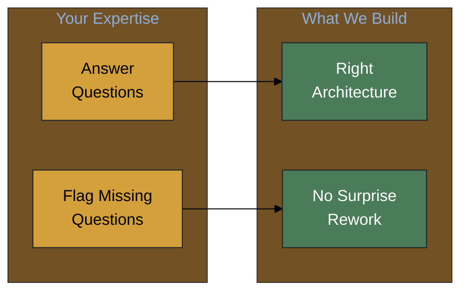
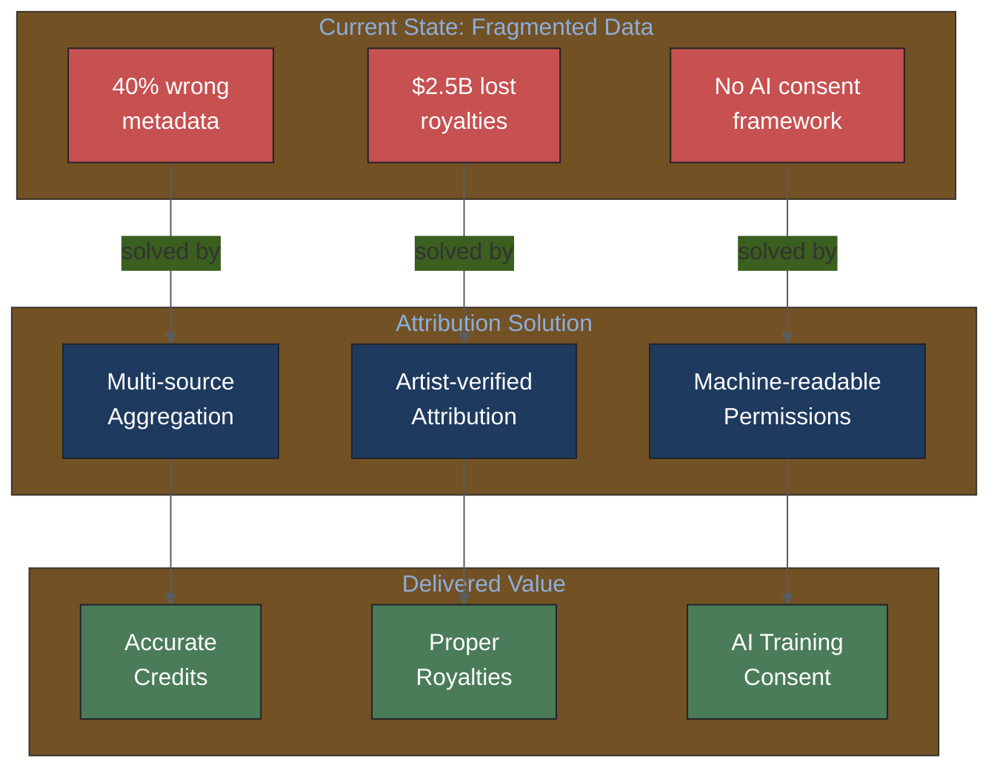
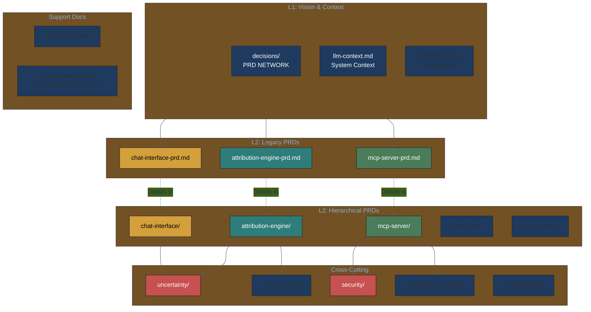
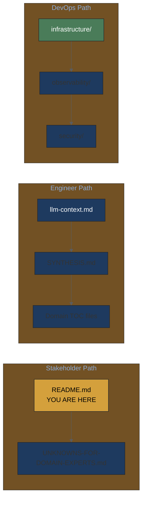
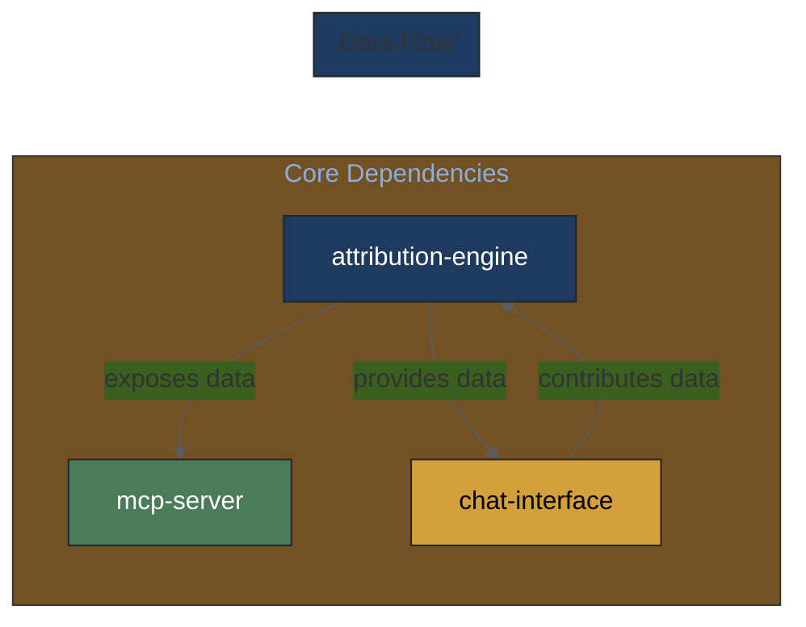
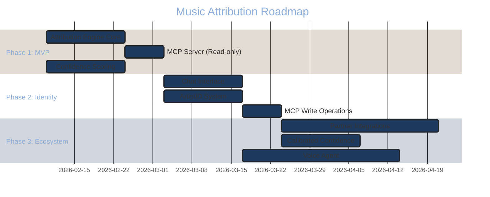
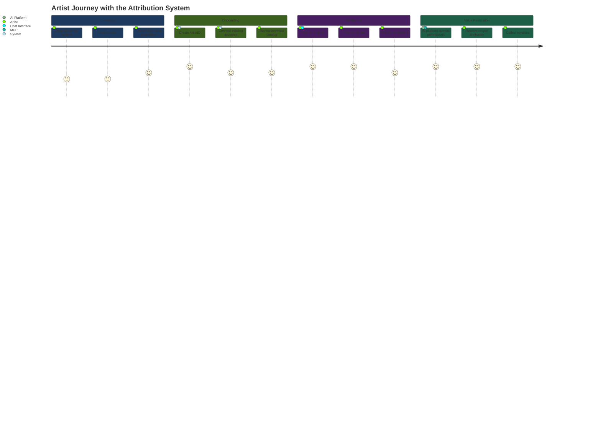
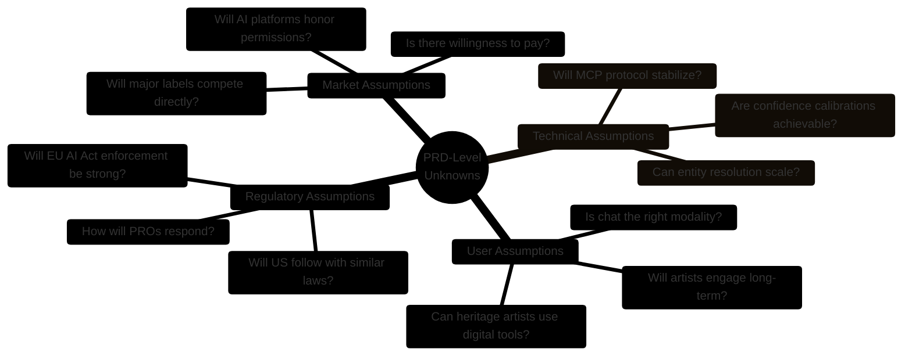

# Product Requirements Documents

This directory contains PRDs for the Music Attribution Scaffold.

---

## The Problem We're Solving

*40%+ of music metadata is wrong, causing $2.5B+ in unclaimed royalties annually. The scaffold unifies fragmented metadata into confidence-scored attribution records.*

---

## 🎯 For Imogen & Andy: We Need Your Input!

> **Before we build, we need your expertise.**
>
> We've created a structured questionnaire with questions that **only domain experts can answer**. Your input directly shapes our technical architecture and prevents costly rework later.

### 📋 [**→ UNKNOWNS-FOR-DOMAIN-EXPERTS.md**](UNKNOWNS-FOR-DOMAIN-EXPERTS.md)

| Section | Key Questions |
|---------|---------------|
| **Confidence & Trust** | What makes you trust automated data? When do you verify? |
| **Workflow & Scale** | How do you track credits today? How big is your catalog? |
| **Business & Revenue** | Cost of wrong credits? Who else needs this data? |
| **Edge Cases** | Pseudonyms? Uncredited work? AI contributions? |
| **Permissions & AI** | What can AI do without asking? What requires permission? |
| **Unknown Unknowns** | What questions should we have asked but didn't? |

**⏰ Earlier input = more influence on what we build.**

---

### How the Attribution System Creates Value

**For Stakeholders**: Each problem has a corresponding solution and delivered value. The system addresses all three critical pain points in the music industry.

**For Engineers**: Each value proposition maps to specific technical components. Multi-source aggregation is the Attribution Engine; artist verification is the Chat Interface; permissions are the MCP Server.

---

## Quick Navigation (For Both Audiences)

**For Stakeholders**: Start with the problem/solution overview above, then [UNKNOWNS-FOR-DOMAIN-EXPERTS.md](UNKNOWNS-FOR-DOMAIN-EXPERTS.md) to provide input.

**For Engineers**: Start with [llm-context.md](llm-context.md) for system context, then dive into specific domain TOCs.

---

## PRD Ecosystem

---

## PRD Index

### L1: Vision Documents

| PRD | Description | Status | Last Updated |
|-----|-------------|--------|--------------|
| *(vision content integrated into PRD decisions)* | Master vision and product strategy | Merged | 2026-02-14 |
| [llm-context.md](llm-context.md) | System prompt for AI assistants | Active | 2026-02-04 |
| [SYNTHESIS.md](SYNTHESIS.md) | Cross-PRD insights and decisions | Active | 2026-02-04 |

### L2: Legacy PRDs (Component Overviews)

| PRD | Description | Status | Last Updated |
|-----|-------------|--------|--------------|
| [attribution-engine-prd.md](attribution-engine-prd.md) | Multi-source attribution with confidence | Draft v0.8 | 2026-02-04 |
| [chat-interface-prd.md](chat-interface-prd.md) | Conversational gap-filling UX | Draft v0.8 | 2026-02-04 |
| [mcp-server-prd.md](mcp-server-prd.md) | MCP API for AI platforms | Draft v0.8 | 2026-02-04 |

### L2: Hierarchical PRD Domains

| Domain | TOC | Description |
|--------|-----|-------------|
| Attribution Engine | [toc-attribution-engine.md](attribution-engine/toc-attribution-engine.md) | Core data aggregation |
| Chat Interface | [toc-chat-interface.md](chat-interface/toc-chat-interface.md) | Gap-filling UX |
| MCP Server | [toc-mcp-server.md](mcp-server/toc-mcp-server.md) | AI platform API |
| Data Layer | [toc-data-layer.md](data-layer/toc-data-layer.md) | Database architecture |
| Voice Agent | [toc-voice-agent.md](voice-agent/toc-voice-agent.md) | Voice-first interface |

### Cross-Cutting PRD Domains

| Domain | TOC | Description |
|--------|-----|-------------|
| Uncertainty | [toc-uncertainty.md](uncertainty/toc-uncertainty.md) | Conformal prediction, calibration |
| Observability | [toc-observability.md](observability/toc-observability.md) | Langfuse, metrics |
| Security | [toc-security.md](security/toc-security.md) | MCP security, multi-tenancy |
| Identity & Permissions | [toc-identity-permissions.md](identity-permissions/toc-identity-permissions.md) | ArtistID, consent |
| Infrastructure | [toc-infrastructure.md](infrastructure/toc-infrastructure.md) | Deployment, ops |

### Support Documents

| Document | Description |
|----------|-------------|
| [REJECTED.md](REJECTED.md) | Why NOT to use certain technologies |
| [UNKNOWNS-FOR-DOMAIN-EXPERTS.md](UNKNOWNS-FOR-DOMAIN-EXPERTS.md) | Questions for Imogen/Andy |
| [defaults.yaml](defaults.yaml) | Current active configuration |
| [schema.yaml](schema.yaml) | PRD frontmatter schema |

---

## Document Reading Order by Role

**For Stakeholders**: Follow the yellow path. Start here, then read the vision document, then provide feedback via the unknowns document.

**For Engineers**: Follow the blue path. Start with system context, then cross-cutting synthesis, then dive into specific domains.

---

## Cross-PRD Dependencies

---

## Implementation Roadmap

---

---

## Stakeholder Journey Map

**For Stakeholders**: This shows the artist's emotional journey. High satisfaction (5) in chat-based gap-filling and value realization; medium satisfaction (3-4) in early discovery phases.

**For Engineers**: Low-satisfaction phases (Discovery, Onboarding) need UX optimization. High-satisfaction phases (Verification, Value) validate our core approach.

---

## Unknown Unknowns: What We Don't Know We Don't Know

This section captures fundamental uncertainties that could invalidate our assumptions.

### Critical Questions by Category

| Category | Question | Why It Matters | Monitoring Approach |
|----------|----------|----------------|---------------------|
| **Market** | Will AI platforms actually honor permissions? | If ignored, core value prop collapses | Track platform adoption, legal developments |
| **Market** | Will major labels build competing systems? | Could fragment ecosystem | Competitive intelligence, partnership outreach |
| **Technical** | Can entity resolution handle 100M+ records? | Scale determines viability | Load testing, architecture reviews |
| **Technical** | Will confidence calibration work with limited data? | Affects API usefulness | Calibration experiments, domain expert validation |
| **User** | Is conversational gap-filling engaging enough? | User retention depends on UX | Session analytics, A/B testing, dropout analysis |
| **Regulatory** | How strictly will EU AI Act be enforced? | Determines compliance urgency | Legal monitoring, industry working groups |

### Questions Only Domain Experts Can Answer

1. **Imogen/Andy**: What percentage of your catalog has incorrect credits that matter to you?
2. **Imogen/Andy**: Would you actually use a chat interface weekly, or prefer bulk upload?
3. **Rights Orgs**: Would you accept the system's data as an authoritative source?
4. **AI Platforms**: What level of attribution confidence would you require for training consent?

See [UNKNOWNS-FOR-DOMAIN-EXPERTS.md](UNKNOWNS-FOR-DOMAIN-EXPERTS.md) for the complete list.

---

## Probabilistic PRD System

The PRD system extends beyond traditional linear documents into a **Bayesian decision network** with conditional probabilities, team archetype modulation, and cross-domain applicability.

| Directory | Contents |
|-----------|----------|
| [decisions/](decisions/) | 23 decision nodes across 5 levels (L1 Business → L5 Operations) with conditional probability tables |
| [decisions/REPORT.md](decisions/REPORT.md) | Visual report with mermaid diagrams showing network topology, archetype comparisons, and scenario paths |
| [archetypes/](archetypes/) | 4 team profiles (engineer-heavy, musician-first, solo hacker, well-funded) that modulate decision probabilities |
| [scenarios/](scenarios/) | 3 composed paths through the network (music MVP, solo musician, DPP enterprise) |
| [domains/](domains/) | Domain overlay system — music attribution and DPP traceability share the same architecture |

Start with [decisions/README.md](decisions/README.md) for the conceptual model, or [decisions/REPORT.md](decisions/REPORT.md) for visual summaries.

---

## See Also

- [SYNTHESIS.md](SYNTHESIS.md) - Cross-PRD insights and decisions
- [REJECTED.md](REJECTED.md) - Why NOT to use certain technologies
- [UNKNOWNS-FOR-DOMAIN-EXPERTS.md](UNKNOWNS-FOR-DOMAIN-EXPERTS.md) - Questions for domain experts
- [../knowledge-base/](../knowledge-base/) - Domain and technical knowledge
- [../planning/probabilistic-prd-design.md](../planning/probabilistic-prd-design.md) - Probabilistic PRD design rationale
